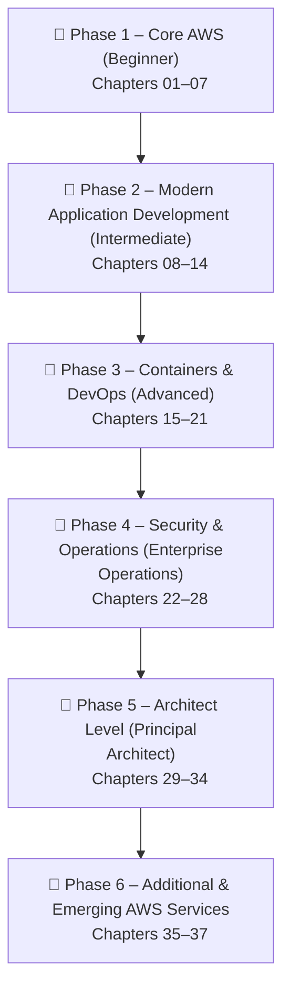

# AWS Master Course — Enterprise Learning Roadmap (Phases 1–6)

Welcome to the **AWS Master Course**, a comprehensive, enterprise-grade learning curriculum organized into 6 core learning phases across 37 production-grade chapters.

---

## 🗺️ Master Course Structure

---

## 📚 Global Table of Contents

### 📁 [Phase 1 – Core AWS (Beginner)](file:///c:/Users/nishu/workspace/wscs_bedrock/Uday_AWS_Services_notes/Phase_01_Core_AWS/README.md)
- **[Chapter 01 — AWS IAM](file:///c:/Users/nishu/workspace/wscs_bedrock/Uday_AWS_Services_notes/Phase_01_Core_AWS/Chapter_01_AWS_IAM.md)**
- **[Chapter 02 — Amazon S3](file:///c:/Users/nishu/workspace/wscs_bedrock/Uday_AWS_Services_notes/Phase_01_Core_AWS/Chapter_02_Amazon_S3.md)**
- **[Chapter 03 — Amazon EC2](file:///c:/Users/nishu/workspace/wscs_bedrock/Uday_AWS_Services_notes/Phase_01_Core_AWS/Chapter_03_Amazon_EC2.md)**
- **[Chapter 04 — Amazon VPC](file:///c:/Users/nishu/workspace/wscs_bedrock/Uday_AWS_Services_notes/Phase_01_Core_AWS/Chapter_04_Amazon_VPC.md)**
- **[Chapter 05 — Amazon CloudWatch](file:///c:/Users/nishu/workspace/wscs_bedrock/Uday_AWS_Services_notes/Phase_01_Core_AWS/Chapter_05_Amazon_CloudWatch.md)**
- **[Chapter 06 — Amazon RDS](file:///c:/Users/nishu/workspace/wscs_bedrock/Uday_AWS_Services_notes/Phase_01_Core_AWS/Chapter_06_Amazon_RDS.md)**
- **[Chapter 07 — Amazon Route 53](file:///c:/Users/nishu/workspace/wscs_bedrock/Uday_AWS_Services_notes/Phase_01_Core_AWS/Chapter_07_Amazon_Route_53.md)**

---

### 📁 [Phase 2 – Modern Application Development (Intermediate)](file:///c:/Users/nishu/workspace/wscs_bedrock/Uday_AWS_Services_notes/Phase_02_Modern_Application_Development/README.md)
- **[Chapter 08 — AWS Lambda](file:///c:/Users/nishu/workspace/wscs_bedrock/Uday_AWS_Services_notes/Phase_02_Modern_Application_Development/Chapter_08_AWS_Lambda.md)**
- **[Chapter 09 — Amazon API Gateway](file:///c:/Users/nishu/workspace/wscs_bedrock/Uday_AWS_Services_notes/Phase_02_Modern_Application_Development/Chapter_09_Amazon_API_Gateway.md)**
- **[Chapter 10 — Amazon DynamoDB](file:///c:/Users/nishu/workspace/wscs_bedrock/Uday_AWS_Services_notes/Phase_02_Modern_Application_Development/Chapter_10_Amazon_DynamoDB.md)**
- **[Chapter 11 — Amazon Cognito](file:///c:/Users/nishu/workspace/wscs_bedrock/Uday_AWS_Services_notes/Phase_02_Modern_Application_Development/Chapter_11_Amazon_Cognito.md)**
- **[Chapter 12 — Amazon SQS](file:///c:/Users/nishu/workspace/wscs_bedrock/Uday_AWS_Services_notes/Phase_02_Modern_Application_Development/Chapter_12_Amazon_SQS.md)**
- **[Chapter 13 — Amazon SNS](file:///c:/Users/nishu/workspace/wscs_bedrock/Uday_AWS_Services_notes/Phase_02_Modern_Application_Development/Chapter_13_Amazon_SNS.md)**
- **[Chapter 14 — Amazon EventBridge](file:///c:/Users/nishu/workspace/wscs_bedrock/Uday_AWS_Services_notes/Phase_02_Modern_Application_Development/Chapter_14_Amazon_EventBridge.md)**

---

### 📁 [Phase 3 – Containers & DevOps (Advanced)](file:///c:/Users/nishu/workspace/wscs_bedrock/Uday_AWS_Services_notes/Phase_03_Containers_and_DevOps/README.md)
- **[Chapter 15 — Amazon ECR](file:///c:/Users/nishu/workspace/wscs_bedrock/Uday_AWS_Services_notes/Phase_03_Containers_and_DevOps/Chapter_15_Amazon_ECR.md)**
- **[Chapter 16 — Amazon ECS](file:///c:/Users/nishu/workspace/wscs_bedrock/Uday_AWS_Services_notes/Phase_03_Containers_and_DevOps/Chapter_16_Amazon_ECS.md)**
- **[Chapter 17 — AWS Fargate](file:///c:/Users/nishu/workspace/wscs_bedrock/Uday_AWS_Services_notes/Phase_03_Containers_and_DevOps/Chapter_17_AWS_Fargate.md)**
- **[Chapter 18 — Elastic Load Balancing](file:///c:/Users/nishu/workspace/wscs_bedrock/Uday_AWS_Services_notes/Phase_03_Containers_and_DevOps/Chapter_18_Elastic_Load_Balancing.md)**
- **[Chapter 19 — AWS CodeBuild](file:///c:/Users/nishu/workspace/wscs_bedrock/Uday_AWS_Services_notes/Phase_03_Containers_and_DevOps/Chapter_19_AWS_CodeBuild.md)**
- **[Chapter 20 — AWS CodePipeline](file:///c:/Users/nishu/workspace/wscs_bedrock/Uday_AWS_Services_notes/Phase_03_Containers_and_DevOps/Chapter_20_AWS_CodePipeline.md)**
- **[Chapter 21 — AWS CloudFormation](file:///c:/Users/nishu/workspace/wscs_bedrock/Uday_AWS_Services_notes/Phase_03_Containers_and_DevOps/Chapter_21_AWS_CloudFormation.md)**

---

### 📁 [Phase 4 – Security & Operations (Enterprise Operations)](file:///c:/Users/nishu/workspace/wscs_bedrock/Uday_AWS_Services_notes/Phase_04_Security_and_Operations/README.md)
- **[Chapter 22 — AWS KMS](file:///c:/Users/nishu/workspace/wscs_bedrock/Uday_AWS_Services_notes/Phase_04_Security_and_Operations/Chapter_22_AWS_KMS.md)**
- **[Chapter 23 — AWS STS](file:///c:/Users/nishu/workspace/wscs_bedrock/Uday_AWS_Services_notes/Phase_04_Security_and_Operations/Chapter_23_AWS_STS.md)**
- **[Chapter 24 — AWS Secrets Manager](file:///c:/Users/nishu/workspace/wscs_bedrock/Uday_AWS_Services_notes/Phase_04_Security_and_Operations/Chapter_24_AWS_Secrets_Manager.md)**
- **[Chapter 25 — AWS Systems Manager (SSM)](file:///c:/Users/nishu/workspace/wscs_bedrock/Uday_AWS_Services_notes/Phase_04_Security_and_Operations/Chapter_25_AWS_Systems_Manager_SSM.md)**
- **[Chapter 26 — AWS CloudTrail](file:///c:/Users/nishu/workspace/wscs_bedrock/Uday_AWS_Services_notes/Phase_04_Security_and_Operations/Chapter_26_AWS_CloudTrail.md)**
- **[Chapter 27 — AWS Config](file:///c:/Users/nishu/workspace/wscs_bedrock/Uday_AWS_Services_notes/Phase_04_Security_and_Operations/Chapter_27_AWS_Config.md)**
- **[Chapter 28 — AWS Backup](file:///c:/Users/nishu/workspace/wscs_bedrock/Uday_AWS_Services_notes/Phase_04_Security_and_Operations/Chapter_28_AWS_Backup.md)**

---

### 📁 [Phase 5 – Architect Level (Principal Architect)](file:///c:/Users/nishu/workspace/wscs_bedrock/Uday_AWS_Services_notes/Phase_05_Architect_Level/README.md)
- **[Chapter 29 — Amazon CloudFront](file:///c:/Users/nishu/workspace/wscs_bedrock/Uday_AWS_Services_notes/Phase_05_Architect_Level/Chapter_29_Amazon_CloudFront.md)**
- **[Chapter 30 — AWS WAF & AWS Shield](file:///c:/Users/nishu/workspace/wscs_bedrock/Uday_AWS_Services_notes/Phase_05_Architect_Level/Chapter_30_AWS_WAF_and_AWS_Shield.md)**
- **[Chapter 31 — AWS Organizations & Control Tower](file:///c:/Users/nishu/workspace/wscs_bedrock/Uday_AWS_Services_notes/Phase_05_Architect_Level/Chapter_31_AWS_Organizations_and_Control_Tower.md)**
- **[Chapter 32 — AWS PrivateLink](file:///c:/Users/nishu/workspace/wscs_bedrock/Uday_AWS_Services_notes/Phase_05_Architect_Level/Chapter_32_AWS_PrivateLink.md)**
- **[Chapter 33 — Amazon ElastiCache](file:///c:/Users/nishu/workspace/wscs_bedrock/Uday_AWS_Services_notes/Phase_05_Architect_Level/Chapter_33_Amazon_ElastiCache.md)**
- **[Chapter 34 — Amazon OpenSearch Service](file:///c:/Users/nishu/workspace/wscs_bedrock/Uday_AWS_Services_notes/Phase_05_Architect_Level/Chapter_34_Amazon_OpenSearch_Service.md)**

---

### 📁 [Phase 6 – Additional & Emerging AWS Services](file:///c:/Users/nishu/workspace/wscs_bedrock/Uday_AWS_Services_notes/Phase_06_Additional_and_Emerging_AWS_Services/README.md)
- **[Chapter 35 — AWS Step Functions](file:///c:/Users/nishu/workspace/wscs_bedrock/Uday_AWS_Services_notes/Phase_06_Additional_and_Emerging_AWS_Services/Chapter_35_AWS_Step_Functions.md)**
- **[Chapter 36 — AWS IAM Identity Center](file:///c:/Users/nishu/workspace/wscs_bedrock/Uday_AWS_Services_notes/Phase_06_Additional_and_Emerging_AWS_Services/Chapter_36_AWS_IAM_Identity_Center.md)**
- **[Chapter 37 — Amazon Bedrock & Generative AI](file:///c:/Users/nishu/workspace/wscs_bedrock/Uday_AWS_Services_notes/Phase_06_Additional_and_Emerging_AWS_Services/Chapter_37_Amazon_Bedrock_and_GenAI.md)**
