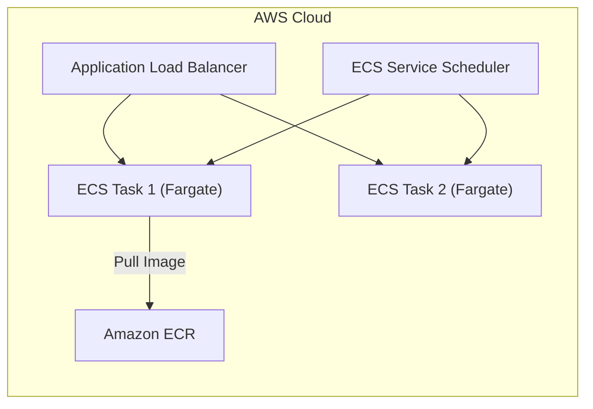
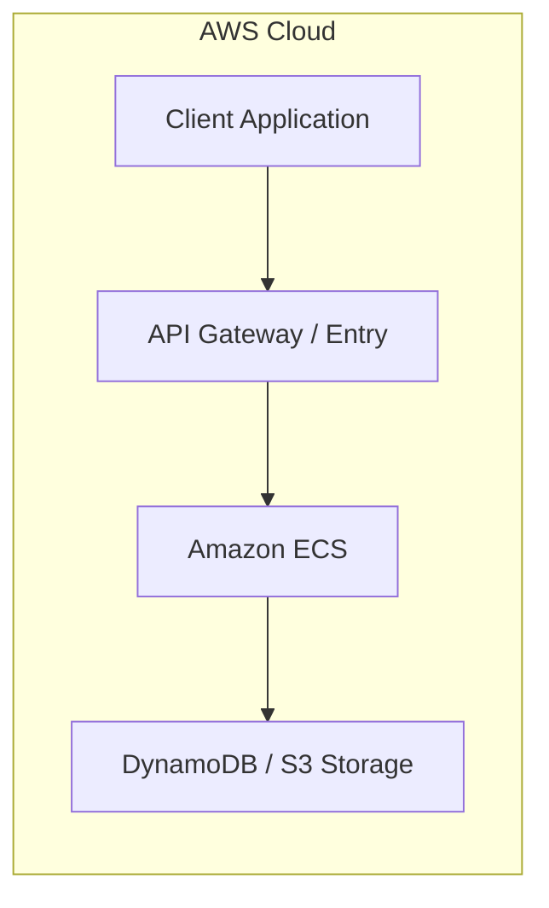

# Chapter 20: Amazon ECS — Elastic Container Service

---

## 1. Service Overview

### What is Amazon ECS?
Amazon Elastic Container Service (Amazon ECS) is a highly scalable, fast container management service that makes it easy to run, stop, and manage Docker containers on a cluster of EC2 instances or serverless AWS Fargate infrastructure.

### Why AWS Created It
Managing Docker containers at scale requires orchestration mechanisms for container placement, health checks, automatic restarts, rolling deployments, load balancer target registrations, and IAM security isolation. AWS created ECS to provide a deeply integrated AWS native container orchestrator without requiring customers to manage third-party control planes.

### Business Problem It Solves
- **Container Orchestration Simplification**: Manages lifecycle, deployment, and autoscaling of microservices.
- **Serverless Operations with Fargate**: Removes the need to provision, patch, or scale underlying EC2 container host instances.
- **Native AWS Integration**: Seamlessly integrates with ALB/NLB, ECR, IAM, CloudWatch, and AWS Secrets Manager.

### Key Terminology
- **Task Definition**: A blueprint (JSON specification) defining container parameters, environment variables, image URLs, CPU/memory limits, and port mappings.
- **Task**: An running instance of a Task Definition.
- **Service**: Maintains a specified number of running Task instances concurrently with autoscaling and ALB integration.
- **Cluster**: A logical grouping of tasks or services.
- **Launch Type**: Determines infrastructure deployment: **Fargate** (serverless) or **EC2** (managed host instances).

---

## 2. Learning Objectives
1. **Architect** containerized microservices architectures using Amazon ECS.
2. **Deploy** container tasks on Fargate serverless infrastructure.
3. **Configure** ECS Task Execution Roles, ALB Target Groups, and Task Autoscaling.
4. **Troubleshoot** task launch crashes (`Essential container in task exited`) in production.

---

## 3. Prerequisites
- Basic knowledge of Docker containers and Dockerfiles.
- Fundamentals of AWS VPC networking and IAM roles.

---

## 4. Real-world Analogy
Think of Amazon ECS as a **Cargo Container Shipping Terminal Director**.
- **Task Definition**: The manifest specifying what cargo (code & dependencies) goes into which container.
- **ECS Task**: A container being loaded onto a crane.
- **Fargate**: A high-tech automated dock where ships dock and unload automatically without hiring custom forklift operators.

---

## 5. Business Use Cases
- **Microservices Deployment**: Hosting hundreds of decoupled API microservices.
- **Batch Processing Jobs**: Triggering ephemeral Fargate container tasks for ETL jobs.

---

## 6. Core Concepts
- **Task Execution Role**: Used by the ECS agent to pull ECR container images and write CloudWatch Logs.
- **Task Role**: Used by your application code inside the container to interact with AWS services (S3, DynamoDB).

---

## 7. Internal Architecture



---

## 8. Service Components
- **Cluster**: Logical boundary.
- **Task Definition**: Container configuration.
- **Service**: Desired task count maintainer.

---

## 9. Configuration
Define CPU/Memory parameters, container definitions, port mappings, and log configurations in JSON/YAML task definitions.

---

## 10. Code Examples

### Python (Boto3)
```python
import boto3

ecs = boto3.client('ecs', region_name='us-east-1')

response = ecs.run_task(
    cluster='enterprise-cluster',
    launchType='FARGATE',
    taskDefinition='enterprise-api-task:1',
    count=1,
    networkConfiguration={
        'awsvpcConfiguration': {
            'subnets': ['subnet-0123456789abcdef0'],
            'securityGroups': ['sg-0123456789abcdef0'],
            'assignPublicIp': 'ENABLED'
        }
    }
)
print("Run Task Status:", response['tasks'][0]['lastStatus'])
```

### AWS CLI
```bash
aws ecs run-task     --cluster enterprise-cluster     --launch-type FARGATE     --task-definition enterprise-api-task:1     --network-configuration "awsvpcConfiguration={subnets=[subnet-0123456789abcdef0],securityGroups=[sg-0123456789abcdef0],assignPublicIp=ENABLED}"
```

### Terraform
```hcl
resource "aws_ecs_cluster" "main" {
  name = "enterprise-cluster"
}

resource "aws_ecs_task_definition" "app" {
  family                   = "enterprise-api-task"
  network_mode             = "awsvpc"
  requires_compatibilities = ["FARGATE"]
  cpu                      = "256"
  memory                   = "512"
  execution_role_arn       = aws_iam_role.ecs_execution_role.arn

  container_definitions = jsonencode([{
    name      = "api-container"
    image     = "123456789012.dkr.ecr.us-east-1.amazonaws.com/api:latest"
    essential = true
    portMappings = [{
      containerPort = 8080
      hostPort      = 8080
    }]
  }])
}
```

### CloudFormation
```yaml
Resources:
  ECSCluster:
    Type: AWS::ECS::Cluster
    Properties:
      ClusterName: enterprise-cluster
```

---

## 11. Line-by-Line Explanation
- **Line 1–5**: Instantiates the Boto3 ECS client.
- **Line 6–17**: Executes `run_task` using `FARGATE` launch type, specifying subnet IDs and security group mappings for the container task.

---

## 12. Security Deep Dive
- Enforce IAM Task Roles to grant containerized applications granular AWS permissions.
- Enable ECR Image Scanning to block vulnerable images from launching.

---

## 13. Monitoring & Observability
- **CloudWatch Container Insights**: Track CPU, Memory, Network IO, and Storage utilization at cluster, service, and task levels.

---

## 14. Performance & Cost Optimization
- Utilize Fargate Spot instances for non-production environments to save up to 70%.

---

## 15. Enterprise Integration
ECS integrates natively with ALB for traffic balancing, ECR for container image hosting, CloudWatch for logging, and Secrets Manager for environment variables.

---

## 16. Real Industry Use Cases
- Microservice orchestration for enterprise web applications.

---

## 17. Architecture Patterns



---

# Production Incident War Room

## Incident 1: Task Crash Loop (`Essential container in task exited`)
### Incident Summary
A newly deployed ECS Service failed to start, with tasks continuously crashing and stopping immediately after launch.

### Symptoms
- Task status transitions from `PENDING` -> `RUNNING` -> `STOPPED`.
- Stopped Reason: `Essential container in task exited`.

### Possible Causes
- Application startup crash inside container (missing environment variable, invalid DB endpoint).
- Docker image entrypoint script exit code non-zero.
- Task execution role lacks permissions to pull container image from ECR.

### Investigation Steps
1. Run `aws ecs describe-tasks --cluster enterprise-cluster --tasks <task-id>`.
2. Inspect the `stoppedReason` and exit code.
3. Check CloudWatch log group `/ecs/enterprise-api-task` for container stdout/stderr log output.

### CloudWatch Logs
`/ecs/enterprise-api-task`:
```text
[ERROR] Failed to start application: KeyError 'DATABASE_URL' is missing. Exiting with code 1.
```

### Root Cause Analysis
The application container failed at startup due to a missing environment variable `DATABASE_URL` in the ECS Task Definition.

### Immediate Mitigation
- Update Task Definition to supply the missing environment variable and update the ECS Service.

### Permanent Resolution
- Enforce strict environment variable validation in deployment pipelines before registering Task Definitions.

---

## 19. Production Best Practices (Well-Architected)
- Use Fargate for serverless container execution.
- Store sensitive credentials in Secrets Manager and reference them via Task Definition secrets.

---

## 20. Migration Strategies
- Containerize legacy applications using Docker and deploy to ECS Fargate behind an ALB.

---

## 21. CI/CD Integration
Use AWS CodePipeline and CodeBuild to build Docker images, push to ECR, and deploy updated Task Definitions to ECS Services automatically.

---

## 22. Practical Projects
- **Enterprise**: Production ECS Fargate cluster hosting microservices with ALB and Container Insights enabled.

---

## 23. Interview Preparation
- **Q1**: What is the difference between ECS Task Execution Role and ECS Task Role?
  - **Answer**: Task Execution Role is used by the ECS container agent (to pull images, write CloudWatch logs), whereas Task Role is used by the application running inside the container to make AWS API calls.

---

## 24. AWS Certification Practice
- **Question**: Which launch type should be selected to run containers without provisioning EC2 instances?
  - **Answer**: AWS Fargate.

---

## 25. Knowledge Check
1. What happens when an essential container exits in an ECS Task? (The entire task is stopped by the ECS agent).

---

## 26. Cheat Sheet
| Feature | Limit / Specification |
| :--- | :--- |
| **Launch Types** | Fargate, EC2, External (ECS Anywhere) |
| **Network Modes** | awsvpc, bridge, host, none |

---

## 27. Chapter Summary
Amazon ECS provides a powerful, deeply integrated container orchestration platform that simplifies container management with serverless Fargate support.

---

## 28. Further Learning
- [Amazon ECS Developer Guide](https://docs.aws.amazon.com/AmazonECS/latest/developerguide/)
