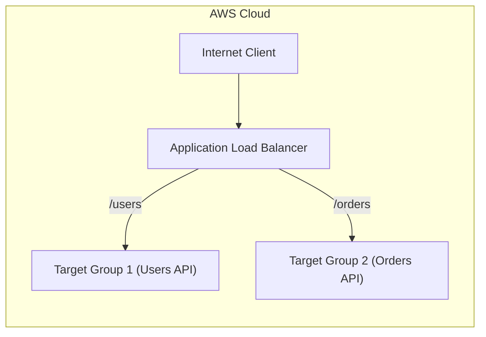
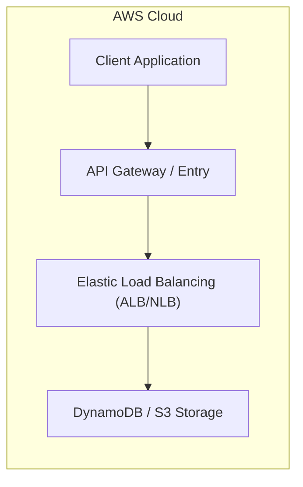

# Chapter 21: Elastic Load Balancing — ALB & NLB

---

## 1. Service Overview

### What is Elastic Load Balancing (ELB)?
Elastic Load Balancing (ELB) automatically distributes incoming application traffic across multiple targets—such as EC2 instances, containers, IP addresses, and Lambda functions—in one or more Availability Zones.

### Why AWS Created It
High availability applications require distributing client requests dynamically across scalable backend compute targets while monitoring target health and terminating unhealthy nodes automatically. AWS created ELB to provide seamless, scalable traffic distribution with built-in fault tolerance.

### Key Types
- **Application Load Balancer (ALB)**: Operates at Layer 7 (HTTP/HTTPS), supporting content-based routing, host-header routing, path-based routing, and WebSockets.
- **Network Load Balancer (NLB)**: Operates at Layer 4 (TCP/UDP/TLS), capable of handling millions of requests per second with ultra-low latency.

---

## 2. Learning Objectives
1. **Architect** scalable traffic distribution using ALB and NLB.
2. **Configure** target groups, health check thresholds, SSL/TLS certificates (ACM), and listener rules.
3. **Diagnose** HTTP 502/503/504 errors in production incident war rooms.

---

## 3. Prerequisites
- VPC Networking, Subnets, Security Groups, and HTTP/TCP protocol fundamentals.

---

## 4. Real-world Analogy
Think of an Application Load Balancer as a **Concert Venue Ushering System**.
- **Listener Rule**: Checking tickets at the gate (VIP vs General Admission).
- **Target Groups**: Directing VIP ticket holders to Section A and General Admission to Section B based on request path or headers.

---

## 5. Business Use Cases
- **Microservices Path Routing**: Routing `/api/v1/users` to User ECS Service and `/api/v1/orders` to Order ECS Service.
- **Ultra-low Latency Gaming/IoT**: Routing TCP socket connections using NLB.

---

## 6. Core Concepts
- **Listeners**: Process incoming connections based on port and protocol.
- **Target Groups**: Logical group of compute targets monitored by periodic health checks.

---

## 7. Internal Architecture



---

## 8. Service Components
- Listener, Listener Rule, Target Group, Health Check Config.

---

## 9. Configuration
Configure sticky sessions, SSL offloading with AWS Certificate Manager (ACM), and cross-zone load balancing.

---

## 10. Code Examples

### Python (Boto3)
```python
import boto3

elbv2 = boto3.client('elbv2', region_name='us-east-1')

response = elbv2.create_load_balancer(
    Name='enterprise-alb',
    Subnets=['subnet-0123456789abcdef0', 'subnet-0fedcba9876543210'],
    SecurityGroups=['sg-0123456789abcdef0'],
    Scheme='internet-facing',
    Type='application',
    IpAddressType='ipv4'
)
print("ALB ARN:", response['LoadBalancers'][0]['LoadBalancerArn'])
```

### AWS CLI
```bash
aws elbv2 create-load-balancer     --name enterprise-alb     --subnets subnet-0123456789abcdef0 subnet-0fedcba9876543210     --security-groups sg-0123456789abcdef0     --scheme internet-facing     --type application
```

### Terraform
```hcl
resource "aws_lb" "enterprise" {
  name               = "enterprise-alb"
  internal           = false
  load_balancer_type = "application"
  security_groups    = [aws_security_group.alb_sg.id]
  subnets            = [aws_subnet.public_a.id, aws_subnet.public_b.id]
}
```

### CloudFormation
```yaml
Resources:
  ApplicationLoadBalancer:
    Type: AWS::ElasticLoadBalancingV2::LoadBalancer
    Properties:
      Name: enterprise-alb
      Scheme: internet-facing
      Type: application
```

---

## 11. Line-by-Line Explanation
- **Line 1–5**: Initializes the Boto3 `elbv2` client for Layer 7 load balancers.
- **Line 6–13**: Creates an internet-facing ALB across two public subnets mapped to a dedicated security group.

---

## 12. Security Deep Dive
- Integrate ALB with **AWS WAF** to protect against SQL injection and cross-site scripting (XSS).

---

## 13. Monitoring & Observability
- **Metrics**: `RequestCount`, `TargetResponseTime`, `HTTPCode_Target_5XX_Count`, `HealthyHostCount`, `UnHealthyHostCount`.

---

## 14. Performance & Cost Optimization
- Enable Cross-Zone Load Balancing for equal traffic distribution across AZs.

---

## 15. Enterprise Integration
Integrates with ECS, EC2, Lambda, WAF, Route 53, and ACM.

---

## 16. Real Industry Use Cases
- Multi-region high availability web applications with SSL termination.

---

## 17. Architecture Patterns



---

# Production Incident War Room

## Incident 1: HTTP 502 Bad Gateway Errors
### Incident Summary
Clients receiving HTTP 502 errors when submitting requests through the ALB.

### Symptoms
- ALB metric `HTTPCode_ELB_502_Count` spikes.
- User requests fail with `502 Bad Gateway`.

### Possible Causes
- Target backend closed the connection prematurely before ALB sent full response.
- Target health check failed and no healthy targets remain.
- Target keep-alive timeout shorter than ALB keep-alive timeout.

### Root Cause Analysis
Backend Node.js service keep-alive timeout was set to 5 seconds, whereas ALB idle timeout was 60 seconds. ALB attempted to reuse a connection that the backend closed.

### Mitigation
Increase backend service keep-alive timeout to 65 seconds (greater than ALB's 60-second idle timeout).

---

## 19. Production Best Practices (Well-Architected)
- Always deploy load balancers across at least two public subnets in different Availability Zones.

---

## 20. Migration Strategies
- Migrate legacy hardware load balancers (F5) to AWS ALB/NLB.

---

## 21. CI/CD Integration
Register new container target IPs automatically into ALB Target Groups during deployment stages.

---

## 22. Practical Projects
- **Enterprise**: ALB with WAF integration, HTTPS redirection, ACM SSL termination, and path-based routing to multi-service ECS Fargate task target groups.

---

## 23. Interview Preparation
- **Q1**: How do you fix HTTP 502 errors on an ALB?
  - **Answer**: Ensure the backend application keep-alive timeout is configured to be longer than the ALB idle timeout.

---

## 24. AWS Certification Practice
- **Question**: Which load balancer type supports TCP traffic with static IP addresses?
  - **Answer**: Network Load Balancer (NLB).

---

## 25. Knowledge Check
1. Difference between ALB and NLB? (ALB operates at Layer 7 HTTP/HTTPS; NLB operates at Layer 4 TCP/UDP).

---

## 26. Cheat Sheet
| Feature | ALB | NLB |
| :--- | :--- | :--- |
| **OSI Layer** | Layer 7 (HTTP/HTTPS) | Layer 4 (TCP/UDP/TLS) |
| **Static IP** | No (Elastic IP via NLB) | Yes (One Elastic IP per AZ) |

---

## 27. Chapter Summary
Elastic Load Balancing provides the foundation for scalable, resilient, and secure AWS networking architectures.

---

## 28. Further Learning
- [Elastic Load Balancing User Guide](https://docs.aws.amazon.com/elb/)
