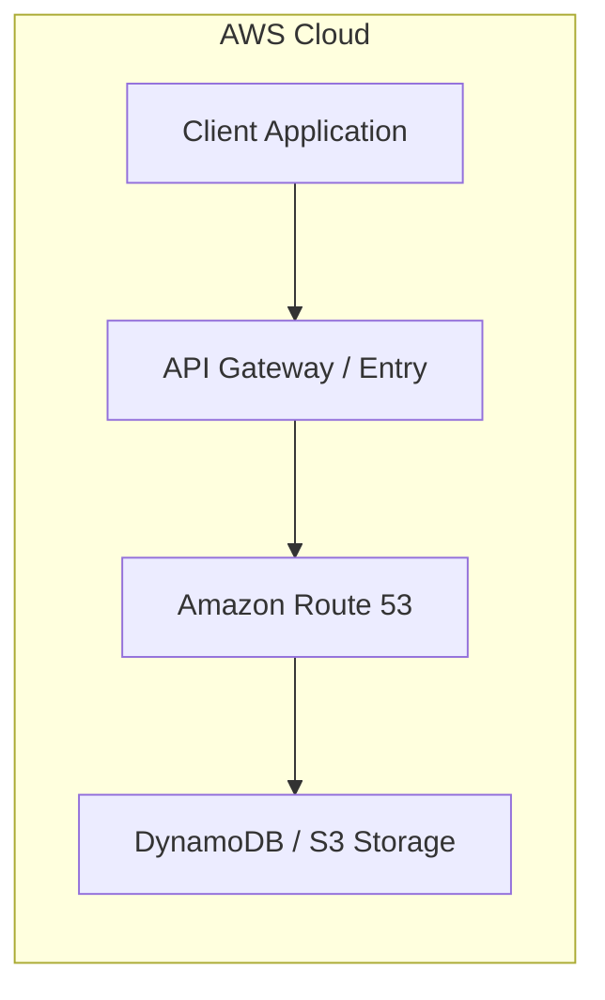

# Chapter 22: Amazon Route 53 — Highly Available DNS Service

---

## 1. Service Overview

### What is Amazon Route 53?
Amazon Route 53 is a highly available and scalable cloud Domain Name System (DNS) web service designed to route end-user requests to internet applications running on AWS or on-premises infrastructure.

### Key Routing Policies
- **Simple Routing**: Standard 1:1 DNS query response.
- **Weighted Routing**: Distribute traffic across resources based on specified relative weights.
- **Latency Routing**: Route requests to the AWS region that provides the lowest network latency.
- **Failover Routing**: Active-Passive disaster recovery failover based on Route 53 health check status.
- **Geolocation & Geoproximity**: Route traffic based on user geographic location or physical proximity.

---

## 2. Learning Objectives
1. Configure Hosted Zones, Alias records, and Routing Policies.
2. Implement DNS failover architectures.

---

## 7. Internal Architecture

```mermaid
graph LR
    subgraph aws["AWS Cloud"]
        user["User Browser"]
        r53["Amazon Route 53"]
        primary["Primary Region (ALB / EC2)"]
        secondary["Secondary DR Region (S3 / ALB)"]

        user -->|DNS Query| r53
        r53 -->|Active (Healthy)| primary
        r53 -.->|Failover (Unhealthy)| secondary
    end
```

---

## 10. Code Examples

### Python (Boto3)
```python
import boto3

route53 = boto3.client('route53')

response = route53.create_hosted_zone(
    Name='example.com',
    CallerReference='unique-req-001'
)
print("Hosted Zone ID:", response['HostedZone']['Id'])
```

### AWS CLI
```bash
aws route53 create-hosted-zone --name example.com --caller-reference unique-req-001
```

---

## 17. Architecture Patterns



---

# Production Incident War Room

## Incident 1: DNS Resolution Failure During Regional Outage
### Incident Summary
Secondary region failed to receive traffic during primary region outage due to unconfigured health checks on Alias records.

### Root Cause Analysis
Alias records did not evaluate target health (`EvaluateTargetHealth=False`), preventing automatic failover.

---

## 26. Cheat Sheet
| Record Type | Description |
| :--- | :--- |
| **A Record** | Maps hostname to IPv4 address |
| **Alias Record** | AWS-specific smart routing record to ALB/CloudFront/S3 without DNS lookup cost |

---

## 27. Chapter Summary
Route 53 powers global DNS routing and automated disaster recovery failover.
