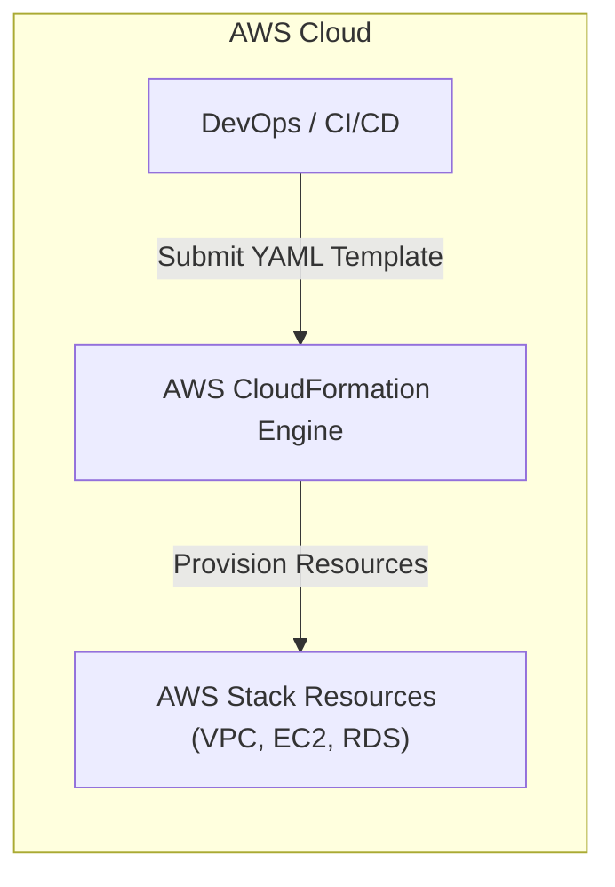
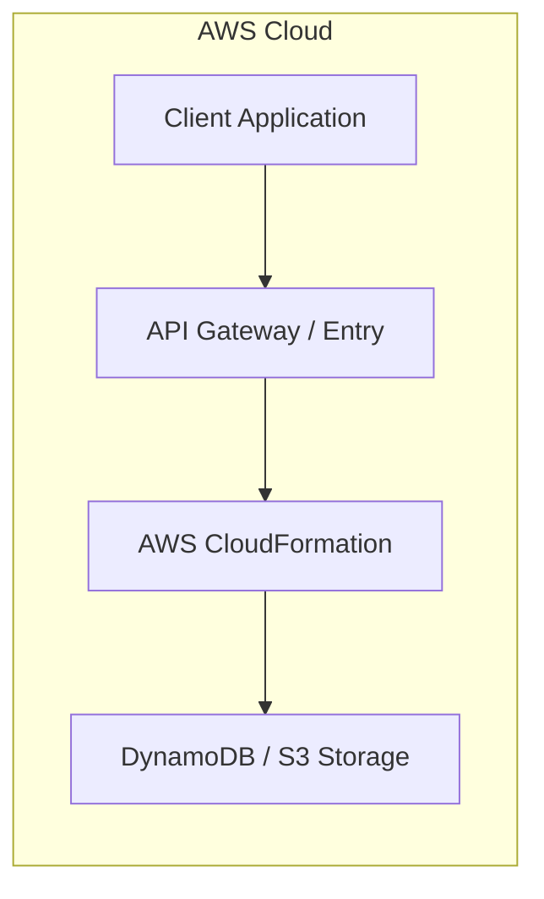

# Chapter 23: AWS CloudFormation — Infrastructure as Code

---

## 1. Service Overview

### What is AWS CloudFormation?
AWS CloudFormation is an Infrastructure as Code (IaC) service that allows you to model, provision, and manage AWS and third-party resources by declaring them in JSON or YAML templates.

---

## 7. Internal Architecture



---

## 10. Code Examples

### CloudFormation (YAML)
```yaml
AWSTemplateFormatVersion: '2010-09-09'
Description: Enterprise Web Server Stack
Parameters:
  InstanceType:
    Type: String
    Default: t3.micro
Resources:
  WebServer:
    Type: AWS::EC2::Instance
    Properties:
      InstanceType: !Ref InstanceType
      ImageId: ami-0c55b159cbfafe1f0
```

---

## 17. Architecture Patterns



---

# Production Incident War Room

## Incident 1: Stack Update Rollback Failed (`DELETE_FAILED`)
### Incident Summary
CloudFormation stack update failed and stuck in `UPDATE_ROLLBACK_FAILED` due to non-empty S3 bucket.

### Resolution
Manually empty the S3 bucket or skip the resource during rollback via `--resources-to-skip`.

---

## 27. Chapter Summary
CloudFormation enables consistent, repeatable, automated infrastructure deployments.
