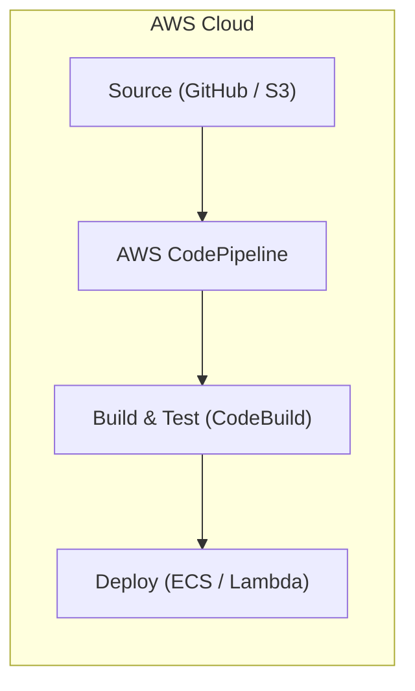
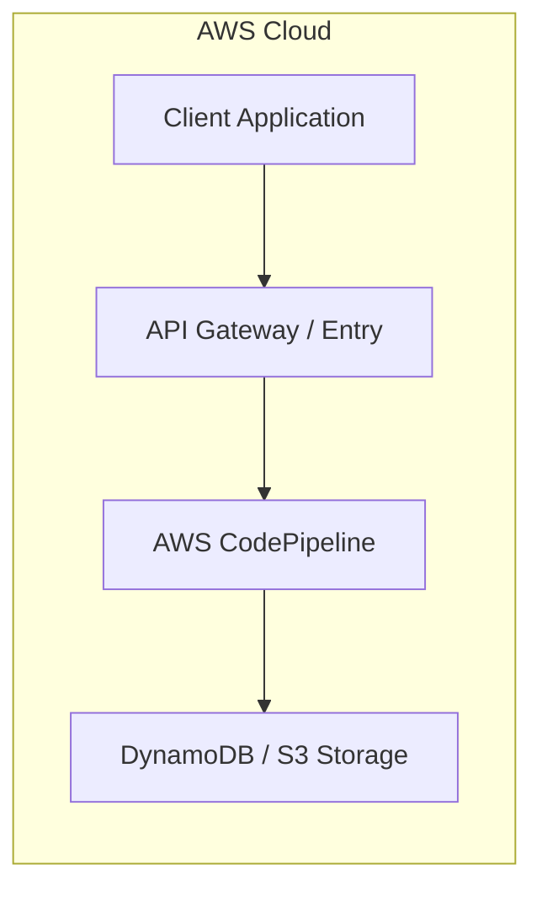

# Chapter 24: AWS CodePipeline — Continuous Delivery Service

---

## 1. Service Overview
AWS CodePipeline is a fully managed continuous delivery service that automates release pipelines for fast and reliable application and infrastructure updates.

---

## 7. Internal Architecture

---

## 17. Architecture Patterns

---

# Production Incident War Room

## Incident 1: Pipeline Execution Blocked on Artifact Encryption Key
### Cause
CodeBuild phase could not decrypt S3 artifact due to missing KMS key permission.

---

## 27. Chapter Summary
CodePipeline automates CI/CD workflows from source code check-in to production deployment.
