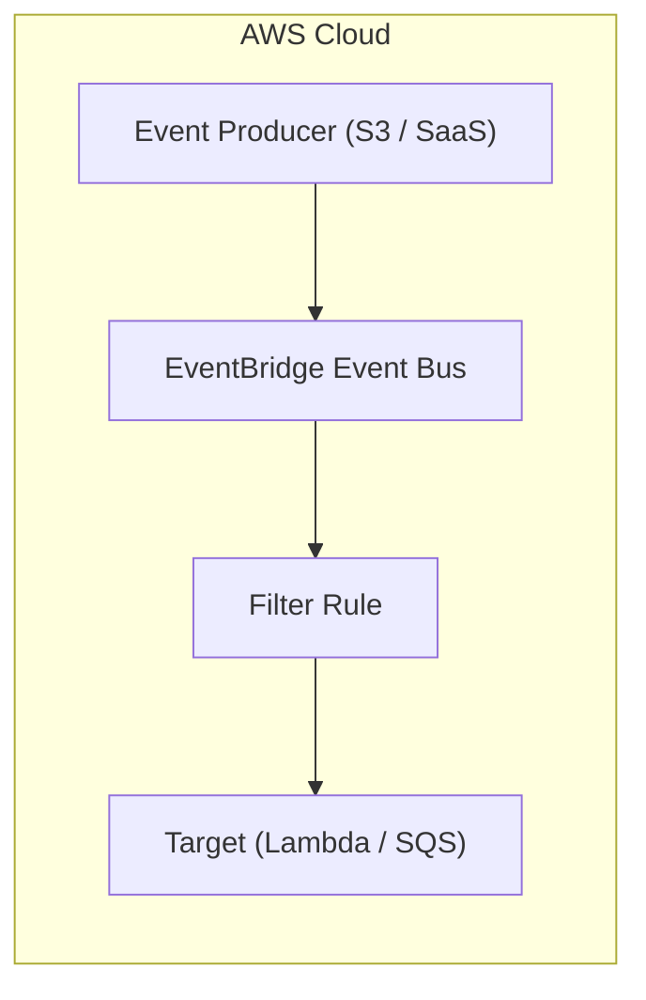
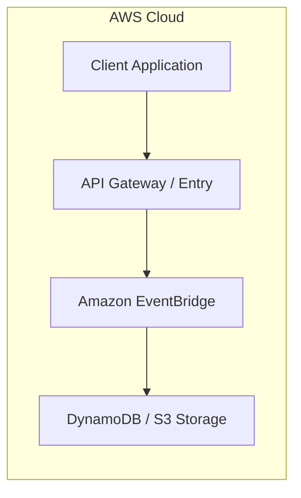

# Chapter 25: Amazon EventBridge — Event-Driven Serverless Bus

---

## 1. Service Overview
Amazon EventBridge is a serverless event bus service that makes it easy to connect applications using data from your own applications, integrated Software-as-a-Service (SaaS) applications, and AWS services.

---

## 7. Internal Architecture

---

## 17. Architecture Patterns

---

# Production Incident War Room

## Incident 1: Events Dropped Due to Invalid Event Pattern Match
### Cause
JSON payload field casing mismatch in EventBridge rule pattern.

---

## 27. Chapter Summary
EventBridge simplifies event-driven decoupling across cloud applications.
