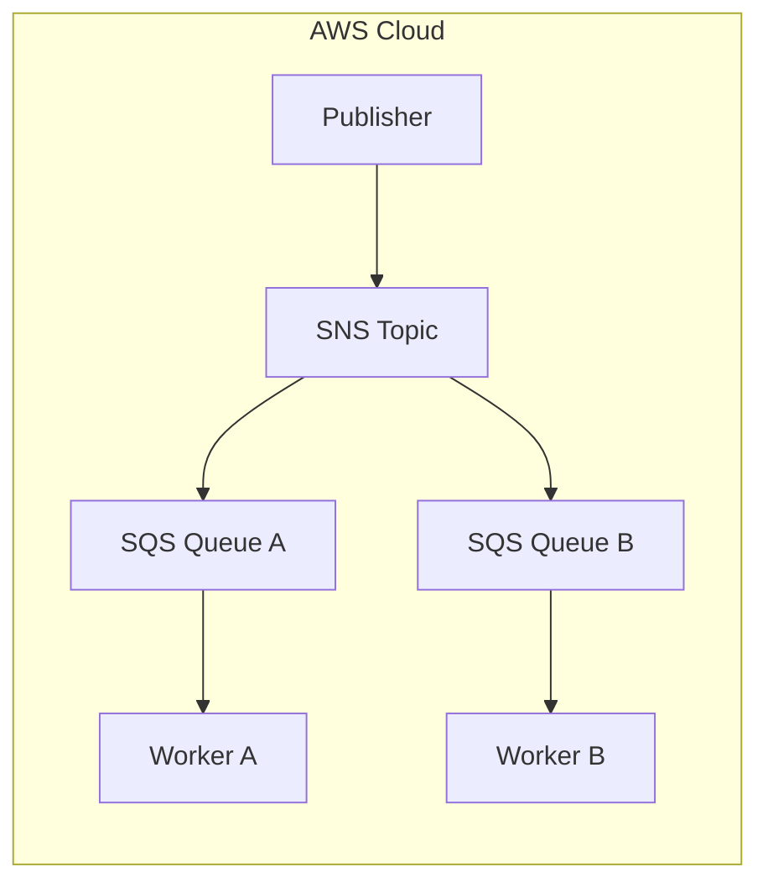
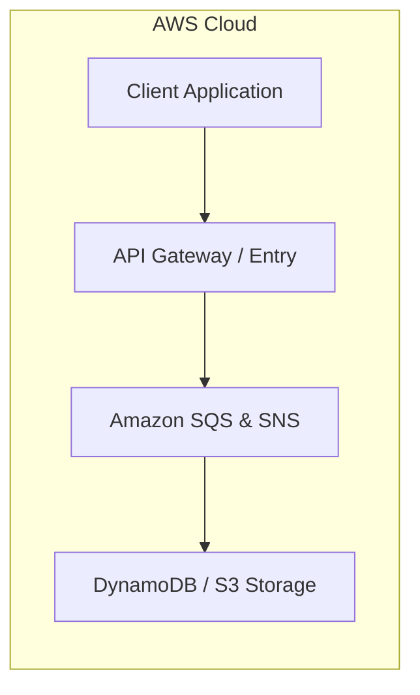

# Chapter 26: Amazon SQS & Amazon SNS — Messaging & Notification

---

## 1. Service Overview
Amazon SQS (Simple Queue Service) provides message queuing for decoupling distributed components. Amazon SNS (Simple Notification Service) provides pub/sub messaging for high-throughput fan-out notifications.

---

## 7. Internal Architecture

---

## 17. Architecture Patterns

---

# Production Incident War Room

## Incident 1: SQS Message Poison Pill Loops
### Cause
Failed message returned to queue indefinitely without Dead-Letter Queue (DLQ) configured.

---

## 27. Chapter Summary
SQS and SNS form the core of asynchronous messaging and fan-out decoupling on AWS.
