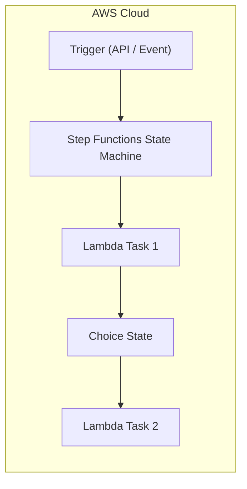
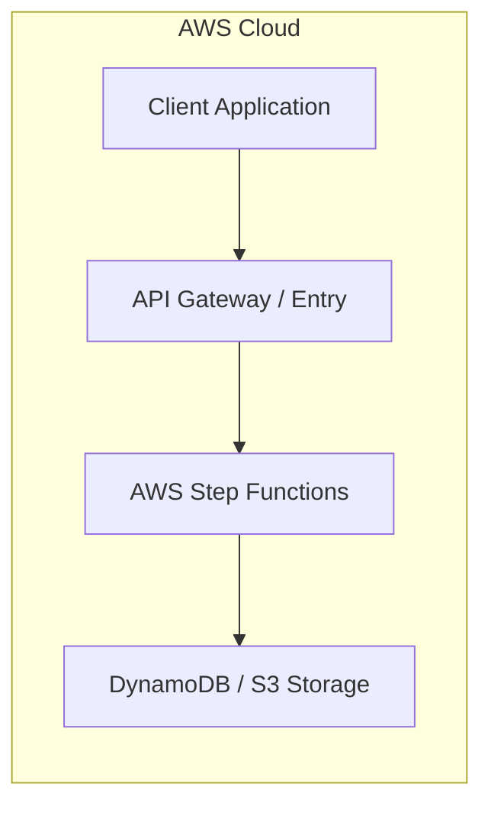

# Chapter 27: AWS Step Functions — Serverless Workflow Orchestration

---

## 1. Service Overview
AWS Step Functions is a visual workflow service that helps developers build distributed applications, automate processes, orchestrate microservices, and create data pipelines using AWS services.

---

## 7. Internal Architecture

---

## 17. Architecture Patterns

---

# Production Incident War Room

## Incident 1: Workflow Execution Stuck in Running State
### Cause
Task state missing explicit timeout constraint (`TimeoutSeconds`).

---

## 27. Chapter Summary
Step Functions coordinates multi-step microservice workflows with built-in state management and error handling.
