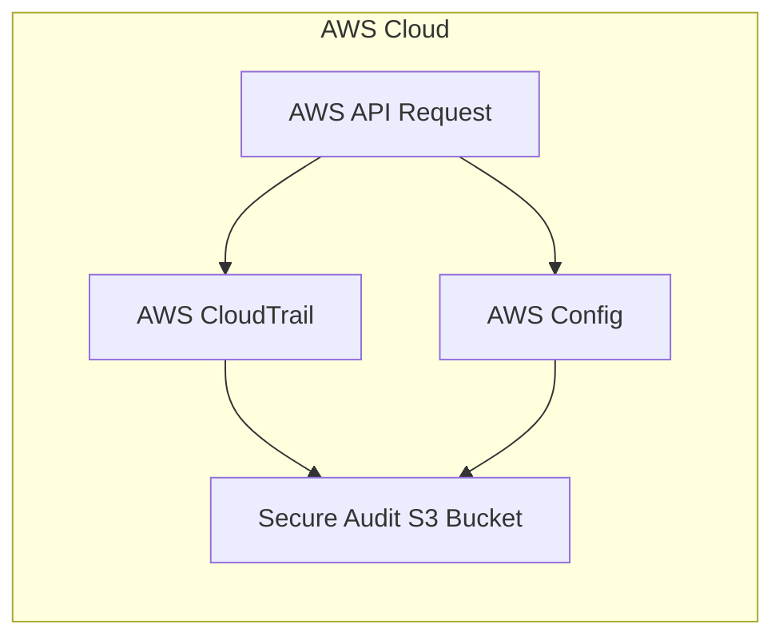
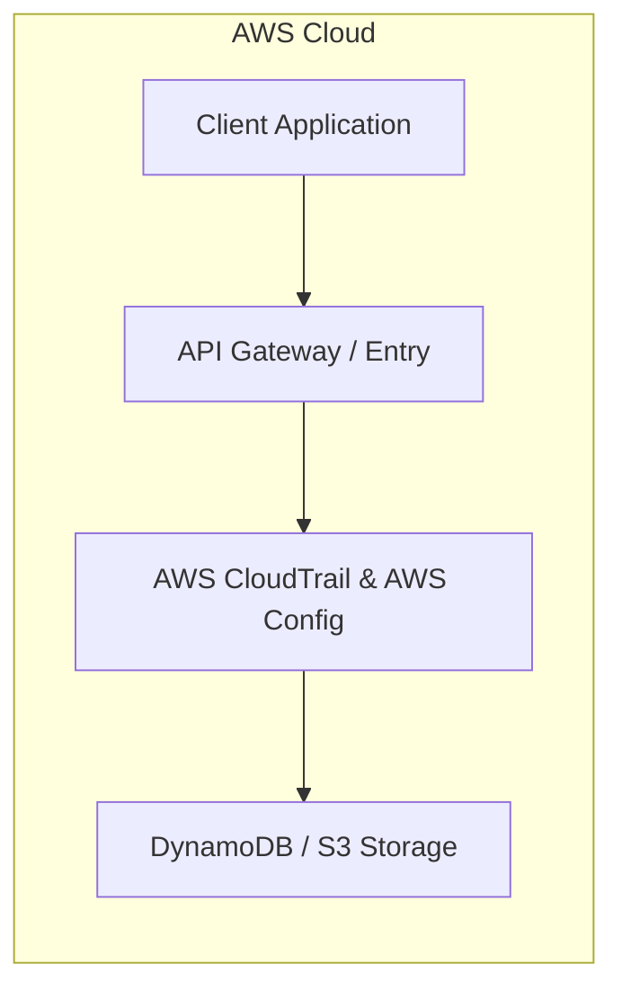

# Chapter 28: AWS CloudTrail & AWS Config — Audit & Compliance

---

## 1. Service Overview
AWS CloudTrail records API calls and user activity across your AWS infrastructure. AWS Config continuously monitors and records AWS resource configurations and evaluates compliance against desired rules.

---

## 7. Internal Architecture

---

## 17. Architecture Patterns

---

# Production Incident War Room

## Incident 1: Unregistered Security Group Ingress Rule Not Auto-Remediated
### Cause
AWS Config Remediation Execution IAM Role missing EC2 revoke permissions.

---

## 27. Chapter Summary
CloudTrail and Config provide continuous governance, auditing, security visibility, and compliance enforcement across enterprise AWS environments.
