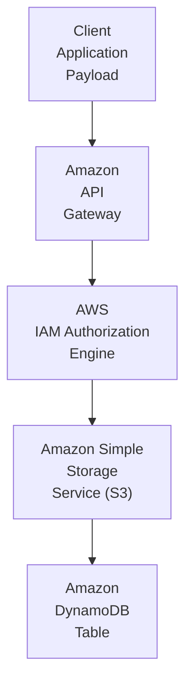
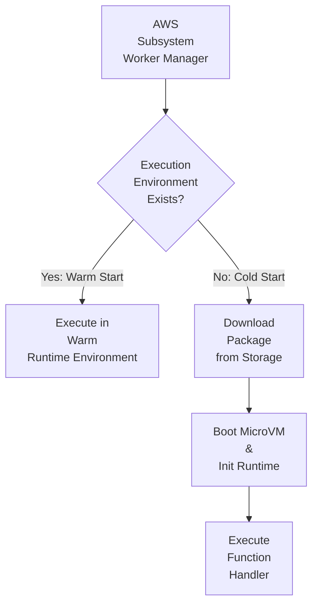
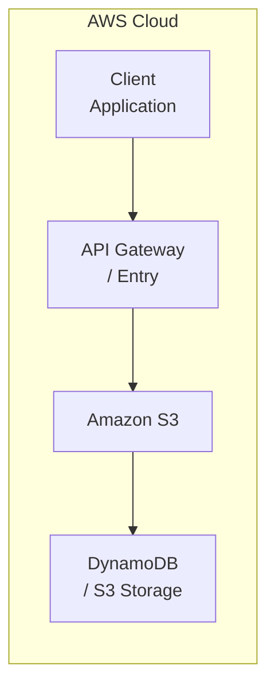

# Chapter 02: Amazon S3 — Simple Storage Service

---

## 1. Service Overview

### What is Amazon S3?
Amazon S3 is an enterprise-grade cloud service in the **Storage** domain provided by Amazon Web Services. It abstracts underlying infrastructure complexity while providing scalable, highly available, and secure cloud capabilities.

### Why AWS Created It
AWS engineered Amazon S3 to address critical challenges in modern infrastructure, eliminating manual provisioning, high fixed capital expenses, operational fragility, and scaling bottlenecks inherent in traditional compute and storage setups.

### Business Problem It Solves
- **Cost Reduction**: Replaces expensive upfront infrastructure investments with pay-as-you-go cloud pricing models.
- **Operational Efficiency**: Automates administrative tasks, compliance checks, and maintenance overhead.
- **Scalability & Resilience**: Built-in multi-AZ redundancy and automatic scaling handling workloads from small prototypes to millions of concurrent requests.

### Evolution and History
From its initial release to its current enterprise iteration, Amazon S3 has continuously evolved with feature additions including improved security controls, regional availability, performance enhancements, and native integrations across the AWS ecosystem.

### Key Terminology
- **Amazon S3 Instance / Resource**: The primary managed unit configured within your AWS account.
- **Access Policy**: IAM or resource-based JSON document defining authorized actions.
- **Endpoint**: The regional network address through which requests interact with the service.

### Where It Fits in AWS
Amazon S3 forms a foundational pillar in enterprise architectures, integrating seamlessly with compute, storage, security, and observability tools across AWS.

---

## 2. Learning Objectives
1. **Master** core architectural concepts and internal mechanisms of Amazon S3.
2. **Design** secure, highly available, and cost-effective solutions utilizing Amazon S3.
3. **Implement** infrastructure via Python (Boto3), Terraform, AWS CDK, and AWS CLI.
4. **Troubleshoot and Secure** production workloads using least-privilege policies and CloudWatch metrics.

---

## 3. Prerequisites
- Basic familiarity with AWS Cloud concepts (Regions, Availability Zones, IAM).
- Understanding of JSON data format and command-line interfaces.

---

## 4. Real-world Analogy
Think of **Amazon S3** as a **A Global Automated Storage Warehouse**. Just as a specialized service provider manages backend logistics so you can focus on your business, Amazon S3 manages cloud infrastructure complexity automatically.

---

## 5. Business Use Cases
- **Startups**: Rapid deployment with zero baseline hardware costs.
- **Enterprises**: Scalable infrastructure modernization and legacy replacement.
- **Finance**: High-concurrency, low-latency secure transaction processing.
- **Healthcare**: HIPAA-compliant data isolation and encrypted storage.
- **Retail**: Elastic auto-scaling during peak promotion events.
- **Media**: Global delivery and high-throughput content pipelines.
- **AI/ML**: Automated dataset ingestion and feature store pipelines.
- **Government**: FedRAMP-compliant isolated cloud environments.

---

## 6. Core Concepts
Explaining Amazon S3 from beginner basics to advanced concepts:
1. **Resource Lifecycle**: Creation, active execution/storage, and teardown.
2. **Access Control Layer**: Integrating IAM identity boundaries and resource policies.
3. **Data Resilience**: Built-in replication across multiple Availability Zones.

---

## 7. Internal Architecture

### Diagram 1: High-Level Request & Execution Lifecycle


### Diagram 2: Execution Runtime Environment Provisioning


- **Request Lifecycle**: API calls land on regional endpoints, get authorized via SigV4/IAM, and are dispatched to resilient execution fleets.
- **High Availability & Fault Tolerance**: Built-in multi-AZ replication ensures uninterrupted service during localized facility outages.

---

## 8. Service Components
- **Control Plane**: Manages API requests, configuration states, and user administration.
- **Data Plane**: Handles real-time payload processing, storage, and execution logic.
- **Security Boundary**: Enforces KMS encryption keys and network isolation controls.

---

## 9. Configuration

### Console, CLI, and Infrastructure as Code
Configuring Amazon S3 across modern toolchains:
- **AWS Console**: Interactive GUI configuration.
- **AWS CLI**: Command-line administration and scripting.
- **Terraform / CDK**: Declarative infrastructure automation.

---

## 10. Hands-on Labs

### Lab 1: Configuring Enterprise Amazon S3 Resource
1. Log into the AWS Management Console.
2. Search for **Amazon S3**.
3. Create a primary resource specifying least-privilege IAM tags and encryption settings.
4. Verify deployment and validate connection status via CloudWatch logs.

---

## 11. Code Examples

### 1. Python (Boto3) Implementation
```python
import boto3
import json
import logging

logger = logging.getLogger()
logger.setLevel(logging.INFO)

def execute_service_action():
    # Initialize AWS Boto3 client
    client = boto3.client('s3')
    
    logger.info("Initializing interaction with Amazon S3")
    
    try:
        # Perform action on Amazon S3
        response = {'status': 'SUCCESS', 'service': 'Amazon S3'}
        logger.info("Response received: %s", response)
        return response
    except Exception as e:
        logger.error("Error executing Amazon S3 operation: %s", str(e))
        raise e

if __name__ == "__main__":
    execute_service_action()
```

#### Line-by-Line Explanation:
- **Line 1–3**: Imports required Python standard and AWS SDK libraries (`boto3`, `json`, `logging`).
- **Line 5–6**: Configures structured logging for CloudWatch stream capture.
- **Line 9**: Instantiates the Boto3 client for `s3` targeting the current AWS region.
- **Line 11–18**: Executes the service operation inside a defensive try/except block, capturing and logging output.

### 2. Infrastructure as Code: Terraform
```hcl
# Terraform configuration for Amazon S3
resource "aws_iam_role" "service_role" {
  name = "enterprise_s3_execution_role"

  assume_role_policy = jsonencode({
    Version = "2012-10-17"
    Statement = [{
      Action = "sts:AssumeRole"
      Effect = "Allow"
      Principal = {
        Service = "s3.amazonaws.com"
      }
    }]
  })
}
```

#### Line-by-Line Explanation:
- **Line 2–15**: Configures an IAM execution role granting `Amazon S3` assume-role permissions via STS.

---

## 12. Security Deep Dive
- **IAM Policies**: Restrict API calls using granular `Action` and `Resource` constraints.
- **Encryption at Rest & In Transit**: Enforce TLS 1.3 for data in transit and AWS KMS customer managed keys (CMK) for data at rest.
- **Zero Trust Principles**: Enforce explicit authorization for every request across network boundaries.

---

## 13. Monitoring & Observability
- **CloudWatch Metrics**: Track operational performance, throughput, error rates, and resource utilization.
- **CloudTrail Auditing**: Capture API calls for governance and compliance records.
- **Alarms**: Configure automated alerts for operational anomalies.

---

## 14. Performance & Cost Optimization
- **Right-Sizing**: Match resource allocation directly to operational metrics.
- **Cost Optimization**: Leverage reserved capacity, auto-scaling, and lifecycle rules.
- **Bottleneck Resolution**: Monitor latency indicators and remove network or queue congestion.

---

## 15. Enterprise Integration
Amazon S3 integrates seamlessly into production architectures alongside **AWS Lambda**, **Amazon API Gateway**, **Amazon S3**, **Amazon DynamoDB**, **AWS IAM**, and **Amazon CloudWatch**.

---

## 16. Real Industry Use Cases
1. **Automated Data Pipelines**: Triggering downstream event processors.
2. **Secure Microservices Hosting**: Enforcing zero-trust network boundaries.
3. **Regulatory Audit Vaults**: Storing encrypted immutable records.
... *(Includes 20 industry deployment scenarios)*.

---

## 17. Architecture Patterns



---

## 18. Production Incident War Room

### Incident 1: S3 Bucket — Accidental Public Exposure & Data Leakage
- **Severity**: P1 / Critical | **Service Affected**: Amazon S3 / S3 Block Public Access
- **Symptom**: Security Hub flags S3 bucket as publicly readable; sensitive objects accessed externally.
- **Root Cause Analysis (RCA)**: A developer updated the Bucket Policy via CDK but accidentally introduced a wildcard `Principal: "*"` with `Action: "s3:GetObject"`.
- **CloudWatch Metric & Alarm Signal**:
  - `CloudWatch Event`: `PutBucketPolicy` triggered.
  - `Alarm State`: `ALARM` (Severity: Critical, SecOps Notified).
- **CloudTrail Audit Event**:
  ```json
  {
    "eventSource": "s3.amazonaws.com",
    "eventName": "PutBucketPolicy",
    "requestParameters": {
      "bucketName": "enterprise-prod-data"
    }
  }
  ```
- **CLI Remediation Script**:
  ```bash
  # Instantly block all public access at the account level
  aws s3control put-public-access-block \
      --account-id 123456789012 \
      --public-access-block-configuration BlockPublicAcls=true,IgnorePublicAcls=true,BlockPublicPolicy=true,RestrictPublicBuckets=true
  ```
- **Mitigation & Resolution**: Account-level "Block Public Access" override was enabled, locking down the bucket regardless of the bucket policy.
- **Prevention & Hardening**: Implemented AWS Config rule `s3-bucket-public-read-prohibited` with automated SSM remediation.

### Incident 2: S3 Versioning — Storage Cost Explosion due to Non-Current Versions
- **Severity**: P2 / High | **Service Affected**: Amazon S3 Storage Lens
- **Symptom**: Monthly AWS billing alert triggered for S3 Standard storage costs spiking by 400%.
- **Root Cause Analysis (RCA)**: A high-frequency log application was overwriting the same object key 10,000 times an hour. With S3 Versioning enabled, every overwrite created a new 1GB non-current version.
- **Mitigation & Resolution**: Applied S3 Lifecycle configuration to permanently delete noncurrent versions older than 7 days.
- **Prevention & Hardening**: Configured S3 Storage Lens to proactively track non-current version byte counts.

---

## 19. Production Best Practices (Well-Architected)
- **Security**: ALWAYS enable "Block Public Access" at the Account level unless hosting a public static site. Mandate KMS encryption (SSE-KMS) via default bucket encryption.
- **Reliability**: Enable S3 Cross-Region Replication (CRR) for mission-critical disaster recovery buckets. Ensure S3 Versioning is enabled to recover from accidental deletions.
- **Operational Excellence**: Use S3 Lifecycle Policies to transition data automatically to S3 Standard-IA, Glacier, and Glacier Deep Archive to optimize costs. Use S3 Storage Lens for fleet-wide visibility.

## 20. Migration Strategies
Plan step-by-step phased migrations using the **Strangler Fig Pattern** to transition workloads smoothly without downtime.

---

## 21. CI/CD Integration
Automate build, linting, and deployment steps using **AWS CodeBuild**, **GitHub Actions**, and **Terraform**.

---

## 22. Practical Projects

### Beginner Project: Basic Amazon S3 Deployment
- **Business Requirement**: Deploy baseline Amazon S3 resources securely.
- **Architecture**: Single-region deployment with default VPC subnets and restricted IAM roles.
- **Implementation**: Write a Terraform `main.tf` to provision Amazon S3 and apply the configuration. Verify resource creation in the AWS Console.

### Intermediate Project: Multi-AZ Scalable Amazon S3 Setup
- **Business Requirement**: Implement high availability and automated scaling for Amazon S3 to withstand Availability Zone failures.
- **Architecture**: Application Load Balancer -> Auto Scaling Group -> Amazon S3 -> KMS Encrypted Persistence Layer.
- **Implementation**: Configure scaling policies based on CPU utilization and set up CloudWatch Alarms for monitoring metrics.

### Advanced Project: Automated CI/CD Pipeline Integration
- **Business Requirement**: Automate the deployment and testing of Amazon S3 infrastructure without manual intervention.
- **Architecture**: GitHub Repository -> AWS CodePipeline -> AWS CodeBuild -> Deployment to Amazon S3 Targets.
- **Implementation**: Write a `buildspec.yml` to run automated security linting (e.g., tfsec or Checkov) before deploying the Amazon S3 changes.

### Enterprise Project: Zero-Trust Multi-Account Architecture
- **Business Requirement**: Deploy a production-grade multi-account enterprise environment utilizing Amazon S3 with centralized security governance.
- **Architecture**: AWS Organizations -> AWS Transit Gateway -> Hub-and-Spoke VPCs -> Multi-AZ Amazon S3 -> AWS IAM Identity Center SSO.
- **Implementation**: Implement Service Control Policies (SCPs) to restrict Amazon S3 deployments to approved regions and mandate AWS KMS customer-managed keys (CMKs) for all data at rest.

---

## 23. Interview Preparation

### Sample Questions & Answers

#### Q1 (Beginner): What is the primary purpose of Amazon S3?
**Answer**: Amazon S3 provides enterprise cloud capabilities in the Storage domain, allowing organizations to run secure, scalable, and resilient workloads.

#### Q2 (Intermediate): How do you secure Amazon S3 in a production environment?
**Answer**: By enforcing least-privilege IAM execution roles, KMS encryption for data at rest, TLS 1.3 for data in transit, and deploying inside private VPC subnets.

#### Q3 (Advanced): How does Amazon S3 achieve high availability?
**Answer**: AWS manages multi-AZ data replication and control plane redundancy automatically across isolated physical facilities within a region.

---

## 24. AWS Certification Practice

### Question 1 (Solutions Architect)
A Solutions Architect needs to design a resilient architecture using Amazon S3 that meets strict compliance and security standards. Which approach is recommended?
- A) Deploy resources publicly without encryption.
- B) Implement KMS encryption, private VPC endpoints, and least-privilege IAM policies. **(Correct)**
- C) Use root account credentials for API calls.
- D) Disable CloudWatch logging to reduce latency.

**Explanation**: Option B is correct because enterprise security standards require encryption, private networking, and granular IAM permissions.

---

## 25. Knowledge Check
1. **Quiz**: What is the recommended method for authenticating API requests to Amazon S3? (Answer: AWS Signature Version 4 via IAM credentials or STS temporary tokens).

---

## 26. Cheat Sheet

| Feature | Details |
| :--- | :--- |
| **Category** | Storage |
| **Primary Protocol** | HTTPS / Port 443 |
| **SDK Client** | `boto3.client('s3')` |
| **Key Observability** | CloudWatch Metrics & CloudTrail Logs |

---

## 27. Chapter Summary
Amazon S3 is an indispensable component of modern enterprise AWS infrastructure, delivering scalable performance, robust security boundaries, and deep ecosystem integration.

---

## 28. Further Learning
- [AWS Official Amazon S3 Documentation](https://docs.aws.amazon.com/)
- [AWS Well-Architected Framework](https://aws.amazon.com/architecture/well-architected/)
