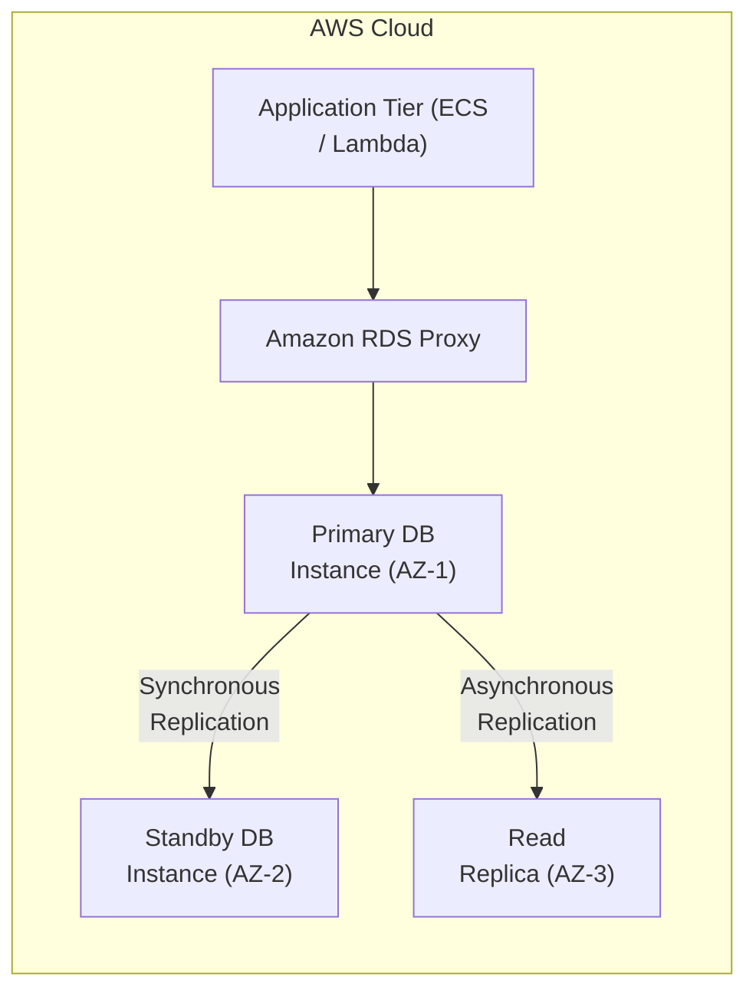
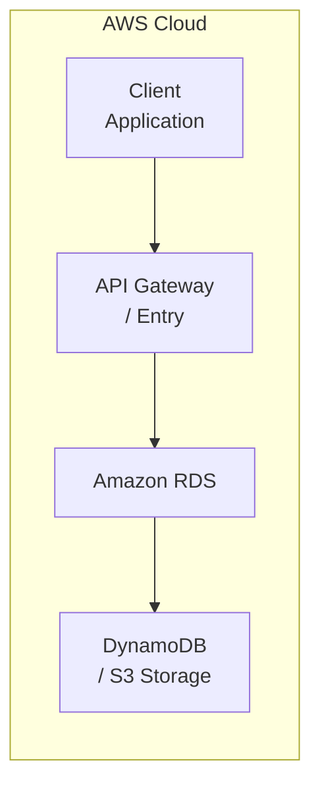

# Chapter 06: Amazon RDS — Relational Database Service

---

## 1. Service Overview

### What is Amazon RDS?
Amazon Relational Database Service (Amazon RDS) is a managed relational database service that automates time-consuming administrative tasks such as hardware provisioning, database setup, patching, backups, and high-availability replication across multiple Availability Zones.

### Why AWS Created It
Managing relational databases on raw virtual machines requires manual operating system administration, continuous security patching, complex master-replica replication setup, automated snapshot retention management, and manual failover orchestration. AWS created RDS to abstract database infrastructure management, allowing developers to focus on application data modeling and schema query optimization while AWS guarantees high availability, durability, and automated recovery.

### Business Problem It Solves
- **Eliminates Database Administration Overhead**: Automates OS/DB engine patching, automated snapshots, and storage auto-scaling.
- **Ensures Business Continuity & Disaster Recovery**: Multi-AZ deployments provide synchronous replication with automatic sub-minute failover without manual IP re-configuration.
- **Scales Read Performance Seamlessly**: Supports up to 15 Read Replicas to offload reporting and analytical queries from the primary write instance.

### Evolution and History
- **2009**: Launched with support for MySQL.
- **2010–2014**: Added Oracle, PostgreSQL, Microsoft SQL Server, and MariaDB.
- **2014**: Announced Amazon Aurora (AWS-designed MySQL/PostgreSQL-compatible engine offering up to 5x MySQL performance).
- **2019–2023**: Introduced RDS Proxy for serverless connection pooling, Multi-AZ DB Clusters with readable standby instances, and Graviton3 (db.r7g) instance family.

### Key Terminology
- **DB Instance**: An isolated database environment running a specific engine (e.g., PostgreSQL, MySQL, Aurora).
- **Multi-AZ Deployment**: Synchronous replication to a secondary standby instance in a separate Availability Zone for high availability.
- **Read Replica**: Asynchronous replica instance used to offload read-heavy traffic.
- **RDS Proxy**: Fully managed, highly available database proxy that pools and shares database connections.
- **DB Parameter Group**: A container for engine configuration values applied to one or more DB instances.

### Where It Fits in AWS
Amazon RDS acts as the core persistence tier in multi-tier web applications, integrating natively with EC2 instances, ECS/EKS container tasks, AWS Lambda, Secrets Manager, KMS, and CloudWatch.

---

## 2. Learning Objectives
By the end of this chapter, you will be able to:
1. **Architect** highly available, Multi-AZ relational database clusters.
2. **Configure** storage auto-scaling, parameter groups, automated backups, and IAM database authentication.
3. **Deploy** RDS instances using Python (Boto3), AWS CLI, Terraform, and CloudFormation.
4. **Optimize** query performance using Read Replicas, Performance Insights, and RDS Proxy.
5. **Diagnose and Resolve** database connection leaks, CPU spikes, and replication lag in production incident war rooms.

---

## 3. Prerequisites
- Understanding of SQL databases (PostgreSQL/MySQL fundamentals).
- Basic networking concepts (VPC, Subnets, Security Groups).
- AWS Account with permissions to launch RDS instances and manage IAM roles.

---

## 4. Real-world Analogy
Think of Amazon RDS as **Leasing a Managed Fleet Vehicle vs. Custom Modding a Car (Self-Hosted DB on EC2)**.
- **Self-Hosted DB on EC2**: You buy a car engine, assemble the transmission, perform routine oil changes yourself, replace worn-out tires, and if it breaks down on the highway, you must tow it and fix it manually.
- **Amazon RDS**: You lease a luxury fleet vehicle where a professional pit crew handles all engine servicing, oil changes, automated tire rotations, and provides an instant replacement vehicle automatically if your car experiences a flat tire.

---

## 5. Business Use Cases

### Startups
- **Rapid Prototyping**: Launch production PostgreSQL databases in minutes with automated daily backups.

### Enterprises
- **Core ERP & CRM Systems**: Run mission-critical enterprise resource planning software backed by Multi-AZ Aurora or PostgreSQL.

### Finance
- **Transactional Ledger Engines**: Maintain ACID-compliant financial transactions with KMS encryption at rest and automated snapshot replication.

### Healthcare
- **HIPAA-Compliant Patient Records**: Store patient data with enforced TLS encryption in transit and audit trail integration via CloudTrail.

---

## 6. Core Concepts

### Storage Engine Architecture
RDS decouples compute (EC2 DB instance classes) from storage (EBS GP3 or Provisioned IOPS io2). Storage automatically scales up to 64 TiB without downtime.

### Multi-AZ Failover Mechanism
When Multi-AZ is enabled, RDS synchronously replicates data across Availability Zones. In case of instance failure or AZ outage, CNAME DNS records automatically flip to point to the standby instance within 60 seconds.

---

## 7. Internal Architecture



---

## 8. Service Components
- **DB Instance Class**: Compute and memory specs (e.g., db.m6g.xlarge).
- **DB Subnet Group**: Collection of subnets across multiple AZs designated for RDS deployment.
- **KMS Key**: Encryption key for EBS storage volumes and automated snapshots.

---

## 9. Configuration
- **Parameter Groups**: Customize engine configuration parameters (e.g., `max_connections`, `shared_buffers`).
- **Option Groups**: Enable engine features like Oracle Native Network Encryption or SQL Server Backup.

---

## 10. Code Examples

### Python (Boto3)
```python
import boto3

rds = boto3.client('rds', region_name='us-east-1')

response = rds.create_db_instance(
    DBInstanceIdentifier='enterprise-postgres-db',
    AllocatedStorage=20,
    DBInstanceClass='db.t4g.micro',
    Engine='postgres',
    MasterUsername='dbadmin',
    MasterUserPassword='SecurePassword123!',
    VpcSecurityGroupIds=['sg-0123456789abcdef0'],
    DBSubnetGroupName='enterprise-db-subnet-group',
    MultiAZ=True,
    PubliclyAccessible=False,
    StorageType='gp3',
    EnableCloudwatchLogsExports=['postgresql', 'upgrade']
)
print("DB Instance Creation Status:", response['DBInstance']['DBInstanceStatus'])
```

### AWS CLI
```bash
aws rds create-db-instance     --db-instance-identifier enterprise-postgres-db     --allocated-storage 20     --db-instance-class db.t4g.micro     --engine postgres     --master-username dbadmin     --master-user-password "SecurePassword123!"     --multi-az     --no-publicly-accessible     --storage-type gp3
```

### Terraform
```hcl
resource "aws_db_instance" "enterprise_db" {
  allocated_storage    = 20
  db_name              = "enterprisedb"
  engine               = "postgres"
  engine_version       = "15.3"
  instance_class       = "db.t4g.micro"
  username             = "dbadmin"
  password             = "SecurePassword123!"
  parameter_group_name = "default.postgres15"
  skip_final_snapshot  = true
  multi_az             = true
  storage_type         = "gp3"
}
```

### CloudFormation
```yaml
Resources:
  EnterpriseDB:
    Type: AWS::RDS::DBInstance
    Properties:
      DBInstanceIdentifier: enterprise-postgres-db
      AllocatedStorage: '20'
      DBInstanceClass: db.t4g.micro
      Engine: postgres
      MasterUsername: dbadmin
      MasterUserPassword: SecurePassword123!
      MultiAZ: true
      StorageType: gp3
```

---

## 11. Line-by-Line Explanation
- **Line 1–5**: Instantiates the Boto3 RDS client pointing to `us-east-1`.
- **Line 6–18**: Invokes `create_db_instance` with `MultiAZ=True`, provisioning primary and standby database instances across multiple subnets, with public access disabled (`PubliclyAccessible=False`) for maximum security.

---

## 12. Security Deep Dive
- **IAM DB Authentication**: Authenticate to RDS database engines using IAM roles and temporary tokens instead of static passwords.
- **KMS Storage Encryption**: Enforce AES-256 encryption at rest for database storage, snapshots, and read replicas.

---

## 13. Monitoring & Observability
- **CloudWatch Metrics**: Track `CPUUtilization`, `DatabaseConnections`, `FreeableMemory`, `FreeStorageSpace`, `ReadLatency`, `WriteLatency`.
- **Performance Insights**: Visualize query load dashboard to pinpoint SQL bottlenecks and wait states.

---

## 14. Performance & Cost Optimization
- **RDS Proxy Connection Pooling**: Reduce connection overhead by multiplexing database connections.
- **Read Replicas**: Offload read queries to asynchronous replicas to preserve primary DB compute resources.

---

## 15. Enterprise Integration
RDS integrates with AWS Lambda (via RDS Proxy and IAM Auth), Secrets Manager for automatic password rotation, and KMS for customer-managed encryption.

---

## 16. Real Industry Use Cases
- **E-Commerce Checkout Engine**: Processing ACID transactions with Multi-AZ PostgreSQL.
- **Analytics Reporting Platform**: Running heavy analytical queries against RDS Read Replicas.

---

## 17. Architecture Patterns



---

## 18. Production Incident War Room

### Incident 1: RDS Connection Starvation (`Too Many Connections`)
- **Severity**: P1 / Critical | **Service Affected**: Amazon RDS PostgreSQL
- **Symptom**: Application logs flooded with `OperationalError: FATAL: remaining connection slots are reserved`.
- **Root Cause Analysis (RCA)**: AWS Lambda functions scaled to 1,000 concurrent executions during a traffic spike. Each Lambda opened a direct connection, exhausting the database's `max_connections` limit.
- **CloudWatch Metric & Alarm Signal**:
  - `DatabaseConnections` metric hit the maximum configured limit.
- **CLI Remediation Script**:
  ```bash
  aws rds describe-db-instances --db-instance-identifier enterprise-postgres-db --query "DBInstances[0].DBInstanceStatus"
  ```
- **Mitigation & Resolution**: Deployed an Amazon RDS Proxy instance to pool and multiplex connections. Rebooted DB instance to clear zombie connections.
- **Prevention & Hardening**: Set CloudWatch Alarms on `DatabaseConnections` > 80% threshold.

### Incident 2: Storage Exhaustion and Database In Read-Only State
- **Severity**: P2 / High | **Service Affected**: Amazon RDS Storage
- **Symptom**: Database writes fail with `ERROR: disk full`; RDS instance flips into `storage-full` read-only state.
- **Root Cause Analysis (RCA)**: Unmonitored application logging tables filled the EBS storage volume to 100%. Storage auto-scaling was not enabled.
- **Mitigation & Resolution**: Modified RDS DB instance to manually increase allocated storage capacity.
- **Prevention & Hardening**: Enabled storage auto-scaling with a maximum limit (e.g., up to 1,000 GB).

---

## 19. Production Best Practices (Well-Architected)
- **Security**: Use AWS Secrets Manager for dynamic database credential rotation. Never hardcode credentials in application code.
- **Reliability**: Always enable Multi-AZ for production workloads to ensure synchronous standby replication.
- **Operational Excellence**: Enable RDS Storage Auto-scaling and configure Performance Insights for deep query analysis.

## 20. Migration Strategies
- Use AWS Database Migration Service (DMS) for near-zero downtime database migrations from on-premises to RDS.

---

## 21. CI/CD Integration
Integrate Liquidbase or Flyway DB migration scripts in CodePipeline/GitHub Actions pipelines prior to application deployment.

---

## 22. Practical Projects

### Beginner Project: Basic Amazon RDS Deployment
- **Business Requirement**: Deploy baseline Amazon RDS resources securely.
- **Architecture**: Single-region deployment with default VPC subnets and restricted IAM roles.
- **Implementation**: Write a Terraform `main.tf` to provision Amazon RDS and apply the configuration. Verify resource creation in the AWS Console.

### Intermediate Project: Multi-AZ Scalable Amazon RDS Setup
- **Business Requirement**: Implement high availability and automated scaling for Amazon RDS to withstand Availability Zone failures.
- **Architecture**: Application Load Balancer -> Auto Scaling Group -> Amazon RDS -> KMS Encrypted Persistence Layer.
- **Implementation**: Configure scaling policies based on CPU utilization and set up CloudWatch Alarms for monitoring metrics.

### Advanced Project: Automated CI/CD Pipeline Integration
- **Business Requirement**: Automate the deployment and testing of Amazon RDS infrastructure without manual intervention.
- **Architecture**: GitHub Repository -> AWS CodePipeline -> AWS CodeBuild -> Deployment to Amazon RDS Targets.
- **Implementation**: Write a `buildspec.yml` to run automated security linting (e.g., tfsec or Checkov) before deploying the Amazon RDS changes.

### Enterprise Project: Zero-Trust Multi-Account Architecture
- **Business Requirement**: Deploy a production-grade multi-account enterprise environment utilizing Amazon RDS with centralized security governance.
- **Architecture**: AWS Organizations -> AWS Transit Gateway -> Hub-and-Spoke VPCs -> Multi-AZ Amazon RDS -> AWS IAM Identity Center SSO.
- **Implementation**: Implement Service Control Policies (SCPs) to restrict Amazon RDS deployments to approved regions and mandate AWS KMS customer-managed keys (CMKs) for all data at rest.

---

## 23. Interview Preparation

### Sample Questions & Answers
- **Q1 (Senior Architect)**: How do you design a relational database tier that handles 50,000 read QPS and sub-minute disaster recovery?
  - **Answer**: Implement an Amazon Aurora Cluster with Multi-AZ deployment across 3 AZs, configure 5 Aurora Read Replicas with Auto Scaling, and use Aurora Global Database for cross-region disaster recovery.

---

## 24. AWS Certification Practice
- **Question**: Which deployment configuration provides synchronous replication across Availability Zones for Amazon RDS?
  - **Answer**: Multi-AZ Deployment.

---

## 25. Knowledge Check
1. Difference between Multi-AZ and Read Replicas? (Multi-AZ is synchronous for HA; Read Replicas are asynchronous for read performance).

---

## 26. Cheat Sheet
| Feature | Limit / Specification |
| :--- | :--- |
| **Max Storage Capacity** | 64 TiB (GP3/IO2) |
| **Max Read Replicas** | 15 per DB instance |
| **Multi-AZ Failover** | Automatic (approx 60 seconds) |

---

## 27. Chapter Summary
Amazon RDS provides a robust, managed relational database infrastructure that ensures high availability, encryption, automated backups, and scalable compute.

---

## 28. Further Learning
- [Amazon RDS Documentation](https://docs.aws.amazon.com/rds/)
- [AWS Database Migration Service Guide](https://docs.aws.amazon.com/dms/)
