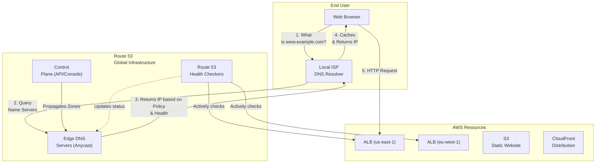
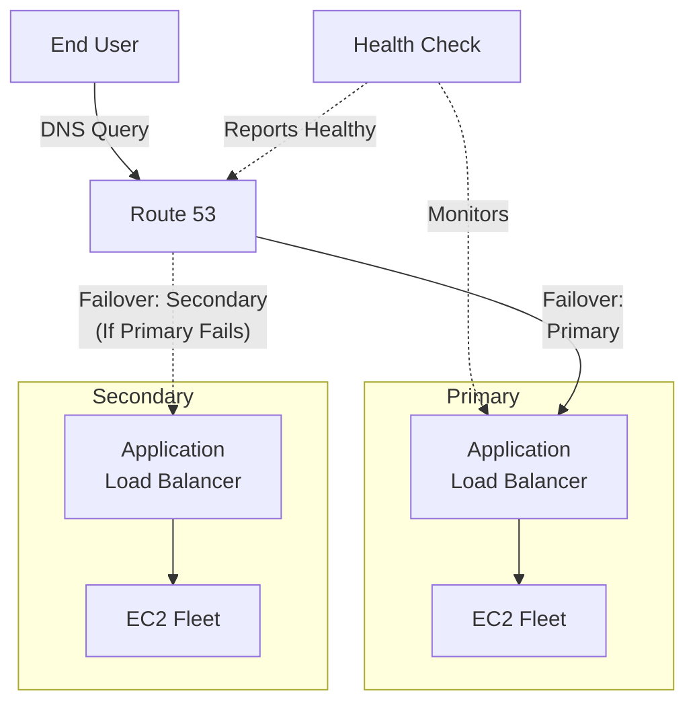
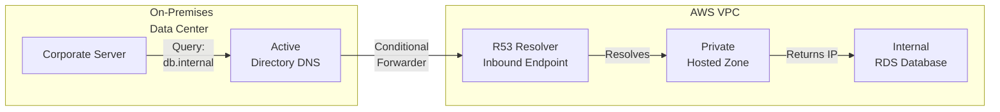

# Chapter 07: Amazon Route 53 — Scalable Domain Name System (DNS)

---

## 1. Service Overview

Amazon Route 53 is a highly available and scalable cloud Domain Name System (DNS) web service. It is designed to give developers and businesses an extremely reliable and cost-effective way to route end users to Internet applications by translating names like `www.example.com` into the numeric IP addresses like `192.0.2.1` that computers use to connect to each other.

### Why Route 53 Exists

Before cloud DNS, managing domain names and routing required running custom BIND servers, dealing with DNS propagation delays, and struggling with complex active-passive failover mechanisms. Route 53 abstracts this into a fully managed, globally distributed service with a 100% Service Level Agreement (SLA) for DNS resolution.

### Key Characteristics

- **100% Availability SLA**: It is the *only* AWS service with a 100% availability SLA.
- **Global Service**: Does not require region selection; it operates from a global network of edge locations.
- **Domain Registrar**: You can register new domains directly through Route 53.
- **Advanced Routing**: Supports complex routing algorithms (Latency, Geolocation, Geoproximity, Weighted).
- **Health Checks**: Actively monitors the health of endpoints and routes traffic away from unhealthy resources.
- **Alias Records**: AWS-specific extension to DNS that allows mapping a domain name to an AWS resource (like an ALB or S3 bucket) even if the IP address changes.
- **VPC Integration**: Provides private DNS for internal VPC communication via Private Hosted Zones.

---

## 2. Learning Objectives

By the end of this chapter, you will be able to:

- **Explain** DNS fundamentals and the role of Route 53 in the AWS ecosystem
- **Differentiate** between Public and Private Hosted Zones
- **Implement** various routing policies (Simple, Weighted, Latency, Failover, Geolocation, Multivalue Answer)
- **Configure** Route 53 Health Checks for automated failover
- **Understand** and use Alias records to connect domain names to AWS resources
- **Design** active-active and active-passive global architectures
- **Integrate** Route 53 with AWS Certificate Manager (ACM) for DNS validation
- **Troubleshoot** DNS propagation, resolution failures, and health check issues
- **Manage** domain registration and DNSSEC

---

## 3. Prerequisites

- **AWS Account** with basic access
- **Completed chapters**: Chapter 3 (EC2), Chapter 4 (VPC), Chapter 18 (ELB)
- **Concepts**: IP addresses, URLs, basic networking concepts (TCP/UDP, Port 53)
- **Recommended**: An registered domain name for hands-on practice

---

## 4. Real-world Analogy

Think of DNS as the **phone book of the internet**, and Route 53 as an **advanced global switchboard operator**.

When you want to call "Alice's Bakery", you don't memorize her 10-digit phone number. You look up her name in the phone book, and it gives you the number. In the digital world, you type `www.alicesbakery.com`, and DNS returns `203.0.113.5`.

Route 53 takes this further. Imagine the switchboard operator doesn't just give you the number, but:
1. **Health Checks**: Calls Alice's Bakery first to make sure they are open before giving you the number. If they are closed, gives you the number for Bob's Bakery instead.
2. **Latency Routing**: Sees you are calling from New York, and gives you the number for the New York branch of the bakery rather than the Tokyo branch.
3. **Weighted Routing**: Gives 80% of callers the main branch number, and 20% of callers the new test branch number.

---

## 5. Business Use Cases

### Global Application Delivery
- **Latency Reduction**: Routing users from Europe to the `eu-west-1` application stack and users from Asia to the `ap-northeast-1` stack to minimize lag.
- **Content Localization**: Routing users from France to a French-language version of the application using Geolocation routing.

### Disaster Recovery
- **Active-Passive Failover**: Routing 100% of traffic to the primary region, but automatically switching to the secondary DR region if health checks fail.
- **Active-Active Resilience**: Balancing traffic globally and gracefully degrading if a region fails.

### Internal Microservices
- **Private Service Discovery**: Using Private Hosted Zones to resolve internal database names (e.g., `db.internal.company.local`) within a VPC without exposing them to the internet.

### Blue/Green Deployments
- **Traffic Shifting**: Using Weighted routing to shift 10% of production traffic to a new version of the application (Canary deployment), monitoring for errors before shifting the remaining 90%.

---

## 6. Core Concepts

### Hosted Zone
A container that holds information about how you want to route traffic for a specific domain (like `example.com`) and its subdomains (`www.example.com`).
- **Public Hosted Zone**: Records are accessible from the public internet.
- **Private Hosted Zone**: Records are only accessible from within specified VPCs.

### Record (Record Set)
An item inside a hosted zone defining how traffic is routed for a specific domain or subdomain.
- **A Record**: Maps a name to an IPv4 address.
- **AAAA Record**: Maps a name to an IPv6 address.
- **CNAME**: Maps a name to another name (e.g., `www.example.com` to `example.com`).
- **Alias Record**: An AWS-specific virtual record that maps a name to an AWS resource (ALB, CloudFront, S3). Unlike CNAMEs, Alias records are free and can be used at the "zone apex" (the root domain like `example.com`).

### Time To Live (TTL)
The amount of time (in seconds) that DNS resolvers should cache the record. A lower TTL means changes propagate faster, but increases the number of queries to Route 53 (which increases cost).

### Routing Policies
- **Simple**: Routes traffic to a single resource. No health checks.
- **Weighted**: Routes traffic to multiple resources in proportions that you specify (e.g., 80/20).
- **Latency**: Routes traffic to the AWS region that provides the lowest latency to the user.
- **Failover**: Routes traffic to a primary resource; if unhealthy, routes to a secondary resource.
- **Geolocation**: Routes traffic based on the geographic location of your users (by continent, country, or state).
- **Geoproximity**: Routes traffic based on the geographic location of your resources and your users. Optionally allows shifting traffic using a "bias" value.
- **Multivalue Answer**: Returns up to eight healthy IP addresses. Acts as simple client-side load balancing.

---

## 7. Internal Architecture



---

## 8. Service Components

### Health Checks
Route 53 health checkers located around the world periodically send requests (HTTP, HTTPS, TCP) to your endpoint. If more than 18% of checkers report it as healthy, the endpoint is considered healthy.
- **Endpoint Checks**: Pinging an IP or domain.
- **Calculated Checks**: Combining the status of multiple other health checks (AND/OR logic).
- **CloudWatch Alarm Checks**: State based on a CloudWatch Alarm (useful for monitoring internal resources not accessible from the internet).

### Traffic Flow
A visual editor within the Route 53 console that helps you create complex routing trees using a drag-and-drop interface. It generates "Traffic Policies" that can be version-controlled.

### Route 53 Resolver (VPC)
By default, VPCs use the ".2" IP address (e.g., `10.0.0.2`) as the DNS resolver. Route 53 Resolver allows you to create **Inbound Endpoints** (allow on-premise networks to resolve AWS private DNS) and **Outbound Endpoints** (allow VPCs to resolve on-premise DNS via Direct Connect/VPN).

### DNSSEC
Domain Name System Security Extensions. Route 53 supports DNSSEC to protect DNS traffic from spoofing and man-in-the-middle attacks by cryptographically signing DNS records.

---

## 9. Configuration

### Creating a Public Hosted Zone via CLI

```bash
# Create the hosted zone
aws route53 create-hosted-zone \
    --name example.com \
    --caller-reference "2023-10-26-01"

# Note the Hosted Zone ID and Name Servers returned in the output.
# You must update your domain registrar with these Name Servers.
```

### JSON format for a Record Set Change
Route 53 API uses a specific JSON structure for batching record changes.

```json
{
  "Comment": "Update record to point to new ALB",
  "Changes": [
    {
      "Action": "UPSERT",
      "ResourceRecordSet": {
        "Name": "api.example.com",
        "Type": "A",
        "AliasTarget": {
          "HostedZoneId": "Z35SXDOTRQ7X7K", 
          "DNSName": "my-alb-123456789.us-east-1.elb.amazonaws.com.",
          "EvaluateTargetHealth": true
        }
      }
    }
  ]
}
```

---

## 10. Code Examples

### AWS CLI — Common Operations

```bash
# Apply a record set change (using the JSON file above)
aws route53 change-resource-record-sets \
    --hosted-zone-id Z1234567890 \
    --change-batch file://change-batch.json

# Create a Health Check
aws route53 create-health-check \
    --caller-reference "hc-api-2023" \
    --health-check-config \
        Type=HTTPS,FullyQualifiedDomainName=api.example.com,Port=443,ResourcePath=/health,RequestInterval=30,FailureThreshold=3

# List all hosted zones
aws route53 list-hosted-zones

# List records in a zone
aws route53 list-resource-record-sets --hosted-zone-id Z1234567890
```

### Terraform — Creating a Hosted Zone with Alias and Failover

```hcl
resource "aws_route53_zone" "primary" {
  name = "example.com"
}

# Primary Health Check
resource "aws_route53_health_check" "primary" {
  fqdn              = "primary.example.com"
  port              = 443
  type              = "HTTPS"
  resource_path     = "/health"
  failure_threshold = "3"
  request_interval  = "30"
}

# Primary Record
resource "aws_route53_record" "www_primary" {
  zone_id = aws_route53_zone.primary.zone_id
  name    = "www.example.com"
  type    = "A"

  failover_routing_policy {
    type = "PRIMARY"
  }

  set_identifier  = "Primary-US-East"
  health_check_id = aws_route53_health_check.primary.id

  alias {
    name                   = aws_lb.primary.dns_name
    zone_id                = aws_lb.primary.zone_id
    evaluate_target_health = true
  }
}

# Secondary Record (Disaster Recovery)
resource "aws_route53_record" "www_secondary" {
  zone_id = aws_route53_zone.primary.zone_id
  name    = "www.example.com"
  type    = "A"

  failover_routing_policy {
    type = "SECONDARY"
  }

  set_identifier = "Secondary-US-West"

  alias {
    name                   = aws_lb.secondary.dns_name
    zone_id                = aws_lb.secondary.zone_id
    evaluate_target_health = true
  }
}
```

### Python (Boto3) — Updating an A Record

```python
import boto3

route53 = boto3.client('route53')

def update_dns(zone_id, record_name, new_ip):
    try:
        response = route53.change_resource_record_sets(
            HostedZoneId=zone_id,
            ChangeBatch={
                'Comment': 'Automated IP update',
                'Changes': [
                    {
                        'Action': 'UPSERT',
                        'ResourceRecordSet': {
                            'Name': record_name,
                            'Type': 'A',
                            'TTL': 60,
                            'ResourceRecords': [
                                {
                                    'Value': new_ip
                                }
                            ]
                        }
                    }
                ]
            }
        )
        print(f"Update requested. Change ID: {response['ChangeInfo']['Id']}")
    except Exception as e:
        print(f"Error updating Route 53: {e}")

update_dns('Z1234567890', 'dev.example.com', '203.0.113.10')
```

---

## 11. Line-by-Line Explanation

### Alias Target Configuration

```json
"AliasTarget": {
  "HostedZoneId": "Z35SXDOTRQ7X7K", 
  "DNSName": "my-alb-123456789.us-east-1.elb.amazonaws.com.",
  "EvaluateTargetHealth": true
}
```
- **`HostedZoneId`**: This is NOT your domain's Hosted Zone ID. This is the hardcoded Hosted Zone ID of the AWS service you are pointing to. (e.g., `Z35SXDOTRQ7X7K` is the fixed ID for all ALBs in us-east-1).
- **`DNSName`**: The AWS-provided DNS name of your resource (ALB, CloudFront, API Gateway).
- **`EvaluateTargetHealth`**: When `true`, Route 53 infers the health of the target resource. If the ALB has no healthy EC2 instances behind it, Route 53 considers this Alias record unhealthy and triggers failover routing, *without* needing a separate Route 53 Health Check.

---

## 12. Security Deep Dive

### Preventing Subdomain Takeovers
If you create a CNAME pointing `blog.example.com` to `my-s3-website.s3-website-us-east-1.amazonaws.com`, but you delete the S3 bucket and forget to delete the Route 53 record, a hacker can create a new S3 bucket with that exact name in their own AWS account. Your DNS will now route your users to the hacker's bucket.
- **Mitigation**: Always clean up DNS records immediately when deleting the underlying AWS resources. Use Alias records where possible.

### IAM Permissions
Restricting Route 53 is difficult because there are no resource-level permissions for individual records. You can restrict an IAM user to a specific Hosted Zone, but they can edit ANY record inside that zone.
- **Mitigation**: Separate production domains and development domains into entirely different AWS accounts.

### DNS Query Logging
You can configure Route 53 to log every single DNS query it receives to CloudWatch Logs. This is critical for security investigations to see exactly what IPs are requesting resolution for your domain.

---

## 13. Monitoring & Observability

### Health Check Alarms
Route 53 Health Checks publish metrics to CloudWatch in the `us-east-1` region (regardless of where your resources are).
- Metric: `HealthCheckStatus` (1 = Healthy, 0 = Unhealthy).
- Create a CloudWatch Alarm on this metric to alert via SNS when an endpoint goes down.

### CloudWatch Logs for Query Logging
When Query Logging is enabled, you receive logs in JSON format detailing:
- The domain queried.
- The IP address of the recursive resolver making the request.
- The response code (e.g., `NOERROR`, `NXDOMAIN`).

---

## 14. Performance & Cost Optimization

### Cost Model
- **Hosted Zones**: $0.50 per month per hosted zone (for the first 25).
- **Standard Queries**: $0.40 per million queries.
- **Latency/Geo Queries**: $0.60 to $0.70 per million queries.
- **Health Checks**: $0.50 to $2.00 per health check per month (depending on AWS endpoint vs non-AWS endpoint, and HTTP vs HTTPS).
- **Alias Queries to AWS Resources**: **FREE**. (This is a massive cost-saving benefit of Alias records).

### Optimization Strategies
1. **Use Alias Records**: Always use Alias records instead of CNAMEs when pointing to AWS resources (ALB, S3, CloudFront). Alias queries are free.
2. **Increase TTL**: If your IP addresses rarely change, increase the TTL from 60 seconds to 86400 seconds (24 hours). Resolvers will cache the IP, reducing the number of queries reaching Route 53 and lowering your bill.
3. **Clean Up Unused Zones**: Delete Hosted Zones you are no longer using to save the $0.50/month fee.

---

## 15. Enterprise Integration

### Hybrid DNS Resolution (Route 53 Resolver)
Enterprises often have a direct connect or VPN connecting their on-premises data center to AWS.
- **Problem**: On-premise servers cannot resolve `db.internal.aws.com` (in an AWS Private Hosted Zone). AWS servers cannot resolve `corp.intranet` (on-premise Active Directory).
- **Solution**:
    1. **Inbound Endpoint**: An ENI in your VPC. On-premise DNS forwards queries for `aws.com` to this ENI.
    2. **Outbound Endpoint**: An ENI in your VPC. Route 53 forwards queries for `corp.intranet` from the VPC to your on-premise DNS servers.

### Multi-Account Private DNS
If you have multiple VPCs across different AWS accounts, you can associate a single Private Hosted Zone with all of those VPCs.
- Account A owns the Private Hosted Zone.
- Account A creates a VPC Association Authorization for Account B's VPC.
- Account B associates its VPC with the Hosted Zone.
- Now both accounts can resolve the same internal names.

---

## 16. Real Industry Use Cases

### Case 1: Netflix — Global Active-Active Architecture
**Problem**: Provide the fastest streaming experience globally while surviving entire region failures.
**Solution**: Netflix uses Route 53 Latency-based routing. A user in London is resolved to the EU-West region. A user in Tokyo resolves to the AP-Northeast region. If EU-West suffers an outage, Route 53 Health Checks fail, and Route 53 automatically begins returning IPs for the US-East region to European users.

### Case 2: Media Publisher — Blue/Green Deployments
**Problem**: Needs to test new application features in production with real traffic, but minimize risk.
**Solution**: Using Route 53 Weighted Routing, they configure a record with Weight 95 pointing to the "Blue" (Current) ALB, and Weight 5 pointing to the "Green" (New) ALB. They monitor error rates. If successful, they slowly adjust the weights to 50/50, then 0/100.

### Case 3: Global Bank — Compliance and Geo-fencing
**Problem**: Due to data residency laws, traffic originating in the European Union MUST be routed to European servers and never touch US servers.
**Solution**: Route 53 Geolocation routing policy is configured. Requests from Continent = Europe are hard-routed to the EU application stack. A default rule catches the rest of the world.

---

## 17. Architecture Patterns

### Pattern 1: High Availability Failover


### Pattern 2: Hybrid DNS Resolution


---

## 18. Production Incident War Room

### Incident 1: The "Dangling" CNAME Takeover
**Severity**: P1 — Critical
**Symptoms**: Users visiting `promo.company.com` are seeing malicious content and phishing pages.
**Investigation**:
1. Check the Route 53 console. `promo.company.com` is a CNAME pointing to `company-promo.s3-website-us-east-1.amazonaws.com`.
2. Check S3 console. The bucket `company-promo` does not exist in the company's AWS account.
**Root Cause**: The marketing team deleted the S3 bucket when the promotion ended but forgot to delete the Route 53 record. An attacker noticed the dangling DNS record, created an S3 bucket named `company-promo` in their own AWS account, and hosted malicious content.
**Permanent Fix**: Implement automated infrastructure-as-code (IaC) pipelines so DNS records and resources are created and destroyed together. Scan Route 53 regularly for dangling records pointing to non-existent AWS resources.

### Incident 2: Health Check "Flapping" Causes Outage
**Severity**: P2 — High
**Symptoms**: A global application is intermittently slow or unreachable. Users in Europe are randomly being routed to the US, and vice-versa.
**Investigation**:
1. Check CloudWatch alarms for Route 53 Health Checks.
2. The health checks are constantly transitioning between Healthy and Unhealthy every 2 minutes.
**Root Cause**: The health check endpoint (`/health`) was performing a deep database connection check. Under high load, the DB check took 6 seconds. The Route 53 health check timeout is 5 seconds. Route 53 marked the region dead, shifted all traffic to the other region, causing THAT region to overload and its health checks to fail.
**Permanent Fix**: Separate "shallow" health checks (HTTP 200 OK from the web server) for Route 53 from "deep" application health checks. Increase the Route 53 Failure Threshold from 3 to 5 to prevent aggressive flapping.

### Incident 3: EvaluateTargetHealth Taking Down the Site
**Severity**: P1 — Critical
**Symptoms**: 100% downtime. Route 53 is not resolving the primary domain name at all.
**Investigation**:
1. Run `dig www.company.com`. It returns `NXDOMAIN` or no records.
2. The record in Route 53 is an Alias to an ALB with `EvaluateTargetHealth` = True.
3. Check the ALB. All target groups have 0 healthy instances.
**Root Cause**: A bad code deployment caused all EC2 instances to fail ALB health checks. Because `EvaluateTargetHealth` was true, the ALB reported as unhealthy to Route 53. Because there was no Failover record configured, Route 53 simply stopped returning any IP address for the domain.
**Permanent Fix**: Configure a Failover routing policy. Point the Primary record to the ALB. Point the Secondary record to an S3 bucket hosting a static "Sorry, we are down for maintenance" page.

### Incident 4: Private DNS Resolving to Public IPs
**Severity**: P3 — Medium
**Symptoms**: EC2 instances in a VPC are attempting to connect to an internal API (`api.internal.company.com`) but traffic is leaving the VPC and timing out.
**Investigation**:
1. Run `nslookup api.internal.company.com` from the EC2 instance. It returns a public IP instead of a 10.x.x.x private IP.
2. Check the Private Hosted Zone in Route 53.
**Root Cause**: The Private Hosted Zone was created, but it was not associated with the specific VPC the EC2 instance resides in. The query fell back to public DNS resolvers.
**Permanent Fix**: Associate the Private Hosted Zone with all required VPCs. Ensure `enableDnsHostnames` and `enableDnsSupport` are set to `true` in the VPC settings.

### Incident 5: TTL Too High During Migration
**Severity**: P2 — High
**Symptoms**: The company migrated a database from an old data center to AWS. DNS was updated to point to the new IP. However, 40% of clients are still connecting to the old data center 12 hours later.
**Investigation**:
1. Check the Route 53 record for `db.company.com`. The TTL is set to 86400 (24 hours).
**Root Cause**: DNS resolvers at ISPs around the world cached the old IP address because the TTL told them it was valid for 24 hours. Updating Route 53 does not flush the cache of third-party resolvers.
**Prevention**: Whenever planning an IP migration, lower the TTL of the DNS record to 60 seconds at least 48 hours *before* the migration. Perform the migration, verify success, then raise the TTL back up.

---

## 19. Production Best Practices (Well-Architected)

### Reliability
- **Use Alias Records**: Always prefer Alias records over CNAMEs for AWS resources. They are faster, free, and support zone apex routing.
- **Failover Pages**: Always have a Route 53 Failover record pointing to a static S3 website for graceful degradation during severe outages.
- **Health Check Thresholds**: Use a minimum of 3 failures before marking a resource unhealthy to prevent transient network hiccups from causing massive traffic shifts.

### Operational Excellence
- **Infrastructure as Code**: Manage Route 53 records using Terraform or CloudFormation. Manual console edits to DNS often lead to outages.
- **DNS Query Logging**: Enable query logging and send logs to CloudWatch/S3 for security auditing and debugging.

### Security
- **DNSSEC**: Enable DNSSEC on your public zones to prevent DNS spoofing.
- **VPC Endpoints**: Use Private Hosted Zones for internal services so DNS queries and traffic never traverse the public internet.

---

## 20. Migration Strategies
- **Data Migration**: Use AWS DataSync or native export/import tools for zero-downtime Amazon Route 53 migration.
- **State Migration**: Adopt Terraform import blocks to bring existing Amazon Route 53 resources into Infrastructure as Code.

## 21. CI/CD Integration

### AWS Certificate Manager (ACM)
When requesting a free SSL/TLS certificate from ACM, you must prove you own the domain. Route 53 integrates natively with ACM to automatically create the required CNAME validation records with one click.

### Elastic Load Balancing (ELB)
ALBs and NLBs do not have fixed IP addresses; their IPs change as they scale. Therefore, you cannot use an A record pointing to an IP. You MUST use a Route 53 Alias record pointing to the Load Balancer's DNS name.

### Amazon CloudFront
Similar to ELB, CloudFront distributions use a global network of shifting IP addresses. Route 53 Alias records seamlessly route users to the nearest CloudFront edge location.

---

## 22. Practical Projects

### Beginner Project: Basic Amazon Route 53 Deployment
- **Business Requirement**: Deploy baseline Amazon Route 53 resources securely.
- **Architecture**: Single-region deployment with default VPC subnets and restricted IAM roles.
- **Implementation**: Write a Terraform main.tf to provision Amazon Route 53 and apply the configuration. Verify resource creation in the AWS Console.

### Intermediate Project: Multi-AZ Scalable Amazon Route 53 Setup
- **Business Requirement**: Implement high availability and automated scaling for Amazon Route 53 to withstand Availability Zone failures.
- **Architecture**: Application Load Balancer -> Auto Scaling Group -> Amazon Route 53 -> KMS Encrypted Persistence Layer.
- **Implementation**: Configure scaling policies based on CPU utilization and set up CloudWatch Alarms for monitoring metrics.

### Advanced Project: Automated CI/CD Pipeline Integration
- **Business Requirement**: Automate the deployment and testing of Amazon Route 53 infrastructure without manual intervention.
- **Architecture**: GitHub Repository -> AWS CodePipeline -> AWS CodeBuild -> Deployment to Amazon Route 53 Targets.
- **Implementation**: Write a uildspec.yml to run automated security linting (e.g., tfsec or Checkov) before deploying the Amazon Route 53 changes.

### Enterprise Project: Zero-Trust Multi-Account Architecture
- **Business Requirement**: Deploy a production-grade multi-account enterprise environment utilizing Amazon Route 53 with centralized security governance.
- **Architecture**: AWS Organizations -> AWS Transit Gateway -> Hub-and-Spoke VPCs -> Multi-AZ Amazon Route 53 -> AWS IAM Identity Center SSO.
- **Implementation**: Implement Service Control Policies (SCPs) to restrict Amazon Route 53 deployments to approved regions and mandate AWS KMS customer-managed keys (CMKs) for all data at rest.

---

## 23. Interview Preparation

### Beginner
**Q1**: Why use a Route 53 Alias record instead of a CNAME?
**A**: Alias records can be used at the "zone apex" (e.g., `example.com`), whereas CNAMEs cannot. Alias queries to AWS resources are free. Route 53 can natively evaluate the health of the AWS resource the Alias points to.

**Q2**: What is a Hosted Zone?
**A**: A container for DNS records associated with a specific domain name. Public Hosted Zones serve traffic on the internet; Private Hosted Zones serve traffic only within specified VPCs.

### Intermediate
**Q3**: Explain how Route 53 Latency Routing works.
**A**: Route 53 maintains a global latency map of internet networks. When a user queries DNS, Route 53 determines which AWS region will provide the lowest network latency for that specific user's IP network, and returns the IP address for resources in that region.

**Q4**: What happens if an ALB scales and changes its IP addresses, but you have a Route 53 Alias record pointing to it?
**A**: Route 53 automatically tracks the internal IP changes of the ALB. The Alias record seamlessly returns the new, correct IP addresses to clients without requiring any manual updates to DNS.

### Advanced
**Q5**: Design a Disaster Recovery architecture utilizing Route 53.
**A**: Implement an Active-Passive architecture. Host the primary application stack in `us-east-1` behind an ALB. Host a standby stack in `us-west-2`. Create a Route 53 Health Check monitoring the primary ALB. Create a Failover Routing Policy: Primary record points to the `us-east-1` ALB with `EvaluateTargetHealth` enabled. Secondary record points to the `us-west-2` ALB. If the primary region fails, the health check fails, and Route 53 automatically begins returning IPs for the secondary region.

---

## 24. AWS Certification Practice

**Q1**: You need to point the root domain name `company.com` to an Application Load Balancer. Which Route 53 record type must you use?
- A) CNAME Record
- **B) Alias Record** ✓
- C) A Record with an IP address
- D) PTR Record

**Q2**: A company wants to route 20% of its traffic to a new version of its application, and 80% to the old version. Which routing policy should they use?
- A) Latency Routing
- B) Simple Routing
- **C) Weighted Routing** ✓
- D) Multivalue Answer Routing

---

## 25. Knowledge Check

1. **What port does DNS use?** Port 53 (UDP and TCP).
2. **What does an A record do?** Maps a hostname to an IPv4 address.
3. **What does an AAAA record do?** Maps a hostname to an IPv6 address.
4. **What is the AWS SLA for Route 53?** 100% Availability.
5. **Which routing policy prevents access based on the user's country?** Geolocation Routing.
6. **Can a Private Hosted Zone be associated with VPCs in different AWS accounts?** Yes, using VPC Association Authorizations.

---

## 26. Cheat Sheet

| Feature | Detail |
|---------|--------|
| **Simple Routing** | Standard DNS resolution, no health checks, single record. |
| **Weighted Routing** | Distribute traffic based on assigned weights (e.g., A/B testing). |
| **Latency Routing** | Route to the AWS region with the lowest latency for the user. |
| **Failover Routing** | Active-Passive failover based on Health Checks. |
| **Geolocation Routing**| Route based on user's geographic location (Country/Continent). |
| **Alias Record** | AWS-specific. Points to AWS resources. Works at Zone Apex. Free. |
| **CNAME Record** | Points a name to another name. Cannot be used at Zone Apex. |
| **Health Check** | Monitors endpoints. Can failover traffic. |
| **Private Hosted Zone**| Resolves DNS only inside associated VPCs. |

---

## 27. Chapter Summary

Amazon Route 53 is a foundational service that bridges the gap between end users and your AWS infrastructure. Key takeaways:

- **100% SLA**: Highly available, global DNS service.
- **Alias Records are superior**: Use them for ALBs, CloudFront, S3, and API Gateway. They work at the zone apex and are free.
- **Routing Policies**: Use the right policy for the job (Latency for speed, Geolocation for localization, Weighted for canary testing, Failover for disaster recovery).
- **Health Checks**: Automate your disaster recovery by tying routing policies to health checks.
- **Private DNS**: Secure your internal microservices by using Private Hosted Zones within your VPCs.

---

## 28. Further Learning

### AWS Documentation
- [Amazon Route 53 Developer Guide](https://docs.aws.amazon.com/Route53/latest/DeveloperGuide/Welcome.html)
- [Choosing a Routing Policy](https://docs.aws.amazon.com/Route53/latest/DeveloperGuide/routing-policy.html)
- [Route 53 Resolver](https://docs.aws.amazon.com/Route53/latest/DeveloperGuide/resolver.html)

### Related Chapters
- **Chapter 18 — Elastic Load Balancing (ELB)**: The primary target for Route 53 Alias records.
- **Chapter 29 — Amazon CloudFront**: Global content delivery network integrated with Route 53.
- **Chapter 4 — Amazon VPC**: The networking foundation for Private Hosted Zones and Route 53 Resolver.
