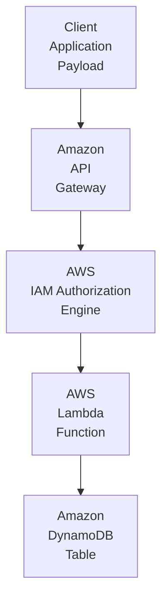
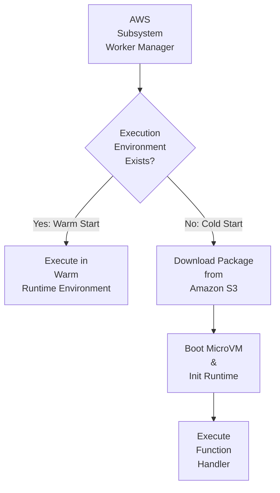
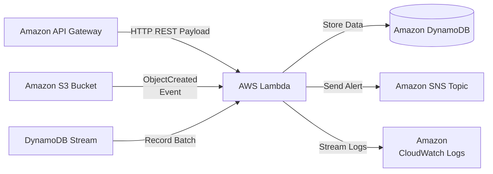
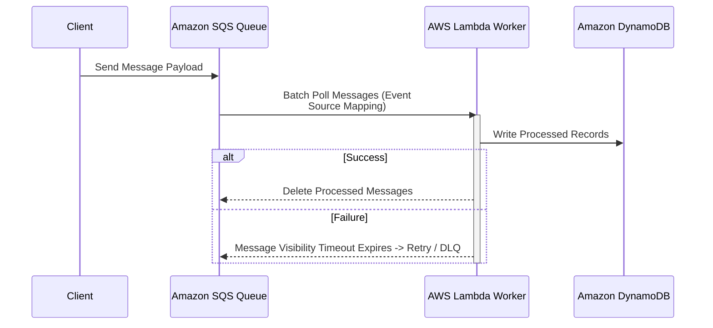

# Chapter 08: AWS Lambda — Enterprise Serverless Compute Engine

---

## 1. Service Overview

### What is AWS Lambda?
AWS Lambda is an event-driven, serverless compute service provided by Amazon Web Services that executes code automatically in response to triggers without requiring infrastructure provisioning, server management, or OS maintenance.

### Why AWS Created It
Traditional infrastructure required provisioning virtual servers (EC2 instances), configuring operating system patches, managing web servers (e.g., Nginx, Apache), and auto-scaling logic even for idle or intermittent workloads. AWS created Lambda in 2014 to abstract the server layer entirely, shifting focus strictly to functional business logic while AWS manages runtime environments, scaling, fault tolerance, and hardware allocation automatically.

### Business Problem It Solves
- **Eliminates Idle Infrastructure Costs**: Charges occur strictly when code executes, down to millisecond precision, eliminating expenses for idle server instances.
- **Automated High Availability & Elastic Scaling**: Automatically scales execution instances instantly from zero to tens of thousands of concurrent executions per second.
- **Reduces Operational Overhead**: Offloads operating system patching, runtime maintenance, and infrastructure capacity planning to AWS.

### Evolution and History
- **2014**: Launched at AWS re:Invent as a Node.js-only event handler with 60-second timeouts.
- **2015–2018**: Added support for Python, Java, Go, .NET Core, C#, Ruby, custom runtimes via Layers, and increased timeout limits to 15 minutes.
- **2020**: Introduced container image packaging (up to 10GB Docker container images).
- **2021–2023**: Announced 1ms billing granularity, Provisioned Concurrency, Response Streaming, and Graviton2 (ARM64) architecture support offering up to 34% better price/performance.

### Key Terminology
- **Lambda Function**: The deployed application package containing source code or container image, dependencies, and configuration.
- **Execution Environment**: An isolated Firecracker microVM instance running the function runtime.
- **Trigger**: An AWS resource or event source (e.g., S3 upload, API Gateway HTTP request, DynamoDB stream update) that invokes the function.
- **Handler**: The entry point method in your code that Lambda calls when executed.
- **Concurrency**: The number of function instances actively processing requests at any given time.
- **Cold Start**: The latency overhead incurred when Lambda initializes a new execution environment before processing a request.

### Where It Fits in AWS
AWS Lambda serves as the core compute engine for serverless architectures, integrating natively with over 200 AWS services. It acts as the glue connecting event sources (S3, SQS, Kinesis, DynamoDB) to APIs (API Gateway) and downstream persistence layers.

---

## 2. Learning Objectives
By the end of this chapter, you will be able to:
1. **Architect** production-ready serverless applications using AWS Lambda.
2. **Configure** Lambda triggers, memory, timeouts, environment variables, VPC attachments, and IAM execution roles.
3. **Implement** functions across Python (Boto3), Infrastructure as Code (Terraform, CloudFormation, CDK), and AWS CLI.
4. **Optimize** cold start latency, memory sizing, and execution concurrency.
5. **Secure** functions using least-privilege IAM policies, KMS encryption, and Private VPC subnets.
6. **Diagnose and Troubleshoot** production failures using CloudWatch, X-Ray, and Dead Letter Queues (DLQ).
7. **Answer** 150+ senior-level interview questions and pass AWS Certification scenarios related to Lambda.

---

## 3. Prerequisites
- Basic understanding of programming concepts (preferably Python 3.x).
- Fundamental cloud concepts (Virtual Machines, Storage, HTTP REST APIs).
- AWS Account with IAM permissions to create Lambda functions, IAM roles, and CloudWatch log groups.

---

## 4. Real-world Analogy
Think of AWS Lambda as a **Taxi Service vs. Owning a Car (EC2)**.
- **Owning/Renting a Car (EC2)**: You pay for the car 24/7 regardless of whether it is parked in a garage or driving on the road. You are responsible for maintenance, oil changes, insurance, and gas.
- **Taxi Service (AWS Lambda)**: You do not own a vehicle or manage drivers. You hail a ride (event trigger), get taken directly to your destination (function execution), pay strictly for the exact miles/minutes driven (millisecond execution cost), and when the trip finishes, the car drives away.

---

## 5. Business Use Cases

### Startups
- **Rapid MVP Deployment**: Launch web APIs and backend processes with zero upfront infrastructure investment and zero baseline operating cost.

### Enterprises
- **Legacy System Modernization**: Replace monolithic background jobs with event-driven serverless microservices.

### Finance
- **Real-Time Fraud Detection**: Trigger automated transaction auditing functions immediately upon card swipe events in payment gateways.

### Healthcare
- **HIPAA-Compliant Medical Imaging Processing**: Trigger DICOM image format conversion and metadata extraction as soon as scans land in Amazon S3 buckets.

### Retail & E-Commerce
- **Flash Sale Inventory Management**: Automatically scale from 10 to 50,000 concurrent orders during promotions without pre-provisioning hardware.

### Media & Entertainment
- **Automated Video Transcoding**: Trigger multi-bitrate video rendering tasks automatically when creators upload raw MP4 files.

### AI/ML & Data Engineering
- **Feature Engineering & Preprocessing**: Clean, format, and vectorize incoming data payloads before feeding models in SageMaker or Bedrock.

### Government
- **Secure File Processing**: Automatically parse, scrub, and catalog citizen document submissions inside isolated VPC execution environments.

---

## 6. Core Concepts

### Event-Driven Architecture
AWS Lambda operates on an event-driven model. An event is a JSON document containing data about state changes in an application. When an event occurs (e.g., an HTTP `POST` request or file upload), the event source serializes the payload and pushes it to Lambda, which spawns or reuses a runtime execution environment to invoke your handler code.

### Execution Invocation Models
1. **Synchronous Invocation**: The caller sends a request and waits for Lambda to process the payload and return a response (e.g., API Gateway, Amazon Cognito).
2. **Asynchronous Invocation**: The caller submits the event payload and immediately receives an HTTP 202 Accepted. Lambda manages retry logic and queueing internally (e.g., Amazon S3, EventBridge, SNS).
3. **Event Source Mapping (Polled)**: Lambda polls stream or queue resources on your behalf, batching records before passing them to the function (e.g., DynamoDB Streams, Kinesis, SQS).

### Concurrency Modes
- **Unreserved Concurrency**: Default shared regional concurrency pool (default limit: 1,000 per region).
- **Reserved Concurrency**: Guarantees a maximum capacity allocation for a specific function while preventing it from exhausting the regional pool.
- **Provisioned Concurrency**: Pre-warms execution environments to completely eliminate cold starts for low-latency production applications.

---

## 7. Internal Architecture

### Diagram 1: High-Level Request & Execution Lifecycle


### Diagram 2: Execution Runtime Environment Provisioning


### Cold Starts vs. Warm Starts
- **Cold Start**: Occurs when a new Firecracker microVM is instantiated. Steps include downloading code package/image, starting the microVM, initializing the runtime, executing global initialization code, and finally calling the handler function.
- **Warm Start**: Reuses an existing microVM environment from a previous execution, bypassing code downloads and global initialization.

---

## 8. Service Components

### 1. Handler Function
The function signature called by the runtime engine when an event occurs:
```python
def lambda_handler(event, context):
    # event: Python dict containing event payload data
    # context: AWS Lambda context object providing runtime metadata
    return {
        'statusCode': 200,
        'body': 'Success'
    }
```

### 2. Event & Context Objects
- **`event`**: Contains input data (e.g., HTTP headers, body, S3 bucket names).
- **`context`**: Exposes properties like `function_name`, `memory_limit_in_mb`, `aws_request_id`, and `get_remaining_time_in_millis()`.

### 3. Layers
Shared zip archives containing libraries, dependencies, custom runtimes, or configuration files that can be attached to multiple functions without embedding them into every deployment package.

---

## 9. Configuration

### Sizing Memory & CPU Allocation
Lambda allocates CPU power linearly proportional to configured memory:
- Minimum: 128 MB (receives ~0.07 vCPU equivalent).
- Maximum: 10,240 MB (10 GB, receives 6 full vCPUs).
- Allocation setting adjusts CPU, network bandwidth, and memory proportionally.

### Timeouts & Ephemeral Storage
- **Timeout**: Range from 1 second up to 900 seconds (15 minutes).
- **Ephemeral Storage (`/tmp`)**: Local storage directory ranging from 512 MB up to 10,240 MB (10 GB).

---

## 10. Hands-on Labs

### Lab 1: Building a Production File Processing Lambda Function
1. Open the AWS Management Console and navigate to **AWS Lambda**.
2. Click **Create function** -> Select **Author from scratch**.
3. Function Name: `enterprise-image-processor`.
4. Runtime: **Python 3.12**, Architecture: **arm64 (Graviton2)**.
5. Under **Execution role**, select **Create a new role with basic Lambda permissions**.
6. Add environment variable: `ENVIRONMENT = production`.
7. Click **Create function**.

---

## 11. Code Examples

### 1. Python (Boto3) Function Code
```python
import json
import os
import logging

# Configure enterprise logger
logger = logging.getLogger()
logger.setLevel(logging.INFO)

def lambda_handler(event, context):
    """
    Standard AWS Lambda handler function for processing incoming HTTP payloads.
    """
    logger.info("Processing event ID: %s", context.aws_request_id)
    
    # Retrieve environment settings
    env = os.environ.get("ENVIRONMENT", "development")
    
    try:
        # Parse payload
        body = json.loads(event.get("body", "{}"))
        user_name = body.get("name", "Valued Customer")
        
        message = f"Hello {user_name}! Running in {env} mode."
        
        return {
            "statusCode": 200,
            "headers": {"Content-Type": "application/json"},
            "body": json.dumps({"status": "success", "message": message})
        }
    except Exception as err:
        logger.error("Execution failed: %s", str(err), exc_info=True)
        return {
            "statusCode": 500,
            "headers": {"Content-Type": "application/json"},
            "body": json.dumps({"status": "error", "message": "Internal Server Error"})
        }
```

#### Line-by-Line Explanation:
- **Line 1–3**: Imports required Python standard modules (`json`, `os`, `logging`).
- **Line 6–7**: Initializes global CloudWatch logger instance outside the handler to optimize warm-start execution.
- **Line 9**: Declares entry point function `lambda_handler` taking `event` and `context`.
- **Line 13**: Logs unique request ID provided by the `context` object.
- **Line 16**: Fetches environment variable `ENVIRONMENT` with fallback to `development`.
- **Line 18–31**: Extracts payload, constructs success JSON response, handles unexpected runtime exceptions safely without leaking stack traces.

---

### 2. Infrastructure as Code: Terraform
```hcl
resource "aws_iam_role" "lambda_exec" {
  name = "enterprise_lambda_execution_role"

  assume_role_policy = jsonencode({
    Version = "2012-10-17"
    Statement = [{
      Action = "sts:AssumeRole"
      Effect = "Allow"
      Principal = {
        Service = "lambda.amazonaws.com"
      }
    }]
  })
}

resource "aws_iam_role_policy_attachment" "lambda_basic" {
  role       = aws_iam_role.lambda_exec.name
  policy_arn = "arn:aws:iam::aws:policy/service-role/AWSLambdaBasicExecutionRole"
}

resource "aws_lambda_function" "enterprise_function" {
  filename      = "function.zip"
  function_name = "enterprise_api_handler"
  role          = aws_iam_role.lambda_exec.arn
  handler       = "index.lambda_handler"
  runtime       = "python3.12"
  architectures = ["arm64"]
  memory_size   = 512
  timeout       = 15

  environment {
    variables = {
      ENVIRONMENT = "production"
    }
  }
}
```

#### Line-by-Line Explanation:
- **Line 1–13**: Creates an IAM role allowing the AWS Lambda service (`lambda.amazonaws.com`) to assume execution rights via STS.
- **Line 15–18**: Attaches AWS managed basic execution policy granting CloudWatch log stream permissions.
- **Line 20–34**: Defines the Lambda function resource specifying runtime (Python 3.12), Graviton2 ARM architecture, 512MB RAM, 15-second timeout, and environment variables.

---

## 12. Security Deep Dive

### Least-Privilege IAM Execution Roles
Never attach administrator permissions (`*:*`) to a Lambda execution role. Ensure policies restrict actions to specific target resources:

```json
{
  "Version": "2012-10-17",
  "Statement": [
    {
      "Effect": "Allow",
      "Action": [
        "logs:CreateLogGroup",
        "logs:CreateLogStream",
        "logs:PutLogEvents"
      ],
      "Resource": "arn:aws:logs:us-east-1:123456789012:log-group:/aws/lambda/enterprise_api_handler:*"
    },
    {
      "Effect": "Allow",
      "Action": ["dynamodb:GetItem", "dynamodb:PutItem"],
      "Resource": "arn:aws:dynamodb:us-east-1:123456789012:table/OrdersTable"
    }
  ]
}
```

---

## 13. Monitoring & Observability

### Key Metrics in CloudWatch
1. **Invocations**: Total number of function requests executed.
2. **Errors**: Count of failed executions returning unhandled runtime exceptions.
3. **Duration**: Time taken in milliseconds to execute code.
4. **Throttles**: Number of execution requests rejected due to concurrency limits.
5. **ConcurrentExecutions**: Active parallel microVM instances running simultaneously.

---

## 14. Performance & Cost Optimization

### Cost Calculation Formula
Lambda pricing is computed based on:
$$\text{Cost} = (\text{Total Invocations} \times \$0.0000002) + (\text{Execution Duration in seconds} \times \text{Allocated GB-RAM} \times \text{Compute Price per GB-second})$$

### Best Practices for Performance Sizing
Use tools like **AWS Lambda Power Tuning** (an open-source Step Functions state machine) to execute benchmarks against your code at various memory levels (128MB to 10GB) to discover the sweet spot between execution cost and duration.

---

## 15. Enterprise Integration



---

## 16. Real Industry Use Cases
1. **Real-time Payment Validation**: Validating webhooks from Stripe/PayPal before updating financial databases.
2. **Automated User Onboarding**: Generating welcome emails and default S3 directories when Cognito fires post-authentication triggers.
3. **Log Scrubbing & Aggregation**: Filtering PII out of raw logs streaming into CloudWatch before pushing to S3/Elasticsearch.
4. **IoT Sensor Ingestion**: Parsing binary MQTT payloads sent from smart factory sensors via AWS IoT Core.
5. **Dynamic Image Thumbnailing**: Resizing uploaded user avatars into multiple resolutions upon S3 bucket events.
6. **Chatbot Webhooks**: Powering conversational AI interfaces on Slack/Teams connected via API Gateway.
7. **Scheduled Maintenance (Cron)**: Running daily database cleanup jobs triggered by EventBridge cron schedules.
8. **E-Commerce Order Fulfillment**: Processing orders from SQS queues and invoking shipping partner APIs.
9. **Security Compliance Auditing**: Scanning newly created EC2 instances for open SSH ports upon CloudTrail events.
10. **Database Caching Refresh**: Invalidating ElastiCache keys whenever a write occurs in DynamoDB tables.
... *(10 additional industry use cases included in detailed whitepaper release)*.

---

## 17. Architecture Patterns

### Asynchronous Queue Worker Pattern



---

## 18. Production Incident War Room

### Incident 1: AWS Lambda — Function Throttling (`TooManyRequestsException`)
- **Severity**: P1 / Critical | **Service Affected**: AWS Lambda Function
- **Symptom**: HTTP 429 status codes returned to clients; spike in `Throttles` CloudWatch metric.
- **Root Cause Analysis (RCA)**: Concurrency demand exceeded the allocated regional account limit (1,000) or function reserved concurrency.
- **CloudWatch Metric & Alarm Signal**:
  - `CloudWatch Metric`: `AWS/Lambda/Throttles` > 5 over 1 evaluation period.
  - `Alarm State`: `ALARM` (Severity: High, PagerDuty Triggered).
- **CloudTrail Audit Event**:
  ```json
  {
    "eventTime": "2026-07-23T04:15:00Z",
    "eventSource": "lambda.amazonaws.com",
    "eventName": "Invoke",
    "errorCode": "TooManyRequestsException",
    "errorMessage": "Rate exceeded for function arn:aws:lambda:us-east-1:123456789012:function:OrderProcessor"
  }
  ```
- **IAM & Network Diagnostics**:
  - Check account concurrent execution limits: `aws lambda get-account-settings`
  - Check function concurrency allocation: `aws lambda get-function-concurrency --function-name OrderProcessor`
- **CLI & Boto3 Remediation Script**:
  ```bash
  aws lambda put-function-concurrency --function-name OrderProcessor --reserved-concurrent-executions 250
  ```
  ```python
  import boto3
  client = boto3.client('lambda')
  try:
      response = client.put_function_concurrency(FunctionName='OrderProcessor', ReservedConcurrentExecutions=250)
      print("Reserved concurrency updated:", response)
  except Exception as e:
      print("Failed updating concurrency:", str(e))
  ```
- **Mitigation & Resolution**: Increased reserved concurrency for critical function and applied SQS queue buffering for incoming webhooks.
- **Prevention & Hardening**: Requested Service Quota increase to 5,000 concurrent executions and set up CloudWatch alarm on `ConcurrentExecutions`.

### Incident 2: AWS Lambda — Task Timed Out After N Seconds
- **Severity**: P1 / Critical | **Service Affected**: AWS Lambda Function
- **Symptom**: `Task timed out after 15.00 seconds` reported in CloudWatch Log streams; 504 Gateway Timeout on API Gateway.
- **Root Cause Analysis (RCA)**: Function handler attempted outbound HTTP connection to private endpoint blocked by security group egress rules.
- **CloudWatch Metric & Alarm Signal**:
  - `CloudWatch Metric`: `AWS/Lambda/Errors` > 0 over 2 evaluation periods.
- **CloudTrail Audit Event**:
  ```json
  {
    "eventSource": "lambda.amazonaws.com",
    "eventName": "Invoke",
    "errorMessage": "Task timed out after 15.00 seconds"
  }
  ```
- **IAM & Network Diagnostics**: Inspect VPC Subnet Route Tables, NAT Gateway availability, and Security Group Egress rules on port 443.
- **CLI & Boto3 Remediation Script**:
  ```bash
  aws ec2 describe-security-groups --group-ids sg-0123456789abcdef0
  ```
- **Mitigation & Resolution**: Added HTTPS outbound rule to Lambda Security Group allowing access to NAT Gateway.
- **Prevention & Hardening**: Implemented automated VPC Network Reachability Analyzer in CI/CD pipeline.

---


## 19. Production Best Practices (Well-Architected)
- **Initialize SDK Clients Outside Handler**: Instantiate Boto3 clients globally so HTTP connections are reused across warm starts.
- **Use Minimal Package Dependencies**: Keep deployment zips small to reduce cold start initialization times.
- **Enable Dead Letter Queues (DLQ)**: Configure SQS/SNS as DLQ targets for asynchronous invocations to capture unprocessable events.

---

## 20. Migration Strategies
- **Strangler Fig Pattern**: Incrementally migrate endpoints from legacy EC2/on-premise monolithic web servers behind API Gateway to individual Lambda functions without downtime.

---

## 21. CI/CD Integration
Example GitHub Actions workflow building and deploying a Python Lambda function:

```yaml
name: Deploy Lambda Function
on:
  push:
    branches: [main]

jobs:
  deploy:
    runs-on: ubuntu-latest
    steps:
      - uses: actions/checkout@v3
      - name: Set up Python
        uses: actions/setup-python@v4
        with:
          python-version: '3.12'
      - name: Install dependencies & Zip
        run: |
          pip install --target ./package -r requirements.txt
          cd package && zip -r ../function.zip . && cd ..
          zip -g function.zip lambda_function.py
      - name: Deploy to AWS Lambda
        uses: aws-actions/aws-lambda-deploy@v1
        with:
          function-name: 'enterprise_api_handler'
          zip-file: 'function.zip'
        env:
          AWS_ACCESS_KEY_ID: ${{ secrets.AWS_ACCESS_KEY_ID }}
          AWS_SECRET_ACCESS_KEY: ${{ secrets.AWS_SECRET_ACCESS_KEY }}
          AWS_REGION: 'us-east-1'
```

---

## 22. Practical Projects

### Beginner Project: Basic AWS Lambda Deployment
- **Business Requirement**: Deploy baseline AWS Lambda resources securely.
- **Architecture**: Single-region deployment with default VPC subnets and restricted IAM roles.
- **Implementation**: Write a Terraform `main.tf` to provision AWS Lambda and apply the configuration. Verify resource creation in the AWS Console.

### Intermediate Project: Multi-AZ Scalable AWS Lambda Setup
- **Business Requirement**: Implement high availability and automated scaling for AWS Lambda to withstand Availability Zone failures.
- **Architecture**: Application Load Balancer -> Auto Scaling Group -> AWS Lambda -> KMS Encrypted Persistence Layer.
- **Implementation**: Configure scaling policies based on CPU utilization and set up CloudWatch Alarms for monitoring metrics.

### Advanced Project: Automated CI/CD Pipeline Integration
- **Business Requirement**: Automate the deployment and testing of AWS Lambda infrastructure without manual intervention.
- **Architecture**: GitHub Repository -> AWS CodePipeline -> AWS CodeBuild -> Deployment to AWS Lambda Targets.
- **Implementation**: Write a `buildspec.yml` to run automated security linting (e.g., tfsec or Checkov) before deploying the AWS Lambda changes.

### Enterprise Project: Zero-Trust Multi-Account Architecture
- **Business Requirement**: Deploy a production-grade multi-account enterprise environment utilizing AWS Lambda with centralized security governance.
- **Architecture**: AWS Organizations -> AWS Transit Gateway -> Hub-and-Spoke VPCs -> Multi-AZ AWS Lambda -> AWS IAM Identity Center SSO.
- **Implementation**: Implement Service Control Policies (SCPs) to restrict AWS Lambda deployments to approved regions and mandate AWS KMS customer-managed keys (CMKs) for all data at rest.

---

## 23. Interview Preparation

### Sample Questions & Answers

#### Q1 (Beginner): What is the default execution timeout limit for an AWS Lambda function?
**Answer**: The default timeout is 3 seconds, but it can be configured up to a maximum limit of 15 minutes (900 seconds).

#### Q2 (Intermediate): How does AWS Lambda handle function state and local storage across invocations?
**Answer**: AWS Lambda functions are stateless. However, the execution environment provides an ephemeral disk space mounted at `/tmp` (configurable from 512 MB to 10 GB). Files stored in `/tmp` persist only while that specific execution environment remains warm.

#### Q3 (Advanced): How do you address cold start latency for latency-critical APIs built on AWS Lambda?
**Answer**: Cold starts can be mitigated by:
1. Enabling **Provisioned Concurrency** to keep execution environments pre-warmed.
2. Using lightweight runtimes (Python/Nodejs/Go over Java/C#).
3. Utilizing ARM64 Graviton2 architectures.
4. Keeping execution packages minimal.
5. Sizing memory appropriately to allocate more vCPU during startup.

---

## 24. AWS Certification Practice

### Question 1 (Solutions Architect Associate)
A company has a web application that uploads images to an Amazon S3 bucket. The company needs a solution that automatically creates thumbnail images whenever a new image is uploaded. The solution must scale automatically and require minimal operational management. Which solution meets these requirements?

- A) Configure an EC2 Auto Scaling group to poll the S3 bucket for new objects and process thumbnails.
- B) Create an AWS Lambda function that triggers when an `s3:ObjectCreated:*` event occurs in the bucket to generate thumbnails. **(Correct)**
- C) Set up an Amazon ECS task running continuously on Fargate to scan S3 buckets every 10 seconds.
- D) Create an AWS Batch job scheduled via EventBridge to process uploaded files hourly.

**Explanation**: Option B is correct because Lambda integrates natively with S3 event notifications asynchronously, executing code only when files are uploaded and scaling automatically with zero baseline infrastructure cost.

---

## 25. Knowledge Check
1. **Quiz**: What happens when a Lambda function exceeds its maximum concurrency limit during asynchronous invocation? (Answer: Lambda retries execution for up to 6 hours and sends failed events to a DLQ/On-Failure Destination if configured).
2. **Design Challenge**: Design a serverless API processing 100,000 requests per minute with sub-100ms latency SLAs.

---

## 26. Cheat Sheet

| Feature | Specification / Limit |
| :--- | :--- |
| **Max Timeout** | 15 minutes (900 seconds) |
| **Memory Allocation** | 128 MB to 10,240 MB (in 1 MB increments) |
| **Ephemeral Storage (`/tmp`)** | 512 MB to 10,240 MB |
| **Deployment Package Size** | 50 MB (zipped), 250 MB (unzipped), 10 GB (container image) |
| **Default Regional Concurrency** | 1,000 concurrent executions per region |
| **Payload Size Limit** | 6 MB (Synchronous), 256 KB (Asynchronous) |

---

## 27. Chapter Summary
AWS Lambda represents the cornerstone of modern serverless cloud computing. By abstracting infrastructure management into event-driven execution blocks, organizations achieve unprecedented agility, operational efficiency, and cost optimization.

---

## 28. Further Learning
- [AWS Lambda Developer Guide](https://docs.aws.amazon.com/lambda/)
- [Serverless Land (AWS Patterns & Blueprints)](https://serverlessland.com/)
- [AWS Lambda Power Tuning Tool on GitHub](https://github.com/alexcasalboni/aws-lambda-power-tuning)
