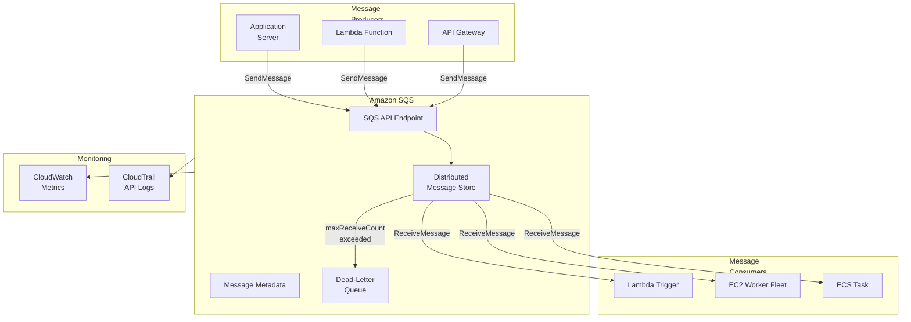
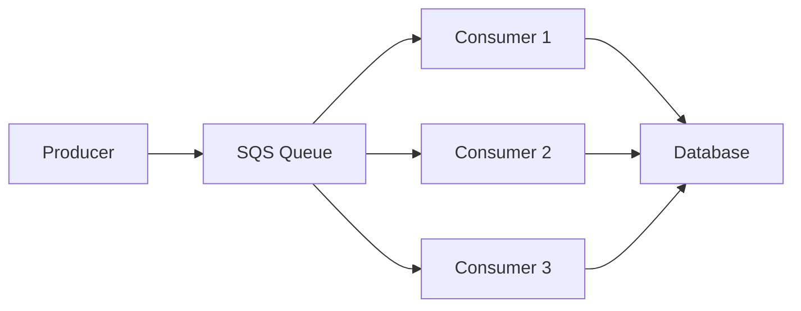
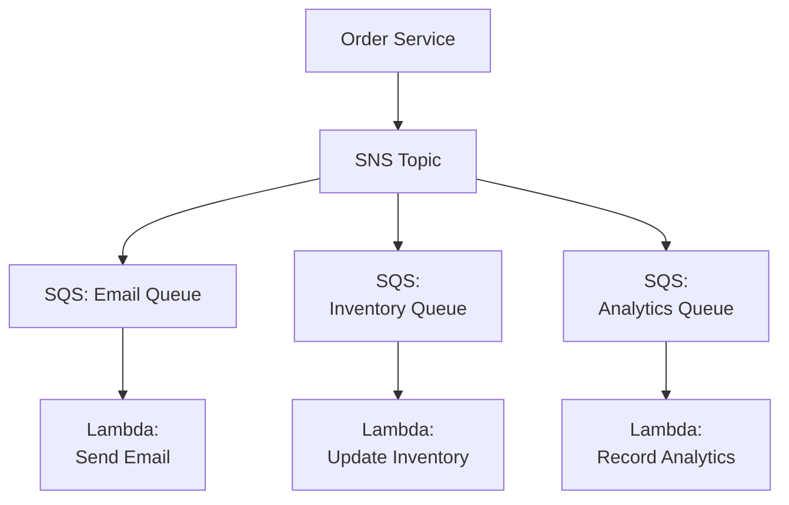
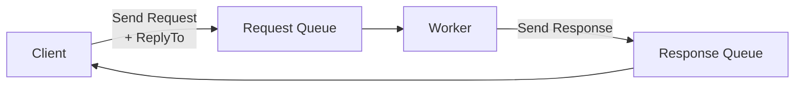
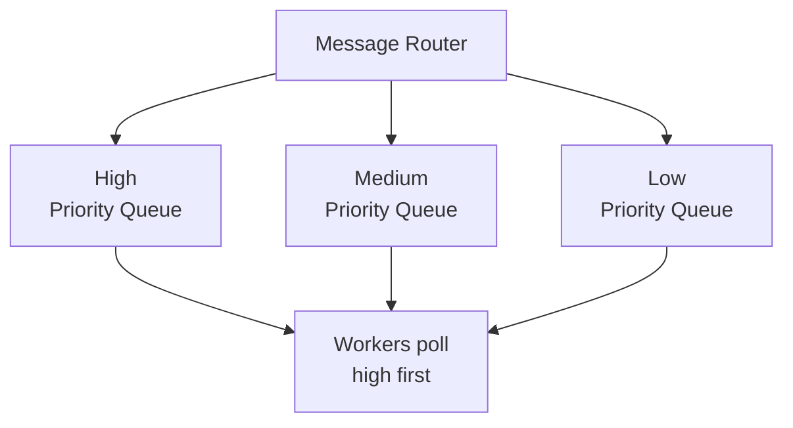

# Chapter 12: Amazon SQS — Simple Queue Service

---

## 1. Service Overview

Amazon Simple Queue Service (SQS) is a fully managed message queuing service that enables you to decouple and scale microservices, distributed systems, and serverless applications. SQS eliminates the complexity and overhead associated with managing and operating message-oriented middleware.

### Why SQS Exists

In tightly coupled architectures, if Service A calls Service B directly and Service B is down or slow, Service A also fails or slows down. This cascade effect brings down entire systems. SQS introduces an **asynchronous buffer** between producers and consumers, ensuring that:

- Producers can send messages even when consumers are offline
- Consumers process messages at their own pace
- Temporary load spikes are absorbed by the queue
- No messages are lost during failures

### Queue Types

| Feature | Standard Queue | FIFO Queue |
|---------|---------------|------------|
| **Throughput** | Unlimited (nearly) | 300 msg/sec (3,000 with batching) or up to 70,000 msg/sec (high throughput mode) |
| **Ordering** | Best-effort ordering | Strict first-in-first-out |
| **Delivery** | At-least-once (possible duplicates) | Exactly-once processing |
| **Deduplication** | Not built-in | Content-based or explicit deduplication ID |
| **Use Case** | High-throughput workloads | Order-critical operations (payments, transactions) |
| **Queue Name** | Any valid name | Must end with `.fifo` suffix |

### Key Characteristics

- **Fully Managed**: No infrastructure to provision, patch, or maintain
- **Serverless**: Scales automatically from 0 to millions of messages
- **Durable**: Messages stored redundantly across multiple AZs
- **Retention**: 1 minute to 14 days (default 4 days)
- **Message Size**: Up to 256 KB per message (use SQS Extended Client for up to 2 GB via S3)
- **Long Polling**: Reduces empty responses and API costs
- **Dead-Letter Queue (DLQ)**: Captures messages that fail processing after N attempts
- **Server-Side Encryption**: SSE-SQS (free) or SSE-KMS

---

## 2. Learning Objectives

By the end of this chapter, you will be able to:

- **Explain** the purpose of message queuing and when to use SQS vs SNS vs EventBridge vs Kinesis
- **Create** Standard and FIFO queues with appropriate configurations
- **Implement** producers and consumers using Boto3, AWS CLI, and IaC
- **Configure** visibility timeout, message retention, and dead-letter queues
- **Design** fan-out, work queue, and request-response patterns using SQS
- **Secure** queues with IAM policies, resource-based policies, encryption, and VPC endpoints
- **Monitor** queue depth, age of oldest message, and consumer lag using CloudWatch
- **Optimize** cost using long polling, batching, and right-sizing
- **Troubleshoot** production incidents involving message loss, duplicates, poison pills, and consumer starvation
- **Build** event-driven architectures with SQS + Lambda, SQS + ECS, and SQS + EC2 Auto Scaling

---

## 3. Prerequisites

- **AWS Account** with admin or PowerUser access
- **AWS CLI v2** installed and configured
- **Python 3.9+** with Boto3 installed
- **Completed chapters**: Chapter 1 (IAM), Chapter 8 (Lambda)
- **Concepts to know**: JSON, REST APIs, distributed systems fundamentals, producer-consumer pattern

---

## 4. Real-world Analogy

Think of SQS as a **post office mailbox system**.

When you send a letter (message), you drop it in the mailbox (queue). The postal carrier picks up letters at their own pace (consumer polling). If the recipient is on vacation (consumer offline), the letters wait safely in the mailbox. Multiple postal carriers can serve the same mailbox area (multiple consumers). If a letter cannot be delivered after multiple attempts, it goes to the dead letter office (DLQ).

**Extended analogy**:
- **Standard Queue** = Regular mail — might arrive slightly out of order, occasionally a duplicate
- **FIFO Queue** = Registered mail — guaranteed order, guaranteed single delivery
- **Visibility Timeout** = When a carrier picks up a letter, it becomes invisible to other carriers for a set time
- **Long Polling** = The carrier waits at the mailbox for up to 20 seconds instead of walking away empty-handed
- **Dead-Letter Queue** = Letters returned after 3 failed delivery attempts
- **Message Retention** = Post office holds mail for 14 days before discarding

---

## 5. Business Use Cases

### E-Commerce
- **Order Processing**: Web → SQS → Order Service (decouple frontend from backend processing)
- **Inventory Updates**: Multiple sellers publish inventory changes → SQS → Inventory Service
- **Payment Processing**: Orders placed during flash sales buffered in SQS, processed at sustainable rate

### Financial Services
- **Transaction Processing**: FIFO queue ensures transactions processed in exact order
- **Regulatory Reporting**: Market data events queued for batch regulatory filing
- **Fraud Alert Pipeline**: Fraud detection → SQS → Investigation team notification

### Media & Entertainment
- **Video Transcoding**: Upload → SQS → Transcoding workers (auto-scaling EC2 fleet)
- **Content Moderation**: User-generated content queued for ML-based content analysis
- **Notification Delivery**: Fan-out via SNS → multiple SQS queues for different notification channels

### IoT & Data Processing
- **Sensor Data Ingestion**: IoT devices → SQS → Lambda → DynamoDB (buffer bursty data)
- **Log Processing**: Applications → SQS → Elasticsearch/OpenSearch ingestion
- **ETL Pipeline Buffering**: Extract → SQS → Transform workers → Load to data warehouse

### DevOps
- **CI/CD Job Queue**: Build requests → SQS → Build workers (scale based on queue depth)
- **Infrastructure Change Queue**: Change requests → SQS → FIFO → Change execution engine
- **Alert Aggregation**: CloudWatch Alarms → SNS → SQS → Alert deduplication → PagerDuty

---

## 6. Core Concepts

### Message Lifecycle

1. **Producer** sends a message to the queue using `SendMessage` API
2. Message is stored redundantly across multiple AZs
3. **Consumer** calls `ReceiveMessage` to retrieve the message
4. Message becomes **invisible** for the duration of the `VisibilityTimeout`
5. Consumer processes the message
6. Consumer calls `DeleteMessage` to permanently remove it
7. If the consumer fails or times out, the message becomes **visible** again for another consumer
8. After `maxReceiveCount` failed attempts, the message moves to the **Dead-Letter Queue**

### Visibility Timeout

When a consumer receives a message, it becomes invisible to other consumers. This prevents multiple consumers from processing the same message simultaneously.

- **Default**: 30 seconds
- **Range**: 0 seconds to 12 hours
- **Best practice**: Set to 6× your average processing time
- **Dynamic extension**: Use `ChangeMessageVisibility` if processing takes longer than expected

### Long Polling vs Short Polling

| Aspect | Short Polling | Long Polling |
|--------|--------------|--------------|
| **Behavior** | Returns immediately, even if empty | Waits up to 20 seconds for messages |
| **Empty Responses** | Frequent | Minimal |
| **API Costs** | Higher (more API calls) | Lower |
| **Latency** | Slightly lower for first message | Slightly higher (waits for timeout) |
| **Configuration** | `WaitTimeSeconds = 0` | `WaitTimeSeconds = 1-20` |

### Dead-Letter Queue (DLQ)

A DLQ is a separate SQS queue that receives messages that could not be processed successfully. Configure via **Redrive Policy**:

```json
{
  "deadLetterTargetArn": "arn:aws:sqs:us-east-1:123456789012:MyQueue-DLQ",
  "maxReceiveCount": 3
}
```

After a message is received `maxReceiveCount` times without being deleted, it is automatically moved to the DLQ. The DLQ **must** be the same type (Standard → Standard DLQ, FIFO → FIFO DLQ).

### DLQ Redrive (Move Messages Back)

SQS supports **DLQ Redrive** to move messages from the DLQ back to the source queue after fixing the processing issue:

```bash
aws sqs start-message-move-task \
  --source-arn arn:aws:sqs:us-east-1:123456789012:MyQueue-DLQ \
  --destination-arn arn:aws:sqs:us-east-1:123456789012:MyQueue \
  --max-number-of-messages-per-second 50
```

### Message Deduplication (FIFO)

FIFO queues prevent duplicate messages using two methods:
1. **Content-Based Deduplication**: SQS generates a SHA-256 hash of the message body. Duplicate bodies within the 5-minute deduplication interval are rejected.
2. **Explicit Deduplication ID**: Producer provides a `MessageDeduplicationId`. Messages with the same ID within 5 minutes are rejected.

### Message Group ID (FIFO)

Messages with the same `MessageGroupId` are processed in strict FIFO order. Different group IDs can be processed in parallel. This enables per-entity ordering (e.g., all messages for `customer-123` are ordered, while `customer-456` messages are independent).

---

## 7. Internal Architecture



### How SQS Works Internally

1. **Distributed Storage**: Messages are stored redundantly across multiple servers in multiple Availability Zones within a region
2. **At-Least-Once Delivery**: Because messages are stored on multiple servers, a consumer might receive a copy from any server, leading to possible duplicates (Standard queues)
3. **Weighted Random Sampling**: Standard queues distribute messages across servers. Consumers receive messages from a random subset of servers, which is why ordering is best-effort
4. **FIFO Implementation**: FIFO queues use a single logical partition per Message Group ID, ensuring strict ordering within each group

---

## 8. Service Components

### Queue
The core resource. Identified by a URL (e.g., `https://sqs.us-east-1.amazonaws.com/123456789012/MyQueue`). Stores messages until consumed or expired.

### Message
A unit of data sent to a queue. Contains:
- **Body**: Up to 256 KB of text (JSON, XML, plain text)
- **Attributes**: System attributes (SenderId, SentTimestamp, ApproximateReceiveCount, etc.)
- **Message Attributes**: Custom key-value metadata (up to 10 attributes)
- **Message ID**: Unique identifier assigned by SQS
- **Receipt Handle**: Temporary token for deleting or changing visibility

### Dead-Letter Queue
A secondary queue that captures messages that fail processing. Essential for troubleshooting and preventing poison pill messages from blocking the main queue.

### Queue Policy
A resource-based policy (JSON) that controls who can send to or receive from the queue. Similar to S3 bucket policies.

### SQS Extended Client Library
For messages larger than 256 KB (up to 2 GB), the Extended Client Library stores the message payload in S3 and puts a reference pointer in SQS.

---

## 9. Configuration

### Queue Configuration Parameters

| Parameter | Default | Range | Description |
|-----------|---------|-------|-------------|
| `VisibilityTimeout` | 30 seconds | 0 – 43,200 (12 hours) | Time a message is invisible after being received |
| `MessageRetentionPeriod` | 345,600 (4 days) | 60 – 1,209,600 (14 days) | How long messages are kept |
| `MaximumMessageSize` | 262,144 (256 KB) | 1,024 – 262,144 | Max message body size in bytes |
| `DelaySeconds` | 0 | 0 – 900 (15 min) | Delay before message becomes visible |
| `ReceiveMessageWaitTimeSeconds` | 0 | 0 – 20 | Long polling wait time |
| `ContentBasedDeduplication` | false | true/false | FIFO only: auto-deduplicate by body hash |
| `DeduplicationScope` | queue | queue/messageGroup | FIFO: deduplication scope |
| `FifoThroughputLimit` | perQueue | perQueue/perMessageGroupId | FIFO: high throughput mode |

### Queue Policy Example (Allow SNS to Send Messages)

```json
{
  "Version": "2012-10-17",
  "Statement": [
    {
      "Sid": "AllowSNSPublish",
      "Effect": "Allow",
      "Principal": {
        "Service": "sns.amazonaws.com"
      },
      "Action": "sqs:SendMessage",
      "Resource": "arn:aws:sqs:us-east-1:123456789012:MyQueue",
      "Condition": {
        "ArnEquals": {
          "aws:SourceArn": "arn:aws:sns:us-east-1:123456789012:MyTopic"
        }
      }
    }
  ]
}
```

---

## 10. Code Examples

### Python (Boto3) — Complete Producer/Consumer

```python
import boto3
import json
import time

sqs = boto3.client('sqs', region_name='us-east-1')

# Create a Standard Queue
response = sqs.create_queue(
    QueueName='OrderProcessingQueue',
    Attributes={
        'VisibilityTimeout': '120',
        'MessageRetentionPeriod': '604800',  # 7 days
        'ReceiveMessageWaitTimeSeconds': '20',  # Long polling
        'DelaySeconds': '0'
    },
    tags={
        'Environment': 'production',
        'Team': 'orders'
    }
)
queue_url = response['QueueUrl']
print(f"Queue created: {queue_url}")

# Create a DLQ
dlq_response = sqs.create_queue(
    QueueName='OrderProcessingQueue-DLQ',
    Attributes={
        'MessageRetentionPeriod': '1209600'  # 14 days
    }
)
dlq_url = dlq_response['QueueUrl']
dlq_arn = sqs.get_queue_attributes(
    QueueUrl=dlq_url,
    AttributeNames=['QueueArn']
)['Attributes']['QueueArn']

# Attach DLQ redrive policy
sqs.set_queue_attributes(
    QueueUrl=queue_url,
    Attributes={
        'RedrivePolicy': json.dumps({
            'deadLetterTargetArn': dlq_arn,
            'maxReceiveCount': '3'
        })
    }
)

# --- PRODUCER ---
def send_order(order):
    """Send an order message to the queue."""
    response = sqs.send_message(
        QueueUrl=queue_url,
        MessageBody=json.dumps(order),
        MessageAttributes={
            'OrderType': {
                'DataType': 'String',
                'StringValue': order.get('type', 'standard')
            },
            'Priority': {
                'DataType': 'Number',
                'StringValue': str(order.get('priority', 5))
            }
        },
        DelaySeconds=0
    )
    print(f"Sent order {order['orderId']}, MessageId: {response['MessageId']}")
    return response['MessageId']

# Send batch messages (up to 10 per call)
def send_order_batch(orders):
    """Send up to 10 orders in a single API call."""
    entries = []
    for i, order in enumerate(orders[:10]):
        entries.append({
            'Id': str(i),
            'MessageBody': json.dumps(order),
            'DelaySeconds': 0
        })
    response = sqs.send_message_batch(
        QueueUrl=queue_url,
        Entries=entries
    )
    print(f"Sent {len(response.get('Successful', []))} messages")
    if response.get('Failed'):
        print(f"Failed: {response['Failed']}")

# --- CONSUMER ---
def process_orders(max_messages=10, wait_time=20):
    """Poll and process messages from the queue."""
    while True:
        response = sqs.receive_message(
            QueueUrl=queue_url,
            MaxNumberOfMessages=min(max_messages, 10),  # Max 10 per call
            WaitTimeSeconds=wait_time,       # Long polling
            MessageAttributeNames=['All'],   # Retrieve all custom attributes
            AttributeNames=['All']           # Retrieve all system attributes
        )

        messages = response.get('Messages', [])
        if not messages:
            print("No messages available, waiting...")
            continue

        for msg in messages:
            try:
                order = json.loads(msg['Body'])
                receive_count = msg['Attributes'].get('ApproximateReceiveCount', '?')
                print(f"Processing order {order['orderId']} (attempt {receive_count})")

                # --- Business logic here ---
                process_single_order(order)

                # Delete message after successful processing
                sqs.delete_message(
                    QueueUrl=queue_url,
                    ReceiptHandle=msg['ReceiptHandle']
                )
                print(f"Order {order['orderId']} processed and deleted")

            except Exception as e:
                print(f"Error processing message: {e}")
                # Message will become visible again after VisibilityTimeout
                # After maxReceiveCount failures, it moves to DLQ

def process_single_order(order):
    """Simulate order processing."""
    print(f"  Validating order {order['orderId']}...")
    time.sleep(1)
    print(f"  Processing payment...")
    time.sleep(1)
    print(f"  Order {order['orderId']} complete")

# Send sample orders
for i in range(5):
    send_order({
        'orderId': f'ORD-{1000+i}',
        'customerId': f'CUST-{2000+i}',
        'type': 'standard',
        'priority': 5,
        'totalAmount': 49.99 + i * 10
    })

# Process orders
process_orders()
```

### AWS CLI — Common Operations

```bash
# Create a Standard queue
aws sqs create-queue \
  --queue-name OrderProcessingQueue \
  --attributes '{
    "VisibilityTimeout": "120",
    "MessageRetentionPeriod": "604800",
    "ReceiveMessageWaitTimeSeconds": "20"
  }'

# Create a FIFO queue
aws sqs create-queue \
  --queue-name PaymentQueue.fifo \
  --attributes '{
    "FifoQueue": "true",
    "ContentBasedDeduplication": "true",
    "VisibilityTimeout": "60"
  }'

# Send a message
aws sqs send-message \
  --queue-url https://sqs.us-east-1.amazonaws.com/123456789012/OrderProcessingQueue \
  --message-body '{"orderId": "ORD-1001", "amount": 49.99}' \
  --delay-seconds 0

# Send to FIFO queue
aws sqs send-message \
  --queue-url https://sqs.us-east-1.amazonaws.com/123456789012/PaymentQueue.fifo \
  --message-body '{"paymentId": "PAY-001", "amount": 100.00}' \
  --message-group-id "customer-123" \
  --message-deduplication-id "pay-001-attempt-1"

# Receive messages (long polling)
aws sqs receive-message \
  --queue-url https://sqs.us-east-1.amazonaws.com/123456789012/OrderProcessingQueue \
  --max-number-of-messages 10 \
  --wait-time-seconds 20 \
  --attribute-names All \
  --message-attribute-names All

# Delete a message
aws sqs delete-message \
  --queue-url https://sqs.us-east-1.amazonaws.com/123456789012/OrderProcessingQueue \
  --receipt-handle "AQEBxx...=="

# Get queue attributes
aws sqs get-queue-attributes \
  --queue-url https://sqs.us-east-1.amazonaws.com/123456789012/OrderProcessingQueue \
  --attribute-names ApproximateNumberOfMessages ApproximateNumberOfMessagesNotVisible

# Purge all messages from queue
aws sqs purge-queue \
  --queue-url https://sqs.us-east-1.amazonaws.com/123456789012/OrderProcessingQueue

# Delete queue
aws sqs delete-queue \
  --queue-url https://sqs.us-east-1.amazonaws.com/123456789012/OrderProcessingQueue
```

### Terraform

```hcl
resource "aws_sqs_queue" "order_processing" {
  name                       = "OrderProcessingQueue"
  visibility_timeout_seconds = 120
  message_retention_seconds  = 604800
  max_message_size           = 262144
  delay_seconds              = 0
  receive_wait_time_seconds  = 20

  redrive_policy = jsonencode({
    deadLetterTargetArn = aws_sqs_queue.order_dlq.arn
    maxReceiveCount     = 3
  })

  sqs_managed_sse_enabled = true

  tags = {
    Environment = "production"
    Team        = "orders"
  }
}

resource "aws_sqs_queue" "order_dlq" {
  name                      = "OrderProcessingQueue-DLQ"
  message_retention_seconds = 1209600  # 14 days
  sqs_managed_sse_enabled   = true
}

resource "aws_sqs_queue_redrive_allow_policy" "order_dlq_allow" {
  queue_url = aws_sqs_queue.order_dlq.id
  redrive_allow_policy = jsonencode({
    redrivePermission = "byQueue"
    sourceQueueArns   = [aws_sqs_queue.order_processing.arn]
  })
}

# Lambda event source mapping
resource "aws_lambda_event_source_mapping" "sqs_trigger" {
  event_source_arn                   = aws_sqs_queue.order_processing.arn
  function_name                      = aws_lambda_function.processor.arn
  batch_size                         = 10
  maximum_batching_window_in_seconds = 5
  function_response_types            = ["ReportBatchItemFailures"]
  enabled                            = true
}
```

### CloudFormation

```yaml
AWSTemplateFormatVersion: '2010-09-09'
Description: SQS Order Processing Queue with DLQ

Resources:
  OrderDLQ:
    Type: AWS::SQS::Queue
    Properties:
      QueueName: OrderProcessingQueue-DLQ
      MessageRetentionPeriod: 1209600
      SqsManagedSseEnabled: true

  OrderQueue:
    Type: AWS::SQS::Queue
    Properties:
      QueueName: OrderProcessingQueue
      VisibilityTimeout: 120
      MessageRetentionPeriod: 604800
      ReceiveMessageWaitTimeSeconds: 20
      SqsManagedSseEnabled: true
      RedrivePolicy:
        deadLetterTargetArn: !GetAtt OrderDLQ.Arn
        maxReceiveCount: 3

  OrderQueuePolicy:
    Type: AWS::SQS::QueuePolicy
    Properties:
      Queues:
        - !Ref OrderQueue
      PolicyDocument:
        Version: '2012-10-17'
        Statement:
          - Sid: AllowSNSPublish
            Effect: Allow
            Principal:
              Service: sns.amazonaws.com
            Action: sqs:SendMessage
            Resource: !GetAtt OrderQueue.Arn
            Condition:
              ArnEquals:
                aws:SourceArn: !Ref OrderTopic

Outputs:
  QueueUrl:
    Value: !Ref OrderQueue
  QueueArn:
    Value: !GetAtt OrderQueue.Arn
  DLQUrl:
    Value: !Ref OrderDLQ
```

---

## 11. Line-by-Line Explanation

### Boto3 `receive_message` Breakdown

```python
response = sqs.receive_message(
    # The URL of the queue to poll (not the ARN)
    QueueUrl=queue_url,
    # Receive up to 10 messages at once (max allowed per call)
    # Reduces API costs — 1 API call vs 10 individual calls
    MaxNumberOfMessages=10,
    # Long polling: wait up to 20 seconds for messages to arrive
    # If a message arrives during this wait, it returns immediately
    # Setting to 0 = short polling (immediate return, even if empty)
    WaitTimeSeconds=20,
    # Retrieve custom message attributes set by the producer
    # 'All' returns all attributes; you can also specify names
    MessageAttributeNames=['All'],
    # Retrieve system attributes (SenderId, SentTimestamp, etc.)
    AttributeNames=['All']
)
# response['Messages'] is a list of message objects
# Each message contains: MessageId, ReceiptHandle, Body, Attributes, MessageAttributes
# ReceiptHandle is required to delete or change visibility of the message
```

### FIFO Message Sending Breakdown

```python
response = sqs.send_message(
    QueueUrl=fifo_queue_url,
    MessageBody=json.dumps({"paymentId": "PAY-001"}),
    # MessageGroupId: Messages with the same group ID are processed in FIFO order
    # Different group IDs enable parallel processing while maintaining per-group ordering
    # Example: Use customer ID as group ID for per-customer ordering
    MessageGroupId="customer-123",
    # MessageDeduplicationId: Prevents duplicate messages within a 5-minute window
    # If content-based deduplication is enabled, this is optional
    # SQS rejects messages with the same dedup ID sent within 5 minutes
    MessageDeduplicationId="pay-001-v1"
)
```

---

## 12. Security Deep Dive

### IAM Policy (Least Privilege)

```json
{
  "Version": "2012-10-17",
  "Statement": [
    {
      "Sid": "AllowProducerActions",
      "Effect": "Allow",
      "Action": [
        "sqs:SendMessage",
        "sqs:GetQueueUrl",
        "sqs:GetQueueAttributes"
      ],
      "Resource": "arn:aws:sqs:us-east-1:123456789012:OrderProcessingQueue"
    },
    {
      "Sid": "AllowConsumerActions",
      "Effect": "Allow",
      "Action": [
        "sqs:ReceiveMessage",
        "sqs:DeleteMessage",
        "sqs:ChangeMessageVisibility",
        "sqs:GetQueueUrl",
        "sqs:GetQueueAttributes"
      ],
      "Resource": "arn:aws:sqs:us-east-1:123456789012:OrderProcessingQueue"
    }
  ]
}
```

### Encryption

| Type | Description | Cost |
|------|-------------|------|
| **SSE-SQS** | SQS-managed encryption keys | Free |
| **SSE-KMS** | Customer-managed KMS keys | KMS API costs |
| **In-Transit** | TLS 1.2+ enforced on all API calls | Free |

### VPC Endpoint

```bash
aws ec2 create-vpc-endpoint \
  --vpc-id vpc-12345678 \
  --service-name com.amazonaws.us-east-1.sqs \
  --vpc-endpoint-type Interface \
  --subnet-ids subnet-aaa subnet-bbb \
  --security-group-ids sg-12345678
```

### Cross-Account Access

Allow Account B to send messages to Account A's queue:

```json
{
  "Version": "2012-10-17",
  "Statement": [
    {
      "Sid": "AllowCrossAccountSend",
      "Effect": "Allow",
      "Principal": {
        "AWS": "arn:aws:iam::987654321098:root"
      },
      "Action": "sqs:SendMessage",
      "Resource": "arn:aws:sqs:us-east-1:123456789012:OrderProcessingQueue"
    }
  ]
}
```

### Security Best Practices

1. **Use SSE** — Enable at minimum SSE-SQS; use SSE-KMS for regulated workloads
2. **Enforce TLS** — Add `aws:SecureTransport` condition to queue policy
3. **Least Privilege** — Separate producer and consumer IAM roles
4. **VPC Endpoints** — Keep traffic off the public internet
5. **Queue Policies** — Restrict access by source ARN, account, or VPC
6. **Enable CloudTrail** — Audit all SQS API calls
7. **Disable Public Access** — Never allow `Principal: "*"` without conditions

---

## 13. Monitoring & Observability

### CloudWatch Metrics

| Metric | Description | Alert Threshold |
|--------|-------------|-----------------|
| `ApproximateNumberOfMessagesVisible` | Messages available for retrieval | > backlog threshold |
| `ApproximateNumberOfMessagesNotVisible` | Messages being processed | Spike = slow consumers |
| `ApproximateNumberOfMessagesDelayed` | Messages in delay period | Unexpected values |
| `ApproximateAgeOfOldestMessage` | Age of oldest message (seconds) | > SLA threshold |
| `NumberOfMessagesSent` | Messages sent per period | Drop = producer issue |
| `NumberOfMessagesReceived` | Messages received per period | Drop = consumer issue |
| `NumberOfMessagesDeleted` | Messages deleted per period | Divergence from received |
| `NumberOfEmptyReceives` | Empty poll responses | High = use long polling |
| `SentMessageSize` | Size of sent messages | Approaching 256 KB |

### Critical Alarms

```bash
# Queue depth alarm (backlog growing)
aws cloudwatch put-metric-alarm \
  --alarm-name "SQS-OrderQueue-HighBacklog" \
  --metric-name ApproximateNumberOfMessagesVisible \
  --namespace AWS/SQS \
  --dimensions Name=QueueName,Value=OrderProcessingQueue \
  --statistic Average \
  --period 300 \
  --threshold 10000 \
  --comparison-operator GreaterThanThreshold \
  --evaluation-periods 3 \
  --alarm-actions arn:aws:sns:us-east-1:123456789012:ops-alerts

# Old message alarm (SLA breach risk)
aws cloudwatch put-metric-alarm \
  --alarm-name "SQS-OrderQueue-OldMessages" \
  --metric-name ApproximateAgeOfOldestMessage \
  --namespace AWS/SQS \
  --dimensions Name=QueueName,Value=OrderProcessingQueue \
  --statistic Maximum \
  --period 60 \
  --threshold 3600 \
  --comparison-operator GreaterThanThreshold \
  --evaluation-periods 1 \
  --alarm-actions arn:aws:sns:us-east-1:123456789012:ops-alerts

# DLQ messages alarm
aws cloudwatch put-metric-alarm \
  --alarm-name "SQS-OrderDLQ-MessagesPresent" \
  --metric-name ApproximateNumberOfMessagesVisible \
  --namespace AWS/SQS \
  --dimensions Name=QueueName,Value=OrderProcessingQueue-DLQ \
  --statistic Sum \
  --period 60 \
  --threshold 1 \
  --comparison-operator GreaterThanOrEqualToThreshold \
  --evaluation-periods 1 \
  --alarm-actions arn:aws:sns:us-east-1:123456789012:ops-alerts
```

### Auto Scaling Based on Queue Depth

```bash
# Scale EC2 workers based on SQS backlog per instance
aws autoscaling put-scaling-policy \
  --auto-scaling-group-name order-workers \
  --policy-name ScaleOnQueueDepth \
  --policy-type TargetTrackingScaling \
  --target-tracking-configuration '{
    "CustomizedMetricSpecification": {
      "MetricName": "BacklogPerInstance",
      "Namespace": "Custom/SQS",
      "Statistic": "Average"
    },
    "TargetValue": 100
  }'
```

---

## 14. Performance & Cost Optimization

### Cost Model

| Action | Cost (US East) |
|--------|---------------|
| First 1M requests/month | Free |
| Standard queue requests | $0.40 per 1M requests |
| FIFO queue requests | $0.50 per 1M requests |
| Data transfer (in) | Free |
| Data transfer (out, same region) | Free |

**What counts as a request**: SendMessage, ReceiveMessage, DeleteMessage, ChangeMessageVisibility, etc. Batch operations (up to 10 messages) count as a single request.

### Optimization Strategies

**1. Use Batch Operations**: `SendMessageBatch` and `DeleteMessageBatch` process up to 10 messages per API call — 10× cost reduction.

**2. Use Long Polling**: Set `ReceiveMessageWaitTimeSeconds` to 20. Eliminates empty responses that still cost money.

**3. Right-Size Visibility Timeout**: Too short = duplicate processing = wasted compute. Too long = slow retry on failure.

**4. Use Lambda Event Source Mapping**: AWS manages polling, batching, and scaling. Batch size up to 10,000 messages with batching window.

**5. Message Batching at Application Level**: Aggregate multiple small events into a single SQS message to reduce API calls.

**6. SQS Extended Client for Large Messages**: Instead of sending 256 KB messages (which count as 256 KB × requests), store large payloads in S3 and send only the reference.

### Performance Limits

| Limit | Standard | FIFO |
|-------|----------|------|
| SendMessage throughput | Unlimited | 300 msg/sec (3,000 batched) |
| In-flight messages | 120,000 | 20,000 |
| Message size | 256 KB | 256 KB |
| Batch size | 10 messages | 10 messages |
| Long poll wait | 20 seconds | 20 seconds |

---

## 15. Enterprise Integration

### SQS + Lambda (Event-Driven Processing)

Lambda polls SQS automatically when configured as an event source. Key settings:

- **BatchSize**: 1–10,000 messages per invocation
- **MaximumBatchingWindowInSeconds**: Wait up to 5 min to fill a batch
- **ReportBatchItemFailures**: Return only failed message IDs instead of failing the entire batch
- **Scaling**: Lambda scales up to 1,000 concurrent executions, adding 60 functions/minute

```python
# Lambda handler with batch item failure reporting
def handler(event, context):
    batch_item_failures = []
    for record in event['Records']:
        try:
            body = json.loads(record['body'])
            process_order(body)
        except Exception as e:
            batch_item_failures.append({
                'itemIdentifier': record['messageId']
            })
    return {'batchItemFailures': batch_item_failures}
```

### SQS + EC2 Auto Scaling

Scale EC2 worker instances based on queue depth. Use the custom metric `BacklogPerInstance = ApproximateNumberOfMessagesVisible / RunningInstances`.

### SNS + SQS (Fan-Out Pattern)

```
                    ┌──→ SQS Queue A → Lambda (Email Notifications)
SNS Topic ──────────┼──→ SQS Queue B → Lambda (SMS Notifications)
                    └──→ SQS Queue C → Lambda (Push Notifications)
```

### SQS + Step Functions

Use SQS as a buffer before Step Functions to prevent throttling during traffic spikes.

### Multi-Region Architecture

SQS is a regional service. For multi-region:
1. Deploy queues in each region
2. Use Route 53 to direct producers to the nearest region
3. Use Lambda@Edge or CloudFront to route requests
4. Ensure consumer idempotency for cross-region failover

---

## 16. Real Industry Use Cases

### Case 1: Capital One — Real-Time Transaction Processing
**Problem**: Process millions of card transactions per day with zero data loss during downstream outages.
**Solution**: Transaction events → SQS Standard (buffer) → Lambda → DynamoDB. DLQ captures failed transactions for manual review.
**Result**: Zero data loss, 99.99% availability, handles 50,000 TPS during peak.

### Case 2: Netflix — Microservice Decoupling
**Problem**: 100+ microservices need asynchronous communication without tight coupling.
**Solution**: SQS queues between service boundaries. Each service owns its queue. Fan-out via SNS → SQS.
**Result**: Individual services can be deployed, scaled, and maintained independently.

### Case 3: Airbnb — Image Processing Pipeline
**Problem**: Process user-uploaded property images (resize, watermark, moderation) at varying scale.
**Solution**: S3 upload → SNS → SQS → EC2 Auto Scaling worker fleet. Queue depth drives scaling.
**Result**: Auto-scales from 2 to 200 workers during listing season, scales to zero overnight.

### Case 4: Samsung — IoT Data Ingestion
**Problem**: Millions of IoT devices sending telemetry data in unpredictable bursts.
**Solution**: IoT Core → SQS (buffer) → Lambda → Kinesis Firehose → S3/Redshift.
**Result**: Absorbs 100× traffic spikes without data loss or downstream overload.

---

## 17. Architecture Patterns

### Pattern 1: Work Queue (Competing Consumers)



### Pattern 2: Fan-Out (SNS + SQS)



### Pattern 3: Request-Response (Temporary Queue)



### Pattern 4: Priority Queue



---

## 18. Production Incident War Room

### Incident 1: Messages Disappearing Without Processing
**Severity**: P1 — Critical
**Symptoms**: Producers sending messages, but consumers report no messages received. Queue metrics show `NumberOfMessagesSent` increasing but `ApproximateNumberOfMessagesVisible` stays at zero.
**Business Impact**: 5,000+ orders lost in 30 minutes.
**Root Cause**: `VisibilityTimeout` was set to 5 seconds. Consumer took 30+ seconds to process. Messages became visible again, were re-received by another consumer, and after `maxReceiveCount` (3), moved to DLQ. The DLQ alarm was not configured.
**CLI Diagnostic**:
```bash
aws sqs get-queue-attributes --queue-url $QUEUE_URL \
  --attribute-names ApproximateNumberOfMessagesVisible ApproximateNumberOfMessagesNotVisible
aws sqs get-queue-attributes --queue-url $DLQ_URL \
  --attribute-names ApproximateNumberOfMessagesVisible
```
**Immediate Mitigation**: Process DLQ messages manually. Increase `VisibilityTimeout` to 180 seconds.
**Permanent Fix**: Set visibility timeout to 6× average processing time. Add DLQ alarm. Add `ChangeMessageVisibility` calls for long-running tasks. Implement `ReportBatchItemFailures` for Lambda consumers.
**Preventive Control**: CloudWatch alarm on DLQ `ApproximateNumberOfMessagesVisible > 0`.

---

### Incident 2: Consumer Starvation — Messages Stuck in NotVisible
**Severity**: P2 — High
**Symptoms**: `ApproximateNumberOfMessagesNotVisible` growing, `ApproximateNumberOfMessagesVisible` at zero. Consumers idle.
**Root Cause**: A consumer crashed after receiving messages but before deleting them. Messages stuck in NotVisible state for the full VisibilityTimeout (12 hours due to misconfiguration).
**Immediate Mitigation**: Identify the stuck messages using receipt handles from logs. Use `ChangeMessageVisibility` to set timeout to 0, making them immediately visible.
**Permanent Fix**: Use reasonable VisibilityTimeout (2–5 minutes). Implement consumer health checks. Use Lambda event source mapping which handles visibility automatically.

---

### Incident 3: FIFO Queue Throughput Bottleneck
**Severity**: P2 — High
**Symptoms**: FIFO queue `NumberOfMessagesSent` capped at 300/sec. Producers receiving `OverLimit` throttling.
**Root Cause**: All messages used the same `MessageGroupId`, forcing sequential processing. FIFO throughput per message group is 300 msg/sec.
**Permanent Fix**: Use granular `MessageGroupId` values (e.g., customer ID, order ID) to enable parallel processing across groups. Enable high-throughput FIFO mode for up to 70,000 msg/sec.

---

### Incident 4: Duplicate Processing in Standard Queue
**Severity**: P2 — High
**Symptoms**: Customers charged twice. Duplicate records in database.
**Root Cause**: Standard queues deliver at-least-once. Under load, messages were delivered to multiple consumers.
**Permanent Fix**: Implement **idempotency** in consumers. Use DynamoDB conditional writes with message ID as idempotency key. For financial transactions, switch to FIFO queue with exactly-once processing.

---

### Incident 5: Queue Purge Accident in Production
**Severity**: P1 — Critical
**Symptoms**: All messages deleted from production queue. Zero messages visible.
**Root Cause**: Operator ran `purge-queue` against production instead of staging queue.
**Business Impact**: 12,000 messages permanently lost. No recovery possible (SQS does not support message recovery).
**Permanent Fix**: Restrict `sqs:PurgeQueue` permission to break-glass roles only. Implement naming conventions (`prod-*`, `staging-*`). Use SCP to deny PurgeQueue in production accounts.

---

### Incident 6: Lambda Consumer Not Scaling
**Severity**: P2 — High
**Symptoms**: Queue depth growing continuously. Lambda concurrency at 5 despite queue having 50,000 messages.
**Root Cause**: Lambda event source mapping scales by adding 60 instances/minute. With BatchSize=1 and no batching window, each Lambda processed 1 message at a time. Additionally, reserved concurrency was set to 5.
**Permanent Fix**: Increase BatchSize to 100. Set MaximumBatchingWindowInSeconds to 5. Remove or increase reserved concurrency. Implement `ReportBatchItemFailures`.

---

### Incident 7: Cross-Account Access Denied
**Severity**: P3 — Medium
**Symptoms**: Application in Account B receives `AccessDenied` when sending to queue in Account A.
**Root Cause**: Queue policy allowed Account B's root, but the IAM role in Account B did not have `sqs:SendMessage` permission. Both the queue policy AND the IAM policy must allow the action.
**Permanent Fix**: Update both the SQS queue policy and the IAM role policy. Test with `aws sts get-caller-identity` and `aws sqs send-message --debug`.

---

### Incident 8: Message Retention Expired Before Processing
**Severity**: P1 — Critical
**Symptoms**: Old messages silently disappearing. No DLQ entries.
**Root Cause**: Message retention was set to default (4 days). Processing backlog during holiday weekend exceeded 4 days. Messages expired and were permanently deleted by SQS.
**Permanent Fix**: Increase retention to 14 days (maximum). Add alarm on `ApproximateAgeOfOldestMessage` approaching retention period. Scale consumers during known high-volume periods.

---

### Incident 9: SQS Extended Client S3 Bucket Deleted
**Severity**: P1 — Critical
**Symptoms**: Consumers receiving messages but `Body` contains only an S3 reference that returns 404.
**Root Cause**: The S3 bucket used by SQS Extended Client was accidentally deleted. Message bodies were stored in S3 and only pointers were in SQS.
**Permanent Fix**: Enable S3 versioning and MFA delete on the Extended Client bucket. Add bucket policy denying `s3:DeleteBucket`. Use separate, protected buckets for message storage.

---

### Incident 10: Poison Pill Message Blocking FIFO Queue
**Severity**: P1 — Critical
**Symptoms**: FIFO queue completely stalled. No messages in the message group being processed.
**Root Cause**: A malformed message in a FIFO message group caused consumer exceptions. Because FIFO guarantees ordering, the poisoned message blocked all subsequent messages in that group.
**Immediate Mitigation**: Manually receive and delete the poison pill message.
**Permanent Fix**: Configure DLQ with `maxReceiveCount: 3`. Implement input validation before queuing. Add message schema validation in the consumer with graceful error handling.

---

### Incident 11: Encryption Key Deletion Breaks Queue
**Severity**: P1 — Critical
**Symptoms**: All `SendMessage` and `ReceiveMessage` calls failing with `KMS.AccessDeniedException`.
**Root Cause**: The KMS CMK used for SSE-KMS queue encryption was scheduled for deletion and entered pending deletion state.
**Permanent Fix**: Cancel key deletion. Switch to SSE-SQS for non-regulated queues. For SSE-KMS, add key deletion protection and key policy requiring admin approval.

---

### Incident 12: Lambda Batch Processing — Entire Batch Retried
**Severity**: P2 — High
**Symptoms**: Some messages processed multiple times. Duplicate entries in database.
**Root Cause**: Lambda function processing a batch of 10 messages. One message failed, causing the function to throw an exception. Lambda retried the entire batch, including the 9 successfully processed messages.
**Permanent Fix**: Implement `ReportBatchItemFailures`. Return only the failed message IDs. Implement idempotency for all message handlers.

---

### Incident 13: Delayed Messages Not Appearing
**Severity**: P3 — Medium
**Symptoms**: Messages sent with `DelaySeconds: 900` (15 minutes) not visible to consumers for 15 minutes, causing confusion.
**Root Cause**: Working as designed — this is the expected behavior of message delay. The operations team was unaware of the delay setting.
**Permanent Fix**: Document all queue configurations. Add dashboard showing delayed message count. Train operations team on SQS delay behavior.

---

### Incident 14: ApproximateAgeOfOldestMessage Showing Stale Value
**Severity**: P3 — Medium
**Symptoms**: Alarm firing on `ApproximateAgeOfOldestMessage > 3600` but queue appears empty.
**Root Cause**: A single message was received but not deleted (visibility expired). It kept cycling: visible → received → visibility expires → visible. Age accumulated across cycles.
**Permanent Fix**: Investigate DLQ for cycling messages. Add logging to identify unprocessable messages. Ensure all code paths delete messages after processing.

---

### Incident 15: SQS + API Gateway Timeout Mismatch
**Severity**: P2 — High
**Symptoms**: API Gateway returning 504 timeout errors for synchronous SQS send operations.
**Root Cause**: API Gateway integration timeout was 29 seconds (max). SQS `SendMessage` was timing out due to network latency to VPC endpoint under high load.
**Permanent Fix**: Use async API Gateway → SQS integration (returns 200 immediately). Process responses asynchronously. Monitor VPC endpoint throughput.

---

## 19. Production Best Practices (Well-Architected)

### Operational Excellence
- **Always configure a DLQ** with alarm on message count > 0
- **Use long polling** (WaitTimeSeconds = 20) to reduce costs and empty responses
- **Use batch operations** for sending and deleting messages
- **Enable CloudTrail** for API audit logging
- **Tag all queues** with environment, team, and cost center
- **Use IaC** (CloudFormation, CDK, Terraform) for queue management

### Security
- **Enable encryption** — SSE-SQS at minimum, SSE-KMS for regulated data
- **Enforce TLS** with `aws:SecureTransport` condition in queue policy
- **Use VPC endpoints** for private connectivity
- **Least privilege IAM** — separate producer and consumer roles
- **Queue policies** — restrict by source ARN and account

### Reliability
- **Set visibility timeout to 6× processing time**
- **Configure DLQ with maxReceiveCount 3–5**
- **Use ReportBatchItemFailures** with Lambda consumers
- **Implement idempotent consumers** for Standard queues
- **Set message retention to 14 days** for critical queues

### Performance
- **Use FIFO high-throughput mode** for ordered, high-volume workloads
- **Use granular MessageGroupId** for FIFO parallelism
- **Batch send/receive/delete** to reduce API calls
- **Use Lambda event source mapping** for serverless consumers

### Cost
- **Long polling eliminates empty responses** (saves ~60% on API costs)
- **Batch operations** (10× cost reduction)
- **Right-size visibility timeout** (prevents wasteful reprocessing)
- **Monitor and archive DLQ messages** (don't pay for retention of processed messages)

---

## 20. Migration Strategies

### From RabbitMQ/ActiveMQ to SQS

| RabbitMQ Concept | SQS Equivalent |
|-----------------|----------------|
| Exchange + Routing Key | SNS Topic + SQS Subscription Filter |
| Queue | SQS Queue |
| Consumer Acknowledgment | DeleteMessage |
| Dead Letter Exchange | Dead-Letter Queue |
| Message TTL | MessageRetentionPeriod |
| Priority Queue | Multiple queues with priority-based polling |

**Migration Steps**:
1. Deploy SQS queues mirroring RabbitMQ queue topology
2. Update producers to dual-write (RabbitMQ + SQS) during transition
3. Deploy new consumers reading from SQS
4. Validate message processing parity
5. Cut over producers to SQS-only
6. Decommission RabbitMQ

### From Kafka to SQS

Use SQS when you need simple message queuing without stream processing semantics (consumer groups, offsets, replay). Keep Kafka for event streaming, log aggregation, and real-time analytics.

---

## 21. CI/CD Integration

### Queue Deployment Pipeline

```yaml
# GitHub Actions — Deploy SQS with CloudFormation
name: Deploy SQS Infrastructure
on:
  push:
    branches: [main]
    paths: ['infrastructure/sqs/**']

jobs:
  deploy:
    runs-on: ubuntu-latest
    steps:
      - uses: actions/checkout@v4
      - uses: aws-actions/configure-aws-credentials@v4
        with:
          role-to-assume: ${{ secrets.AWS_ROLE_ARN }}
          aws-region: us-east-1

      - name: Validate CloudFormation
        run: aws cloudformation validate-template --template-body file://infrastructure/sqs/template.yaml

      - name: Deploy Stack
        run: |
          aws cloudformation deploy \
            --template-file infrastructure/sqs/template.yaml \
            --stack-name sqs-order-processing \
            --capabilities CAPABILITY_IAM \
            --no-fail-on-empty-changeset

      - name: Smoke Test
        run: |
          QUEUE_URL=$(aws cloudformation describe-stacks \
            --stack-name sqs-order-processing \
            --query 'Stacks[0].Outputs[?OutputKey==`QueueUrl`].OutputValue' \
            --output text)
          aws sqs send-message --queue-url $QUEUE_URL --message-body '{"test": true}'
          aws sqs receive-message --queue-url $QUEUE_URL --wait-time-seconds 5
```

---

## 22. Practical Projects

### Beginner Project: Basic Amazon SQS Deployment
- **Business Requirement**: Deploy baseline Amazon SQS resources securely.
- **Architecture**: Single-region deployment with default VPC subnets and restricted IAM roles.
- **Implementation**: Write a Terraform `main.tf` to provision Amazon SQS and apply the configuration. Verify resource creation in the AWS Console.

### Intermediate Project: Multi-AZ Scalable Amazon SQS Setup
- **Business Requirement**: Implement high availability and automated scaling for Amazon SQS to withstand Availability Zone failures.
- **Architecture**: Application Load Balancer -> Auto Scaling Group -> Amazon SQS -> KMS Encrypted Persistence Layer.
- **Implementation**: Configure scaling policies based on CPU utilization and set up CloudWatch Alarms for monitoring metrics.

### Advanced Project: Automated CI/CD Pipeline Integration
- **Business Requirement**: Automate the deployment and testing of Amazon SQS infrastructure without manual intervention.
- **Architecture**: GitHub Repository -> AWS CodePipeline -> AWS CodeBuild -> Deployment to Amazon SQS Targets.
- **Implementation**: Write a `buildspec.yml` to run automated security linting (e.g., tfsec or Checkov) before deploying the Amazon SQS changes.

### Enterprise Project: Zero-Trust Multi-Account Architecture
- **Business Requirement**: Deploy a production-grade multi-account enterprise environment utilizing Amazon SQS with centralized security governance.
- **Architecture**: AWS Organizations -> AWS Transit Gateway -> Hub-and-Spoke VPCs -> Multi-AZ Amazon SQS -> AWS IAM Identity Center SSO.
- **Implementation**: Implement Service Control Policies (SCPs) to restrict Amazon SQS deployments to approved regions and mandate AWS KMS customer-managed keys (CMKs) for all data at rest.

---

## 23. Interview Preparation

### Beginner
**Q1**: What is Amazon SQS?
**A**: A fully managed message queuing service for decoupling distributed systems. Producers send messages; consumers retrieve and process them asynchronously.

**Q2**: Standard vs FIFO — when do you choose each?
**A**: Standard for high throughput with at-least-once delivery. FIFO when message order matters (e.g., financial transactions) and exactly-once processing is required.

**Q3**: What is a Dead-Letter Queue?
**A**: A separate queue that captures messages that fail processing after a configured number of attempts (`maxReceiveCount`). Used for troubleshooting and preventing poison pill messages.

### Intermediate
**Q4**: Explain visibility timeout and how to set it correctly.
**A**: After a consumer receives a message, it becomes invisible for `VisibilityTimeout` seconds, preventing other consumers from processing it. Set to 6× your average processing time. Use `ChangeMessageVisibility` for dynamic extension.

**Q5**: How does SQS + Lambda event source mapping work?
**A**: Lambda service polls SQS on your behalf, retrieves batches of messages, and invokes your function. It handles scaling, error management, and can report batch item failures for partial batch retry.

**Q6**: How do you handle duplicate messages in Standard queues?
**A**: Implement idempotent consumers. Use DynamoDB conditional writes with the SQS MessageId as an idempotency key. Check-and-write pattern prevents duplicate processing.

### Advanced
**Q7**: Compare SQS, SNS, EventBridge, and Kinesis.
**A**: SQS: point-to-point async messaging with buffering. SNS: pub/sub fan-out. EventBridge: event bus with rules and filtering. Kinesis: ordered stream processing with replay. Choose based on pattern: queue (SQS), broadcast (SNS), route (EventBridge), stream (Kinesis).

**Q8**: Design a system that processes 1 million messages/day with exactly-once semantics.
**A**: Use FIFO queues with high-throughput mode. Partition by entity ID using MessageGroupId. Use content-based deduplication. Consumer writes to DynamoDB with conditional expressions. Lambda event source with `ReportBatchItemFailures`. DLQ for failed messages. CloudWatch alarms on queue depth and DLQ count.

### System Design
**Q9**: Design a notification system that sends emails, SMS, and push notifications.
**A**: SNS topic for fan-out → 3 SQS queues (email, SMS, push). Each queue has its own Lambda consumer. DLQ per queue. Rate limiting via reserved concurrency. Per-channel retry configuration. CloudWatch monitoring per channel.

---

## 24. AWS Certification Practice

### Cloud Practitioner
**Q1**: Which AWS service enables you to decouple application components?
- A) Amazon SNS
- **B) Amazon SQS** ✓
- C) AWS Lambda
- D) Amazon API Gateway

### Solutions Architect Associate
**Q2**: An application must process messages in exact order with no duplicates. Which SQS configuration should be used?
- A) Standard queue with deduplication
- **B) FIFO queue with content-based deduplication** ✓
- C) Standard queue with visibility timeout
- D) FIFO queue with delay seconds

**Q3**: A company wants to scale EC2 instances based on the number of messages in an SQS queue. What metric should the Auto Scaling policy use?
- A) `NumberOfMessagesReceived`
- B) `ApproximateNumberOfMessagesVisible`
- **C) Backlog per instance (custom metric: messages / instances)** ✓
- D) `ApproximateAgeOfOldestMessage`

### Developer Associate
**Q4**: A Lambda function processes SQS messages in batches of 10. One message fails. How can you retry only the failed message?
- A) Throw an exception to retry the entire batch
- B) Delete all messages and re-queue the failed one
- **C) Use `ReportBatchItemFailures` and return the failed message ID** ✓
- D) Use a DLQ to capture the failed message

---

## 25. Knowledge Check

1. **What is the maximum message size in SQS?** 256 KB (up to 2 GB with Extended Client Library via S3).
2. **What is the maximum retention period?** 14 days.
3. **What is long polling?** Setting `ReceiveMessageWaitTimeSeconds` to 1–20, so the consumer waits for messages instead of returning immediately empty.
4. **What happens when maxReceiveCount is exceeded?** The message is moved to the configured Dead-Letter Queue.
5. **How many messages can you send/receive in a batch?** Up to 10.
6. **What is the FIFO throughput limit?** 300 msg/sec per message group (3,000 with batching), up to 70,000 msg/sec in high-throughput mode.
7. **How do you prevent duplicate processing in Standard queues?** Implement idempotent consumers using unique message IDs.
8. **What is the visibility timeout range?** 0 seconds to 12 hours.
9. **Can you retrieve a specific message by ID?** No — SQS is a pull-based system where consumers receive the next available message(s).
10. **What encryption options are available?** SSE-SQS (free), SSE-KMS (customer key), and TLS in transit.

---

## 26. Cheat Sheet

| Item | Detail |
|------|--------|
| **Service** | Amazon SQS |
| **Type** | Fully managed message queuing |
| **Queue Types** | Standard (unlimited throughput, at-least-once) / FIFO (ordered, exactly-once) |
| **Max Message Size** | 256 KB (2 GB with Extended Client) |
| **Max Retention** | 14 days (default 4 days) |
| **Visibility Timeout** | 0 sec – 12 hours (default 30 sec) |
| **Long Polling** | Up to 20 seconds |
| **Batch Size** | Up to 10 messages per API call |
| **FIFO Throughput** | 300/sec per group (70K high-throughput) |
| **In-flight (Standard)** | 120,000 messages |
| **In-flight (FIFO)** | 20,000 messages |
| **DLQ** | Separate queue with Redrive Policy |
| **Encryption** | SSE-SQS (free) / SSE-KMS |
| **Key CLI** | `send-message`, `receive-message`, `delete-message`, `purge-queue` |
| **Key Metrics** | `ApproximateNumberOfMessagesVisible`, `ApproximateAgeOfOldestMessage` |

---

## 27. Chapter Summary

Amazon SQS is the foundational message queuing service in AWS. Key takeaways:

- **Standard queues** for maximum throughput with at-least-once delivery
- **FIFO queues** for strict ordering and exactly-once processing
- **Always configure a DLQ** with `maxReceiveCount` 3–5 and alarm on message count
- **Use long polling** to reduce costs and empty responses
- **Use batch operations** for 10× cost reduction
- **Set visibility timeout to 6× processing time** — too short causes duplicates, too long delays retries
- **Implement idempotent consumers** — SQS Standard may deliver duplicates
- **Use Lambda event source mapping** with `ReportBatchItemFailures` for serverless consumers
- **Monitor**: queue depth, age of oldest message, DLQ count, and empty receives
- **Security**: SSE encryption, VPC endpoints, least-privilege IAM, queue policies

---

## 28. Further Learning

### AWS Documentation
- [Amazon SQS Developer Guide](https://docs.aws.amazon.com/AWSSimpleQueueService/latest/SQSDeveloperGuide/)
- [SQS FIFO Queues](https://docs.aws.amazon.com/AWSSimpleQueueService/latest/SQSDeveloperGuide/FIFO-queues.html)
- [Lambda with SQS](https://docs.aws.amazon.com/lambda/latest/dg/with-sqs.html)
- [SQS Extended Client Library](https://docs.aws.amazon.com/AWSSimpleQueueService/latest/SQSDeveloperGuide/sqs-s3-messages.html)

### AWS Workshops
- [Decoupling with SQS](https://catalog.workshops.aws/decoupling/en-US)
- [Serverless Patterns Collection](https://serverlessland.com/patterns?services=sqs)

### Related Chapters
- **Chapter 8 — AWS Lambda**: Serverless consumers for SQS
- **Chapter 13 — Amazon SNS**: Fan-out pattern with SQS
- **Chapter 14 — Amazon EventBridge**: Event routing and filtering
- **Chapter 35 — AWS Step Functions**: Workflow orchestration with SQS buffering
