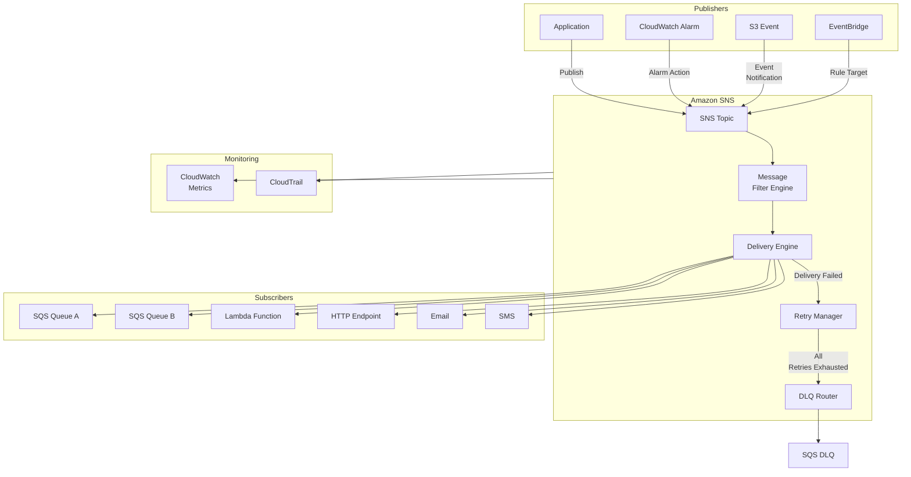
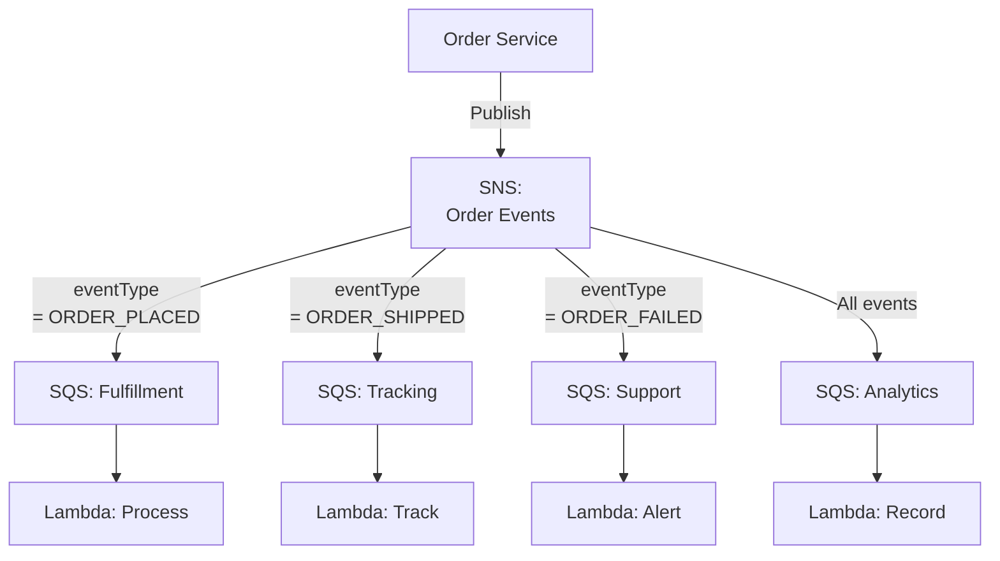
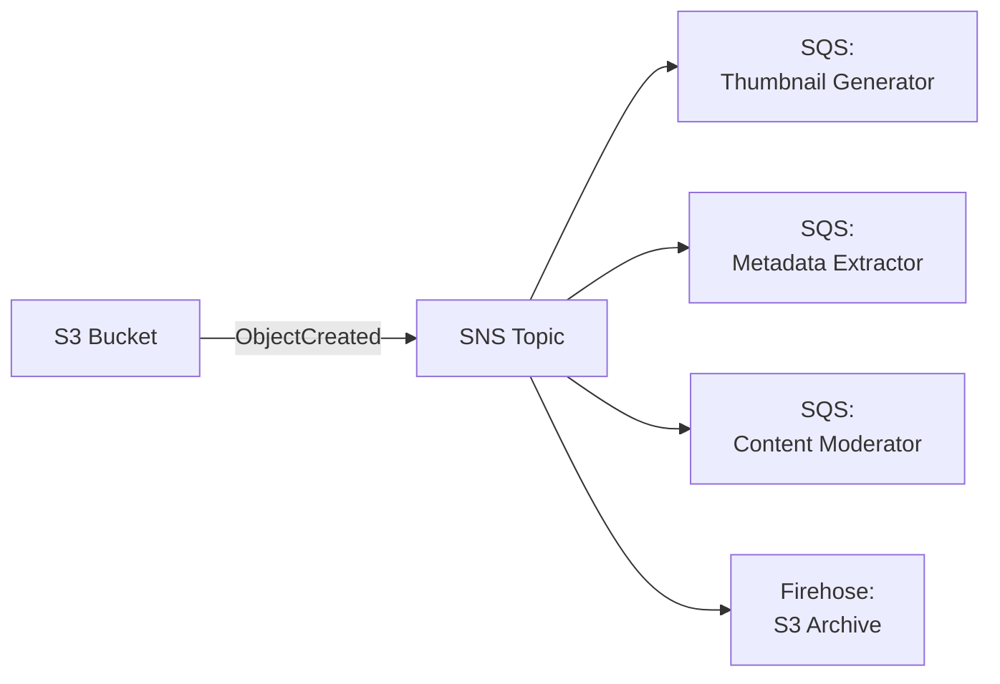
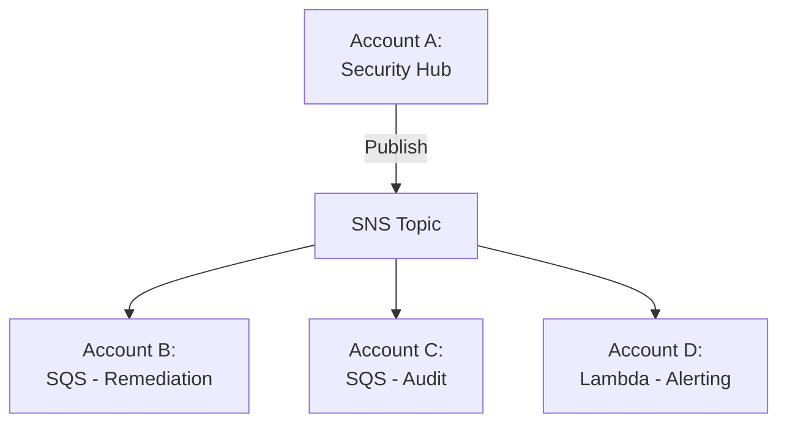

# Chapter 13: Amazon SNS — Simple Notification Service

---

## 1. Service Overview

Amazon Simple Notification Service (SNS) is a fully managed pub/sub messaging service that enables you to decouple microservices, distributed systems, and serverless applications. SNS follows the **publish-subscribe** pattern — publishers send messages to a **topic**, and all **subscribers** to that topic receive the message simultaneously.

### Why SNS Exists

In distributed systems, a single event often needs to trigger multiple downstream actions. Without SNS, the producing service would need to know about and directly call every consumer — creating tight coupling, increasing latency, and making the system fragile. SNS enables **fan-out**: one message published once reaches all subscribers automatically.

### SNS vs SQS — When to Use Which

| Feature | SNS | SQS |
|---------|-----|-----|
| **Pattern** | Pub/Sub (one-to-many) | Queue (one-to-one) |
| **Delivery** | Push to subscribers | Pull by consumers |
| **Persistence** | No message persistence | Messages persist until consumed |
| **Use Case** | Fan-out, notifications, broadcasting | Work queues, buffering, decoupling |
| **Consumer Count** | Unlimited subscribers | Competing consumers |
| **Retry** | Limited retries per protocol | Visibility timeout + DLQ |

### Key Characteristics

- **Fully Managed**: No infrastructure to provision or maintain
- **High Throughput**: Millions of messages per second
- **Fan-Out**: One message delivered to millions of subscribers
- **Multiple Protocols**: HTTP/S, Email, SMS, SQS, Lambda, Kinesis Data Firehose, mobile push
- **Message Filtering**: Subscribers receive only messages matching their filter policy
- **FIFO Topics**: Strict ordering and deduplication (paired with FIFO SQS queues)
- **Message Archiving**: Archive messages to S3 via Kinesis Data Firehose
- **Encryption**: SSE-KMS for at-rest encryption, TLS for in-transit
- **Cross-Region Delivery**: Publish in one region, deliver globally

---

## 2. Learning Objectives

By the end of this chapter, you will be able to:

- **Explain** the pub/sub pattern and when to use SNS vs SQS vs EventBridge
- **Create** Standard and FIFO topics with appropriate configurations
- **Implement** publishers and subscribers using Boto3, CLI, and IaC
- **Configure** subscription filters to route messages to specific subscribers
- **Design** fan-out architectures using SNS + SQS pattern
- **Implement** mobile push notifications using SNS platform applications
- **Secure** topics with IAM policies, resource policies, encryption, and VPC endpoints
- **Monitor** topics using CloudWatch metrics and CloudTrail
- **Optimize** costs using message filtering and batching
- **Troubleshoot** delivery failures, filter mismatches, and throttling issues

---

## 3. Prerequisites

- **AWS Account** with admin or PowerUser access
- **AWS CLI v2** installed and configured
- **Python 3.9+** with Boto3 installed
- **Completed chapters**: Chapter 1 (IAM), Chapter 8 (Lambda), Chapter 12 (SQS)
- **Concepts**: JSON, HTTP webhooks, pub/sub messaging pattern

---

## 4. Real-world Analogy

Think of SNS as a **newspaper publishing company**.

The newspaper (SNS topic) publishes one edition (message). Thousands of subscribers receive it simultaneously — some get the physical paper (SQS), some get an email digest (Email), some get a text alert for breaking news (SMS), and some read it on their phone app (mobile push). Each subscriber chose their delivery method when they subscribed.

**Extended analogy**:
- **Topic** = Newspaper title (e.g., "The Daily News")
- **Publisher** = Journalist filing a story
- **Subscriber** = Reader who signed up for delivery
- **Subscription Filter** = Reader who only wants the Sports section
- **Fan-Out** = One newspaper, delivered to 100,000 homes simultaneously
- **FIFO Topic** = Breaking news wire where story order matters
- **DLQ** = Returned mail when delivery address is invalid

---

## 5. Business Use Cases

### Application Integration
- **Microservice Fan-Out**: Order placed → SNS → Inventory Service + Payment Service + Notification Service + Analytics Service
- **Event Broadcasting**: User signup → SNS → Welcome email + CRM update + Analytics + Fraud check
- **Cross-Account Notifications**: Security findings → SNS → Multiple AWS accounts for remediation

### Operations & Monitoring
- **CloudWatch Alarm Notifications**: CPU > 80% → SNS → Email + PagerDuty + Slack
- **Infrastructure Events**: Auto Scaling events → SNS → Operations team + Audit log
- **CI/CD Notifications**: Build completed → SNS → Developers + Deployment pipeline

### Customer Communication
- **Transactional Emails**: Order confirmation, shipping updates, password resets
- **SMS Alerts**: Two-factor authentication, account alerts, delivery notifications
- **Mobile Push**: App updates, promotional alerts, real-time notifications

### Data Processing
- **S3 Event Fan-Out**: File uploaded to S3 → SNS → Multiple processing pipelines
- **IoT Event Distribution**: Device alert → SNS → Dashboard + Maintenance team + Logging
- **ETL Pipeline Triggers**: Data landing in S3 → SNS → Glue job + Lambda validation + Audit

---

## 6. Core Concepts

### Topic

A topic is a logical access point and communication channel. Publishers send messages to a topic. Subscribers receive messages from a topic. Topics are identified by an ARN.

**Standard Topics**: Best-effort ordering, at-least-once delivery, nearly unlimited throughput.
**FIFO Topics**: Strict ordering within message groups, exactly-once delivery, 300 messages/sec (3,000 with batching).

### Subscription

A subscription connects a topic to an endpoint. When a message is published to the topic, SNS delivers it to all confirmed subscriptions. Subscription protocols:

| Protocol | Endpoint Example | Use Case |
|----------|-----------------|----------|
| **SQS** | SQS Queue ARN | Decoupled processing, buffering |
| **Lambda** | Lambda function ARN | Serverless event processing |
| **HTTP/S** | `https://api.example.com/webhook` | Webhook integrations |
| **Email** | `ops@example.com` | Human notifications |
| **Email-JSON** | `ops@example.com` | Structured email notifications |
| **SMS** | `+1-555-123-4567` | Text message alerts |
| **Kinesis Data Firehose** | Firehose delivery stream ARN | Archive to S3/Redshift |
| **Platform Application** | Device token | Mobile push (iOS, Android, Fire OS) |

### Message Filtering

Instead of receiving ALL messages, subscribers can set a **filter policy** to receive only matching messages. Filters are applied to **message attributes** (key-value metadata).

```json
{
  "eventType": ["ORDER_PLACED", "ORDER_SHIPPED"],
  "priority": [{"numeric": [">=", 5]}],
  "region": [{"prefix": "us-"}]
}
```

**Filter Policy Scope**:
- `MessageAttributes` (default) — Filter on message attributes
- `MessageBody` — Filter on fields within the JSON message body

### Message Attributes

Up to 10 key-value pairs attached to each message. Used for filtering, routing, and metadata:

```python
MessageAttributes={
    'eventType': {'DataType': 'String', 'StringValue': 'ORDER_PLACED'},
    'priority': {'DataType': 'Number', 'StringValue': '8'},
    'region': {'DataType': 'String', 'StringValue': 'us-east-1'}
}
```

### Dead-Letter Queue (DLQ) for SNS

When SNS fails to deliver a message to a subscriber after all retries, the message can be sent to an SQS dead-letter queue. Configure per subscription.

### Raw Message Delivery

By default, SNS wraps the original message in an SNS envelope (with metadata). **Raw Message Delivery** sends only the original message body — useful for SQS and HTTP/S subscribers that don't need the SNS envelope.

---

## 7. Internal Architecture



### How SNS Delivery Works Internally

1. Publisher calls `Publish` API with message body and attributes
2. SNS stores the message durably across multiple AZs
3. The **Filter Engine** evaluates each subscription's filter policy against message attributes
4. The **Delivery Engine** sends the message to all matching subscribers in parallel
5. For each failed delivery, the **Retry Manager** implements protocol-specific retry policies
6. After all retries are exhausted, failed messages are sent to the subscription's DLQ (if configured)

### Retry Policies by Protocol

| Protocol | Immediate Retries | Backoff Phase | Total Attempts | Total Duration |
|----------|-------------------|---------------|----------------|----------------|
| HTTP/S | 3 | 12 (exponential backoff) | 100 | Up to 23 days |
| SQS | 3 | N/A | 3 | Immediate |
| Lambda | 3 | N/A | 3 | Immediate |
| SMS | 3 | N/A | 3 | Immediate |

---

## 8. Service Components

### Topic
The central resource. Identified by ARN. Supports resource-based access policies, encryption, and delivery status logging.

### Subscription
Links a topic to an endpoint. Must be confirmed (SQS and Lambda are auto-confirmed; HTTP/S and Email require confirmation). Has a unique subscription ARN.

### Platform Application
For mobile push notifications. Wraps platform-specific credentials (APNs certificate for iOS, FCM API key for Android). Contains **platform endpoints** (individual device registrations).

### Delivery Status Logging
SNS can log delivery status to CloudWatch Logs for: Lambda, SQS, HTTP/S, Platform Application. Logs include MessageId, delivery status, provider response, and dwell time.

### Message Archive (Firehose Subscription)
Subscribe a Kinesis Data Firehose delivery stream to archive all messages to S3, Redshift, or OpenSearch for auditing and replay.

---

## 9. Configuration

### Topic Configuration

| Parameter | Description |
|-----------|-------------|
| `DisplayName` | Short name shown in SMS messages |
| `KmsMasterKeyId` | KMS key for at-rest encryption |
| `Policy` | Resource-based access policy (JSON) |
| `DeliveryPolicy` | HTTP/S retry policy configuration |
| `FifoTopic` | Enable FIFO ordering (true/false) |
| `ContentBasedDeduplication` | FIFO: auto-deduplicate by message body |
| `TracingConfig` | X-Ray tracing (Active/PassThrough) |

### Subscription Filter Policy Example

Only receive order events for the US region with priority >= 5:

```json
{
  "eventType": ["ORDER_PLACED", "ORDER_SHIPPED"],
  "priority": [{"numeric": [">=", 5]}],
  "region": [{"prefix": "us-"}]
}
```

**Supported filter operators**: exact match, prefix, anything-but, numeric comparisons, exists/not-exists, IP address matching.

---

## 10. Code Examples

### Python (Boto3) — Complete Publisher/Subscriber

```python
import boto3
import json

sns = boto3.client('sns', region_name='us-east-1')
sqs = boto3.client('sqs', region_name='us-east-1')

# Create an SNS Topic
topic_response = sns.create_topic(
    Name='OrderEvents',
    Attributes={
        'DisplayName': 'Order Events',
        'KmsMasterKeyId': 'alias/sns-orders'
    },
    Tags=[
        {'Key': 'Environment', 'Value': 'production'},
        {'Key': 'Team', 'Value': 'orders'}
    ]
)
topic_arn = topic_response['TopicArn']
print(f"Topic created: {topic_arn}")

# Subscribe an SQS queue
sqs_sub = sns.subscribe(
    TopicArn=topic_arn,
    Protocol='sqs',
    Endpoint='arn:aws:sqs:us-east-1:123456789012:OrderProcessingQueue',
    Attributes={
        'RawMessageDelivery': 'true',
        'FilterPolicy': json.dumps({
            'eventType': ['ORDER_PLACED', 'ORDER_UPDATED']
        }),
        'FilterPolicyScope': 'MessageAttributes',
        'RedrivePolicy': json.dumps({
            'deadLetterTargetArn': 'arn:aws:sqs:us-east-1:123456789012:SNS-DLQ'
        })
    },
    ReturnSubscriptionArn=True
)
print(f"SQS subscription: {sqs_sub['SubscriptionArn']}")

# Subscribe a Lambda function
lambda_sub = sns.subscribe(
    TopicArn=topic_arn,
    Protocol='lambda',
    Endpoint='arn:aws:lambda:us-east-1:123456789012:function:processOrder',
    Attributes={
        'FilterPolicy': json.dumps({
            'eventType': ['ORDER_PLACED'],
            'priority': [{'numeric': ['>=', 8]}]
        })
    },
    ReturnSubscriptionArn=True
)
print(f"Lambda subscription: {lambda_sub['SubscriptionArn']}")

# Subscribe email for notifications
email_sub = sns.subscribe(
    TopicArn=topic_arn,
    Protocol='email',
    Endpoint='ops-team@example.com',
    Attributes={
        'FilterPolicy': json.dumps({
            'eventType': ['ORDER_FAILED']
        })
    }
)
print(f"Email subscription (pending confirmation): {email_sub['SubscriptionArn']}")

# --- PUBLISH ---
def publish_order_event(order, event_type, priority=5):
    """Publish an order event to the SNS topic."""
    response = sns.publish(
        TopicArn=topic_arn,
        Subject=f'Order Event: {event_type}',
        Message=json.dumps({
            'orderId': order['orderId'],
            'customerId': order['customerId'],
            'eventType': event_type,
            'totalAmount': order['totalAmount'],
            'timestamp': '2024-01-15T10:30:00Z'
        }),
        MessageAttributes={
            'eventType': {
                'DataType': 'String',
                'StringValue': event_type
            },
            'priority': {
                'DataType': 'Number',
                'StringValue': str(priority)
            },
            'region': {
                'DataType': 'String',
                'StringValue': 'us-east-1'
            }
        }
    )
    print(f"Published {event_type} for order {order['orderId']}, MessageId: {response['MessageId']}")
    return response['MessageId']

# Publish sample events
publish_order_event(
    {'orderId': 'ORD-001', 'customerId': 'C-100', 'totalAmount': 99.99},
    'ORDER_PLACED', priority=8
)
publish_order_event(
    {'orderId': 'ORD-002', 'customerId': 'C-200', 'totalAmount': 149.99},
    'ORDER_SHIPPED', priority=3
)

# Publish to multiple platforms (different message per protocol)
sns.publish(
    TopicArn=topic_arn,
    Subject='Order Alert',
    MessageStructure='json',
    Message=json.dumps({
        'default': 'New order received: ORD-003',
        'email': 'A new order ORD-003 has been placed. Amount: $199.99. Please review.',
        'sms': 'New order ORD-003: $199.99',
        'sqs': json.dumps({'orderId': 'ORD-003', 'amount': 199.99, 'action': 'process'})
    }),
    MessageAttributes={
        'eventType': {'DataType': 'String', 'StringValue': 'ORDER_PLACED'}
    }
)
```

### AWS CLI — Common Operations

```bash
# Create a topic
aws sns create-topic --name OrderEvents \
  --attributes '{"DisplayName": "Order Events"}'

# Create a FIFO topic
aws sns create-topic --name PaymentEvents.fifo \
  --attributes '{"FifoTopic": "true", "ContentBasedDeduplication": "true"}'

# Subscribe SQS queue
aws sns subscribe \
  --topic-arn arn:aws:sns:us-east-1:123456789012:OrderEvents \
  --protocol sqs \
  --notification-endpoint arn:aws:sqs:us-east-1:123456789012:OrderQueue \
  --attributes '{"RawMessageDelivery": "true"}'

# Subscribe Lambda
aws sns subscribe \
  --topic-arn arn:aws:sns:us-east-1:123456789012:OrderEvents \
  --protocol lambda \
  --notification-endpoint arn:aws:lambda:us-east-1:123456789012:function:processOrder

# Subscribe email
aws sns subscribe \
  --topic-arn arn:aws:sns:us-east-1:123456789012:OrderEvents \
  --protocol email \
  --notification-endpoint ops@example.com

# Publish a message
aws sns publish \
  --topic-arn arn:aws:sns:us-east-1:123456789012:OrderEvents \
  --subject "New Order" \
  --message '{"orderId": "ORD-001", "amount": 99.99}' \
  --message-attributes '{
    "eventType": {"DataType": "String", "StringValue": "ORDER_PLACED"},
    "priority": {"DataType": "Number", "StringValue": "8"}
  }'

# Set subscription filter policy
aws sns set-subscription-attributes \
  --subscription-arn arn:aws:sns:us-east-1:123456789012:OrderEvents:uuid \
  --attribute-name FilterPolicy \
  --attribute-value '{"eventType": ["ORDER_PLACED"]}'

# List subscriptions
aws sns list-subscriptions-by-topic \
  --topic-arn arn:aws:sns:us-east-1:123456789012:OrderEvents

# List topics
aws sns list-topics

# Delete topic
aws sns delete-topic \
  --topic-arn arn:aws:sns:us-east-1:123456789012:OrderEvents
```

### Terraform

```hcl
resource "aws_sns_topic" "order_events" {
  name              = "OrderEvents"
  display_name      = "Order Events"
  kms_master_key_id = aws_kms_key.sns_key.arn

  tags = {
    Environment = "production"
    Team        = "orders"
  }
}

resource "aws_sns_topic_subscription" "sqs_subscription" {
  topic_arn            = aws_sns_topic.order_events.arn
  protocol             = "sqs"
  endpoint             = aws_sqs_queue.order_queue.arn
  raw_message_delivery = true
  filter_policy = jsonencode({
    eventType = ["ORDER_PLACED", "ORDER_UPDATED"]
  })
  redrive_policy = jsonencode({
    deadLetterTargetArn = aws_sqs_queue.sns_dlq.arn
  })
}

resource "aws_sns_topic_subscription" "lambda_subscription" {
  topic_arn = aws_sns_topic.order_events.arn
  protocol  = "lambda"
  endpoint  = aws_lambda_function.process_order.arn
  filter_policy = jsonencode({
    eventType = ["ORDER_PLACED"]
    priority  = [{ numeric = [">=", 8] }]
  })
}

resource "aws_sns_topic_policy" "default" {
  arn = aws_sns_topic.order_events.arn
  policy = jsonencode({
    Version = "2012-10-17"
    Statement = [
      {
        Sid       = "AllowS3Publish"
        Effect    = "Allow"
        Principal = { Service = "s3.amazonaws.com" }
        Action    = "SNS:Publish"
        Resource  = aws_sns_topic.order_events.arn
        Condition = {
          ArnLike = {
            "aws:SourceArn" = "arn:aws:s3:::my-bucket"
          }
        }
      }
    ]
  })
}
```

### CloudFormation

```yaml
AWSTemplateFormatVersion: '2010-09-09'
Resources:
  OrderTopic:
    Type: AWS::SNS::Topic
    Properties:
      TopicName: OrderEvents
      DisplayName: Order Events
      KmsMasterKeyId: alias/sns-orders
      Tags:
        - Key: Environment
          Value: production

  SQSSubscription:
    Type: AWS::SNS::Subscription
    Properties:
      TopicArn: !Ref OrderTopic
      Protocol: sqs
      Endpoint: !GetAtt OrderQueue.Arn
      RawMessageDelivery: true
      FilterPolicy:
        eventType:
          - ORDER_PLACED
          - ORDER_UPDATED

  TopicPolicy:
    Type: AWS::SNS::TopicPolicy
    Properties:
      Topics:
        - !Ref OrderTopic
      PolicyDocument:
        Version: '2012-10-17'
        Statement:
          - Sid: AllowCloudWatchAlarms
            Effect: Allow
            Principal:
              Service: cloudwatch.amazonaws.com
            Action: SNS:Publish
            Resource: !Ref OrderTopic

Outputs:
  TopicArn:
    Value: !Ref OrderTopic
```

---

## 11. Line-by-Line Explanation

### Boto3 `publish` Breakdown

```python
response = sns.publish(
    # The topic ARN to publish to. Alternatively, use TargetArn for direct publish
    TopicArn=topic_arn,
    # Subject line (used by Email and Email-JSON protocols)
    # Ignored by SQS, Lambda, HTTP/S with raw delivery
    Subject='Order Event: ORDER_PLACED',
    # The message body. For 'json' MessageStructure, this must be a JSON object
    # with keys for each protocol ('default' is required, others are optional)
    Message=json.dumps({'orderId': 'ORD-001', 'amount': 99.99}),
    # Message attributes are key-value metadata used for:
    # 1. Subscription filtering (most common use)
    # 2. Passing metadata without modifying the message body
    # Up to 10 attributes, each with DataType (String, Number, Binary)
    MessageAttributes={
        'eventType': {
            'DataType': 'String',           # Required: String, Number, or Binary
            'StringValue': 'ORDER_PLACED'   # The attribute value
        }
    }
)
# response['MessageId'] is the unique ID assigned by SNS
```

### Subscription Filter Policy Breakdown

```json
{
  "eventType": ["ORDER_PLACED", "ORDER_SHIPPED"],
  // Matches if eventType attribute equals ORDER_PLACED OR ORDER_SHIPPED

  "priority": [{"numeric": [">=", 5]}],
  // Matches if priority attribute is a number >= 5

  "region": [{"prefix": "us-"}],
  // Matches if region attribute starts with "us-"

  "category": [{"anything-but": "test"}]
  // Matches any category EXCEPT "test"
}
// ALL conditions must match (AND logic between keys)
// Multiple values within a key use OR logic
```

---

## 12. Security Deep Dive

### IAM Policy (Publisher)

```json
{
  "Version": "2012-10-17",
  "Statement": [
    {
      "Effect": "Allow",
      "Action": "sns:Publish",
      "Resource": "arn:aws:sns:us-east-1:123456789012:OrderEvents"
    }
  ]
}
```

### Topic Resource Policy (Allow S3 and CloudWatch)

```json
{
  "Version": "2012-10-17",
  "Statement": [
    {
      "Sid": "AllowS3EventNotifications",
      "Effect": "Allow",
      "Principal": {"Service": "s3.amazonaws.com"},
      "Action": "SNS:Publish",
      "Resource": "arn:aws:sns:us-east-1:123456789012:OrderEvents",
      "Condition": {
        "ArnLike": {"aws:SourceArn": "arn:aws:s3:::my-order-bucket"}
      }
    },
    {
      "Sid": "AllowCloudWatchAlarms",
      "Effect": "Allow",
      "Principal": {"Service": "cloudwatch.amazonaws.com"},
      "Action": "SNS:Publish",
      "Resource": "arn:aws:sns:us-east-1:123456789012:OrderEvents"
    }
  ]
}
```

### Encryption
- **At Rest**: SSE using KMS key (`KmsMasterKeyId` attribute)
- **In Transit**: TLS 1.2+ enforced on all API calls
- **Cross-account KMS**: Subscribers in other accounts need `kms:Decrypt` permission on the key

### Security Best Practices
1. **Encrypt all production topics** with KMS
2. **Use topic policies** to restrict publishers by source ARN
3. **Never use `Principal: "*"`** without strict conditions
4. **Enable CloudTrail** for API audit logging
5. **Enable delivery status logging** for troubleshooting
6. **Use VPC endpoints** (`com.amazonaws.region.sns`) for private access
7. **Confirm subscriptions** — unconfirmed HTTP/S endpoints are a security risk

---

## 13. Monitoring & Observability

### CloudWatch Metrics

| Metric | Description | Alarm Threshold |
|--------|-------------|-----------------|
| `NumberOfMessagesPublished` | Messages published per period | Drop = publisher issue |
| `NumberOfNotificationsDelivered` | Successful deliveries | Drop = delivery issue |
| `NumberOfNotificationsFailed` | Failed deliveries | > 0 |
| `NumberOfNotificationsFilteredOut` | Messages filtered by subscription policy | Unexpected spike |
| `PublishSize` | Size of published messages | Approaching 256 KB |
| `SMSMonthToDateSpentUSD` | SMS spending current month | Approaching budget |
| `SMSSuccessRate` | SMS delivery success rate | < 95% |

### CloudWatch Alarms

```bash
# Alarm on delivery failures
aws cloudwatch put-metric-alarm \
  --alarm-name "SNS-OrderEvents-DeliveryFailures" \
  --metric-name NumberOfNotificationsFailed \
  --namespace AWS/SNS \
  --dimensions Name=TopicName,Value=OrderEvents \
  --statistic Sum \
  --period 300 \
  --threshold 1 \
  --comparison-operator GreaterThanOrEqualToThreshold \
  --evaluation-periods 1 \
  --alarm-actions arn:aws:sns:us-east-1:123456789012:ops-alerts
```

### Delivery Status Logging

Enable per-protocol delivery logging to CloudWatch Logs:

```bash
aws sns set-topic-attributes \
  --topic-arn arn:aws:sns:us-east-1:123456789012:OrderEvents \
  --attribute-name LambdaSuccessFeedbackRoleArn \
  --attribute-value arn:aws:iam::123456789012:role/SNSDeliveryLoggingRole

aws sns set-topic-attributes \
  --topic-arn arn:aws:sns:us-east-1:123456789012:OrderEvents \
  --attribute-name LambdaSuccessFeedbackSampleRate \
  --attribute-value 100
```

---

## 14. Performance & Cost Optimization

### Cost Model

| Action | Cost (US East) |
|--------|---------------|
| First 1M publishes/month | Free |
| Standard publishes | $0.50 per 1M requests |
| FIFO publishes | $0.50 per 1M requests |
| SNS to SQS/Lambda/Firehose | Free |
| HTTP/S deliveries | $0.60 per 1M |
| Email deliveries | $2.00 per 100K |
| SMS | Varies by country ($0.00645/msg US) |

### Optimization Strategies

**1. Use Message Filtering**: Subscribers only receive relevant messages. Without filters, every subscriber receives every message — wasting compute downstream.

**2. Use Raw Message Delivery**: For SQS and HTTP/S subscribers, raw delivery eliminates the SNS envelope overhead and simplifies consumer parsing.

**3. Batch Publishing**: Use `PublishBatch` API to publish up to 10 messages per request.

**4. Use SNS → SQS Instead of SNS → Lambda**: SQS provides buffering, retry, and DLQ capabilities. Lambda triggered by SQS is more resilient than Lambda triggered directly by SNS.

**5. Archive with Firehose**: Instead of custom archive logic, subscribe Kinesis Data Firehose to automatically archive messages to S3.

---

## 15. Enterprise Integration

### SNS + SQS Fan-Out Pattern (Most Common)

```
                         ┌──→ SQS: Email Queue → Lambda: Send Email
Order Service → SNS ─────┼──→ SQS: Inventory Queue → Lambda: Update Stock
                         ├──→ SQS: Analytics Queue → Lambda: Track Metrics
                         └──→ SQS: Audit Queue → Firehose → S3 Archive
```

Why SQS between SNS and Lambda? SQS provides:
- Message persistence (SNS delivery is ephemeral)
- Built-in DLQ for failed messages
- Controlled concurrency via reserved Lambda concurrency
- Batch processing for cost efficiency

### Cross-Account Topic Access

Account A publishes to SNS in Account B:
1. Topic policy in Account B allows `SNS:Publish` from Account A
2. IAM policy in Account A allows `sns:Publish` to Account B's topic ARN

### Multi-Region Fan-Out

Publish to SNS topic in us-east-1 → SQS subscriptions in eu-west-1, ap-southeast-1 for regional processing.

---

## 16. Real Industry Use Cases

### Case 1: Netflix — Microservice Event Bus
**Problem**: Hundreds of microservices need to react to events from other services.
**Solution**: SNS topics per domain (user events, content events, playback events). Services subscribe via SQS. Message filtering reduces unnecessary processing.
**Result**: Decoupled architecture supporting 200M+ subscribers.

### Case 2: Lyft — Real-Time Ride Notifications
**Problem**: Riders and drivers need real-time updates (ride matched, driver arriving, trip completed).
**Solution**: SNS for push notifications to mobile devices. Platform applications for iOS (APNs) and Android (FCM).
**Result**: Millions of push notifications per minute with sub-second delivery.

### Case 3: Capital One — Security Alert Distribution
**Problem**: Security findings from GuardDuty, Macie, and Inspector need to reach multiple teams.
**Solution**: SNS topic per severity level. Filter policies route to appropriate teams. Critical → PagerDuty + Slack + Email. Low → Daily digest queue.
**Result**: MTTR reduced from 4 hours to 15 minutes for critical security events.

---

## 17. Architecture Patterns

### Pattern 1: Fan-Out with Filtering



### Pattern 2: S3 Event Fan-Out



### Pattern 3: Cross-Account Notification



---

## 18. Production Incident War Room

### Incident 1: Subscriber Not Receiving Messages
**Severity**: P2 — High
**Symptoms**: SQS subscriber reports zero messages. SNS `NumberOfMessagesPublished` shows messages being published.
**Root Cause**: Subscription filter policy was set to `{"eventType": ["order_placed"]}` (lowercase) but messages were published with `"ORDER_PLACED"` (uppercase). Filter matching is case-sensitive.
**CLI Diagnostic**:
```bash
aws sns get-subscription-attributes --subscription-arn $SUB_ARN \
  | jq '.Attributes.FilterPolicy'
```
**Permanent Fix**: Standardize attribute value casing. Add integration tests for filter policies. Monitor `NumberOfNotificationsFilteredOut` metric.

---

### Incident 2: SNS to HTTP Endpoint Delivery Failures
**Severity**: P2 — High
**Symptoms**: HTTP subscriber receiving intermittent 5xx errors. `NumberOfNotificationsFailed` spiking.
**Root Cause**: The HTTP endpoint was behind an ALB with a 30-second timeout. SNS waited 15 seconds for a response, but the endpoint took 20+ seconds to process. SNS treated it as a failure.
**Permanent Fix**: HTTP endpoints should respond with 200 OK immediately (within 15 seconds) and process asynchronously. Use SNS → SQS → Lambda instead of SNS → HTTP for reliability.

---

### Incident 3: SNS to Lambda Throttling
**Severity**: P2 — High
**Symptoms**: Some messages not delivered to Lambda subscriber. `NumberOfNotificationsFailed` increasing.
**Root Cause**: Lambda function hit reserved concurrency limit (10). SNS retries Lambda invocations 3 times, then discards the message. No DLQ was configured.
**Permanent Fix**: Use SNS → SQS → Lambda instead of SNS → Lambda directly. SQS provides buffering and its own DLQ. Alternatively, configure a DLQ on the SNS subscription.

---

### Incident 4: Cross-Account Publishing AccessDenied
**Severity**: P3 — Medium
**Symptoms**: Application in Account B cannot publish to SNS topic in Account A.
**Root Cause**: Topic policy allowed Account B, but the IAM role in Account B did not have `sns:Publish` permission. Both policies must allow the action.
**Permanent Fix**: Update both the SNS topic policy and the IAM role policy. Test with `--debug` flag.

---

### Incident 5: SMS Spending Limit Reached
**Severity**: P1 — Critical
**Symptoms**: All SMS messages failing. No error in application logs.
**Root Cause**: Monthly SMS spending exceeded the account limit ($1.00 default for sandbox accounts).
**Permanent Fix**: Request SMS spending limit increase via AWS Support. Move account out of SMS sandbox. Set SNS SMS spending alarm.

---

### Incident 6: Email Subscription Not Receiving Messages
**Severity**: P3 — Medium
**Symptoms**: Email subscriber added but never receives messages.
**Root Cause**: Email subscriptions require confirmation. The confirmation email was caught by spam filters. Subscription status was `PendingConfirmation`.
**Permanent Fix**: Whitelist `no-reply@sns.amazonaws.com` in email filters. Check subscription status with `list-subscriptions-by-topic`. Re-request confirmation.

---

### Incident 7: Message Body Exceeds 256 KB Limit
**Severity**: P2 — High
**Symptoms**: `Publish` API calls failing with `InvalidParameter` error.
**Root Cause**: Application attempted to publish a 400 KB JSON payload.
**Permanent Fix**: Store large payloads in S3. Publish only a reference (S3 key) in the SNS message. Consumers retrieve the full payload from S3. Use SQS Extended Client for SQS subscribers.

---

### Incident 8: FIFO Topic Message Ordering Broken
**Severity**: P1 — Critical
**Symptoms**: FIFO SQS subscriber receiving messages out of order.
**Root Cause**: Messages were published with different `MessageGroupId` values. FIFO ordering is only guaranteed within the same message group.
**Permanent Fix**: Use consistent `MessageGroupId` for messages that must be ordered together (e.g., same customer ID, same transaction ID).

---

### Incident 9: KMS Access Denied on Encrypted Topic
**Severity**: P2 — High
**Symptoms**: `Publish` calls failing with `KMS.AccessDeniedException`.
**Root Cause**: The KMS key policy did not grant `kms:GenerateDataKey` to the publisher's IAM role.
**Permanent Fix**: Update KMS key policy to allow `kms:GenerateDataKey` and `kms:Decrypt` for publishers and subscribers respectively.

---

### Incident 10: SNS DLQ Not Capturing Failed Messages
**Severity**: P2 — High
**Symptoms**: Messages failing delivery but DLQ remains empty.
**Root Cause**: DLQ was not configured on the subscription. DLQs must be set per subscription, not per topic.
**Permanent Fix**: Add `RedrivePolicy` to every subscription. Verify DLQ SQS queue policy allows `sqs:SendMessage` from SNS.

---

### Incident 11: Raw Message Delivery Breaking Consumer
**Severity**: P3 — Medium
**Symptoms**: Consumer Lambda function failing to parse incoming message after enabling raw message delivery.
**Root Cause**: Consumer code expected the SNS envelope format (`Records[0].Sns.Message`). With raw delivery enabled, the message body is sent directly without the envelope.
**Permanent Fix**: Update consumer to handle both formats, or standardize on raw delivery for all SQS subscribers.

---

### Incident 12: Fan-Out Inconsistency — Some Subscribers Missing Messages
**Severity**: P1 — Critical
**Symptoms**: 3 out of 5 SQS subscribers received the message, but 2 did not.
**Root Cause**: The SQS queue policies for the 2 missing subscribers did not allow `sqs:SendMessage` from the SNS topic ARN.
**Permanent Fix**: Verify every SQS subscriber has a queue policy allowing the SNS topic to send messages. Use IaC to manage policies consistently.

---

### Incident 13: Delivery Status Logging Not Working
**Severity**: P3 — Medium
**Symptoms**: No delivery status logs in CloudWatch despite enabling logging.
**Root Cause**: The SNS delivery logging IAM role did not have `logs:CreateLogGroup` and `logs:PutLogEvents` permissions.
**Permanent Fix**: Attach correct CloudWatch Logs permissions to the SNS feedback role.

---

### Incident 14: Topic Deletion Cascade
**Severity**: P1 — Critical
**Symptoms**: Multiple downstream services stopped receiving events.
**Root Cause**: Developer deleted the SNS topic in staging, but the script accidentally ran against the production account.
**Permanent Fix**: Use SCPs to restrict `sns:DeleteTopic` in production. Tag production resources. Require MFA for destructive operations.

---

### Incident 15: MessageAttributes Not Passed to SQS Subscriber
**Severity**: P3 — Medium
**Symptoms**: SQS consumer cannot read message attributes.
**Root Cause**: When `RawMessageDelivery` is `false`, SNS wraps the message in an envelope. Message attributes are included in the envelope but require parsing the `MessageAttributes` field from the JSON envelope. The consumer was only reading `Body`.
**Permanent Fix**: Enable `RawMessageDelivery = true` for SQS subscribers. This passes message attributes natively as SQS message attributes.

---

## 19. Production Best Practices (Well-Architected)

### Operational Excellence
- **Enable delivery status logging** for all production topics
- **Use IaC** (CloudFormation, CDK, Terraform) for topic and subscription management
- **Tag all topics** with environment, team, and cost center
- **Monitor `NumberOfNotificationsFailed`** with CloudWatch alarms
- **Document all subscriptions** and their filter policies

### Security
- **Encrypt with KMS** — All production topics
- **Topic policies** — Restrict publishers by source ARN/account
- **VPC endpoints** for private connectivity
- **Confirm all subscriptions** — Unconfirmed endpoints are dead weight
- **Audit with CloudTrail** — Track who publishes and subscribes

### Reliability
- **Use SNS → SQS → Lambda** instead of SNS → Lambda directly
- **Configure DLQ on every subscription** to capture delivery failures
- **Enable raw message delivery** for SQS subscribers (simpler, more reliable)
- **Use FIFO topics** when ordering matters

### Cost
- **Use message filtering** to reduce downstream processing
- **Batch publish** (up to 10 messages/request)
- **SNS to SQS/Lambda deliveries are free** — optimize architecture accordingly
- **Monitor SMS spending** and set budget alarms

---

## 20. Migration Strategies

### From RabbitMQ Exchanges to SNS

| RabbitMQ | SNS Equivalent |
|----------|---------------|
| Topic Exchange | SNS Topic + Filter Policies |
| Fanout Exchange | SNS Topic (all subscribers) |
| Direct Exchange | SNS + exact-match filter |
| Queue Binding | SNS Subscription |

### From Kafka Topics to SNS

Use SNS when you need simple pub/sub fan-out without stream replay. Keep Kafka for ordered event streaming, consumer groups, and event replay requirements.

---

## 21. CI/CD Integration

### Topic Deployment Pipeline

```yaml
name: Deploy SNS Topics
on:
  push:
    branches: [main]
    paths: ['infrastructure/sns/**']

jobs:
  deploy:
    runs-on: ubuntu-latest
    steps:
      - uses: actions/checkout@v4
      - uses: aws-actions/configure-aws-credentials@v4
        with:
          role-to-assume: ${{ secrets.AWS_ROLE_ARN }}
          aws-region: us-east-1

      - name: Deploy CloudFormation
        run: |
          aws cloudformation deploy \
            --template-file infrastructure/sns/template.yaml \
            --stack-name sns-order-events \
            --capabilities CAPABILITY_IAM

      - name: Verify Subscriptions
        run: |
          TOPIC_ARN=$(aws cloudformation describe-stacks \
            --stack-name sns-order-events \
            --query 'Stacks[0].Outputs[?OutputKey==`TopicArn`].OutputValue' --output text)
          SUBS=$(aws sns list-subscriptions-by-topic --topic-arn $TOPIC_ARN \
            --query 'Subscriptions[?SubscriptionArn!=`PendingConfirmation`] | length(@)')
          echo "Active subscriptions: $SUBS"
```

---

## 22. Practical Projects

### Beginner Project: Basic Amazon SNS Deployment
- **Business Requirement**: Deploy baseline Amazon SNS resources securely.
- **Architecture**: Single-region deployment with default VPC subnets and restricted IAM roles.
- **Implementation**: Write a Terraform `main.tf` to provision Amazon SNS and apply the configuration. Verify resource creation in the AWS Console.

### Intermediate Project: Multi-AZ Scalable Amazon SNS Setup
- **Business Requirement**: Implement high availability and automated scaling for Amazon SNS to withstand Availability Zone failures.
- **Architecture**: Application Load Balancer -> Auto Scaling Group -> Amazon SNS -> KMS Encrypted Persistence Layer.
- **Implementation**: Configure scaling policies based on CPU utilization and set up CloudWatch Alarms for monitoring metrics.

### Advanced Project: Automated CI/CD Pipeline Integration
- **Business Requirement**: Automate the deployment and testing of Amazon SNS infrastructure without manual intervention.
- **Architecture**: GitHub Repository -> AWS CodePipeline -> AWS CodeBuild -> Deployment to Amazon SNS Targets.
- **Implementation**: Write a `buildspec.yml` to run automated security linting (e.g., tfsec or Checkov) before deploying the Amazon SNS changes.

### Enterprise Project: Zero-Trust Multi-Account Architecture
- **Business Requirement**: Deploy a production-grade multi-account enterprise environment utilizing Amazon SNS with centralized security governance.
- **Architecture**: AWS Organizations -> AWS Transit Gateway -> Hub-and-Spoke VPCs -> Multi-AZ Amazon SNS -> AWS IAM Identity Center SSO.
- **Implementation**: Implement Service Control Policies (SCPs) to restrict Amazon SNS deployments to approved regions and mandate AWS KMS customer-managed keys (CMKs) for all data at rest.

---

## 23. Interview Preparation

### Beginner
**Q1**: What is Amazon SNS?
**A**: A fully managed pub/sub messaging service. Publishers send messages to topics; all subscribers receive them simultaneously.

**Q2**: SNS vs SQS?
**A**: SNS = push-based fan-out (one-to-many). SQS = pull-based queue (one-to-one with competing consumers). Often used together: SNS fans out to multiple SQS queues.

### Intermediate
**Q3**: What are subscription filter policies?
**A**: JSON-based rules that allow subscribers to receive only messages matching specific attribute conditions. Reduces unnecessary downstream processing.

**Q4**: Why use SNS → SQS → Lambda instead of SNS → Lambda?
**A**: SQS provides message persistence, DLQ, batching, and controlled concurrency. Direct SNS → Lambda retries only 3 times with no DLQ option unless explicitly configured.

### Advanced
**Q5**: Design a notification system for a ride-sharing app.
**A**: SNS topics by event type (ride_requested, driver_matched, trip_completed). Mobile push via platform applications. Filter policies for rider vs driver notifications. SQS subscribers for async processing (billing, analytics). Firehose subscription for audit trail. DLQ on every subscription.

---

## 24. AWS Certification Practice

### Solutions Architect Associate
**Q1**: A company needs to send the same message to an SQS queue, a Lambda function, and an HTTP endpoint. Which service should they use?
- A) Amazon SQS with multiple consumers
- **B) Amazon SNS with three subscriptions** ✓
- C) Amazon EventBridge
- D) AWS Step Functions

**Q2**: How can an SNS subscriber receive only messages with a specific attribute value?
- A) Use a Lambda function to filter messages
- **B) Configure a subscription filter policy** ✓
- C) Create separate topics for each message type
- D) Use SQS message filtering

---

## 25. Knowledge Check

1. **What is the maximum message size?** 256 KB.
2. **How many message attributes per message?** Up to 10.
3. **Is SNS push or pull?** Push — SNS delivers to subscribers.
4. **What protocols does SNS support?** SQS, Lambda, HTTP/S, Email, SMS, Firehose, Mobile Push.
5. **How does message filtering work?** Subscription filter policies match against message attributes (or body). Only matching messages are delivered.
6. **What is raw message delivery?** Sends the original message body without the SNS JSON envelope. Used for SQS and HTTP/S.
7. **How do FIFO topics differ?** Strict ordering per message group, exactly-once delivery, paired with FIFO SQS queues.
8. **Is SNS → SQS delivery free?** Yes, cross-service delivery within the same region is free.

---

## 26. Cheat Sheet

| Item | Detail |
|------|--------|
| **Service** | Amazon SNS |
| **Type** | Fully managed pub/sub messaging |
| **Topic Types** | Standard / FIFO |
| **Max Message Size** | 256 KB |
| **Protocols** | SQS, Lambda, HTTP/S, Email, SMS, Firehose, Push |
| **Message Attributes** | Up to 10 key-value pairs |
| **Filter Policies** | JSON rules on attributes or body |
| **FIFO Throughput** | 300 msg/sec (3,000 batched) |
| **Encryption** | SSE-KMS at rest, TLS in transit |
| **DLQ** | Per-subscription SQS DLQ |
| **Key CLI** | `create-topic`, `subscribe`, `publish`, `set-subscription-attributes` |
| **Key Metrics** | `NumberOfMessagesPublished`, `NumberOfNotificationsFailed` |

---

## 27. Chapter Summary

Amazon SNS is the pub/sub backbone of AWS event-driven architectures. Key takeaways:

- **Fan-out pattern**: One message → multiple subscribers simultaneously
- **Use SNS + SQS** for reliable fan-out with message persistence
- **Message filtering** reduces unnecessary downstream processing
- **FIFO topics** for ordered, exactly-once pub/sub
- **Configure DLQ on every subscription** for delivery failure capture
- **Raw message delivery** simplifies SQS and HTTP consumer parsing
- **SNS → SQS → Lambda** is more resilient than SNS → Lambda
- **Monitor** delivery failures and filtered-out messages
- **Encrypt** with KMS and restrict access with topic policies

---

## 28. Further Learning

### AWS Documentation
- [Amazon SNS Developer Guide](https://docs.aws.amazon.com/sns/latest/dg/)
- [SNS Message Filtering](https://docs.aws.amazon.com/sns/latest/dg/sns-message-filtering.html)
- [SNS FIFO Topics](https://docs.aws.amazon.com/sns/latest/dg/sns-fifo-topics.html)

### Related Chapters
- **Chapter 12 — Amazon SQS**: Message queuing (paired with SNS)
- **Chapter 14 — Amazon EventBridge**: Advanced event routing
- **Chapter 8 — AWS Lambda**: Serverless subscriber processing
