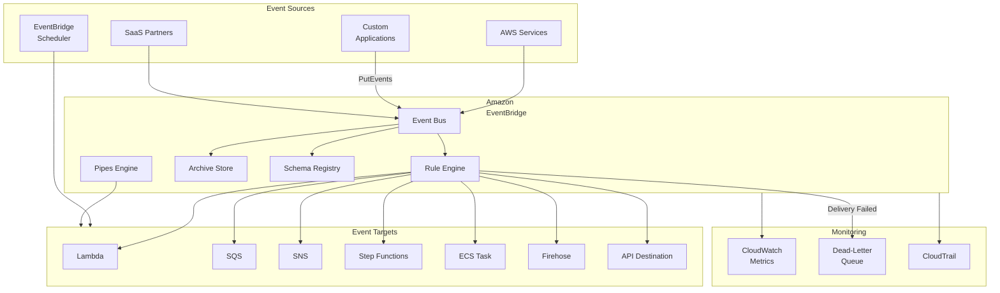
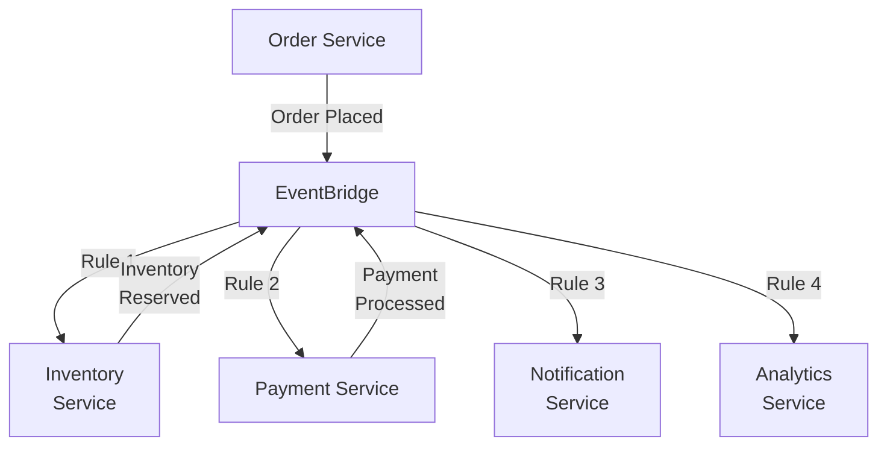
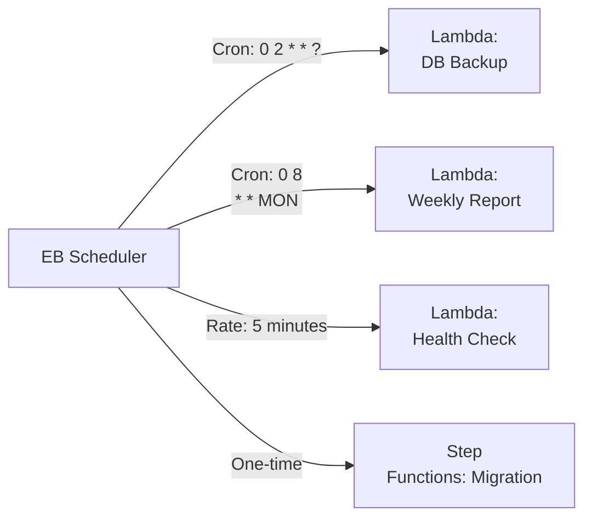
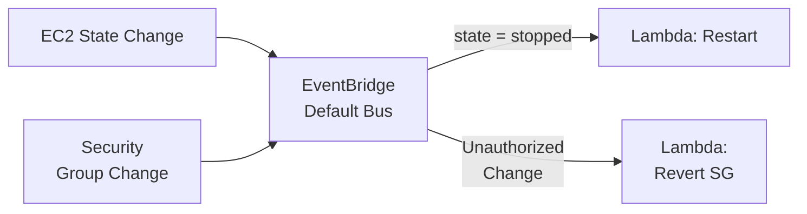
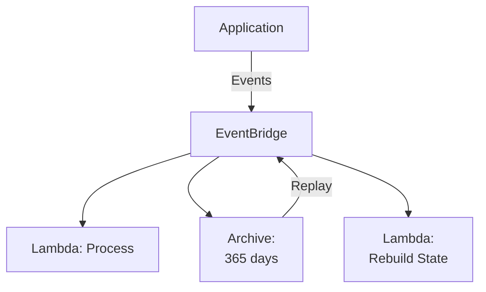

# Chapter 14: Amazon EventBridge — Serverless Event Bus

---

## 1. Service Overview

Amazon EventBridge is a fully managed serverless event bus service that makes it easy to connect applications using events from your own applications, AWS services, and third-party SaaS providers. EventBridge delivers a stream of real-time data to targets like Lambda, SQS, SNS, Step Functions, and more based on **rules** that you define.

### Why EventBridge Exists

Traditional integration patterns require point-to-point connections between services. As systems grow, this creates a tangled web of dependencies. EventBridge introduces a **central event bus** where producers publish events and consumers subscribe via rules with filtering — enabling true event-driven architecture with zero coupling between producers and consumers.

### EventBridge vs SNS vs SQS

| Feature | EventBridge | SNS | SQS |
|---------|-------------|-----|-----|
| **Pattern** | Event routing with rules | Pub/sub fan-out | Message queue |
| **Filtering** | Content-based rules (any JSON field) | Message attribute filters | No native filtering |
| **Sources** | AWS services, SaaS, custom apps | Custom apps, AWS services | Custom apps |
| **Targets** | 20+ AWS services | SQS, Lambda, HTTP, Email, SMS | Lambda, EC2 consumers |
| **Schema** | Schema Registry with discovery | No schema management | No schema management |
| **Replay** | Event archive and replay | No native replay | No replay |
| **Scheduling** | Built-in Scheduler | No scheduling | No scheduling |
| **Best For** | Event-driven architectures, SaaS integration | Simple fan-out, notifications | Work queues, buffering |

### Key Characteristics

- **Serverless**: No infrastructure to manage, scales automatically
- **Event Buses**: Default bus (AWS events), custom buses (your events), partner buses (SaaS)
- **Rules**: Filter events using event patterns or schedule-based triggers
- **Targets**: Route events to 20+ AWS services (Lambda, SQS, SNS, Step Functions, API Gateway, CodePipeline, etc.)
- **Schema Registry**: Automatically discovers and stores event schemas
- **Archive & Replay**: Archive events and replay them for debugging or reprocessing
- **EventBridge Scheduler**: Cron and one-time scheduled events with enhanced features
- **EventBridge Pipes**: Point-to-point integrations with filtering and enrichment
- **Global Endpoints**: Cross-region failover for event delivery

---

## 2. Learning Objectives

By the end of this chapter, you will be able to:

- **Explain** event-driven architecture and when to use EventBridge vs SNS vs SQS
- **Create** custom event buses and define event rules with content-based filtering
- **Implement** event producers and consumers using Boto3, CLI, and IaC
- **Design** event-driven architectures using EventBridge as the central nervous system
- **Configure** EventBridge Scheduler for cron and one-time schedules
- **Use** EventBridge Pipes for point-to-point integrations
- **Implement** event archive and replay for debugging and disaster recovery
- **Secure** event buses with resource policies and IAM
- **Monitor** event delivery using CloudWatch metrics and dead-letter queues
- **Troubleshoot** rule mismatches, delivery failures, and quota issues

---

## 3. Prerequisites

- **AWS Account** with admin or PowerUser access
- **AWS CLI v2** installed and configured
- **Python 3.9+** with Boto3
- **Completed chapters**: Chapter 1 (IAM), Chapter 8 (Lambda), Chapter 12 (SQS), Chapter 13 (SNS)
- **Concepts**: JSON, event-driven architecture, pub/sub patterns

---

## 4. Real-world Analogy

Think of EventBridge as a **smart post office sorting center**.

Letters (events) arrive from many sources — residents (your applications), businesses (AWS services), and international mail (SaaS partners). The sorting center reads the address and content of each letter (event pattern matching), then routes it to the correct mailbox, PO box, or forwarding address (targets). Some letters are archived (event archive) for later retrieval. The center handles millions of letters daily without you managing any infrastructure.

**Extended analogy**:
- **Event Bus** = The sorting facility itself
- **Rules** = Sorting instructions ("if zip code starts with 100, send to NYC")
- **Event Pattern** = Reading the envelope and content to decide routing
- **Targets** = Destination mailboxes (Lambda, SQS, SNS, etc.)
- **Archive** = Storing copies of every letter for 90 days
- **Replay** = Re-sending archived letters when needed
- **Scheduler** = Automated daily deliveries at specific times
- **Pipes** = Express direct mail (point-to-point, no sorting needed)

---

## 5. Business Use Cases

### Application Integration
- **Microservice Choreography**: Services emit events, other services react — no orchestrator needed
- **SaaS Integration**: Zendesk ticket created → EventBridge → Slack notification + Jira issue + CRM update
- **Cross-Account Event Routing**: Central event bus in shared services account receives events from all application accounts

### Operations & Automation
- **Auto-Remediation**: EC2 instance stopped → EventBridge rule → Lambda → Restart instance
- **Compliance Monitoring**: Security Group changed → EventBridge → Lambda → Revert if non-compliant
- **Resource Lifecycle**: EC2 terminated → EventBridge → Lambda → Clean up DNS records, remove from monitoring

### Scheduled Tasks
- **Cron Jobs**: Daily database backup at 2 AM, weekly report generation
- **Data Pipeline Triggers**: Hourly ETL job execution
- **Maintenance Windows**: Scheduled scaling events for known traffic patterns

### Data Processing
- **Real-Time ETL**: Database change event → EventBridge → Step Functions → Transform + Load
- **Audit Trail**: All API calls → EventBridge → Kinesis Firehose → S3 (audit lake)
- **Analytics Events**: User actions → EventBridge → Kinesis → Real-time dashboard

---

## 6. Core Concepts

### Event

An event is a JSON object representing a change in state or an occurrence. Every event has a standard envelope:

```json
{
  "version": "0",
  "id": "12345678-1234-1234-1234-123456789012",
  "source": "com.mycompany.orders",
  "detail-type": "Order Placed",
  "account": "123456789012",
  "time": "2024-01-15T10:30:00Z",
  "region": "us-east-1",
  "resources": [],
  "detail": {
    "orderId": "ORD-001",
    "customerId": "CUST-100",
    "totalAmount": 99.99,
    "items": [
      {"productId": "PROD-A", "quantity": 2}
    ]
  }
}
```

### Event Bus

A channel that receives events. Three types:
- **Default Event Bus**: Receives events from AWS services automatically
- **Custom Event Bus**: For your application events
- **Partner Event Bus**: For SaaS partner events (Shopify, Zendesk, Datadog, etc.)

### Rule

A rule matches incoming events and routes them to targets. Two types:
- **Event Pattern Rule**: Matches events based on content (source, detail-type, detail fields)
- **Schedule Rule**: Triggers on a cron expression or rate

### Event Pattern

A JSON pattern that filters events. Only matching events trigger the rule:

```json
{
  "source": ["com.mycompany.orders"],
  "detail-type": ["Order Placed"],
  "detail": {
    "totalAmount": [{"numeric": [">", 100]}],
    "region": [{"prefix": "us-"}]
  }
}
```

**Supported operators**: exact match, prefix, suffix, anything-but, numeric comparisons, exists, wildcard, CIDR match.

### Target

An AWS service that receives the matched event. Up to 5 targets per rule. Supported targets include: Lambda, SQS, SNS, Step Functions, CodePipeline, CodeBuild, ECS Task, Kinesis, Firehose, API Gateway, Redshift, CloudWatch Logs, Systems Manager, Batch, and more.

### Input Transformation

Transform the event before delivering to the target:

```json
{
  "InputPathsMap": {
    "orderId": "$.detail.orderId",
    "amount": "$.detail.totalAmount"
  },
  "InputTemplate": "{\"message\": \"New order <orderId> for $<amount>\"}"
}
```

### EventBridge Scheduler

A dedicated scheduler service (separate from event bus rules) with enhanced features:
- **One-time schedules**: Execute once at a specific time
- **Recurring schedules**: Cron or rate expressions
- **Flexible time windows**: Execute within a time range
- **Retry policies**: Configurable retries with dead-letter queues
- **Timezone support**: Schedule in any timezone

### EventBridge Pipes

Point-to-point integrations without writing glue code:

```
Source (SQS/Kinesis/DynamoDB) → Filter → Enrich (Lambda/API GW/Step Functions) → Target
```

### Archive & Replay

- **Archive**: Store events matching a pattern for a configurable retention period
- **Replay**: Replay archived events to the event bus for reprocessing, debugging, or disaster recovery

---

## 7. Internal Architecture



### How EventBridge Works Internally

1. Event arrives at the event bus via `PutEvents` API or AWS service integration
2. The **Rule Engine** evaluates all active rules against the event
3. For each matching rule, the event is delivered to the rule's target(s)
4. **Input Transformation** is applied before delivery if configured
5. Failed deliveries are retried (up to 24 hours with exponential backoff)
6. After all retries, failed events are sent to the rule's DLQ (if configured)
7. If archiving is enabled, matching events are stored in the archive

---

## 8. Service Components

### Event Bus
The core routing resource. Receives events and evaluates rules. Supports resource-based policies for cross-account access.

### Rule
Defines a filter pattern and target(s). Attached to an event bus. Can be enabled/disabled.

### Target
An AWS service endpoint that receives matched events. Each target can have input transformation, retry policy, and DLQ configuration.

### Archive
Stores events for later replay. Configurable retention period (days or indefinite). Events can be filtered by pattern.

### Schema Registry
Stores event schemas (JSON Schema format). Supports auto-discovery from event buses. Generates code bindings for Java, Python, and TypeScript.

### Pipes
Source-to-target integration with optional filtering and enrichment. Sources: SQS, Kinesis, DynamoDB Streams, Kafka, MQ.

### Scheduler
Manages one-time and recurring schedules. Supports all EventBridge targets. Includes timezone support and flexible time windows.

### API Destinations
HTTP endpoints that can be targets for rules. Includes connection management, authentication (API key, OAuth, Basic), and rate limiting.

### Global Endpoints
Enable cross-region event routing with automatic failover. Uses Route 53 health checks to determine the active region.

---

## 9. Configuration

### Event Pattern Examples

```json
// Match EC2 instance state changes to "stopped"
{
  "source": ["aws.ec2"],
  "detail-type": ["EC2 Instance State-change Notification"],
  "detail": {
    "state": ["stopped"]
  }
}

// Match custom order events with amount > $100
{
  "source": ["com.mycompany.orders"],
  "detail-type": ["Order Placed"],
  "detail": {
    "totalAmount": [{"numeric": [">", 100]}]
  }
}

// Match S3 object creation events for .csv files
{
  "source": ["aws.s3"],
  "detail-type": ["Object Created"],
  "detail": {
    "bucket": {"name": ["my-data-bucket"]},
    "object": {"key": [{"suffix": ".csv"}]}
  }
}

// Match any event EXCEPT from test source
{
  "source": [{"anything-but": "com.mycompany.test"}]
}
```

### Scheduler Configuration

```json
{
  "Name": "DailyBackup",
  "ScheduleExpression": "cron(0 2 * * ? *)",
  "ScheduleExpressionTimezone": "America/New_York",
  "FlexibleTimeWindow": {"Mode": "FLEXIBLE", "MaximumWindowInMinutes": 15},
  "Target": {
    "Arn": "arn:aws:lambda:us-east-1:123456789012:function:backup",
    "RoleArn": "arn:aws:iam::123456789012:role/SchedulerRole",
    "RetryPolicy": {"MaximumRetryAttempts": 3, "MaximumEventAgeInSeconds": 3600},
    "DeadLetterConfig": {"Arn": "arn:aws:sqs:us-east-1:123456789012:scheduler-dlq"}
  }
}
```

---

## 10. Code Examples

### Python (Boto3) — Complete Event-Driven System

```python
import boto3
import json
from datetime import datetime

eb = boto3.client('events', region_name='us-east-1')
scheduler = boto3.client('scheduler', region_name='us-east-1')

# Create a custom event bus
bus_response = eb.create_event_bus(
    Name='OrderEventBus',
    Tags=[
        {'Key': 'Environment', 'Value': 'production'},
        {'Key': 'Team', 'Value': 'orders'}
    ]
)
print(f"Event bus created: {bus_response['EventBusArn']}")

# Create an event rule
rule_response = eb.put_rule(
    Name='HighValueOrderRule',
    EventBusName='OrderEventBus',
    EventPattern=json.dumps({
        'source': ['com.mycompany.orders'],
        'detail-type': ['Order Placed'],
        'detail': {
            'totalAmount': [{'numeric': ['>', 100]}]
        }
    }),
    State='ENABLED',
    Description='Route high-value orders to priority processing',
    Tags=[
        {'Key': 'Environment', 'Value': 'production'}
    ]
)
print(f"Rule created: {rule_response['RuleArn']}")

# Add targets to the rule
eb.put_targets(
    Rule='HighValueOrderRule',
    EventBusName='OrderEventBus',
    Targets=[
        {
            'Id': 'PriorityProcessingLambda',
            'Arn': 'arn:aws:lambda:us-east-1:123456789012:function:priorityOrderProcessor',
            'RetryPolicy': {
                'MaximumRetryAttempts': 3,
                'MaximumEventAgeInSeconds': 3600
            },
            'DeadLetterConfig': {
                'Arn': 'arn:aws:sqs:us-east-1:123456789012:eb-dlq'
            }
        },
        {
            'Id': 'NotifySalesTeam',
            'Arn': 'arn:aws:sns:us-east-1:123456789012:sales-alerts',
            'InputTransformer': {
                'InputPathsMap': {
                    'orderId': '$.detail.orderId',
                    'amount': '$.detail.totalAmount',
                    'customer': '$.detail.customerId'
                },
                'InputTemplate': '"High-value order <orderId> from customer <customer> for $<amount>"'
            }
        }
    ]
)

# --- PUBLISH EVENTS ---
def publish_order_event(order):
    """Publish an order event to the custom event bus."""
    response = eb.put_events(
        Entries=[
            {
                'Source': 'com.mycompany.orders',
                'DetailType': 'Order Placed',
                'Detail': json.dumps({
                    'orderId': order['orderId'],
                    'customerId': order['customerId'],
                    'totalAmount': order['totalAmount'],
                    'items': order['items'],
                    'region': 'us-east-1',
                    'timestamp': datetime.utcnow().isoformat()
                }),
                'EventBusName': 'OrderEventBus',
                'Resources': [f"arn:aws:orders:us-east-1:123456789012:order/{order['orderId']}"]
            }
        ]
    )
    failed = response.get('FailedEntryCount', 0)
    if failed > 0:
        print(f"Failed to publish {failed} event(s): {response['Entries']}")
    else:
        print(f"Published order event: {order['orderId']}")
    return response

# Batch publish (up to 10 events per call)
def publish_batch_events(orders):
    """Publish multiple order events in a single API call."""
    entries = []
    for order in orders[:10]:
        entries.append({
            'Source': 'com.mycompany.orders',
            'DetailType': 'Order Placed',
            'Detail': json.dumps(order),
            'EventBusName': 'OrderEventBus'
        })
    return eb.put_events(Entries=entries)

# Create event archive
eb.create_archive(
    ArchiveName='OrderEventsArchive',
    EventSourceArn=bus_response['EventBusArn'],
    EventPattern=json.dumps({
        'source': ['com.mycompany.orders']
    }),
    RetentionDays=90,
    Description='Archive all order events for 90 days'
)

# Replay archived events
eb.start_replay(
    ReplayName='ReplayJanOrders',
    EventSourceArn=bus_response['EventBusArn'],
    Destination={'Arn': bus_response['EventBusArn']},
    EventStartTime=datetime(2024, 1, 1),
    EventEndTime=datetime(2024, 1, 31),
    Description='Replay January orders for reprocessing'
)

# --- SCHEDULER ---
scheduler.create_schedule(
    Name='DailyOrderReport',
    ScheduleExpression='cron(0 8 * * ? *)',
    ScheduleExpressionTimezone='America/New_York',
    FlexibleTimeWindow={'Mode': 'OFF'},
    Target={
        'Arn': 'arn:aws:lambda:us-east-1:123456789012:function:generateReport',
        'RoleArn': 'arn:aws:iam::123456789012:role/SchedulerRole',
        'Input': json.dumps({'reportType': 'daily_orders'}),
        'RetryPolicy': {
            'MaximumRetryAttempts': 3,
            'MaximumEventAgeInSeconds': 3600
        }
    },
    State='ENABLED',
    Description='Generate daily order report at 8 AM ET'
)
```

### AWS CLI — Common Operations

```bash
# Create custom event bus
aws events create-event-bus --name OrderEventBus

# Put a rule
aws events put-rule \
  --name HighValueOrders \
  --event-bus-name OrderEventBus \
  --event-pattern '{
    "source": ["com.mycompany.orders"],
    "detail-type": ["Order Placed"],
    "detail": {"totalAmount": [{"numeric": [">", 100]}]}
  }' \
  --state ENABLED

# Add target
aws events put-targets \
  --rule HighValueOrders \
  --event-bus-name OrderEventBus \
  --targets '[{
    "Id": "ProcessLambda",
    "Arn": "arn:aws:lambda:us-east-1:123456789012:function:process",
    "RetryPolicy": {"MaximumRetryAttempts": 3, "MaximumEventAgeInSeconds": 3600},
    "DeadLetterConfig": {"Arn": "arn:aws:sqs:us-east-1:123456789012:eb-dlq"}
  }]'

# Publish a custom event
aws events put-events \
  --entries '[{
    "Source": "com.mycompany.orders",
    "DetailType": "Order Placed",
    "Detail": "{\"orderId\": \"ORD-001\", \"totalAmount\": 150.00}",
    "EventBusName": "OrderEventBus"
  }]'

# Create archive
aws events create-archive \
  --archive-name OrderArchive \
  --event-source-arn arn:aws:events:us-east-1:123456789012:event-bus/OrderEventBus \
  --retention-days 90

# List rules
aws events list-rules --event-bus-name OrderEventBus

# Describe rule
aws events describe-rule --name HighValueOrders --event-bus-name OrderEventBus

# Create a schedule
aws scheduler create-schedule \
  --name DailyBackup \
  --schedule-expression "cron(0 2 * * ? *)" \
  --flexible-time-window '{"Mode": "OFF"}' \
  --target '{
    "Arn": "arn:aws:lambda:us-east-1:123456789012:function:backup",
    "RoleArn": "arn:aws:iam::123456789012:role/SchedulerRole"
  }'
```

### Terraform

```hcl
resource "aws_cloudwatch_event_bus" "orders" {
  name = "OrderEventBus"
  tags = { Environment = "production" }
}

resource "aws_cloudwatch_event_rule" "high_value_orders" {
  name           = "HighValueOrders"
  event_bus_name = aws_cloudwatch_event_bus.orders.name
  event_pattern = jsonencode({
    source      = ["com.mycompany.orders"]
    detail-type = ["Order Placed"]
    detail      = { totalAmount = [{ numeric = [">", 100] }] }
  })
}

resource "aws_cloudwatch_event_target" "process_lambda" {
  rule           = aws_cloudwatch_event_rule.high_value_orders.name
  event_bus_name = aws_cloudwatch_event_bus.orders.name
  target_id      = "ProcessLambda"
  arn            = aws_lambda_function.process.arn

  retry_policy {
    maximum_retry_attempts       = 3
    maximum_event_age_in_seconds = 3600
  }

  dead_letter_config {
    arn = aws_sqs_queue.eb_dlq.arn
  }
}

resource "aws_cloudwatch_event_archive" "orders" {
  name             = "OrderArchive"
  event_source_arn = aws_cloudwatch_event_bus.orders.arn
  retention_days   = 90
  event_pattern = jsonencode({
    source = ["com.mycompany.orders"]
  })
}

resource "aws_scheduler_schedule" "daily_backup" {
  name                = "DailyBackup"
  schedule_expression = "cron(0 2 * * ? *)"

  flexible_time_window {
    mode = "OFF"
  }

  target {
    arn      = aws_lambda_function.backup.arn
    role_arn = aws_iam_role.scheduler.arn

    retry_policy {
      maximum_retry_attempts       = 3
      maximum_event_age_in_seconds = 3600
    }

    dead_letter_config {
      arn = aws_sqs_queue.scheduler_dlq.arn
    }
  }
}
```

### CloudFormation

```yaml
AWSTemplateFormatVersion: '2010-09-09'
Resources:
  OrderEventBus:
    Type: AWS::Events::EventBus
    Properties:
      Name: OrderEventBus

  HighValueOrderRule:
    Type: AWS::Events::Rule
    Properties:
      Name: HighValueOrders
      EventBusName: !Ref OrderEventBus
      EventPattern:
        source:
          - com.mycompany.orders
        detail-type:
          - Order Placed
        detail:
          totalAmount:
            - numeric:
                - ">"
                - 100
      Targets:
        - Id: ProcessLambda
          Arn: !GetAtt ProcessFunction.Arn
          RetryPolicy:
            MaximumRetryAttempts: 3
            MaximumEventAgeInSeconds: 3600
          DeadLetterConfig:
            Arn: !GetAtt EBDLQ.Arn

  OrderArchive:
    Type: AWS::Events::Archive
    Properties:
      ArchiveName: OrderArchive
      SourceArn: !GetAtt OrderEventBus.Arn
      RetentionDays: 90
```

---

## 11. Line-by-Line Explanation

### Boto3 `put_events` Breakdown

```python
response = eb.put_events(
    Entries=[
        {
            # Source identifies who/what produced this event
            # Convention: reverse domain notation (com.company.service)
            'Source': 'com.mycompany.orders',
            # DetailType is the event name/category — used in rule matching
            'DetailType': 'Order Placed',
            # Detail is the event payload — must be a JSON string
            # This is where your business data goes
            'Detail': json.dumps({'orderId': 'ORD-001', 'totalAmount': 150.00}),
            # Which event bus to publish to (omit for default bus)
            'EventBusName': 'OrderEventBus',
            # Optional: ARNs of resources related to this event
            'Resources': ['arn:aws:orders:us-east-1:123456789012:order/ORD-001']
        }
    ]
)
# response['FailedEntryCount'] — number of events that failed
# response['Entries'] — per-entry status (EventId or ErrorCode)
# Up to 10 entries per PutEvents call
# Total request size cannot exceed 256 KB
```

---

## 12. Security Deep Dive

### Event Bus Resource Policy (Cross-Account)

```json
{
  "Version": "2012-10-17",
  "Statement": [
    {
      "Sid": "AllowCrossAccountPut",
      "Effect": "Allow",
      "Principal": {"AWS": "arn:aws:iam::987654321098:root"},
      "Action": "events:PutEvents",
      "Resource": "arn:aws:events:us-east-1:123456789012:event-bus/OrderEventBus"
    }
  ]
}
```

### IAM Policy (Event Publisher)

```json
{
  "Version": "2012-10-17",
  "Statement": [
    {
      "Effect": "Allow",
      "Action": "events:PutEvents",
      "Resource": "arn:aws:events:us-east-1:123456789012:event-bus/OrderEventBus"
    }
  ]
}
```

### Security Best Practices
1. **Use custom event buses** — separate from the default bus for isolation
2. **Resource policies** — restrict cross-account access to specific accounts/roles
3. **Least-privilege IAM** — only grant `events:PutEvents` for publishers
4. **Event bus policies** — deny `PutEvents` from unauthorized sources
5. **Encrypt with KMS** — enable encryption on custom event buses
6. **DLQ on every rule** — capture failed delivery attempts
7. **CloudTrail** — audit all EventBridge API calls

---

## 13. Monitoring & Observability

### CloudWatch Metrics

| Metric | Description | Alarm On |
|--------|-------------|----------|
| `Invocations` | Events matched by rules | Unexpected drop |
| `FailedInvocations` | Failed target deliveries | > 0 |
| `TriggeredRules` | Rules that matched events | Correlation analysis |
| `ThrottledRules` | Rules throttled due to target limits | > 0 |
| `DeadLetterInvocations` | Events sent to DLQ | > 0 |
| `IngestedEvents` | Events received by bus | Drop detection |
| `MatchedEvents` | Events matching at least one rule | vs IngestedEvents ratio |

### Alarm Configuration

```bash
aws cloudwatch put-metric-alarm \
  --alarm-name "EB-OrderBus-FailedDeliveries" \
  --metric-name FailedInvocations \
  --namespace AWS/Events \
  --dimensions Name=RuleName,Value=HighValueOrders \
  --statistic Sum \
  --period 300 \
  --threshold 1 \
  --comparison-operator GreaterThanOrEqualToThreshold \
  --evaluation-periods 1 \
  --alarm-actions arn:aws:sns:us-east-1:123456789012:ops-alerts
```

---

## 14. Performance & Cost Optimization

### Cost Model

| Action | Cost |
|--------|------|
| Custom events published | $1.00 per 1M events |
| AWS service events | Free |
| Default bus rules (AWS events) | Free |
| Custom/partner bus rules | $1.00 per 1M events evaluated |
| Schema discovery | $0.10 per 1M events ingested |
| Archive storage | Standard S3 pricing |
| Event replay | $0.10 per 1M events replayed |
| Scheduler invocations | $1.00 per 1M invocations |
| Pipes (per event) | $0.40 per 1M (64 KB chunks) |

### Optimization Strategies

**1. Use Specific Event Patterns**: Precise rules reduce target invocations and downstream compute costs.

**2. Batch PutEvents**: Up to 10 events per API call, reducing request costs.

**3. Use Input Transformations**: Send only needed fields to targets, reducing payload processing downstream.

**4. Archive Selectively**: Only archive events needed for replay — use event patterns on archives.

**5. Use Pipes for Simple Integrations**: Point-to-point integrations avoid the per-event routing cost of rules.

---

## 15. Enterprise Integration

### Central Event Bus Architecture

```
┌──────────────────────────────────────────────────────┐
│  Shared Services Account (Central Event Bus)         │
│  ┌──────────────────────────────────────────┐        │
│  │ EventBridge: CentralEventBus              │       │
│  │  Rules:                                   │       │
│  │   - Order events → Account C              │       │
│  │   - Security events → Account D           │       │
│  │   - All events → Archive (90 days)        │       │
│  └──────────────────────────────────────────┘        │
├──────────────────────────────────────────────────────┤
│ Account A         │ Account B          │ Account C   │
│ (Order Service)   │ (Inventory Svc)    │ (Analytics) │
│ PutEvents ───────►│ PutEvents ────────►│◄──Rule      │
│                   │                    │  Target     │
└───────────────────┴────────────────────┴─────────────┘
```

### SaaS Integration Examples

| SaaS Partner | Event Examples |
|-------------|----------------|
| **Shopify** | Order created, product updated, refund issued |
| **Zendesk** | Ticket created, ticket updated, agent assigned |
| **Auth0** | User login, signup, MFA challenge |
| **Datadog** | Alert triggered, monitor status change |
| **PagerDuty** | Incident created, acknowledged, resolved |

### Global Endpoints (Cross-Region Failover)

```json
{
  "Name": "OrderEventsGlobalEndpoint",
  "EventBuses": [
    {"EventBusArn": "arn:aws:events:us-east-1:123456789012:event-bus/OrderEventBus"},
    {"EventBusArn": "arn:aws:events:us-west-2:123456789012:event-bus/OrderEventBus"}
  ],
  "RoutingConfig": {
    "FailoverConfig": {
      "Primary": {"HealthCheck": "arn:aws:route53:::healthcheck/primary-check-id"},
      "Secondary": {"Route": "us-west-2"}
    }
  }
}
```

---

## 16. Real Industry Use Cases

### Case 1: Netflix — Content Event Processing
**Problem**: Coordinate content lifecycle across hundreds of microservices (encoding, QA, localization, compliance, publishing).
**Solution**: EventBridge as the central event bus. Each lifecycle stage emits events. Downstream services subscribe via rules.
**Result**: Decoupled content pipeline processing 8,000+ content assets daily.

### Case 2: DoorDash — Real-Time Order Orchestration
**Problem**: Order placement triggers 10+ downstream actions (restaurant notification, dasher matching, payment processing, ETA calculation).
**Solution**: EventBridge receives order events. Rules route to specific services based on order type, location, and priority.
**Result**: Sub-second event routing for millions of daily orders.

### Case 3: BMW — IoT Vehicle Telemetry Processing
**Problem**: Process telemetry from millions of connected vehicles with different event types requiring different processing.
**Solution**: IoT Core → EventBridge (custom bus). Rules match by telemetry type (diagnostic, location, alert). High-priority alerts → Lambda (instant), analytics events → Firehose → S3.
**Result**: Real-time processing of 100M+ events/day with event-type-specific routing.

---

## 17. Architecture Patterns

### Pattern 1: Event-Driven Microservices



### Pattern 2: Scheduled Automation



### Pattern 3: Auto-Remediation



### Pattern 4: Event Sourcing with Archive



---

## 18. Production Incident War Room

### Incident 1: Events Not Matching Any Rule
**Severity**: P2 — High
**Symptoms**: Events published successfully (`FailedEntryCount = 0`) but no targets invoked.
**Root Cause**: Event pattern used `"source": "com.mycompany.orders"` (string) instead of `"source": ["com.mycompany.orders"]` (array). EventBridge patterns require array syntax for exact matching.
**CLI Diagnostic**:
```bash
aws events test-event-pattern \
  --event-pattern '{"source": ["com.mycompany.orders"]}' \
  --event '{"source": "com.mycompany.orders", "detail-type": "Order Placed", "detail": {}}'
```
**Permanent Fix**: Always use array syntax in event patterns. Use `test-event-pattern` API to validate patterns before deployment.

---

### Incident 2: Target Delivery Failures (Lambda Throttled)
**Severity**: P2 — High
**Symptoms**: `FailedInvocations` metric spiking. Events going to DLQ.
**Root Cause**: Lambda target hit reserved concurrency limit. EventBridge retried for 24 hours then sent to DLQ.
**Permanent Fix**: Increase Lambda concurrency. Add SQS between EventBridge and Lambda as a buffer. Monitor `FailedInvocations` and `DeadLetterInvocations`.

---

### Incident 3: PutEvents Request Exceeding 256 KB
**Severity**: P3 — Medium
**Symptoms**: `PutEvents` calls failing with `RequestTooLarge` error.
**Root Cause**: Batch of 10 events totaled more than 256 KB.
**Permanent Fix**: Validate total request size before sending. Store large payloads in S3 and include S3 reference in the event detail. Reduce batch size.

---

### Incident 4: Cross-Account Events Not Arriving
**Severity**: P2 — High
**Symptoms**: Account A publishing events, Account B's rules not triggering.
**Root Cause**: Event bus resource policy in Account B allowed `events:PutEvents` from Account A, but Account A was publishing to its own default bus instead of Account B's bus ARN.
**Permanent Fix**: Verify `EventBusName` parameter in `PutEvents` call matches the target account's bus ARN. Use cross-account event forwarding rules instead of direct cross-account publishing.

---

### Incident 5: Scheduled Rule Not Firing
**Severity**: P2 — High
**Symptoms**: Cron-based rule not triggering target at expected time.
**Root Cause**: EventBridge schedule rules use UTC timezone. The cron expression `cron(0 8 * * ? *)` fires at 8:00 UTC, not 8:00 local time.
**Permanent Fix**: Use EventBridge Scheduler (separate service) which supports timezone specification. Or convert local time to UTC for EventBridge rules.

---

### Incident 6: Archive Replay Processing Old Events as New
**Severity**: P1 — Critical
**Symptoms**: After replaying archived events, downstream services processed them as current events, creating duplicate orders.
**Root Cause**: Consumers did not check the `time` field of replayed events. Replay events have `replay-name` in the event metadata but the consumer ignored it.
**Permanent Fix**: Consumer should check for replay metadata and implement idempotency using event ID. Use dedicated replay rules that route to separate processing logic.

---

### Incident 7: Schema Registry Breaking Consumer
**Severity**: P3 — Medium
**Symptoms**: Consumer Lambda failing after producer changed event schema (added required field).
**Root Cause**: No schema validation enforcement. Schema Registry detected the change but there was no alert or enforcement mechanism.
**Permanent Fix**: Use schema versioning. Implement backward-compatible schema evolution (only add optional fields). Set up Schema Registry change detection alerts.

---

### Incident 8: EventBridge Pipe Source Depleted
**Severity**: P2 — High
**Symptoms**: Pipe processing zero events. Source SQS queue has messages.
**Root Cause**: Pipe was in STOPPED state after a deployment error. Pipes must be explicitly started.
**Permanent Fix**: Verify pipe state after deployments. Monitor `Invocations` metric on pipes. Add pipeline health check in CI/CD.

---

### Incident 9: DLQ Not Configured — Events Silently Dropped
**Severity**: P1 — Critical
**Symptoms**: Missing order events. No alerts. No errors in logs.
**Root Cause**: Rule target had no DLQ configured. After 24 hours of retry failures, events were permanently discarded.
**Permanent Fix**: Configure DLQ on EVERY rule target. Add alarm on `DeadLetterInvocations > 0`. This is a non-negotiable production requirement.

---

### Incident 10: Input Transformation Producing Invalid JSON
**Severity**: P2 — High
**Symptoms**: Target Lambda receiving malformed JSON. Parsing errors in consumer.
**Root Cause**: Input template had unescaped quotes. Template: `{"msg": "Order <orderId>"}` when `orderId` contained quotes.
**Permanent Fix**: Ensure all interpolated values are properly escaped. Test input transformations with edge case data. Consider passing the raw event and transforming in the consumer.

---

### Incident 11: API Destination Rate Limit Reached
**Severity**: P2 — High
**Symptoms**: Events to third-party webhook failing with 429 status codes.
**Root Cause**: EventBridge API Destination `InvocationRateLimitPerSecond` was set to 300, but the external API only supported 50 req/sec.
**Permanent Fix**: Reduce `InvocationRateLimitPerSecond` to match the external API's rate limit. Implement backoff in the API Destination connection settings.

---

### Incident 12: Partner Event Source Not Delivering Events
**Severity**: P3 — Medium
**Symptoms**: Shopify partner integration configured but no events received.
**Root Cause**: Partner event source was in `PENDING` state. It required association with an event bus via `create-event-bus` with the partner source name.
**Permanent Fix**: Complete the partner integration by creating an event bus associated with the partner event source ARN.

---

### Incident 13: Global Endpoint Failover Not Working
**Severity**: P1 — Critical
**Symptoms**: Primary region down but events not routing to secondary region.
**Root Cause**: Route 53 health check associated with the global endpoint was checking the wrong endpoint.
**Permanent Fix**: Verify Route 53 health check configuration. Test failover manually. Monitor health check status.

---

### Incident 14: Scheduler One-Time Schedule Not Firing
**Severity**: P2 — High
**Symptoms**: One-time scheduled event for database migration did not execute.
**Root Cause**: Schedule time was in the past by the time the `create-schedule` API call completed. EventBridge Scheduler silently skips past schedules.
**Permanent Fix**: Always set one-time schedules with sufficient future buffer. Verify schedule state after creation. Add confirmation notification.

---

### Incident 15: Event Pattern Matching Too Broadly
**Severity**: P2 — High
**Symptoms**: Lambda target processing events it should not (test events in production).
**Root Cause**: Event pattern `{"source": [{"prefix": "com.mycompany"}]}` matched both `com.mycompany.orders` and `com.mycompany.test`.
**Permanent Fix**: Use exact match for sources: `"source": ["com.mycompany.orders"]`. Add `{"anything-but": "test"}` for environment filtering. Use separate event buses for test and production.

---

## 19. Production Best Practices (Well-Architected)

### Operational Excellence
- **DLQ on every rule target** — non-negotiable for production
- **Use custom event buses** — separate from default bus for application events
- **Enable archive** on critical event buses for disaster recovery
- **Use IaC** for all event bus, rule, and target management
- **Test event patterns** with `test-event-pattern` API before deployment
- **Use consistent event naming** (source: reverse domain, detail-type: PascalCase)

### Security
- **Resource policies** on custom buses to restrict cross-account access
- **Least-privilege IAM** for publishers and rule management
- **Encrypt** custom event buses with KMS
- **Audit with CloudTrail**

### Reliability
- **DLQ + alarms** for failed deliveries
- **Global endpoints** for cross-region failover on critical event buses
- **Archive and replay** for disaster recovery and reprocessing
- **Use SQS between EventBridge and Lambda** for buffering

### Cost
- **Specific event patterns** reduce unnecessary target invocations
- **Batch PutEvents** (10 events/call) reduces API costs
- **Archive selectively** — only events needed for replay
- **Use Scheduler** instead of CloudWatch Events for enhanced scheduling features

---

## 20. Migration Strategies

### From CloudWatch Events to EventBridge

EventBridge is the evolution of CloudWatch Events. Migration is seamless:
1. CloudWatch Events rules appear in EventBridge console on the default bus
2. No code changes needed — same API endpoints
3. Gradually move to custom event buses for application events
4. Use EventBridge-specific features (schemas, archives, Pipes, Scheduler)

### From Custom Event Routing to EventBridge

Replace custom routing logic (SNS topic per event type, Lambda routers) with EventBridge rules. One bus, multiple rules with content-based filtering.

---

## 21. CI/CD Integration

```yaml
name: Deploy EventBridge Infrastructure
on:
  push:
    branches: [main]
    paths: ['infrastructure/eventbridge/**']

jobs:
  deploy:
    runs-on: ubuntu-latest
    steps:
      - uses: actions/checkout@v4
      - uses: aws-actions/configure-aws-credentials@v4
        with:
          role-to-assume: ${{ secrets.AWS_ROLE_ARN }}
          aws-region: us-east-1

      - name: Validate Event Patterns
        run: |
          for pattern_file in infrastructure/eventbridge/patterns/*.json; do
            echo "Validating: $pattern_file"
            aws events test-event-pattern \
              --event-pattern file://$pattern_file \
              --event '{"source":"test","detail-type":"test","detail":{}}' || true
          done

      - name: Deploy
        run: |
          aws cloudformation deploy \
            --template-file infrastructure/eventbridge/template.yaml \
            --stack-name eventbridge-orders \
            --capabilities CAPABILITY_IAM
```

---

## 22. Practical Projects

### Beginner Project: Basic Amazon EventBridge Deployment
- **Business Requirement**: Deploy baseline Amazon EventBridge resources securely.
- **Architecture**: Single-region deployment with default VPC subnets and restricted IAM roles.
- **Implementation**: Write a Terraform `main.tf` to provision Amazon EventBridge and apply the configuration. Verify resource creation in the AWS Console.

### Intermediate Project: Multi-AZ Scalable Amazon EventBridge Setup
- **Business Requirement**: Implement high availability and automated scaling for Amazon EventBridge to withstand Availability Zone failures.
- **Architecture**: Application Load Balancer -> Auto Scaling Group -> Amazon EventBridge -> KMS Encrypted Persistence Layer.
- **Implementation**: Configure scaling policies based on CPU utilization and set up CloudWatch Alarms for monitoring metrics.

### Advanced Project: Automated CI/CD Pipeline Integration
- **Business Requirement**: Automate the deployment and testing of Amazon EventBridge infrastructure without manual intervention.
- **Architecture**: GitHub Repository -> AWS CodePipeline -> AWS CodeBuild -> Deployment to Amazon EventBridge Targets.
- **Implementation**: Write a `buildspec.yml` to run automated security linting (e.g., tfsec or Checkov) before deploying the Amazon EventBridge changes.

### Enterprise Project: Zero-Trust Multi-Account Architecture
- **Business Requirement**: Deploy a production-grade multi-account enterprise environment utilizing Amazon EventBridge with centralized security governance.
- **Architecture**: AWS Organizations -> AWS Transit Gateway -> Hub-and-Spoke VPCs -> Multi-AZ Amazon EventBridge -> AWS IAM Identity Center SSO.
- **Implementation**: Implement Service Control Policies (SCPs) to restrict Amazon EventBridge deployments to approved regions and mandate AWS KMS customer-managed keys (CMKs) for all data at rest.

---

## 23. Interview Preparation

### Beginner
**Q1**: What is Amazon EventBridge?
**A**: A serverless event bus that connects applications using events. Events are routed to targets based on rules with content-based filtering.

**Q2**: EventBridge vs SNS?
**A**: EventBridge: advanced content-based routing, schema management, SaaS integration, archive/replay. SNS: simple pub/sub fan-out, multiple delivery protocols (email, SMS, push).

### Intermediate
**Q3**: What are the three types of event buses?
**A**: Default (AWS service events, automatic), Custom (your application events), Partner (SaaS integrations like Shopify, Zendesk).

**Q4**: How does event pattern matching work?
**A**: JSON patterns match against event fields. Values must be arrays. Supports exact match, prefix, suffix, numeric comparison, anything-but, exists, and wildcards. All conditions use AND logic.

### Advanced
**Q5**: Design an event-driven architecture for an e-commerce platform.
**A**: Custom event bus per domain (orders, inventory, payments). Rules route events between domains. Archive all events for 90 days. DLQ on every rule. Global endpoints for multi-region HA. Schema Registry for event contracts. EventBridge Scheduler for cron jobs.

---

## 24. AWS Certification Practice

**Q1**: Which service provides content-based event routing with archive and replay?
- A) Amazon SNS
- B) Amazon SQS
- **C) Amazon EventBridge** ✓
- D) AWS Step Functions

**Q2**: A company needs to trigger a Lambda function every time an EC2 instance is terminated. Which is the simplest approach?
- A) CloudWatch Logs subscription filter
- **B) EventBridge rule on EC2 state change events** ✓
- C) SNS topic with EC2 subscription
- D) SQS queue polled by Lambda

---

## 25. Knowledge Check

1. **What are the three event bus types?** Default, Custom, Partner.
2. **What is the max events per PutEvents call?** 10 (256 KB total).
3. **How long does EventBridge retry failed deliveries?** Up to 24 hours.
4. **What is the Schema Registry?** Auto-discovers and stores event schemas for code generation.
5. **What are EventBridge Pipes?** Point-to-point integrations with optional filtering and enrichment.
6. **What is the Archive feature?** Stores events for later replay (configurable retention).
7. **How does the Scheduler differ from rule-based schedules?** Supports timezones, flexible windows, retry policies, and one-time schedules.

---

## 26. Cheat Sheet

| Item | Detail |
|------|--------|
| **Service** | Amazon EventBridge |
| **Type** | Serverless event bus |
| **Bus Types** | Default, Custom, Partner |
| **Max Events/PutEvents** | 10 entries, 256 KB total |
| **Max Targets/Rule** | 5 |
| **Retry Duration** | Up to 24 hours |
| **Archive Retention** | Configurable (days or indefinite) |
| **Pricing** | $1.00 per 1M custom events |
| **Scheduler** | Cron, rate, one-time with timezone support |
| **Pipes** | Source → Filter → Enrich → Target |
| **Key CLI** | `put-events`, `put-rule`, `put-targets` |

---

## 27. Chapter Summary

Amazon EventBridge is the event routing backbone for modern AWS architectures. Key takeaways:

- **Central event bus** decouples producers from consumers completely
- **Content-based rules** route events to specific targets based on event data
- **Use custom event buses** for application events, default bus for AWS events
- **Configure DLQ on every rule target** — non-negotiable for production
- **Archive events** for disaster recovery and reprocessing
- **Use EventBridge Scheduler** for cron and one-time schedules (replaces CloudWatch Events)
- **EventBridge Pipes** for simple point-to-point integrations
- **Global endpoints** for cross-region event failover
- **Schema Registry** for event contract management

---

## 28. Further Learning

### AWS Documentation
- [EventBridge User Guide](https://docs.aws.amazon.com/eventbridge/latest/userguide/)
- [EventBridge Scheduler](https://docs.aws.amazon.com/scheduler/latest/UserGuide/)
- [EventBridge Pipes](https://docs.aws.amazon.com/eventbridge/latest/userguide/eb-pipes.html)
- [Event Pattern Reference](https://docs.aws.amazon.com/eventbridge/latest/userguide/eb-event-patterns.html)

### Related Chapters
- **Chapter 12 — Amazon SQS**: Queue-based messaging
- **Chapter 13 — Amazon SNS**: Pub/sub fan-out
- **Chapter 8 — AWS Lambda**: Serverless event processing
- **Chapter 35 — AWS Step Functions**: Workflow orchestration
