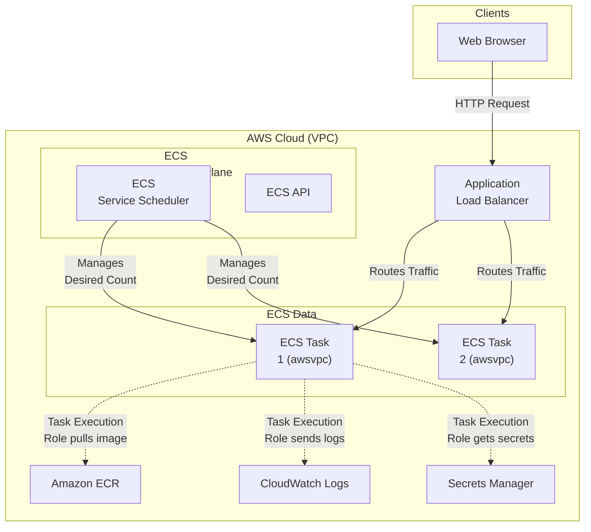
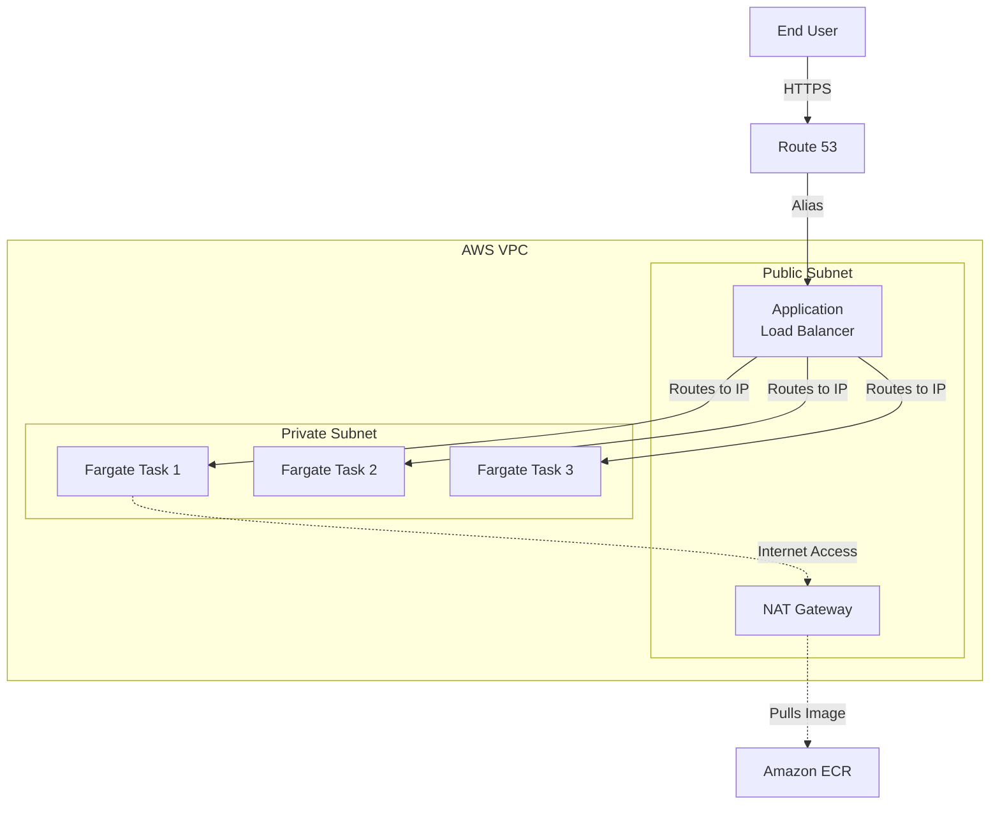
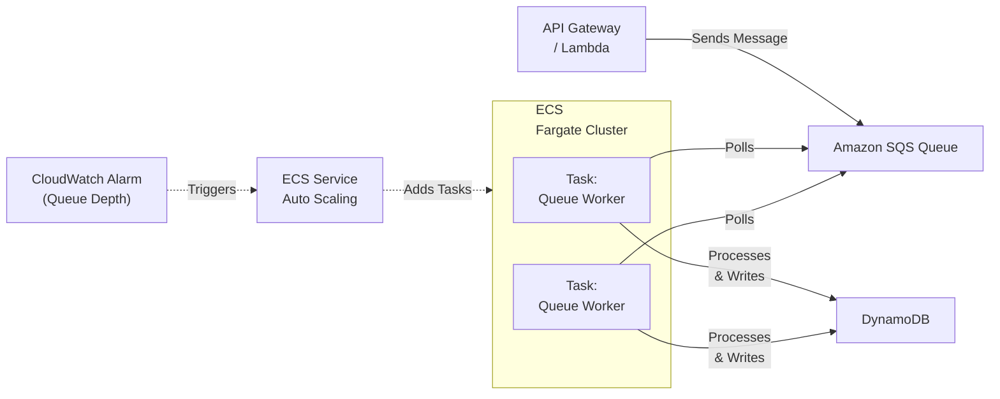

# Chapter 16: Amazon ECS — Elastic Container Service

---

## 1. Service Overview

Amazon Elastic Container Service (Amazon ECS) is a highly scalable, high-performance container orchestration service that supports Docker containers and allows you to easily run and scale containerized applications on AWS. It eliminates the need for you to install and operate your own container orchestration software (like Kubernetes) or manage and scale a cluster of virtual machines.

### Why AWS Created It

Before container orchestration, running microservices meant spinning up EC2 instances, manually installing Docker, SSHing into machines to run `docker run`, and hoping they didn't crash. When they did crash, there was no automated system to restart them. AWS created ECS to provide a deeply integrated, AWS-native container orchestrator that manages task placement, health checks, autoscaling, load balancing, and secure IAM isolation without requiring customers to manage a third-party control plane.

### Business Problem It Solves

- **Orchestration Simplification**: Manages the lifecycle, deployment, and autoscaling of thousands of microservices effortlessly.
- **Serverless Operations**: With AWS Fargate, it removes the need to provision, patch, or scale the underlying EC2 host instances.
- **Native AWS Integration**: Seamlessly integrates with ALB/NLB for routing, ECR for images, IAM for security, CloudWatch for logging/metrics, and Secrets Manager for credentials.

### Key Terminology

- **Task Definition**: A blueprint (JSON specification) defining container parameters, environment variables, image URLs, CPU/memory limits, and port mappings.
- **Task**: A running instance of a Task Definition (analogous to a Pod in Kubernetes).
- **Service**: Maintains a specified number of running Task instances concurrently, automatically restarting failed tasks and integrating with Load Balancers.
- **Cluster**: A logical boundary and grouping of tasks or services.
- **Launch Type**: Determines the infrastructure deployment model: **Fargate** (serverless compute) or **EC2** (customer-managed host instances).

---

## 2. Learning Objectives

By the end of this chapter, you will be able to:

- **Architect** resilient containerized microservice architectures using Amazon ECS
- **Differentiate** between Fargate and EC2 launch types and choose appropriately
- **Deploy** and scale ECS Services behind Application Load Balancers
- **Configure** granular security using Task Execution Roles and Task Roles
- **Implement** CI/CD pipelines for zero-downtime rolling deployments
- **Monitor** container health and cluster utilization using CloudWatch Container Insights
- **Optimize** costs using Fargate Spot and Auto Scaling
- **Troubleshoot** common ECS task launch failures, health check failures, and networking issues

---

## 3. Prerequisites

- **AWS Account** with administrative access
- **Completed chapters**: Chapter 3 (EC2), Chapter 4 (VPC), Chapter 18 (ELB), Chapter 15 (ECR)
- **Concepts**: Docker fundamentals (images, containers, Dockerfiles), VPC networking (public/private subnets, Security Groups)

---

## 4. Real-world Analogy

Think of Amazon ECS as a **Cargo Container Shipping Terminal Director**.

- **Docker Image**: The actual physical shipping container filled with goods (your application code).
- **Task Definition**: The shipping manifest specifying what the container holds, how much it weighs (CPU/Memory), and where it needs to go.
- **ECS Task**: A container that has been loaded onto a crane and is actively being processed.
- **ECS Service**: The terminal manager who ensures there are always exactly 5 cranes working. If a crane breaks (task fails), they immediately dispatch a new one.
- **Fargate**: A high-tech, fully automated dock where ships load and unload automatically without you needing to hire custom forklift operators or maintain the dock infrastructure.
- **EC2 Launch Type**: A traditional dock where you lease the land (EC2 instances) and must manage the maintenance of the dock itself.

---

## 5. Business Use Cases

### Microservices Architecture
- **Web Applications**: Hosting decoupled API microservices (e.g., an Order Service, Payment Service, and User Service) behind an API Gateway or ALB, scaling each component independently based on demand.

### Batch Processing
- **Data ETL**: Triggering ephemeral Fargate container tasks via EventBridge to process newly uploaded files in S3. The tasks run, process the data, and terminate, meaning you only pay for exact compute seconds used.

### Application Modernization
- **Lift and Shift**: Containerizing legacy monolithic applications using Docker and migrating them from on-premises VMs to ECS Fargate for immediate operational improvements and cost savings.

### Machine Learning Inference
- **Model Hosting**: Running machine learning inference models in containers backed by EC2 instances with GPU support (since Fargate does not currently support GPUs).

---

## 6. Core Concepts

### Launch Types
- **AWS Fargate**: Serverless compute for containers. You specify CPU and memory, define networking, and pay only for what the task uses. You do not manage EC2 instances.
- **EC2 Launch Type**: You provision EC2 instances, register them to the ECS cluster, and ECS places containers on them. You are responsible for OS patching, instance scaling, and capacity management.

### Networking Modes
- **`awsvpc`**: (Required for Fargate, recommended for EC2). Every ECS task gets its own Elastic Network Interface (ENI) and primary private IP address from the VPC. It gets its own Security Group. This provides the highest security isolation.
- **`bridge`**: Uses Docker's default virtual network bridge.
- **`host`**: Bypasses Docker's network and maps container ports directly to the EC2 instance's ENI.
- **`none`**: No external networking.

### IAM Roles in ECS
This is the most critical security concept in ECS:
- **Task Execution Role**: Used by the *ECS agent* (the infrastructure) to pull the container image from ECR, retrieve secrets from Secrets Manager, and push logs to CloudWatch.
- **Task Role**: Used by *your application code* running inside the container to interact with AWS services (e.g., read from DynamoDB, upload to S3).

---

## 7. Internal Architecture



---

## 8. Service Components

### Cluster
A logical grouping of tasks and services. If using Fargate, a cluster is essentially just an empty namespace. If using EC2, it's a logical grouping of the underlying EC2 container instances.

### Task Definition
A JSON file describing up to 10 containers that form your application. Includes CPU/Memory allocations, Docker image URIs, environment variables, port mappings, and log configurations.

### Service
Maintains the "desired count" of tasks. If a task crashes, the Service scheduler replaces it. The Service is also responsible for registering tasks with Target Groups attached to an Application/Network Load Balancer.

### Capacity Providers
A mechanism to manage compute capacity. For Fargate, you have `FARGATE` and `FARGATE_SPOT`. You can configure a service to run 70% on Spot and 30% on regular Fargate to optimize costs.

### ECS Exec
Allows you to "SSH" (via SSM Session Manager) directly into a running container for debugging, without needing to open inbound SSH ports or run an SSH daemon in the container.

---

## 9. Configuration

### ECS Task Execution Role Permissions

This policy allows the ECS infrastructure to start your task successfully.

```json
{
  "Version": "2012-10-17",
  "Statement": [
    {
      "Effect": "Allow",
      "Action": [
        "ecr:GetAuthorizationToken",
        "ecr:BatchCheckLayerAvailability",
        "ecr:GetDownloadUrlForLayer",
        "ecr:BatchGetImage",
        "logs:CreateLogStream",
        "logs:PutLogEvents"
      ],
      "Resource": "*"
    },
    {
      "Effect": "Allow",
      "Action": [
        "secretsmanager:GetSecretValue",
        "ssm:GetParameters"
      ],
      "Resource": [
        "arn:aws:secretsmanager:region:account:secret:my-db-secret-*",
        "arn:aws:ssm:region:account:parameter/my-app/*"
      ]
    }
  ]
}
```

---

## 10. Code Examples

### AWS CLI — Common Operations

```bash
# Create an ECS Cluster
aws ecs create-cluster --cluster-name production-cluster

# Register a Task Definition from a JSON file
aws ecs register-task-definition --cli-input-json file://task-def.json

# Create an ECS Service (Fargate) attached to an ALB Target Group
aws ecs create-service \
    --cluster production-cluster \
    --service-name my-api-service \
    --task-definition my-api-task:1 \
    --desired-count 2 \
    --launch-type FARGATE \
    --network-configuration "awsvpcConfiguration={subnets=[subnet-123,subnet-456],securityGroups=[sg-789]}" \
    --load-balancers "targetGroupArn=arn:aws:elasticloadbalancing:region:account:targetgroup/my-tg/123,containerName=api,containerPort=8080"

# Execute a command inside a running container (ECS Exec)
aws ecs execute-command \
    --cluster production-cluster \
    --task 1234567890abcdef0 \
    --container api \
    --interactive \
    --command "/bin/sh"
```

### Terraform — Deploying a Fargate Service

```hcl
resource "aws_ecs_cluster" "main" {
  name = "enterprise-cluster"
}

resource "aws_ecs_task_definition" "app" {
  family                   = "enterprise-api"
  network_mode             = "awsvpc"
  requires_compatibilities = ["FARGATE"]
  cpu                      = 256
  memory                   = 512
  execution_role_arn       = aws_iam_role.ecs_execution_role.arn
  task_role_arn            = aws_iam_role.ecs_task_role.arn

  container_definitions = jsonencode([{
    name      = "api-container"
    image     = "${aws_ecr_repository.api.repository_url}:latest"
    essential = true
    
    portMappings = [{
      containerPort = 8080
      hostPort      = 8080
      protocol      = "tcp"
    }]
    
    environment = [{
      name  = "ENVIRONMENT"
      value = "production"
    }]
    
    logConfiguration = {
      logDriver = "awslogs"
      options = {
        "awslogs-group"         = "/ecs/enterprise-api"
        "awslogs-region"        = "us-east-1"
        "awslogs-stream-prefix" = "ecs"
      }
    }
  }])
}

resource "aws_ecs_service" "main" {
  name            = "api-service"
  cluster         = aws_ecs_cluster.main.id
  task_definition = aws_ecs_task_definition.app.arn
  desired_count   = 2
  launch_type     = "FARGATE"

  network_configuration {
    subnets          = [aws_subnet.private_1.id, aws_subnet.private_2.id]
    security_groups  = [aws_security_group.ecs_tasks.id]
    assign_public_ip = false
  }

  load_balancer {
    target_group_arn = aws_lb_target_group.api.arn
    container_name   = "api-container"
    container_port   = 8080
  }
}
```

### Python (Boto3) — Run a Standalone Task

```python
import boto3

ecs = boto3.client('ecs', region_name='us-east-1')

response = ecs.run_task(
    cluster='data-processing-cluster',
    launchType='FARGATE',
    taskDefinition='etl-job:latest',
    count=1,
    networkConfiguration={
        'awsvpcConfiguration': {
            'subnets': ['subnet-abc12345'],
            'securityGroups': ['sg-def67890'],
            'assignPublicIp': 'DISABLED'
        }
    },
    overrides={
        'containerOverrides': [
            {
                'name': 'etl-container',
                'environment': [
                    {'name': 'BATCH_ID', 'value': '2023-10-26-001'}
                ]
            }
        ]
    }
)

task_arn = response['tasks'][0]['taskArn']
print(f"Started task: {task_arn}")
```

---

## 11. Line-by-Line Explanation

### Task Definition JSON Breakdown

```json
{
  "family": "web-app",                    // The name of the task definition group
  "networkMode": "awsvpc",                // Required for Fargate; gives task its own ENI
  "requiresCompatibilities": ["FARGATE"], // Ensures configuration is Fargate-compatible
  "cpu": "512",                           // Task-level CPU (512 CPU units = 0.5 vCPU)
  "memory": "1024",                       // Task-level Memory (1024 MiB = 1 GB)
  "executionRoleArn": "arn:aws:iam...",   // Role for ECS agent (pull images, push logs)
  "taskRoleArn": "arn:aws:iam...",        // Role for your code (access S3, DynamoDB)
  "containerDefinitions": [
    {
      "name": "nginx",                    // Container name
      "image": "nginx:latest",            // Docker image URL
      "essential": true,                  // If true, task stops if this container crashes
      "portMappings": [
        {
          "containerPort": 80,            // Port the container listens on
          "hostPort": 80                  // With awsvpc, hostPort MUST equal containerPort
        }
      ]
    }
  ]
}
```

---

## 12. Security Deep Dive

### Least Privilege with Task Roles
Never use EC2 instance profiles to grant permissions to containers. Always use **Task Roles**. If an attacker compromises Container A, they should only have Container A's Task Role permissions. If they compromise Container B, they get Container B's permissions. This is achieved via `awsvpc` networking and IAM Task Roles.

### Secrets Management
Never hardcode passwords in the Dockerfile or environment variables in the Task Definition. Use the `secrets` attribute in the Task Definition to pull values from AWS Secrets Manager or SSM Parameter Store at runtime. The values are injected securely into the container as environment variables.

### Network Isolation
When using Fargate, deploy tasks in **Private Subnets**. If they need to pull images from ECR or push logs to CloudWatch without internet access, you MUST configure **VPC Endpoints** (PrivateLink) for ECR (both `api` and `dkr`), S3 (Gateway endpoint for ECR image layers), and CloudWatch Logs.

---

## 13. Monitoring & Observability

### CloudWatch Container Insights
Must be explicitly enabled on the cluster. It automatically collects, aggregates, and summarizes compute metrics (CPU, memory, disk, network) at the cluster, service, and task levels.

### Application Logging
Configure the `awslogs` log driver in your task definition. This automatically forwards stdout and stderr from your Docker container directly to a CloudWatch Logs log group.

### X-Ray Tracing
To trace requests through microservices, add the AWS X-Ray daemon as a sidecar container (a second container in the same task definition). It runs alongside your application container and forwards tracing data to the X-Ray service.

---

## 14. Performance & Cost Optimization

### Right-Sizing Compute
Do not blindly allocate 4 vCPUs and 16GB RAM to a Node.js microservice. Use Container Insights to monitor actual `CpuUtilized` and `MemoryUtilized`. Scale down the Task Definition CPU/Memory parameters to match reality.

### Fargate Spot Capacity Providers
For fault-tolerant workloads (e.g., background job processing, queue workers), use Fargate Spot to run tasks on spare AWS capacity at up to a 70% discount. AWS provides a 2-minute warning before terminating a Spot task.

### Service Auto Scaling
Configure ECS Service Auto Scaling using Target Tracking policies. E.g., automatically add tasks when average CPU utilization > 70%, and remove tasks when < 30%. This ensures you only pay for compute when traffic demands it.

---

## 15. Enterprise Integration

### CI/CD Integration
The standard enterprise pipeline involves CodePipeline:
1. **Source**: Developer pushes code to GitHub/CodeCommit.
2. **Build**: CodeBuild builds the Docker image, tags it with the Git commit hash, and pushes to ECR.
3. **Deploy**: CodeDeploy updates the ECS Service with the new image tag. For critical apps, CodeDeploy performs a Blue/Green deployment (shifting 10% of traffic, waiting 5 minutes, then shifting 100%).

### ALB Integration
When an ECS Service is attached to an ALB Target Group, ECS automatically registers the IP addresses of newly launched tasks with the ALB, and deregisters tasks before stopping them. Ensure ALB Health Checks are configured correctly to prevent routing traffic to containers that are still booting up.

---

## 16. Real Industry Use Cases

### Case 1: Vanguard — Microservices Modernization
**Problem**: Maintaining hundreds of EC2 instances for microservices was operationally burdensome and caused slow deployments.
**Solution**: Migrated monolithic applications to Spring Boot microservices deployed on ECS Fargate.
**Result**: Eliminated OS patching and instance management. Deployment times dropped from hours to minutes.

### Case 2: Turner Broadcasting — High-Volume Event Scaling
**Problem**: Streaming massive live events (like NCAA March Madness) required rapid scaling from near-zero to handling millions of concurrent users.
**Solution**: Deployed API layers on ECS. Used ECS Service Auto Scaling combined with Step Scaling policies to rapidly add hundreds of Fargate tasks when CloudWatch metrics spiked.
**Result**: Handled massive traffic surges seamlessly without pre-provisioning huge amounts of idle EC2 capacity.

### Case 3: Duolingo — Cost-Effective Batch Processing
**Problem**: Needed to process millions of language translation events nightly, but running a permanent EC2 cluster was too expensive.
**Solution**: Used ECS Fargate Spot via EventBridge schedules. Ephemeral tasks spin up, process the data queues, and spin down.
**Result**: Achieved 70% cost reduction on batch processing workloads with zero infrastructure management.

---

## 17. Architecture Patterns

### Pattern 1: Synchronous Web Service (ALB + Fargate)


### Pattern 2: Asynchronous Worker (SQS + Fargate)


---

## 18. Production Incident War Room

### Incident 1: Task Crash Loop (`Essential container in task exited`)
**Severity**: P1 — Critical
**Symptoms**: A newly deployed ECS Service fails to stabilize. Tasks continuously transition: `PENDING` -> `RUNNING` -> `STOPPED`. The ALB returns 502 Bad Gateway.
**Investigation**:
1. Check task "Stopped Reason" in ECS Console: `Essential container in task exited`.
2. Check the task Exit Code. Code `1` indicates an application error. Code `137` indicates Out of Memory (OOMKilled).
3. Check CloudWatch Logs for the container.
**CloudWatch Log Output**:
`[ERROR] Failed to connect to database. Connection timed out.`
**Root Cause**: The Security Group assigned to the ECS Task did not have outbound rules allowing access to the RDS database, or the RDS Security Group did not allow inbound from the ECS Task SG.
**Permanent Fix**: Update Security Group rules. Ensure application code fails gracefully and logs clear error messages on startup failures.

### Incident 2: Task Stuck in PENDING State
**Severity**: P2 — High
**Symptoms**: Service desired count is 5, but running count is 0. Tasks remain in the `PENDING` state indefinitely, then eventually fail.
**Investigation**:
1. Check stopped reason: `CannotPullContainerError: API error (500): Get https://111122223333.dkr.ecr.us-east-1.amazonaws.com/v2/: net/http: request canceled while waiting for connection`.
**Root Cause**: Networking issue. The Fargate tasks are in a Private Subnet without a NAT Gateway or VPC Endpoints configured, so the ECS Agent cannot reach the internet to pull the image from ECR.
**Permanent Fix**: Either add a NAT Gateway to the VPC (routes 0.0.0.0/0 from Private Subnet to NAT in Public Subnet), or configure AWS PrivateLink (VPC Endpoints) for ECR API, ECR DKR, and S3.

### Incident 3: ResourceInitializationError (Secrets Manager)
**Severity**: P2 — High
**Symptoms**: Task fails to start. Stopped reason: `ResourceInitializationError: unable to pull secrets or registry auth: execution resource missing or inaccessible`.
**Investigation**:
1. Task definition uses the `secrets` block to inject DB credentials from Secrets Manager.
2. Review the Task Execution Role attached to the task.
**Root Cause**: The Task Execution Role is missing the `secretsmanager:GetSecretValue` permission, or the KMS key policy decrypting the secret does not allow the role.
**Permanent Fix**: Attach an inline policy to the Task Execution Role granting read access to the specific Secrets Manager ARN and KMS key.

### Incident 4: OutOfMemory (OOM) Kills
**Severity**: P1 — Critical
**Symptoms**: High traffic hits the application. Tasks abruptly stop. CloudWatch metrics show memory utilization spiking to 100% right before death.
**Investigation**:
1. Task stopped reason: `Essential container in task exited`.
2. Exit Code: `137` (SIGKILL).
**Root Cause**: The Node.js application suffered a memory leak. The container exceeded the hard memory limit (e.g., 512MB) defined in the Task Definition. Docker immediately issued a SIGKILL.
**Permanent Fix**: Profile the application code for memory leaks. Increase the Task Definition memory allocation. Ensure the Node.js max heap size (`--max-old-space-size`) is configured slightly lower than the container memory limit to allow V8 garbage collection to trigger before Docker kills the container.

### Incident 5: ALB Health Check Failures (Draining)
**Severity**: P2 — High
**Symptoms**: Tasks successfully launch and application logs show "Server started on port 8080". However, the ECS Service constantly kills the tasks and starts new ones.
**Investigation**:
1. Check ECS Service events: `Task failed ELB health checks in target group my-tg`.
2. Check ALB Target Group. Targets show status `unhealthy` with reason `Health checks failed with these codes: [404]`.
**Root Cause**: The ALB health check was configured to expect a 200 OK at `/health`, but the application developer changed the route to `/api/health`. The ALB marked the container unhealthy and told ECS to kill it.
**Permanent Fix**: Update the ALB Target Group health check path to match the application route. Configure a Grace Period (`HealthCheckGracePeriodSeconds`) on the ECS Service to give heavy applications (like Java/Spring) time to boot before the ALB starts checking them.

### Incident 6: EC2 Launch Type Capacity Errors
**Severity**: P2 — High
**Symptoms**: ECS Service (EC2 launch type) cannot scale up. Stopped reason: `service api-service was unable to place a task because no container instance met all of its requirements`.
**Investigation**:
1. Task definition requires 1024 CPU units and 2048 MB Memory.
2. Check the ECS Cluster "ECS Instances" tab.
3. The underlying EC2 instances (`t3.medium`) only have 500 CPU units remaining.
**Root Cause**: Cluster exhaustion. There are no EC2 instances in the cluster with enough unallocated CPU/Memory to place the new container.
**Permanent Fix**: Enable ECS Cluster Auto Scaling (CAS) with Capacity Providers. This automatically provisions new EC2 instances when ECS tasks are pending due to lack of capacity. Alternatively, migrate to Fargate where capacity is managed automatically.

### Incident 7: SNAT Port Exhaustion (Fargate in Private Subnets)
**Severity**: P1 — Critical
**Symptoms**: Fargate tasks handling massive outbound traffic (e.g., web scraping, calling third-party APIs) start failing with `Timeout` or `Connection Refused` errors.
**Investigation**:
1. Check CloudWatch metrics for the NAT Gateway associated with the Private Subnet.
2. `ErrorPortAllocation` metric is greater than 0.
**Root Cause**: Each NAT Gateway supports a maximum of 55,000 concurrent connections to a single destination. The thousands of Fargate tasks exhausted the SNAT ports on the single NAT Gateway.
**Permanent Fix**: Deploy Fargate tasks across multiple Availability Zones, ensuring each AZ has its own NAT Gateway. If calling AWS services (like S3 or DynamoDB), use VPC Endpoints to bypass the NAT Gateway entirely.

---

## 19. Production Best Practices (Well-Architected)

### Security
- **Use Fargate**: Removes the EC2 host from your shared responsibility model. No SSH keys, no AMI patching.
- **Task Roles vs Execution Roles**: Strictly separate these. Execution Role = ECS Agent. Task Role = Your App Code.
- **Read-Only Root Filesystem**: Configure `readonlyRootFilesystem: true` in the task definition to prevent attackers from downloading malware into the container.
- **Distroless Images**: Use minimal base images (like Alpine or Distroless) to reduce the vulnerability attack surface.

### Reliability
- **Multiple AZs**: Always deploy subnets across at least 2 (preferably 3) Availability Zones. Configure the ECS Service to use all of them.
- **Health Check Grace Period**: If your app takes 60 seconds to boot, set the grace period to 120 seconds to prevent the ALB from killing it prematurely.
- **Circuit Breakers**: Enable the ECS Deployment Circuit Breaker. If a deployment fails (tasks crash), ECS automatically rolls back to the previous known-good version without manual intervention.

### Operational Excellence
- **Container Insights**: Enable for all production clusters.
- **Tagging**: Tag tasks with the Git Commit Hash used to build the image for ultimate traceability.

### Cost Optimization
- **Fargate Spot**: Use for batch jobs, queue workers, and dev/test environments.
- **Right-sizing**: Use AWS Compute Optimizer to get recommendations on downsizing over-provisioned task CPU/Memory.

---

## 20. Migration Strategies

### Lift and Shift (VM to Container)
1. Identify stateless applications running on EC2.
2. Write a `Dockerfile` that packages the app and its dependencies.
3. Build the image and push to ECR.
4. Create an ECS Task Definition mapping the required ports.
5. Deploy as an ECS Service behind an ALB on Fargate.
6. Update Route 53 to point to the ALB instead of the old EC2 instance IPs.

### Docker Compose to ECS
AWS and Docker partnered to create a CLI integration. You can run `docker compose up` and it will automatically translate your `docker-compose.yml` into CloudFormation and deploy it to ECS. (Great for Dev/Test, use IaC like Terraform for Prod).

---

## 21. CI/CD Integration

### CodePipeline Blue/Green Deployment
1. **CodeBuild**: Builds the Docker image, pushes to ECR, and creates an `imagedefinitions.json` file containing the new image URI.
2. **CodeDeploy**: Integrates with ECS. It provisions the new "Green" task set alongside the "Blue" task set.
3. **Traffic Routing**: CodeDeploy instructs the ALB to route test traffic to Green.
4. **Validation**: Automated tests run against the Green target group.
5. **Shift**: If tests pass, CodeDeploy shifts 100% of production traffic to Green and terminates Blue.

---

## 22. Practical Projects

### Beginner Project: Basic Amazon ECS Deployment
- **Business Requirement**: Deploy baseline Amazon ECS resources securely.
- **Architecture**: Single-region deployment with default VPC subnets and restricted IAM roles.
- **Implementation**: Write a Terraform `main.tf` to provision Amazon ECS and apply the configuration. Verify resource creation in the AWS Console.

### Intermediate Project: Multi-AZ Scalable Amazon ECS Setup
- **Business Requirement**: Implement high availability and automated scaling for Amazon ECS to withstand Availability Zone failures.
- **Architecture**: Application Load Balancer -> Auto Scaling Group -> Amazon ECS -> KMS Encrypted Persistence Layer.
- **Implementation**: Configure scaling policies based on CPU utilization and set up CloudWatch Alarms for monitoring metrics.

### Advanced Project: Automated CI/CD Pipeline Integration
- **Business Requirement**: Automate the deployment and testing of Amazon ECS infrastructure without manual intervention.
- **Architecture**: GitHub Repository -> AWS CodePipeline -> AWS CodeBuild -> Deployment to Amazon ECS Targets.
- **Implementation**: Write a `buildspec.yml` to run automated security linting (e.g., tfsec or Checkov) before deploying the Amazon ECS changes.

### Enterprise Project: Zero-Trust Multi-Account Architecture
- **Business Requirement**: Deploy a production-grade multi-account enterprise environment utilizing Amazon ECS with centralized security governance.
- **Architecture**: AWS Organizations -> AWS Transit Gateway -> Hub-and-Spoke VPCs -> Multi-AZ Amazon ECS -> AWS IAM Identity Center SSO.
- **Implementation**: Implement Service Control Policies (SCPs) to restrict Amazon ECS deployments to approved regions and mandate AWS KMS customer-managed keys (CMKs) for all data at rest.

---

## 23. Interview Preparation

### Beginner
**Q1**: What is the difference between Amazon ECS and Amazon ECR?
**A**: ECR (Elastic Container Registry) stores the Docker images. ECS (Elastic Container Service) pulls those images and runs them as containers.

**Q2**: What is AWS Fargate?
**A**: A serverless compute engine for containers that works with ECS (and EKS). It eliminates the need to provision and manage EC2 instances for your clusters.

### Intermediate
**Q3**: Your Fargate task is stuck in the PENDING state and failing to pull the image from ECR. It is located in a Private Subnet. What is wrong?
**A**: The task lacks internet access to reach the ECR API. You must either configure a NAT Gateway in a public subnet and route the private subnet to it, or configure VPC Endpoints (PrivateLink) for ECR and S3.

**Q4**: Explain the difference between an ECS Task Execution Role and a Task Role.
**A**: The Task Execution Role is used by the ECS agent to pull images from ECR, retrieve secrets, and write logs to CloudWatch. The Task Role is assumed by the application code running *inside* the container to access AWS services like DynamoDB or S3.

### Advanced
**Q5**: How do you handle secrets (like database passwords) in ECS securely?
**A**: Store the secret in AWS Secrets Manager or SSM Parameter Store. In the ECS Task Definition, use the `secrets` attribute to reference the ARN of the secret. Ensure the Task Execution Role has IAM permissions to read the secret. ECS will fetch the secret at task launch and inject it into the container securely as an environment variable. Do not hardcode secrets or put plaintext ARNs in the `environment` block.

---

## 24. AWS Certification Practice

**Q1**: A developer is deploying a web application using Amazon ECS on AWS Fargate. The application needs to upload user-generated images to an Amazon S3 bucket. How should the developer grant the application permission to access S3?
- A) Attach an IAM policy to the ECS Task Execution Role.
- **B) Attach an IAM policy to the ECS Task Role.** ✓
- C) Pass AWS access keys as environment variables in the Task Definition.
- D) Attach an IAM role to the underlying EC2 instance.

**Q2**: An application running on ECS is experiencing unpredictable traffic spikes. The company wants to automatically scale the number of running containers based on CPU utilization. Which ECS component should be configured?
- A) ECS Cluster Auto Scaling
- B) Application Load Balancer Target Group
- **C) ECS Service Auto Scaling with a Target Tracking policy** ✓
- D) EC2 Auto Scaling Group

---

## 25. Knowledge Check

1. **What is the `awsvpc` network mode?** Assigns each task its own ENI and private IP address. Required for Fargate.
2. **What status indicates a task is downloading the Docker image?** `PENDING`.
3. **What feature allows you to run containers at a steep discount with the risk of interruption?** Fargate Spot.
4. **How do you SSH into a Fargate container?** You use ECS Exec (which uses SSM Session Manager), as there is no underlying EC2 host to SSH into.
5. **If an essential container exits, what happens to the task?** The entire task stops.

---

## 26. Cheat Sheet

| Feature | Detail |
|---------|--------|
| **Launch Types** | **Fargate** (Serverless, no EC2 management). **EC2** (You manage instances). |
| **Network Modes** | `awsvpc` (best practice, individual ENI), `bridge`, `host`, `none`. |
| **Task Definition** | The blueprint (JSON). Specifies image, CPU, RAM, ports. |
| **Task** | A running instance of the blueprint. |
| **Service** | Maintains desired count of tasks, connects to ALB. |
| **Execution Role** | For ECS infrastructure (ECR pull, CloudWatch logs). |
| **Task Role** | For app code (S3 access, DynamoDB access). |
| **ECS Exec** | Securely execute commands inside a running container. |

---

## 27. Chapter Summary

Amazon ECS is AWS's native, highly integrated container orchestration service. Key takeaways:

- Always default to **AWS Fargate** to minimize operational overhead (No EC2 patching).
- Strictly separate your **Task Execution Role** (infrastructure permissions) from your **Task Role** (application permissions).
- Manage secrets securely using **Secrets Manager** integration in the Task Definition.
- Connect ECS Services to **Application Load Balancers** for routing and high availability.
- Deploy tasks across multiple AZs and use **Service Auto Scaling** to match demand dynamically.
- Understand how to debug `PENDING` states (networking/IAM issues) and `Essential container exited` states (application crashes/OOM).

---

## 28. Further Learning

### AWS Documentation
- [Amazon ECS Developer Guide](https://docs.aws.amazon.com/AmazonECS/latest/developerguide/Welcome.html)
- [AWS Fargate Documentation](https://docs.aws.amazon.com/AmazonECS/latest/userguide/what-is-fargate.html)
- [ECS Exec Tutorial](https://docs.aws.amazon.com/AmazonECS/latest/developerguide/ecs-exec.html)

### Related Chapters
- **Chapter 15 — Amazon ECR**: Where ECS pulls its Docker images from.
- **Chapter 18 — Elastic Load Balancing (ELB)**: How traffic reaches ECS tasks.
- **Chapter 20 — AWS CodePipeline**: Automating ECS deployments.
