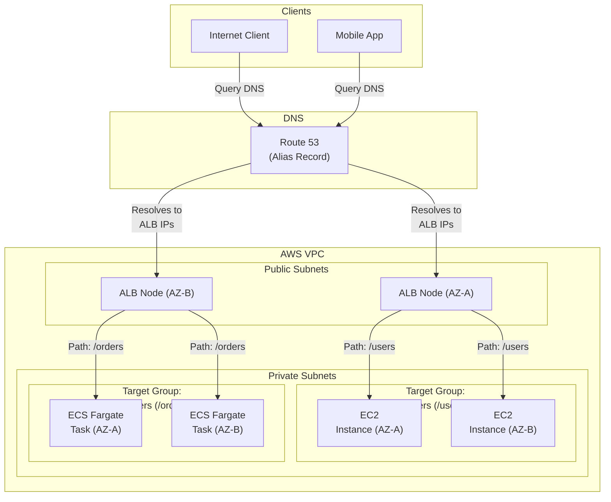
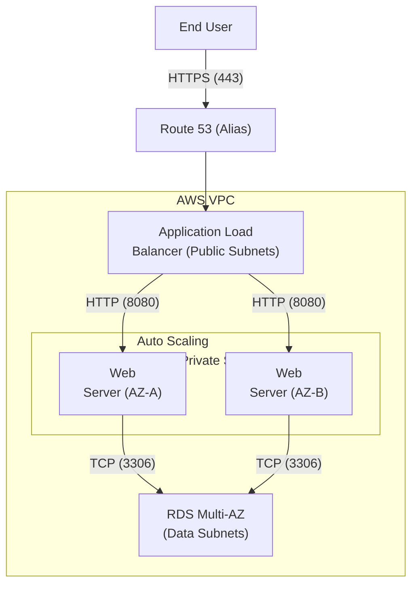
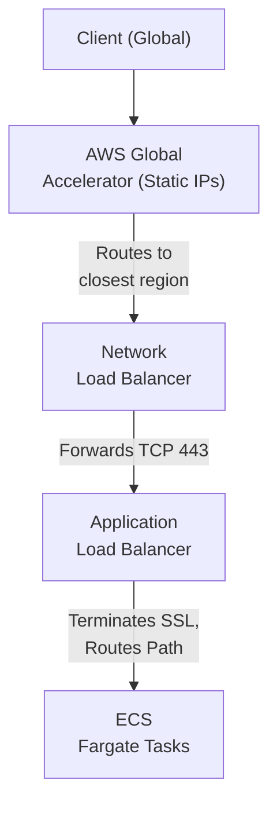

# Chapter 18: Elastic Load Balancing — ALB & NLB Architecture

---

## 1. Service Overview

Elastic Load Balancing (ELB) is an AWS service that automatically distributes incoming application traffic across multiple targets—such as EC2 instances, containers (ECS/EKS), Lambda functions, and IP addresses—across one or more Availability Zones. It acts as the single point of contact for clients routing to your application infrastructure.

### Why AWS Created It

In traditional data centers, high availability requires purchasing expensive hardware load balancers (like F5 Big-IP or Citrix NetScaler), provisioning them in active-passive pairs, and manually configuring IP routing. As traffic spikes, hardware load balancers can reach their physical limits. AWS created ELB as a fully managed, software-defined load balancing service that automatically scales its own capacity to handle volatile traffic patterns without customer intervention.

### Key Characteristics

- **Highly Available**: Automatically deployed across multiple Availability Zones to prevent single points of failure.
- **Auto-Scaling**: ELB nodes automatically scale out behind the scenes to handle millions of requests per second.
- **Health Checking**: Actively monitors the health of targets and stops routing traffic to unhealthy resources.
- **Integrated Security**: Natively integrates with AWS Certificate Manager (ACM) for SSL/TLS termination, and AWS WAF for web application firewall protection.
- **Target Flexibility**: Can route traffic to EC2 instances, Fargate containers, Lambda functions, or even on-premises servers over Direct Connect.

### The ELB Family

1. **Application Load Balancer (ALB)**: Operates at Layer 7 (HTTP/HTTPS). Built for modern microservices, it routes traffic based on URL path, host headers, HTTP headers, and query strings.
2. **Network Load Balancer (NLB)**: Operates at Layer 4 (TCP/UDP/TLS). Built for ultra-high performance and low latency. Can handle millions of requests per second and provides static IP addresses per AZ.
3. **Gateway Load Balancer (GWLB)**: Operates at Layer 3 (Network Layer). Built specifically for deploying, scaling, and managing third-party virtual appliances (like Palo Alto or Fortinet firewalls).
4. **Classic Load Balancer (CLB)**: Legacy load balancer. Operates at both Layer 4 and Layer 7. *Do not use for new applications.*

---

## 2. Learning Objectives

By the end of this chapter, you will be able to:

- **Differentiate** between ALB, NLB, and GWLB, and choose the correct load balancer for specific architectural requirements.
- **Design** highly available multi-AZ load balancing architectures.
- **Configure** Target Groups, Health Checks, and Listener Rules.
- **Implement** advanced ALB routing (Path-based, Host-based, and Header-based routing).
- **Secure** data in transit using ACM SSL/TLS certificates and Security Policies.
- **Troubleshoot** common ELB errors including HTTP 502, 503, and 504.
- **Integrate** ELB with AWS WAF, Route 53, Amazon ECS, and AWS Lambda.
- **Optimize** costs and performance by understanding cross-zone load balancing and idle timeouts.

---

## 3. Prerequisites

- **AWS Account** with administrative access
- **Completed chapters**: Chapter 3 (EC2), Chapter 4 (VPC), Chapter 7 (Route 53)
- **Concepts**: OSI Model (Layer 4 vs Layer 7), HTTP status codes, TCP/IP fundamentals, TLS/SSL certificates

---

## 4. Real-world Analogy

Think of an Elastic Load Balancer as the **Front Desk Triage System at a massive Hospital**.

Patients (Internet Traffic) arrive at the main entrance (the ELB). 

If the hospital uses a **Network Load Balancer (NLB)**, the front desk is built for pure speed. The receptionist only looks at the ID card (IP address/Port) and immediately sends the patient to the nearest available doctor without asking any questions. It handles thousands of people per minute but doesn't care *why* they are there.

If the hospital uses an **Application Load Balancer (ALB)**, the front desk is highly intelligent. The receptionist asks the patient detailed questions (looks at the HTTP request). 
- "Oh, you have a broken bone?" (Path: `/orthopedics`) -> Sends patient to the Orthopedics Target Group.
- "You have a heart issue?" (Path: `/cardiology`) -> Sends patient to the Cardiology Target Group.
- "Are you speaking Spanish?" (HTTP Header: `Accept-Language: es`) -> Sends patient to the Spanish-speaking doctor.

The receptionist also periodically calls the doctors (Health Checks). If Dr. Smith doesn't answer the phone, the receptionist stops sending patients to Dr. Smith's room until he calls back.

---

## 5. Business Use Cases

### Application Load Balancer (ALB)
- **Microservices Architectures**: Routing `/api/v1/users` to a User ECS Service, and `/api/v1/payments` to a Payment Lambda function, all sharing the same `api.company.com` domain name.
- **Web Applications**: Terminating SSL/TLS for a highly available WordPress site hosted on EC2 instances in an Auto Scaling Group.
- **Authentication**: Using ALB's built-in OIDC/Cognito integration to require users to log in before they can access an internal application.

### Network Load Balancer (NLB)
- **High-Performance Gaming**: Routing millions of concurrent UDP connections for a multiplayer game backend with microsecond latency.
- **Static IP Requirements**: Providing a single, fixed IP address per Availability Zone to external clients who need to whitelist your application in their corporate firewalls.
- **Database Load Balancing**: Distributing traffic to read replicas of self-hosted SQL/NoSQL databases running on EC2.

### Gateway Load Balancer (GWLB)
- **Inline Security Inspection**: Forcing all ingress and egress VPC traffic through a fleet of third-party Intrusion Prevention System (IPS) virtual appliances before it reaches the application servers.

---

## 6. Core Concepts

### Listeners
A process that checks for connection requests using the protocol and port you configure (e.g., HTTPS on port 443).
- **Listener Rules (ALB only)**: Determine how the load balancer routes requests to targets. Evaluated in priority order. Can route based on Host header, Path, HTTP header, Query string, or Source IP.

### Target Groups
A logical grouping of compute resources (Targets) that process requests. A Target Group is where you define the protocol, port, and health check settings for the backend resources.
- **Target Types**: `instance` (EC2 Instance IDs), `ip` (Private IP addresses, useful for on-prem or ECS awsvpc), `lambda` (Lambda functions), or `alb` (Targeting an ALB from an NLB).

### Health Checks
The mechanism ELB uses to determine if a target is capable of receiving traffic. If a target fails consecutive health checks (defined by the Unhealthy Threshold), the ELB stops sending traffic to it.

### Scheme
- **Internet-facing**: The ELB has public IP addresses and routes requests from clients over the internet.
- **Internal**: The ELB has only private IP addresses and routes requests from clients within the VPC (or connected on-prem networks).

### Cross-Zone Load Balancing
By default, ELB distributes traffic evenly across the Availability Zones enabled for the load balancer. If one AZ has 2 instances and another has 8 instances, enabling cross-zone load balancing ensures all 10 instances receive exactly 10% of the total traffic.

---

## 7. Internal Architecture



---

## 8. Service Components

### Application Load Balancer (Layer 7)
- Inspects the actual HTTP/HTTPS request.
- Supports gRPC and HTTP/2.
- Can return fixed responses (e.g., a custom 404 page) or HTTP redirects (e.g., HTTP 80 -> HTTPS 443) directly from the load balancer without hitting backend servers.
- Automatically handles SSL/TLS termination using certificates from ACM.

### Network Load Balancer (Layer 4)
- Inspects only the IP and Port.
- Preserves the Source IP of the client all the way to the backend EC2 instance (ALB does not; ALB uses the `X-Forwarded-For` header).
- Provides one static Elastic IP address per Availability Zone.
- Does not have security groups associated directly with the load balancer (security groups are applied at the target level).

### Security Policies
Configurations applied to HTTPS/TLS listeners that determine which SSL/TLS protocols and ciphers the load balancer will support (e.g., `ELBSecurityPolicy-TLS13-1-2-2021-06`).

---

## 9. Configuration

### ALB Listener Rule Priorities
Listener rules are evaluated strictly by priority (1 is highest, 50000 is lowest). The "Default" rule is evaluated last.

```json
[
  {
    "Priority": "10",
    "Conditions": [
      {
        "Field": "path-pattern",
        "Values": ["/api/v1/users/*"]
      }
    ],
    "Actions": [
      {
        "Type": "forward",
        "TargetGroupArn": "arn:aws:elasticloadbalancing:...:targetgroup/users-tg/123"
      }
    ]
  },
  {
    "Priority": "20",
    "Conditions": [
      {
        "Field": "host-header",
        "Values": ["admin.example.com"]
      }
    ],
    "Actions": [
      {
        "Type": "forward",
        "TargetGroupArn": "arn:aws:elasticloadbalancing:...:targetgroup/admin-tg/456"
      }
    ]
  }
]
```

---

## 10. Code Examples

### AWS CLI — Common Operations

```bash
# 1. Create a Target Group
aws elbv2 create-target-group \
    --name my-web-targets \
    --protocol HTTP \
    --port 80 \
    --vpc-id vpc-1234567890abcdef0 \
    --target-type instance \
    --health-check-path "/health"

# 2. Create the Application Load Balancer
aws elbv2 create-load-balancer \
    --name my-web-alb \
    --subnets subnet-1111 subnet-2222 \
    --security-groups sg-3333 \
    --scheme internet-facing \
    --type application

# 3. Create a Listener attached to the ALB and Target Group
aws elbv2 create-listener \
    --load-balancer-arn arn:aws:elasticloadbalancing:...:loadbalancer/app/my-web-alb/123 \
    --protocol HTTPS \
    --port 443 \
    --certificates CertificateArn=arn:aws:acm:...:certificate/456 \
    --default-actions Type=forward,TargetGroupArn=arn:aws:elasticloadbalancing:...:targetgroup/my-web-targets/789

# 4. Register an EC2 instance to the Target Group
aws elbv2 register-targets \
    --target-group-arn arn:aws:elasticloadbalancing:...:targetgroup/my-web-targets/789 \
    --targets Id=i-0abcdef1234567890
```

### Terraform — Creating an ALB with HTTP to HTTPS Redirect

```hcl
# Security Group for ALB
resource "aws_security_group" "alb" {
  name        = "alb-sg"
  vpc_id      = aws_vpc.main.id

  ingress {
    from_port   = 80
    to_port     = 80
    protocol    = "tcp"
    cidr_blocks = ["0.0.0.0/0"]
  }

  ingress {
    from_port   = 443
    to_port     = 443
    protocol    = "tcp"
    cidr_blocks = ["0.0.0.0/0"]
  }

  egress {
    from_port   = 0
    to_port     = 0
    protocol    = "-1"
    cidr_blocks = ["0.0.0.0/0"]
  }
}

# The Application Load Balancer
resource "aws_lb" "main" {
  name               = "production-alb"
  internal           = false
  load_balancer_type = "application"
  security_groups    = [aws_security_group.alb.id]
  subnets            = [aws_subnet.public_a.id, aws_subnet.public_b.id]

  enable_deletion_protection = true
}

# HTTP Listener - Redirects to HTTPS
resource "aws_lb_listener" "http" {
  load_balancer_arn = aws_lb.main.arn
  port              = "80"
  protocol          = "HTTP"

  default_action {
    type = "redirect"
    redirect {
      port        = "443"
      protocol    = "HTTPS"
      status_code = "HTTP_301"
    }
  }
}

# Target Group
resource "aws_lb_target_group" "web" {
  name     = "web-tg"
  port     = 8080
  protocol = "HTTP"
  vpc_id   = aws_vpc.main.id
  
  health_check {
    path                = "/healthcheck"
    healthy_threshold   = 2
    unhealthy_threshold = 3
    timeout             = 5
    interval            = 15
    matcher             = "200"
  }
}

# HTTPS Listener - Forwards to Target Group
resource "aws_lb_listener" "https" {
  load_balancer_arn = aws_lb.main.arn
  port              = "443"
  protocol          = "HTTPS"
  ssl_policy        = "ELBSecurityPolicy-TLS13-1-2-2021-06"
  certificate_arn   = aws_acm_certificate.main.arn

  default_action {
    type             = "forward"
    target_group_arn = aws_lb_target_group.web.arn
  }
}
```

---

## 11. Line-by-Line Explanation

### Health Check Configuration

```hcl
  health_check {
    path                = "/healthcheck"  # The URI the ALB requests to verify health
    healthy_threshold   = 2               # Num consecutive successful checks to mark healthy
    unhealthy_threshold = 3               # Num consecutive failed checks to mark unhealthy
    timeout             = 5               # Seconds ALB waits for a response before failing
    interval            = 15              # Seconds between each health check ping
    matcher             = "200"           # The HTTP status code(s) that indicate success
  }
```
If a target is marked unhealthy, the ALB will immediately stop sending new requests to it. However, the ALB *continues* sending health check pings to the unhealthy target. Once the target returns 2 consecutive successful `200 OK` responses, it is marked healthy again and traffic resumes.

---

## 12. Security Deep Dive

### Security Groups Integration
A massive security benefit of the ALB is acting as a protective barrier for your backend servers.
1. Place the ALB in Public Subnets. Give it a Security Group allowing Inbound 443 from `0.0.0.0/0`.
2. Place EC2 instances/ECS Tasks in Private Subnets. Give them a Security Group allowing Inbound 8080 *ONLY* from the ALB Security Group.
3. Result: It is physically impossible for an attacker on the internet to bypass the ALB and directly hit your application servers.

### AWS WAF Integration
ALB natively integrates with AWS WAF (Web Application Firewall). You attach a WebACL directly to the ALB. Before the ALB processes a request, it sends the request metadata to WAF. WAF evaluates the request against rules (e.g., SQL Injection detection, Rate Limiting, Geo-blocking). If WAF blocks it, the ALB returns a 403 Forbidden to the client and the backend server never sees the malicious request.

### X-Forwarded-For
Because the ALB acts as a reverse proxy, the backend EC2 instance sees the connection coming from the ALB's private IP address, NOT the client's public IP address. To get the actual client IP for your application logs or logic, your application must read the `X-Forwarded-For` HTTP header inserted by the ALB.

---

## 13. Monitoring & Observability

### Access Logs
ALB and NLB can capture detailed information about every single request sent to the load balancer and store them as compressed log files in an S3 bucket. Access logs contain the Client IP, Request Path, User Agent, Processing Time, and HTTP Status Codes (both from the ELB and from the Target). **Enable Access Logs for all production load balancers.**

### CloudWatch Metrics
- **`RequestCount`**: Total number of requests.
- **`TargetResponseTime`**: Time elapsed (in seconds) after the request leaves the load balancer until a response from the target is received. Spikes indicate backend performance degradation.
- **`HTTPCode_ELB_5XX_Count`**: Errors generated by the Load Balancer itself.
- **`HTTPCode_Target_5XX_Count`**: Errors generated by your application code.
- **`HealthyHostCount` / `UnHealthyHostCount`**: Number of healthy/unhealthy targets in the target group.

---

## 14. Performance & Cost Optimization

### Cost Model (ALB)
- Hourly charge: ~$0.0225 per hour.
- LCU (Load Balancer Capacity Units) charge: ~$0.008 per LCU per hour.
- LCU measures dimensions: New connections, Active connections, Processed bytes, and Rule evaluations. You are billed only on the dimension with the highest usage.

### Performance Bottlenecks
ALB scales automatically, but it takes 1-5 minutes to scale out by adding new IP addresses to DNS. If you expect a massive, instantaneous spike in traffic (e.g., a Super Bowl commercial), the ALB might become overwhelmed and drop connections. You must contact AWS Support to **"Pre-warm"** the ALB, providing them with the expected traffic rate so they manually provision massive capacity ahead of the event.

### Idle Timeout
The ALB maintains two connections: Client->ALB, and ALB->Target. If no data is sent or received before the Idle Timeout (default 60 seconds), the ALB closes the connection. Always ensure your backend server's keep-alive timeout is greater than the ALB's idle timeout.

---

## 15. Enterprise Integration

### Amazon EKS and AWS Load Balancer Controller
In Kubernetes on AWS (EKS), you deploy the AWS Load Balancer Controller. When you create an Ingress resource in Kubernetes, the Controller automatically provisions an ALB, configures listener rules, and registers the EKS Pod IPs directly into the ALB Target Group.

### Auto Scaling Groups (ASG)
ASGs integrate natively with ELB Target Groups. When an ASG scales out, it automatically registers the new EC2 instance with the Target Group. The ELB Health Checks can be configured to drive ASG health; if ELB marks an instance unhealthy, the ASG will automatically terminate it and launch a replacement.

---

## 16. Real Industry Use Cases

### Case 1: E-Commerce Microservices Migration
**Problem**: An e-commerce site running a monolith on a single domain (`shop.com`) wanted to break out the checkout system to a new ECS microservice without changing URLs.
**Solution**: Used ALB Path-Based Routing. Added a listener rule: `If Path is /checkout/* -> Forward to Checkout-ECS-TargetGroup`. The default rule routes all other traffic to the legacy Monolith-EC2-TargetGroup.
**Result**: Zero-downtime, transparent migration of a critical system.

### Case 2: Financial Data Feed (NLB)
**Problem**: A trading platform needed to ingest high-frequency TCP data feeds from financial exchanges. ALBs (Layer 7) added too much overhead and didn't support raw TCP.
**Solution**: Deployed a Network Load Balancer (NLB) across 3 AZs. The NLB provides static IP addresses that the financial exchanges whitelisted.
**Result**: Processed millions of TCP packets per second with ultra-low latency.

### Case 3: Enterprise OIDC Authentication
**Problem**: An internal HR application required employees to authenticate via Azure AD, but the legacy app had no SAML/OIDC support.
**Solution**: Used ALB's native Authentication action. Configured the ALB listener to authenticate users via Amazon Cognito (which federated to Azure AD) *before* forwarding the request to the legacy app.
**Result**: Secured a legacy application with modern enterprise SSO without changing a single line of application code.

---

## 17. Architecture Patterns

### Pattern 1: Highly Available 3-Tier Web Architecture


### Pattern 2: Global Accelerator + NLB + ALB

*(Note: Using NLB in front of ALB is a common pattern when you need a Static IP address (provided by NLB) but also need Layer 7 path routing (provided by ALB).*

---

## 18. Production Incident War Room

### Incident 1: HTTP 502 Bad Gateway Errors
**Severity**: P1 — Critical
**Symptoms**: Users are experiencing intermittent HTTP 502 errors during peak traffic periods. The ALB metric `HTTPCode_ELB_502_Count` is spiking. The backend application metric `HTTPCode_Target_5XX_Count` is zero.
**Investigation**:
1. 502 errors generated by the ELB indicate that the ELB received an invalid response from the target, or the connection was closed prematurely by the target.
2. Review Access Logs to confirm the ELB is generating the 502.
3. Check the Target backend logs. No corresponding errors found.
**Root Cause**: The backend application framework (e.g., Node.js, Spring Boot) had a default HTTP Keep-Alive timeout of 5 seconds. The ALB has a default Idle Timeout of 60 seconds. The ALB sent a request to a connection it thought was open, but the backend had already silently closed it.
**Permanent Fix**: Configure the backend web server's Keep-Alive timeout to be *greater* than the ALB's Idle Timeout (e.g., configure backend to 65 seconds).

### Incident 2: HTTP 504 Gateway Timeout
**Severity**: P2 — High
**Symptoms**: Complex reporting queries are failing with 504 errors exactly 60 seconds after the request is initiated.
**Investigation**:
1. Check ALB metrics. `HTTPCode_ELB_504_Count` is high. `TargetResponseTime` shows requests taking ~60 seconds.
**Root Cause**: The backend application was successfully processing the long-running report query, but it took 75 seconds to complete. The ALB's default Idle Timeout is 60 seconds. Because the ALB didn't receive any bytes back within 60 seconds, it dropped the connection and returned a 504 to the client.
**Permanent Fix**: Increase the ALB Idle Timeout to accommodate the longest expected transaction (e.g., 120 seconds). Alternatively, refactor the application to handle long-running reports asynchronously (return an immediate 202 Accepted, and have the client poll for results).

### Incident 3: HTTP 503 Service Unavailable
**Severity**: P1 — Critical
**Symptoms**: 100% of requests return 503 Service Temporarily Unavailable.
**Investigation**:
1. Check Target Group health. The `HealthyHostCount` metric is 0.
2. The ALB returns a 503 when it has no healthy targets available to route traffic to.
**Root Cause**: A bad code deployment caused the `/healthcheck` endpoint to start returning HTTP 500. The ALB correctly identified all targets as unhealthy and stopped sending traffic. Because no targets were healthy, the ALB returned 503 to all clients.
**Permanent Fix**: Roll back the deployment. Ensure CI/CD pipelines include automated health checks on a staging environment before routing production traffic.

### Incident 4: ALB Scale-Out IP Changes Breaking Client Firewalls
**Severity**: P2 — High
**Symptoms**: A B2B partner complains they cannot access the API. Their corporate firewall restricts outbound traffic to strict IP addresses. They whitelisted the IPs returned by `nslookup api.company.com` last month.
**Root Cause**: The ALB scales by adding and removing IP addresses from its DNS record. The partner's firewall cached old IP addresses or did not adapt to the new IP addresses the ALB provisioned during a scale-out event.
**Permanent Fix**: ALBs do not support static IPs. Deploy AWS Global Accelerator in front of the ALB (provides 2 static Anycast IPs), or place a Network Load Balancer (which provides static Elastic IPs) in front of the ALB. Instruct the partner to whitelist the static IPs.

### Incident 5: Uneven Traffic Distribution
**Severity**: P3 — Medium
**Symptoms**: EC2 instances in AZ-A are running at 90% CPU, while instances in AZ-B are running at 10% CPU.
**Investigation**:
1. Check ALB Target Group metrics. The ALB is sending 90% of requests to AZ-A.
2. Check Cross-Zone Load Balancing configuration. It is disabled.
3. Check Target counts. AZ-A has 1 healthy instance. AZ-B has 9 healthy instances.
**Root Cause**: Without Cross-Zone Load Balancing, the ALB distributes traffic evenly to the AZs first (50% to A, 50% to B). The single instance in AZ-A receives 50% of total traffic, overwhelming it. The 9 instances in AZ-B split the other 50%.
**Permanent Fix**: Enable Cross-Zone Load Balancing on the Target Group. The ALB will bypass the AZ-level split and distribute traffic evenly across all 10 backend instances regardless of which AZ they reside in.

---

## 19. Production Best Practices (Well-Architected)

### Security
- **Terminate SSL at the ALB**: Manage certificates centrally via AWS Certificate Manager (ACM). Do not pass SSL termination duties to the backend EC2 instances unless strictly required by compliance mandates.
- **Enable Deletion Protection**: Prevent accidental deletion of production load balancers.
- **Drop Invalid Headers**: Enable the ALB setting to drop HTTP headers that don't comply with RFC specifications to prevent HTTP desync attacks.

### Reliability
- **Multi-AZ Deployment**: Always select at least two availability zones when creating an ELB.
- **Graceful Draining**: Configure the Deregistration Delay on the Target Group to allow inflight requests to complete before terminating an EC2 instance during a scale-in event.

### Operational Excellence
- **Access Logs**: Always enable Access Logs and store them in an S3 bucket with lifecycle policies. They are invaluable during security audits and troubleshooting.
- **Use Alias Records**: In Route 53, always use Alias records pointing to the ELB, not CNAMEs. Alias records resolve faster and are free.

---

## 20. Migration Strategies

### Hardware Appliance to ALB
1. Analyze F5/Citrix iRules.
2. Map simple routing rules to ALB Listener Rules (Path/Host based).
3. For complex logic (e.g., modifying response bodies), implement an ALB Lambda Target or deploy the logic into the backend application.
4. Issue an ACM certificate.
5. Update Route 53 to point to the ALB.

---

## 21. CI/CD Integration

### Blue/Green Deployments with CodeDeploy
CodeDeploy natively integrates with ALB for zero-downtime deployments.
1. CodeDeploy provisions a "Green" Auto Scaling Group.
2. CodeDeploy registers the Green instances to a secondary Target Group.
3. CodeDeploy modifies the ALB Listener Rule to shift a percentage of traffic (e.g., 10%) to the Green Target Group (Canary deployment).
4. CodeDeploy monitors CloudWatch Alarms. If no errors, it shifts 100% of traffic to Green and drains the Blue Target Group.

---

## 22. Practical Projects

### Beginner Project: Basic Elastic Load Balancing Deployment
- **Business Requirement**: Deploy baseline Elastic Load Balancing resources securely.
- **Architecture**: Single-region deployment with default VPC subnets and restricted IAM roles.
- **Implementation**: Write a Terraform `main.tf` to provision Elastic Load Balancing and apply the configuration. Verify resource creation in the AWS Console.

### Intermediate Project: Multi-AZ Scalable Elastic Load Balancing Setup
- **Business Requirement**: Implement high availability and automated scaling for Elastic Load Balancing to withstand Availability Zone failures.
- **Architecture**: Application Load Balancer -> Auto Scaling Group -> Elastic Load Balancing -> KMS Encrypted Persistence Layer.
- **Implementation**: Configure scaling policies based on CPU utilization and set up CloudWatch Alarms for monitoring metrics.

### Advanced Project: Automated CI/CD Pipeline Integration
- **Business Requirement**: Automate the deployment and testing of Elastic Load Balancing infrastructure without manual intervention.
- **Architecture**: GitHub Repository -> AWS CodePipeline -> AWS CodeBuild -> Deployment to Elastic Load Balancing Targets.
- **Implementation**: Write a `buildspec.yml` to run automated security linting (e.g., tfsec or Checkov) before deploying the Elastic Load Balancing changes.

### Enterprise Project: Zero-Trust Multi-Account Architecture
- **Business Requirement**: Deploy a production-grade multi-account enterprise environment utilizing Elastic Load Balancing with centralized security governance.
- **Architecture**: AWS Organizations -> AWS Transit Gateway -> Hub-and-Spoke VPCs -> Multi-AZ Elastic Load Balancing -> AWS IAM Identity Center SSO.
- **Implementation**: Implement Service Control Policies (SCPs) to restrict Elastic Load Balancing deployments to approved regions and mandate AWS KMS customer-managed keys (CMKs) for all data at rest.

---

## 23. Interview Preparation

### Beginner
**Q1**: What is the primary difference between an ALB and an NLB?
**A**: An ALB operates at Layer 7 (HTTP/HTTPS) and can route traffic based on URL paths and headers. An NLB operates at Layer 4 (TCP/UDP), is capable of handling millions of requests with ultra-low latency, and provides static IP addresses.

**Q2**: If an EC2 instance fails a health check, what does the ALB do?
**A**: The ALB stops sending new requests to the unhealthy instance and routes traffic to the remaining healthy instances in the Target Group.

### Intermediate
**Q3**: How does an application running behind an ALB know the IP address of the client?
**A**: The application must inspect the `X-Forwarded-For` HTTP header. If it looks at the source IP of the TCP connection, it will only see the private IP address of the ALB node.

**Q4**: Explain connection draining (Deregistration Delay).
**A**: When a target is deregistering (e.g., an ASG is scaling in), the ELB stops sending *new* requests to it, but waits for the deregistration delay period (default 300 seconds) to allow currently *in-flight* requests to finish processing before terminating the connection.

### Advanced
**Q5**: A client requires a static IP address to whitelist in their corporate firewall, but your application requires HTTP path-based routing. How do you architect this?
**A**: You cannot use an ALB alone because ALB IPs change. You cannot use an NLB alone because it doesn't support Layer 7 path routing. The solution is to place AWS Global Accelerator in front of the ALB (provides 2 static Anycast IPs), OR register the ALB as a target behind an NLB.

---

## 24. AWS Certification Practice

**Q1**: A company is hosting a web application on EC2 instances behind an Application Load Balancer. The security team wants to ensure that all traffic between clients and the load balancer is encrypted, and any HTTP traffic is automatically routed to HTTPS. How should this be configured?
- A) Install SSL certificates on all EC2 instances and open port 443 in the security groups.
- B) Configure Route 53 to redirect HTTP to HTTPS.
- **C) Attach an ACM certificate to an HTTPS listener on the ALB. Create an HTTP listener on the ALB configured to redirect to the HTTPS listener.** ✓
- D) Use AWS WAF to block all traffic on port 80.

**Q2**: An application requires a load balancer capable of handling sudden, massive spikes of UDP traffic with the lowest possible latency. Which service should be used?
- A) Application Load Balancer
- **B) Network Load Balancer** ✓
- C) Classic Load Balancer
- D) Route 53 Multivalue Answer

---

## 25. Knowledge Check

1. **What layer of the OSI model does an ALB operate at?** Layer 7.
2. **What layer of the OSI model does an NLB operate at?** Layer 4.
3. **Which ELB type provides static IP addresses?** NLB (one per AZ).
4. **Where do you configure the specific routing rules based on URL path?** In ALB Listener Rules.
5. **What happens if you don't enable cross-zone load balancing?** Traffic is distributed evenly to Availability Zones first, rather than evenly across all instances regardless of AZ.
6. **What status code does ALB return if there are no healthy targets?** HTTP 503.

---

## 26. Cheat Sheet

| Feature | Application Load Balancer (ALB) | Network Load Balancer (NLB) |
|---------|---------------------------------|-----------------------------|
| **OSI Layer** | 7 (HTTP, HTTPS, gRPC, WebSockets) | 4 (TCP, UDP, TLS) |
| **Routing** | Path, Host, Header, Query String | Port/IP based |
| **Static IP** | No (Changes dynamically) | Yes (1 Elastic IP per AZ) |
| **Client IP** | Uses `X-Forwarded-For` header | Preserves Source IP |
| **Security Groups** | Yes (Directly on the ALB) | No (Handled at Target level) |
| **WAF Integration** | Yes | No |
| **Performance** | Highly scalable (warm-up needed for massive spikes) | Millions of requests per sec instantly |

---

## 27. Chapter Summary

Elastic Load Balancing is the entry point for almost all highly available AWS architectures. Key takeaways:

- Choose **ALB** for web applications, microservices, and HTTP/HTTPS routing.
- Choose **NLB** for raw performance, UDP/TCP traffic, and static IP requirements.
- Use **Target Groups** to manage your compute backends (EC2, ECS, Lambda) and enforce health checks.
- Terminate SSL centrally at the ALB using **AWS Certificate Manager (ACM)**.
- Secure your backend resources by ensuring their Security Groups only allow traffic originating from the ALB Security Group.
- Understand the difference between ELB errors (502, 503, 504) to quickly diagnose issues during production incidents.

---

## 28. Further Learning

### AWS Documentation
- [Elastic Load Balancing User Guide](https://docs.aws.amazon.com/elasticloadbalancing/latest/userguide/what-is-load-balancing.html)
- [ALB vs NLB Feature Comparison](https://aws.amazon.com/elasticloadbalancing/features/#Product_comparisons)
- [Troubleshooting ALB 5XX Errors](https://docs.aws.amazon.com/elasticloadbalancing/latest/application/load-balancer-troubleshooting.html)

### Related Chapters
- **Chapter 3 — Amazon EC2**: The primary compute targets for ELB.
- **Chapter 7 — Amazon Route 53**: Routing DNS traffic to the load balancer.
- **Chapter 22 — AWS WAF**: Protecting the ALB from web exploits.
