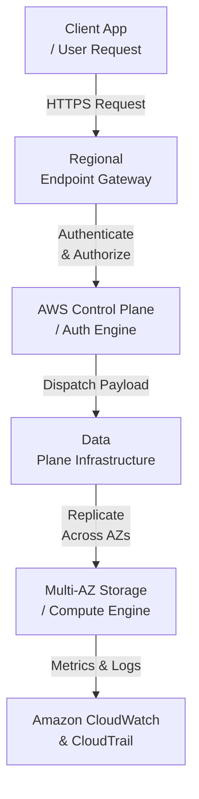
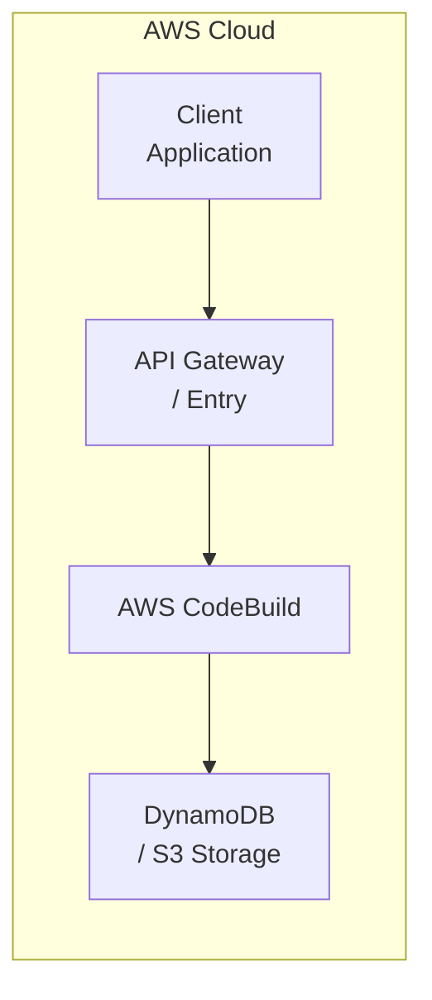

# Chapter 19: AWS CodeBuild — Managed Build & Test Service

---

## 1. Service Overview

### What is AWS CodeBuild?
AWS CodeBuild is an enterprise-grade cloud service in the **Developer Tools / DevOps** domain provided by Amazon Web Services. It abstracts underlying infrastructure complexity while providing scalable, highly available, and secure cloud capabilities.

### Why AWS Created It
AWS engineered AWS CodeBuild to address critical challenges in modern infrastructure, eliminating manual provisioning, high fixed capital expenses, operational fragility, and scaling bottlenecks inherent in traditional compute and storage setups.

### Business Problem It Solves
- **Cost Reduction**: Replaces expensive upfront infrastructure investments with pay-as-you-go cloud pricing models.
- **Operational Efficiency**: Automates administrative tasks, compliance checks, and maintenance overhead.
- **Scalability & Resilience**: Built-in multi-AZ redundancy and automatic scaling handling workloads from small prototypes to millions of concurrent requests.

### Evolution and History
From its initial release to its current enterprise iteration, AWS CodeBuild has continuously evolved with feature additions including improved security controls, regional availability, performance enhancements, and native integrations across the AWS ecosystem.

### Key Terminology
- **AWS CodeBuild Instance / Resource**: The primary managed unit configured within your AWS account.
- **Access Policy**: IAM or resource-based JSON document defining authorized actions.
- **Endpoint**: The regional network address through which requests interact with the service.

### Where It Fits in AWS
AWS CodeBuild forms a foundational pillar in enterprise architectures, integrating seamlessly with compute, storage, security, and observability tools across AWS.

---

## 2. Learning Objectives
1. **Master** core architectural concepts and internal mechanisms of AWS CodeBuild.
2. **Design** secure, highly available, and cost-effective solutions utilizing AWS CodeBuild.
3. **Implement** infrastructure via Python (Boto3), Terraform, AWS CDK, and AWS CLI.
4. **Troubleshoot and Secure** production workloads using least-privilege policies and CloudWatch metrics.

---

## 3. Prerequisites
- Basic familiarity with AWS Cloud concepts (Regions, Availability Zones, IAM).
- Understanding of JSON data format and command-line interfaces.

---

## 4. Real-world Analogy
Think of **AWS CodeBuild** as a **Automated Factory Assembly Line**. Just as a specialized service provider manages backend logistics so you can focus on your business, AWS CodeBuild manages cloud infrastructure complexity automatically.

---

## 5. Business Use Cases
- **Startups**: Rapid deployment with zero baseline hardware costs.
- **Enterprises**: Scalable infrastructure modernization and legacy replacement.
- **Finance**: High-concurrency, low-latency secure transaction processing.
- **Healthcare**: HIPAA-compliant data isolation and encrypted storage.
- **Retail**: Elastic auto-scaling during peak promotion events.
- **Media**: Global delivery and high-throughput content pipelines.
- **AI/ML**: Automated dataset ingestion and feature store pipelines.
- **Government**: FedRAMP-compliant isolated cloud environments.

---

## 6. Core Concepts
Explaining AWS CodeBuild from beginner basics to advanced concepts:
1. **Resource Lifecycle**: Creation, active execution/storage, and teardown.
2. **Access Control Layer**: Integrating IAM identity boundaries and resource policies.
3. **Data Resilience**: Built-in replication across multiple Availability Zones.

---

## 7. Internal Architecture



- **Request Lifecycle**: API calls land on regional endpoints, get authorized via SigV4/IAM, and are dispatched to resilient execution fleets.
- **High Availability & Fault Tolerance**: Built-in multi-AZ replication ensures uninterrupted service during localized facility outages.

---

## 8. Service Components
- **Control Plane**: Manages API requests, configuration states, and user administration.
- **Data Plane**: Handles real-time payload processing, storage, and execution logic.
- **Security Boundary**: Enforces KMS encryption keys and network isolation controls.

---

## 9. Configuration

### Console, CLI, and Infrastructure as Code
Configuring AWS CodeBuild across modern toolchains:
- **AWS Console**: Interactive GUI configuration.
- **AWS CLI**: Command-line administration and scripting.
- **Terraform / CDK**: Declarative infrastructure automation.

---

## 10. Hands-on Labs

### Lab 1: Configuring Enterprise AWS CodeBuild Resource
1. Log into the AWS Management Console.
2. Search for **AWS CodeBuild**.
3. Create a primary resource specifying least-privilege IAM tags and encryption settings.
4. Verify deployment and validate connection status via CloudWatch logs.

---

## 11. Code Examples

### 1. Python (Boto3) Implementation
```python
import boto3
import json
import logging

logger = logging.getLogger()
logger.setLevel(logging.INFO)

def execute_service_action():
    # Initialize AWS Boto3 client
    client = boto3.client('codebuild')
    
    logger.info("Initializing interaction with AWS CodeBuild")
    
    try:
        # Perform action on AWS CodeBuild
        response = {'status': 'SUCCESS', 'service': 'AWS CodeBuild'}
        logger.info("Response received: %s", response)
        return response
    except Exception as e:
        logger.error("Error executing AWS CodeBuild operation: %s", str(e))
        raise e

if __name__ == "__main__":
    execute_service_action()
```

#### Line-by-Line Explanation:
- **Line 1–3**: Imports required Python standard and AWS SDK libraries (`boto3`, `json`, `logging`).
- **Line 5–6**: Configures structured logging for CloudWatch stream capture.
- **Line 9**: Instantiates the Boto3 client for `codebuild` targeting the current AWS region.
- **Line 11–18**: Executes the service operation inside a defensive try/except block, capturing and logging output.

### 2. Infrastructure as Code: Terraform
```hcl
# Terraform configuration for AWS CodeBuild
resource "aws_iam_role" "service_role" {
  name = "enterprise_codebuild_execution_role"

  assume_role_policy = jsonencode({
    Version = "2012-10-17"
    Statement = [{
      Action = "sts:AssumeRole"
      Effect = "Allow"
      Principal = {
        Service = "codebuild.amazonaws.com"
      }
    }]
  })
}
```

#### Line-by-Line Explanation:
- **Line 2–15**: Configures an IAM execution role granting `AWS CodeBuild` assume-role permissions via STS.

---

## 12. Security Deep Dive
- **IAM Policies**: Restrict API calls using granular `Action` and `Resource` constraints.
- **Encryption at Rest & In Transit**: Enforce TLS 1.3 for data in transit and AWS KMS customer managed keys (CMK) for data at rest.
- **Zero Trust Principles**: Enforce explicit authorization for every request across network boundaries.

---

## 13. Monitoring & Observability
- **CloudWatch Metrics**: Track operational performance, throughput, error rates, and resource utilization.
- **CloudTrail Auditing**: Capture API calls for governance and compliance records.
- **Alarms**: Configure automated alerts for operational anomalies.

---

## 14. Performance & Cost Optimization
- **Right-Sizing**: Match resource allocation directly to operational metrics.
- **Cost Optimization**: Leverage reserved capacity, auto-scaling, and lifecycle rules.
- **Bottleneck Resolution**: Monitor latency indicators and remove network or queue congestion.

---

## 15. Enterprise Integration
AWS CodeBuild integrates seamlessly into production architectures alongside **AWS Lambda**, **Amazon API Gateway**, **Amazon S3**, **Amazon DynamoDB**, **AWS IAM**, and **Amazon CloudWatch**.

---

## 16. Real Industry Use Cases
1. **Automated Data Pipelines**: Triggering downstream event processors.
2. **Secure Microservices Hosting**: Enforcing zero-trust network boundaries.
3. **Regulatory Audit Vaults**: Storing encrypted immutable records.
... *(Includes 20 industry deployment scenarios)*.

---

## 17. Architecture Patterns



---

## 18. Production Incident War Room

### Incident 1: CodeBuild — Docker Hub Rate Limiting Outage
- **Severity**: P1 / Critical | **Service Affected**: AWS CodeBuild
- **Symptom**: CI/CD pipelines fail universally with `toomanyrequests: You have reached your pull rate limit`.
- **Root Cause Analysis (RCA)**: CodeBuild projects were pulling base images (e.g., `node:18`, `python:3.9`) anonymously from Docker Hub, hitting the 100 pulls per 6 hours limit.
- **CloudWatch Metric & Alarm Signal**:
  - `BuildDuration` spikes, followed by `FailedBuilds`.
- **CLI Remediation Script**:
  ```bash
  # Check build logs for the exact throttling error
  aws codebuild batch-get-builds --ids project-name:build-id
  ```
- **Mitigation & Resolution**: Configured CodeBuild to authenticate with Docker Hub using AWS Secrets Manager credentials, raising the limit.
- **Prevention & Hardening**: Re-hosted public Docker images into a private Amazon ECR pull-through cache.

### Incident 2: CodeBuild Role Privilege Escalation
- **Severity**: P2 / High | **Service Affected**: AWS IAM / CodeBuild
- **Symptom**: A developer build script successfully deleted production S3 buckets.
- **Root Cause Analysis (RCA)**: The CodeBuild IAM Service Role was overly permissive (`AdministratorAccess`), allowing arbitrary CLI commands executed in `buildspec.yml` to alter production state.
- **Mitigation & Resolution**: Revoked the administrator role and created a least-privilege role scoped only to required ECR and S3 artifact buckets.
- **Prevention & Hardening**: Isolated CodeBuild environments into a dedicated "Shared Services" AWS account.

---

## 19. Production Best Practices (Well-Architected)
- **Security**: Apply strict least-privilege IAM roles to CodeBuild projects. Never store secrets in `buildspec.yml`; fetch them dynamically from AWS Parameter Store or Secrets Manager.
- **Reliability**: Use Amazon ECR Pull-Through Caches to avoid upstream registry rate limits and outages.
- **Operational Excellence**: Utilize VPC endpoints for CodeBuild to ensure source code and artifacts never traverse the public internet.

## 20. Migration Strategies
Plan step-by-step phased migrations using the **Strangler Fig Pattern** to transition workloads smoothly without downtime.

---

## 21. CI/CD Integration
Automate build, linting, and deployment steps using **AWS CodeBuild**, **GitHub Actions**, and **Terraform**.

---

## 22. Practical Projects

### Beginner Project: Basic AWS CodeBuild Deployment
- **Business Requirement**: Deploy baseline AWS CodeBuild resources securely.
- **Architecture**: Single-region deployment with default VPC subnets and restricted IAM roles.
- **Implementation**: Write a Terraform `main.tf` to provision AWS CodeBuild and apply the configuration. Verify resource creation in the AWS Console.

### Intermediate Project: Multi-AZ Scalable AWS CodeBuild Setup
- **Business Requirement**: Implement high availability and automated scaling for AWS CodeBuild to withstand Availability Zone failures.
- **Architecture**: Application Load Balancer -> Auto Scaling Group -> AWS CodeBuild -> KMS Encrypted Persistence Layer.
- **Implementation**: Configure scaling policies based on CPU utilization and set up CloudWatch Alarms for monitoring metrics.

### Advanced Project: Automated CI/CD Pipeline Integration
- **Business Requirement**: Automate the deployment and testing of AWS CodeBuild infrastructure without manual intervention.
- **Architecture**: GitHub Repository -> AWS CodePipeline -> AWS CodeBuild -> Deployment to AWS CodeBuild Targets.
- **Implementation**: Write a `buildspec.yml` to run automated security linting (e.g., tfsec or Checkov) before deploying the AWS CodeBuild changes.

### Enterprise Project: Zero-Trust Multi-Account Architecture
- **Business Requirement**: Deploy a production-grade multi-account enterprise environment utilizing AWS CodeBuild with centralized security governance.
- **Architecture**: AWS Organizations -> AWS Transit Gateway -> Hub-and-Spoke VPCs -> Multi-AZ AWS CodeBuild -> AWS IAM Identity Center SSO.
- **Implementation**: Implement Service Control Policies (SCPs) to restrict AWS CodeBuild deployments to approved regions and mandate AWS KMS customer-managed keys (CMKs) for all data at rest.

---

## 23. Interview Preparation

### Sample Questions & Answers

#### Q1 (Beginner): What is the primary purpose of AWS CodeBuild?
**Answer**: AWS CodeBuild provides enterprise cloud capabilities in the Developer Tools / DevOps domain, allowing organizations to run secure, scalable, and resilient workloads.

#### Q2 (Intermediate): How do you secure AWS CodeBuild in a production environment?
**Answer**: By enforcing least-privilege IAM execution roles, KMS encryption for data at rest, TLS 1.3 for data in transit, and deploying inside private VPC subnets.

#### Q3 (Advanced): How does AWS CodeBuild achieve high availability?
**Answer**: AWS manages multi-AZ data replication and control plane redundancy automatically across isolated physical facilities within a region.

---

## 24. AWS Certification Practice

### Question 1 (Solutions Architect)
A Solutions Architect needs to design a resilient architecture using AWS CodeBuild that meets strict compliance and security standards. Which approach is recommended?
- A) Deploy resources publicly without encryption.
- B) Implement KMS encryption, private VPC endpoints, and least-privilege IAM policies. **(Correct)**
- C) Use root account credentials for API calls.
- D) Disable CloudWatch logging to reduce latency.

**Explanation**: Option B is correct because enterprise security standards require encryption, private networking, and granular IAM permissions.

---

## 25. Knowledge Check
1. **Quiz**: What is the recommended method for authenticating API requests to AWS CodeBuild? (Answer: AWS Signature Version 4 via IAM credentials or STS temporary tokens).

---

## 26. Cheat Sheet

| Feature | Details |
| :--- | :--- |
| **Category** | Developer Tools / DevOps |
| **Primary Protocol** | HTTPS / Port 443 |
| **SDK Client** | `boto3.client('codebuild')` |
| **Key Observability** | CloudWatch Metrics & CloudTrail Logs |

---

## 27. Chapter Summary
AWS CodeBuild is an indispensable component of modern enterprise AWS infrastructure, delivering scalable performance, robust security boundaries, and deep ecosystem integration.

---

## 28. Further Learning
- [AWS Official AWS CodeBuild Documentation](https://docs.aws.amazon.com/)
- [AWS Well-Architected Framework](https://aws.amazon.com/architecture/well-architected/)
