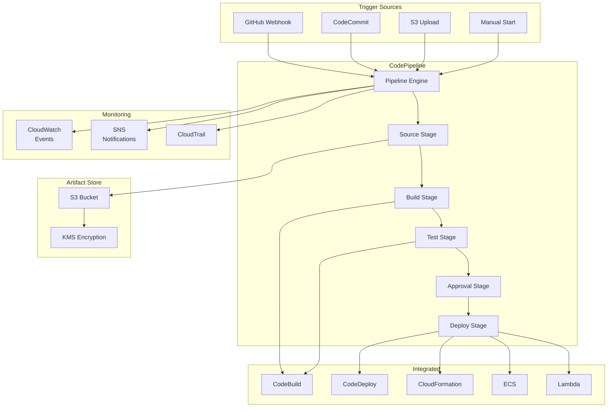
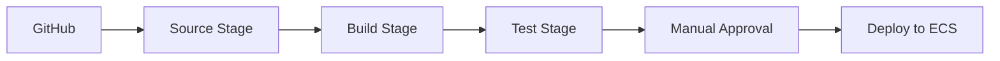
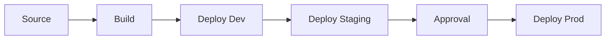
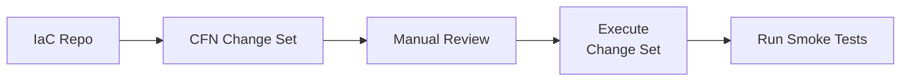

# Chapter 20: AWS CodePipeline — Continuous Delivery Service

---

## 1. Service Overview

AWS CodePipeline is a fully managed continuous delivery (CD) service that automates the release pipelines for fast and reliable application and infrastructure updates. CodePipeline models your release process as a series of **stages** (Source, Build, Test, Deploy, Approval) and automates the steps required to release software changes continuously.

### Why CodePipeline Exists

Without CI/CD pipelines, deployments are manual, error-prone, and slow. Developers build code locally, manually upload artifacts, and hope nothing breaks. CodePipeline eliminates this by automating the entire release process — from code commit to production deployment — with built-in approval gates, parallel actions, and rollback capabilities.

### Key Characteristics

- **Fully Managed**: No servers to provision or manage
- **Pipeline as Code**: Define pipelines in CloudFormation, CDK, or Terraform
- **Multi-Stage**: Source → Build → Test → Approval → Deploy (customizable)
- **Parallel Actions**: Run multiple actions within a stage simultaneously
- **Manual Approvals**: Human approval gates before production deployment
- **Integration**: Native integration with CodeCommit, CodeBuild, CodeDeploy, CloudFormation, ECS, Lambda, S3, and third-party tools (GitHub, Jenkins, Terraform)
- **Cross-Region**: Deploy to multiple AWS regions from a single pipeline
- **Cross-Account**: Deploy to different AWS accounts (dev, staging, production)
- **Pipeline Types**: V1 (original) and V2 (enhanced triggers, variables, Git tags)

### V1 vs V2 Pipelines

| Feature | V1 Pipeline | V2 Pipeline |
|---------|-------------|-------------|
| **Triggers** | Polling or CloudWatch Events | Git tags, branches, file paths, PR events |
| **Variables** | Limited pipeline variables | Enhanced variables at pipeline, stage, action level |
| **Pricing** | $1.00/month per active pipeline | $0.002 per action execution minute |
| **Pipeline Definition** | JSON/YAML | JSON/YAML with enhanced features |

---

## 2. Learning Objectives

By the end of this chapter, you will be able to:

- **Explain** CI/CD concepts and the role of CodePipeline in the AWS DevOps ecosystem
- **Design** multi-stage pipelines with Source, Build, Test, Approve, and Deploy stages
- **Implement** pipelines using Boto3, AWS CLI, CloudFormation, CDK, and Terraform
- **Configure** GitHub, CodeCommit, and S3 as source providers
- **Integrate** CodeBuild for build/test and CodeDeploy/ECS/CloudFormation for deployment
- **Implement** manual approval gates for production deployments
- **Configure** cross-account and cross-region deployments
- **Secure** pipelines with IAM roles, artifact encryption, and VPC access
- **Monitor** pipeline executions with CloudWatch Events, SNS, and CloudTrail
- **Troubleshoot** failed stages, permission errors, and artifact issues

---

## 3. Prerequisites

- **AWS Account** with admin or PowerUser access
- **AWS CLI v2** installed and configured
- **Completed chapters**: Chapter 1 (IAM), Chapter 8 (Lambda), Chapter 19 (CodeBuild)
- **Concepts**: Git version control, CI/CD fundamentals, build/deploy processes
- **Recommended**: GitHub account or AWS CodeCommit repository

---

## 4. Real-world Analogy

Think of CodePipeline as an **automobile assembly line**.

Raw materials (source code) enter the factory. The first station (Source stage) receives the raw materials from the supplier (GitHub/CodeCommit). The second station (Build stage) shapes and assembles components (compiles code, runs unit tests). The quality inspection station (Test stage) checks for defects (integration tests, security scans). The floor manager (Approval stage) signs off on quality. The final station (Deploy stage) ships the finished car to the dealership (production environment).

If any station detects a problem, the entire line stops until it is fixed — just like a pipeline halts on stage failure.

---

## 5. Business Use Cases

### Software Delivery
- **Web Application Deployment**: GitHub → CodeBuild → ECS Fargate (rolling update)
- **Serverless Deployment**: CodeCommit → CodeBuild → CloudFormation (SAM) → Lambda
- **Mobile Backend**: GitHub → CodeBuild → Elastic Beanstalk

### Infrastructure as Code
- **CloudFormation Pipelines**: IaC changes → CodePipeline → CloudFormation change sets → Manual approval → Deploy
- **Terraform Pipelines**: GitHub → CodeBuild (terraform plan) → Approval → CodeBuild (terraform apply)
- **CDK Pipelines**: CDK code → CodeBuild (cdk synth) → CloudFormation deploy

### Multi-Environment Promotion
- **Dev → Staging → Production**: Automatic promotion through environments with approval gates
- **Blue/Green Deployments**: CodeDeploy with traffic shifting
- **Canary Deployments**: ECS with weighted target groups

### Compliance & Governance
- **Change Management**: Every deployment requires approval from Change Advisory Board
- **Audit Trail**: Complete deployment history via CloudTrail
- **Security Scanning**: Automated security scans in Build/Test stages

---

## 6. Core Concepts

### Pipeline

A pipeline is a workflow that describes how software changes go through the release process. It consists of a sequence of **stages**, each containing one or more **actions**.

### Stage

A logical grouping of actions. Stages execute sequentially — Stage 2 only starts after Stage 1 succeeds. Common stages: Source, Build, Test, Approval, Deploy.

### Action

A task within a stage. Actions can run in **parallel** (same `runOrder`) or **sequentially** (different `runOrder`). Action types:

| Category | Action Provider | Purpose |
|----------|----------------|---------|
| **Source** | CodeCommit, GitHub, S3, ECR | Fetch source code or artifacts |
| **Build** | CodeBuild, Jenkins | Compile, test, package |
| **Test** | CodeBuild, Device Farm, Third-party | Integration/load/security testing |
| **Deploy** | CodeDeploy, CloudFormation, ECS, S3, Elastic Beanstalk, Lambda | Deploy to target |
| **Approval** | Manual Approval | Human gate with SNS notification |
| **Invoke** | Lambda, Step Functions | Custom logic |

### Artifact

Output from one action that becomes input to another. Stored in an S3 bucket (artifact store). Each action can consume **input artifacts** and produce **output artifacts**.

### Transition

The connection between stages. Transitions can be **enabled** (automatic flow) or **disabled** (manual hold). Disabling a transition stops the pipeline from progressing beyond that point.

### Pipeline Execution

A single run of the pipeline triggered by a source change, manual start, or schedule. Each execution has a unique ID, status, and history.

---

## 7. Internal Architecture



---

## 8. Service Components

### Pipeline
The top-level resource defining the workflow stages and actions.

### Stage
A logical phase in the pipeline (Source, Build, Deploy, etc.). Stages execute sequentially.

### Action
An individual task within a stage. Configured with provider, input/output artifacts, and configuration parameters.

### Artifact Store
An S3 bucket that stores pipeline artifacts (source code, build output, test results). Encrypted with KMS by default.

### Service Role
An IAM role assumed by CodePipeline to interact with other AWS services (CodeBuild, CodeDeploy, S3, CloudFormation, etc.).

### Webhook (V1) / Trigger (V2)
The mechanism that starts pipeline execution when source code changes. V2 pipelines support enhanced triggers (branch filters, file path filters, Git tags).

---

## 9. Configuration

### Pipeline Service Role Permissions

```json
{
  "Version": "2012-10-17",
  "Statement": [
    {
      "Effect": "Allow",
      "Action": ["s3:GetObject", "s3:PutObject", "s3:GetBucketVersioning"],
      "Resource": ["arn:aws:s3:::codepipeline-artifacts-*"]
    },
    {
      "Effect": "Allow",
      "Action": ["codebuild:StartBuild", "codebuild:BatchGetBuilds"],
      "Resource": "*"
    },
    {
      "Effect": "Allow",
      "Action": ["codedeploy:CreateDeployment", "codedeploy:GetDeployment"],
      "Resource": "*"
    },
    {
      "Effect": "Allow",
      "Action": ["cloudformation:CreateStack", "cloudformation:UpdateStack", "cloudformation:DescribeStacks"],
      "Resource": "*"
    },
    {
      "Effect": "Allow",
      "Action": ["ecs:UpdateService", "ecs:DescribeServices"],
      "Resource": "*"
    },
    {
      "Effect": "Allow",
      "Action": ["lambda:InvokeFunction"],
      "Resource": "*"
    },
    {
      "Effect": "Allow",
      "Action": ["sns:Publish"],
      "Resource": "*"
    }
  ]
}
```

---

## 10. Code Examples

### Python (Boto3) — Create a Pipeline

```python
import boto3
import json

cp = boto3.client('codepipeline', region_name='us-east-1')

pipeline_definition = {
    'name': 'OrderServicePipeline',
    'roleArn': 'arn:aws:iam::123456789012:role/CodePipelineServiceRole',
    'artifactStore': {
        'type': 'S3',
        'location': 'codepipeline-artifacts-123456789012-us-east-1',
        'encryptionKey': {
            'id': 'arn:aws:kms:us-east-1:123456789012:key/key-id',
            'type': 'KMS'
        }
    },
    'stages': [
        {
            'name': 'Source',
            'actions': [
                {
                    'name': 'GitHubSource',
                    'actionTypeId': {
                        'category': 'Source',
                        'owner': 'ThirdParty',
                        'provider': 'GitHub',
                        'version': '1'
                    },
                    'configuration': {
                        'Owner': 'myorg',
                        'Repo': 'order-service',
                        'Branch': 'main',
                        'OAuthToken': '{{resolve:secretsmanager:github-token}}'
                    },
                    'outputArtifacts': [{'name': 'SourceOutput'}],
                    'runOrder': 1
                }
            ]
        },
        {
            'name': 'Build',
            'actions': [
                {
                    'name': 'BuildAndTest',
                    'actionTypeId': {
                        'category': 'Build',
                        'owner': 'AWS',
                        'provider': 'CodeBuild',
                        'version': '1'
                    },
                    'configuration': {
                        'ProjectName': 'order-service-build'
                    },
                    'inputArtifacts': [{'name': 'SourceOutput'}],
                    'outputArtifacts': [{'name': 'BuildOutput'}],
                    'runOrder': 1
                }
            ]
        },
        {
            'name': 'Approval',
            'actions': [
                {
                    'name': 'ManualApproval',
                    'actionTypeId': {
                        'category': 'Approval',
                        'owner': 'AWS',
                        'provider': 'Manual',
                        'version': '1'
                    },
                    'configuration': {
                        'NotificationArn': 'arn:aws:sns:us-east-1:123456789012:deployment-approvals',
                        'CustomData': 'Please review the build output and approve for production deployment.'
                    },
                    'runOrder': 1
                }
            ]
        },
        {
            'name': 'Deploy',
            'actions': [
                {
                    'name': 'DeployToECS',
                    'actionTypeId': {
                        'category': 'Deploy',
                        'owner': 'AWS',
                        'provider': 'ECS',
                        'version': '1'
                    },
                    'configuration': {
                        'ClusterName': 'production-cluster',
                        'ServiceName': 'order-service',
                        'FileName': 'imagedefinitions.json'
                    },
                    'inputArtifacts': [{'name': 'BuildOutput'}],
                    'runOrder': 1
                }
            ]
        }
    ]
}

response = cp.create_pipeline(pipeline=pipeline_definition)
print(f"Pipeline created: {response['pipeline']['name']}")

# Start pipeline execution manually
execution = cp.start_pipeline_execution(name='OrderServicePipeline')
print(f"Execution started: {execution['pipelineExecutionId']}")

# Get pipeline state
state = cp.get_pipeline_state(name='OrderServicePipeline')
for stage in state['stageStates']:
    status = stage.get('latestExecution', {}).get('status', 'N/A')
    print(f"  Stage: {stage['stageName']} — Status: {status}")

# Approve manual approval action
cp.put_approval_result(
    pipelineName='OrderServicePipeline',
    stageName='Approval',
    actionName='ManualApproval',
    result={
        'summary': 'Approved after reviewing build output and test results',
        'status': 'Approved'
    },
    token='approval-token-from-notification'
)
```

### AWS CLI — Common Operations

```bash
# Create pipeline from JSON
aws codepipeline create-pipeline \
  --cli-input-json file://pipeline-definition.json

# Start execution
aws codepipeline start-pipeline-execution \
  --name OrderServicePipeline

# Get pipeline state
aws codepipeline get-pipeline-state \
  --name OrderServicePipeline

# List pipelines
aws codepipeline list-pipelines

# Get pipeline execution details
aws codepipeline get-pipeline-execution \
  --pipeline-name OrderServicePipeline \
  --pipeline-execution-id execution-id

# Approve a manual approval
aws codepipeline put-approval-result \
  --pipeline-name OrderServicePipeline \
  --stage-name Approval \
  --action-name ManualApproval \
  --token "approval-token" \
  --result "summary=Approved,status=Approved"

# Disable a stage transition
aws codepipeline disable-stage-transition \
  --pipeline-name OrderServicePipeline \
  --stage-name Deploy \
  --transition-type Inbound \
  --reason "Production freeze for maintenance window"

# Enable a stage transition
aws codepipeline enable-stage-transition \
  --pipeline-name OrderServicePipeline \
  --stage-name Deploy \
  --transition-type Inbound

# Delete pipeline
aws codepipeline delete-pipeline --name OrderServicePipeline
```

### Terraform

```hcl
resource "aws_codepipeline" "order_service" {
  name     = "OrderServicePipeline"
  role_arn = aws_iam_role.codepipeline.arn

  artifact_store {
    location = aws_s3_bucket.artifacts.bucket
    type     = "S3"
    encryption_key {
      id   = aws_kms_key.pipeline.arn
      type = "KMS"
    }
  }

  stage {
    name = "Source"
    action {
      name             = "GitHubSource"
      category         = "Source"
      owner            = "ThirdParty"
      provider         = "GitHub"
      version          = "1"
      output_artifacts = ["SourceOutput"]
      configuration = {
        Owner      = "myorg"
        Repo       = "order-service"
        Branch     = "main"
        OAuthToken = var.github_token
      }
    }
  }

  stage {
    name = "Build"
    action {
      name             = "BuildAndTest"
      category         = "Build"
      owner            = "AWS"
      provider         = "CodeBuild"
      version          = "1"
      input_artifacts  = ["SourceOutput"]
      output_artifacts = ["BuildOutput"]
      configuration = {
        ProjectName = aws_codebuild_project.build.name
      }
    }
  }

  stage {
    name = "Approval"
    action {
      name     = "ManualApproval"
      category = "Approval"
      owner    = "AWS"
      provider = "Manual"
      version  = "1"
      configuration = {
        NotificationArn = aws_sns_topic.approvals.arn
        CustomData      = "Review and approve for production"
      }
    }
  }

  stage {
    name = "Deploy"
    action {
      name            = "DeployToECS"
      category        = "Deploy"
      owner           = "AWS"
      provider        = "ECS"
      version         = "1"
      input_artifacts = ["BuildOutput"]
      configuration = {
        ClusterName = aws_ecs_cluster.prod.name
        ServiceName = aws_ecs_service.order.name
        FileName    = "imagedefinitions.json"
      }
    }
  }

  tags = {
    Environment = "production"
    Team        = "platform"
  }
}
```

### CloudFormation

```yaml
AWSTemplateFormatVersion: '2010-09-09'
Resources:
  Pipeline:
    Type: AWS::CodePipeline::Pipeline
    Properties:
      Name: OrderServicePipeline
      RoleArn: !GetAtt PipelineRole.Arn
      ArtifactStore:
        Type: S3
        Location: !Ref ArtifactBucket
      Stages:
        - Name: Source
          Actions:
            - Name: GitHubSource
              ActionTypeId:
                Category: Source
                Owner: ThirdParty
                Provider: GitHub
                Version: '1'
              Configuration:
                Owner: myorg
                Repo: order-service
                Branch: main
                OAuthToken: !Sub '{{resolve:secretsmanager:github-token}}'
              OutputArtifacts:
                - Name: SourceOutput
        - Name: Build
          Actions:
            - Name: BuildAndTest
              ActionTypeId:
                Category: Build
                Owner: AWS
                Provider: CodeBuild
                Version: '1'
              Configuration:
                ProjectName: !Ref BuildProject
              InputArtifacts:
                - Name: SourceOutput
              OutputArtifacts:
                - Name: BuildOutput
        - Name: Deploy
          Actions:
            - Name: DeployToECS
              ActionTypeId:
                Category: Deploy
                Owner: AWS
                Provider: ECS
                Version: '1'
              Configuration:
                ClusterName: !Ref ECSCluster
                ServiceName: !Ref ECSService
                FileName: imagedefinitions.json
              InputArtifacts:
                - Name: BuildOutput
```

---

## 11. Line-by-Line Explanation

### Pipeline Stage Definition Breakdown

```python
{
    'name': 'Build',                      # Stage name (appears in console)
    'actions': [                          # List of actions in this stage
        {
            'name': 'BuildAndTest',       # Action name (unique within stage)
            'actionTypeId': {
                'category': 'Build',      # Action category (Source/Build/Test/Deploy/Approval/Invoke)
                'owner': 'AWS',           # Who provides the action (AWS, ThirdParty, Custom)
                'provider': 'CodeBuild',  # Specific service providing this action
                'version': '1'            # Action provider version
            },
            'configuration': {
                'ProjectName': 'my-build' # Provider-specific configuration
            },
            'inputArtifacts': [           # Artifacts consumed by this action
                {'name': 'SourceOutput'}  # Must match an outputArtifact from a prior stage
            ],
            'outputArtifacts': [          # Artifacts produced by this action
                {'name': 'BuildOutput'}   # Available as input to later stages
            ],
            'runOrder': 1                 # Actions with same runOrder execute in parallel
        }
    ]
}
```

---

## 12. Security Deep Dive

### Pipeline Service Role (Least Privilege)

The pipeline service role should only have permissions for the specific services and resources used in the pipeline.

### Cross-Account Deployment

```
┌─────────────────┐    ┌─────────────────┐    ┌─────────────────┐
│   Dev Account   │    │ Staging Account │    │  Prod Account   │
│   (Source +     │───→│   (Deploy)      │───→│   (Deploy)      │
│    Build)       │    │                 │    │   + Approval    │
└─────────────────┘    └─────────────────┘    └─────────────────┘
```

Requirements:
1. Pipeline IAM role can assume cross-account roles
2. Target account IAM role trusts the pipeline account
3. S3 artifact bucket policy allows cross-account access
4. KMS key policy allows cross-account decrypt

### Security Best Practices
1. **Use CodeStar Connections** instead of OAuth tokens for GitHub
2. **Encrypt artifacts** with customer-managed KMS keys
3. **Least-privilege service role** — only permissions needed by the pipeline
4. **Separate pipelines** per environment (not just separate stages)
5. **Manual approval** before production deployments
6. **Disable transitions** during maintenance windows
7. **Audit with CloudTrail** — all pipeline API calls

---

## 13. Monitoring & Observability

### CloudWatch Events / EventBridge

```bash
# Rule for pipeline execution state changes
aws events put-rule \
  --name "PipelineFailureAlert" \
  --event-pattern '{
    "source": ["aws.codepipeline"],
    "detail-type": ["CodePipeline Pipeline Execution State Change"],
    "detail": {
      "state": ["FAILED"]
    }
  }'

# Rule for stage execution state changes
aws events put-rule \
  --name "DeployStageAlert" \
  --event-pattern '{
    "source": ["aws.codepipeline"],
    "detail-type": ["CodePipeline Stage Execution State Change"],
    "detail": {
      "stage": ["Deploy"],
      "state": ["FAILED", "SUCCEEDED"]
    }
  }'
```

### SNS Notifications

Configure SNS topics for:
- Pipeline failures
- Manual approval requests
- Deployment completions
- Stage transitions

---

## 14. Performance & Cost Optimization

### Cost Model

| Item | V1 Pipeline | V2 Pipeline |
|------|-------------|-------------|
| **Pipeline** | $1.00/month per active pipeline | No monthly fee |
| **Action execution** | Included | $0.002 per action execution minute |
| **Free tier** | 1 free active pipeline/month | 100 free action execution minutes/month |

### Optimization Strategies

1. **Use V2 pipelines** for cost savings on infrequently run pipelines
2. **Delete unused pipelines** — V1 charges monthly even if not running
3. **Combine test actions** into a single CodeBuild project to reduce action count
4. **Use parallel actions** where possible to reduce total pipeline duration
5. **Disable polling** — use webhooks/triggers for event-driven pipeline starts

---

## 15. Enterprise Integration

### Multi-Account CI/CD Architecture

```
Management Account: SCPs, Organizations
    │
    ├── Shared Services Account: CodePipeline, CodeBuild, Artifact S3
    │       │
    │       ├──→ Dev Account: ECS Cluster (auto-deploy)
    │       ├──→ Staging Account: ECS Cluster (auto-deploy)
    │       └──→ Production Account: ECS Cluster (manual approval)
    │
    └── Security Account: CodePipeline for IaC scanning
```

### Integration with Third-Party Tools

| Tool | Integration Method |
|------|-------------------|
| **GitHub** | CodeStar Connection (recommended) or OAuth token |
| **Jenkins** | Custom action via Jenkins plugin |
| **Terraform** | CodeBuild action running terraform commands |
| **Slack** | Lambda action posting to Slack webhook |
| **Jira** | Lambda action creating deployment tickets |
| **SonarQube** | CodeBuild action running sonar-scanner |

---

## 16. Real Industry Use Cases

### Case 1: Amazon.com — Microservice Deployment at Scale
**Problem**: Thousands of microservices need independent deployment pipelines.
**Solution**: Standardized CodePipeline templates deployed via Service Catalog. Each team creates pipelines from the catalog. Centralized artifact store and approval workflows.
**Result**: Teams deploy independently with consistent governance.

### Case 2: Capital One — Regulated Financial Deployments
**Problem**: Every production deployment must comply with change management policies (SOX, PCI-DSS).
**Solution**: CodePipeline with mandatory manual approval stage. Approval notifications to Change Advisory Board. CloudTrail audit trail for compliance evidence.
**Result**: Automated compliance evidence generation, audit-ready deployment records.

### Case 3: Epic Games — Game Server Deployments
**Problem**: Deploy game server updates across multiple regions with zero downtime.
**Solution**: CodePipeline with cross-region deployment stages. Blue/green deployment via CodeDeploy. Automated canary testing before full rollout.
**Result**: Global deployments in under 30 minutes with automatic rollback on failure.

---

## 17. Architecture Patterns

### Pattern 1: Standard CI/CD Pipeline



### Pattern 2: Multi-Environment Promotion



### Pattern 3: Infrastructure Pipeline



---

## 18. Production Incident War Room

### Incident 1: Pipeline Stuck at Source Stage
**Severity**: P2 — High
**Symptoms**: Pipeline shows "In Progress" at Source stage for hours.
**Root Cause**: GitHub OAuth token expired. CodePipeline could not clone the repository.
**Permanent Fix**: Use CodeStar Connections instead of OAuth tokens. CodeStar connections handle token refresh automatically.

---

### Incident 2: Build Artifact Too Large for S3
**Severity**: P2 — High
**Symptoms**: Build stage succeeds but artifact upload fails with `EntityTooLarge`.
**Root Cause**: Build output was 6 GB. CodePipeline artifacts have a 5 GB limit per artifact.
**Permanent Fix**: Exclude unnecessary files from build output. Use `.codebuild/buildspec.yml` `artifacts.files` to select only needed files. Store large artifacts in S3 separately and pass references.

---

### Incident 3: Cross-Account Deployment Access Denied
**Severity**: P2 — High
**Symptoms**: Deploy stage fails with `AccessDenied` when deploying to production account.
**Root Cause**: The cross-account IAM role in the production account did not trust the pipeline account. The S3 artifact bucket policy also did not allow cross-account access.
**Permanent Fix**: Update trust policy on cross-account role. Update S3 bucket policy. Update KMS key policy for cross-account decrypt.

---

### Incident 4: Manual Approval Timeout
**Severity**: P2 — High
**Symptoms**: Pipeline failed at Approval stage with "Timed out" status.
**Root Cause**: Manual approval has a default 7-day timeout. No one approved within the window.
**Permanent Fix**: Configure SNS notifications for approvals. Set up escalation procedures. Consider shorter timeout with auto-rejection.

---

### Incident 5: ECS Deploy Action Rolling Back
**Severity**: P1 — Critical
**Symptoms**: Deploy stage shows "Failed". ECS service reverted to previous task definition.
**Root Cause**: New container image failed health checks. ECS deployment circuit breaker triggered automatic rollback.
**Permanent Fix**: Test container image locally and in staging. Ensure health check endpoint returns 200. Add integration test stage before production deploy.

---

### Incident 6: Parallel Actions Causing Resource Conflicts
**Severity**: P2 — High
**Symptoms**: Two parallel Deploy actions both modifying the same CloudFormation stack. One fails with `UPDATE_IN_PROGRESS`.
**Permanent Fix**: Ensure parallel actions target independent resources. Use sequential `runOrder` for dependent actions. Add resource locking mechanisms.

---

### Incident 7: Pipeline Execution Superseded
**Severity**: P3 — Medium
**Symptoms**: Pipeline execution shows "Superseded" status. Deployment did not complete.
**Root Cause**: A newer commit triggered a new pipeline execution while the previous one was still running. CodePipeline supersedes older executions.
**Permanent Fix**: This is expected behavior. If you need all commits deployed, use a queue-based approach with SQS. For most CI/CD, superseding is correct.

---

### Incident 8: Artifact Encryption Key Inaccessible
**Severity**: P1 — Critical
**Symptoms**: All pipeline stages failing with KMS `AccessDeniedException`.
**Root Cause**: KMS key used for artifact encryption was disabled by an admin.
**Permanent Fix**: Re-enable the KMS key. Add key deletion/disable protection. Alert on KMS key state changes.

---

### Incident 9: Webhook Not Triggering Pipeline
**Severity**: P2 — High
**Symptoms**: Code pushed to GitHub but pipeline not starting.
**Root Cause**: GitHub webhook was pointing to an old CodePipeline endpoint after pipeline recreation.
**Permanent Fix**: Use CodeStar Connections (manages webhooks automatically). Delete stale webhooks in GitHub settings. Verify with `aws codepipeline list-webhooks`.

---

### Incident 10: CloudFormation Deploy Action Creating Duplicate Resources
**Severity**: P1 — Critical
**Symptoms**: CloudFormation creating new resources instead of updating existing ones.
**Root Cause**: Pipeline Deploy action configured with `ActionMode: CREATE_UPDATE` and the stack name was parameterized but the parameter had a typo, creating a new stack.
**Permanent Fix**: Use `ActionMode: CHANGE_SET_REPLACE` + `CHANGE_SET_EXECUTE` for review before deployment. Validate stack names in pipeline configuration.

---

### Incident 11: S3 Source Action Not Detecting Changes
**Severity**: P3 — Medium
**Symptoms**: Files uploaded to S3 source bucket but pipeline not triggering.
**Root Cause**: S3 source action requires versioning enabled on the bucket AND CloudTrail data events enabled for the bucket.
**Permanent Fix**: Enable S3 versioning. Configure CloudTrail S3 data events. Use EventBridge rule for S3 trigger.

---

### Incident 12: Lambda Invoke Action Timeout
**Severity**: P2 — High
**Symptoms**: Lambda invoke action timing out after 20 minutes.
**Root Cause**: Lambda function ran for 15 minutes (max timeout) but did not call `putJobSuccessResult` or `putJobFailureResult` to report completion to CodePipeline.
**Permanent Fix**: Always call `codepipeline.put_job_success_result(jobId=job_id)` at the end of Lambda. Handle errors with `put_job_failure_result`. Add timeout handling.

---

### Incident 13: Pipeline Costs Unexpectedly High
**Severity**: P3 — Medium
**Symptoms**: Monthly CodePipeline bill significantly higher than expected.
**Root Cause**: 50 V1 pipelines created for feature branches but never deleted. V1 charges $1/month per active pipeline regardless of usage.
**Permanent Fix**: Clean up unused pipelines. Use V2 pipeline type (pay per execution). Automate pipeline cleanup for merged branches.

---

### Incident 14: Concurrent Executions Conflicting
**Severity**: P2 — High
**Symptoms**: Two pipeline executions running simultaneously, causing deployment conflicts.
**Root Cause**: V2 pipeline with `PARALLEL` execution mode allowed multiple executions. Both tried to deploy to the same ECS service.
**Permanent Fix**: Set `executionMode: SUPERSEDED` or `QUEUED` for production pipelines. Only use `PARALLEL` when actions are idempotent and independent.

---

### Incident 15: GitHub Branch Protection Blocking Source
**Severity**: P3 — Medium
**Symptoms**: Pipeline starts but Source stage fails with authentication error.
**Root Cause**: GitHub branch protection required signed commits. CodeStar Connection did not sign commits.
**Permanent Fix**: Adjust branch protection rules to allow the CodeStar Connection app. Use a dedicated CI/CD GitHub App with appropriate permissions.

---

## 19. Production Best Practices (Well-Architected)

### Operational Excellence
- **Pipeline as Code** — define pipelines in CloudFormation/CDK/Terraform, not console
- **Manual approval before production** — always
- **SNS notifications** for failures and approval requests
- **Tag all pipeline resources** for cost allocation
- **Clean up unused pipelines** to avoid V1 charges

### Security
- **Use CodeStar Connections** instead of OAuth tokens
- **KMS encryption** for artifact store
- **Least-privilege service role**
- **Cross-account roles** with minimal permissions
- **CloudTrail auditing** for all pipeline operations

### Reliability
- **Test in staging** before production deployment
- **Blue/green or canary deployments** via CodeDeploy
- **Automated rollback** on deployment failure
- **Disable transitions** during maintenance windows

### Cost
- **Use V2 pipelines** for pay-per-use pricing
- **Delete unused pipelines** (V1 = $1/month each)
- **Combine actions** to reduce execution time

---

## 20. Migration Strategies

### From Jenkins to CodePipeline
1. Map Jenkins jobs to CodePipeline stages
2. Map Jenkinsfile steps to CodeBuild buildspec.yml
3. Replace Jenkins plugins with AWS native integrations
4. Migrate credentials to Secrets Manager
5. Run both systems in parallel during transition

### From GitHub Actions to CodePipeline
Use CodePipeline when you need:
- Cross-account deployments
- Manual approval gates with SNS
- Integration with CodeDeploy (blue/green)
- Centralized pipeline management across teams

---

## 21. CI/CD Integration

CodePipeline IS the CI/CD service. Best practices for pipeline management:

```yaml
# CDK Pipeline (self-mutating pipeline)
# Pipeline updates itself when pipeline code changes
from aws_cdk import pipelines

pipeline = pipelines.CodePipeline(self, "Pipeline",
    synth=pipelines.ShellStep("Synth",
        input=pipelines.CodePipelineSource.git_hub("myorg/myrepo", "main"),
        commands=["npm ci", "npx cdk synth"]
    )
)

pipeline.add_stage(MyApplication(self, "Production"),
    pre=[pipelines.ManualApprovalStep("Approve")]
)
```

---

## 22. Practical Projects

### Beginner Project: Basic AWS CodePipeline Deployment
- **Business Requirement**: Deploy baseline AWS CodePipeline resources securely.
- **Architecture**: Single-region deployment with default VPC subnets and restricted IAM roles.
- **Implementation**: Write a Terraform `main.tf` to provision AWS CodePipeline and apply the configuration. Verify resource creation in the AWS Console.

### Intermediate Project: Multi-AZ Scalable AWS CodePipeline Setup
- **Business Requirement**: Implement high availability and automated scaling for AWS CodePipeline to withstand Availability Zone failures.
- **Architecture**: Application Load Balancer -> Auto Scaling Group -> AWS CodePipeline -> KMS Encrypted Persistence Layer.
- **Implementation**: Configure scaling policies based on CPU utilization and set up CloudWatch Alarms for monitoring metrics.

### Advanced Project: Automated CI/CD Pipeline Integration
- **Business Requirement**: Automate the deployment and testing of AWS CodePipeline infrastructure without manual intervention.
- **Architecture**: GitHub Repository -> AWS CodePipeline -> AWS CodeBuild -> Deployment to AWS CodePipeline Targets.
- **Implementation**: Write a `buildspec.yml` to run automated security linting (e.g., tfsec or Checkov) before deploying the AWS CodePipeline changes.

### Enterprise Project: Zero-Trust Multi-Account Architecture
- **Business Requirement**: Deploy a production-grade multi-account enterprise environment utilizing AWS CodePipeline with centralized security governance.
- **Architecture**: AWS Organizations -> AWS Transit Gateway -> Hub-and-Spoke VPCs -> Multi-AZ AWS CodePipeline -> AWS IAM Identity Center SSO.
- **Implementation**: Implement Service Control Policies (SCPs) to restrict AWS CodePipeline deployments to approved regions and mandate AWS KMS customer-managed keys (CMKs) for all data at rest.

---

## 23. Interview Preparation

### Beginner
**Q1**: What is AWS CodePipeline?
**A**: A fully managed CD service that automates release pipelines — from source code to production deployment — with stages, actions, and approval gates.

**Q2**: What are the main stages in a typical pipeline?
**A**: Source (fetch code), Build (compile/test), Test (integration/security), Approval (human gate), Deploy (push to production).

### Intermediate
**Q3**: How does cross-account deployment work?
**A**: Pipeline in Account A assumes an IAM role in Account B. The role in B trusts Account A. S3 artifact bucket and KMS key must allow cross-account access.

**Q4**: V1 vs V2 pipelines?
**A**: V1: $1/month per pipeline, polling-based triggers. V2: pay-per-execution, enhanced triggers (branch, tag, file path filters), pipeline variables.

### Advanced
**Q5**: Design a CI/CD pipeline for a microservices architecture with 50 services.
**A**: Standardized pipeline template in CloudFormation. Each service gets its own pipeline from the template. Shared CodeBuild project for common build steps. Cross-account deployment to dev/staging/prod. Manual approval for production. Centralized artifact store with KMS encryption. EventBridge rules for pipeline monitoring. SNS for failure notifications.

---

## 24. AWS Certification Practice

**Q1**: Which service automates the release process from source to production?
- A) AWS CodeBuild
- B) AWS CodeDeploy
- **C) AWS CodePipeline** ✓
- D) AWS CodeCommit

**Q2**: A company requires manual approval before production deployment. Which CodePipeline action type supports this?
- A) Invoke action with Lambda
- **B) Manual Approval action with SNS notification** ✓
- C) Test action with approval flag
- D) Deploy action with approval configuration

---

## 25. Knowledge Check

1. **What are the main components of a pipeline?** Stages, Actions, Artifacts, Transitions.
2. **How are artifacts stored?** In an S3 bucket (artifact store), encrypted with KMS.
3. **What is the maximum number of stages?** No hard limit (but practical limit ~10).
4. **What is a transition?** The connection between stages. Can be enabled or disabled.
5. **Can actions run in parallel?** Yes, actions with the same `runOrder` value execute simultaneously.
6. **What triggers a pipeline?** Source change (webhook/polling), manual start, or API call.
7. **What is superseding?** When a newer execution replaces an older in-progress execution.

---

## 26. Cheat Sheet

| Item | Detail |
|------|--------|
| **Service** | AWS CodePipeline |
| **Type** | Fully managed continuous delivery |
| **Pipeline Types** | V1 ($1/month) / V2 (pay-per-execution) |
| **Stages** | Source, Build, Test, Approval, Deploy |
| **Artifact Store** | S3 + KMS encryption |
| **Source Providers** | GitHub, CodeCommit, S3, ECR, Bitbucket |
| **Build Providers** | CodeBuild, Jenkins |
| **Deploy Providers** | ECS, CodeDeploy, CloudFormation, S3, Lambda, EB |
| **Approval** | Manual with SNS notification |
| **Cross-Account** | IAM role assumption + S3/KMS policies |
| **Key CLI** | `create-pipeline`, `start-pipeline-execution`, `get-pipeline-state` |

---

## 27. Chapter Summary

AWS CodePipeline is the orchestration layer for CI/CD in the AWS ecosystem. Key takeaways:

- **Automate the entire release process** — source to production
- **Use stages** to organize the workflow (Source → Build → Test → Approve → Deploy)
- **Manual approval gates** for production deployments
- **Cross-account deployment** for enterprise environments
- **V2 pipelines** for cost-effective, event-driven execution
- **Pipeline as Code** — define in CloudFormation, CDK, or Terraform
- **Encrypt artifacts** with KMS
- **Monitor with EventBridge** — alert on failures

---

## 28. Further Learning

### AWS Documentation
- [CodePipeline User Guide](https://docs.aws.amazon.com/codepipeline/latest/userguide/)
- [Pipeline Structure Reference](https://docs.aws.amazon.com/codepipeline/latest/userguide/reference-pipeline-structure.html)
- [Cross-Account Pipelines](https://docs.aws.amazon.com/codepipeline/latest/userguide/pipelines-create-cross-account.html)

### Related Chapters
- **Chapter 19 — AWS CodeBuild**: Build and test automation
- **Chapter 21 — AWS CloudFormation**: Infrastructure as Code deployment
- **Chapter 16 — Amazon ECS**: Container deployment target
