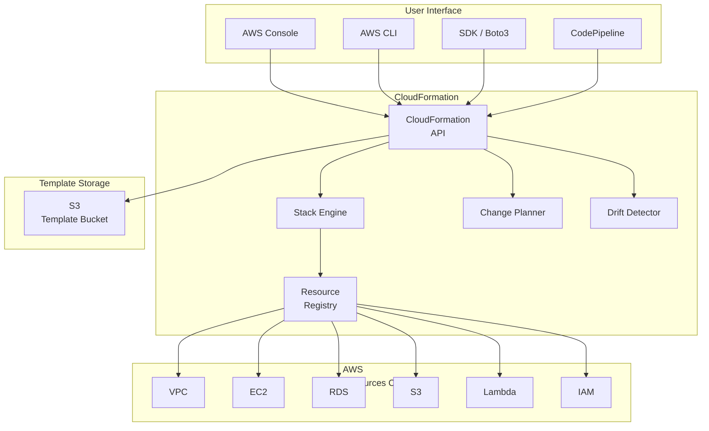
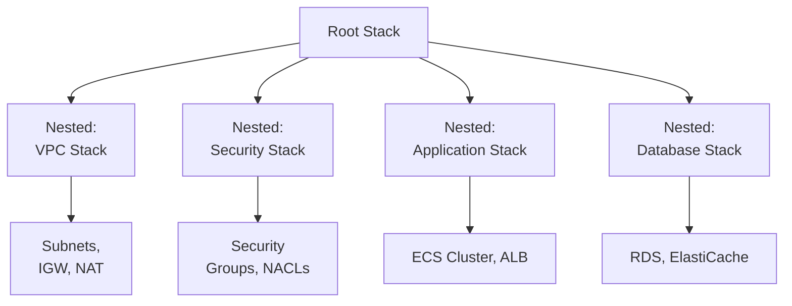
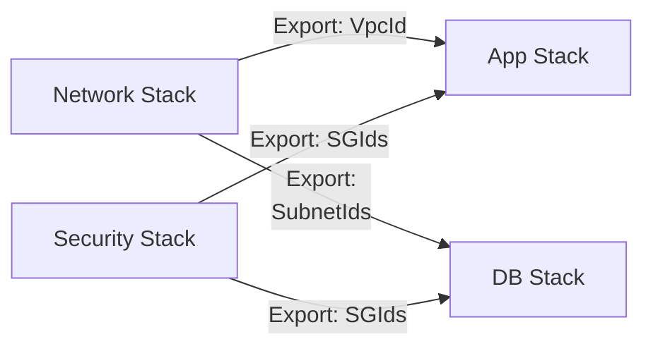
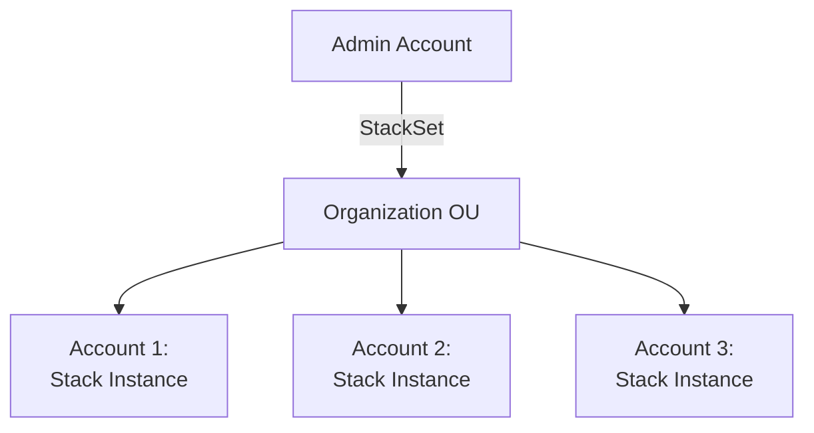

# Chapter 21: AWS CloudFormation — Infrastructure as Code

---

## 1. Service Overview

AWS CloudFormation is a fully managed Infrastructure as Code (IaC) service that lets you model, provision, and manage AWS resources by writing templates in JSON or YAML. You define what resources you need, and CloudFormation handles the creation, update, and deletion of those resources in a safe, predictable, and repeatable manner.

### Why CloudFormation Exists

Without IaC, infrastructure is created manually through the AWS Console — a slow, error-prone, and undocumented process. CloudFormation treats infrastructure as code: version-controlled, peer-reviewed, tested, and automatically deployed. The same template creates identical infrastructure every time, in any region, in any account.

### Key Characteristics

- **Declarative**: You describe WHAT you want, not HOW to create it
- **Fully Managed**: CloudFormation handles resource ordering, dependencies, and error rollback
- **Free**: You only pay for the resources created (CloudFormation itself is free)
- **Multi-Region**: Deploy the same template across any AWS region
- **Drift Detection**: Detect when resources have been manually modified
- **Change Sets**: Preview changes before applying them
- **StackSets**: Deploy stacks across multiple accounts and regions simultaneously
- **Nested Stacks**: Modularize templates for reuse
- **Custom Resources**: Extend CloudFormation with Lambda-backed custom logic
- **Registry**: Access third-party and custom resource types

---

## 2. Learning Objectives

By the end of this chapter, you will be able to:

- **Explain** Infrastructure as Code principles and CloudFormation's role
- **Write** CloudFormation templates in YAML with Parameters, Mappings, Conditions, Resources, and Outputs
- **Use** intrinsic functions (`!Ref`, `!Sub`, `!If`, `!GetAtt`, `!Join`, `!Select`, etc.)
- **Implement** change sets for safe infrastructure updates
- **Configure** stack policies to prevent accidental resource deletion
- **Use** StackSets for multi-account and multi-region deployments
- **Implement** nested stacks for template modularization
- **Create** custom resources with Lambda for non-CloudFormation resources
- **Troubleshoot** stack failures, rollback errors, and dependency issues
- **Integrate** CloudFormation with CI/CD pipelines (CodePipeline, GitHub Actions)

---

## 3. Prerequisites

- **AWS Account** with admin or PowerUser access
- **AWS CLI v2** installed and configured
- **Completed chapters**: Chapter 1 (IAM), Chapter 4 (VPC)
- **Concepts**: YAML/JSON syntax, AWS resource types, networking basics
- **Recommended**: Chapter 20 (CodePipeline) for CI/CD integration

---

## 4. Real-world Analogy

Think of CloudFormation as an **architectural blueprint** for a building.

Without a blueprint, builders construct the building ad-hoc — each builder does things differently, rooms end up different sizes, and there is no documentation of what was built. With a blueprint (template), the building is constructed identically every time: same rooms, same wiring, same plumbing, in any city (region).

**Extended analogy**:
- **Template** = The architectural blueprint
- **Stack** = The actual building constructed from the blueprint
- **Parameters** = Customizable options (3 bedrooms or 4? Marble or granite?)
- **Change Set** = Proposed renovation plan reviewed before construction begins
- **Rollback** = If the renovation fails, restore the building to its previous state
- **StackSet** = Build identical buildings in 10 cities simultaneously
- **Nested Stacks** = Separate blueprints for plumbing, electrical, and HVAC that combine into the master plan
- **Drift Detection** = Inspector checking if someone modified the building without updating the blueprint

---

## 5. Business Use Cases

### Infrastructure Standardization
- **Enterprise Landing Zones**: Standardized VPC, IAM, and security configurations across accounts
- **Development Environments**: Spin up identical dev/staging/prod environments from templates
- **Compliance**: Enforce approved resource configurations via vetted templates

### Automated Deployment
- **CI/CD Pipelines**: CodePipeline deploys application infrastructure via CloudFormation
- **Service Catalog**: Approved CloudFormation templates available for self-service provisioning
- **Multi-Region DR**: Deploy identical infrastructure in DR region via StackSets

### Cost Management
- **Environment Teardown**: Delete entire stacks to stop billing (dev environments after hours)
- **Tagging Enforcement**: Templates enforce consistent tagging for cost allocation
- **Right-Sizing**: Template parameters allow environment-specific instance sizes

### Governance & Compliance
- **Change Management**: All infrastructure changes go through version control and review
- **Audit Trail**: CloudTrail records all CloudFormation API calls
- **Drift Detection**: Detect unauthorized manual changes to infrastructure

---

## 6. Core Concepts

### Template

A JSON or YAML file that describes AWS resources. Template sections:

```yaml
AWSTemplateFormatVersion: '2010-09-09'
Description: 'My application infrastructure'

Parameters:        # Input values (customization)
  Environment:
    Type: String
    AllowedValues: [dev, staging, production]

Mappings:          # Static lookup tables
  RegionAMI:
    us-east-1:
      HVM64: ami-0abcdef1234567890

Conditions:        # Conditional resource creation
  IsProduction: !Equals [!Ref Environment, production]

Resources:         # AWS resources to create (REQUIRED)
  MyInstance:
    Type: AWS::EC2::Instance
    Properties:
      InstanceType: !If [IsProduction, m5.large, t3.micro]
      ImageId: !FindInMap [RegionAMI, !Ref 'AWS::Region', HVM64]

Outputs:           # Values to export
  InstanceId:
    Value: !Ref MyInstance
    Export:
      Name: !Sub '${Environment}-InstanceId'
```

### Stack

A collection of AWS resources managed as a single unit. Create a stack from a template. Update by modifying the template and applying changes. Delete the stack to remove all resources.

### Change Set

A preview of what CloudFormation will change when you update a stack. You can review additions, modifications, and deletions before executing.

### Intrinsic Functions

| Function | Purpose | Example |
|----------|---------|---------|
| `!Ref` | Reference a parameter or resource | `!Ref MyInstance` → Instance ID |
| `!GetAtt` | Get a resource attribute | `!GetAtt MyInstance.PublicIp` |
| `!Sub` | String substitution | `!Sub '${AWS::StackName}-vpc'` |
| `!Join` | Join strings with delimiter | `!Join ['-', [!Ref Env, 'vpc']]` |
| `!Select` | Select item from list | `!Select [0, !GetAZs '']` |
| `!Split` | Split string into list | `!Split [',', 'a,b,c']` |
| `!If` | Conditional value | `!If [IsProduction, m5.large, t3.micro]` |
| `!Equals` | Equality test | `!Equals [!Ref Env, production]` |
| `!FindInMap` | Lookup from Mappings | `!FindInMap [AMIMap, !Ref Region, HVM]` |
| `!ImportValue` | Import from another stack's Output | `!ImportValue 'prod-VpcId'` |
| `!GetAZs` | Get AZs for a region | `!GetAZs ''` |
| `!Cidr` | Generate CIDR blocks | `!Cidr [!Ref VpcCidr, 6, 8]` |

### Stack Policy

Prevents accidental updates or deletions of critical resources:

```json
{
  "Statement": [
    {
      "Effect": "Deny",
      "Action": "Update:Replace",
      "Principal": "*",
      "Resource": "LogicalResourceId/ProductionDatabase"
    },
    {
      "Effect": "Allow",
      "Action": "Update:*",
      "Principal": "*",
      "Resource": "*"
    }
  ]
}
```

### DependsOn

Explicitly declare dependencies between resources:

```yaml
MyEC2Instance:
  Type: AWS::EC2::Instance
  DependsOn: MyRDSInstance  # EC2 created AFTER RDS
```

CloudFormation usually infers dependencies automatically from `!Ref` and `!GetAtt`.

---

## 7. Internal Architecture



### How CloudFormation Works Internally

1. User uploads template (directly or via S3)
2. CloudFormation **validates** the template syntax
3. For updates, the **Change Planner** generates a change set
4. The **Stack Engine** determines resource ordering based on dependencies
5. Resources are created/updated/deleted in dependency order
6. If a resource fails, CloudFormation **rolls back** all changes
7. Stack status is updated: `CREATE_COMPLETE`, `UPDATE_COMPLETE`, or `*_FAILED`

---

## 8. Service Components

### Template
The blueprint file (YAML or JSON) defining resources and their configurations.

### Stack
A running instance of a template. Contains all provisioned resources and their current state.

### StackSet
Deploys stacks across multiple accounts and regions from a single template. Managed from a central administrator account.

### Change Set
A proposal of changes that will be applied when a stack is updated. Must be explicitly executed.

### Nested Stack
A stack created as a resource within another stack. Enables template modularization.

### Custom Resource
A Lambda function invoked by CloudFormation to manage resources not natively supported.

### Resource Type
The CloudFormation specification for an AWS service (e.g., `AWS::EC2::Instance`, `AWS::S3::Bucket`).

### Macro
A Lambda function that transforms template content during processing (e.g., `AWS::Serverless-2016-10-31` transform for SAM).

---

## 9. Configuration

### Stack Creation Parameters

```bash
aws cloudformation create-stack \
  --stack-name my-app-production \
  --template-body file://template.yaml \
  --parameters \
    ParameterKey=Environment,ParameterValue=production \
    ParameterKey=InstanceType,ParameterValue=m5.large \
  --capabilities CAPABILITY_IAM CAPABILITY_NAMED_IAM \
  --tags \
    Key=Environment,Value=production \
    Key=Team,Value=platform \
  --stack-policy-body file://stack-policy.json \
  --rollback-configuration \
    RollbackTriggers=[{Arn=arn:aws:cloudwatch:us-east-1:123456789012:alarm:HighErrors,Type=AWS::CloudWatch::Alarm}] \
  --on-failure ROLLBACK \
  --timeout-in-minutes 30
```

### Template Validation

```bash
# Validate template syntax
aws cloudformation validate-template \
  --template-body file://template.yaml

# Lint with cfn-lint
cfn-lint template.yaml

# Security scan with cfn-nag
cfn_nag_scan --input-path template.yaml
```

---

## 10. Code Examples

### Complete VPC + EC2 Template (YAML)

```yaml
AWSTemplateFormatVersion: '2010-09-09'
Description: Production VPC with EC2 Auto Scaling Group

Parameters:
  Environment:
    Type: String
    Default: production
    AllowedValues: [dev, staging, production]
  VpcCidr:
    Type: String
    Default: '10.0.0.0/16'
  InstanceType:
    Type: String
    Default: t3.micro
    AllowedValues: [t3.micro, t3.small, t3.medium, m5.large]
  KeyPairName:
    Type: AWS::EC2::KeyPair::KeyName
    Description: EC2 Key Pair for SSH access
  LatestAmiId:
    Type: AWS::SSM::Parameter::Value<AWS::EC2::Image::Id>
    Default: /aws/service/ami-amazon-linux-latest/amzn2-ami-hvm-x86_64-gp2

Conditions:
  IsProduction: !Equals [!Ref Environment, production]

Resources:
  # --- VPC ---
  VPC:
    Type: AWS::EC2::VPC
    Properties:
      CidrBlock: !Ref VpcCidr
      EnableDnsSupport: true
      EnableDnsHostnames: true
      Tags:
        - Key: Name
          Value: !Sub '${Environment}-vpc'

  PublicSubnet1:
    Type: AWS::EC2::Subnet
    Properties:
      VpcId: !Ref VPC
      CidrBlock: !Select [0, !Cidr [!Ref VpcCidr, 4, 8]]
      AvailabilityZone: !Select [0, !GetAZs '']
      MapPublicIpOnLaunch: true
      Tags:
        - Key: Name
          Value: !Sub '${Environment}-public-1'

  PublicSubnet2:
    Type: AWS::EC2::Subnet
    Properties:
      VpcId: !Ref VPC
      CidrBlock: !Select [1, !Cidr [!Ref VpcCidr, 4, 8]]
      AvailabilityZone: !Select [1, !GetAZs '']
      MapPublicIpOnLaunch: true
      Tags:
        - Key: Name
          Value: !Sub '${Environment}-public-2'

  InternetGateway:
    Type: AWS::EC2::InternetGateway

  IGWAttachment:
    Type: AWS::EC2::VPCGatewayAttachment
    Properties:
      VpcId: !Ref VPC
      InternetGatewayId: !Ref InternetGateway

  PublicRouteTable:
    Type: AWS::EC2::RouteTable
    Properties:
      VpcId: !Ref VPC

  PublicRoute:
    Type: AWS::EC2::Route
    DependsOn: IGWAttachment
    Properties:
      RouteTableId: !Ref PublicRouteTable
      DestinationCidrBlock: '0.0.0.0/0'
      GatewayId: !Ref InternetGateway

  Subnet1RouteAssoc:
    Type: AWS::EC2::SubnetRouteTableAssociation
    Properties:
      SubnetId: !Ref PublicSubnet1
      RouteTableId: !Ref PublicRouteTable

  Subnet2RouteAssoc:
    Type: AWS::EC2::SubnetRouteTableAssociation
    Properties:
      SubnetId: !Ref PublicSubnet2
      RouteTableId: !Ref PublicRouteTable

  # --- Security Group ---
  WebSG:
    Type: AWS::EC2::SecurityGroup
    Properties:
      GroupDescription: Web server security group
      VpcId: !Ref VPC
      SecurityGroupIngress:
        - IpProtocol: tcp
          FromPort: 80
          ToPort: 80
          CidrIp: '0.0.0.0/0'
        - IpProtocol: tcp
          FromPort: 443
          ToPort: 443
          CidrIp: '0.0.0.0/0'

  # --- Launch Template ---
  LaunchTemplate:
    Type: AWS::EC2::LaunchTemplate
    Properties:
      LaunchTemplateData:
        ImageId: !Ref LatestAmiId
        InstanceType: !Ref InstanceType
        KeyName: !Ref KeyPairName
        SecurityGroupIds:
          - !Ref WebSG
        UserData:
          Fn::Base64: !Sub |
            #!/bin/bash
            yum update -y
            yum install -y httpd
            systemctl start httpd
            systemctl enable httpd
            echo "<h1>Hello from ${Environment}</h1>" > /var/www/html/index.html

  # --- Auto Scaling Group ---
  ASG:
    Type: AWS::AutoScaling::AutoScalingGroup
    Properties:
      LaunchTemplate:
        LaunchTemplateId: !Ref LaunchTemplate
        Version: !GetAtt LaunchTemplate.LatestVersionNumber
      MinSize: !If [IsProduction, '2', '1']
      MaxSize: !If [IsProduction, '10', '2']
      DesiredCapacity: !If [IsProduction, '2', '1']
      VPCZoneIdentifier:
        - !Ref PublicSubnet1
        - !Ref PublicSubnet2
      Tags:
        - Key: Name
          Value: !Sub '${Environment}-web'
          PropagateAtLaunch: true

Outputs:
  VpcId:
    Value: !Ref VPC
    Export:
      Name: !Sub '${Environment}-VpcId'
  PublicSubnet1Id:
    Value: !Ref PublicSubnet1
    Export:
      Name: !Sub '${Environment}-PublicSubnet1'
  SecurityGroupId:
    Value: !Ref WebSG
    Export:
      Name: !Sub '${Environment}-WebSG'
```

### AWS CLI — Common Operations

```bash
# Create stack
aws cloudformation create-stack \
  --stack-name my-app \
  --template-body file://template.yaml \
  --parameters ParameterKey=Environment,ParameterValue=production \
  --capabilities CAPABILITY_IAM

# Create change set (preview updates)
aws cloudformation create-change-set \
  --stack-name my-app \
  --change-set-name update-instance-type \
  --template-body file://template.yaml \
  --parameters ParameterKey=InstanceType,ParameterValue=m5.large

# Describe change set
aws cloudformation describe-change-set \
  --stack-name my-app \
  --change-set-name update-instance-type

# Execute change set
aws cloudformation execute-change-set \
  --stack-name my-app \
  --change-set-name update-instance-type

# Deploy (create or update)
aws cloudformation deploy \
  --stack-name my-app \
  --template-file template.yaml \
  --parameter-overrides Environment=production InstanceType=m5.large \
  --capabilities CAPABILITY_IAM \
  --no-fail-on-empty-changeset

# Detect drift
aws cloudformation detect-stack-drift --stack-name my-app
aws cloudformation describe-stack-drift-detection-status \
  --stack-drift-detection-id detection-id

# List stacks
aws cloudformation list-stacks --stack-status-filter CREATE_COMPLETE UPDATE_COMPLETE

# Describe stack events (troubleshooting)
aws cloudformation describe-stack-events --stack-name my-app

# Delete stack
aws cloudformation delete-stack --stack-name my-app

# Wait for completion
aws cloudformation wait stack-create-complete --stack-name my-app
```

### Terraform (Managing CloudFormation Stacks)

```hcl
resource "aws_cloudformation_stack" "app" {
  name         = "my-app"
  template_body = file("${path.module}/template.yaml")
  capabilities = ["CAPABILITY_IAM"]

  parameters = {
    Environment  = "production"
    InstanceType = "m5.large"
  }

  tags = {
    ManagedBy = "terraform"
  }
}
```

### Python (Boto3) — Stack Management

```python
import boto3
import time

cfn = boto3.client('cloudformation', region_name='us-east-1')

# Create stack
with open('template.yaml', 'r') as f:
    template = f.read()

response = cfn.create_stack(
    StackName='my-app-production',
    TemplateBody=template,
    Parameters=[
        {'ParameterKey': 'Environment', 'ParameterValue': 'production'},
        {'ParameterKey': 'InstanceType', 'ParameterValue': 'm5.large'}
    ],
    Capabilities=['CAPABILITY_IAM', 'CAPABILITY_NAMED_IAM'],
    Tags=[
        {'Key': 'Environment', 'Value': 'production'},
        {'Key': 'Team', 'Value': 'platform'}
    ],
    OnFailure='ROLLBACK',
    TimeoutInMinutes=30
)
print(f"Stack creation initiated: {response['StackId']}")

# Wait for completion
waiter = cfn.get_waiter('stack_create_complete')
waiter.wait(StackName='my-app-production', WaiterConfig={'Delay': 10, 'MaxAttempts': 120})
print("Stack created successfully!")

# Get outputs
stack = cfn.describe_stacks(StackName='my-app-production')['Stacks'][0]
for output in stack.get('Outputs', []):
    print(f"  {output['OutputKey']}: {output['OutputValue']}")
```

---

## 11. Line-by-Line Explanation

### Template Resource Breakdown

```yaml
MyInstance:                              # Logical ID (referenced by !Ref)
  Type: AWS::EC2::Instance              # AWS resource type
  DependsOn: MyDatabase                 # Explicit dependency (optional)
  Condition: IsProduction               # Only create if condition is true
  Properties:                           # Resource configuration
    InstanceType: !If                   # Conditional value
      - IsProduction                    # If IsProduction condition is true
      - m5.large                        # Use m5.large
      - t3.micro                        # Otherwise use t3.micro
    ImageId: !FindInMap                 # Lookup from Mappings section
      - RegionAMI                       # Map name
      - !Ref 'AWS::Region'             # First key (current region)
      - HVM64                          # Second key
    SubnetId: !Ref PublicSubnet1       # Reference another resource's ID
    SecurityGroupIds:
      - !Ref WebSG                     # Reference security group
    Tags:
      - Key: Name
        Value: !Sub '${AWS::StackName}-web'  # String substitution with pseudo parameter
```

---

## 12. Security Deep Dive

### IAM Permissions for CloudFormation

```json
{
  "Version": "2012-10-17",
  "Statement": [
    {
      "Effect": "Allow",
      "Action": [
        "cloudformation:CreateStack",
        "cloudformation:UpdateStack",
        "cloudformation:DeleteStack",
        "cloudformation:DescribeStacks",
        "cloudformation:CreateChangeSet",
        "cloudformation:ExecuteChangeSet"
      ],
      "Resource": "arn:aws:cloudformation:us-east-1:123456789012:stack/my-app-*/*"
    },
    {
      "Effect": "Allow",
      "Action": "iam:PassRole",
      "Resource": "arn:aws:iam::123456789012:role/CloudFormationServiceRole"
    }
  ]
}
```

### Stack Policy (Prevent Accidental Deletion)

```json
{
  "Statement": [
    {
      "Effect": "Deny",
      "Action": ["Update:Replace", "Update:Delete"],
      "Principal": "*",
      "Resource": "LogicalResourceId/ProductionDatabase"
    },
    {
      "Effect": "Allow",
      "Action": "Update:*",
      "Principal": "*",
      "Resource": "*"
    }
  ]
}
```

### Security Best Practices
1. **Use CloudFormation service roles** — separate permissions for stack creation vs user permissions
2. **Enable termination protection** on production stacks
3. **Stack policies** to prevent accidental resource deletion
4. **Review change sets** before execution
5. **Use Secrets Manager references** for sensitive values (`{{resolve:secretsmanager:...}}`)
6. **Never hardcode credentials** in templates
7. **Use `cfn-nag`** for security scanning of templates

---

## 13. Monitoring & Observability

### CloudWatch Events for Stack Operations

```bash
aws events put-rule \
  --name "CFN-StackFailure" \
  --event-pattern '{
    "source": ["aws.cloudformation"],
    "detail-type": ["CloudFormation Stack Status Change"],
    "detail": {
      "status-details": {
        "status": ["CREATE_FAILED", "UPDATE_FAILED", "DELETE_FAILED", "ROLLBACK_COMPLETE"]
      }
    }
  }'
```

### Drift Detection

```bash
# Initiate drift detection
aws cloudformation detect-stack-drift --stack-name my-app

# Check drift status
aws cloudformation describe-stack-drift-detection-status \
  --stack-drift-detection-id detection-id

# Get drifted resources
aws cloudformation describe-stack-resource-drifts \
  --stack-name my-app \
  --stack-resource-drift-status-filters MODIFIED DELETED
```

---

## 14. Performance & Cost Optimization

### Cost Model

CloudFormation itself is **free**. You only pay for the resources it creates.

### Optimization Strategies

1. **Use `DeletionPolicy: Retain`** for resources that should survive stack deletion (databases, S3 buckets)
2. **Use `UpdateReplacePolicy: Retain`** for resources that should survive replacement
3. **Parameterize instance sizes** for different environments
4. **Use Conditions** to create resources only in specific environments
5. **Stack lifecycle management** — delete dev stacks outside business hours
6. **Use SSM Parameter Store** for AMI IDs (auto-updated)

### Stack Limits

| Limit | Value |
|-------|-------|
| Resources per stack | 500 |
| Outputs per stack | 200 |
| Parameters per stack | 200 |
| Mappings per template | 200 |
| Template size (S3) | 1 MB |
| Template size (inline) | 51,200 bytes |
| Stacks per account | 2,000 (soft limit) |

---

## 15. Enterprise Integration

### StackSets (Multi-Account/Multi-Region)

```bash
# Create StackSet
aws cloudformation create-stack-set \
  --stack-set-name SecurityBaseline \
  --template-body file://security-baseline.yaml \
  --capabilities CAPABILITY_NAMED_IAM \
  --permission-model SERVICE_MANAGED \
  --auto-deployment Enabled=true,RetainStacksOnAccountRemoval=false

# Deploy to target accounts
aws cloudformation create-stack-instances \
  --stack-set-name SecurityBaseline \
  --deployment-targets OrganizationalUnitIds=ou-12345 \
  --regions us-east-1 us-west-2 eu-west-1 \
  --operation-preferences MaxConcurrentPercentage=25,FailureTolerancePercentage=10
```

### Service Catalog Integration

Package CloudFormation templates as Service Catalog products. End users provision approved infrastructure through a self-service portal.

### AWS Organizations + StackSets

Deploy security baselines, networking, and compliance resources to all accounts automatically when new accounts are created.

---

## 16. Real Industry Use Cases

### Case 1: Netflix — Microservice Infrastructure Templates
**Problem**: Hundreds of development teams need to provision identical infrastructure for microservices.
**Solution**: Standardized CloudFormation templates for VPC, ECS, ALB, and monitoring. Teams customize via parameters.
**Result**: New microservice infrastructure provisioned in 15 minutes instead of 3 days.

### Case 2: Capital One — Compliance-as-Code
**Problem**: Every AWS account must comply with financial regulations (PCI-DSS, SOX).
**Solution**: StackSets deploy compliance baselines (CloudTrail, Config rules, GuardDuty) to every account via Organizations.
**Result**: 100% compliance coverage across 1,000+ accounts. New accounts auto-compliant within minutes.

### Case 3: NASA — Multi-Region Disaster Recovery
**Problem**: Mission-critical systems need identical infrastructure in primary and DR regions.
**Solution**: Same CloudFormation template deployed to us-east-1 (primary) and us-west-2 (DR). Automated via StackSets.
**Result**: RTO reduced from 4 hours to 30 minutes.

---

## 17. Architecture Patterns

### Pattern 1: Nested Stack Architecture



### Pattern 2: Cross-Stack References



### Pattern 3: StackSet Multi-Account



---

## 18. Production Incident War Room

### Incident 1: Stack Stuck in UPDATE_ROLLBACK_FAILED
**Severity**: P1 — Critical
**Symptoms**: Stack in `UPDATE_ROLLBACK_FAILED` state. Cannot update or delete.
**Root Cause**: During rollback, a resource that was deleted manually could not be recreated.
**CLI Diagnostic**:
```bash
aws cloudformation describe-stack-events --stack-name my-app \
  | jq '.StackEvents[] | select(.ResourceStatus | contains("FAILED"))'
```
**Immediate Mitigation**: Use `continue-update-rollback` with `--resources-to-skip` to skip the problematic resource.
```bash
aws cloudformation continue-update-rollback \
  --stack-name my-app \
  --resources-to-skip ManuallyDeletedResource
```
**Permanent Fix**: Never manually delete resources managed by CloudFormation. Use `DeletionPolicy: Retain` for resources that need independent lifecycle.

---

### Incident 2: Circular Dependency Error
**Severity**: P2 — High
**Symptoms**: Template validation fails with `Circular dependency between resources`.
**Root Cause**: Security Group A references Security Group B's ID, and Security Group B references Security Group A's ID.
**Permanent Fix**: Use `AWS::EC2::SecurityGroupIngress` as a separate resource to break the circular reference.

---

### Incident 3: Resource Limit Exceeded
**Severity**: P2 — High
**Symptoms**: Stack creation fails with `LimitExceeded` for a specific resource type.
**Root Cause**: Account limit for the resource type reached (e.g., 5 VPCs per region, 5 EIPs).
**Permanent Fix**: Request service quota increase. Use nested stacks to split resources across multiple stacks. Clean up unused resources.

---

### Incident 4: IAM Permission Error During Stack Creation
**Severity**: P2 — High
**Symptoms**: `CREATE_FAILED` with `User is not authorized to perform: iam:CreateRole`.
**Root Cause**: Missing `CAPABILITY_IAM` or `CAPABILITY_NAMED_IAM` in the create-stack call.
**Permanent Fix**: Add `--capabilities CAPABILITY_IAM CAPABILITY_NAMED_IAM` to the CLI command.

---

### Incident 5: Drift Detected on Production Stack
**Severity**: P2 — High
**Symptoms**: Drift detection shows 3 resources modified outside CloudFormation.
**Root Cause**: Operations team manually changed security group rules via console during an incident.
**Permanent Fix**: Import the manual changes into the template. Re-deploy to align template with actual state. Train team to use IaC for all changes.

---

### Incident 6: Stack Deletion Blocked by Non-Empty S3 Bucket
**Severity**: P3 — Medium
**Symptoms**: Stack deletion fails with `The bucket you tried to delete is not empty`.
**Root Cause**: S3 buckets must be empty before CloudFormation can delete them.
**Permanent Fix**: Use a Lambda-backed Custom Resource to empty the bucket before deletion. Or use `DeletionPolicy: Retain` and clean up manually.

---

### Incident 7: Nested Stack Update Timeout
**Severity**: P2 — High
**Symptoms**: Root stack stuck in `UPDATE_IN_PROGRESS` for hours.
**Root Cause**: Nested stack creating an RDS instance (which takes 15+ minutes). Root stack timeout too short.
**Permanent Fix**: Increase `TimeoutInMinutes`. Use `CreationPolicy` with `ResourceSignal` for resources that need time.

---

### Incident 8: Change Set Shows Replacement for Database
**Severity**: P1 — Critical
**Symptoms**: Change set preview shows RDS instance will be **replaced** (deleted and recreated).
**Root Cause**: Changed the `DBInstanceIdentifier` property, which requires replacement.
**Permanent Fix**: NEVER execute change sets without reviewing replacement operations. Use stack policies to deny `Update:Replace` on databases. Check AWS documentation for which property changes require replacement.

---

### Incident 9: Template Exceeds 51,200 Byte Limit
**Severity**: P3 — Medium
**Symptoms**: `create-stack` with `--template-body` fails with size limit error.
**Permanent Fix**: Upload template to S3 and use `--template-url`. Use nested stacks to split large templates.

---

### Incident 10: StackSet Deployment Stuck
**Severity**: P2 — High
**Symptoms**: StackSet instance deployment stuck in `RUNNING` for target account.
**Root Cause**: Target account IAM role for CloudFormation does not exist or has insufficient permissions.
**Permanent Fix**: Verify `AWSCloudFormationStackSetExecutionRole` exists in target accounts with correct trust policy.

---

### Incident 11: Cross-Stack Reference Preventing Deletion
**Severity**: P2 — High
**Symptoms**: Cannot delete Network Stack because Application Stack imports its VPC ID.
**Root Cause**: CloudFormation prevents deletion of stacks whose outputs are imported by other stacks.
**Permanent Fix**: Delete dependent stacks first, or remove the `!ImportValue` references. Plan dependency chains before implementing cross-stack references.

---

### Incident 12: Custom Resource Lambda Timeout
**Severity**: P2 — High
**Symptoms**: Stack stuck in `CREATE_IN_PROGRESS` for 1 hour, then fails.
**Root Cause**: Custom resource Lambda function threw an exception but did not send a response to CloudFormation. CloudFormation waited for the response until the 1-hour timeout.
**Permanent Fix**: Always wrap Lambda custom resource handlers in try/catch. Always send SUCCESS or FAILED response via the pre-signed URL. Use `cfnresponse` helper module.

---

### Incident 13: Rollback Trigger Alarm Causing Unexpected Rollbacks
**Severity**: P2 — High
**Symptoms**: Stack updates rolling back even though resources were created successfully.
**Root Cause**: A CloudWatch alarm configured as a rollback trigger fired during the update window due to unrelated high CPU.
**Permanent Fix**: Review rollback trigger alarms for specificity. Use deployment-specific metrics, not general health metrics.

---

### Incident 14: Import Resource Failing
**Severity**: P3 — Medium
**Symptoms**: `import-stack-to-stack` failing with `Resource already exists in another stack`.
**Root Cause**: The resource being imported is already managed by a different CloudFormation stack.
**Permanent Fix**: Remove the resource from the original stack first (using `DeletionPolicy: Retain`), then import into the new stack.

---

### Incident 15: Parameter Validation Rejecting Valid Input
**Severity**: P3 — Medium
**Symptoms**: Stack creation fails: `Parameter InstanceType must be one of [t3.micro, t3.small]`.
**Root Cause**: Template `AllowedValues` list did not include the new instance type being requested.
**Permanent Fix**: Update `AllowedValues` in the template. Use `AllowedPattern` with regex for more flexible validation. Or remove `AllowedValues` and validate in CI/CD pipeline.

---

## 19. Production Best Practices (Well-Architected)

### Operational Excellence
- **Version control all templates** in Git
- **Use change sets** — never direct update production stacks
- **Enable termination protection** on production stacks
- **Use stack policies** to protect critical resources
- **Tag all stacks** for cost allocation and governance
- **Drift detection** on a regular schedule

### Security
- **Use service roles** for CloudFormation (separate from user roles)
- **Never hardcode secrets** — use `{{resolve:secretsmanager:...}}`
- **Scan templates** with cfn-nag, checkov, or cfn-lint
- **Audit with CloudTrail**

### Reliability
- **Use `DeletionPolicy: Snapshot`** for databases
- **Configure rollback triggers** with CloudWatch alarms
- **Test templates** in dev before production
- **Use nested stacks** for modular, reusable infrastructure

### Cost
- **Parameterize instance sizes** per environment
- **Use Conditions** to skip resources in dev
- **Delete dev stacks** after hours
- **Monitor stack resource costs** via tags

---

## 20. Migration Strategies

### From Manual Console to CloudFormation
1. **Document existing resources** (VPC, subnets, SGs, EC2, RDS, etc.)
2. **Use `cloudformation import`** to bring existing resources under CloudFormation management
3. **Write templates** matching the current configuration
4. **Import resources** into a new stack
5. **Verify drift** shows zero differences

### From Terraform to CloudFormation
Consider CloudFormation when: deep AWS-native integration needed, StackSets for multi-account, Service Catalog, or tight CodePipeline integration.

### From CloudFormation to CDK
CDK generates CloudFormation templates from TypeScript/Python code. Migrate incrementally by wrapping existing templates with `CfnInclude`.

---

## 21. CI/CD Integration

### CodePipeline + CloudFormation

```yaml
# Pipeline Deploy stage with Change Set review
- Name: CreateChangeSet
  ActionTypeId:
    Category: Deploy
    Provider: CloudFormation
  Configuration:
    ActionMode: CHANGE_SET_REPLACE
    StackName: my-app
    ChangeSetName: pipeline-changeset
    TemplatePath: BuildOutput::template.yaml
    Capabilities: CAPABILITY_IAM

- Name: ApproveChangeSet
  ActionTypeId:
    Category: Approval
    Provider: Manual

- Name: ExecuteChangeSet
  ActionTypeId:
    Category: Deploy
    Provider: CloudFormation
  Configuration:
    ActionMode: CHANGE_SET_EXECUTE
    StackName: my-app
    ChangeSetName: pipeline-changeset
```

---

## 22. Practical Projects

### Beginner Project: Basic AWS CloudFormation Deployment
- **Business Requirement**: Deploy baseline AWS CloudFormation resources securely.
- **Architecture**: Single-region deployment with default VPC subnets and restricted IAM roles.
- **Implementation**: Write a Terraform `main.tf` to provision AWS CloudFormation and apply the configuration. Verify resource creation in the AWS Console.

### Intermediate Project: Multi-AZ Scalable AWS CloudFormation Setup
- **Business Requirement**: Implement high availability and automated scaling for AWS CloudFormation to withstand Availability Zone failures.
- **Architecture**: Application Load Balancer -> Auto Scaling Group -> AWS CloudFormation -> KMS Encrypted Persistence Layer.
- **Implementation**: Configure scaling policies based on CPU utilization and set up CloudWatch Alarms for monitoring metrics.

### Advanced Project: Automated CI/CD Pipeline Integration
- **Business Requirement**: Automate the deployment and testing of AWS CloudFormation infrastructure without manual intervention.
- **Architecture**: GitHub Repository -> AWS CodePipeline -> AWS CodeBuild -> Deployment to AWS CloudFormation Targets.
- **Implementation**: Write a `buildspec.yml` to run automated security linting (e.g., tfsec or Checkov) before deploying the AWS CloudFormation changes.

### Enterprise Project: Zero-Trust Multi-Account Architecture
- **Business Requirement**: Deploy a production-grade multi-account enterprise environment utilizing AWS CloudFormation with centralized security governance.
- **Architecture**: AWS Organizations -> AWS Transit Gateway -> Hub-and-Spoke VPCs -> Multi-AZ AWS CloudFormation -> AWS IAM Identity Center SSO.
- **Implementation**: Implement Service Control Policies (SCPs) to restrict AWS CloudFormation deployments to approved regions and mandate AWS KMS customer-managed keys (CMKs) for all data at rest.

---

## 23. Interview Preparation

### Beginner
**Q1**: What is CloudFormation?
**A**: An IaC service that provisions AWS resources from declarative templates (YAML/JSON). You define what you want; CloudFormation handles how.

**Q2**: What is a stack?
**A**: A collection of AWS resources created and managed as a single unit from a CloudFormation template.

### Intermediate
**Q3**: What is a change set?
**A**: A preview of proposed changes to a stack. You review additions, modifications, and replacements before executing. Critical for production safety.

**Q4**: How do you handle resources that should not be deleted when the stack is deleted?
**A**: Use `DeletionPolicy: Retain`. For databases, use `DeletionPolicy: Snapshot` to create a final snapshot.

### Advanced
**Q5**: Explain cross-stack references vs nested stacks.
**A**: Cross-stack: Independent stacks sharing values via `Export`/`ImportValue`. Loose coupling but deletion dependency. Nested stacks: Child stacks managed as resources within a parent. Tighter coupling, single deployment unit. Use cross-stack for shared infrastructure (VPC), nested stacks for application components.

**Q6**: How do you manage drift in production?
**A**: Regular drift detection (scheduled Lambda). Automated alerts on drift. Import manual changes back into templates. Enforce IaC-only changes via SCP/IAM restrictions on console access.

---

## 24. AWS Certification Practice

**Q1**: Which CloudFormation feature lets you preview changes before updating a stack?
- A) Stack policy
- **B) Change set** ✓
- C) Drift detection
- D) Rollback trigger

**Q2**: A company needs to deploy the same CloudFormation template to 50 AWS accounts. Which feature should they use?
- A) Nested stacks
- B) Cross-stack references
- **C) StackSets** ✓
- D) Service Catalog

---

## 25. Knowledge Check

1. **What template sections are required?** Only `Resources` is required.
2. **What does `!Ref` return for an EC2 instance?** The Instance ID.
3. **What does `DeletionPolicy: Retain` do?** Keeps the resource when the stack is deleted.
4. **What is the max template size via S3?** 1 MB.
5. **What is a StackSet?** Deploys stacks across multiple accounts and regions.
6. **How do you break a circular dependency?** Use separate resource types (e.g., `SecurityGroupIngress`).
7. **What are the two capability acknowledgments?** `CAPABILITY_IAM` and `CAPABILITY_NAMED_IAM`.

---

## 26. Cheat Sheet

| Item | Detail |
|------|--------|
| **Service** | AWS CloudFormation |
| **Type** | Infrastructure as Code |
| **Cost** | Free (pay for resources created) |
| **Template Format** | YAML or JSON |
| **Required Section** | Resources |
| **Max Resources/Stack** | 500 |
| **Max Template Size (S3)** | 1 MB |
| **Key Functions** | `!Ref`, `!Sub`, `!GetAtt`, `!If`, `!FindInMap` |
| **Change Sets** | Preview changes before applying |
| **StackSets** | Multi-account/multi-region deployment |
| **Drift Detection** | Detect manual changes |
| **Key CLI** | `create-stack`, `deploy`, `create-change-set`, `detect-stack-drift` |

---

## 27. Chapter Summary

AWS CloudFormation is the foundation of Infrastructure as Code on AWS. Key takeaways:

- **Declarative templates** define what resources to create
- **Stacks** manage resources as a single unit
- **Change sets** preview updates before execution — always use in production
- **StackSets** deploy across accounts and regions at scale
- **Nested stacks** modularize complex templates
- **Stack policies** protect critical resources from accidental changes
- **Drift detection** identifies manual modifications
- **Custom resources** extend CloudFormation with Lambda-backed logic
- **Version control templates** in Git with CI/CD pipelines
- **Free to use** — you only pay for provisioned resources

---

## 28. Further Learning

### AWS Documentation
- [CloudFormation User Guide](https://docs.aws.amazon.com/AWSCloudFormation/latest/UserGuide/)
- [Resource Type Reference](https://docs.aws.amazon.com/AWSCloudFormation/latest/UserGuide/aws-template-resource-type-ref.html)
- [Intrinsic Function Reference](https://docs.aws.amazon.com/AWSCloudFormation/latest/UserGuide/intrinsic-function-reference.html)
- [StackSets](https://docs.aws.amazon.com/AWSCloudFormation/latest/UserGuide/what-is-cfnstacksets.html)

### Tools
- **cfn-lint**: Template linter
- **cfn-nag**: Security scanner
- **checkov**: Policy-as-code scanner
- **former2**: Generate templates from existing resources
- **rain**: CloudFormation CLI tool (enhanced experience)

### Related Chapters
- **Chapter 20 — AWS CodePipeline**: CI/CD pipeline orchestration
- **Chapter 1 — AWS IAM**: Permissions for CloudFormation
- **Chapter 4 — Amazon VPC**: Network infrastructure templates
