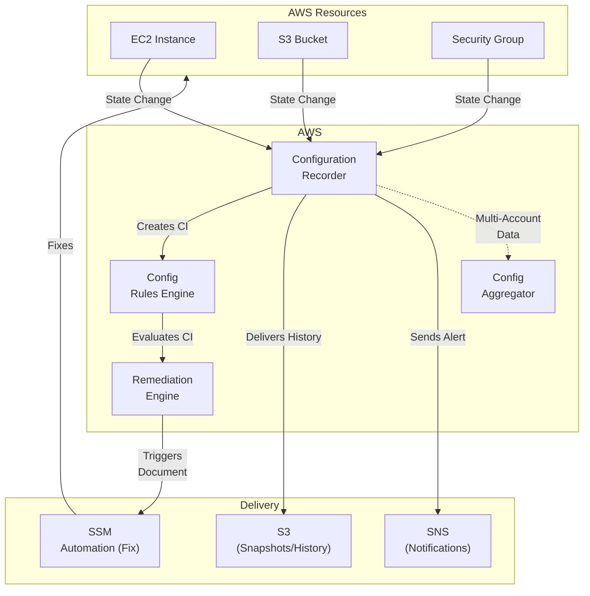
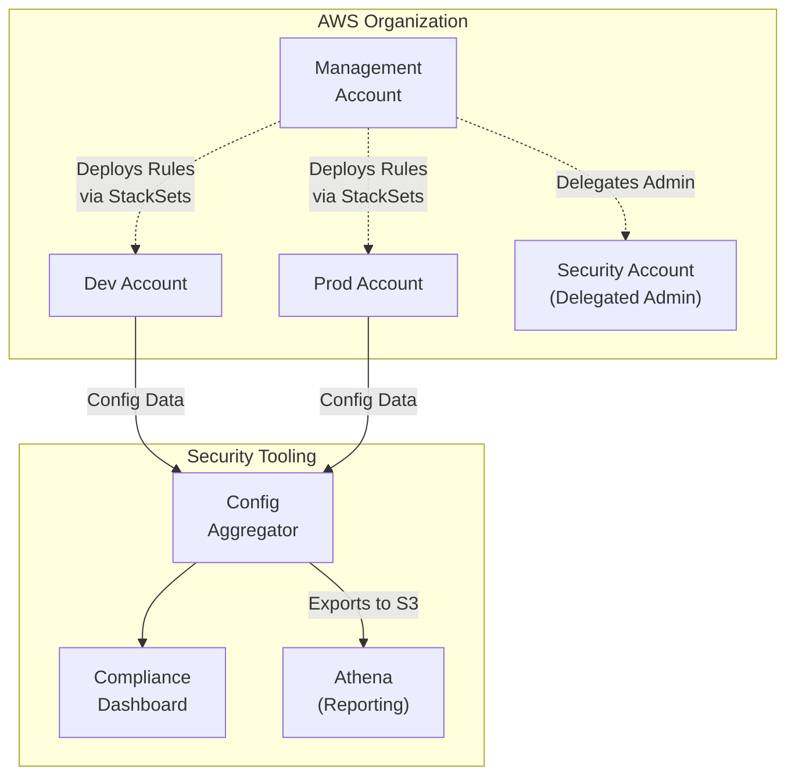
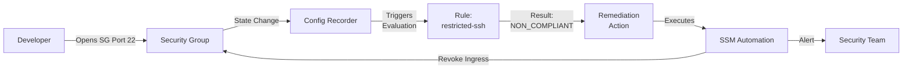

# Chapter 27: AWS Config — Configuration Management and Compliance

---

## 1. Service Overview

AWS Config is a fully managed service that enables you to assess, audit, and evaluate the configurations of your AWS resources. It continuously monitors and records your AWS resource configurations and allows you to automate the evaluation of recorded configurations against desired configurations.

### Why AWS Config Exists

As your AWS environment grows, managing the configuration of thousands of resources becomes impossible manually. Did someone open SSH to the world? Are all EBS volumes encrypted? Do all instances have the correct cost allocation tags? AWS Config acts as your continuous compliance engine, automatically detecting configuration drift and non-compliant resources.

### Key Characteristics

- **Continuous Monitoring**: Automatically records configuration changes as they occur.
- **Resource Inventory**: Maintains a complete history of resource configurations and relationships.
- **Compliance Rules**: Evaluate resource configurations against AWS managed rules or custom Lambda rules.
- **Auto-Remediation**: Can automatically trigger Systems Manager (SSM) documents to fix non-compliant resources.
- **Multi-Account/Region**: Centralize compliance data across your entire AWS Organization using Aggregators.
- **Conformance Packs**: Deploy collections of rules and remediation actions mapped to compliance frameworks (like PCI-DSS, HIPAA).

---

## 2. Learning Objectives

By the end of this chapter, you will be able to:

- **Explain** the purpose of AWS Config and how it differs from CloudTrail
- **Configure** the Configuration Recorder and Delivery Channel
- **Deploy** and manage AWS Config Rules (Managed and Custom)
- **Implement** auto-remediation for non-compliant resources
- **Use** Conformance Packs to establish compliance baselines
- **Centralize** compliance monitoring using AWS Config Aggregators and AWS Organizations
- **Query** the resource inventory using Advanced Data Queries (SQL)
- **Design** an enterprise compliance-as-code architecture
- **Troubleshoot** failing Config rules and remediation actions

---

## 3. Prerequisites

- **AWS Account** with admin access
- **Completed chapters**: Chapter 1 (IAM), Chapter 25 (Systems Manager), Chapter 26 (CloudTrail)
- **Concepts**: JSON, basic compliance frameworks, event-driven architectures
- **Recommended**: AWS Organizations knowledge for multi-account setup

---

## 4. Real-world Analogy

Think of AWS Config as a **building inspector and blueprint archivist**.

- **Configuration Recorder (Archivist)**: Takes a picture of a room every time someone changes the furniture, moves a wall, or rewires the electricity. It keeps a historical timeline of exactly how the room looked at any given second in the past.
- **Config Rules (Inspector)**: The building inspector has a checklist (e.g., "All doors must have fire exits", "No exposed wires"). Every time the archivist takes a new picture, the inspector immediately compares the new room layout against the checklist.
- **Auto-Remediation (Contractor)**: If the inspector finds an exposed wire (non-compliant), they automatically dispatch a contractor to cap the wire and fix the violation.

---

## 5. Business Use Cases

### Compliance Auditing
- **Regulatory Frameworks**: Continuously proving compliance with HIPAA, PCI-DSS, SOC 2, or FedRAMP using pre-built Conformance Packs.
- **Internal Policies**: Enforcing corporate policies (e.g., "All resources must have a 'CostCenter' tag", "No public S3 buckets").

### Security and Governance
- **Vulnerability Management**: Detecting unrestricted Security Groups, unencrypted EBS volumes, or missing MFA for IAM users.
- **Automated Remediation**: Automatically encrypting unencrypted volumes or terminating instances launched outside of approved regions.

### Change Management and Troubleshooting
- **Configuration Timeline**: Discovering what changed right before an application outage ("Did someone modify the Route 53 record yesterday at 2 PM?").
- **Resource Discovery**: Querying exactly how many `m5.large` instances exist across all 50 AWS accounts in the organization.

---

## 6. Core Concepts

### Configuration Items (CIs)
A point-in-time representation of the various attributes of an AWS resource. Whenever a resource changes, Config creates a new CI representing the new state.

### Configuration Recorder
The core engine of AWS Config. It detects changes in resource configurations and captures them as Configuration Items.

### Delivery Channel
The destination where AWS Config delivers configuration snapshots and history files (an S3 bucket) and configuration change notifications (an SNS topic).

### Config Rules
Logic that evaluates whether a resource complies with desired configurations.
- **AWS Managed Rules**: Pre-built rules maintained by AWS (e.g., `encrypted-volumes`, `s3-bucket-public-read-prohibited`).
- **Custom Rules**: Your own logic written in an AWS Lambda function or deployed via Guard.

### Evaluation Triggers
- **Configuration Changes**: The rule evaluates a resource only when its configuration changes (event-driven).
- **Periodic**: The rule evaluates all applicable resources at a set frequency (e.g., every 24 hours).

### Conformance Packs
A collection of AWS Config rules and remediation actions that can be easily deployed as a single entity in an account or across an entire AWS Organization.

### Aggregator
A feature that allows you to collect AWS Config data from multiple AWS accounts and multiple regions into a single, centralized view.

---

## 7. Internal Architecture



---

## 8. Service Components

### Resource Inventory & Relationships
AWS Config doesn't just track single resources; it maps relationships. E.g., it knows an EC2 instance is attached to an EBS volume and resides in a specific Subnet, which is in a specific VPC.

### Advanced Data Queries
A SQL-based query engine that allows you to search the current configuration state of your AWS resources based on properties and tags.

### Remediation Actions
Uses AWS Systems Manager (SSM) Automation documents to automatically or manually fix non-compliant resources. For example, if a rule flags an unencrypted RDS instance, the remediation action can trigger an SSM document to snapshot, encrypt, and restore the instance.

### Multi-Account Multi-Region Data Aggregation
The Aggregator collects compliance status and resource configurations from source accounts (or an entire AWS Organization) and displays them in the delegated administrator account.

---

## 9. Configuration

### S3 Bucket Policy for AWS Config

To allow AWS Config to deliver history files to an S3 bucket:

```json
{
  "Version": "2012-10-17",
  "Statement": [
    {
      "Sid": "AWSConfigBucketPermissionsCheck",
      "Effect": "Allow",
      "Principal": {
        "Service": "config.amazonaws.com"
      },
      "Action": "s3:GetBucketAcl",
      "Resource": "arn:aws:s3:::my-config-history-bucket"
    },
    {
      "Sid": "AWSConfigBucketDelivery",
      "Effect": "Allow",
      "Principal": {
        "Service": "config.amazonaws.com"
      },
      "Action": "s3:PutObject",
      "Resource": "arn:aws:s3:::my-config-history-bucket/AWSLogs/123456789012/Config/*",
      "Condition": {
        "StringEquals": {
          "s3:x-amz-acl": "bucket-owner-full-control"
        }
      }
    }
  ]
}
```

---

## 10. Code Examples

### AWS CLI — Common Operations

```bash
# Start the configuration recorder
aws configservice start-configuration-recorder \
    --configuration-recorder-name default

# Put a Managed Rule (e.g., check if S3 buckets are public)
aws configservice put-config-rule \
    --config-rule '{
        "ConfigRuleName": "s3-bucket-public-read-prohibited",
        "Source": {
            "Owner": "AWS",
            "SourceIdentifier": "S3_BUCKET_PUBLIC_READ_PROHIBITED"
        },
        "Scope": {
            "ComplianceResourceTypes": ["AWS::S3::Bucket"]
        }
    }'

# Get resource configuration history
aws configservice get-resource-config-history \
    --resource-type AWS::EC2::Instance \
    --resource-id i-0123456789abcdef0

# Run an Advanced Data Query (SQL)
aws configservice select-resource-config \
    --expression "SELECT accountId, resourceType, resourceId WHERE resourceType = 'AWS::EC2::Instance' AND configuration.instanceType = 't2.micro'"
```

### Terraform — Enable AWS Config and Deploy a Rule

```hcl
# IAM Role for AWS Config
resource "aws_iam_role" "config_role" {
  name = "awsconfig-role"
  assume_role_policy = jsonencode({
    Version = "2012-10-17"
    Statement = [{
      Action = "sts:AssumeRole"
      Effect = "Allow"
      Principal = { Service = "config.amazonaws.com" }
    }]
  })
}

resource "aws_iam_role_policy_attachment" "config_policy" {
  role       = aws_iam_role.config_role.name
  policy_arn = "arn:aws:iam::aws:policy/service-role/AWS_ConfigRole"
}

# Configuration Recorder
resource "aws_config_configuration_recorder" "main" {
  name     = "default"
  role_arn = aws_iam_role.config_role.arn

  recording_group {
    all_supported                 = true
    include_global_resource_types = true
  }
}

# Delivery Channel
resource "aws_config_delivery_channel" "main" {
  name           = "default"
  s3_bucket_name = aws_s3_bucket.config_bucket.id
  depends_on     = [aws_config_configuration_recorder.main]
}

# Turn on recording
resource "aws_config_configuration_recorder_status" "main" {
  name       = aws_config_configuration_recorder.main.name
  is_enabled = true
  depends_on = [aws_config_delivery_channel.main]
}

# Config Rule: Require Encrypted EBS Volumes
resource "aws_config_config_rule" "encrypted_volumes" {
  name = "encrypted-volumes"
  source {
    owner             = "AWS"
    source_identifier = "ENCRYPTED_VOLUMES"
  }
  depends_on = [aws_config_configuration_recorder.main]
}
```

### Python (Boto3) — Custom Rule Lambda Function

This custom rule checks if an EC2 instance has a specific tag.

```python
import json
import boto3

def lambda_handler(event, context):
    invoking_event = json.loads(event['invokingEvent'])
    configuration_item = invoking_event['configurationItem']
    
    # Check if the resource was deleted
    if configuration_item['configurationItemStatus'] == 'ResourceDeleted':
        return evaluate_compliance(event, 'NOT_APPLICABLE')

    # Get resource tags
    tags = configuration_item.get('tags', {})
    
    # Check for 'CostCenter' tag
    if 'CostCenter' in tags:
        compliance_type = 'COMPLIANT'
    else:
        compliance_type = 'NON_COMPLIANT'
        
    return evaluate_compliance(event, compliance_type)

def evaluate_compliance(event, compliance_type):
    config = boto3.client('config')
    response = config.put_evaluations(
        Evaluations=[
            {
                'ComplianceResourceType': json.loads(event['invokingEvent'])['configurationItem']['resourceType'],
                'ComplianceResourceId': json.loads(event['invokingEvent'])['configurationItem']['resourceId'],
                'ComplianceType': compliance_type,
                'OrderingTimestamp': json.loads(event['invokingEvent'])['configurationItem']['configurationItemCaptureTime']
            }
        ],
        ResultToken=event['resultToken']
    )
    return response
```

---

## 11. Line-by-Line Explanation

### Advanced Data Query (SQL) Breakdown

```sql
SELECT
  accountId,
  resourceId,
  configuration.instanceType,
  tags
WHERE
  resourceType = 'AWS::EC2::Instance'
  AND configuration.state.name = 'running'
  AND tags.key = 'Environment'
  AND tags.value = 'Production'
```
- **`SELECT`**: Specifies the data fields to return. Here we want the Account ID, Instance ID, Instance Type, and the Tags array.
- **`WHERE resourceType`**: Filters the inventory to only EC2 instances.
- **`AND configuration.state.name`**: Dives deep into the JSON configuration payload of the EC2 instance to ensure it is actively 'running' (ignoring stopped instances).
- **`AND tags...`**: Filters instances to only those explicitly tagged as 'Production'.

---

## 12. Security Deep Dive

### CloudTrail vs. AWS Config
This is a critical distinction in AWS security:
- **CloudTrail**: The **Action**. Who made the API call? (e.g., Alice ran `AuthorizeSecurityGroupIngress`).
- **AWS Config**: The **Result**. What changed? (e.g., Security Group sg-123 now has port 22 open to 0.0.0.0/0).
- **Synergy**: When investigating a non-compliant resource found by Config, you use the CloudTrail event timeline integrated into the Config console to see *who* caused the configuration drift.

### Tamper Protection
- The IAM role assigned to the Configuration Recorder must be protected. If an attacker disables the recorder, no changes will be tracked.
- Ensure Service Control Policies (SCPs) prevent users from stopping the Configuration Recorder or deleting Config Rules.

### Remediating with Least Privilege
Auto-remediation uses SSM Automation documents executed via an IAM Role.
- **Risk**: If the remediation role has `AdministratorAccess`, a malicious Config Rule could be created to abuse it.
- **Best Practice**: The SSM Remediation Role must have strict least-privilege permissions (e.g., only `s3:PutBucketPublicAccessBlock` if it's remediating public S3 buckets).

---

## 13. Monitoring & Observability

### EventBridge Integration
AWS Config sends events to EventBridge when compliance states change. You can trigger real-time alerts without writing custom Lambda rules.

```json
// EventBridge Pattern to alert on Non-Compliant resources
{
  "source": ["aws.config"],
  "detail-type": ["Config Rules Compliance Change"],
  "detail": {
    "messageType": ["ComplianceChangeNotification"],
    "newEvaluationResult": {
      "complianceType": ["NON_COMPLIANT"]
    }
  }
}
```

### Configuration Timeline
The AWS Config console provides a visual timeline for every resource. You can see:
1. Configuration changes (e.g., Security Group rule added).
2. Compliance changes (e.g., resource went from COMPLIANT to NON_COMPLIANT).
3. CloudTrail events associated with the exact time of the change (showing the IAM user who did it).

---

## 14. Performance & Cost Optimization

### Cost Model
AWS Config costs can spiral out of control if not managed properly. Pricing is based on:
1. **Configuration Items (CIs)**: ~$0.003 per CI recorded.
2. **Rule Evaluations**: ~$0.001 per rule evaluation.
3. **Conformance Packs**: ~$0.001 per evaluation.

### Optimization Strategies (Preventing the "Config Bill Shock")
1. **Exclude High-Churn Resources**: Do not record Ephemeral resources if you don't need to. For example, if you have EMR clusters spinning up and down hundreds of times a day, exclude `AWS::EC2::NetworkInterface` and `AWS::EC2::Instance` if they aren't critical for compliance.
2. **Periodic vs. Event-Driven Rules**: If a rule evaluates a highly volatile resource, setting the trigger to "Periodic" (e.g., every 24 hours) is much cheaper than "Configuration Changes" (which fires on every single modification).
3. **Use EventBridge for Simple Checks**: If you just need to know when an S3 bucket is created, use EventBridge + Lambda instead of Config. Reserve Config for deep state tracking and compliance reporting.

---

## 15. Enterprise Integration

### AWS Organizations & Delegated Administrator
In a multi-account setup, you do not want to log into 50 different accounts to check compliance.
1. Enable AWS Config across the Organization using StackSets.
2. Designate a "Security Tooling" account as the Delegated Administrator for AWS Config.
3. Create an **Organization Aggregator** in the Security Tooling account.
4. The Security team now has a single dashboard to query resources and view compliance across all accounts.

### Conformance Packs via Organizations
You can deploy a Conformance Pack (e.g., "Operational Best Practices for HIPAA") to your entire AWS Organization with a single command. AWS Config manages the deployment of the rules to all current and future member accounts automatically.

---

## 16. Real Industry Use Cases

### Case 1: Healthcare Provider — HIPAA Compliance Automation
**Problem**: Security team spent weeks manually auditing hundreds of AWS accounts to prove HIPAA compliance to external auditors.
**Solution**: Deployed the "Operational Best Practices for HIPAA Security" Conformance Pack across the AWS Organization. Set up an Aggregator in the Security account.
**Result**: Continuous compliance monitoring. Auditor reports generated in minutes using Advanced Data Queries.

### Case 2: FinTech Company — Auto-Remediation of Public S3 Buckets
**Problem**: Developers occasionally created S3 buckets with public read access, violating strict financial data handling policies.
**Solution**: Deployed the `s3-bucket-public-read-prohibited` Config Rule. Configured Auto-Remediation using the `AWS-DisableS3BucketPublicReadWrite` SSM document.
**Result**: Whenever a bucket is made public, Config detects it and the SSM document automatically locks the bucket down within 2 minutes, preventing data leaks.

### Case 3: Global Retailer — Global Resource Inventory
**Problem**: The Cloud Center of Excellence (CCoE) did not know how many unused Elastic IPs or unattached EBS volumes existed across their 200 AWS accounts, leading to massive wasted spend.
**Solution**: Used AWS Config Aggregator to pool all data into a central account. Used Advanced Data Queries to find all `AWS::EC2::Volume` where `status = available` (unattached).
**Result**: Identified and deleted $40,000/month worth of orphaned resources.

---

## 17. Architecture Patterns

### Pattern 1: Centralized Organization Compliance


### Pattern 2: Auto-Remediation Workflow


---

## 18. Production Incident War Room

### Incident 1: "The $10,000 Config Bill"
**Severity**: P2 — High
**Symptoms**: The monthly bill for AWS Config spiked by $10,000 unexpectedly.
**Investigation**:
1. Check AWS Cost Explorer, grouped by API Operation for AWS Config.
2. See millions of ConfigurationItemRecorded events.
3. Check CloudTrail for high-frequency API calls.
**Root Cause**: A team deployed an automated script that updated an EC2 tag every 5 minutes on 1,000 instances. Every tag update generated a new Configuration Item ($0.003 each). 1000 instances * 12 times/hour * 24 hours * 30 days = 8.6 million CIs (~$25,000).
**Permanent Fix**: Stop the bad tagging script. Exclude highly volatile resource types from Config recording if they are not required for compliance.

### Incident 2: Auto-Remediation Breaking Production
**Severity**: P1 — Critical
**Symptoms**: An entire application fleet went offline. Instances were losing their security groups.
**Investigation**:
1. Look at CloudTrail for `RevokeSecurityGroupIngress`.
2. See the `userIdentity` is the SSM Automation role used by AWS Config.
**Root Cause**: A custom Config Rule designed to remove "unapproved" ports was deployed with a bug in its logic, evaluating *all* ports as unapproved. The auto-remediation ruthlessly deleted all Security Group rules.
**Permanent Fix**: Never deploy auto-remediation directly to production. Always deploy rules in "Audit/Report Only" mode first, monitor the NON_COMPLIANT results to ensure the rule logic is flawless, and only then enable SSM remediation.

### Incident 3: Missing Resource History
**Severity**: P3 — Medium
**Symptoms**: Security is trying to investigate an EC2 instance that was terminated yesterday, but AWS Config shows no history for it.
**Investigation**:
1. Check the Configuration Recorder settings.
2. The recorder was configured to record "Specific resource types", and `AWS::EC2::Instance` was not selected.
**Root Cause**: Incomplete configuration of the recording group.
**Permanent Fix**: Use `all_supported = true` and `include_global_resource_types = true` in the Configuration Recorder settings unless you have a specific cost-optimization reason not to.

### Incident 4: Cross-Account Aggregator Showing No Data
**Severity**: P2 — High
**Symptoms**: The Config Aggregator in the Security account is empty, despite being configured to pull from the Organization.
**Investigation**:
1. Check the Aggregator authorization.
**Root Cause**: If not using the native AWS Organizations integration, source accounts must explicitly grant permission to the aggregator account to collect data. The authorization was missing.
**Permanent Fix**: Recreate the Aggregator using the "Add my organization" feature, which automatically authorizes all member accounts without requiring manual authorization handshakes.

### Incident 5: Custom Lambda Rule Failing to Evaluate
**Severity**: P3 — Medium
**Symptoms**: A custom Config Rule constantly shows an evaluation status of "Failed".
**Investigation**:
1. Check the CloudWatch Logs for the Lambda function.
2. See `AccessDeniedException` when calling `PutEvaluations`.
**Root Cause**: The Lambda execution role did not have the `config:PutEvaluations` permission, which is required to report the compliance status back to AWS Config.
**Permanent Fix**: Update the Lambda IAM role with the `AWSConfigRulesExecutionRole` managed policy.

---

## 19. Production Best Practices (Well-Architected)

### Security
- **Enable Everywhere**: AWS Config must be enabled in ALL accounts and ALL regions.
- **Global Resources**: IAM is a global service. Only record global resources in ONE region (e.g., `us-east-1`) to avoid duplicate CIs and duplicate charges across all regions.
- **Prevent Tampering**: Use SCPs to prevent unauthorized users from stopping the Configuration Recorder or deleting Config Delivery Channels.

### Operational Excellence
- **Conformance Packs**: Use AWS-managed Conformance Packs instead of building hundreds of custom rules from scratch.
- **Aggregators**: Always use a delegated administrator and an Aggregator to centralize visibility.

### Cost
- **Targeted Recording**: If costs are high, switch from recording "All Resources" to only the resources strictly required for your compliance framework.
- **Event-Driven vs Periodic**: Use event-driven triggers for critical security rules; use periodic triggers for low-priority checks on volatile resources.

---

## 20. Migration Strategies
- **Data Migration**: Use AWS DataSync or native export/import tools for zero-downtime AWS Config migration.
- **State Migration**: Adopt Terraform import blocks to bring existing AWS Config resources into Infrastructure as Code.

## 21. CI/CD Integration

### Security Hub
AWS Config rules are a foundational data source for AWS Security Hub. Security Hub imports Config evaluations and maps them to Security Standards (like CIS Foundations Benchmark or AWS Foundational Security Best Practices), providing a unified security posture dashboard.

### Systems Manager (SSM)
AWS Config relies almost entirely on SSM Automation documents to perform Auto-Remediation. Config detects the issue; SSM executes the runbook to fix it.

---

## 22. Practical Projects

### Beginner Project: Basic AWS Config Deployment
- **Business Requirement**: Deploy baseline AWS Config resources securely.
- **Architecture**: Single-region deployment with default VPC subnets and restricted IAM roles.
- **Implementation**: Write a Terraform main.tf to provision AWS Config and apply the configuration. Verify resource creation in the AWS Console.

### Intermediate Project: Multi-AZ Scalable AWS Config Setup
- **Business Requirement**: Implement high availability and automated scaling for AWS Config to withstand Availability Zone failures.
- **Architecture**: Application Load Balancer -> Auto Scaling Group -> AWS Config -> KMS Encrypted Persistence Layer.
- **Implementation**: Configure scaling policies based on CPU utilization and set up CloudWatch Alarms for monitoring metrics.

### Advanced Project: Automated CI/CD Pipeline Integration
- **Business Requirement**: Automate the deployment and testing of AWS Config infrastructure without manual intervention.
- **Architecture**: GitHub Repository -> AWS CodePipeline -> AWS CodeBuild -> Deployment to AWS Config Targets.
- **Implementation**: Write a uildspec.yml to run automated security linting (e.g., tfsec or Checkov) before deploying the AWS Config changes.

### Enterprise Project: Zero-Trust Multi-Account Architecture
- **Business Requirement**: Deploy a production-grade multi-account enterprise environment utilizing AWS Config with centralized security governance.
- **Architecture**: AWS Organizations -> AWS Transit Gateway -> Hub-and-Spoke VPCs -> Multi-AZ AWS Config -> AWS IAM Identity Center SSO.
- **Implementation**: Implement Service Control Policies (SCPs) to restrict AWS Config deployments to approved regions and mandate AWS KMS customer-managed keys (CMKs) for all data at rest.

---

## 23. Interview Preparation

### Beginner
**Q1**: What is the difference between CloudTrail and AWS Config?
**A**: CloudTrail records the API calls (who did what). AWS Config records the resulting configuration state (what changed).

**Q2**: What is a Configuration Item (CI)?
**A**: A point-in-time snapshot of a resource's attributes, relationships, and metadata. It represents the state of the resource at a specific moment.

### Intermediate
**Q3**: How does AWS Config handle remediation?
**A**: AWS Config can trigger Auto-Remediation using AWS Systems Manager (SSM) Automation documents to execute a predefined set of actions to fix non-compliant resources.

**Q4**: What is an AWS Config Aggregator?
**A**: A feature that collects AWS Config configuration and compliance data from multiple AWS accounts and multiple regions into a single centralized account.

### Advanced
**Q5**: How would you optimize the cost of AWS Config in a highly dynamic environment?
**A**: Exclude highly volatile resource types (like ephemeral ENIs or auto-scaling EC2 instances) from the Configuration Recorder if they aren't needed for compliance. Record global resources (like IAM) in only one region. Use periodic triggers instead of event-driven triggers for rules evaluating frequently changing resources.

**Q6**: Explain how to build a custom Config rule.
**A**: Create an AWS Lambda function containing the evaluation logic. The function parses the `invokingEvent` provided by Config, determines compliance, and calls the `PutEvaluations` API to send the result (COMPLIANT or NON_COMPLIANT) back to AWS Config. Map the Lambda function to a custom Config Rule in the console.

---

## 24. AWS Certification Practice

**Q1**: A company wants to be automatically notified whenever an S3 bucket policy changes. They also need to see exactly what the policy looked like before the change. Which service provides this capability?
- A) AWS CloudTrail
- B) AWS Trusted Advisor
- **C) AWS Config** ✓
- D) Amazon Macie

**Q2**: A security team needs a centralized dashboard to view the compliance status of IAM password policies across 50 AWS accounts in their AWS Organization. What is the most efficient way to achieve this?
- A) Create a custom Lambda function that assumes roles into all 50 accounts.
- B) Use CloudTrail multi-region trails delivered to a central bucket.
- **C) Create an AWS Config Aggregator in a central security account.** ✓
- D) Deploy an AWS Systems Manager Agent to all accounts.

---

## 25. Knowledge Check

1. **What AWS service actually executes the remediation actions for Config?** AWS Systems Manager (SSM) Automation.
2. **What language is used for Advanced Data Queries?** A subset of SQL.
3. **Where are Configuration History files stored?** Amazon S3.
4. **What feature packages rules and remediations into a single deployable unit?** Conformance Packs.
5. **If you have IAM resources, how many regions should you record them in?** Only one region (e.g., us-east-1) to avoid duplicate data and costs.
6. **What is required for a custom Config rule?** An AWS Lambda function.

---

## 26. Cheat Sheet

| Feature | Detail |
|---------|--------|
| **Core Purpose** | Resource inventory, configuration history, and compliance. |
| **Recorder** | Detects changes and creates Configuration Items (CIs). |
| **Rules** | Evaluate resources (Managed by AWS or Custom via Lambda). |
| **Remediation** | Fixes issues automatically using SSM Automation documents. |
| **Conformance Packs** | Bundles of rules/remediations mapped to compliance standards. |
| **Aggregator** | Centralizes data across regions and accounts. |
| **Pricing** | Pay per CI recorded + pay per Rule evaluation. |
| **Global Resources** | Only record global resources (IAM, CloudFront) in ONE region. |

---

## 27. Chapter Summary

AWS Config is the backbone of compliance-as-code and configuration management in AWS. Key takeaways:

- **CloudTrail tracks the API call; Config tracks the resource state change.**
- Use **Managed Rules** to easily check for common misconfigurations (public buckets, unencrypted volumes).
- Use **Auto-Remediation** with SSM to build self-healing infrastructure.
- Deploy **Conformance Packs** to meet regulatory requirements (HIPAA, PCI) instantly.
- Centralize your view using **AWS Config Aggregators** and AWS Organizations.
- Be mindful of **costs** by excluding high-churn, non-critical resources from the Configuration Recorder.

---

## 28. Further Learning

### AWS Documentation
- [AWS Config Developer Guide](https://docs.aws.amazon.com/config/latest/developerguide/WhatIsConfig.html)
- [List of AWS Managed Config Rules](https://docs.aws.amazon.com/config/latest/developerguide/managed-rules-by-aws-config.html)
- [Conformance Packs](https://docs.aws.amazon.com/config/latest/developerguide/conformance-packs.html)

### Related Chapters
- **Chapter 26 — AWS CloudTrail**: Understanding the API calls that cause Config changes.
- **Chapter 25 — AWS Systems Manager (SSM)**: The engine used for Auto-Remediation.
- **Chapter 31 — AWS Organizations**: Deploying rules across multiple accounts.
