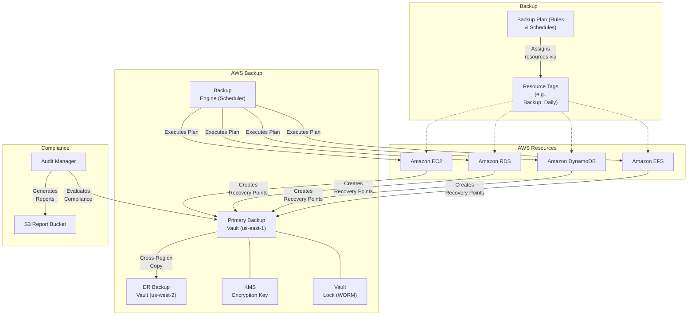
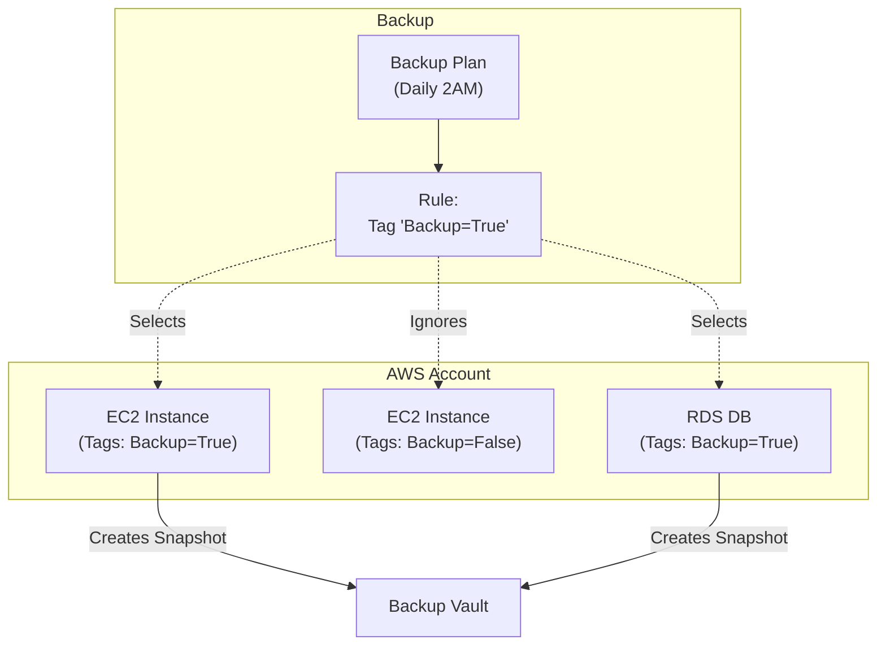
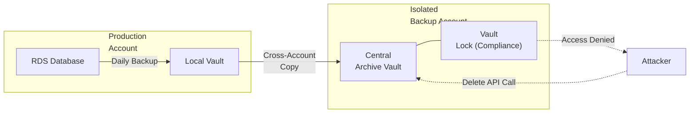

# Chapter 28: AWS Backup — Centralized Backup and Recovery

---

## 1. Service Overview

AWS Backup is a fully managed, policy-driven service that enables you to centralize and automate data protection across AWS services, hybrid environments, and on-premises workloads. It provides a single pane of glass to configure backup policies, monitor backup activity, and restore data across your entire AWS footprint.

### Why AWS Created It

Before AWS Backup, managing data protection in AWS was highly fragmented. You had to use Amazon Data Lifecycle Manager (DLM) for EBS snapshots, write custom Lambda scripts for DynamoDB backups, use RDS automated backups for databases, and manually configure S3 replication. Each service had its own retention policies, monitoring interfaces, and compliance tracking. AWS created AWS Backup to unify these disparate backup mechanisms into a single, centralized compliance-driven platform.

### Key Characteristics

- **Centralized Management**: Manage backups across EC2, EBS, RDS, Aurora, DynamoDB, Neptune, DocumentDB, EFS, FSx, Storage Gateway, S3, and VMware.
- **Policy-Driven**: Define "Backup Plans" (how often, how long to keep, where to store) and apply them via tags or Resource IDs.
- **Cross-Region / Cross-Account**: Automatically copy backups to different AWS Regions or entirely different AWS Accounts for Disaster Recovery (DR) and ransomware protection.
- **Immutable Backups**: AWS Backup Vault Lock prevents malicious or accidental deletion of backups, satisfying WORM (Write Once, Read Many) compliance requirements.
- **Auditing & Compliance**: AWS Backup Audit Manager generates reports proving compliance with your organization's data protection policies.
- **Lifecycle Management**: Automatically transition backups to cold storage (where supported) to reduce costs.

---

## 2. Learning Objectives

By the end of this chapter, you will be able to:

- **Explain** the difference between AWS Backup and service-native backups (like RDS snapshots).
- **Design** an enterprise Backup Plan using Backup Rules, Lifecycle policies, and Backup Vaults.
- **Implement** cross-region and cross-account backup replication for Disaster Recovery.
- **Protect** backups against ransomware and rogue administrators using Vault Lock.
- **Automate** backup assignments using resource tagging and AWS Organizations.
- **Restore** various resource types (EC2 instances, RDS databases, EFS file systems) from recovery points.
- **Audit** backup compliance across an organization using AWS Backup Audit Manager.
- **Troubleshoot** failed backup jobs, permission errors, and VSS application-consistent backup failures.

---

## 3. Prerequisites

- **AWS Account** with administrative access
- **Completed chapters**: Chapter 1 (IAM), Chapter 2 (S3/EBS), Chapter 6 (RDS)
- **Concepts**: RPO (Recovery Point Objective), RTO (Recovery Time Objective), Snapshots, IAM roles

---

## 4. Real-world Analogy

Think of AWS Backup as the **Central Security & Archiving Department** for a massive corporate campus.

In the past, every department (HR, Finance, Legal) was responsible for locking their own filing cabinets and keeping their own records. HR kept records for 3 years, Legal for 7 years, and Finance occasionally forgot to lock their cabinets. It was impossible for the CEO to prove to an auditor that the whole company was secure.

AWS Backup is the new Central Archiving Department. They issue a company-wide policy (the **Backup Plan**):
- *Policy A*: All folders marked with a red sticker (Tag: `Backup=Daily`) will be collected every night at 2 AM, photocopied, and stored in the secure basement (the **Backup Vault**).
- *Policy B*: All folders marked with a gold sticker (Tag: `Backup=Financial`) will be copied every night, and a second copy will be mailed to an offsite facility in another state (**Cross-Region Copy**).

The archiving department handles the collection, the secure storage, and provides the auditor with a single report proving compliance (**Audit Manager**).

---

## 5. Business Use Cases

### Ransomware Protection
- **Immutable Storage**: Using AWS Backup Vault Lock in Compliance mode to ensure that even if an attacker gains `AdministratorAccess` to an AWS account, they physically cannot delete the database backups.

### Disaster Recovery (DR)
- **Multi-Region Resilience**: Automatically copying daily EC2 and RDS backups from `us-east-1` (Primary) to `us-west-2` (DR Region). If the primary region suffers a massive outage, the infrastructure can be spun up in the DR region from the copied backups.

### Regulatory Compliance
- **Data Retention Laws**: Meeting HIPAA, PCI-DSS, or financial industry regulations that require data to be backed up daily, retained for exactly 7 years, and proven via monthly compliance reports.

### Operational Recovery
- **Accidental Deletion**: Restoring an EFS file system or a DynamoDB table after a developer accidentally runs a destructive script that deletes production data.

---

## 6. Core Concepts

### Backup Vault
An encrypted container that organizes and stores your backups (Recovery Points). Every backup must reside in a vault. Access to the vault is controlled by a resource-based access policy.

### Backup Plan
A policy expression that defines *when* and *how* you want to back up your AWS resources. It consists of one or more Backup Rules.

### Backup Rule
Defines the schedule (Cron expression), the backup window (e.g., start between 1 AM and 3 AM), the lifecycle (transition to cold storage after X days, delete after Y days), and the destination Backup Vault.

### Resource Assignment
How AWS Backup knows *what* to back up. Resources can be assigned to a Backup Plan explicitly by Resource ID, or dynamically using Tags (e.g., `Environment=Production`).

### Recovery Point
The actual backup itself (a snapshot or continuous backup record) representing the state of a resource at a specific point in time.

### AWS Backup Audit Manager
Provides built-in controls (e.g., "Are all DynamoDB tables backed up daily?") and generates daily reports indicating which resources are compliant or non-compliant with your corporate data protection policies.

---

## 7. Internal Architecture



---

## 8. Service Components

### Application-Consistent Backups (VSS)
For EC2 instances running Windows, AWS Backup integrates with Windows Volume Shadow Copy Service (VSS). This ensures that data in memory and pending I/O operations are flushed to disk before the snapshot is taken, preventing database corruption (e.g., for SQL Server running on EC2).

### Continuous Backup (Point-in-Time Recovery)
For supported services (RDS, S3, DynamoDB), AWS Backup can manage continuous backups, allowing you to restore to any exact second within the retention period (up to 35 days), rather than just restoring a daily snapshot.

### Cross-Account Backup
Requires AWS Organizations. You can define a backup policy in the Management Account, have member accounts perform the backup, and securely copy those backups into an isolated, centralized "Backup Archive" AWS account.

### Backup Vault Lock
Enforces WORM (Write Once, Read Many) protection.
- **Governance Mode**: Prevents deletion by standard users, but users with special IAM permissions can bypass the lock.
- **Compliance Mode**: Once the cooling-off period expires, the lock CANNOT be removed by anyone, including the AWS Root user or AWS Support, until the retention period expires.

---

## 9. Configuration

### IAM Role for AWS Backup
AWS Backup needs permissions to create snapshots of your resources. AWS provides a managed policy `AWSBackupServiceRolePolicyForBackup`.

```json
{
  "Version": "2012-10-17",
  "Statement": [
    {
      "Effect": "Allow",
      "Action": [
        "ec2:CreateSnapshot",
        "ec2:CreateImage",
        "rds:CreateDBSnapshot",
        "dynamodb:CreateBackup",
        "elasticfilesystem:Backup"
      ],
      "Resource": "*"
    }
  ]
}
```

### Vault Access Policy
A resource-based policy attached to the Backup Vault. This example denies anyone from deleting recovery points.

```json
{
  "Version": "2012-10-17",
  "Statement": [
    {
      "Sid": "DenyRecoveryPointDeletion",
      "Effect": "Deny",
      "Principal": "*",
      "Action": "backup:DeleteRecoveryPoint",
      "Resource": "*"
    }
  ]
}
```

---

## 10. Code Examples

### AWS CLI — Common Operations

```bash
# 1. Create a Backup Vault
aws backup create-backup-vault \
    --backup-vault-name ProductionVault \
    --encryption-key-arn arn:aws:kms:us-east-1:123456789012:key/key-id

# 2. Create a Backup Plan (using a JSON file)
aws backup create-backup-plan \
    --backup-plan file://backup-plan.json

# 3. Start an On-Demand Backup Job
aws backup start-backup-job \
    --backup-vault-name ProductionVault \
    --resource-arn arn:aws:ec2:us-east-1:123456789012:instance/i-0abcdef1234567890 \
    --iam-role-arn arn:aws:iam::123456789012:role/AWSBackupDefaultServiceRole

# 4. List Backup Jobs
aws backup list-backup-jobs \
    --by-state COMPLETED

# 5. Apply Vault Lock in Compliance Mode
aws backup put-backup-vault-lock-configuration \
    --backup-vault-name ProductionVault \
    --min-retention-days 7 \
    --max-retention-days 365 \
    --changeable-for-days 3
```

### Terraform — Complete Enterprise Backup Plan

```hcl
# Create the Backup Vault
resource "aws_backup_vault" "primary" {
  name        = "enterprise-primary-vault"
  kms_key_arn = aws_kms_key.backup.arn
}

# Apply Vault Lock (Compliance Mode)
resource "aws_backup_vault_lock_configuration" "lock" {
  backup_vault_name   = aws_backup_vault.primary.name
  changeable_for_days = 3 # Grace period before lock becomes permanent
  max_retention_days  = 1200
  min_retention_days  = 30
}

# Create the Backup Plan
resource "aws_backup_plan" "daily" {
  name = "daily-production-backup"

  rule {
    rule_name         = "daily-midnight-retention-30d"
    target_vault_name = aws_backup_vault.primary.name
    schedule          = "cron(0 5 * * ? *)" # 5 AM UTC (Midnight EST)
    
    lifecycle {
      delete_after = 30
    }
    
    # Optional: Copy to DR Region
    copy_action {
      destination_vault_arn = aws_backup_vault.dr_vault.arn
      lifecycle {
        delete_after = 30
      }
    }
  }
}

# Assign Resources based on Tags
resource "aws_backup_selection" "prod_tag" {
  iam_role_arn = aws_iam_role.backup_role.arn
  name         = "production-resources"
  plan_id      = aws_backup_plan.daily.id

  selection_tag {
    type  = "STRINGEQUALS"
    key   = "Environment"
    value = "Production"
  }
}
```

---

## 11. Line-by-Line Explanation

### Backup Plan Schedule and Lifecycle Breakdown

```hcl
    rule_name         = "daily-midnight-retention-30d"
    target_vault_name = aws_backup_vault.primary.name
    schedule          = "cron(0 5 * * ? *)" 
```
- **`schedule`**: Defines when the backup window opens. `cron(0 5 * * ? *)` means every day at 5:00 AM UTC. By default, AWS Backup has an 8-hour window to complete the job, meaning it optimizes API calls and storage IO to run the backup sometime between 5:00 AM and 1:00 PM UTC, preventing massive simultaneous I/O spikes across all your instances.

```hcl
    lifecycle {
      move_to_cold_storage_after_days = 30
      delete_after                    = 365
    }
```
- **`move_to_cold_storage_after_days`**: For supported resources (like EFS), backups are transitioned to a cheaper storage tier after 30 days.
- **`delete_after`**: AWS Backup will automatically purge the recovery point after 365 days, ensuring you do not pay for storage indefinitely and comply with data minimization regulations.

---

## 12. Security Deep Dive

### The Immutable Backup Architecture (Ransomware Defense)
A modern ransomware attack on AWS doesn't just encrypt EC2 instances; the attacker steals API keys, iterates through all regions, and calls `DeleteSnapshot` on everything, destroying your backups.

To defeat this:
1. **Isolated Backup Account**: Create an AWS Account solely for backups. No developers or applications run here.
2. **Cross-Account Copy**: Configure AWS Backup in the Production account to copy backups into the Vault in the Isolated Account.
3. **Vault Lock**: Apply AWS Backup Vault Lock in **Compliance Mode** on the Isolated Account's Vault.
4. **Result**: Even if a rogue Admin gets root access to the Production account *and* the Isolated Account, the Vault Lock prevents AWS APIs from deleting the backups until the retention period expires. Your data is perfectly safe.

### KMS Encryption
Backups must be encrypted at rest. AWS Backup uses AWS KMS. 
- If the original resource (e.g., EBS volume) is encrypted with a Customer Managed Key (CMK), AWS Backup uses that same key to encrypt the backup.
- For cross-account copies, you must configure the source KMS key policy to allow the destination account to read it, and the destination Vault must have its own KMS key to re-encrypt the data upon arrival.

---

## 13. Monitoring & Observability

### EventBridge Integration
AWS Backup emits events to Amazon EventBridge. You should create rules to alert your team immediately if a backup fails.

```json
{
  "source": ["aws.backup"],
  "detail-type": ["Backup Job State Change"],
  "detail": {
    "state": ["FAILED", "ABORTED"]
  }
}
```

### AWS Backup Audit Manager
Provides a dashboard of your compliance posture. You define "Frameworks" containing "Controls". 
- Example Control: "EC2 instances must be backed up daily."
- Audit Manager continuously evaluates your account and flags any EC2 instance that missed its backup, exporting a daily CSV report to S3 for auditors.

---

## 14. Performance & Cost Optimization

### Cost Model
- **Backup Storage**: You pay for the GB-months of data stored. For example, EBS snapshot storage costs ~$0.05/GB-month.
- **Restore Data**: You pay per GB of data restored.
- **Cross-Region Data Transfer**: Standard AWS data transfer out rates apply when copying backups between regions.
- **Cold Storage**: Significantly cheaper (~$0.01/GB-month), but only supported for specific resources (EFS, DynamoDB, VMware) and incurs a retrieval fee.

### Optimization Strategies
1. **Use Incremental Backups**: AWS Backup natively creates incremental backups for EC2/EBS and RDS. You only pay for the data that changed since the last backup.
2. **Optimize Retention**: Do not keep daily backups for 7 years. Use a GFS (Grandfather-Father-Son) strategy: Keep daily backups for 30 days, monthly backups for 1 year, and yearly backups for 7 years. This requires creating 3 separate Backup Rules in your Backup Plan.
3. **Exclude Unnecessary Resources**: Ensure tag-based assignment logic strictly excludes Dev/Test instances that do not require backups.

---

## 15. Enterprise Integration

### AWS Organizations Policies
You can use AWS Organizations to enforce backup policies globally across hundreds of accounts.
1. Create a **Backup Policy** in the Management Account.
2. The policy defines the Backup Plan (e.g., "All resources tagged `Tier=1` must be backed up daily to vault `CentralVault`").
3. Attach the policy to the Organization Root or specific OUs.
4. AWS Backup automatically deploys this plan to every member account. Member account administrators cannot modify or delete this plan.

### Restoring EC2 Instances
When restoring an EC2 instance, AWS Backup restores the EBS volumes and automatically registers an AMI. It preserves the instance type, VPC, Security Groups, and IAM roles. You can optionally modify these parameters during the restore wizard (e.g., restoring a production instance into an isolated testing VPC).

---

## 16. Real Industry Use Cases

### Case 1: Financial Services — WORM Compliance
**Problem**: The SEC requires financial records to be stored in a WORM (Write Once, Read Many) format for 7 years, protected against alteration or deletion.
**Solution**: Deployed AWS Backup Vault Lock in Compliance Mode. Once backups are written to the vault, they are cryptographically locked for 7 years.
**Result**: Passed regulatory audits seamlessly.

### Case 2: Healthcare Provider — Ransomware Recovery
**Problem**: A hospital network was targeted by ransomware. On-premise backups were compromised.
**Solution**: The hospital had configured AWS Backup to perform cross-account copies of all critical EFS file systems and RDS databases into an isolated, locked AWS account.
**Result**: The security team restored the data from the isolated account into a clean environment, achieving zero data loss and minimizing downtime.

### Case 3: SaaS Startup — Automated Compliance Proof
**Problem**: Engineers spent 20 hours a month taking screenshots of RDS and EC2 snapshot configurations to prove to SOC 2 auditors that backups were occurring.
**Solution**: Enabled AWS Backup Audit Manager with a daily report generation.
**Result**: Auditors were provided with an automated, cryptographically verified CSV report proving 100% backup compliance, reducing engineering overhead to zero.

---

## 17. Architecture Patterns

### Pattern 1: Tag-Driven Automated Backups


### Pattern 2: Cross-Account Ransomware Vault


---

## 18. Production Incident War Room

### Incident 1: Cross-Account Copy Failing with AccessDenied
**Severity**: P2 — High
**Symptoms**: Daily backups complete successfully in the source account, but the cross-account copy job to the central vault fails with `AccessDeniedException`.
**Investigation**:
1. Check AWS Backup job errors in the source account.
2. The error states the KMS key in the destination account rejected the encryption request.
**Root Cause**: When performing cross-account copies, the destination Vault must have a Vault Access Policy allowing the source account to write to it. Additionally, the Customer Managed KMS Key attached to the destination Vault must have a Key Policy allowing the source account's AWS Backup IAM role to perform `kms:GenerateDataKey` and `kms:Encrypt`.
**Permanent Fix**: Update the destination KMS Key Policy and the destination Vault Access Policy to trust the source account ID.

### Incident 2: VSS Backup Failing for Windows EC2
**Severity**: P2 — High
**Symptoms**: AWS Backup jobs for Windows EC2 instances fail with `VSS failure`.
**Investigation**:
1. AWS Backup attempts to use Windows Volume Shadow Copy Service to flush I/O for application-consistent backups.
2. Check the EC2 instance using Systems Manager (SSM).
**Root Cause**: The EC2 instance did not have the `AWSEc2VssProvider` SSM document installed, or the IAM instance profile attached to the EC2 instance lacked permissions to communicate with SSM.
**Permanent Fix**: Attach the `AmazonSSMManagedInstanceCore` policy to the EC2 instance profile. Use SSM Run Command to install the `AWSEc2VssProvider` package on all Windows fleets.

### Incident 3: Massive I/O Spike During Backup Window
**Severity**: P1 — Critical
**Symptoms**: At exactly 2:00 AM, database performance across the entire application fleet drops drastically. Disk latency spikes from 2ms to 200ms.
**Investigation**:
1. Check CloudWatch metrics for EBS (`VolumeQueueLength` and `VolumeWriteBytes`).
2. Check AWS Backup job history. All 500 EC2 instances started their backup jobs at exactly 2:00:00 AM.
**Root Cause**: The Backup Rule schedule was set to `cron(0 2 * * ? *)`, and the "Start window" was set to 1 hour. AWS Backup attempted to snapshot 500 massive instances simultaneously, causing extreme I/O contention on the underlying AWS physical storage hardware.
**Permanent Fix**: Increase the Backup Plan "Start window" to 8 hours. AWS Backup will intelligently jitter and stagger the snapshot API calls over the 8-hour period to prevent I/O storms and API throttling.

### Incident 4: EC2 Restore Failing (Missing KMS Key)
**Severity**: P1 — Critical
**Symptoms**: During a disaster recovery drill, attempting to restore an EC2 instance from a backup fails immediately.
**Investigation**:
1. The restore job details show: `Client.KMSException: The key ID does not exist or is not accessible`.
**Root Cause**: The original EC2 instance's EBS volume was encrypted with a Customer Managed KMS Key. The backup was encrypted with that same key. Before the DR drill, a security administrator accidentally deleted or disabled that specific KMS key.
**Permanent Fix**: Without the original KMS key, the backup is cryptographically destroyed. Never delete KMS keys used for EBS/Backup encryption. Implement SCPs to prevent `kms:ScheduleKeyDeletion` on production keys.

### Incident 5: Backup Job Throttling (Too Many Tags)
**Severity**: P3 — Medium
**Symptoms**: Some AWS Backup jobs remain in `CREATED` state and eventually time out after 8 hours.
**Investigation**:
1. AWS CloudTrail shows `ThrottlingException` for `ec2:CreateTags` calls made by the `backup.amazonaws.com` service principal.
**Root Cause**: AWS Backup automatically copies all tags from the source resource (e.g., an EC2 instance) to the recovery point (the snapshot). The EC2 instance had 45 tags. Creating a snapshot with 45 tags across hundreds of instances simultaneously hit the EC2 API rate limit for tag creation.
**Permanent Fix**: Reduce the number of non-essential tags on resources, or increase the Backup window to spread out the API calls. Request an API rate limit increase from AWS Support for `CreateTags`.

---

## 19. Production Best Practices (Well-Architected)

### Reliability
- **Automate Testing**: Backups are worthless if they cannot be restored. Use AWS Fault Injection Service (FIS) or custom lambda scripts to automatically restore a random EC2 instance from AWS Backup once a week, verify it boots, and then delete it.
- **Cross-Region DR**: Always configure a cross-region copy rule for critical Tier 1 applications to protect against region-wide AWS outages.

### Security
- **Vault Lock**: Always enable Vault Lock in Compliance mode for production data. This is your ultimate defense against ransomware.
- **Isolate Backups**: Store backups in an entirely different AWS Account than the workload.

### Operational Excellence
- **Tag-Based Policies**: Never assign resources to Backup Plans by ID. Always use Tags (e.g., `DataClassification=Confidential`). This ensures new resources are automatically protected the moment they are launched.
- **Audit Manager**: Enable AWS Backup Audit Manager to replace manual compliance checks with automated reports.

---

## 20. Migration Strategies

### From Custom DLM/Lambda to AWS Backup
If you are currently using Amazon Data Lifecycle Manager (DLM) for EBS snapshots, or custom Lambda functions for RDS backups:
1. Define equivalent Backup Plans in AWS Backup.
2. Ensure IAM roles and KMS keys are configured correctly.
3. Enable AWS Backup, and let it run for 1 full cycle alongside DLM.
4. Verify Recovery Points appear in the Backup Vault.
5. Disable the old DLM policies and Lambda schedules.

---

## 21. Integration with Other Services

### Amazon S3
AWS Backup recently added support for Amazon S3. Previously, you had to rely on S3 Versioning and Cross-Region Replication (CRR). Now, you can take point-in-time, immutable backups of S3 buckets and restore entire buckets or specific prefixes to a different bucket for forensic analysis.

### AWS Storage Gateway
AWS Backup integrates with Storage Gateway to back up on-premises File Gateways and Volume Gateways, allowing you to use AWS as your centralized backup repository for your on-premises data centers.

---

## 22. Practical Projects

### Beginner Project: Basic AWS Backup Deployment
- **Business Requirement**: Deploy baseline AWS Backup resources securely.
- **Architecture**: Single-region deployment with default VPC subnets and restricted IAM roles.
- **Implementation**: Write a Terraform `main.tf` to provision AWS Backup and apply the configuration. Verify resource creation in the AWS Console.

### Intermediate Project: Multi-AZ Scalable AWS Backup Setup
- **Business Requirement**: Implement high availability and automated scaling for AWS Backup to withstand Availability Zone failures.
- **Architecture**: Application Load Balancer -> Auto Scaling Group -> AWS Backup -> KMS Encrypted Persistence Layer.
- **Implementation**: Configure scaling policies based on CPU utilization and set up CloudWatch Alarms for monitoring metrics.

### Advanced Project: Automated CI/CD Pipeline Integration
- **Business Requirement**: Automate the deployment and testing of AWS Backup infrastructure without manual intervention.
- **Architecture**: GitHub Repository -> AWS CodePipeline -> AWS CodeBuild -> Deployment to AWS Backup Targets.
- **Implementation**: Write a `buildspec.yml` to run automated security linting (e.g., tfsec or Checkov) before deploying the AWS Backup changes.

### Enterprise Project: Zero-Trust Multi-Account Architecture
- **Business Requirement**: Deploy a production-grade multi-account enterprise environment utilizing AWS Backup with centralized security governance.
- **Architecture**: AWS Organizations -> AWS Transit Gateway -> Hub-and-Spoke VPCs -> Multi-AZ AWS Backup -> AWS IAM Identity Center SSO.
- **Implementation**: Implement Service Control Policies (SCPs) to restrict AWS Backup deployments to approved regions and mandate AWS KMS customer-managed keys (CMKs) for all data at rest.

---

## 23. Interview Preparation

### Beginner
**Q1**: What is the primary benefit of AWS Backup over service-specific backups (like RDS automated backups)?
**A**: Centralized management. AWS Backup allows you to define a single policy and apply it across EC2, RDS, DynamoDB, EFS, and other services, providing a single pane of glass for compliance reporting and monitoring.

**Q2**: What is a Backup Vault?
**A**: An encrypted logical container where AWS Backup stores your recovery points (backups). Access to the vault is controlled by IAM policies and Vault Access Policies.

### Intermediate
**Q3**: How can you protect your AWS Backups against a ransomware attack where the attacker compromises an admin account?
**A**: Implement AWS Backup Vault Lock in Compliance mode. Once applied, no one (not even the root user or AWS support) can delete the backups or shorten the retention period. Combining this with cross-account backups to an isolated security account provides ultimate protection.

**Q4**: You want all newly created RDS databases to be automatically backed up without manual intervention. How?
**A**: Define a Backup Plan with a Resource Assignment based on Tags (e.g., `Env=Prod`). Ensure developers apply that tag when provisioning RDS databases. AWS Backup will automatically detect the tag and begin backing it up.

### Advanced
**Q5**: Your Windows EC2 instances run a SQL Server database. How do you ensure your AWS Backups don't capture a corrupted state of the database?
**A**: You must configure application-consistent backups. AWS Backup integrates with the Windows Volume Shadow Copy Service (VSS). Ensure the `AWSEc2VssProvider` package is installed on the EC2 instance via Systems Manager so pending I/O operations are frozen and flushed to disk right before the snapshot is taken.

---

## 24. AWS Certification Practice

**Q1**: A company must ensure that all Amazon EBS volumes, Amazon RDS databases, and Amazon EFS file systems are backed up daily and retained for exactly 30 days. The solution must be centralized and provide compliance reports to auditors. Which AWS service should be used?
- A) Amazon Data Lifecycle Manager (DLM)
- **B) AWS Backup** ✓
- C) AWS Systems Manager State Manager
- D) AWS CloudTrail

**Q2**: An enterprise wants to ensure that its backups cannot be deleted by anyone, including administrators, for 7 years to meet regulatory requirements. Which feature provides this WORM (Write Once, Read Many) capability?
- A) S3 Object Lock
- B) EBS Snapshot Recycle Bin
- **C) AWS Backup Vault Lock in Compliance Mode** ✓
- D) KMS Key Policies

---

## 25. Knowledge Check

1. **What dictates the schedule and lifecycle of a backup?** The Backup Rule within a Backup Plan.
2. **What feature prevents backup deletion even by root users?** AWS Backup Vault Lock (Compliance mode).
3. **Can AWS Backup copy snapshots across AWS Regions?** Yes.
4. **Can AWS Backup copy snapshots across AWS Accounts?** Yes (typically managed via AWS Organizations).
5. **What is VSS used for in AWS Backup?** Application-consistent backups for Windows EC2 instances.
6. **What generates reports to prove backup compliance?** AWS Backup Audit Manager.

---

## 26. Cheat Sheet

| Concept | Definition |
|---------|------------|
| **Backup Vault** | Encrypted storage container for Recovery Points. |
| **Backup Plan** | Policy defining *when* and *how long* to back up. |
| **Resource Assignment**| Links resources to a Plan, usually via Tags. |
| **Cross-Region Copy** | Sending a backup copy to another region for DR. |
| **Vault Lock** | Enforces WORM storage; prevents early deletion. |
| **Audit Manager** | Evaluates compliance and generates CSV reports. |
| **VSS Integration** | Application-consistent snapshots for Windows. |

---

## 27. Chapter Summary

AWS Backup is the critical service for centralized data protection and compliance in the cloud. Key takeaways:

- Replace scattered, service-specific backup scripts with **Backup Plans**.
- Use **Tag-based assignments** to automate backup coverage dynamically.
- Implement **Cross-Region** and **Cross-Account** copies to survive localized disasters and account compromises.
- Enforce immutable, ransomware-proof storage using **Vault Lock in Compliance Mode**.
- Utilize **AWS Backup Audit Manager** to automatically prove your data protection posture to external auditors.
- Never hardcode resource IDs into backup plans; rely on tagging standards and AWS Organizations policies to enforce coverage globally.

---

## 28. Further Learning

### AWS Documentation
- [AWS Backup Developer Guide](https://docs.aws.amazon.com/aws-backup/latest/devguide/whatisbackup.html)
- [AWS Backup Vault Lock](https://docs.aws.amazon.com/aws-backup/latest/devguide/vault-lock.html)
- [Application-Consistent Backups (VSS)](https://docs.aws.amazon.com/aws-backup/latest/devguide/creating-a-backup.html#application-consistent-backups)

### Related Chapters
- **Chapter 2 — Amazon S3 & EBS**: Core storage services protected by AWS Backup.
- **Chapter 6 — Amazon RDS**: Relational databases protected by AWS Backup.
- **Chapter 31 — AWS Organizations**: Enforcing backup policies globally across accounts.
