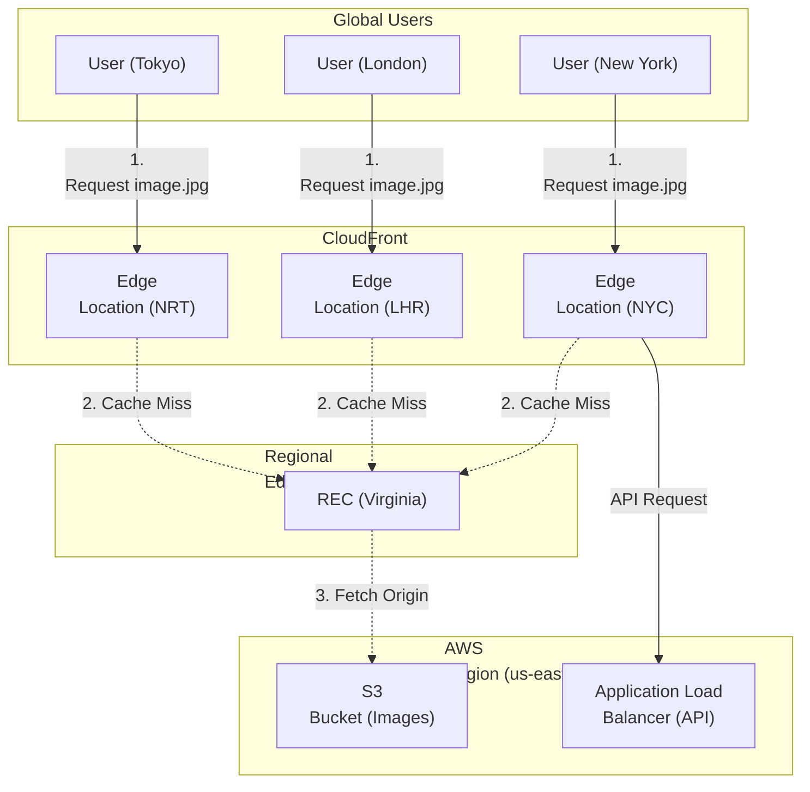
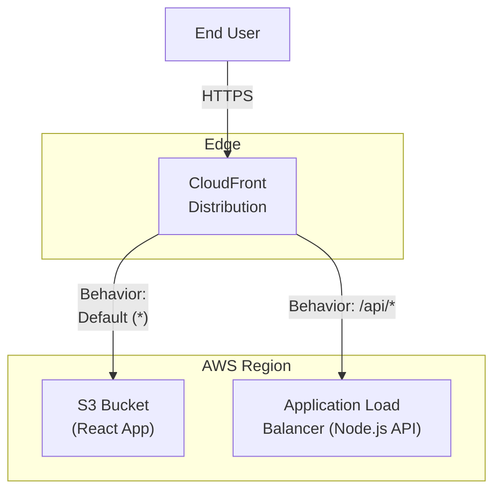
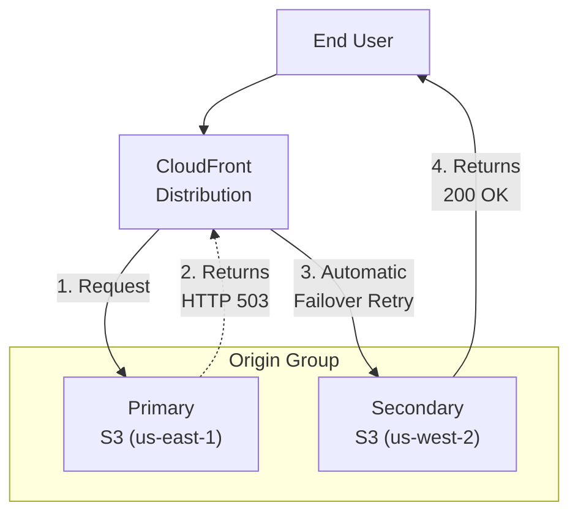

# Chapter 29: Amazon CloudFront — Global Content Delivery Network

---

## 1. Service Overview

Amazon CloudFront is a highly secure, high-performance Content Delivery Network (CDN) that accelerates the delivery of static and dynamic web content, video streams, and APIs to users worldwide. It routes requests to the nearest AWS edge location to ensure the lowest possible latency and highest data transfer speeds.

### Why AWS Created It

Before CDNs, users connecting to a server in Virginia from Tokyo suffered from high latency (200ms+ round trips), slow download speeds due to packet loss, and poor streaming video quality. Additionally, serving all traffic from a single origin server meant the origin could easily be overwhelmed by traffic spikes or DDoS attacks. AWS created CloudFront to cache content physically closer to users at global edge locations, dramatically reducing latency, offloading traffic from origin servers, and absorbing massive traffic spikes.

### Key Characteristics

- **Global Reach**: Hundreds of Points of Presence (PoPs) across the globe.
- **Static & Dynamic Content**: Caches static assets (images, CSS, JS) and accelerates dynamic content (API calls, websockets) using the optimized AWS global network.
- **Security Native**: Integrates seamlessly with AWS WAF, AWS Shield Standard/Advanced, and ACM for SSL/TLS termination.
- **Edge Computing**: Supports executing lightweight code at the edge using CloudFront Functions and Lambda@Edge before the request hits the origin or before the response returns to the client.
- **Origin Flexibility**: Can fetch content from AWS Origins (S3, ALB, EC2) or custom external origins (on-premises servers or third-party clouds).

---

## 2. Learning Objectives

By the end of this chapter, you will be able to:

- **Architect** a globally distributed web application using CloudFront and S3.
- **Configure** Origin Access Control (OAC) to secure S3 buckets.
- **Design** Cache Behaviors to route different URL paths to different origins (e.g., `/api/*` to ALB, `/*` to S3).
- **Implement** Edge computing using CloudFront Functions to manipulate HTTP headers.
- **Secure** distributions using AWS WAF, signed URLs, and signed cookies.
- **Troubleshoot** cache misses, HTTP 502/504 errors, and CORS issues.
- **Optimize** cache hit ratios using Cache Policies and Origin Request Policies.

---

## 3. Prerequisites

- **AWS Account** with administrative access
- **Completed chapters**: Chapter 2 (Amazon S3), Chapter 7 (Amazon Route 53), Chapter 18 (Elastic Load Balancing)
- **Concepts**: HTTP/HTTPS protocols, caching headers (`Cache-Control`, `Expires`), TLS certificates, DNS CNAMEs.

---

## 4. Real-world Analogy

Think of Amazon CloudFront as a **Global Franchise Network for a Famous Bakery**.

The **Origin Server** is the original master bakery in Paris. They bake the best croissants in the world. 
If a customer in Tokyo wants a croissant, flying it from Paris takes too long (latency) and the delivery cost is high (bandwidth).

Instead, the bakery opens a **CloudFront Edge Location** (a local franchise) in Tokyo.
1. The first Tokyo customer asks the local franchise for a croissant (Cache Miss).
2. The franchise calls Paris, gets the croissant recipe via a dedicated high-speed secure phone line (AWS Global Network), bakes it locally, and hands it to the customer.
3. The franchise keeps the recipe on hand for the rest of the day (Cache).
4. The next 10,000 customers in Tokyo get their croissants instantly from the local shop (Cache Hit), without Paris ever knowing or doing any extra work.

---

## 5. Business Use Cases

### Static Asset Delivery
- **Single Page Applications (SPAs)**: Hosting React, Vue, or Angular applications on S3 and delivering them globally via CloudFront.

### Video Streaming
- **Video on Demand (VOD) & Live Streaming**: Delivering high-quality HLS or DASH video streams to millions of concurrent viewers for live sporting events without crashing the media server.

### Dynamic API Acceleration
- **E-Commerce Checkouts**: While shopping carts cannot be cached, CloudFront accelerates the API connection by routing the TCP connection over the dedicated AWS global network backbone, bypassing the noisy public internet.

### Edge Security & Compliance
- **DDoS Mitigation**: Using CloudFront as the primary entry point to absorb massive volumetric DDoS attacks at the edge, keeping the actual EC2/ALB origins completely hidden from the public internet.

---

## 6. Core Concepts

### Distribution
The fundamental configuration unit in CloudFront. You assign a domain name to it (e.g., `d111111abcdef8.cloudfront.net`), configure origins, and set up cache behaviors.

### Origin
The location where CloudFront fetches your original, definitive version of the content. Can be an S3 bucket, an Application Load Balancer, an EC2 instance, or any custom HTTP server.

### Cache Behavior
Rules that tell CloudFront how to handle requests for specific URL paths. For example, a behavior for `*.jpg` might cache for 30 days, while a behavior for `/api/*` might forward all headers and not cache at all.

### Cache Policy & Origin Request Policy
- **Cache Policy**: Determines which HTTP headers, query strings, and cookies are included in the "Cache Key" (the unique identifier for a cached file).
- **Origin Request Policy**: Determines which headers, query strings, and cookies are forwarded to the Origin when there is a cache miss.

### Origin Access Control (OAC)
A security mechanism replacing the older Origin Access Identity (OAI). It allows CloudFront to securely access private S3 buckets using SigV4 authentication, ensuring users cannot bypass CloudFront and access the S3 bucket directly.

---

## 7. Internal Architecture


*Note: Regional Edge Caches sit between the local PoPs and the Origin. If 10 different global PoPs have a cache miss simultaneously, the Regional Edge Cache collapses the requests and only makes ONE request to the S3 bucket, protecting the origin from being overwhelmed.*

---

## 8. Service Components

### CloudFront Functions
A lightweight JavaScript execution environment that runs at every single Edge Location. Perfect for sub-millisecond, highly concurrent tasks like header manipulation, URL rewrites, or simple token validation.

### Lambda@Edge
Node.js or Python Lambda functions that run at the Regional Edge Caches. Slower than CloudFront Functions but far more powerful. They can make external network calls (e.g., querying a database to authenticate a user before allowing access to premium content).

### Invalidation
A manual request to force CloudFront to remove a file from its edge caches before the Time to Live (TTL) expires. Used when you update a file on the origin and need users to see the new version immediately.

### Signed URLs & Signed Cookies
Security mechanisms to restrict access to paid or private content (e.g., training videos). Users must authenticate with your application, which generates a cryptographically signed URL allowing them to download the file from CloudFront for a limited time.

---

## 9. Configuration

### S3 Bucket Policy for OAC
When using Origin Access Control, your S3 bucket must have a policy allowing the CloudFront distribution to read the files.

```json
{
    "Version": "2012-10-17",
    "Statement": [
        {
            "Sid": "AllowCloudFrontServicePrincipal",
            "Effect": "Allow",
            "Principal": {
                "Service": "cloudfront.amazonaws.com"
            },
            "Action": "s3:GetObject",
            "Resource": "arn:aws:s3:::my-production-bucket/*",
            "Condition": {
                "StringEquals": {
                    "AWS:SourceArn": "arn:aws:cloudfront::123456789012:distribution/EDFDVBD6EXAMPLE"
                }
            }
        }
    ]
}
```

---

## 10. Code Examples

### AWS CLI — Common Operations

```bash
# 1. Create a CloudFront Invalidation (Clear cache)
aws cloudfront create-invalidation \
    --distribution-id EDFDVBD6EXAMPLE \
    --paths "/*"

# 2. List all Distributions
aws cloudfront list-distributions \
    --query "DistributionList.Items[*].{Id:Id,DomainName:DomainName}" \
    --output table

# 3. Get Distribution Config
aws cloudfront get-distribution-config \
    --id EDFDVBD6EXAMPLE > config.json
```

### Terraform — Static Website with CloudFront and OAC

```hcl
# S3 Bucket
resource "aws_s3_bucket" "website" {
  bucket = "my-global-website-bucket-12345"
}

# Origin Access Control (OAC)
resource "aws_cloudfront_origin_access_control" "default" {
  name                              = "s3-oac"
  description                       = "OAC for S3 Website"
  origin_access_control_origin_type = "s3"
  signing_behavior                  = "always"
  signing_protocol                  = "sigv4"
}

# CloudFront Distribution
resource "aws_cloudfront_distribution" "s3_distribution" {
  origin {
    domain_name              = aws_s3_bucket.website.bucket_regional_domain_name
    origin_id                = "S3Origin"
    origin_access_control_id = aws_cloudfront_origin_access_control.default.id
  }

  enabled             = true
  is_ipv6_enabled     = true
  default_root_object = "index.html"

  default_cache_behavior {
    allowed_methods  = ["GET", "HEAD"]
    cached_methods   = ["GET", "HEAD"]
    target_origin_id = "S3Origin"

    forwarded_values {
      query_string = false
      cookies {
        forward = "none"
      }
    }

    viewer_protocol_policy = "redirect-to-https"
    min_ttl                = 0
    default_ttl            = 3600
    max_ttl                = 86400
  }

  restrictions {
    geo_restriction {
      restriction_type = "none"
    }
  }

  viewer_certificate {
    cloudfront_default_certificate = true
  }
}

# S3 Bucket Policy allowing OAC
resource "aws_s3_bucket_policy" "allow_cloudfront" {
  bucket = aws_s3_bucket.website.id
  policy = jsonencode({
    Version = "2012-10-17"
    Statement = [
      {
        Sid       = "AllowCloudFrontServicePrincipal"
        Effect    = "Allow"
        Principal = { Service = "cloudfront.amazonaws.com" }
        Action    = "s3:GetObject"
        Resource  = "${aws_s3_bucket.website.arn}/*"
        Condition = {
          StringEquals = {
            "AWS:SourceArn" = aws_cloudfront_distribution.s3_distribution.arn
          }
        }
      }
    ]
  })
}
```

---

## 11. Line-by-Line Explanation

### CloudFront Cache Behavior

```hcl
  default_cache_behavior {
    allowed_methods  = ["GET", "HEAD"]
    cached_methods   = ["GET", "HEAD"]
    target_origin_id = "S3Origin"
```
- **`allowed_methods`**: Defines what HTTP verbs the client is allowed to use. For a static website, `GET` and `HEAD` are sufficient. If this was pointing to an API origin, you would include `POST`, `PUT`, `DELETE`.
- **`cached_methods`**: Defines which verbs CloudFront will actually store in its edge caches. (You generally cannot and should not cache a `POST` request).

```hcl
    viewer_protocol_policy = "redirect-to-https"
    min_ttl                = 0
    default_ttl            = 3600
```
- **`viewer_protocol_policy`**: Crucial for security. If a user types `http://example.com`, CloudFront intercepts the request and issues a 301 Redirect to `https://example.com`.
- **`default_ttl`**: 3600 seconds (1 hour). If the origin server does not provide a `Cache-Control` header, CloudFront will assume the file should be cached for exactly 1 hour before checking the origin again.

---

## 12. Security Deep Dive

### Securing the ALB behind CloudFront
A common security flaw is putting CloudFront in front of an ALB, but leaving the ALB's security group open to the internet (`0.0.0.0/0`). Attackers bypass CloudFront entirely and attack the ALB directly.
- **Solution 1 (AWS Managed Prefix List)**: Update the ALB's Security Group Inbound Rule to only allow traffic from the AWS Managed Prefix List for CloudFront (`com.amazonaws.global.cloudfront.origin-facing`).
- **Solution 2 (Custom HTTP Header)**: Configure CloudFront to inject a secret custom header (e.g., `X-Custom-Auth: supersecret123`) on every origin request. Configure AWS WAF on the ALB to block any request that does not contain this exact header.

### AWS Certificate Manager (ACM) Requirement
To use a custom domain name (e.g., `www.example.com`) with CloudFront via HTTPS, you must request an ACM SSL/TLS certificate.
**CRITICAL RULE**: The ACM certificate MUST be requested in the `us-east-1` (N. Virginia) region, regardless of where your users or origin servers are located. CloudFront is a global service that only reads certificates from the `us-east-1` ACM control plane.

### Origin Shield
An additional layer of caching between Regional Edge Caches and your Origin. If you have an origin in `us-east-1`, and users request data from Europe, Asia, and South America, their respective Regional Edge Caches will all make independent requests to the origin. By enabling Origin Shield in `us-east-1`, all Regional Edge Caches check the Origin Shield first, reducing origin load to near zero.

---

## 13. Monitoring & Observability

### Standard Logs vs Real-Time Logs
- **Standard Logs**: Delivered to S3 every 5 minutes. Free. Good for daily analytics and long-term security auditing.
- **Real-Time Logs**: Streamed to Kinesis Data Streams within seconds. Charged by the number of log lines generated. Crucial for real-time operational dashboards or triggering Lambda functions to block abusive IPs dynamically.

### CloudWatch Metrics
- **`Requests`**: Total viewer requests.
- **`BytesDownloaded` / `BytesUploaded`**: Bandwidth usage.
- **`4xxErrorRate` / `5xxErrorRate`**: Percentage of requests resulting in errors. A spike in 5xx errors usually indicates the Origin is down.
- **`CacheHitRate`**: The percentage of requests served directly from the edge cache without contacting the origin. Maximizing this is the key to reducing latency and AWS costs.

---

## 14. Performance & Cost Optimization

### Cost Model
- **Data Transfer Out**: You pay per GB transferred from CloudFront to the Internet (varies by region, typically $0.085/GB in US/Europe, higher in Asia/SA).
- **HTTP Requests**: You pay per 10,000 HTTP requests.
- **Data Transfer from AWS Origins**: Data transferred from an AWS Origin (S3, EC2, ALB) to CloudFront is **FREE**.

### The Invalidation vs Versioning Cost Trap
Invalidation requests are free for the first 1,000 paths per month, but cost $0.005 per path afterward. If your CI/CD pipeline runs `aws cloudfront create-invalidation --paths "/*"` 100 times a day, you will run up a massive bill.
**Best Practice**: Use file versioning/hashing in your frontend build process (e.g., `main.a1b2c3d4.js`). Because the filename changes on every deployment, you never need to run invalidations. You can set the Cache-Control TTL to 1 year for these files.

### Optimizing the Cache Key
If you include the `User-Agent` header in your Cache Key, CloudFront will store a separate copy of your website for Chrome, Firefox, Safari, Mobile Safari, etc. Your Cache Hit Rate will plummet. Only include Headers, Query Strings, or Cookies in the Cache Key if the origin *actually returns different content* based on them.

---

## 15. Enterprise Integration

### WAF and Shield Advanced
For enterprise workloads, attach AWS WAF directly to the CloudFront distribution to block SQLi, XSS, and bad bots at the edge, rather than letting the traffic reach your region. Subscribe to AWS Shield Advanced for $3k/month to get a 24/7 DDoS response team and cost protection (AWS covers the CloudFront bandwidth bill if you suffer a massive DDoS attack).

### Cross-Region S3 Failover (Origin Groups)
To build a highly resilient static website, create two S3 buckets in different regions (e.g., `us-east-1` and `us-west-2`). Configure S3 Cross-Region Replication. In CloudFront, create an **Origin Group** containing both buckets. If the primary bucket returns a 500, 502, 503, or 504 error, CloudFront instantly and seamlessly retries the secondary bucket before returning an error to the user.

---

## 16. Real Industry Use Cases

### Case 1: Prime Video — Live Streaming
**Problem**: Broadcasting Thursday Night Football to millions of concurrent viewers without crashing media servers.
**Solution**: Used CloudFront with optimized Cache Behaviors for video segments (`.ts` files) and playlists (`.m3u8`). Used CloudFront Functions to dynamically route users to different Origin variants based on device type.
**Result**: Delivered petabytes of video at sub-second latency with zero origin overload.

### Case 2: SaaS Provider — Custom Domains
**Problem**: A SaaS company provides "white-label" portals for 10,000 different corporate clients, each wanting to use their own custom domain (e.g., `portal.client.com`).
**Solution**: Used a single CloudFront distribution with a wildcard certificate (or multiple certificates). Used a Lambda@Edge function on Viewer Request to inspect the `Host` header and rewrite the URL path so the origin S3 bucket serves the correct client's CSS and branding assets.

### Case 3: News Publisher — Paywall Implementation
**Problem**: Needs to allow users to read 3 free articles a month, but block access to the 4th article unless they are a paid subscriber.
**Solution**: Used Lambda@Edge on Viewer Request. The Lambda function checks a signed JWT cookie. If valid, it allows the request. If invalid, it increments a Redis counter. If the counter > 3, it returns an HTTP 302 redirect to the subscription page directly from the Edge, preventing the traffic from ever hitting the origin web servers.

---

## 17. Architecture Patterns

### Pattern 1: Static SPA + Dynamic API


### Pattern 2: Multi-Region Active-Passive Origin Failover


---

## 18. Production Incident War Room

### Incident 1: Cross-Origin Resource Sharing (CORS) Blocked
**Severity**: P2 — High
**Symptoms**: The React frontend successfully loads from CloudFront, but the browser console is filled with red CORS errors when the app tries to load custom fonts (`.woff2`) or make API calls.
**Investigation**:
1. Check the response headers from CloudFront using `curl -I -H "Origin: https://example.com" https://example.com/font.woff2`.
2. Notice that the `Access-Control-Allow-Origin` header is missing.
3. Check the Origin (S3). S3 has a proper CORS policy defined.
**Root Cause**: CloudFront caches responses based on the Cache Key. The default Cache Policy does not include the `Origin` header in the Cache Key. Therefore, CloudFront did not forward the `Origin` header to S3, S3 did not return the CORS headers, and CloudFront cached the non-CORS response.
**Permanent Fix**: Edit the Cache Behavior. Attach the managed cache policy `CORS-With-Preflight` (which adds the `Origin`, `Access-Control-Request-Headers`, and `Access-Control-Request-Method` headers to the cache key). Clear the cache via Invalidation.

### Incident 2: HTTP 502 Bad Gateway (SSL Handshake Failure)
**Severity**: P1 — Critical
**Symptoms**: You attach a custom domain to CloudFront and point it to a custom Origin (an ALB). Users receive HTTP 502 Bad Gateway.
**Investigation**:
1. Check CloudWatch `5xxErrorRate` metric on CloudFront.
2. The ALB target groups are 100% healthy. Access logs on the ALB show zero traffic arriving from CloudFront.
**Root Cause**: CloudFront uses SNI (Server Name Indication) to establish an HTTPS connection to the Origin. The Origin ALB must have an ACM certificate that matches the exact `Origin Domain Name` configured in CloudFront, or matches the `Host` header if CloudFront is configured to forward it. If the certificates do not match, CloudFront drops the connection and returns 502.
**Permanent Fix**: Ensure the ALB has a valid public ACM certificate attached to its HTTPS listener that matches the domain name CloudFront is using to communicate with it.

### Incident 3: Stale Content / Cache Not Updating
**Severity**: P2 — High
**Symptoms**: A developer deployed a new `index.html` file to S3. They hit refresh in their browser, but they still see the old website.
**Investigation**:
1. Check S3 directly. The new file is there.
2. Check the CloudFront Response headers. Note the `X-Cache: Hit from cloudfront` and the `Age` header showing 86000 seconds.
**Root Cause**: The CloudFront TTL (Time To Live) is set to 24 hours (86400 seconds). CloudFront will not check S3 for a new version of the file until the 24 hours expire.
**Permanent Fix**: 
- *Immediate*: Run an AWS CLI invalidation for `/*`.
- *Long-Term*: Change the architecture. Set `index.html` to have `Cache-Control: no-cache` (forces CloudFront to validate the ETag with S3 on every request) or `max-age=60`. Use versioned filenames for all CSS/JS assets so they never suffer from stale cache issues.

### Incident 4: HTTP 504 Gateway Timeout
**Severity**: P2 — High
**Symptoms**: An API endpoint `/api/generate-report` is routed through CloudFront to an ALB. The request fails exactly 30 seconds after it begins with a 504 error.
**Investigation**:
1. Check ALB access logs. The report generation takes 45 seconds to complete and returns HTTP 200.
2. Why is CloudFront returning a 504 before the ALB finishes?
**Root Cause**: The CloudFront Origin Read Timeout is set to the default of 30 seconds. If the origin does not return a response within 30 seconds, CloudFront terminates the connection and returns 504 to the client.
**Permanent Fix**: Edit the Origin configuration in CloudFront and increase the "Origin Response Timeout" from 30 seconds to 60 seconds. Alternatively, refactor the application to handle long-running jobs asynchronously.

### Incident 5: S3 AccessDenied when using OAC with KMS
**Severity**: P1 — Critical
**Symptoms**: Configured Origin Access Control (OAC) to secure an S3 bucket. Accessing CloudFront returns `HTTP 403 Access Denied`.
**Investigation**:
1. The S3 bucket policy is correctly configured to allow the CloudFront Service Principal.
2. Check the S3 bucket encryption settings. The bucket uses SSE-KMS with a Customer Managed Key (CMK).
**Root Cause**: While OAC signs requests, CloudFront also needs permission to decrypt the objects using the KMS key. 
**Permanent Fix**: Update the KMS Key Policy to allow the CloudFront Service Principal to perform `kms:Decrypt`.

```json
{
    "Sid": "AllowCloudFrontServicePrincipalKMS",
    "Effect": "Allow",
    "Principal": { "Service": "cloudfront.amazonaws.com" },
    "Action": "kms:Decrypt",
    "Resource": "*",
    "Condition": {
        "StringEquals": { "AWS:SourceArn": "arn:aws:cloudfront::111122223333:distribution/EDFDVBD6EXAMPLE" }
    }
}
```

---

## 19. Production Best Practices (Well-Architected)

### Security
- **Use OAC, not OAI**: Origin Access Identity (OAI) is legacy. Origin Access Control (OAC) supports KMS, SigV4, and all AWS regions.
- **Enforce HTTPS**: Set Viewer Protocol Policy to "Redirect HTTP to HTTPS".
- **Restrict Geo-Location**: If your application is only licensed to operate in the United States, use CloudFront Geo-Restriction to block all other countries at the edge, saving bandwidth and mitigating international attack vectors.

### Reliability
- **Origin Groups**: Always configure Origin Groups with a secondary failover bucket for critical static assets.
- **Custom Error Pages**: If your origin goes completely down, configure CloudFront Custom Error Pages to return a beautiful "We are currently under maintenance" HTML page stored in S3 instead of a raw XML 502 error.

### Cost Optimization
- **Price Classes**: If you don't have customers in expensive bandwidth regions (like South America or Australia), switch your CloudFront Price Class from `PriceClass_All` to `PriceClass_100` (North America and Europe only). Traffic from South America will route to the US PoP. Latency will be slightly higher, but bandwidth costs will be significantly lower.

---

## 20. Migration Strategies

### Migrating from Cloudflare/Akamai to CloudFront
1. Create the CloudFront Distribution and point it to your existing origins.
2. Map your custom domain names (Alternate Domain Names) in CloudFront and attach an ACM certificate.
3. Test the CloudFront distribution using its raw `*.cloudfront.net` domain name.
4. When ready, update your DNS provider (e.g., Route 53) to change the CNAME/Alias record from Cloudflare to CloudFront.
5. DNS propagation will shift traffic with zero downtime.

---

## 21. CI/CD Integration

### Automated Cache Invalidation
When deploying a Single Page Application (SPA) to S3, your pipeline must clear the cache so users download the new `index.html`.
```yaml
# Example GitHub Actions step
- name: Invalidate CloudFront
  run: aws cloudfront create-invalidation --distribution-id ${{ env.DIST_ID }} --paths "/*"
```
*Note: Again, only invalidate `index.html`. Ensure your webpack/vite build process hashes all other assets (e.g., `main.hash123.js`).*

---

## 22. Practical Projects

### Beginner Project: Basic Amazon CloudFront Deployment
- **Business Requirement**: Deploy baseline Amazon CloudFront resources securely.
- **Architecture**: Single-region deployment with default VPC subnets and restricted IAM roles.
- **Implementation**: Write a Terraform `main.tf` to provision Amazon CloudFront and apply the configuration. Verify resource creation in the AWS Console.

### Intermediate Project: Multi-AZ Scalable Amazon CloudFront Setup
- **Business Requirement**: Implement high availability and automated scaling for Amazon CloudFront to withstand Availability Zone failures.
- **Architecture**: Application Load Balancer -> Auto Scaling Group -> Amazon CloudFront -> KMS Encrypted Persistence Layer.
- **Implementation**: Configure scaling policies based on CPU utilization and set up CloudWatch Alarms for monitoring metrics.

### Advanced Project: Automated CI/CD Pipeline Integration
- **Business Requirement**: Automate the deployment and testing of Amazon CloudFront infrastructure without manual intervention.
- **Architecture**: GitHub Repository -> AWS CodePipeline -> AWS CodeBuild -> Deployment to Amazon CloudFront Targets.
- **Implementation**: Write a `buildspec.yml` to run automated security linting (e.g., tfsec or Checkov) before deploying the Amazon CloudFront changes.

### Enterprise Project: Zero-Trust Multi-Account Architecture
- **Business Requirement**: Deploy a production-grade multi-account enterprise environment utilizing Amazon CloudFront with centralized security governance.
- **Architecture**: AWS Organizations -> AWS Transit Gateway -> Hub-and-Spoke VPCs -> Multi-AZ Amazon CloudFront -> AWS IAM Identity Center SSO.
- **Implementation**: Implement Service Control Policies (SCPs) to restrict Amazon CloudFront deployments to approved regions and mandate AWS KMS customer-managed keys (CMKs) for all data at rest.

---

## 23. Interview Preparation

### Beginner
**Q1**: What is the difference between Amazon S3 and Amazon CloudFront?
**A**: S3 is object storage; it holds the original files. CloudFront is a Content Delivery Network (CDN); it copies and caches those files at global edge locations to serve them to users faster and reduce the load on S3.

**Q2**: Why must your ACM SSL certificate be in the `us-east-1` region for CloudFront?
**A**: Because CloudFront is a global service managed from the N. Virginia control plane. It can only access certificates stored in the `us-east-1` regional endpoint of AWS Certificate Manager.

### Intermediate
**Q3**: Your users are complaining that after a deployment, they still see the old version of the website. How do you fix this, and how do you prevent it in the future?
**A**: Immediate fix: Create a CloudFront Invalidation for the file paths. Prevention: Implement cache-busting by using versioned filenames (e.g., `style.v2.css`) in the build process, so the browser and CloudFront are forced to fetch the new file.

**Q4**: What is the difference between a CloudFront Function and Lambda@Edge?
**A**: CloudFront Functions run at the edge locations, execute in sub-milliseconds, support lightweight JavaScript, and cannot make network calls. They are ideal for simple header/URL manipulation. Lambda@Edge runs at Regional Edge Caches, supports Node/Python, can take longer to execute, and can make external network or database calls.

### Advanced
**Q5**: How do you prevent attackers from bypassing your CloudFront WAF and hitting your Application Load Balancer directly?
**A**: You can update the ALB security group to only allow inbound traffic from the AWS Managed Prefix List for CloudFront. For defense-in-depth, configure CloudFront to inject a custom, secret HTTP header. Configure AWS WAF on the ALB to block any requests lacking that header.

---

## 24. AWS Certification Practice

**Q1**: A media company hosts premium video training content in an S3 bucket. They want to use CloudFront to deliver the videos globally, but they must ensure only authenticated paying users can access the videos. Which combination of features should they use? (Select TWO).
- **A) Configure CloudFront to require Signed URLs or Signed Cookies.** ✓
- B) Enable S3 Block Public Access and use pre-signed S3 URLs.
- **C) Configure Origin Access Control (OAC) to prevent direct S3 access.** ✓
- D) Use AWS WAF to block unauthenticated IP addresses.
- E) Implement Lambda@Edge to encrypt the video files on the fly.

**Q2**: A global API is hosted on an Application Load Balancer in the `eu-central-1` region. Users in Australia are experiencing high latency due to the internet routing. How can you improve latency without moving the API backend?
- A) Deploy an Amazon ElastiCache cluster in Australia.
- B) Enable Cross-Zone Load Balancing on the ALB.
- **C) Create a CloudFront distribution pointing to the ALB and disable caching. The API traffic will use the optimized AWS Global Network.** ✓
- D) Use Route 53 Latency Routing to route Australian users to the ALB.

---

## 25. Knowledge Check

1. **What caches content closer to users?** CloudFront Edge Locations (Points of Presence).
2. **What mechanism secures S3 origins from direct access?** Origin Access Control (OAC).
3. **What is used to instantly remove a file from the cache?** Invalidation.
4. **Where must an ACM certificate reside to be attached to CloudFront?** `us-east-1` (N. Virginia).
5. **Which edge compute option can make external network calls?** Lambda@Edge.
6. **What status code indicates CloudFront cannot establish an SSL connection with the Origin?** HTTP 502 Bad Gateway.

---

## 26. Cheat Sheet

| Feature | Detail |
|---------|--------|
| **Origin** | Where CloudFront gets the data (S3, ALB, EC2, On-Prem). |
| **Cache Behavior** | Path-specific rules (`/*`, `/api/*`) defining TTL and allowed methods. |
| **OAC** | Origin Access Control. Secures S3 buckets using IAM/SigV4. |
| **Invalidation** | Manual cache purge. Costs money after 1,000 paths/month. |
| **ACM Region** | Must be `us-east-1` for CloudFront certificates. |
| **CloudFront Functions**| Lightweight JS, runs at Edge PoPs, manipulates headers/URLs. |
| **Lambda@Edge** | Node/Python, runs at Regional Edge, can make network calls. |

---

## 27. Chapter Summary

Amazon CloudFront is an essential service for any web application requiring high performance, security, and global reach. Key takeaways:

- **Speed**: It dramatically reduces latency by caching static assets globally and accelerating dynamic API traffic over the AWS backbone.
- **Security**: Always use **Origin Access Control (OAC)** to secure S3 origins, preventing bypass attacks. Ensure custom origins (ALBs) enforce HTTPS and restrict inbound traffic to CloudFront IP ranges.
- **Cost Efficiency**: Optimize your Cache Keys. Do not pass unnecessary headers or query strings, as this shatters your Cache Hit Rate and increases Origin load. Use file versioning to avoid invalidation costs.
- **Edge Compute**: Utilize CloudFront Functions for lightweight routing and header manipulation to keep compute out of your main application logic.

---

## 28. Further Learning

### AWS Documentation
- [Amazon CloudFront Developer Guide](https://docs.aws.amazon.com/AmazonCloudFront/latest/DeveloperGuide/Introduction.html)
- [Restricting Access to an S3 Origin (OAC)](https://docs.aws.amazon.com/AmazonCloudFront/latest/DeveloperGuide/private-content-restricting-access-to-s3.html)
- [CloudFront Functions vs Lambda@Edge](https://docs.aws.amazon.com/AmazonCloudFront/latest/DeveloperGuide/edge-functions-choosing.html)

### Related Chapters
- **Chapter 2 — Amazon S3**: The most common origin for static websites.
- **Chapter 7 — Amazon Route 53**: Routing custom domains to CloudFront distributions.
- **Chapter 18 — Elastic Load Balancing**: Using ALBs as origins for dynamic API traffic.
- **Chapter 30 — AWS WAF**: Securing CloudFront distributions at the edge against common web exploits.
