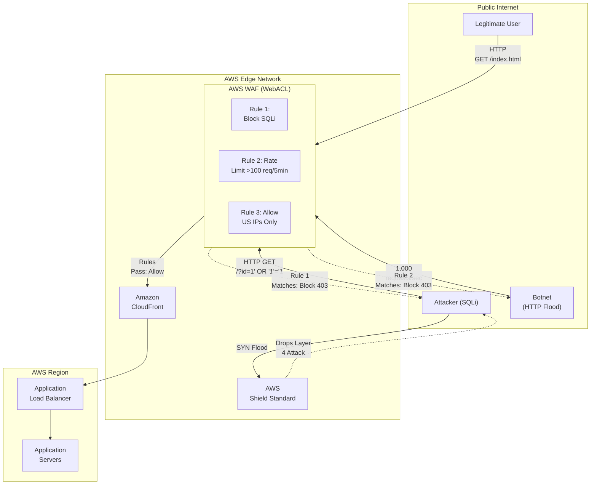
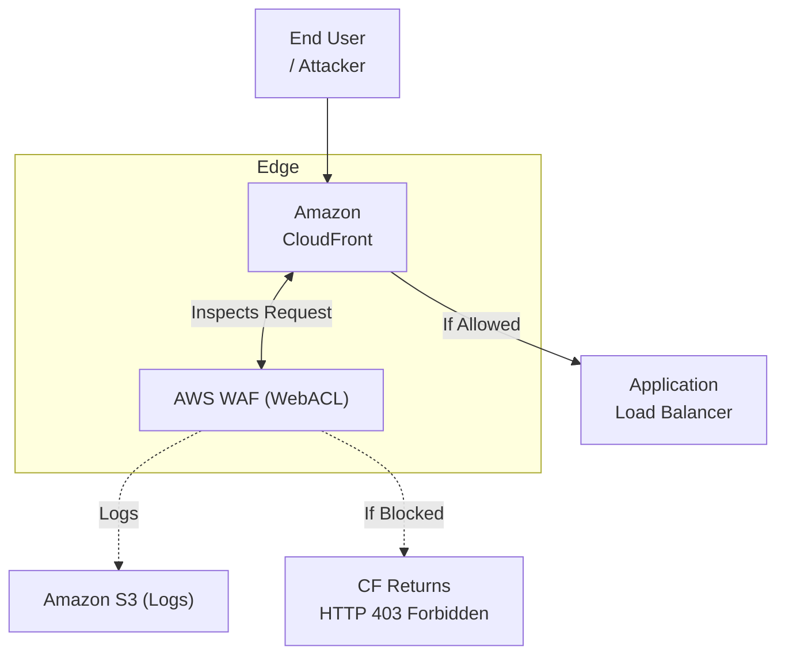
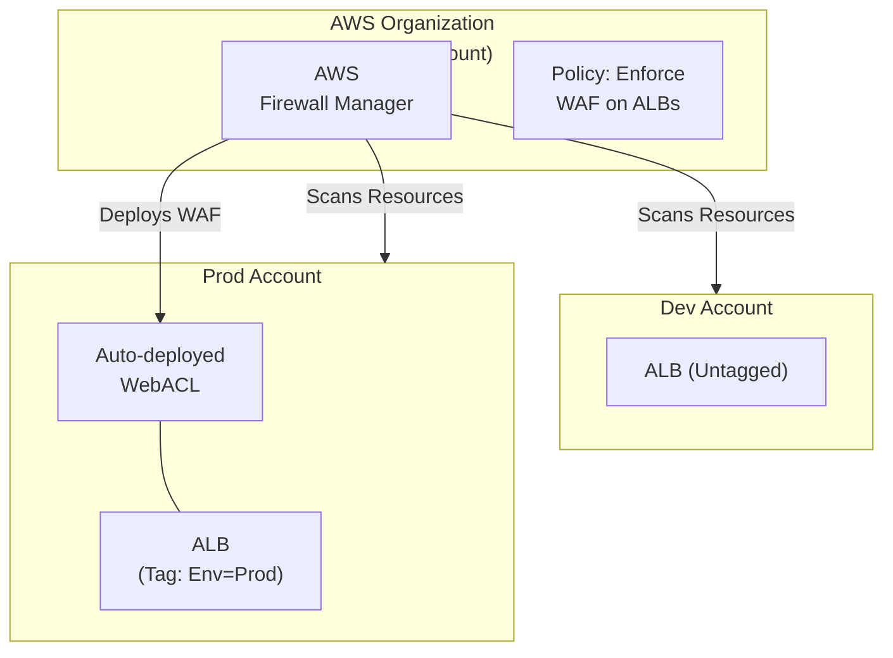

# Chapter 30: AWS WAF & AWS Shield — Edge Security & DDoS Protection

---

## 1. Service Overview

**AWS WAF (Web Application Firewall)** and **AWS Shield** are native AWS security services designed to protect your web applications and APIs from malicious traffic, web exploits, and Distributed Denial of Service (DDoS) attacks. They act as the first line of defense at the AWS perimeter before traffic reaches your internal application infrastructure.

### Why AWS Created It

As internet-facing applications moved to the cloud, they became immediate targets for automated botnets scraping data, SQL injection attempts to steal databases, and volumetric DDoS attacks designed to knock servers offline. Traditionally, companies had to buy expensive, proprietary hardware firewalls (like Imperva or F5) and route traffic through them. AWS created WAF and Shield to provide instantly deployable, globally distributed, software-defined security that scales infinitely and integrates natively with AWS load balancing and content delivery services.

### Key Characteristics

#### AWS WAF
- **Layer 7 Protection**: Inspects HTTP/HTTPS requests (headers, query strings, body) for malicious patterns.
- **Rules & WebACLs**: Uses customizable rules to block, allow, count, or rate-limit requests.
- **Managed Rule Groups**: Provides out-of-the-box rule sets maintained by AWS and third-party security vendors (e.g., OWASP Top 10, Bot Control, Fraud Prevention).
- **Integration**: Attaches directly to CloudFront, Application Load Balancers (ALB), API Gateway, and AppSync.

#### AWS Shield
- **Layer 3/4 Protection**: Protects against infrastructure-layer DDoS attacks (e.g., SYN floods, UDP reflection attacks).
- **Shield Standard**: Free, automatically enabled for every AWS customer. Protects against common, everyday DDoS attacks.
- **Shield Advanced**: Paid enterprise service ($3,000/month). Provides 24/7 access to the AWS DDoS Response Team (DRT), customized mitigation for Layer 7 attacks, and "Cost Protection" (refunds for AWS bills inflated by scaling during a DDoS attack).

---

## 2. Learning Objectives

By the end of this chapter, you will be able to:

- **Architect** perimeter security utilizing CloudFront, WAF, and Shield.
- **Implement** a Web Access Control List (WebACL) to block the OWASP Top 10 vulnerabilities (SQLi, XSS).
- **Configure** Rate-Based Rules to mitigate application-layer (HTTP flood) DDoS attacks.
- **Understand** the difference between Shield Standard and Shield Advanced, and when to justify the enterprise cost.
- **Analyze** WAF logs using Athena to identify attack patterns and tune false positives.
- **Troubleshoot** legitimate users being blocked by WAF (False Positives).

---

## 3. Prerequisites

- **AWS Account** with administrative access
- **Completed chapters**: Chapter 18 (Elastic Load Balancing), Chapter 29 (Amazon CloudFront)
- **Concepts**: HTTP/HTTPS protocols, IP CIDR blocks, basic knowledge of web vulnerabilities (SQL Injection, Cross-Site Scripting).

---

## 4. Real-world Analogy

Think of your web application as a **High-Security Bank**.

- **AWS Shield Standard** is the reinforced concrete walls and the road barriers outside the bank. It stops a mob from driving a truck through the front door (Volumetric DDoS attack) without you having to do anything.
- **AWS WAF** is the intelligent security guard standing at the metal detector inside the door. He checks everyone's pockets and ID. 
  - If you try to bring in a weapon (SQL Injection), he stops you. 
  - If you try to enter the bank 1,000 times in 5 minutes (HTTP Flood), he bans you from entering for a while (Rate Limiting).
  - You (the bank manager) can give the guard a list of known criminals to block automatically (Managed Rules) or a specific person you don't like (Custom IP Blocklist).
- **AWS Shield Advanced** is the direct red-phone to a SWAT team (DDoS Response Team). If a highly sophisticated, coordinated attack is happening, you call them, and they arrive immediately to write custom security policies to save the bank.

---

## 5. Business Use Cases

### Mitigating the OWASP Top 10
- **Preventing Data Breaches**: Automatically blocking HTTP requests that contain SQL commands in the query string or URL, preventing SQL Injection (SQLi) attacks from reaching the backend RDS database.

### Stopping Scraping and Bad Bots
- **Inventory Protection**: An e-commerce site uses AWS WAF Bot Control to block automated scripts from scraping their prices or buying out limited-edition inventory (e.g., sneaker bots).

### Geo-Blocking (Embargoed Countries)
- **Compliance**: A financial services company uses WAF to block all traffic originating from OFAC-sanctioned countries.

### Application-Layer DDoS Defense (HTTP Floods)
- **Protecting Compute Resources**: A massive botnet starts requesting the heavy `/search` endpoint of an application 100,000 times a second. WAF uses a Rate-Based rule to automatically block any IP address making more than 100 requests per 5 minutes, preventing the ALB and ECS cluster from scaling up infinitely and crashing.

---

## 6. Core Concepts

### Web Access Control List (WebACL)
The core container for AWS WAF configuration. You attach a WebACL to an AWS resource (e.g., an ALB). A WebACL contains a list of Rules evaluated in priority order. It has a "Default Action" (usually Allow) that applies if no rules match.

### Rules and Rule Statements
A rule contains a condition (e.g., "Does the URI contain '/admin'?") and an Action (Block, Allow, Count, Captcha).
- **Regular Rules**: Evaluates the request against a pattern (String match, Regex, SQLi detection, XSS detection).
- **Rate-Based Rules**: Tracks requests per IP address. If an IP exceeds a defined threshold (minimum 100 requests) within a 5-minute sliding window, WAF blocks subsequent requests from that IP until the rate drops.

### Managed Rule Groups
Collections of predefined, ready-to-use rules managed by AWS or AWS Marketplace sellers (like Fortinet or F5).
- *AWSManagedRulesCommonRuleSet*: Protects against OWASP Top 10.
- *AWSManagedRulesAmazonIpReputationList*: Blocks traffic from IPs AWS knows are part of botnets.

### WAF Capacity Units (WCUs)
A metric used to calculate the compute resources required to run your rules. Each WebACL has a maximum limit of 5,000 WCUs. Simple rules cost 1-2 WCUs. Complex managed rule groups can cost 700 WCUs.

### Captcha and Challenge
Instead of outright blocking a suspicious request, WAF can present a CAPTCHA puzzle or a silent JavaScript challenge to verify that the client is a real human browser and not an automated Python script.

---

## 7. Internal Architecture



---

## 8. Service Components

### AWS Firewall Manager
A central management service that allows security administrators to configure WAF rules, Shield Advanced protections, and VPC Security Groups across *all* accounts in an AWS Organization. If a developer spins up a new ALB in a dev account, Firewall Manager can automatically attach the corporate standard WAF WebACL to it.

### Shield Advanced Response Team (DRT)
With Shield Advanced, you can grant the AWS DRT access to your WAF logs and WebACLs. During an active attack, they will analyze the traffic and write custom WAF rules on your behalf to mitigate the specific attack pattern.

### WAF Log Destinations
WAF can send complete JSON logs of every inspected request to:
- Amazon S3 (for long term storage and Athena querying)
- CloudWatch Logs (for real-time viewing and Metric Filters)
- Kinesis Data Firehose (to send to Splunk, Datadog, or Elasticsearch)

---

## 9. Configuration

### WAF Rule JSON Representation (SQL Injection Protection)

```json
{
  "Name": "BlockSQLInjection",
  "Priority": 1,
  "Statement": {
    "SqliMatchStatement": {
      "FieldToMatch": {
        "QueryString": {}
      },
      "TextTransformations": [
        {
          "Priority": 0,
          "Type": "URL_DECODE"
        },
        {
          "Priority": 1,
          "Type": "LOWERCASE"
        }
      ]
    }
  },
  "Action": {
    "Block": {}
  },
  "VisibilityConfig": {
    "SampledRequestsEnabled": true,
    "CloudWatchMetricsEnabled": true,
    "MetricName": "BlockSQLInjection"
  }
}
```

---

## 10. Code Examples

### AWS CLI — Common Operations

```bash
# 1. Create an IP Set (e.g., a Blacklist)
aws wafv2 create-ip-set \
    --name "MaliciousIPs" \
    --scope REGIONAL \
    --ip-address-version IPV4 \
    --addresses "198.51.100.0/24" "203.0.113.5/32"

# 2. Get WebACL details
aws wafv2 get-web-acl \
    --name "ProductionWebACL" \
    --scope REGIONAL \
    --id 12345678-abcd-1234-abcd-1234567890ab

# 3. Associate WebACL with an ALB
aws wafv2 associate-web-acl \
    --web-acl-arn arn:aws:wafv2:us-east-1:123456789012:regional/webacl/ProductionWebACL/1234 \
    --resource-arn arn:aws:elasticloadbalancing:us-east-1:123456789012:loadbalancer/app/my-alb/5678
```

### Terraform — Creating a WebACL with Managed Rules and Rate Limiting

```hcl
# Attach the WebACL to an ALB
resource "aws_wafv2_web_acl_association" "main" {
  resource_arn = aws_lb.main.arn
  web_acl_arn  = aws_wafv2_web_acl.main.arn
}

resource "aws_wafv2_web_acl" "main" {
  name        = "production-webacl"
  description = "WAF for Production ALB"
  scope       = "REGIONAL" # Use "CLOUDFRONT" if attaching to CloudFront

  default_action {
    allow {}
  }

  visibility_config {
    cloudwatch_metrics_enabled = true
    metric_name                = "production-webacl"
    sampled_requests_enabled   = true
  }

  # Rule 1: Rate Limiting (Block IPs making > 500 requests per 5 minutes)
  rule {
    name     = "RateLimit500"
    priority = 1

    action {
      block {}
    }

    statement {
      rate_based_statement {
        limit              = 500
        aggregate_key_type = "IP"
      }
    }

    visibility_config {
      cloudwatch_metrics_enabled = true
      metric_name                = "RateLimit500"
      sampled_requests_enabled   = true
    }
  }

  # Rule 2: AWS Managed Core Rule Set (OWASP Top 10)
  rule {
    name     = "AWSManagedRulesCommonRuleSet"
    priority = 2

    override_action {
      none {}
    }

    statement {
      managed_rule_group_statement {
        name        = "AWSManagedRulesCommonRuleSet"
        vendor_name = "AWS"
      }
    }

    visibility_config {
      cloudwatch_metrics_enabled = true
      metric_name                = "AWSManagedRulesCommonRuleSet"
      sampled_requests_enabled   = true
    }
  }
}

# Configure WAF Logging to CloudWatch Logs
resource "aws_cloudwatch_log_group" "waf_log" {
  name = "aws-waf-logs-production"
}

resource "aws_wafv2_web_acl_logging_configuration" "main" {
  log_destination_configs = [aws_cloudwatch_log_group.waf_log.arn]
  resource_arn            = aws_wafv2_web_acl.main.arn
}
```

---

## 11. Line-by-Line Explanation

### Text Transformations in WAF

```json
      "TextTransformations": [
        {
          "Priority": 0,
          "Type": "URL_DECODE"
        },
        {
          "Priority": 1,
          "Type": "LOWERCASE"
        }
      ]
```
Attackers often try to bypass WAF rules by obfuscating their attacks. For example, instead of sending `SELECT *`, they might send `%53%45%4C%45%43%54 *` (URL encoded) or `SeLeCt *`.
- **Text Transformations** execute *before* the rule inspects the payload. 
- WAF first decodes any URL encoding (Priority 0).
- Then it converts all text to lowercase (Priority 1).
- Finally, WAF runs the SQLi detection engine on the normalized text. If you don't configure transformations, attackers will easily bypass your WAF.

---

## 12. Security Deep Dive

### Tuning Managed Rules (The "Count" Action)
When you deploy AWS Managed Rules to a production environment, **NEVER** set them to "Block" immediately.
1. Deploy the WebACL and set the rule action to **Count**.
2. WAF will evaluate traffic, but if it detects an attack, it will just add a log entry and let the request through.
3. Review the logs after 1 week. You will find "False Positives" (e.g., your application legitimately passes JSON that contains SQL-like characters).
4. Write exceptions (Rule Exclusions) for those specific URL paths or parameters.
5. Once false positives are eliminated, change the action to **Block**.

### Shield Advanced vs Standard
Shield Standard protects the AWS network layer (it drops giant UDP reflection attacks before they hit the EC2 hypervisor).
Shield Advanced protects *your specific application's availability*.
- **Cost**: $3,000/month flat fee + data transfer costs.
- **DDoS Response Team (DRT)**: Access to human engineers during an attack.
- **Cost Protection**: If a 100 Gbps DDoS attack hits your ALB and Auto Scaling Group, AWS will refund the massive ALB and EC2 scaling bill you incur.

---

## 13. Monitoring & Observability

### WAF Sampled Requests
In the WAF Console, you can view "Sampled Requests". WAF stores up to 100 requests that matched a specific rule over the last 3 hours. This is the fastest way to troubleshoot a blocked user without diving into complex log analysis. You can see the IP, headers, and the exact rule that triggered the block.

### Athena Log Analysis
For deep forensic analysis, send WAF logs to S3 and query them with Amazon Athena.
**Query Example: Find top blocked IP addresses**
```sql
SELECT httprequest.clientip, count(*) as count 
FROM waf_logs 
WHERE action = 'BLOCK' 
GROUP BY httprequest.clientip 
ORDER BY count DESC 
LIMIT 10;
```

---

## 14. Performance & Cost Optimization

### WAF Cost Model
- **WebACL Fee**: $5.00 per WebACL per month.
- **Rule Fee**: $1.00 per custom rule per month.
- **Request Fee**: $0.60 per 1 million requests inspected.
- **Bot Control / Fraud Prevention**: These advanced managed rules cost significantly more ($1.50 - $2.00 per million requests).

### Optimization Strategies
1. **Filter Traffic Early**: Attach WAF to CloudFront, not the ALB. It is cheaper to block malicious requests at the edge (preventing them from traversing the AWS backbone and hitting your ALB).
2. **Order Rules by Compute Cost**: WAF evaluates rules in order. Place cheap rules (like IP Blocklists or simple String matches) at priority 1. Place expensive rules (like Regex pattern matching or Bot Control) at priority 10. If the request is blocked by Rule 1, Rule 10 is never evaluated, saving latency.

---

## 15. Enterprise Integration

### WAF Automation (Security Automations)
AWS provides a CloudFormation template called "AWS WAF Security Automations". It deploys:
1. An Athena pipeline to parse WAF logs.
2. A Lambda function that parses CloudFront access logs. If it detects an IP generating too many HTTP 404 errors (indicative of a scanner like Nikto or DirBuster), the Lambda function automatically adds that IP to a WAF IP Set Blocklist for 4 hours.

### AWS Firewall Manager
In a multi-account AWS Organization, the Security team creates a Firewall Manager policy. The policy states: "Every CloudFront distribution tagged `Environment=Production` must have the Corporate WebACL attached." Firewall Manager automatically deploys the WebACL across all accounts and prevents developers from detaching it.

---

## 16. Real Industry Use Cases

### Case 1: Retail E-Commerce — Credential Stuffing
**Problem**: Attackers bought lists of stolen username/passwords from the dark web and deployed bots to automatically test them against the e-commerce login page 10,000 times a minute (Credential Stuffing).
**Solution**: Deployed AWS WAF with the **AWS Managed Account Takeover Prevention (ATP)** rule group.
**Result**: WAF analyzed the login requests, detected behavioral anomalies and known bad IPs, and silently blocked or presented CAPTCHAs to the bots, preventing account compromises without affecting real users.

### Case 2: News Media — HTTP Flood Protection
**Problem**: A viral article was targeted by a Layer 7 DDoS attack. A botnet in Russia sent 500,000 HTTP requests per second to the article URL, taking the database offline.
**Solution**: The team deployed a WAF Rate-Based rule: "Block any IP making > 500 requests per 5 minutes to `/*`."
**Result**: The botnet IPs were instantly identified and blocked at the CloudFront edge. Origin traffic returned to normal levels within 2 minutes.

---

## 17. Architecture Patterns

### Pattern 1: Edge Security with CloudFront and WAF


### Pattern 2: Multi-Account Firewall Management


---

## 18. Production Incident War Room

### Incident 1: Legitimate Partner Blocked by WAF (False Positive)
**Severity**: P1 — Critical
**Symptoms**: A B2B partner reports that their automated API integration suddenly started returning HTTP 403 Forbidden errors.
**Investigation**:
1. Go to WAF Console -> WebACL -> Sampled Requests. Filter by the partner's IP address.
2. The sampled request shows the Action was `BLOCK`. The Rule that matched was `AWSManagedRulesCommonRuleSet`, specifically the `CrossSiteScripting_BODY` rule.
3. Review the JSON body the partner sent: `{"message": "<script>alert('test')</script>"}`. The partner was legitimately trying to send a snippet of HTML code as data, which triggered the XSS protection.
**Root Cause**: The WAF XSS rule is too broad for this specific API endpoint which expects HTML input.
**Permanent Fix**: 
Create a Rule Exception. Add a custom rule *above* the Managed Rule Group: 
`If URI starts with /api/partner AND IP is Partner_IP -> ALLOW`. 
Because WAF rules are evaluated in priority order, the request is explicitly allowed before it ever reaches the Managed Rule Group.

### Incident 2: Rate Limiting Blocking Office Network (NAT Issue)
**Severity**: P2 — High
**Symptoms**: An entire corporate office (500 employees) is suddenly blocked from accessing the company's internal web application, receiving WAF 403 errors.
**Investigation**:
1. Check WAF Sampled Requests. The rule triggering the block is `RateLimit-500` (blocks IPs making >500 req/5min).
2. Check the IP address being blocked. It is `198.51.100.15`.
3. The IT team confirms `198.51.100.15` is the public IP of the corporate office's NAT Gateway.
**Root Cause**: WAF rate limiting tracks the *Source IP*. Because 500 employees were browsing the app behind a single NAT Gateway, WAF saw 5,000 requests coming from a single IP address (`198.51.100.15`) and assumed it was a botnet.
**Permanent Fix**: Add the corporate NAT IP to a WAF IP Set (SafeList). Create a custom rule at Priority 1: `If IP is in SafeList -> ALLOW`. This overrides the Rate Limit rule below it.

### Incident 3: WAF Not Blocking Traffic to ALB
**Severity**: P2 — High
**Symptoms**: WAF is attached to CloudFront. A security scan reveals that the backend Application Load Balancer is still susceptible to SQL injection attacks.
**Investigation**:
1. WAF logs show no SQLi attempts being blocked.
2. Check the security scanner configuration. The scanner is hitting the ALB's public DNS name directly (`my-alb-1234.us-east-1.elb.amazonaws.com`), bypassing CloudFront entirely.
**Root Cause**: Because WAF was attached to CloudFront, and the ALB was open to the internet (`0.0.0.0/0`), attackers (and scanners) could bypass the WAF perimeter.
**Permanent Fix**: Restrict the ALB Security Group to only allow inbound traffic from the AWS Managed Prefix List for CloudFront. Now, all traffic MUST go through CloudFront, forcing it to be inspected by WAF.

### Incident 4: WAF Payload Size Limit Bypass
**Severity**: P2 — High
**Symptoms**: An attacker successfully uploaded a malicious payload to the application despite the OWASP Managed Rule Group being active.
**Investigation**:
1. AWS WAF has a hard limit: it only inspects the first 8 KB (or 16 KB / 64 KB depending on config) of the HTTP request body.
2. The attacker sent an HTTP POST request with 9 KB of junk data, followed by the SQL injection payload at the 10th KB.
**Root Cause**: WAF stopped inspecting after 8 KB, didn't see the malicious payload, and allowed the request.
**Permanent Fix**: In the WebACL configuration, you must define what WAF should do if the body exceeds the inspection limit. Set the Oversize Handling action to **BLOCK** for sensitive endpoints, or **MATCH** (assume it's malicious). Never set it to **CONTINUE** (ignore and allow) for untrusted inputs.

---

## 19. Production Best Practices (Well-Architected)

### Security
- **Defense in Depth**: Use CloudFront + WAF + ALB. WAF stops layer 7 exploits, CloudFront absorbs volumetric traffic, and the ALB distributes the clean traffic to private subnets.
- **Fail Open vs Fail Closed**: Be careful with Oversize Body handling. Blocking oversize bodies might break legitimate large file uploads. Use custom WAF rules scoped only to specific URI paths (e.g., exclude `/upload` from size limits).

### Reliability
- **Regional vs Global**: WAF WebACLs are either Regional (attached to ALB/API Gateway) or Global (attached to CloudFront). You cannot share them. Always prefer Global WAF attached to CloudFront to stop attacks at the edge before they consume AWS backbone bandwidth.

### Operational Excellence
- **Infrastructure as Code**: Always define WAF rules in Terraform/CloudFormation. WAF configurations often require rollbacks when false positives occur, and IaC makes reverting trivial.
- **Log Retention**: Store WAF logs in S3 with a lifecycle policy transitioning to Glacier after 30 days. These logs are critical for post-incident forensic analysis.

---

## 20. Migration Strategies
- **Data Migration**: Use AWS DataSync or native export/import tools for zero-downtime AWS WAF and AWS Shield migration.
- **State Migration**: Adopt Terraform import blocks to bring existing AWS WAF and AWS Shield resources into Infrastructure as Code.

## 21. CI/CD Integration

### Amazon API Gateway
API Gateway can have a regional WAF WebACL attached to protect REST APIs from SQLi, XSS, and massive API scraping. However, API Gateway provides its own Usage Plans and API Keys for rate limiting, which are often better suited for API management than WAF Rate Rules.

### AWS Managed Prefix Lists
AWS publishes lists of IP ranges (e.g., the IPs of all CloudFront Edge nodes). You use these in VPC Security Groups to ensure traffic to your backend resources originated from the trusted CloudFront/WAF perimeter.

---

## 22. Practical Projects

### Beginner Project: Basic AWS WAF and AWS Shield Deployment
- **Business Requirement**: Deploy baseline AWS WAF and AWS Shield resources securely.
- **Architecture**: Single-region deployment with default VPC subnets and restricted IAM roles.
- **Implementation**: Write a Terraform main.tf to provision AWS WAF and AWS Shield and apply the configuration. Verify resource creation in the AWS Console.

### Intermediate Project: Multi-AZ Scalable AWS WAF and AWS Shield Setup
- **Business Requirement**: Implement high availability and automated scaling for AWS WAF and AWS Shield to withstand Availability Zone failures.
- **Architecture**: Application Load Balancer -> Auto Scaling Group -> AWS WAF and AWS Shield -> KMS Encrypted Persistence Layer.
- **Implementation**: Configure scaling policies based on CPU utilization and set up CloudWatch Alarms for monitoring metrics.

### Advanced Project: Automated CI/CD Pipeline Integration
- **Business Requirement**: Automate the deployment and testing of AWS WAF and AWS Shield infrastructure without manual intervention.
- **Architecture**: GitHub Repository -> AWS CodePipeline -> AWS CodeBuild -> Deployment to AWS WAF and AWS Shield Targets.
- **Implementation**: Write a uildspec.yml to run automated security linting (e.g., tfsec or Checkov) before deploying the AWS WAF and AWS Shield changes.

### Enterprise Project: Zero-Trust Multi-Account Architecture
- **Business Requirement**: Deploy a production-grade multi-account enterprise environment utilizing AWS WAF and AWS Shield with centralized security governance.
- **Architecture**: AWS Organizations -> AWS Transit Gateway -> Hub-and-Spoke VPCs -> Multi-AZ AWS WAF and AWS Shield -> AWS IAM Identity Center SSO.
- **Implementation**: Implement Service Control Policies (SCPs) to restrict AWS WAF and AWS Shield deployments to approved regions and mandate AWS KMS customer-managed keys (CMKs) for all data at rest.

---

## 23. Interview Preparation

### Beginner
**Q1**: What is the difference between AWS WAF and AWS Shield?
**A**: Shield protects the infrastructure against volumetric Layer 3/4 DDoS attacks (like SYN floods). WAF protects the application at Layer 7 against web exploits (like SQL Injection) and HTTP floods.

**Q2**: How do you block traffic from a specific country in AWS?
**A**: Create an AWS WAF WebACL, add a Geo-Match rule, select the country, set the action to Block, and attach it to CloudFront or the ALB.

### Intermediate
**Q3**: You deployed a Managed WAF Rule, and suddenly legitimate users are getting 403 Forbidden errors. How do you troubleshoot and fix this without completely disabling the firewall?
**A**: Look at the "Sampled Requests" in the WAF console or query WAF logs to identify which specific rule inside the managed rule group is causing the false positive. Change the action of the Managed Rule Group to "Count" to restore service immediately. Then, write a Rule Exception allowing the specific URI or parameter, and switch the group back to "Block".

**Q4**: What does a WAF Rate-Based rule track to determine if it should block traffic?
**A**: It tracks the number of requests originating from a single IP address (or a specific HTTP header/cookie if configured) over a rolling 5-minute window. If the threshold (e.g., 100 requests) is exceeded, it blocks further requests until the rate drops.

### Advanced
**Q5**: An attacker is sending a 10 MB HTTP POST request. The first 9.9 MB is junk text, and the last 0.1 MB contains a massive SQL injection attack. Will the AWS Managed Core Rule Set block this?
**A**: By default, no. WAF only inspects the first 8 KB (configurable up to 64 KB) of the request body to maintain low latency. Because the SQL injection was hidden at the end of the 10 MB payload, WAF won't see it. You must explicitly configure the "Oversize Handling" behavior in the WAF rule to BLOCK requests whose bodies exceed the inspection limit if the endpoint is highly sensitive.

---

## 24. AWS Certification Practice

**Q1**: A company is hosting a serverless API using Amazon API Gateway and AWS Lambda. They are experiencing application-layer DDoS attacks where a botnet is overwhelming a specific API endpoint (`/search`) with millions of legitimate-looking HTTP requests. Which AWS service should be used to mitigate this attack?
- A) AWS Shield Standard
- B) VPC Network Access Control Lists (NACLs)
- **C) AWS WAF with a Rate-Based Rule** ✓
- D) AWS CloudTrail

**Q2**: A financial institution wants to automatically block web requests that originate from known malicious IP addresses associated with botnets and malware. They do not have the resources to maintain this list of IPs manually. What is the most efficient solution?
- A) Write a Lambda function to parse VPC Flow Logs and update Security Groups.
- B) Subscribe to AWS Shield Advanced and ask the DRT to block IPs.
- **C) Attach AWS WAF to the application and enable the Amazon IP Reputation List managed rule group.** ✓
- D) Use Amazon GuardDuty to block the traffic at the Route 53 level.

---

## 25. Knowledge Check

1. **What is a WebACL?** A Web Access Control List; the container for WAF rules attached to an AWS resource.
2. **What action should you use when testing a new WAF rule in production?** Count.
3. **What is the minimum threshold for a Rate-Based Rule?** 100 requests per 5 minutes.
4. **Which service allows you to centrally deploy WAF rules across an entire AWS Organization?** AWS Firewall Manager.
5. **Does Shield Standard cost money?** No, it is free and automatically enabled.
6. **How do you investigate why WAF blocked a request quickly?** Check Sampled Requests in the console.

---

## 26. Cheat Sheet

| Feature | Description |
|---------|-------------|
| **WAF** | Layer 7 firewall. Protects against SQLi, XSS, bots, HTTP floods. |
| **Shield Standard** | Free Layer 3/4 DDoS protection. Always on. |
| **Shield Advanced** | Paid enterprise DDoS protection. Includes DRT access & cost protection. |
| **WebACL** | The policy object attached to CloudFront, ALB, or API Gateway. |
| **Rule Action** | Block, Allow, Count, CAPTCHA. |
| **Rate-Based Rule** | Blocks IPs exceeding X requests per 5 minutes. |
| **Firewall Manager** | Centrally manages WAF across an AWS Organization. |

---

## 27. Chapter Summary

AWS WAF and Shield form the foundation of AWS perimeter security. Key takeaways:

- **WAF** is for application logic (Layer 7). Use it to stop OWASP vulnerabilities and rate-limit bad actors.
- **Shield** is for network volume (Layer 3/4). Standard is free, Advanced is for enterprises that require dedicated human support during massive DDoS attacks.
- Always deploy new WAF rules in **Count** mode to identify and eliminate false positives before switching to **Block**.
- For maximum cost-efficiency and performance, attach your WAF WebACL to **Amazon CloudFront** to block attacks at the global edge, rather than letting malicious traffic reach your regional Application Load Balancers.

---

## 28. Further Learning

### AWS Documentation
- [AWS WAF Developer Guide](https://docs.aws.amazon.com/waf/latest/developerguide/waf-chapter.html)
- [AWS Managed Rules for WAF](https://docs.aws.amazon.com/waf/latest/developerguide/aws-managed-rule-groups-list.html)
- [AWS Shield Advanced Overview](https://docs.aws.amazon.com/waf/latest/developerguide/shield-chapter.html)

### Related Chapters
- **Chapter 29 — Amazon CloudFront**: The primary attachment point for global AWS WAF deployments.
- **Chapter 18 — Elastic Load Balancing**: The primary attachment point for regional AWS WAF deployments.
- **Chapter 31 — AWS Organizations**: Required for managing WAF centrally via AWS Firewall Manager.
