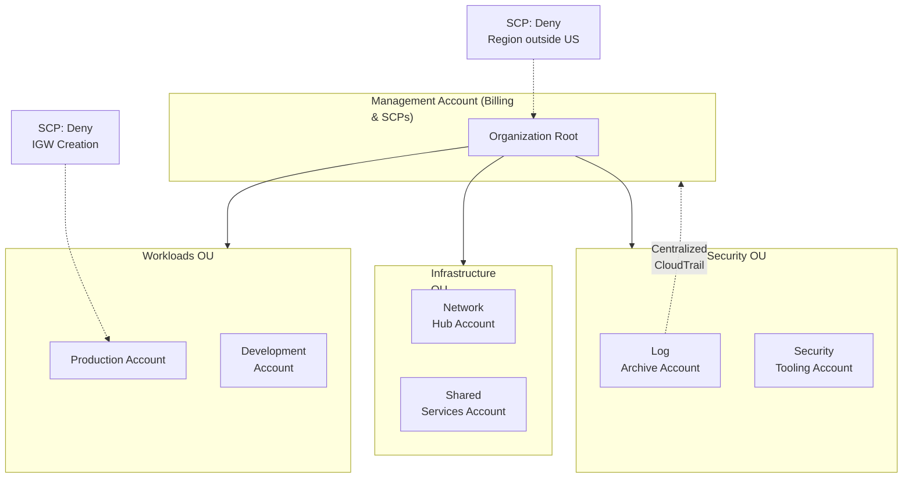
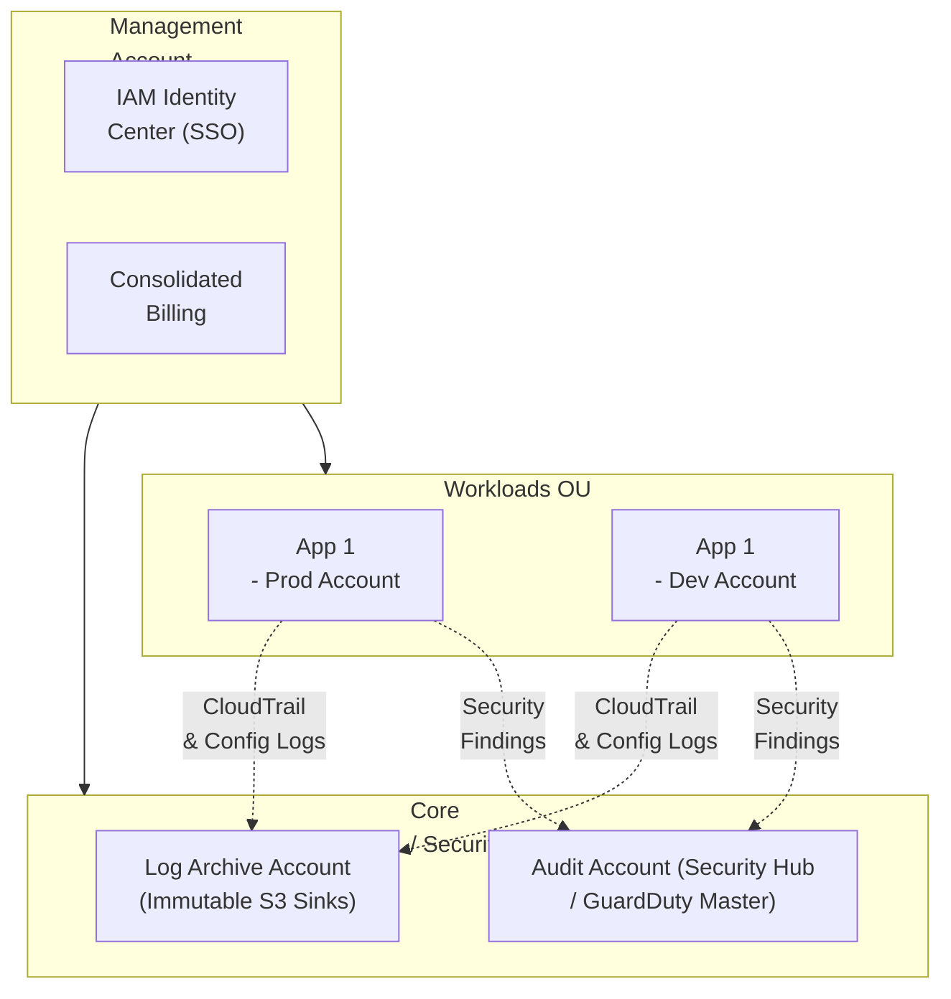

# Chapter 31: AWS Organizations & Control Tower — Enterprise Governance

---

## 1. Service Overview

**AWS Organizations** and **AWS Control Tower** are foundational governance services used to manage, secure, and scale multiple AWS accounts centrally. 

### Why AWS Created Them

In the early days of cloud computing, companies ran everything inside a single AWS account. As companies grew, this "single account monolith" became a nightmare: developers accidentally deleted production databases, billing was impossible to untangle, and hitting AWS API rate limits caused widespread outages.

The solution was the **Multi-Account Strategy**: creating separate AWS accounts for Development, Production, Security, and Shared Services. However, managing hundreds of isolated AWS accounts manually was chaotic. AWS created **AWS Organizations** to provide centralized billing and policy enforcement across accounts. They later released **AWS Control Tower** to automate the creation of these multi-account environments using strict, AWS-validated best practices.

### Key Characteristics

#### AWS Organizations
- **Consolidated Billing**: Rolls up the billing of all member accounts into one single invoice paid by the Management Account. Shares volume discounts across all accounts.
- **Service Control Policies (SCPs)**: The ultimate security guardrail. SCPs allow you to explicitly restrict what IAM users and roles in member accounts can do, regardless of their local IAM permissions.
- **Organizational Units (OUs)**: Logical groupings of accounts (e.g., `Prod-OU`, `Dev-OU`) to apply different SCPs.

#### AWS Control Tower
- **The "Easy Button" for Landing Zones**: Automates the setup of a secure, multi-account AWS environment (a Landing Zone) using AWS Organizations under the hood.
- **Account Factory**: A standardized vending machine for creating new AWS accounts. Ensures every new account automatically has CloudTrail enabled, Security Hub turned on, and standard VPCs deployed.
- **Guardrails (Controls)**: Pre-packaged preventative (SCPs) and detective (AWS Config) rules. For example, a single click can enable a guardrail that says: "Disallow public read access to any S3 bucket across the entire enterprise."

---

## 2. Learning Objectives

By the end of this chapter, you will be able to:

- **Architect** a scalable multi-account structure using Organizational Units (OUs).
- **Understand** the difference between the Management Account and Member Accounts.
- **Write** and test Service Control Policies (SCPs) to establish immutable security boundaries.
- **Deploy** AWS Control Tower to establish an automated Landing Zone.
- **Automate** new account creation using the Control Tower Account Factory.
- **Troubleshoot** permission issues where SCPs conflict with IAM policies.

---

## 3. Prerequisites

- **AWS Account** with administrative access (Ideally a fresh account to serve as the Management Account).
- **Completed chapters**: Chapter 1 (IAM), Chapter 26 (CloudTrail), Chapter 27 (AWS Config).
- **Concepts**: Root user security, IAM policy evaluation logic, multi-account architectures.

---

## 4. Real-world Analogy

Think of **AWS Organizations** as a **Corporate Holding Company**, and **Control Tower** as the **Corporate Franchise Rulebook**.

If you own 50 McDonald's restaurants (50 AWS Accounts):
- **AWS Organizations** is the central holding company. It pays the single massive electricity bill for all 50 restaurants (Consolidated Billing). The holding company issues a hard rule: "No restaurant may serve pizza" (**Service Control Policy**). Even if a local restaurant manager (Local IAM Admin) tries to put pizza on the menu, the holding company's rule overrides them.
- **AWS Control Tower** is the franchise rapid-deployment team. When you want to open the 51st restaurant, you push a button (Account Factory). The team builds the restaurant exactly to corporate spec: the cameras are automatically installed pointing at the registers (CloudTrail), the locks are standardized (IAM Identity Center), and the health inspector checklist is automatically applied (Guardrails).

---

## 5. Business Use Cases

### Billing Isolation and Optimization
- **Cost Allocation**: An enterprise spins up separate AWS accounts for the Marketing, Engineering, and Data Science teams. Consolidated billing provides a single invoice, but tags allow finance to charge back exact costs to each department. Volume discounts (e.g., S3 tiering) apply to the combined usage of all accounts.

### Blast Radius Reduction
- **Production Isolation**: If a junior developer's access keys in the `Sandbox` AWS account are leaked to a hacker, the hacker can only destroy the `Sandbox` account. They cannot touch the completely isolated `Production` AWS account.

### Regulatory Compliance
- **Data Residency Enforcement**: A European healthcare company uses an SCP attached to their entire AWS Organization that explicitly denies the `ec2:RunInstances` and `s3:CreateBucket` actions in any region other than `eu-central-1`. This guarantees mathematically that no developer can accidentally spin up servers in the US, violating GDPR.

---

## 6. Core Concepts

### The Management Account
The "root" account of the Organization. It pays the bills. It is highly restricted. **Best Practice**: Absolutely no application workloads (EC2, RDS) should ever run in the Management Account. It should only be used for billing and security configuration.

### Organizational Units (OUs)
Folders that contain AWS accounts. You apply SCPs to OUs.
Standard OU structure:
- **Security OU**: Contains the Log Archive account and Security Tooling account.
- **Workloads OU**: Contains Prod, Dev, and Test accounts.
- **Infrastructure OU**: Contains Shared Services (e.g., central CI/CD servers) and Networking (e.g., Transit Gateway, central Direct Connect).

### Service Control Policies (SCPs)
JSON policies that look exactly like IAM policies, but they do not grant permissions. They define the *maximum available permissions* for an account. If an SCP denies `s3:DeleteBucket`, then even the root user of the member account cannot delete an S3 bucket.

### IAM Identity Center (formerly AWS SSO)
Integrated natively with Organizations. Instead of creating IAM users in 50 different accounts, employees log in once to a central portal using their corporate Active Directory/Okta credentials, and click into the specific AWS accounts they have permission to access.

---

## 7. Internal Architecture



---

## 8. Service Components

### AWS Control Tower Guardrails
Control Tower abstracts the complexity of writing SCPs and AWS Config rules by providing plain-English "Guardrails".
- **Preventative Guardrails**: Powered by SCPs. (e.g., "Disallow changes to IAM roles set up by Control Tower"). These physically block the action from happening.
- **Detective Guardrails**: Powered by AWS Config rules. (e.g., "Detect whether public read access to Amazon S3 buckets is allowed"). If a bucket is made public, it flags the account as non-compliant in the Control Tower dashboard.

### Control Tower Account Factory
A Service Catalog portfolio that automates account provisioning. It sets up the VPC, configures CloudTrail to send logs to the central Log Archive account, integrates with Identity Center, and places the account in the correct OU.

---

## 9. Configuration

### SCP Examples

**1. Deny leaving the AWS Organization**
You don't want a rogue admin removing their account from the corporate billing umbrella.
```json
{
  "Version": "2012-10-17",
  "Statement": [
    {
      "Effect": "Deny",
      "Action": "organizations:LeaveOrganization",
      "Resource": "*"
    }
  ]
}
```

**2. Enforce Data Residency (Deny regions outside US-EAST-1 and US-WEST-2)**
```json
{
  "Version": "2012-10-17",
  "Statement": [
    {
      "Effect": "Deny",
      "NotAction": [
        "iam:*",
        "organizations:*",
        "route53:*",
        "cloudfront:*"
      ],
      "Resource": "*",
      "Condition": {
        "StringNotEquals": {
          "aws:RequestedRegion": [
            "us-east-1",
            "us-west-2"
          ]
        }
      }
    }
  ]
}
```
*Note: We use `NotAction` to exclude global services (like IAM and CloudFront) that operate in `us-east-1` but are required globally.*

---

## 10. Code Examples

### AWS CLI — Common Operations

```bash
# 1. Create a new AWS Organization (Run from the Management Account)
aws organizations create-organization --feature-set ALL

# 2. Create an Organizational Unit (OU)
aws organizations create-organizational-unit \
    --parent-id r-exampleroot \
    --name ProductionWorkloads

# 3. Create a new AWS Account and add it to the Organization
aws organizations create-account \
    --email prod-admin@company.com \
    --account-name "Prod-App-1"

# 4. Create an SCP
aws organizations create-policy \
    --content file://scp-deny-s3-public.json \
    --description "Deny public S3 buckets" \
    --name "DenyPublicS3" \
    --type SERVICE_CONTROL_POLICY

# 5. Attach the SCP to an OU
aws organizations attach-policy \
    --policy-id p-12345678 \
    --target-id ou-exam-ple123
```

### Terraform — Managing an Organization

```hcl
# The Organization
resource "aws_organizations_organization" "org" {
  feature_set = "ALL"
  enabled_policy_types = [
    "SERVICE_CONTROL_POLICY",
    "BACKUP_POLICY",
    "TAG_POLICY"
  ]
}

# Organizational Units
resource "aws_organizations_organizational_unit" "security" {
  name      = "Security"
  parent_id = aws_organizations_organization.org.roots[0].id
}

resource "aws_organizations_organizational_unit" "workloads" {
  name      = "Workloads"
  parent_id = aws_organizations_organization.org.roots[0].id
}

# A Member Account
resource "aws_organizations_account" "prod" {
  name      = "Production-App"
  email     = "aws-prod@company.com"
  parent_id = aws_organizations_organizational_unit.workloads.id
  
  # Automatically create this role in the new account allowing Management Account access
  role_name = "OrganizationAccountAccessRole" 
}

# An SCP
resource "aws_organizations_policy" "deny_igw" {
  name        = "DenyInternetGatewayCreation"
  description = "Prevents VPCs from being connected to the public internet"
  type        = "SERVICE_CONTROL_POLICY"

  content = jsonencode({
    Version = "2012-10-17"
    Statement = [
      {
        Effect   = "Deny"
        Action   = [
          "ec2:CreateInternetGateway",
          "ec2:AttachInternetGateway"
        ]
        Resource = "*"
      }
    ]
  })
}

# Attach SCP to Workloads OU
resource "aws_organizations_policy_attachment" "workloads_deny_igw" {
  policy_id = aws_organizations_policy.deny_igw.id
  target_id = aws_organizations_organizational_unit.workloads.id
}
```

---

## 11. Line-by-Line Explanation

### Account Creation via Organizations

```hcl
resource "aws_organizations_account" "prod" {
  name      = "Production-App"
  email     = "aws-prod@company.com"
  parent_id = aws_organizations_organizational_unit.workloads.id
  role_name = "OrganizationAccountAccessRole" 
}
```
- **`email`**: Must be a globally unique email address not currently associated with any AWS account. Many companies use email aliases (e.g., `aws+prod@company.com`).
- **`role_name`**: When the account is created, Organizations automatically creates an IAM Role in the new account with `AdministratorAccess`. It sets the trust policy so that IAM users in the Management Account can `AssumeRole` into this new account to configure it. Without this role, you would have to log in as the root user of the new account (which requires doing a password reset on the email address).

---

## 12. Security Deep Dive

### SCP Evaluation Logic
IAM evaluation logic spans across standard IAM policies, resource policies (like S3 bucket policies), and SCPs.
**Rule of Thumb**: An action is only allowed if it is explicitly allowed by an IAM policy **AND** it is not explicitly denied by an SCP **AND** it is explicitly allowed by any applicable SCPs (by default, the `FullAWSAccess` SCP is attached to all OUs, which satisfies the explicit allow).
If an SCP denies `s3:DeleteBucket`, and an IAM Admin attaches an `AdministratorAccess` policy to a developer, the developer *still cannot* delete an S3 bucket. The SCP always wins.

### Securing the Management Account
SCPs do **NOT** apply to the Management Account. They only apply to member accounts. Therefore, if your Management Account is compromised, SCPs will not protect it.
- **Best Practice**: Enable MFA on the root user of the Management account, lock the hardware token in a safe, and never use the root user again.
- **Best Practice**: Never run EC2 instances, S3 buckets with data, or applications in the Management Account. Treat it solely as a billing and policy router.

### Moving Accounts Between OUs
When you move an account from `Dev-OU` to `Prod-OU`, the SCPs attached to `Prod-OU` are applied instantly. This is a common pattern for "promoting" an account, removing its ability to spin up unapproved instance types or modify networking once it hits production status.

---

## 13. Monitoring & Observability

### Centralized CloudTrail
In a multi-account setup, you do not want developers tampering with CloudTrail logs in their local accounts to hide malicious activity.
With AWS Organizations, you create an **Organization Trail** in the Management Account. It automatically deploys a CloudTrail to every member account, configures them to log everything, and routes those logs directly to a secure S3 bucket in a dedicated Log Archive account. Member account admins cannot modify or delete this trail, even with `AdministratorAccess`.

### Cost Explorer
The Management account has visibility into the billing of all member accounts. You can use Cost Explorer to filter costs by `Linked Account` (Member account) or by `Tag` across the entire organization.

---

## 14. Performance & Cost Optimization

### SCPs for Cost Control
You can use SCPs to prevent expensive mistakes.
- Create an SCP that explicitly denies `ec2:RunInstances` for expensive GPU instance families (e.g., `p3.*`, `p4.*`) unless the account is in the `DataScience-OU`.
- Create an SCP denying the purchase of Savings Plans or Reserved Instances in member accounts, ensuring all reservations are purchased centrally in the Management Account to maximize utilization.

---

## 15. Enterprise Integration

### Integrating with Third-Party Identity Providers (IdP)
AWS IAM Identity Center (the successor to AWS SSO) integrates natively with Organizations. You connect Identity Center to your corporate Active Directory or Okta via SAML 2.0. You then define "Permission Sets" (e.g., `DeveloperAccess`, `DatabaseAdmin`). You assign AD Groups to specific AWS Accounts with specific Permission Sets. 
When an employee joins the AD group, they instantly gain role-based access to the correct AWS accounts. When they leave the company and are removed from AD, their AWS access is instantly revoked across all 50 accounts.

### AWS Backup
You can create cross-account Backup Policies in Organizations. You define the policy in the Management Account, and it automatically enforces that all EC2 instances in all member accounts are backed up daily.

---

## 16. Real Industry Use Cases

### Case 1: SaaS Provider — Tenant Isolation
**Problem**: A SaaS company ran thousands of customer databases in a single AWS account. A misconfiguration caused Customer A to access Customer B's data. They needed strict isolation.
**Solution**: They migrated to a multi-account strategy using AWS Organizations. Each SaaS tenant was deployed into their own dedicated AWS Member Account.
**Result**: Complete physical and logical isolation. Cross-tenant data breaches became mathematically impossible due to the hard boundary of the AWS account.

### Case 2: Financial Services — Automated Compliance
**Problem**: A bank required that all EBS volumes be encrypted, all S3 buckets be private, and CloudTrail be enabled in all regions. Auditing this manually across 100 accounts was impossible.
**Solution**: Deployed AWS Control Tower. They enabled preventative guardrails (SCPs) to physically block the creation of unencrypted EBS volumes. They enabled detective guardrails to flag non-compliant accounts.
**Result**: Achieved continuous compliance. When a team needed a new AWS account, Account Factory provisioned it in 20 minutes with all security baselines pre-installed.

---

## 17. Architecture Patterns

### Pattern 1: The AWS Control Tower Landing Zone


---

## 18. Production Incident War Room

### Incident 1: AdministratorAccess Still Denied
**Severity**: P2 — High
**Symptoms**: A developer in a member account is trying to create an IAM role. The developer has the `AdministratorAccess` managed policy attached to their IAM user. The AWS Console throws: `AccessDenied: User is not authorized to perform: iam:CreateRole with an explicit deny`.
**Investigation**:
1. Verify the user has `AdministratorAccess` (Yes).
2. Check AWS CloudTrail. The error message indicates an explicit deny.
3. Because the user is an admin, the explicit deny must be coming from an SCP or a Permissions Boundary.
**Root Cause**: The Management Account attached an SCP to the OU preventing the creation of IAM roles that do not include a specific corporate permission boundary. The SCP overrides local Administrator privileges.
**Permanent Fix**: The developer must include the required permission boundary ARN when creating the IAM role, complying with the SCP conditions.

### Incident 2: Services Failing in New Regions
**Severity**: P1 — Critical
**Symptoms**: A team deployed their application to the `eu-west-1` (Ireland) region. Everything worked. A week later, they attempt to deploy to `ap-south-1` (Mumbai). All API calls to `ec2:RunInstances` fail with Access Denied.
**Investigation**:
1. Check the IAM role deployed to Mumbai. It is identical to Ireland.
2. Check Organizations SCPs attached to the account.
**Root Cause**: A Data Residency SCP was active on the OU. It explicitly denied all actions where the `aws:RequestedRegion` was not `us-east-1` or `eu-west-1`.
**Permanent Fix**: Request an exemption from the Cloud Center of Excellence (CCoE) team. The CCoE team moves the AWS account to a different OU (e.g., `GlobalWorkloads-OU`) that does not have the restrictive region SCP.

### Incident 3: CloudTrail Logs Stopped Flowing
**Severity**: P1 — Critical
**Symptoms**: Security analysts notice that CloudTrail logs for a specific member account have stopped arriving in the central Log Archive S3 bucket.
**Investigation**:
1. Log into the affected member account. Check CloudTrail.
2. The trail status is `Stopped`.
**Root Cause**: A rogue admin in the member account manually turned off CloudTrail to hide their tracks before launching unauthorized cryptocurrency mining EC2 instances.
**Permanent Fix**: 
1. Use an Organization Trail instead of local trails. Member admins cannot stop Organization Trails.
2. Apply a Control Tower preventative guardrail (SCP) that explicitly denies `cloudtrail:StopLogging` and `cloudtrail:DeleteTrail` in all member accounts.

### Incident 4: Account Creation Failing in Control Tower
**Severity**: P2 — High
**Symptoms**: A developer requests a new AWS account via Control Tower Account Factory. The request fails after 45 minutes.
**Investigation**:
1. Check AWS Service Catalog provisioned products. It shows a failure state.
2. Check CloudTrail in the Management account for `CreateAccount` API errors.
**Root Cause**: The email address provided for the new AWS account was already used as the root email for an old, closed AWS account, or as an Amazon.com retail account email. AWS requires a strictly unique email address globally.
**Permanent Fix**: Instruct developers to use standard alias formats (e.g., `aws-prod+appname@company.com`) to ensure global uniqueness, and resubmit the Account Factory request.

---

## 19. Production Best Practices (Well-Architected)

### Security
- **Never Use Root in Member Accounts**: Once an account is created via Organizations, you should never need to log in as the root user of that member account. Perform all setup using IAM roles assumed from the Management account or via Identity Center.
- **Enable SCPs**: By default, an organization has all features enabled, but SCPs must be explicitly turned on at the organizational root before you can attach them.

### Operational Excellence
- **Tag Policies**: Enforce tagging standards (e.g., `CostCenter`, `Environment`) across all accounts using Organizations Tag Policies. This prevents resources from being created without the required tags, fixing billing allocation issues.
- **AWS RAM (Resource Access Manager)**: Share centralized resources (like a Transit Gateway or central Route 53 Resolver rules) from the Infrastructure account directly to the Organization or specific OUs, eliminating the need to accept resource shares manually in every account.

---

## 20. Migration Strategies

### Inviting Existing Accounts
If your company has 10 unmanaged AWS accounts created by different teams on company credit cards:
1. Create the AWS Organization in the designated Management Account.
2. Send an **Invitation** from the Organization to the Account IDs of the unmanaged accounts.
3. The owner of the unmanaged account must log in as root and accept the invitation.
4. Once accepted, billing is instantly consolidated to the Management account, and the Management account can begin applying SCPs.

---

## 21. CI/CD Integration

### Automating Account Provisioning
Enterprises rarely use the AWS Console to create accounts.
1. A developer submits a Jira ticket requesting an account.
2. A webhook triggers an AWS Lambda function.
3. The Lambda function calls the AWS Service Catalog API to trigger the Control Tower Account Factory.
4. Once the account is created, an EventBridge event triggers a CI/CD pipeline (e.g., Terraform Cloud) that deploys the baseline application VPCs and security groups into the new account.

---

## 22. Practical Projects

### Beginner Project: Basic AWS Organizations and Control Tower Deployment
- **Business Requirement**: Deploy baseline AWS Organizations and Control Tower resources securely.
- **Architecture**: Single-region deployment with default VPC subnets and restricted IAM roles.
- **Implementation**: Write a Terraform `main.tf` to provision AWS Organizations and Control Tower and apply the configuration. Verify resource creation in the AWS Console.

### Intermediate Project: Multi-AZ Scalable AWS Organizations and Control Tower Setup
- **Business Requirement**: Implement high availability and automated scaling for AWS Organizations and Control Tower to withstand Availability Zone failures.
- **Architecture**: Application Load Balancer -> Auto Scaling Group -> AWS Organizations and Control Tower -> KMS Encrypted Persistence Layer.
- **Implementation**: Configure scaling policies based on CPU utilization and set up CloudWatch Alarms for monitoring metrics.

### Advanced Project: Automated CI/CD Pipeline Integration
- **Business Requirement**: Automate the deployment and testing of AWS Organizations and Control Tower infrastructure without manual intervention.
- **Architecture**: GitHub Repository -> AWS CodePipeline -> AWS CodeBuild -> Deployment to AWS Organizations and Control Tower Targets.
- **Implementation**: Write a `buildspec.yml` to run automated security linting (e.g., tfsec or Checkov) before deploying the AWS Organizations and Control Tower changes.

### Enterprise Project: Zero-Trust Multi-Account Architecture
- **Business Requirement**: Deploy a production-grade multi-account enterprise environment utilizing AWS Organizations and Control Tower with centralized security governance.
- **Architecture**: AWS Organizations -> AWS Transit Gateway -> Hub-and-Spoke VPCs -> Multi-AZ AWS Organizations and Control Tower -> AWS IAM Identity Center SSO.
- **Implementation**: Implement Service Control Policies (SCPs) to restrict AWS Organizations and Control Tower deployments to approved regions and mandate AWS KMS customer-managed keys (CMKs) for all data at rest.

---

## 23. Interview Preparation

### Beginner
**Q1**: What is the difference between an IAM Policy and a Service Control Policy (SCP)?
**A**: An IAM Policy grants or denies permissions to a specific user or role. An SCP applies to an entire AWS Account (or OU) and defines the maximum *possible* permissions for that account. Even if an IAM policy grants access, an SCP can override and block it.

**Q2**: Why should you use multiple AWS accounts instead of one big account?
**A**: Blast radius reduction (a compromised dev account can't affect production), API rate limit isolation, simplified billing, and strict logical separation of workloads.

### Intermediate
**Q3**: You attached an SCP to the root of your Organization that denies `s3:DeleteBucket`. However, an administrator in the Management Account successfully deleted an S3 bucket. Why?
**A**: SCPs do not apply to the Management Account. They only apply to Member Accounts within the Organization.

**Q4**: What is AWS Control Tower?
**A**: It is a managed service that automates the setup of a well-architected multi-account AWS environment (a Landing Zone). It leverages Organizations, Identity Center, Config, and CloudTrail under the hood to enforce guardrails and automate account provisioning (Account Factory).

### Advanced
**Q5**: A developer leaves the company. In an architecture with 100 standalone AWS accounts, you would have to delete their IAM user 100 times. How does Organizations solve this?
**A**: By integrating AWS IAM Identity Center (SSO) with your corporate Active Directory. You disable the user's account in Active Directory once, and their access to the AWS SSO portal (and therefore all 100 AWS accounts) is instantly revoked.

---

## 24. AWS Certification Practice

**Q1**: A company has a strict regulatory requirement that no data can be stored outside of the `eu-central-1` region. They want to ensure that no developer, not even administrators, can provision services in any other region across all 50 of their AWS accounts. Which solution meets this requirement with the least operational overhead?
- A) Create an IAM permissions boundary and mandate that it is attached to all users.
- B) Use AWS Config to delete any resources created outside `eu-central-1`.
- **C) Create a Service Control Policy (SCP) that denies all actions where the requested region is not `eu-central-1` and attach it to the root of the AWS Organization.** ✓
- D) Delete the default VPCs in all regions except `eu-central-1`.

**Q2**: A startup wants to adopt a multi-account strategy but lacks the expertise to configure CloudTrail centralization, cross-account IAM roles, and security baselines manually. Which AWS service provides a turnkey solution to deploy a secure multi-account environment?
- **A) AWS Control Tower** ✓
- B) AWS CloudFormation StackSets
- C) AWS Systems Manager
- D) AWS Resource Access Manager (RAM)

---

## 25. Knowledge Check

1. **What service consolidates billing across multiple accounts?** AWS Organizations.
2. **What determines the maximum permissions available to a member account?** Service Control Policies (SCPs).
3. **Do SCPs apply to the Management Account?** No.
4. **What is the logical container used to group AWS accounts together?** Organizational Unit (OU).
5. **What Control Tower feature provisions new, baselined AWS accounts?** Account Factory.
6. **What service replaces the need to create IAM users in every member account?** AWS IAM Identity Center (SSO).

---

## 26. Cheat Sheet

| Feature | Definition |
|---------|------------|
| **Management Account** | The payer account. Master of the Organization. |
| **Member Account** | Child accounts. Where workloads actually run. |
| **Organizational Unit (OU)** | Folders to group accounts (e.g., Prod, Dev). |
| **SCP** | Service Control Policy. Restricts max permissions in an account. |
| **Control Tower** | Automated setup of a secure multi-account Landing Zone. |
| **Account Factory** | Automates the creation of new AWS accounts. |
| **Guardrails** | Pre-packaged SCPs (preventative) and Config rules (detective). |

---

## 27. Chapter Summary

AWS Organizations and Control Tower are mandatory for any enterprise operating at scale in the cloud. Key takeaways:

- **Stop using a single AWS account**. Embrace the multi-account strategy for blast radius reduction, billing isolation, and security boundaries.
- **SCPs are supreme**. They allow central security teams to draw hard lines in the sand (e.g., "No internet gateways in this account") that local account administrators cannot cross.
- **Control Tower is the standard**. Unless you have a dedicated cloud engineering team capable of writing massive custom CloudFormation StackSets to baseline new accounts, use Control Tower to automate your Landing Zone and enforce AWS best practices out-of-the-box.

---

## 28. Further Learning

### AWS Documentation
- [AWS Organizations User Guide](https://docs.aws.amazon.com/organizations/latest/userguide/orgs_introduction.html)
- [AWS Control Tower User Guide](https://docs.aws.amazon.com/controltower/latest/userguide/what-is-control-tower.html)
- [SCP Syntax and Examples](https://docs.aws.amazon.com/organizations/latest/userguide/orgs_manage_policies_scps_examples.html)

### Related Chapters
- **Chapter 1 — AWS IAM**: The foundation of permissions evaluated alongside SCPs.
- **Chapter 26 — AWS CloudTrail**: Centralized logging configured by Organizations.
- **Chapter 27 — AWS Config**: The engine behind Control Tower Detective Guardrails.
