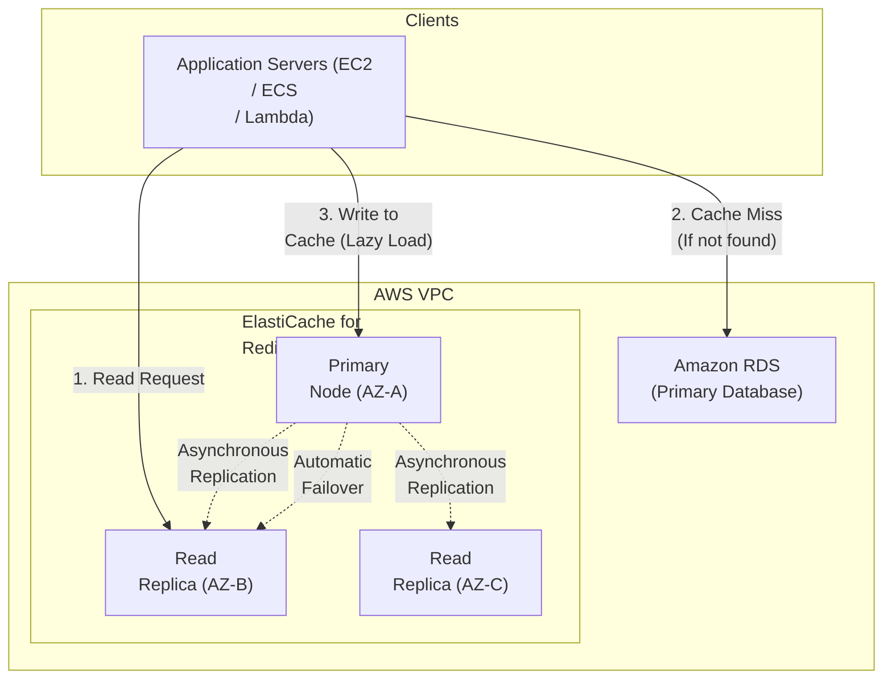
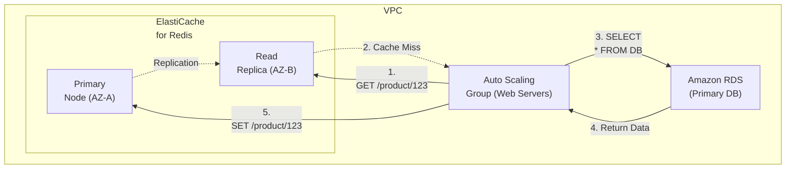
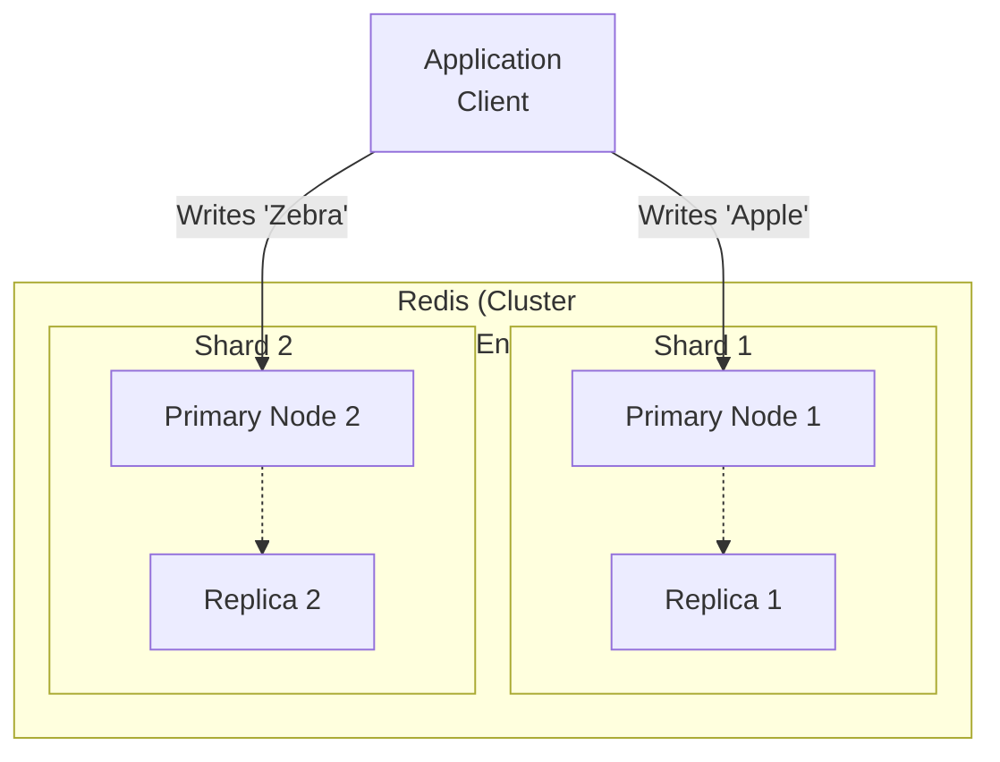

# Chapter 33: Amazon ElastiCache — In-Memory Caching (Redis/Memcached)

---

## 1. Service Overview

Amazon ElastiCache is a fully managed, in-memory caching service that accelerates applications by allowing them to retrieve data from fast, managed, in-memory data stores instead of relying entirely on slower disk-based databases. ElastiCache supports two open-source in-memory engines: **Redis OSS** (and Valkey) and **Memcached**.

### Why AWS Created It

As web applications scaled to millions of users, traditional relational databases (like MySQL or PostgreSQL) struggled with the read-heavy workloads. Retrieving identical data (like a product catalog or user session) repeatedly from disk is slow and expensive. While developers could spin up EC2 instances and install Redis or Memcached manually to solve this, managing high availability, backups, patching, and scaling for in-memory stores was operationally complex. AWS created ElastiCache to provide a push-button, fully managed caching tier that seamlessly sits in front of your primary databases.

### Key Characteristics

- **Sub-Millisecond Latency**: Data is stored entirely in RAM, providing microsecond to sub-millisecond read and write performance.
- **Two Engines**:
  - **Memcached**: Simple, multi-threaded, volatile cache. Ideal for simple key-value store needs.
  - **Redis / Valkey**: Advanced data structures (Lists, Sets, Hashes, Geospatial), persistence, publish/subscribe (Pub/Sub) messaging, and high availability via replication.
- **Fully Managed**: AWS handles hardware provisioning, software patching, setup, configuration, monitoring, failure recovery, and backups.
- **Cluster Modes**: Supports Redis Cluster Mode for horizontal partitioning (sharding) across multiple nodes to scale beyond the memory limits of a single instance.
- **Serverless Option**: ElastiCache Serverless automatically scales capacity based on application traffic without the need to manage underlying instances or shards.

---

## 2. Learning Objectives

By the end of this chapter, you will be able to:

- **Differentiate** between ElastiCache for Redis and ElastiCache for Memcached, and choose the correct engine for your workload.
- **Design** caching strategies including Lazy Loading (Cache-Aside) and Write-Through caching.
- **Architect** highly available Redis clusters using Multi-AZ deployments with Automatic Failover.
- **Implement** Redis Cluster Mode to horizontally scale read and write capacity.
- **Secure** ElastiCache clusters using VPC subnets, Security Groups, Redis AUTH, and TLS encryption.
- **Troubleshoot** high CPU utilization, memory pressure, and evictions.

---

## 3. Prerequisites

- **AWS Account** with administrative access
- **Completed chapters**: Chapter 4 (Amazon VPC), Chapter 6 (Amazon RDS)
- **Concepts**: Relational databases vs In-memory databases, Caching concepts, Key-Value stores.

---

## 4. Real-world Analogy

Think of your application architecture as a **Busy Library**.

- **The Database (RDS)** is the **Library Archive in the Basement**. It holds millions of books. It takes a long time for the librarian to go down the stairs, search the massive shelves, find the exact book, and bring it back up to you.
- **ElastiCache** is the **Librarian's Desk**. It's very small compared to the basement, but it's instantly accessible.

When you ask for the "Daily Newspaper" (a very popular item), the librarian goes to the basement once, brings it up, and leaves it on their desk (**Cache Miss**). For the next 500 people who ask for the newspaper, the librarian hands it to them instantly from the desk (**Cache Hit**). 

If the desk gets too full, the librarian throws away the oldest, least-requested newspaper to make room for new ones (**Eviction**).

---

## 5. Business Use Cases

### Database Query Caching
- **E-Commerce Catalog**: Caching the results of complex SQL queries for product categories. Instead of joining 5 tables in RDS every time a user views the "Shoes" page, the application fetches the pre-rendered HTML/JSON directly from ElastiCache in microseconds.

### User Session Management
- **Stateless Web Servers**: Web applications running on Auto Scaling Groups store user session data (login state, shopping cart) in ElastiCache. This allows any EC2 web server to serve any user request, enabling true horizontal scaling.

### Leaderboards and Counting
- **Gaming Applications**: Using Redis Sorted Sets to maintain real-time top-100 leaderboards for millions of concurrent players. Sorting millions of records in RDS would crash the database; Redis does it natively in memory instantly.

### Real-time Messaging (Pub/Sub)
- **Chat Applications**: Using Redis Pub/Sub capabilities to broadcast messages to connected websocket servers in a chat room application.

---

## 6. Core Concepts

### Caching Strategies
1. **Lazy Loading (Cache-Aside)**: The application checks the cache first. If the data is missing (Cache Miss), the app queries the database, writes the result to the cache, and returns it to the user. (Best for read-heavy workloads).
2. **Write-Through**: The application writes data to the database AND the cache simultaneously. Ensures the cache is never stale, but adds latency to write operations and caches data that might never be read.

### TTL (Time to Live)
An expiration time applied to a key in the cache. Once the TTL expires, the key is automatically deleted. Essential for preventing the cache from growing infinitely and ensuring stale data is eventually refreshed.

### Eviction Policies
What happens when the cache runs out of memory? Redis must delete old data to make room for new data. 
- **volatile-lru**: Evicts the Least Recently Used keys that have an expiration (TTL) set. (Most common).
- **allkeys-lru**: Evicts the Least Recently Used keys regardless of TTL.

### Redis Primary and Replicas
A standard Redis deployment consists of a **Primary Node** (handles Writes and Reads) and up to 5 **Replica Nodes** (handle Reads only). Replicas asynchronously copy data from the Primary. 

### Redis Cluster Mode (Sharding)
By default, all data in Redis must fit on a single Primary node. If you have 200 GB of data and the largest instance only has 100 GB of RAM, you must use **Cluster Mode Enabled**. This splits your data into "Shards" (e.g., Shard 1 holds A-M, Shard 2 holds N-Z).

---

## 7. Internal Architecture



---

## 8. Service Components

### Engine Selection
- **Memcached**: Choose if you need the absolute simplest model, plan to run large nodes with multiple cores, and do not care if data is lost when a node reboots (no persistence, no failover).
- **Redis (or Valkey)**: Choose for 95% of use cases. Supports data persistence, Multi-AZ failover, read replicas, complex data types, and transactions.

### Multi-AZ with Automatic Failover (Redis)
If the Primary node fails (hardware failure or network partition), ElastiCache automatically detects the failure, promotes the Replica with the least replication lag to be the new Primary, and updates the cluster's DNS endpoint to point to the new Primary. This usually takes ~1-3 minutes.

### ElastiCache Serverless
A deployment option where you do not select instance types (e.g., `cache.r6g.large`) or configure shards. AWS automatically scales the memory and compute resources based on application demand. You pay per GB of data stored and per ElastiCache Processing Unit (ECPU) consumed.

---

## 9. Configuration

### Parameter Groups
ElastiCache uses Parameter Groups to control the behavior of the engine (similar to RDS). This is where you define settings like `maxmemory-policy` (eviction policy).

### Security Configuration
- **VPC Integration**: ElastiCache instances should **always** reside in Private Subnets. They do not have public IP addresses and cannot be accessed directly from the internet.
- **Security Groups**: You must configure a Security Group on the ElastiCache cluster that allows Inbound TCP (Port 6379 for Redis, Port 11211 for Memcached) ONLY from the Security Group attached to your Application Servers.

---

## 10. Code Examples

### AWS CLI — Common Operations

```bash
# 1. Create a Redis Cluster (Cluster Mode Disabled)
aws elasticache create-replication-group \
    --replication-group-id my-redis-cluster \
    --replication-group-description "Production Redis" \
    --engine redis \
    --cache-node-type cache.r6g.large \
    --num-cache-clusters 3 \
    --automatic-failover-enabled \
    --multi-az-enabled \
    --cache-subnet-group-name my-private-subnets \
    --security-group-ids sg-0123456789abcdef0

# 2. Describe Cluster Endpoints
aws elasticache describe-replication-groups \
    --replication-group-id my-redis-cluster \
    --query "ReplicationGroups[*].NodeGroups[*].PrimaryEndpoint"

# 3. Create a Memcached Cluster
aws elasticache create-cache-cluster \
    --cache-cluster-id my-memcached \
    --engine memcached \
    --cache-node-type cache.t4g.micro \
    --num-cache-nodes 2 \
    --cache-subnet-group-name my-private-subnets
```

### Python (Redis Cache-Aside Pattern)

```python
import redis
import json
import pymysql

# Connect to ElastiCache Redis
cache = redis.Redis(host='my-redis.xxxxxx.use1.cache.amazonaws.com', port=6379, decode_responses=True)

# Connect to RDS
db = pymysql.connect(host='my-rds.xxxxxx.use1.rds.amazonaws.com', user='admin', password='password', db='store')

def get_product(product_id):
    cache_key = f"product:{product_id}"
    
    # 1. Check Cache
    cached_data = cache.get(cache_key)
    if cached_data:
        print("Cache HIT")
        return json.loads(cached_data)
        
    print("Cache MISS")
    # 2. Fetch from Database
    cursor = db.cursor(pymysql.cursors.DictCursor)
    cursor.execute("SELECT * FROM products WHERE id = %s", (product_id,))
    product = cursor.fetchone()
    
    if product:
        # 3. Write to Cache with a TTL of 1 Hour (3600 seconds)
        cache.setex(cache_key, 3600, json.dumps(product))
        
    return product

# Fetching the product
print(get_product(101))
```

### Terraform — Highly Available Redis Cluster

```hcl
resource "aws_elasticache_subnet_group" "main" {
  name       = "redis-subnet-group"
  subnet_ids = [aws_subnet.private_a.id, aws_subnet.private_b.id]
}

resource "aws_elasticache_replication_group" "redis" {
  replication_group_id          = "prod-redis"
  description                   = "Production Redis with Failover"
  node_type                     = "cache.r6g.large"
  port                          = 6379
  parameter_group_name          = "default.redis7"
  
  # High Availability Settings
  automatic_failover_enabled    = true
  multi_az_enabled              = true
  num_cache_clusters            = 3 # 1 Primary, 2 Replicas
  
  # Networking
  subnet_group_name             = aws_elasticache_subnet_group.main.name
  security_group_ids            = [aws_security_group.redis_sg.id]
  
  # Security
  at_rest_encryption_enabled    = true
  transit_encryption_enabled    = true
  auth_token                    = "SuperSecretRedisPassword123!" # Redis AUTH
  
  # Backup
  snapshot_retention_limit      = 7
  snapshot_window               = "03:00-04:00"
}
```

---

## 11. Line-by-Line Explanation

### Terraform Security Settings

```hcl
  at_rest_encryption_enabled    = true
  transit_encryption_enabled    = true
  auth_token                    = "SuperSecretRedisPassword123!"
```
- **`at_rest_encryption_enabled`**: Encrypts the data on disk (swap) and automated backups in S3 using AWS KMS. Cannot be changed after creation.
- **`transit_encryption_enabled`**: Forces clients to connect using TLS/SSL. The Redis connection strings will change to use `rediss://` instead of `redis://`.
- **`auth_token`**: Requires clients to supply a password to execute commands. *Note: `transit_encryption_enabled` must be true to use `auth_token`.*

---

## 12. Security Deep Dive

### Redis AUTH vs IAM Authentication
Traditionally, Redis is secured via an `auth_token` (a shared password). Modern ElastiCache supports **IAM Authentication**. Instead of hardcoding a Redis password in your application, your EC2 instances use their IAM Instance Profile to generate a short-lived, 15-minute authentication token. This eliminates credential rotation headaches and ties database access directly to AWS IAM roles.

### VPC Best Practices
ElastiCache instances are deployed inside your VPC. They do not support public endpoints.
- If a developer needs to access Redis from their local machine (e.g., via a GUI like RedisInsight), they **cannot** connect directly.
- **Solution**: The developer must connect to a VPN (Client VPN) or use AWS Systems Manager (SSM) Session Manager to port-forward through a Bastion Host EC2 instance located in the same VPC as ElastiCache.

---

## 13. Monitoring & Observability

### Critical CloudWatch Metrics

- **`CPUUtilization` / `EngineCPUUtilization`**: Redis is single-threaded. `CPUUtilization` measures the whole instance (including background tasks). `EngineCPUUtilization` measures the single Redis thread. If `EngineCPUUtilization` hits 100%, Redis cannot process any more commands, even if the overall instance CPU is only at 20%.
- **`FreeableMemory`**: The amount of RAM available. If this drops near zero, Redis starts evicting keys or hitting swap space (which kills performance).
- **`Evictions`**: The number of keys deleted to make room for new data. High evictions mean your instance is too small for your active dataset.
- **`CacheHits` / `CacheMisses`**: Used to calculate your Hit Ratio (`Hits / (Hits + Misses)`). A ratio below 80% usually indicates inefficient caching strategies or TTLs that are too short.

---

## 14. Performance & Cost Optimization

### Graviton Processors
Always use Graviton instances (e.g., `cache.r6g.*` instead of `cache.r6.*`). They are specifically optimized for open-source engines like Redis and Memcached, providing up to 20% better performance at a 20% lower price.

### Data Tiering
For massive datasets where you don't need sub-millisecond latency for *everything*, ElastiCache offers Data Tiering on specific instances (e.g., `cache.r6gd.*`). It keeps the hottest 20% of data in RAM and automatically moves the colder 80% of data to ultra-fast local NVMe SSDs. This drastically reduces the cost per GB compared to storing 100% of the data in RAM.

### Scaling Up vs Scaling Out
- **Scale Up**: Change the instance type from `large` to `xlarge`. Requires a brief downtime/failover for Cluster Mode Disabled.
- **Scale Out (Read)**: Add more Read Replicas (up to 5). Offloads read traffic from the primary node.
- **Scale Out (Write)**: Enable Cluster Mode to add more Shards. This distributes write operations across multiple Primary nodes.

---

## 15. Enterprise Integration

### Application Load Balancer / Auto Scaling
Because web applications in ASGs are ephemeral (they spin up and down constantly), they cannot store local session state (like a logged-in user's shopping cart). By storing session state in ElastiCache, any EC2 instance behind the ALB can serve any request seamlessly.

### Amazon DynamoDB Accelerator (DAX)
If your primary database is DynamoDB, you *could* use ElastiCache, but **DAX (DynamoDB Accelerator)** is usually a better choice. DAX is API-compatible with DynamoDB, meaning you don't have to rewrite your application to use the Redis API; DAX intercepts the standard DynamoDB API calls and caches them transparently.

---

## 16. Real Industry Use Cases

### Case 1: E-Commerce — Flash Sales
**Problem**: An e-commerce site hosts a "Black Friday" flash sale. The RDS PostgreSQL database crashes under the load of 50,000 users refreshing the product page simultaneously.
**Solution**: Implemented ElastiCache Redis using the Cache-Aside pattern. The product inventory and pricing were cached with a 10-second TTL.
**Result**: The RDS database received only 1 query every 10 seconds. ElastiCache handled the remaining 499,999 requests effortlessly from memory, keeping the site online.

### Case 2: Ride-Sharing App — Geospatial Data
**Problem**: The application needs to match riders with drivers within a 5-mile radius in under 50 milliseconds. Doing geospatial queries (`SELECT ... WHERE distance < 5`) on millions of rows in a relational database was too slow.
**Solution**: Used ElastiCache for Redis and its native Geospatial commands (`GEOADD`, `GEORADIUS`). Driver coordinates were continuously updated in Redis.
**Result**: Redis computed the distances and returned the closest drivers in sub-milliseconds.

---

## 17. Architecture Patterns

### Pattern 1: Cache-Aside with Multi-AZ Failover


### Pattern 2: Redis Cluster Mode (Sharding)


---

## 18. Production Incident War Room

### Incident 1: EngineCPUUtilization Hitting 100%
**Severity**: P1 — Critical
**Symptoms**: Application latency spikes from 5ms to 5000ms. Redis operations timeout. Instance `CPUUtilization` is only at 25%, but `EngineCPUUtilization` is at 100%.
**Investigation**:
1. Remember that Redis is single-threaded. On a 4-vCPU instance, one core maxed out equals 25% overall CPU, but 100% of the Redis engine capacity.
2. Check the "Commands" metrics in CloudWatch to see if the rate of `SET` or `GET` operations spiked.
3. If total operations didn't spike, check for expensive commands. Commands like `KEYS *` (which scans the entire database) or massive `SORT` operations block the single thread, preventing all other normal `GET/SET` commands from executing.
**Root Cause**: A developer ran `KEYS *` in production to debug an issue, blocking the Redis engine thread for 4 seconds and queuing up thousands of application requests.
**Permanent Fix**: Use the Redis `RENAME-COMMAND` feature via Parameter Groups to disable dangerous commands like `KEYS`, `FLUSHALL`, and `FLUSHDB` in production. Developers should use `SCAN` instead of `KEYS`.

### Incident 2: OOM (Out of Memory) Kills
**Severity**: P1 — Critical
**Symptoms**: Application receives `OOM command not allowed when used memory > 'maxmemory'` errors when attempting to write to Redis.
**Investigation**:
1. Check CloudWatch `FreeableMemory`. It is flatlining near 0 bytes.
2. Check `Evictions`. It is 0.
3. Check the Parameter Group `maxmemory-policy`. It is set to `noeviction`.
**Root Cause**: When the cache filled up, the `noeviction` policy prevented Redis from deleting any old data. Therefore, any new write requests were rejected with an OOM error.
**Permanent Fix**: Change the `maxmemory-policy` in the Parameter Group to `volatile-lru` or `allkeys-lru`. This instructs Redis to delete the least recently used data to make room for new writes automatically.

### Incident 3: Replication Lag Leading to Stale Reads
**Severity**: P2 — High
**Symptoms**: A user updates their profile picture, hits save, the page reloads, and they still see their old picture. 10 seconds later, they refresh and see the new picture.
**Investigation**:
1. The application architecture splits traffic: Writes go to the Primary endpoint, Reads go to the Reader endpoint.
2. Check CloudWatch `ReplicationLag`. The metric shows a spike to 8 seconds.
**Root Cause**: A massive batch job was running, writing millions of keys to the Primary node. The Primary node was overloaded and the asynchronous replication link to the Read Replica fell behind. When the user's browser read their profile from the Replica, the Replica had not yet received the update from the Primary.
**Permanent Fix**: Throttle the batch job write speed. For absolutely critical read-after-write consistency, configure the application to read from the Primary node immediately after a write, or stick to the Primary node for that specific user's session.

### Incident 4: Application Disconnected During Failover
**Severity**: P2 — High
**Symptoms**: AWS performed emergency hardware maintenance on the Redis Primary node. ElastiCache automatically failed over to the Read Replica. However, the application lost connection to Redis and returned 500 errors for 15 minutes until it was manually restarted.
**Investigation**:
1. During failover, AWS updates the DNS record of the Primary Endpoint to point to the IP address of the new Primary node (the promoted replica).
2. DNS propagation takes a few seconds.
**Root Cause**: The application (e.g., a Node.js or Java connection pool) resolved the DNS name to an IP address at startup and cached that IP address infinitely. When the failover occurred, the application kept trying to talk to the dead IP address instead of resolving the new one.
**Permanent Fix**: Configure the application's Redis client libraries to honor DNS TTLs (Time to Live). Enable connection pooling retry logic that automatically drops stale connections and forces a new DNS resolution upon connection failure.

### Incident 5: ElastiCache Swap Usage Spikes
**Severity**: P2 — High
**Symptoms**: Redis performance degrades significantly. `SwapUsage` metric spikes from 0 bytes to 50 MB.
**Investigation**:
1. Redis is designed to run entirely in RAM. If it touches the physical disk (swap), latency increases by orders of magnitude.
2. Check `FreeableMemory`. It is low, but not zero.
**Root Cause**: Redis background processes (like creating a snapshot for backup) require a process fork. The fork requires additional memory. If the Redis instance is running at 90% memory utilization, the fork pushes it over 100%, causing the OS to page memory to disk (Swap).
**Permanent Fix**: AWS reserves a portion of memory (via the `reserved-memory-percent` parameter, default 25%) specifically for background tasks to prevent swapping. If swapping still occurs, scale up the instance type to provide more raw RAM.

---

## 19. Production Best Practices (Well-Architected)

### Security
- **Private Access Only**: Never attempt to place ElastiCache in a public subnet. Always use VPC security groups to restrict access solely to application subnets.
- **Encryption**: Enable At-Rest encryption (KMS) and In-Transit encryption (TLS) during cluster creation.

### Reliability
- **Multi-AZ**: Always enable Multi-AZ with Automatic Failover for production. A single-node Redis cluster will experience minutes to hours of downtime during a hardware failure.
- **Cluster Mode**: If your dataset exceeds 100GB, or if you need extremely high write throughput (millions of writes/sec), enable Redis Cluster Mode to horizontally shard the data.

### Operational Excellence
- **Backups**: Enable automated daily backups. ElastiCache stores these snapshots in S3 automatically.
- **Maintenance Windows**: Define a clear weekly maintenance window. AWS uses this window to apply required OS patches and Redis engine upgrades.

---

## 20. Migration Strategies

### Self-Hosted Redis to ElastiCache
1. Provision the target ElastiCache Redis cluster.
2. On the self-hosted Redis server, generate a `.rdb` backup file (Redis Database Backup).
3. Upload the `.rdb` file to an Amazon S3 bucket.
4. Use the AWS Console to "Seed" the new ElastiCache cluster by pointing it to the `.rdb` file in S3.
5. Update application connection strings to the new ElastiCache endpoint.

---

## 21. CI/CD Integration

### Schema Management
Unlike relational databases, Redis does not have schemas (tables, columns). However, when deploying new application code that changes the format of data stored in Redis (e.g., adding a new field to a JSON blob), the application must gracefully handle reading the *old* format from the cache until the old keys expire or are manually flushed.

---

## 22. Practical Projects

### Beginner Project: Basic Amazon ElastiCache Deployment
- **Business Requirement**: Deploy baseline Amazon ElastiCache resources securely.
- **Architecture**: Single-region deployment with default VPC subnets and restricted IAM roles.
- **Implementation**: Write a Terraform `main.tf` to provision Amazon ElastiCache and apply the configuration. Verify resource creation in the AWS Console.

### Intermediate Project: Multi-AZ Scalable Amazon ElastiCache Setup
- **Business Requirement**: Implement high availability and automated scaling for Amazon ElastiCache to withstand Availability Zone failures.
- **Architecture**: Application Load Balancer -> Auto Scaling Group -> Amazon ElastiCache -> KMS Encrypted Persistence Layer.
- **Implementation**: Configure scaling policies based on CPU utilization and set up CloudWatch Alarms for monitoring metrics.

### Advanced Project: Automated CI/CD Pipeline Integration
- **Business Requirement**: Automate the deployment and testing of Amazon ElastiCache infrastructure without manual intervention.
- **Architecture**: GitHub Repository -> AWS CodePipeline -> AWS CodeBuild -> Deployment to Amazon ElastiCache Targets.
- **Implementation**: Write a `buildspec.yml` to run automated security linting (e.g., tfsec or Checkov) before deploying the Amazon ElastiCache changes.

### Enterprise Project: Zero-Trust Multi-Account Architecture
- **Business Requirement**: Deploy a production-grade multi-account enterprise environment utilizing Amazon ElastiCache with centralized security governance.
- **Architecture**: AWS Organizations -> AWS Transit Gateway -> Hub-and-Spoke VPCs -> Multi-AZ Amazon ElastiCache -> AWS IAM Identity Center SSO.
- **Implementation**: Implement Service Control Policies (SCPs) to restrict Amazon ElastiCache deployments to approved regions and mandate AWS KMS customer-managed keys (CMKs) for all data at rest.

---

## 23. Interview Preparation

### Beginner
**Q1**: When should you use Memcached instead of Redis?
**A**: Almost never in modern architectures, unless you specifically require the absolute simplest multi-threaded object caching model with zero persistence or replication needs. Redis is the standard due to its rich data structures, persistence, and high availability.

**Q2**: What is a Cache Miss?
**A**: When the application requests a key from the cache, but the data is not there (either because it was never stored, the TTL expired, or it was evicted). The application must then fetch the data from the primary database.

### Intermediate
**Q3**: Your Redis cluster is running out of memory and returning OOM errors instead of evicting old keys. How do you fix this?
**A**: Change the `maxmemory-policy` in the ElastiCache Parameter Group from `noeviction` to `volatile-lru` or `allkeys-lru` so Redis automatically purges old data.

**Q4**: Explain the difference between ElastiCache Redis (Cluster Mode Disabled) and (Cluster Mode Enabled).
**A**: Cluster Mode Disabled relies on a single Primary node for all writes, scaling reads via Replicas. The dataset must fit in the RAM of one instance. Cluster Mode Enabled shards the data horizontally across multiple Primary nodes (up to 500 shards), allowing you to scale both read and write capacity and store massive datasets across combined instance memory.

### Advanced
**Q5**: Your monitoring shows `EngineCPUUtilization` at 100%, but `CPUUtilization` is only at 25%. What does this mean and how do you resolve it?
**A**: Redis is single-threaded. On a multi-core instance, it can only use one core (e.g., 1 out of 4 cores = 25% total CPU, but 100% of the Redis engine capacity). This indicates the Redis thread is blocked, often by expensive commands like `KEYS *` or massive `SORT` operations. You should analyze commands running on the server, disable dangerous commands using `RENAME-COMMAND`, and refactor the application to use non-blocking commands like `SCAN`.

---

## 24. AWS Certification Practice

**Q1**: A gaming company has a real-time multiplayer game. They need to maintain a global leaderboard of the top 100,000 players. The leaderboard changes thousands of times per second. Which AWS database solution provides the lowest latency and native capability for this requirement?
- A) Amazon DynamoDB
- B) Amazon Aurora PostgreSQL
- **C) Amazon ElastiCache for Redis** ✓
- D) Amazon Neptune

**Q2**: A web application is deployed across multiple EC2 instances in an Auto Scaling Group. When the ASG scales in (terminates instances), users are suddenly logged out of their sessions. How can the architecture be modified to prevent this?
- A) Enable Sticky Sessions (Session Affinity) on the Application Load Balancer.
- B) Store the session state in an Amazon EBS volume attached to the instances.
- **C) Externalize the session state by storing it in an Amazon ElastiCache for Redis cluster.** ✓
- D) Store the session state in AWS Systems Manager Parameter Store.

---

## 25. Knowledge Check

1. **What are the two caching engines supported by ElastiCache?** Redis and Memcached.
2. **Which engine supports Multi-AZ failover and read replicas?** Redis.
3. **What is the mechanism used to automatically delete old keys?** TTL (Time to Live).
4. **If your dataset is 500 GB, and the largest instance size is 100 GB, what feature must you enable?** Redis Cluster Mode (Sharding).
5. **What happens if you run `KEYS *` in a production Redis database?** It blocks the single Redis thread, causing a massive latency spike for all other application requests.
6. **Can you access ElastiCache directly from the internet using a public IP?** No, it must reside in a VPC.

---

## 26. Cheat Sheet

| Feature | Detail |
|---------|--------|
| **Redis** | Advanced features, Pub/Sub, Multi-AZ, Persistence, Geospatial. |
| **Memcached** | Simple, multi-threaded, volatile cache. No failover. |
| **Cache-Aside** | App checks cache first -> Miss -> App queries DB -> App writes to Cache. |
| **Write-Through** | App writes to DB and Cache simultaneously. Prevents stale data. |
| **TTL** | Expiration time for a cached item. |
| **Eviction Policy**| Defines what data is deleted when memory is full (e.g., `allkeys-lru`). |
| **Cluster Mode** | Enables horizontal sharding of data across multiple Primary nodes. |
| **EngineCPUUtilization**| The metric to watch. Redis is single-threaded; this metric hitting 100% means Redis is blocked. |

---

## 27. Chapter Summary

Amazon ElastiCache is the key to unlocking extreme performance and protecting primary databases in AWS. Key takeaways:

- **Redis is the default**: Unless you have a legacy application hardcoded for Memcached, always choose Redis.
- **Caching protects databases**: Implementing a Cache-Aside strategy protects expensive, slow relational databases (like RDS) from being overwhelmed by repetitive read queries.
- **Watch the single thread**: Understand that Redis is single-threaded. Monitor `EngineCPUUtilization` and aggressively restrict developers from running blocking commands (`KEYS`, `FLUSHALL`) in production.
- **Design for Failure**: Always enable Multi-AZ with Automatic Failover for production Redis workloads. Ensure your application's connection pooling logic gracefully handles DNS changes during failover events.

---

## 28. Further Learning

### AWS Documentation
- [Amazon ElastiCache for Redis User Guide](https://docs.aws.amazon.com/AmazonElastiCache/latest/red-ug/WhatIs.html)
- [Caching Strategies and Best Practices](https://docs.aws.amazon.com/AmazonElastiCache/latest/red-ug/Strategies.html)
- [Scaling Redis Clusters](https://docs.aws.amazon.com/AmazonElastiCache/latest/red-ug/Scaling.html)

### Related Chapters
- **Chapter 6 — Amazon RDS**: The primary relational database that ElastiCache typically sits in front of.
- **Chapter 13 — Amazon DynamoDB**: NoSQL database that offers its own integrated cache (DAX) as an alternative to ElastiCache.
- **Chapter 4 — Amazon VPC**: The networking foundation required to secure ElastiCache deployments.
