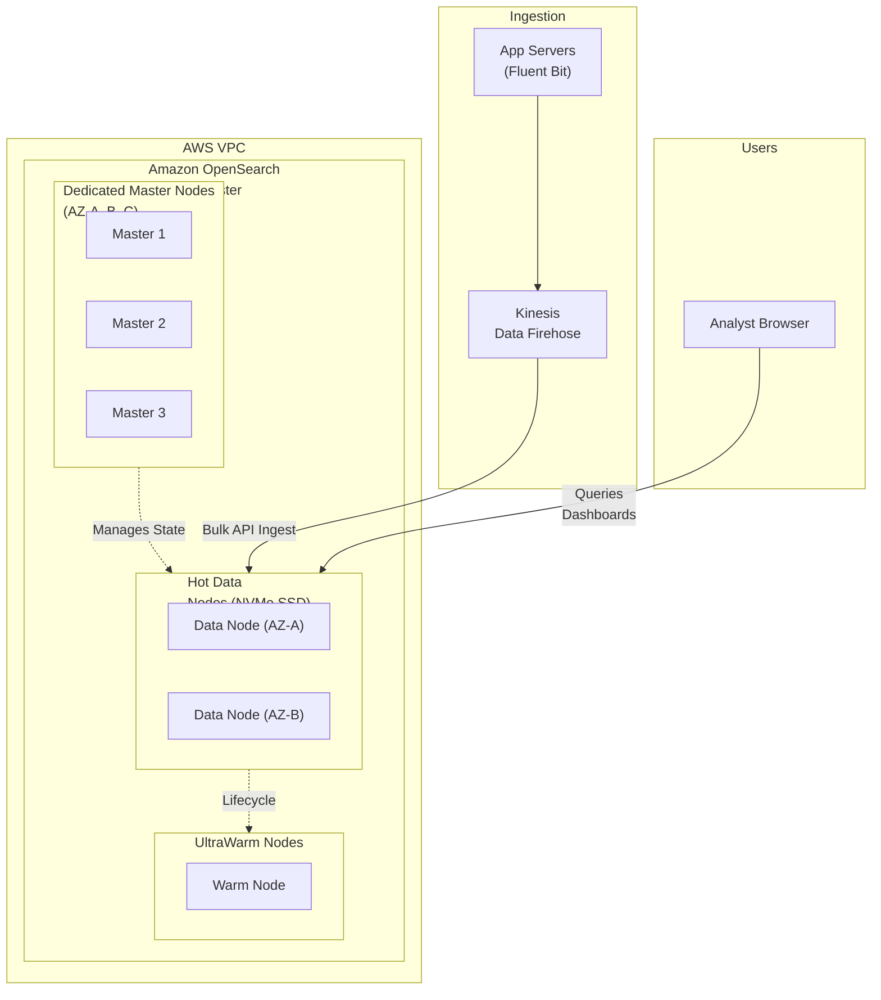
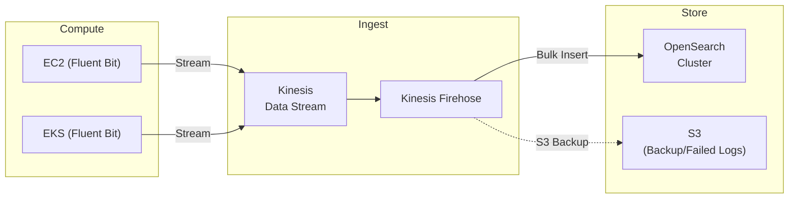
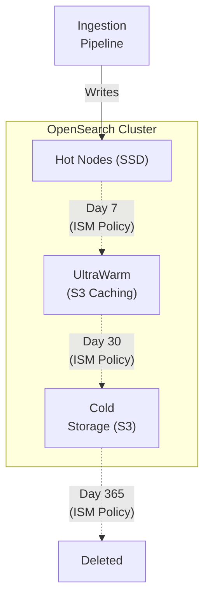

# Chapter 34: Amazon OpenSearch Service — Search and Log Analytics

---

## 1. Service Overview

Amazon OpenSearch Service (formerly Amazon Elasticsearch Service) is a fully managed service that makes it easy to deploy, secure, operate, and scale OpenSearch clusters in the AWS Cloud. It is a distributed, RESTful search and analytics engine capable of solving a growing number of use cases, primarily focusing on application search, log analytics, and real-time application monitoring.

### Why AWS Created It

Before managed services, running Elasticsearch/OpenSearch was notoriously difficult. It required provisioning massive EC2 clusters, manually configuring ZooKeeper or master nodes for split-brain protection, balancing shards across nodes, handling JVM memory tuning (garbage collection pauses), and managing complex version upgrades. AWS created OpenSearch Service to remove this massive operational burden, allowing developers to simply click a button, receive a scalable cluster endpoint, and start ingesting terabytes of log data immediately.

*Note: In 2021, Elastic changed the licensing for Elasticsearch. In response, AWS forked the open-source Elasticsearch codebase and created the open-source **OpenSearch** project.*

### Key Characteristics

- **Full-Text Search Engine**: Built on Apache Lucene. Excels at complex queries, fuzzy matching, and ranking results by relevance.
- **Log Analytics**: The backbone of centralized logging. Seamlessly ingests logs from CloudWatch, Kinesis, or Fluent Bit.
- **OpenSearch Dashboards**: Included out-of-the-box (a fork of Kibana). Provides a rich UI for visualizing log data, creating dashboards, and exploring data.
- **Vector Database**: Native support for k-NN (k-Nearest Neighbors) search, making it a critical component for Generative AI (RAG) and semantic search architectures.
- **UltraWarm and Cold Storage**: Tiered storage automatically moves older, infrequently accessed data to cheaper storage (S3-backed) while remaining queryable.
- **Serverless Option**: OpenSearch Serverless removes the need to provision clusters, managing capacity automatically.

---

## 2. Learning Objectives

By the end of this chapter, you will be able to:

- **Understand** the core OpenSearch terminology: Indexes, Documents, Shards, and Nodes.
- **Design** an OpenSearch cluster architecture using Dedicated Master nodes and Data nodes.
- **Implement** a centralized logging pipeline using Kinesis Firehose and OpenSearch.
- **Configure** Index State Management (ISM) to automatically transition aging data to UltraWarm and Cold storage tiers to save costs.
- **Secure** OpenSearch clusters using fine-grained access control (FGAC), IAM, and VPC endpoints.
- **Troubleshoot** common cluster states (Yellow/Red status), JVM memory pressure, and mapping explosion.

---

## 3. Prerequisites

- **AWS Account** with administrative access.
- **Completed chapters**: Chapter 4 (Amazon VPC), Chapter 10 (Amazon CloudWatch), Chapter 3 (Amazon EC2).
- **Concepts**: JSON data structures, RESTful APIs, basic understanding of indexing vs scanning.

---

## 4. Real-world Analogy

Think of Amazon OpenSearch as an incredibly advanced **Corporate Mailroom & Library**.

- **Traditional Database (RDS)** is like a strict filing cabinet. You can quickly find a folder if you know the exact Folder ID and Drawer Number. But if you say, "Find me all documents that mention 'budget deficit' in the third paragraph and were written by someone named Smith," it struggles.
- **OpenSearch** is the Librarian reading every single document that enters the building, writing down every single word, and building a massive index at the back of a textbook (the **Inverted Index**).
  - When you ask the OpenSearch Librarian for "budget deficit", they don't scan the files. They flip to the index, see that those words appear on pages 4, 19, and 242, and instantly hand you the exact documents, ranked by how relevant they are.

---

## 5. Business Use Cases

### Log Analytics (The "ELK/EFK" Stack)
- **Centralized Troubleshooting**: Collecting application logs (from EC2/ECS), VPC Flow Logs, and CloudTrail logs. When a production outage occurs, engineers use OpenSearch Dashboards to search across millions of log lines instantly to find the specific Java Stack Trace causing the crash.

### Full-Text E-Commerce Search
- **Product Catalogs**: Powering the search bar on an e-commerce website. Handles fuzzy matching (user types "ipohne", OpenSearch returns "iPhone"), autocomplete, and faceted search (filtering by color, price, brand).

### Generative AI (Semantic Search)
- **Retrieval-Augmented Generation (RAG)**: Storing document embeddings (vectors) generated by Amazon Titan or Cohere. When a user asks a chatbot a question, OpenSearch performs a vector similarity search (k-NN) to find the most contextually relevant documents and feeds them to the LLM.

### Real-Time Application Monitoring
- **Security Information and Event Management (SIEM)**: Ingesting security logs and using OpenSearch Anomaly Detection (powered by machine learning) to alert security teams when login failure rates deviate from historical norms.

---

## 6. Core Concepts

### Document
The basic unit of information that can be indexed, represented in JSON format (equivalent to a row in a relational database).

### Index
A collection of documents that have somewhat similar characteristics (equivalent to a table in a relational database). For logs, indexes are typically created daily (e.g., `api-logs-2023-10-26`).

### Node Types
- **Data Node**: Holds data and performs data-related operations such as CRUD, search, and aggregations.
- **Dedicated Master Node**: Manages the cluster. Tracks which nodes are part of the cluster and where shards are allocated. Does *not* hold data or execute queries. Crucial for cluster stability.

### Shards
To distribute data across multiple nodes, OpenSearch divides an index into multiple pieces called Shards.
- **Primary Shard**: The original shard where data is written.
- **Replica Shard**: A copy of the primary shard. Provides high availability (if a node dies, the replica takes over) and scales read throughput.

### The Inverted Index
The data structure that allows OpenSearch to perform very fast full-text searches. Instead of mapping documents to words, it maps words to documents (like an index at the back of a book).

---

## 7. Internal Architecture



---

## 8. Service Components

### OpenSearch Dashboards
A visualization tool that connects to the OpenSearch cluster. It allows you to create pie charts, line graphs, and heat maps from your log data, combining them into operational dashboards.

### Index State Management (ISM)
A policy engine that automates routine index management tasks. You define policies to automatically transition indices from Hot -> UltraWarm -> Cold -> Delete based on index age, size, or document count.

### UltraWarm and Cold Storage
- **Hot Tier**: Local NVMe SSD attached to Data nodes. Fastest, most expensive. Used for active querying (e.g., today's logs).
- **UltraWarm Tier**: Data is stored in S3 but cached on UltraWarm nodes. Cheaper, slightly slower querying.
- **Cold Tier**: Data is stored purely in S3. Cheapest. To query it, you must "restore" it to UltraWarm first (takes minutes to hours).

### Fine-Grained Access Control (FGAC)
Allows you to control who can access what at a granular level. You can restrict a specific IAM role to only view specific Indexes, specific Documents within an index (Document-level security), or even hide specific JSON fields (Field-level security).

---

## 9. Configuration

### Sizing a Cluster
Sizing OpenSearch requires math. 
1. **Source Data**: You generate 100 GB of raw logs per day.
2. **Indexing Overhead**: OpenSearch adds ~10% overhead for the inverted index (110 GB).
3. **Replication**: You need 1 Replica Shard for High Availability. Multiply by 2 = 220 GB.
4. **Reserved Space**: OpenSearch requires ~20% free space for segment merging and operations. 
5. **Total Storage Needed for 1 Day**: ~275 GB.
6. **Retention**: If you keep Hot data for 7 days, you need `7 * 275 = 1,925 GB` of Hot Storage across your Data Nodes.

### Dedicated Master Node Rules
- Always use **3 Dedicated Master Nodes** for production.
- Why 3? OpenSearch uses a quorum to elect a master. If you have 2 masters and 1 dies, the remaining node does not have a majority (1 out of 2 is 50%, not >50%), so the cluster stops accepting writes to prevent "split-brain". 3 nodes guarantee a quorum (2 out of 3 = 66%) if an AZ goes down.

---

## 10. Code Examples

### AWS CLI — Common Operations

```bash
# 1. Create an OpenSearch Cluster
aws opensearch create-domain \
    --domain-name production-logs \
    --engine-version OpenSearch_2.11 \
    --cluster-config InstanceType=r6g.large.search,InstanceCount=3,DedicatedMasterEnabled=true,DedicatedMasterType=c6g.large.search,DedicatedMasterCount=3,ZoneAwarenessEnabled=true \
    --ebs-options EBSEnabled=true,VolumeType=gp3,VolumeSize=100 \
    --node-to-node-encryptionOptions Enabled=true \
    --encryption-at-rest-options Enabled=true \
    --vpc-options SubnetIds=subnet-111,subnet-222,subnet-333,SecurityGroupIds=sg-444

# 2. Check Domain Status
aws opensearch describe-domain --domain-name production-logs
```

### Python (Boto3 & OpenSearch-py) — Indexing a Document

```python
import boto3
from opensearchpy import OpenSearch, RequestsHttpConnection, AWSV4SignerAuth

# Set up AWS credentials and signing
credentials = boto3.Session().get_credentials()
region = 'us-east-1'
auth = AWSV4SignerAuth(credentials, region, 'es')

# Connect to the cluster
client = OpenSearch(
    hosts=[{'host': 'vpc-production-logs-xxxxx.us-east-1.es.amazonaws.com', 'port': 443}],
    http_auth=auth,
    use_ssl=True,
    verify_certs=True,
    connection_class=RequestsHttpConnection
)

# Index a document
document = {
    "title": "AWS Architect Guide",
    "author": "Cloud Team",
    "year": 2024
}

response = client.index(
    index="books-index",
    body=document,
    id="1",
    refresh=True
)

print(f"Document indexed: {response}")
```

### Terraform — Production OpenSearch Cluster

```hcl
resource "aws_opensearch_domain" "prod" {
  domain_name    = "production-logs"
  engine_version = "OpenSearch_2.11"

  cluster_config {
    instance_type            = "r6g.large.search"
    instance_count           = 3
    dedicated_master_enabled = true
    dedicated_master_type    = "c6g.large.search"
    dedicated_master_count   = 3
    
    zone_awareness_enabled = true
    zone_awareness_config {
      availability_zone_count = 3
    }
  }

  ebs_options {
    ebs_enabled = true
    volume_size = 500
    volume_type = "gp3"
  }

  vpc_options {
    subnet_ids = [
      aws_subnet.private_a.id,
      aws_subnet.private_b.id,
      aws_subnet.private_c.id
    ]
    security_group_ids = [aws_security_group.os_sg.id]
  }

  encrypt_at_rest {
    enabled = true
  }

  node_to_node_encryption {
    enabled = true
  }

  domain_endpoint_options {
    enforce_https       = true
    tls_security_policy = "Policy-Min-TLS-1-2-2019-07"
  }

  # Fine-Grained Access Control requires Advanced Security Options
  advanced_security_options {
    enabled                        = true
    internal_user_database_enabled = true
    master_user_options {
      master_user_name     = "admin"
      master_user_password = "SuperSecretPassword123!" # In Prod, fetch from Secrets Manager
    }
  }
}
```

---

## 11. Line-by-Line Explanation

### OpenSearch Access Policies (IAM)

```json
{
  "Version": "2012-10-17",
  "Statement": [
    {
      "Effect": "Allow",
      "Principal": {
        "AWS": "arn:aws:iam::123456789012:role/FirehoseDeliveryRole"
      },
      "Action": "es:ESHttp*",
      "Resource": "arn:aws:es:us-east-1:123456789012:domain/production-logs/*"
    }
  ]
}
```
- OpenSearch sits at the intersection of IAM and Database permissions. 
- You must attach a **Domain Access Policy** to the cluster itself.
- This policy explicitly allows the IAM Role used by Kinesis Firehose to perform `es:ESHttp*` (which covers HTTP POST/PUT needed for bulk indexing data) on any index within the `production-logs` domain.

---

## 12. Security Deep Dive

### Public vs VPC Endpoints
OpenSearch clusters can be deployed with Public internet endpoints or VPC private endpoints.
**CRITICAL RULE**: Never, ever deploy an OpenSearch cluster with a Public endpoint holding sensitive data. OpenSearch has a long history of massive data breaches when users misconfigure the Domain Access Policy on a public endpoint, exposing petabytes of PII to the open internet. Always deploy inside a VPC in Private Subnets.

### Fine-Grained Access Control (FGAC)
If you deploy inside a VPC, how do developers access the OpenSearch Dashboards UI?
1. They VPN into the VPC (or use an SSM Bastion).
2. They hit the Dashboards URL.
3. If FGAC is enabled, they are prompted for a Username/Password (or redirected to SAML SSO).
FGAC allows you to map IAM roles or SAML users to OpenSearch internal roles. For example, you can create a "DeveloperRole" in OpenSearch that only has `read` access to indexes matching `app-logs-*` and map that to the SAML group "Engineering".

---

## 13. Monitoring & Observability

### Cluster Health Status
OpenSearch clusters report one of three health states:
- **Green**: All Primary and Replica shards are allocated to nodes. Everything is perfect.
- **Yellow**: All Primary shards are allocated, but one or more Replica shards are NOT allocated. The cluster is fully functional and no data is lost, but high availability is degraded. (Common if a single node crashes and the cluster is rebuilding).
- **Red**: One or more Primary shards are NOT allocated. **DATA LOSS HAS OCCURRED**. Queries to the affected indexes will fail or return partial results.

### Key CloudWatch Metrics
- **`JVMMemoryPressure`**: OpenSearch runs on Java. If this exceeds 75% consistently, the JVM will spend all its time doing Garbage Collection (GC) pauses instead of answering queries. You need larger instances (more RAM).
- **`CPUUtilization`**: High CPU usually indicates poorly written, unoptimized search queries (e.g., massive wildcard searches or deep pagination).
- **`FreeStorageSpace`**: If storage drops below 20%, OpenSearch triggers a read-only block to prevent corruption.

---

## 14. Performance & Cost Optimization

### Graviton Processors
OpenSearch is highly optimized for AWS Graviton (ARM). Always use `r6g`, `c6g`, or `m6g` instances. They provide ~30% better price/performance over Intel equivalents.

### The Storage Tiering Strategy (ISM)
Storing 1 year of logs on NVMe SSDs is financial suicide. Use Index State Management (ISM):
1. **Hot Tier**: Logs from Day 1 to Day 7. Stored on `r6g.large.search` Data Nodes with EBS gp3 volumes. Fast ingestion and querying.
2. **UltraWarm Tier**: At Day 7, ISM automatically moves the index to UltraWarm. The data is stored in S3, and UltraWarm nodes just cache the queries. Costs drop by ~50%.
3. **Cold Tier**: At Day 30, ISM moves the index to Cold Storage (pure S3). Costs drop by another 50%.
4. **Delete**: At Day 365, ISM automatically deletes the index to comply with data minimization policies.

### Shard Sizing Best Practices
Having too many small shards (the "Oversharding" problem) exhausts the JVM heap, causing cluster instability.
- Keep shard sizes between **10 GB and 50 GB**.
- A node should have no more than 20 shards per GB of JVM Heap. (An `r6g.large` with 16 GB of RAM has an 8 GB JVM Heap, so it should not hold more than 160 shards).

---

## 15. Enterprise Integration

### Kinesis Data Firehose
The standard enterprise ingestion pipeline. Application servers send logs to CloudWatch or Kinesis Data Streams. Firehose reads those streams, buffers the data for 60 seconds (or 5 MB), and performs a `_bulk` API insert into OpenSearch. This protects OpenSearch from being overwhelmed by millions of tiny, individual HTTP requests during traffic spikes.

### Amazon Cognito Integration
For VPC-deployed OpenSearch Dashboards, integrating SAML directly can be complex. AWS offers a native integration with Amazon Cognito. Users hit the Dashboards URL, are redirected to a Cognito login page (which can federate to Active Directory/Okta), and upon success, are authenticated into Dashboards.

---

## 16. Real Industry Use Cases

### Case 1: Netflix — Customer Support Troubleshooting
**Problem**: Customer support agents needed to troubleshoot why a specific user couldn't stream a movie, which required searching through billions of log lines generated across hundreds of microservices.
**Solution**: Netflix built an immense logging pipeline routing all microservice logs into massive OpenSearch clusters.
**Result**: Agents enter a user ID in a custom dashboard and instantly see the exact failure point (e.g., a billing microservice timeout) in sub-seconds.

### Case 2: Expedia — Travel Booking Search
**Problem**: Users typing "Flights to NyC" expected to see results for "Flights to New York City", requiring fuzzy matching, geolocation ranking, and instant response times. RDS queries were far too slow.
**Solution**: Expedia indexed their travel catalog into OpenSearch.
**Result**: OpenSearch handled the typos (fuzziness), boosted results where the destination coordinate was geographically closest to the user (geospatial decay functions), and returned results in < 20ms.

### Case 3: SaaS Startup — Vector RAG (Generative AI)
**Problem**: A startup built a chatbot over their internal company wiki. They needed to find the right wiki articles to feed to the LLM based on the semantic meaning of the user's question, not just keyword matches.
**Solution**: Used Amazon Bedrock to generate vector embeddings of every wiki article. Stored the vectors in OpenSearch using the k-NN feature.
**Result**: When a user asks "How do I request time off?", OpenSearch performs a vector similarity search, finds the "Vacation Policy" document (even though it doesn't contain the words "time off"), and returns it to the LLM to generate the answer.

---

## 17. Architecture Patterns

### Pattern 1: Centralized Log Analytics Pipeline


### Pattern 2: Multi-Tier Storage (ISM)


---

## 18. Production Incident War Room

### Incident 1: Cluster Status RED (Data Loss)
**Severity**: P1 — Critical
**Symptoms**: Application logging pipeline fails. Operations team reports OpenSearch cluster status is RED.
**Investigation**:
1. Check CloudWatch `ClusterStatus.red` metric. It is 1.
2. Query the Cluster Health API `GET /_cluster/health`.
3. Notice `unassigned_shards` > 0.
**Root Cause**: A hardware failure caused two Data nodes in the same Availability Zone to crash simultaneously. The index was configured with 0 replica shards (to save money on dev environments). Because the only copy of the primary shard was on the dead nodes, the data is permanently lost. The cluster refuses to accept writes to an index with missing primary shards.
**Permanent Fix**: Delete the corrupted index (or restore it from an automated snapshot). Never deploy an OpenSearch index in production with 0 replicas. Ensure the cluster `ZoneAwarenessEnabled` setting is true so AWS physically separates primary and replica shards across different AZs.

### Incident 2: Cluster Blocked (IndexReadOnlyException)
**Severity**: P1 — Critical
**Symptoms**: All log ingestion from Kinesis Firehose fails. Firehose metrics show a massive spike in DeliveryFailures.
**Investigation**:
1. Check Firehose S3 error logs. The error returned by OpenSearch is: `ClusterBlockException[blocked by: [FORBIDDEN/12/index read-only / allow delete (api)]]`
2. Check OpenSearch `FreeStorageSpace` metric. It has dropped below 20%.
**Root Cause**: When an OpenSearch node drops below a certain disk space threshold (typically 15-20%), the cluster automatically places a `read_only_allow_delete` block on all indexes on that node. This prevents the disk from reaching 100% and fatally corrupting the cluster.
**Permanent Fix**: 
1. **Immediate**: Delete old unneeded indexes to free up space. You must then manually run a `PUT /_all/_settings {"index.blocks.read_only_allow_delete": null}` API call to remove the block; it does not clear automatically.
2. **Long-Term**: Configure Index State Management (ISM) to automatically delete or move old logs to UltraWarm. Set up a CloudWatch Alarm to page the team if `FreeStorageSpace` drops below 30%.

### Incident 3: JVM Memory Pressure Spikes and Node Crashes
**Severity**: P2 — High
**Symptoms**: OpenSearch Dashboards is extremely slow. Nodes randomly drop out of the cluster and rejoin a few minutes later.
**Investigation**:
1. Check `JVMMemoryPressure`. It is consistently oscillating between 85% and 100%.
2. Check `NodeCount`. It drops from 6 to 5, then back to 6.
**Root Cause**: The cluster is suffering from a massive JVM heap exhaustion. When heap hits 100%, the node crashes with an `OutOfMemoryError`. The AWS automated systems replace the node, causing it to rejoin. 
This is usually caused by **Oversharding** (having thousands of 10 MB shards, each consuming heap overhead) or a poorly designed aggregation query that loads massive amounts of data into memory (Fielddata).
**Permanent Fix**: Implement a Daily/Weekly rollover policy instead of Hourly to reduce shard count. Ensure you are using the `r6g` (Memory Optimized) instance family. Increase the instance size.

### Incident 4: Mapping Explosion
**Severity**: P2 — High
**Symptoms**: Log ingestion slows to a crawl. The cluster throws `IllegalArgumentException: Limit of total fields [1000] has been exceeded`.
**Investigation**:
1. OpenSearch dynamically creates mappings (schemas) when it sees a new JSON field.
2. The application team deployed a new feature that logged a dictionary of user IDs as keys: `{"user_12345": "active", "user_98765": "active"}`.
**Root Cause**: Because the key name changed dynamically for every user, OpenSearch created a brand new field in the index mapping for every single user. This exhausted the 1000-field limit per index (Mapping Explosion), causing the cluster to reject new logs.
**Permanent Fix**: Refactor the application logging to use an array of objects: `[{"id": "12345", "status": "active"}]`. This creates only 2 fields in OpenSearch regardless of how many users exist.

---

## 19. Production Best Practices (Well-Architected)

### Security
- **VPC Endpoints Only**: Never use public endpoints.
- **Fine-Grained Access Control**: Enable FGAC and map your SSO roles to OpenSearch backend roles so developers can only query the logs that belong to their specific microservices.

### Reliability
- **Dedicated Master Nodes**: Always deploy exactly 3 Dedicated Master nodes on a production cluster. Never let Data nodes double as Master nodes; if the Data node is overwhelmed by a heavy query, it can drop its Master duties, causing the entire cluster to collapse.
- **Multi-AZ**: Enable Zone Awareness across 3 AZs.

### Operational Excellence
- **Automated Snapshots**: OpenSearch takes automated hourly snapshots. Ensure you know how to restore an index from these snapshots via the API.
- **Index State Management**: Do not manage indexes manually. Use ISM policies to automate the entire lifecycle from Hot to Delete.

---

## 20. Migration Strategies

### Self-Managed ELK to AWS OpenSearch
If you are running the ELK stack (Elasticsearch, Logstash, Kibana) on EC2:
1. Provision the OpenSearch Service cluster.
2. Reconfigure your Logstash pipelines (or Fluentd/Fluent Bit) to point their output plugins to the new AWS OpenSearch HTTPS endpoint.
3. Use the `_snapshot` and `_restore` APIs. Take a snapshot of your EC2 Elasticsearch cluster to an S3 bucket, then restore that snapshot from S3 into the AWS OpenSearch cluster.

---

## 21. CI/CD Integration

### Infrastructure as Code for Configurations
While Terraform is great for creating the OpenSearch Domain (the hardware), configuring the *inside* of OpenSearch (ISM Policies, Roles, Role Mappings, Index Templates) via Terraform can be clunky. 
Best practice is to use a CI/CD pipeline that executes a Python script to hit the OpenSearch REST APIs to apply your `index_template.json` and `ism_policy.json` files after the cluster is deployed.

---

## 22. Practical Projects

### Beginner Project: Basic Amazon OpenSearch Service Deployment
- **Business Requirement**: Deploy baseline Amazon OpenSearch Service resources securely.
- **Architecture**: Single-region deployment with default VPC subnets and restricted IAM roles.
- **Implementation**: Write a Terraform `main.tf` to provision Amazon OpenSearch Service and apply the configuration. Verify resource creation in the AWS Console.

### Intermediate Project: Multi-AZ Scalable Amazon OpenSearch Service Setup
- **Business Requirement**: Implement high availability and automated scaling for Amazon OpenSearch Service to withstand Availability Zone failures.
- **Architecture**: Application Load Balancer -> Auto Scaling Group -> Amazon OpenSearch Service -> KMS Encrypted Persistence Layer.
- **Implementation**: Configure scaling policies based on CPU utilization and set up CloudWatch Alarms for monitoring metrics.

### Advanced Project: Automated CI/CD Pipeline Integration
- **Business Requirement**: Automate the deployment and testing of Amazon OpenSearch Service infrastructure without manual intervention.
- **Architecture**: GitHub Repository -> AWS CodePipeline -> AWS CodeBuild -> Deployment to Amazon OpenSearch Service Targets.
- **Implementation**: Write a `buildspec.yml` to run automated security linting (e.g., tfsec or Checkov) before deploying the Amazon OpenSearch Service changes.

### Enterprise Project: Zero-Trust Multi-Account Architecture
- **Business Requirement**: Deploy a production-grade multi-account enterprise environment utilizing Amazon OpenSearch Service with centralized security governance.
- **Architecture**: AWS Organizations -> AWS Transit Gateway -> Hub-and-Spoke VPCs -> Multi-AZ Amazon OpenSearch Service -> AWS IAM Identity Center SSO.
- **Implementation**: Implement Service Control Policies (SCPs) to restrict Amazon OpenSearch Service deployments to approved regions and mandate AWS KMS customer-managed keys (CMKs) for all data at rest.

---

## 23. Interview Preparation

### Beginner
**Q1**: What is the purpose of a Dedicated Master Node in OpenSearch?
**A**: Dedicated Master nodes manage the cluster state, track node health, and route shards. They do not hold data or execute search queries. This separation of duties prevents heavy search queries from crashing the management plane of the cluster.

**Q2**: Why should you use OpenSearch instead of RDS for searching application logs?
**A**: Relational databases use B-Trees, which are inefficient for unstructured text search. OpenSearch uses an Inverted Index, allowing for near-instantaneous full-text search, fuzzy matching, and relevance ranking across billions of unstructured log lines.

### Intermediate
**Q3**: Your OpenSearch cluster suddenly changes to a "Red" health status. What does this mean and how do you fix it?
**A**: "Red" means one or more primary shards are unassigned, resulting in permanent data loss or unavailability for those specific shards. This usually happens if a node dies and there were no replica shards configured for the index. The fix is to restore the affected index from an automated S3 snapshot, and reconfigure the index template to ensure `number_of_replicas` is at least 1.

**Q4**: Explain the purpose of UltraWarm storage.
**A**: UltraWarm provides a cost-effective way to store large volumes of read-only, older data. Instead of keeping the data on expensive EBS SSDs attached to Data nodes, the data is stored in S3, and UltraWarm nodes intelligently cache queries to it, reducing costs by up to 50% while keeping the data actively searchable.

### Advanced
**Q5**: Your Kinesis Firehose delivery to OpenSearch is failing, and the cluster is throwing `read_only_allow_delete` errors. What is happening and how do you resolve it?
**A**: The OpenSearch cluster has exhausted its disk space (dropped below the ~20% free space watermark). To protect itself from corruption, the JVM placed a write-block on all indexes. You must delete old indexes to free up disk space, and then manually execute an API call to remove the `read_only_allow_delete` block. To prevent this, implement Index State Management (ISM) to automate data retention and deletion.

---

## 24. AWS Certification Practice

**Q1**: A company is ingesting 5 TB of log data per day into Amazon OpenSearch Service. The security team needs to search the last 7 days of logs instantly. Compliance requires keeping logs queryable for 90 days, but searches on logs older than 7 days are rare and can tolerate slightly higher latency. How should the architect optimize storage costs?
- A) Run a Lambda function daily to export logs older than 7 days to Glacier.
- B) Use OpenSearch snapshots to back up older indexes to S3 and delete them from the cluster.
- **C) Configure Index State Management (ISM) to move indexes older than 7 days to UltraWarm storage, and delete them after 90 days.** ✓
- D) Change the EBS volume type of the Data nodes from gp3 to Magnetic (Standard).

**Q2**: An architect is designing a production OpenSearch cluster that must survive the loss of an Availability Zone with zero data loss and no downtime. Which configuration is required?
- A) 2 Dedicated Master nodes and Data nodes in 2 AZs.
- **B) 3 Dedicated Master nodes, Data nodes deployed across 3 AZs with Zone Awareness enabled, and at least 1 replica shard per index.** ✓
- C) Cross-Region Replication enabled between two separate OpenSearch domains.
- D) Auto Scaling enabled on the Data nodes.

---

## 25. Knowledge Check

1. **What data structure powers OpenSearch full-text search?** The Inverted Index.
2. **What node type performs CRUD operations and search aggregations?** Data Node.
3. **How many Dedicated Master nodes should a production cluster have?** 3 (to maintain a quorum).
4. **What feature automates the movement of data to colder storage tiers?** Index State Management (ISM).
5. **What OpenSearch feature is heavily used in Generative AI architectures?** k-NN (Vector Search).
6. **What metric indicates OpenSearch is struggling with memory allocation?** JVMMemoryPressure.

---

## 26. Cheat Sheet

| Term | Definition |
|------|------------|
| **Index** | Collection of documents (like a DB table). |
| **Shard** | A slice of an Index. Distributed across nodes. |
| **Data Node** | Holds shards, executes search queries. Requires CPU/RAM/Disk. |
| **Master Node** | Manages cluster state. Needs 3 for quorum. No data attached. |
| **Cluster Health: Green**| All Primary and Replica shards allocated. |
| **Cluster Health: Yellow**| Primary shards allocated, some Replicas missing. |
| **Cluster Health: Red**| Primary shards missing (Data Loss). |
| **UltraWarm** | Cheaper storage tier using S3 + caching nodes. |

---

## 27. Chapter Summary

Amazon OpenSearch Service is the definitive AWS tool for search and log analytics. Key takeaways:

- **Logs are life**: OpenSearch, combined with Kinesis Firehose, forms the backbone of enterprise observability and SIEM pipelines.
- **Architecture matters**: A healthy cluster requires exactly 3 Dedicated Master nodes, Zone Awareness, and properly sized JVM heaps.
- **Manage your data lifecycle**: Never let indexes accumulate indefinitely. Implement Index State Management (ISM) on Day 1 to transition aging data to UltraWarm storage and eventually delete it, preventing catastrophic disk-full events.
- **The AI Future**: Beyond logs, OpenSearch's vector database capabilities make it a cornerstone of modern Generative AI and Retrieval-Augmented Generation (RAG) applications.

---

## 28. Further Learning

### AWS Documentation
- [Amazon OpenSearch Service Developer Guide](https://docs.aws.amazon.com/opensearch-service/latest/developerguide/what-is.html)
- [Index State Management (ISM)](https://docs.aws.amazon.com/opensearch-service/latest/developerguide/ism.html)
- [Operational Best Practices for OpenSearch](https://docs.aws.amazon.com/opensearch-service/latest/developerguide/bp.html)

### Related Chapters
- **Chapter 10 — Amazon CloudWatch**: CloudWatch Logs can be streamed directly to OpenSearch.
- **Chapter 37 — Amazon Bedrock**: Using OpenSearch as a vector database for Bedrock RAG architectures.
- **Chapter 4 — Amazon VPC**: Crucial for securing OpenSearch domains.
