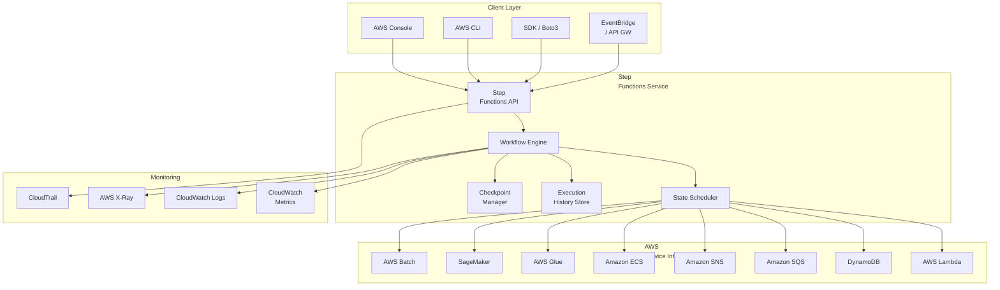
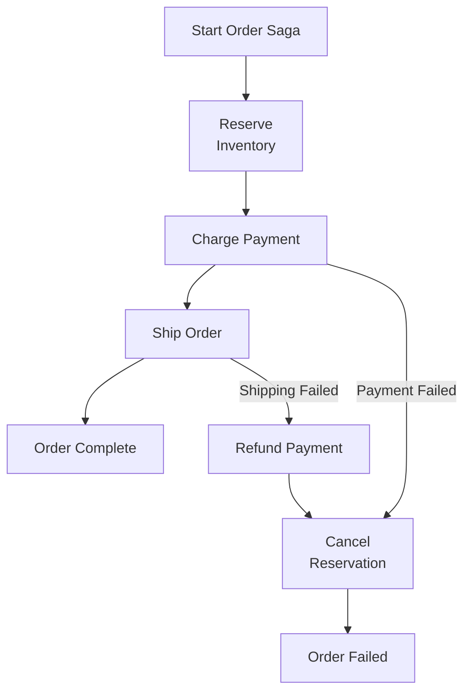
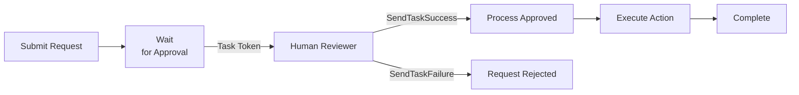
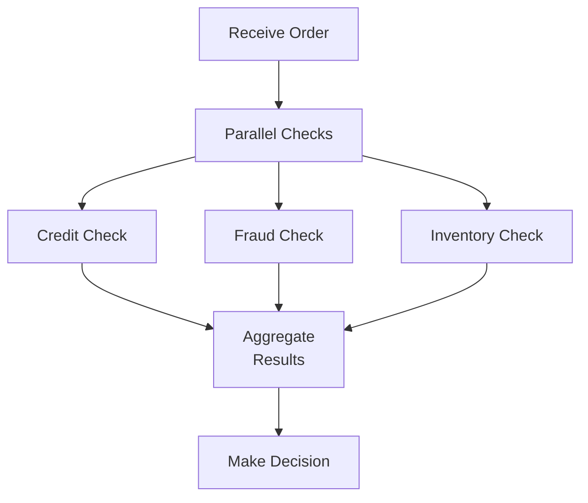
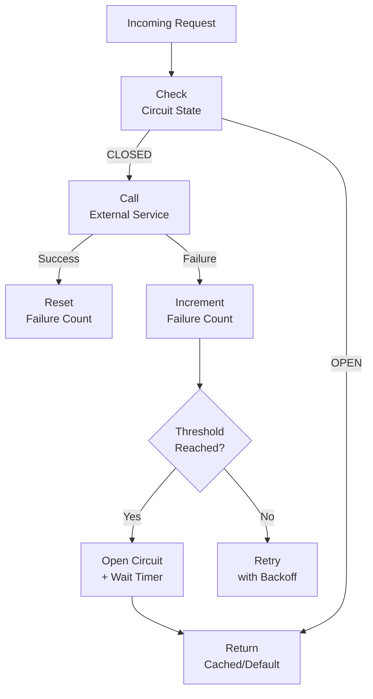

# Chapter 35: AWS Step Functions — Visual Workflow Orchestration

---

## 1. Service Overview

AWS Step Functions is a fully managed serverless orchestration service that lets you coordinate multiple AWS services into serverless workflows. You define workflows as **state machines** using the Amazon States Language (ASL), a JSON-based structured language. Step Functions manages state, checkpointing, and error handling, so your application logic stays clean and maintainable.

### Why Step Functions Exists

Before Step Functions, developers coordinated distributed systems by writing custom orchestration code — polling queues, managing retries, tracking state in databases, and building complex error-handling logic. This "glue code" often became the largest and most fragile part of the system.

Step Functions removes that burden. You declare **what** should happen (tasks, decisions, parallel branches, wait states) and Step Functions handles **how** — reliable execution, automatic retries, state persistence, and visual monitoring.

### Standard vs Express Workflows

| Feature | Standard Workflows | Express Workflows |
|---------|-------------------|-------------------|
| **Duration** | Up to 1 year | Up to 5 minutes |
| **Execution Model** | Exactly-once | At-least-once (async) / At-most-once (sync) |
| **Pricing** | Per state transition | Per execution + duration + memory |
| **History** | Full execution history (90 days) | CloudWatch Logs only |
| **Best For** | Long-running orchestrations, human approval | High-volume event processing, streaming transforms |
| **Max Executions** | Unlimited concurrent | Unlimited concurrent |
| **State Transitions/sec** | 800 (soft limit per account) | Unlimited |

### Key Differentiators

- **Visual Workflow Designer**: Drag-and-drop interface in AWS Console
- **Built-in Error Handling**: Retry, Catch, and Fallback states
- **200+ AWS Service Integrations**: Native SDK integrations (not just Lambda)
- **Event-Driven**: Triggered by EventBridge, API Gateway, S3, SNS, SQS, and more
- **Distributed Map**: Process millions of items in parallel from S3

---

## 2. Learning Objectives

By the end of this chapter, you will be able to:

- **Explain** what AWS Step Functions is, when to use it, and when not to
- **Design** state machines using the Amazon States Language (ASL)
- **Implement** Standard and Express workflows for different use cases
- **Integrate** Step Functions with Lambda, DynamoDB, SQS, SNS, ECS, Glue, SageMaker, and 200+ services
- **Configure** error handling with Retry, Catch, and Fallback patterns
- **Implement** parallel processing, Map states, and Distributed Map for large-scale data
- **Secure** workflows using IAM execution roles and resource-based policies
- **Monitor** executions using CloudWatch Metrics, CloudWatch Logs, and X-Ray
- **Optimize** cost and performance by choosing the right workflow type
- **Troubleshoot** production incidents involving stuck executions, timeouts, throttling, and payload size limits
- **Build** CI/CD pipelines that deploy Step Functions using CloudFormation, CDK, and Terraform
- **Pass** AWS certification questions related to workflow orchestration

---

## 3. Prerequisites

- **AWS Account** with admin or PowerUser access
- **AWS CLI v2** installed and configured
- **Python 3.9+** with Boto3 installed
- **Completed chapters**: Chapter 1 (IAM), Chapter 8 (Lambda), Chapter 10 (DynamoDB), Chapter 12 (SQS)
- **Concepts to know**: JSON, RESTful APIs, event-driven architecture, serverless computing
- **Recommended**: Familiarity with CloudFormation or CDK

---

## 4. Real-world Analogy

Think of Step Functions as an **air traffic control tower** at a busy airport.

Without the tower (without Step Functions), every pilot (every microservice) would have to independently coordinate with other pilots — checking who is landing, who is taking off, who is waiting. The result would be chaos, collisions, and delays.

The control tower (Step Functions) has a complete view of all flights (tasks). It tells each pilot exactly when to move, coordinates sequencing, handles emergencies (errors), reroutes planes when runways are blocked (Catch/Retry), and keeps a complete log of every instruction issued (execution history).

**Extended analogy**:
- **Standard Workflow** = International flights (long-running, precisely tracked, exactly-once)
- **Express Workflow** = Regional shuttle flights (short, high-frequency, best-effort tracking)
- **Choice State** = "If runway 3 is occupied, divert to runway 7"
- **Parallel State** = "Three planes can land simultaneously on different runways"
- **Map State** = "Process the entire queue of 200 waiting aircraft"
- **Wait State** = "Hold in pattern for 10 minutes until slot opens"

---

## 5. Business Use Cases

### Financial Services
- **Payment Processing**: Multi-step payment validation → fraud check → authorization → settlement → notification
- **KYC/AML Compliance**: Document collection → verification → identity check → risk scoring → approval/rejection
- **Trade Settlement**: Order validation → matching → clearing → settlement → regulatory reporting

### Healthcare
- **Patient Onboarding**: Registration → insurance verification → medical history collection → provider assignment
- **Lab Result Processing**: Sample received → testing → QA review → result generation → physician notification → patient notification
- **Claims Processing**: Claim submission → eligibility check → medical review → adjudication → payment

### E-Commerce
- **Order Fulfillment**: Order placed → payment → inventory check → pick/pack → ship → delivery confirmation
- **Returns Processing**: Return requested → authorization → shipping label → item received → inspection → refund
- **Product Catalog Ingestion**: File upload → validation → image processing → enrichment → indexing → publish

### Media & Entertainment
- **Video Processing Pipeline**: Upload → transcode → thumbnail generation → metadata extraction → CDN publish
- **Content Moderation**: Upload → AI/ML analysis → human review (if needed) → approve/reject → publish

### Data Engineering
- **ETL Pipelines**: Extract from sources → transform → validate → load → verify → notify
- **ML Training Pipelines**: Data prep → feature engineering → model training → evaluation → deployment → monitoring

---

## 6. Core Concepts

### State Machine

A state machine is the core unit in Step Functions. It defines a workflow as a collection of **states** connected by **transitions**. Every state machine has exactly one `StartAt` state and at least one terminal state (Succeed or Fail).

```json
{
  "Comment": "A simple sequential workflow",
  "StartAt": "ValidateInput",
  "States": {
    "ValidateInput": {
      "Type": "Task",
      "Resource": "arn:aws:lambda:us-east-1:123456789012:function:validate",
      "Next": "ProcessOrder"
    },
    "ProcessOrder": {
      "Type": "Task",
      "Resource": "arn:aws:lambda:us-east-1:123456789012:function:process",
      "End": true
    }
  }
}
```

### State Types

| State Type | Purpose | Example |
|-----------|---------|---------|
| **Task** | Execute work (Lambda, ECS, Glue, SDK calls) | Invoke a Lambda function |
| **Choice** | Branch based on conditions | If `status == "approved"`, go to ProcessPayment |
| **Parallel** | Execute branches concurrently | Run fraud check AND credit check simultaneously |
| **Map** | Iterate over a collection | Process each line item in an order |
| **Wait** | Pause for a duration or until a timestamp | Wait 30 seconds before retrying |
| **Succeed** | Terminal success state | Workflow completed successfully |
| **Fail** | Terminal failure state | Workflow failed with error message |
| **Pass** | Pass input to output (with transformation) | Add default values to the state data |

### Input/Output Processing

Step Functions provides four JSON processing fields that control data flow between states:

1. **InputPath**: Selects a portion of the state input
2. **Parameters**: Constructs new input using static values and selected input
3. **ResultSelector**: Reshapes the task result
4. **ResultPath**: Determines where the task result is placed in the state input
5. **OutputPath**: Selects a portion of the state output to pass to the next state

**Processing order**: InputPath → Parameters → Task Execution → ResultSelector → ResultPath → OutputPath

### Error Handling

```json
{
  "ProcessPayment": {
    "Type": "Task",
    "Resource": "arn:aws:lambda:us-east-1:123456789012:function:payment",
    "Retry": [
      {
        "ErrorEquals": ["States.TaskFailed", "Lambda.ServiceException"],
        "IntervalSeconds": 2,
        "MaxAttempts": 3,
        "BackoffRate": 2.0
      }
    ],
    "Catch": [
      {
        "ErrorEquals": ["States.ALL"],
        "Next": "HandlePaymentFailure",
        "ResultPath": "$.error"
      }
    ],
    "Next": "SendConfirmation"
  }
}
```

### Built-in Error Codes

| Error Code | Meaning |
|-----------|---------|
| `States.ALL` | Matches any error |
| `States.TaskFailed` | Task returned a failure |
| `States.Timeout` | State or execution timed out |
| `States.Permissions` | Insufficient IAM permissions |
| `States.ResultPathMatchFailure` | ResultPath could not be applied |
| `States.HeartbeatTimeout` | Task heartbeat timed out |
| `States.DataLimitExceeded` | Input/output exceeds 256 KB |

### Distributed Map

Launched in 2022, Distributed Map enables processing millions of items (e.g., files in S3) with up to 10,000 concurrent child executions:

```json
{
  "ProcessAllFiles": {
    "Type": "Map",
    "ItemProcessor": {
      "ProcessorConfig": {
        "Mode": "DISTRIBUTED",
        "ExecutionType": "STANDARD"
      },
      "StartAt": "ProcessFile",
      "States": {
        "ProcessFile": {
          "Type": "Task",
          "Resource": "arn:aws:lambda:us-east-1:123456789012:function:process-file",
          "End": true
        }
      }
    },
    "ItemReader": {
      "Resource": "arn:aws:states:::s3:getObject",
      "ReaderConfig": {
        "InputType": "MANIFEST"
      },
      "Parameters": {
        "Bucket": "my-data-bucket",
        "Key": "manifest.json"
      }
    },
    "MaxConcurrency": 1000,
    "End": true
  }
}
```

---

## 7. Internal Architecture



### How Execution Works Internally

1. **StartExecution API** is called with input JSON
2. The **Workflow Engine** loads the state machine definition
3. The **State Scheduler** evaluates the `StartAt` state
4. For each **Task** state, the engine invokes the integrated service
5. The **Checkpoint Manager** persists state after each transition (Standard only)
6. The engine evaluates the `Next` field or `Choice` rules
7. On errors, the engine evaluates `Retry` and `Catch` blocks
8. The **Execution History** records every event (StateEntered, TaskSucceeded, etc.)
9. The workflow ends at a `Succeed`, `Fail`, or terminal `End: true` state

---

## 8. Service Components

### State Machine
The top-level resource. Defined using ASL (Amazon States Language). Contains the workflow definition, IAM execution role, logging configuration, and tracing configuration.

### Execution
A single run of a state machine. Each execution has a unique ARN, input/output data, status (RUNNING, SUCCEEDED, FAILED, TIMED_OUT, ABORTED), and a history of events.

### Activity
A mechanism for human tasks or external workers. The worker polls for tasks using `GetActivityTask`, performs the work, and reports success/failure using `SendTaskSuccess` or `SendTaskFailure`.

### Task Token (Callback Pattern)
For tasks that need to wait for an external process. Step Functions pauses execution and provides a task token. The external system calls `SendTaskSuccess` or `SendTaskFailure` with the token to resume the workflow.

### Versions and Aliases
- **Version**: An immutable, numbered snapshot of a state machine definition
- **Alias**: A pointer to one or two versions, enabling traffic shifting (canary/linear deployments)

### Execution Event History
Every execution stores a detailed event log: StateEntered, StateExited, TaskSubmitted, TaskSucceeded, TaskFailed, ExecutionStarted, ExecutionSucceeded, etc.

---

## 9. Configuration

### Creating a State Machine (Console)

1. Navigate to **Step Functions** in the AWS Console
2. Click **Create state machine**
3. Choose **Design your workflow visually** or **Write your workflow in code**
4. Select **Standard** or **Express** type
5. Define your states and transitions
6. Configure the **IAM execution role** (Step Functions creates one or you select an existing role)
7. Configure **logging** (CloudWatch Logs log group, log level: ALL, ERROR, FATAL, OFF)
8. Enable **X-Ray tracing** for distributed tracing
9. Add **Tags** for cost allocation and resource management
10. Click **Create state machine**

### IAM Execution Role

The execution role determines which AWS services the state machine can invoke:

```json
{
  "Version": "2012-10-17",
  "Statement": [
    {
      "Effect": "Allow",
      "Action": "lambda:InvokeFunction",
      "Resource": [
        "arn:aws:lambda:us-east-1:123456789012:function:validate-order",
        "arn:aws:lambda:us-east-1:123456789012:function:process-payment"
      ]
    },
    {
      "Effect": "Allow",
      "Action": [
        "logs:CreateLogDelivery",
        "logs:GetLogDelivery",
        "logs:UpdateLogDelivery",
        "logs:DeleteLogDelivery",
        "logs:ListLogDeliveries",
        "logs:PutResourcePolicy",
        "logs:DescribeResourcePolicies",
        "logs:DescribeLogGroups"
      ],
      "Resource": "*"
    },
    {
      "Effect": "Allow",
      "Action": [
        "xray:PutTraceSegments",
        "xray:PutTelemetryRecords",
        "xray:GetSamplingRules",
        "xray:GetSamplingTargets"
      ],
      "Resource": "*"
    }
  ]
}
```

### Logging Configuration

```json
{
  "loggingConfiguration": {
    "level": "ALL",
    "includeExecutionData": true,
    "destinations": [
      {
        "cloudWatchLogsLogGroup": {
          "logGroupArn": "arn:aws:logs:us-east-1:123456789012:log-group:/aws/states/MyStateMachine:*"
        }
      }
    ]
  }
}
```

---

## 10. Code Examples

### Python (Boto3) — Create and Execute a State Machine

```python
import boto3
import json
import time

sfn_client = boto3.client('stepfunctions', region_name='us-east-1')

# Define the state machine
definition = {
    "Comment": "Order Processing Workflow",
    "StartAt": "ValidateOrder",
    "States": {
        "ValidateOrder": {
            "Type": "Task",
            "Resource": "arn:aws:lambda:us-east-1:123456789012:function:validate-order",
            "Retry": [
                {
                    "ErrorEquals": ["States.TaskFailed"],
                    "IntervalSeconds": 2,
                    "MaxAttempts": 3,
                    "BackoffRate": 2.0
                }
            ],
            "Catch": [
                {
                    "ErrorEquals": ["States.ALL"],
                    "Next": "OrderFailed",
                    "ResultPath": "$.error"
                }
            ],
            "Next": "CheckInventory"
        },
        "CheckInventory": {
            "Type": "Task",
            "Resource": "arn:aws:lambda:us-east-1:123456789012:function:check-inventory",
            "Next": "IsInStock"
        },
        "IsInStock": {
            "Type": "Choice",
            "Choices": [
                {
                    "Variable": "$.inStock",
                    "BooleanEquals": True,
                    "Next": "ProcessPayment"
                }
            ],
            "Default": "OutOfStock"
        },
        "ProcessPayment": {
            "Type": "Task",
            "Resource": "arn:aws:lambda:us-east-1:123456789012:function:process-payment",
            "Next": "OrderSucceeded"
        },
        "OutOfStock": {
            "Type": "Task",
            "Resource": "arn:aws:lambda:us-east-1:123456789012:function:notify-out-of-stock",
            "Next": "OrderFailed"
        },
        "OrderSucceeded": {
            "Type": "Succeed"
        },
        "OrderFailed": {
            "Type": "Fail",
            "Error": "OrderProcessingError",
            "Cause": "Order could not be completed"
        }
    }
}

# Create the state machine
response = sfn_client.create_state_machine(
    name='OrderProcessingWorkflow',
    definition=json.dumps(definition),
    roleArn='arn:aws:iam::123456789012:role/StepFunctionsExecutionRole',
    type='STANDARD',
    loggingConfiguration={
        'level': 'ALL',
        'includeExecutionData': True,
        'destinations': [
            {
                'cloudWatchLogsLogGroup': {
                    'logGroupArn': 'arn:aws:logs:us-east-1:123456789012:log-group:/aws/states/OrderProcessing:*'
                }
            }
        ]
    },
    tracingConfiguration={
        'enabled': True
    },
    tags=[
        {'key': 'Environment', 'value': 'production'},
        {'key': 'Team', 'value': 'orders'}
    ]
)

state_machine_arn = response['stateMachineArn']
print(f"State Machine created: {state_machine_arn}")

# Start an execution
execution = sfn_client.start_execution(
    stateMachineArn=state_machine_arn,
    name=f'order-{int(time.time())}',
    input=json.dumps({
        "orderId": "ORD-12345",
        "customerId": "CUST-67890",
        "items": [
            {"productId": "PROD-001", "quantity": 2, "price": 29.99}
        ],
        "totalAmount": 59.98
    })
)

execution_arn = execution['executionArn']
print(f"Execution started: {execution_arn}")

# Poll for completion
while True:
    desc = sfn_client.describe_execution(executionArn=execution_arn)
    status = desc['status']
    print(f"Status: {status}")
    if status in ['SUCCEEDED', 'FAILED', 'TIMED_OUT', 'ABORTED']:
        if status == 'SUCCEEDED':
            print(f"Output: {desc['output']}")
        elif status == 'FAILED':
            print(f"Error: {desc.get('error')}, Cause: {desc.get('cause')}")
        break
    time.sleep(2)
```

### AWS CLI — Common Operations

```bash
# Create a state machine
aws stepfunctions create-state-machine \
  --name OrderProcessingWorkflow \
  --definition file://workflow-definition.json \
  --role-arn arn:aws:iam::123456789012:role/StepFunctionsExecutionRole \
  --type STANDARD \
  --logging-configuration '{
    "level": "ALL",
    "includeExecutionData": true,
    "destinations": [{"cloudWatchLogsLogGroup": {"logGroupArn": "arn:aws:logs:us-east-1:123456789012:log-group:/aws/states/OrderProcessing:*"}}]
  }' \
  --tracing-configuration '{"enabled": true}'

# Start an execution
aws stepfunctions start-execution \
  --state-machine-arn arn:aws:states:us-east-1:123456789012:stateMachine:OrderProcessingWorkflow \
  --name "order-20240101-001" \
  --input '{"orderId": "ORD-12345", "customerId": "CUST-67890"}'

# Describe an execution
aws stepfunctions describe-execution \
  --execution-arn arn:aws:states:us-east-1:123456789012:execution:OrderProcessingWorkflow:order-20240101-001

# List executions
aws stepfunctions list-executions \
  --state-machine-arn arn:aws:states:us-east-1:123456789012:stateMachine:OrderProcessingWorkflow \
  --status-filter FAILED

# Get execution history
aws stepfunctions get-execution-history \
  --execution-arn arn:aws:states:us-east-1:123456789012:execution:OrderProcessingWorkflow:order-20240101-001 \
  --max-results 50

# Stop an execution
aws stepfunctions stop-execution \
  --execution-arn arn:aws:states:us-east-1:123456789012:execution:OrderProcessingWorkflow:order-20240101-001 \
  --cause "Manual cancellation by operations team"

# Update state machine
aws stepfunctions update-state-machine \
  --state-machine-arn arn:aws:states:us-east-1:123456789012:stateMachine:OrderProcessingWorkflow \
  --definition file://updated-workflow.json

# List state machines
aws stepfunctions list-state-machines --max-results 100
```

### Terraform

```hcl
resource "aws_sfn_state_machine" "order_processing" {
  name     = "OrderProcessingWorkflow"
  role_arn = aws_iam_role.step_functions.arn
  type     = "STANDARD"

  definition = jsonencode({
    Comment = "Order Processing Workflow"
    StartAt = "ValidateOrder"
    States = {
      ValidateOrder = {
        Type     = "Task"
        Resource = aws_lambda_function.validate_order.arn
        Next     = "ProcessPayment"
        Retry = [{
          ErrorEquals     = ["States.TaskFailed"]
          IntervalSeconds = 2
          MaxAttempts     = 3
          BackoffRate     = 2.0
        }]
        Catch = [{
          ErrorEquals = ["States.ALL"]
          Next        = "OrderFailed"
          ResultPath  = "$.error"
        }]
      }
      ProcessPayment = {
        Type     = "Task"
        Resource = aws_lambda_function.process_payment.arn
        End      = true
      }
      OrderFailed = {
        Type  = "Fail"
        Error = "OrderProcessingError"
        Cause = "Order could not be completed"
      }
    }
  })

  logging_configuration {
    log_destination        = "${aws_cloudwatch_log_group.sfn.arn}:*"
    include_execution_data = true
    level                  = "ALL"
  }

  tracing_configuration {
    enabled = true
  }

  tags = {
    Environment = "production"
    Team        = "orders"
  }
}

resource "aws_iam_role" "step_functions" {
  name = "StepFunctionsExecutionRole"

  assume_role_policy = jsonencode({
    Version = "2012-10-17"
    Statement = [{
      Action = "sts:AssumeRole"
      Effect = "Allow"
      Principal = {
        Service = "states.amazonaws.com"
      }
    }]
  })
}

resource "aws_iam_role_policy" "step_functions_policy" {
  name = "StepFunctionsPolicy"
  role = aws_iam_role.step_functions.id

  policy = jsonencode({
    Version = "2012-10-17"
    Statement = [
      {
        Effect   = "Allow"
        Action   = "lambda:InvokeFunction"
        Resource = [
          aws_lambda_function.validate_order.arn,
          aws_lambda_function.process_payment.arn
        ]
      }
    ]
  })
}

resource "aws_cloudwatch_log_group" "sfn" {
  name              = "/aws/states/OrderProcessing"
  retention_in_days = 30
}
```

### CloudFormation

```yaml
AWSTemplateFormatVersion: '2010-09-09'
Description: Step Functions Order Processing Workflow

Resources:
  OrderStateMachine:
    Type: AWS::StepFunctions::StateMachine
    Properties:
      StateMachineName: OrderProcessingWorkflow
      StateMachineType: STANDARD
      RoleArn: !GetAtt StepFunctionsRole.Arn
      LoggingConfiguration:
        Level: ALL
        IncludeExecutionData: true
        Destinations:
          - CloudWatchLogsLogGroup:
              LogGroupArn: !GetAtt StateMachineLogGroup.Arn
      TracingConfiguration:
        Enabled: true
      DefinitionString: !Sub |
        {
          "Comment": "Order Processing Workflow",
          "StartAt": "ValidateOrder",
          "States": {
            "ValidateOrder": {
              "Type": "Task",
              "Resource": "${ValidateOrderFunction.Arn}",
              "Next": "ProcessPayment",
              "Retry": [{"ErrorEquals": ["States.TaskFailed"], "IntervalSeconds": 2, "MaxAttempts": 3, "BackoffRate": 2.0}],
              "Catch": [{"ErrorEquals": ["States.ALL"], "Next": "OrderFailed", "ResultPath": "$.error"}]
            },
            "ProcessPayment": {
              "Type": "Task",
              "Resource": "${ProcessPaymentFunction.Arn}",
              "End": true
            },
            "OrderFailed": {
              "Type": "Fail",
              "Error": "OrderProcessingError",
              "Cause": "Order could not be completed"
            }
          }
        }

  StepFunctionsRole:
    Type: AWS::IAM::Role
    Properties:
      AssumeRolePolicyDocument:
        Version: '2012-10-17'
        Statement:
          - Effect: Allow
            Principal:
              Service: states.amazonaws.com
            Action: sts:AssumeRole
      Policies:
        - PolicyName: InvokeLambda
          PolicyDocument:
            Version: '2012-10-17'
            Statement:
              - Effect: Allow
                Action: lambda:InvokeFunction
                Resource:
                  - !GetAtt ValidateOrderFunction.Arn
                  - !GetAtt ProcessPaymentFunction.Arn

  StateMachineLogGroup:
    Type: AWS::Logs::LogGroup
    Properties:
      LogGroupName: /aws/states/OrderProcessing
      RetentionInDays: 30
```

### AWS CDK (TypeScript)

```typescript
import * as cdk from 'aws-cdk-lib';
import * as sfn from 'aws-cdk-lib/aws-stepfunctions';
import * as tasks from 'aws-cdk-lib/aws-stepfunctions-tasks';
import * as lambda from 'aws-cdk-lib/aws-lambda';
import * as logs from 'aws-cdk-lib/aws-logs';

export class OrderProcessingStack extends cdk.Stack {
  constructor(scope: cdk.App, id: string) {
    super(scope, id);

    const validateFn = new lambda.Function(this, 'ValidateOrder', {
      runtime: lambda.Runtime.PYTHON_3_12,
      handler: 'index.handler',
      code: lambda.Code.fromAsset('lambda/validate'),
    });

    const processFn = new lambda.Function(this, 'ProcessPayment', {
      runtime: lambda.Runtime.PYTHON_3_12,
      handler: 'index.handler',
      code: lambda.Code.fromAsset('lambda/process'),
    });

    const validateTask = new tasks.LambdaInvoke(this, 'ValidateOrderTask', {
      lambdaFunction: validateFn,
      outputPath: '$.Payload',
    }).addRetry({
      errors: ['States.TaskFailed'],
      interval: cdk.Duration.seconds(2),
      maxAttempts: 3,
      backoffRate: 2,
    });

    const processTask = new tasks.LambdaInvoke(this, 'ProcessPaymentTask', {
      lambdaFunction: processFn,
      outputPath: '$.Payload',
    });

    const failState = new sfn.Fail(this, 'OrderFailed', {
      error: 'OrderProcessingError',
      cause: 'Order could not be completed',
    });

    validateTask.addCatch(failState, { resultPath: '$.error' });

    const definition = validateTask.next(processTask);

    const logGroup = new logs.LogGroup(this, 'SFNLogGroup', {
      logGroupName: '/aws/states/OrderProcessing',
      retention: logs.RetentionDays.ONE_MONTH,
      removalPolicy: cdk.RemovalPolicy.DESTROY,
    });

    new sfn.StateMachine(this, 'OrderStateMachine', {
      definitionBody: sfn.DefinitionBody.fromChainable(definition),
      stateMachineName: 'OrderProcessingWorkflow',
      stateMachineType: sfn.StateMachineType.STANDARD,
      tracingEnabled: true,
      logs: {
        destination: logGroup,
        level: sfn.LogLevel.ALL,
        includeExecutionData: true,
      },
    });
  }
}
```

---

## 11. Line-by-Line Explanation

### Boto3 `start_execution` Breakdown

```python
# Create a Step Functions client connected to us-east-1
sfn_client = boto3.client('stepfunctions', region_name='us-east-1')

# start_execution sends a request to the Step Functions API
# It returns immediately with an execution ARN — it does NOT wait for completion
execution = sfn_client.start_execution(
    # The ARN of the state machine to execute
    stateMachineArn=state_machine_arn,
    # A unique name for this execution (must be unique within 90 days)
    # If omitted, Step Functions generates a UUID
    name=f'order-{int(time.time())}',
    # The JSON input passed as the initial state data
    # This becomes the input to the StartAt state
    # Maximum payload size: 256 KB
    input=json.dumps({
        "orderId": "ORD-12345",
        "customerId": "CUST-67890"
    })
)
```

### ASL Choice State Breakdown

```json
{
  "IsInStock": {
    "Type": "Choice",               // Branch based on runtime data
    "Choices": [                     // Array of rules evaluated in order
      {
        "Variable": "$.inStock",     // JSONPath to the variable being tested
        "BooleanEquals": true,       // Comparison operator + value
        "Next": "ProcessPayment"     // State to transition to if rule matches
      }
    ],
    "Default": "OutOfStock"          // Fallback state if no rule matches
  }
}
```

### ASL Retry Configuration Breakdown

```json
{
  "Retry": [
    {
      "ErrorEquals": ["States.TaskFailed"],  // Which errors trigger this retry rule
      "IntervalSeconds": 2,                   // Wait 2s before first retry
      "MaxAttempts": 3,                       // Retry up to 3 times (4 total attempts)
      "BackoffRate": 2.0                      // Double the wait each retry: 2s, 4s, 8s
    }
  ]
}
```

---

## 12. Security Deep Dive

### IAM Execution Role (Least Privilege)

Every state machine requires an IAM execution role. This role determines which services the workflow can invoke. **Never use `*` resources in production.**

```json
{
  "Version": "2012-10-17",
  "Statement": [
    {
      "Sid": "InvokeSpecificLambdaFunctions",
      "Effect": "Allow",
      "Action": "lambda:InvokeFunction",
      "Resource": [
        "arn:aws:lambda:us-east-1:123456789012:function:validate-order",
        "arn:aws:lambda:us-east-1:123456789012:function:process-payment"
      ]
    },
    {
      "Sid": "AllowDynamoDBAccess",
      "Effect": "Allow",
      "Action": [
        "dynamodb:GetItem",
        "dynamodb:PutItem",
        "dynamodb:UpdateItem"
      ],
      "Resource": "arn:aws:dynamodb:us-east-1:123456789012:table/Orders"
    }
  ]
}
```

### Resource-Based Policy (Cross-Account Execution)

```json
{
  "Version": "2012-10-17",
  "Statement": [
    {
      "Sid": "AllowCrossAccountExecution",
      "Effect": "Allow",
      "Principal": {
        "AWS": "arn:aws:iam::987654321098:root"
      },
      "Action": "states:StartExecution",
      "Resource": "arn:aws:states:us-east-1:123456789012:stateMachine:OrderProcessing"
    }
  ]
}
```

### VPC Configuration for ECS/Fargate Tasks

When your state machine invokes ECS tasks or other VPC-bound resources, configure the task state with VPC parameters.

### Data Encryption

- **In Transit**: All API calls use TLS 1.2+
- **At Rest**: Execution history and input/output data encrypted with AWS-managed keys by default
- **Customer Managed Keys (CMK)**: Supported via `encryptionConfiguration` with KMS key ARN
- **Sensitive Data**: Use `ResultPath` and `OutputPath` to filter sensitive fields from execution history

### Security Best Practices

| Practice | Description |
|----------|-------------|
| Least-privilege execution role | Grant only the permissions each state needs |
| Use resource-level permissions | Never use `Resource: "*"` |
| Enable CloudTrail logging | Audit all API calls |
| Enable execution logging | Set log level to ALL in production |
| Encrypt with CMK | Use KMS CMK for sensitive workflows |
| Validate input | Use JSONSchema validation in the first Task state |
| Redact PII from logs | Filter sensitive data using OutputPath |
| Use VPC endpoints | `com.amazonaws.region.states` for private connectivity |

---

## 13. Monitoring & Observability

### CloudWatch Metrics

| Metric | Description | Alarm Threshold |
|--------|-------------|-----------------|
| `ExecutionsStarted` | Number of executions started | Spike detection |
| `ExecutionsSucceeded` | Number of successful executions | Drop below baseline |
| `ExecutionsFailed` | Number of failed executions | > 0 |
| `ExecutionsTimedOut` | Executions that timed out | > 0 |
| `ExecutionsAborted` | Executions manually stopped | > 0 |
| `ExecutionTime` | Duration of executions | p99 > SLA |
| `ExecutionThrottled` | Throttled start requests | > 0 |
| `LambdaFunctionsStarted` | Lambda invocations from workflow | Correlation with cost |
| `ServiceIntegrationsStarted` | Non-Lambda service invocations | Trend analysis |

### CloudWatch Alarms

```bash
# Alarm on failed executions
aws cloudwatch put-metric-alarm \
  --alarm-name "StepFunctions-OrderWorkflow-Failures" \
  --metric-name ExecutionsFailed \
  --namespace AWS/States \
  --dimensions Name=StateMachineArn,Value=arn:aws:states:us-east-1:123456789012:stateMachine:OrderProcessingWorkflow \
  --statistic Sum \
  --period 300 \
  --threshold 1 \
  --comparison-operator GreaterThanOrEqualToThreshold \
  --evaluation-periods 1 \
  --alarm-actions arn:aws:sns:us-east-1:123456789012:ops-alerts

# Alarm on execution duration
aws cloudwatch put-metric-alarm \
  --alarm-name "StepFunctions-OrderWorkflow-SlowExecutions" \
  --metric-name ExecutionTime \
  --namespace AWS/States \
  --dimensions Name=StateMachineArn,Value=arn:aws:states:us-east-1:123456789012:stateMachine:OrderProcessingWorkflow \
  --statistic p99 \
  --period 300 \
  --threshold 30000 \
  --comparison-operator GreaterThanOrEqualToThreshold \
  --evaluation-periods 3 \
  --alarm-actions arn:aws:sns:us-east-1:123456789012:ops-alerts
```

### AWS X-Ray Tracing

Enable tracing in the state machine configuration. X-Ray creates a service map showing the entire workflow execution path, including all downstream Lambda functions and AWS services.

### Execution History Analysis (Boto3)

```python
def analyze_failed_executions(state_machine_arn, hours=24):
    """Analyze failed executions over the last N hours."""
    sfn = boto3.client('stepfunctions')
    paginator = sfn.get_paginator('list_executions')

    failed_count = 0
    error_summary = {}

    for page in paginator.paginate(
        stateMachineArn=state_machine_arn,
        statusFilter='FAILED'
    ):
        for execution in page['executions']:
            desc = sfn.describe_execution(executionArn=execution['executionArn'])
            error = desc.get('error', 'Unknown')
            cause = desc.get('cause', 'No cause provided')

            error_summary[error] = error_summary.get(error, 0) + 1
            failed_count += 1

    print(f"Total failed executions: {failed_count}")
    for error, count in sorted(error_summary.items(), key=lambda x: -x[1]):
        print(f"  {error}: {count} occurrences")
```

---

## 14. Performance & Cost Optimization

### Cost Model

| Workflow Type | Pricing |
|---------------|---------|
| **Standard** | $0.025 per 1,000 state transitions |
| **Express** | $1.00 per 1M requests + $0.00001667/GB-second |

### Optimization Strategies

**1. Use Express Workflows for High-Volume, Short-Duration Tasks**
If your workflow completes in under 5 minutes and runs thousands of times per day, Express is significantly cheaper.

**2. Reduce State Transitions**
Each state transition costs money. Combine sequential Lambda invocations into a single Lambda function when they always run together.

**3. Use SDK Integrations Instead of Lambda**
Instead of invoking a Lambda to write to DynamoDB, use the native DynamoDB SDK integration. This eliminates Lambda costs and reduces latency.

```json
{
  "WriteToTable": {
    "Type": "Task",
    "Resource": "arn:aws:states:::dynamodb:putItem",
    "Parameters": {
      "TableName": "Orders",
      "Item": {
        "orderId": {"S.$": "$.orderId"},
        "status": {"S": "PROCESSING"}
      }
    },
    "Next": "NextState"
  }
}
```

**4. Use Distributed Map for Batch Processing**
Instead of starting thousands of individual executions, use Distributed Map to process large datasets in a single parent execution.

**5. Set Explicit Timeouts**
Always set `TimeoutSeconds` on Task states and `TimeoutSeconds` on the state machine itself. Runaway executions waste money.

**6. Use ResultPath and OutputPath to Minimize Payload Size**
Large payloads slow down execution and increase the risk of hitting the 256 KB limit.

### Performance Comparison

| Scenario | Standard | Express |
|----------|----------|---------|
| 10,000 executions/day, 5 states each | $1.25/day | ~$0.30/day |
| 1M executions/day, 3 states each | $75/day | ~$3.50/day |
| Long-running (hours) orchestration | Supported | Not supported |

---

## 15. Enterprise Integration

### Multi-Account Architecture

```
┌─────────────────────────────────────────────────────────────┐
│  Management Account                                         │
│  ┌─────────────────┐                                        │
│  │ AWS Organizations│                                       │
│  │ Control Tower    │                                       │
│  └─────────────────┘                                        │
├─────────────────────────────────────────────────────────────┤
│  Orchestration Account                                      │
│  ┌──────────────────────────────────┐                       │
│  │ Step Functions State Machines    │                       │
│  │  - Order Processing              │                       │
│  │  - Data Pipeline                 │                       │
│  │  - Deployment Orchestration      │                       │
│  └──────────┬───────────────────────┘                       │
│             │ Cross-account IAM roles                       │
├─────────────┼───────────────────────────────────────────────┤
│  Compute Account     │    Data Account    │ Notification    │
│  ┌──────────────┐   │   ┌────────────┐   │  ┌──────────┐  │
│  │ Lambda Fns   │   │   │ DynamoDB   │   │  │ SNS/SES  │  │
│  │ ECS Tasks    │   │   │ S3 Buckets │   │  │ Topics   │  │
│  └──────────────┘   │   └────────────┘   │  └──────────┘  │
└─────────────────────┴────────────────────┴────────────────┘
```

### Event-Driven Trigger Patterns

- **API Gateway → Step Functions**: Synchronous REST API workflows
- **EventBridge → Step Functions**: Scheduled or event-driven workflows
- **S3 Event → EventBridge → Step Functions**: File processing pipelines
- **SQS → Lambda → Step Functions**: Queue-driven orchestration
- **SNS → Step Functions**: Notification-triggered workflows
- **IoT Core → Step Functions**: Device event processing

### Service Quotas

| Quota | Standard | Express |
|-------|----------|---------|
| Max execution duration | 1 year | 5 minutes |
| Max state transitions/execution | 25,000 | Unlimited |
| State transitions/second (account) | 800 (soft) | Unlimited |
| Max open executions | 1,000,000 | Unlimited |
| Max input/output size | 256 KB | 256 KB |
| StartExecution throttle | 500/sec (soft) | Unlimited |
| Max state machine definition size | 1 MB | 1 MB |

---

## 16. Real Industry Use Cases

### Case 1: Netflix — Video Encoding Pipeline
**Problem**: Process thousands of video uploads daily through encoding, quality checks, metadata extraction, and CDN distribution.
**Solution**: Step Functions orchestrates a parallel pipeline: transcode to multiple resolutions → generate thumbnails → extract metadata → run content moderation → publish to CDN.
**Result**: 60% reduction in pipeline management code, 99.9% reliability.

### Case 2: Capital One — Loan Application Processing
**Problem**: Loan applications require 12+ sequential and parallel checks (credit, identity, income, compliance) with human approval gates.
**Solution**: Step Functions with Callback pattern for human approval, Parallel state for concurrent checks, and Choice states for routing based on risk score.
**Result**: Processing time reduced from 5 days to 4 hours.

### Case 3: Coca-Cola — Supply Chain Optimization
**Problem**: Real-time inventory tracking across thousands of locations with automated reorder workflows.
**Solution**: IoT sensors → EventBridge → Step Functions → Lambda (analytics) + DynamoDB (state) + SNS (alerts).
**Result**: 15% reduction in stockouts, automated reordering at 2,000+ locations.

### Case 4: BMW — Connected Vehicle Data Processing
**Problem**: Process millions of telemetry events from connected vehicles for predictive maintenance.
**Solution**: Kinesis → Lambda → Step Functions (Distributed Map) → SageMaker inference → DynamoDB.
**Result**: Process 100M+ events/day with sub-second latency for critical alerts.

---

## 17. Architecture Patterns

### Pattern 1: Saga Pattern (Distributed Transactions)



### Pattern 2: Human-in-the-Loop (Callback Pattern)



### Pattern 3: Fan-Out / Fan-In (Parallel Processing)



### Pattern 4: Circuit Breaker



---

## 18. Production Incident War Room

### Incident 1: Execution Stuck in RUNNING State for 48 Hours
**Severity**: P1 — Critical
**Symptoms**: Order processing workflow shows RUNNING for 48+ hours. Customers not receiving confirmations.
**Business Impact**: 2,300 orders stuck in processing. Customer service overwhelmed with complaints.
**Root Cause**: A Task state invoked a Lambda function that called an external API. The API was down, and the Lambda timed out after 15 minutes. The Task state had no `TimeoutSeconds` configured, so the state machine waited indefinitely for a response that would never come.
**CloudWatch Metrics**: `ExecutionsStarted` increasing, `ExecutionsSucceeded` flat.
**CloudWatch Logs**: No TaskSucceeded or TaskFailed event after TaskScheduled.
**CLI Diagnostic**:
```bash
aws stepfunctions get-execution-history \
  --execution-arn arn:aws:states:us-east-1:123456789012:execution:OrderWorkflow:order-stuck-001 \
  --reverse-order --max-results 10
```
**Immediate Mitigation**: Stop stuck executions using `stop-execution`. Reprocess orders manually.
**Permanent Fix**: Add `TimeoutSeconds: 300` and `HeartbeatSeconds: 60` to all Task states. Add `Catch` blocks to route timeouts to a dead-letter queue.
**Preventive Control**: CloudWatch alarm on `ExecutionTime` p99 > 600 seconds.

---

### Incident 2: Payload Size Exceeded (States.DataLimitExceeded)
**Severity**: P2 — High
**Symptoms**: Executions failing with error `States.DataLimitExceeded`.
**Business Impact**: All batch processing workflows failing. 15,000 records unprocessed.
**Root Cause**: A Map state accumulated results from 500 iterations. Each iteration returned 1 KB of data. Total payload exceeded the 256 KB limit.
**CLI Diagnostic**:
```bash
aws stepfunctions get-execution-history \
  --execution-arn arn:aws:states:us-east-1:123456789012:execution:BatchWorkflow:batch-001 \
  | jq '.events[] | select(.type == "ExecutionFailed")'
```
**Immediate Mitigation**: Reduce batch size to 100 items per execution.
**Permanent Fix**: Store intermediate results in S3 or DynamoDB instead of passing them between states. Use `ResultPath: null` to discard unneeded output. Switch to Distributed Map for large datasets.
**Lessons Learned**: Never accumulate unbounded data in state output. Design for data streaming, not accumulation.

---

### Incident 3: Throttling on StartExecution API
**Severity**: P2 — High
**Symptoms**: `ThrottlingException` errors when starting new executions. Upstream services timing out.
**Business Impact**: 40% of incoming requests rejected during peak traffic.
**Root Cause**: Application started 800+ executions/second during Black Friday sale. Default `StartExecution` throttle is 500/second.
**CloudWatch Metrics**: `ExecutionThrottled` spiking.
**CLI Diagnostic**:
```bash
aws cloudwatch get-metric-statistics \
  --namespace AWS/States \
  --metric-name ExecutionThrottled \
  --period 60 --start-time 2024-11-29T00:00:00 --end-time 2024-11-29T23:59:59 \
  --statistics Sum
```
**Immediate Mitigation**: Place SQS queue in front of Step Functions to buffer requests.
**Permanent Fix**: Request service quota increase. Implement SQS → Lambda → Step Functions buffering pattern. Use Express Workflows for high-throughput use cases.
**Preventive Control**: Load test before peak events. Monitor `ExecutionThrottled` metric.

---

### Incident 4: Lambda Cold Start Causing Workflow Timeouts
**Severity**: P2 — High
**Symptoms**: Intermittent workflow failures with `States.Timeout` on Lambda Task states.
**Root Cause**: Lambda functions using large deployment packages (250 MB) with VPC configuration. Cold starts taking 15+ seconds. Task state `TimeoutSeconds` set to 10.
**Immediate Mitigation**: Increase `TimeoutSeconds` to 60.
**Permanent Fix**: Enable Provisioned Concurrency on critical Lambda functions. Reduce deployment package size. Use Lambda Layers. Consider removing VPC if not required.

---

### Incident 5: Cross-Account Execution Failing with AccessDeniedException
**Severity**: P2 — High
**Symptoms**: State machine in Account A fails when invoking Lambda in Account B.
**Root Cause**: The Step Functions execution role in Account A had `lambda:InvokeFunction` permission, but the Lambda resource policy in Account B did not grant cross-account access.
**Permanent Fix**: Add resource-based policy to the Lambda function in Account B allowing the Step Functions role from Account A.

---

### Incident 6: Map State Processing Incorrect Number of Items
**Severity**: P3 — Medium
**Symptoms**: Map state processing only 40 items instead of 400.
**Root Cause**: `MaxConcurrency` was set to 40, and the application incorrectly interpreted this as maximum items (it is maximum parallel executions). The actual issue was that `InputPath` pointed to a nested array that only contained 40 items — the remaining 360 were in a different key.
**Permanent Fix**: Fix `InputPath` to reference the correct array. Add input validation state before Map.

---

### Incident 7: Execution History Limit Reached (25,000 Events)
**Severity**: P2 — High
**Symptoms**: Long-running workflows failing after several days with `ExecutionLimitExceeded`.
**Root Cause**: Standard workflows have a 25,000 event limit. A polling loop (Wait → Lambda → Choice → Wait) generated events rapidly.
**Permanent Fix**: Use `Continue As New Execution` pattern — when event count approaches the limit, start a new execution with the current state as input. Break long-running workflows into child executions using nested state machines.

---

### Incident 8: Express Workflow Losing Events Under Load
**Severity**: P1 — Critical
**Symptoms**: Processing pipeline reports 5% data loss. Express Workflow executions not tracked.
**Root Cause**: Express Workflows use at-least-once (async) or at-most-once (sync) execution semantics. Under extreme load, some asynchronous Express executions were dropped.
**Permanent Fix**: Switch to Standard Workflows for exactly-once semantics on critical data. Use SQS as a buffer for Express Workflows to ensure no messages are lost.

---

### Incident 9: State Machine Update Broke Running Executions
**Severity**: P2 — High
**Symptoms**: After deploying updated state machine definition, new states added are not executing. Some executions failing with `States.Runtime` error.
**Root Cause**: Running executions use the definition that was active when they started. However, the new definition renamed a state, and running executions transitioning to the old state name failed.
**Permanent Fix**: Use Versions and Aliases. Deploy new versions and shift traffic gradually. Never rename states that running executions might transition to.

---

### Incident 10: CloudWatch Logs Not Appearing for Express Workflow
**Severity**: P3 — Medium
**Symptoms**: Express Workflow executions running but no logs in CloudWatch.
**Root Cause**: Express Workflows require explicit logging configuration with IAM permissions for `logs:CreateLogDelivery`, `logs:PutLogEvents`, etc. The execution role was missing these permissions.
**Permanent Fix**: Add CloudWatch Logs permissions to the execution role. Set `level: ALL` in logging configuration.

---

### Incident 11: Infinite Loop in Choice State
**Severity**: P1 — Critical
**Symptoms**: Standard Workflow generating thousands of state transitions per minute. Cost spiking.
**Root Cause**: A Choice state's `Default` route pointed back to the same state (circular transition). No exit condition existed for the default case.
**Immediate Mitigation**: Stop all affected executions.
**Permanent Fix**: Add a counter variable incremented on each loop. Add a Choice rule to break after N iterations. Add a `Fail` state as the final fallback.
**Preventive Control**: Code review checklist for state machine definitions. Automated lint tool to detect loops.

---

### Incident 12: Activity Worker Not Receiving Tasks
**Severity**: P2 — High
**Symptoms**: Activity tasks stuck in `ActivityScheduled` state. Workers polling but receiving no tasks.
**Root Cause**: The Activity ARN in the state machine definition did not match the Activity ARN the worker was polling. Region mismatch.
**Permanent Fix**: Verify Activity ARNs match exactly. Use CloudFormation/CDK to manage Activity resources and references.

---

### Incident 13: Callback Token Expired
**Severity**: P3 — Medium
**Symptoms**: External system calls `SendTaskSuccess` but receives `TaskTimedOut` error.
**Root Cause**: The Task state with `.waitForTaskToken` had a `HeartbeatSeconds` of 300. The external system took 10 minutes to complete processing.
**Permanent Fix**: Increase `HeartbeatSeconds` to match the expected processing time. Implement heartbeat pings from the external system using `SendTaskHeartbeat`.

---

### Incident 14: Distributed Map Failing with S3 Access Denied
**Severity**: P2 — High
**Symptoms**: Distributed Map state fails immediately with `States.TaskFailed` and S3 AccessDenied in cause.
**Root Cause**: The execution role had `s3:GetObject` permission but was missing `s3:ListBucket` permission required by the ItemReader to list objects.
**Permanent Fix**: Add `s3:ListBucket`, `s3:GetObject`, and `s3:GetBucketLocation` to the execution role for Distributed Map S3 item readers.

---

### Incident 15: Concurrent Execution Limit Reached
**Severity**: P2 — High
**Symptoms**: New executions being rejected. API returning `ExecutionLimitExceeded`.
**Root Cause**: Account had 1,000,000 open Standard executions (default limit). Old executions from failed cleanup logic were never completing.
**Immediate Mitigation**: Identify and stop abandoned executions older than 7 days.
**Permanent Fix**: Always set `TimeoutSeconds` at the state machine level. Implement automated cleanup of stale executions. Request quota increase if legitimate workload requires more.

---

## 19. Production Best Practices (Well-Architected)

### Operational Excellence
- **Always set TimeoutSeconds** on every Task state AND the state machine itself
- **Enable logging at ALL level** for Standard Workflows in production
- **Enable X-Ray tracing** for end-to-end visibility
- **Use descriptive state names** (e.g., `ValidateCustomerIdentity` not `Step3`)
- **Version your state machine definitions** using Versions and Aliases
- **Use IaC** (CloudFormation, CDK, Terraform) — never create state machines manually in production

### Security
- **Least-privilege execution roles** — grant only the specific actions and resources each state needs
- **Use VPC endpoints** for private connectivity when all resources are in VPC
- **Encrypt with CMK** for sensitive data workflows
- **Redact PII** using OutputPath and ResultSelector

### Reliability
- **Configure Retry with exponential backoff** on all Task states
- **Configure Catch blocks** as fallback for all retryable errors
- **Use the Saga pattern** for distributed transactions with compensating actions
- **Implement the Continue As New pattern** for long-running workflows approaching the 25,000 event limit
- **Use Standard Workflows** for business-critical exactly-once processing

### Performance
- **Use Express Workflows** for high-throughput, short-duration workloads
- **Use SDK integrations** instead of Lambda where possible to eliminate cold starts
- **Use Parallel states** for independent tasks that can run concurrently
- **Set MaxConcurrency on Map states** to control downstream service load

### Cost
- **Minimize state transitions** by combining sequential tasks
- **Use Express Workflows** for high-volume, short-duration workflows
- **Use SDK integrations** to eliminate Lambda invocation costs
- **Set timeouts** to prevent runaway execution costs

---

## 20. Migration Strategies

### From Custom Orchestration Code to Step Functions

**Phase 1**: Identify all orchestration logic in your codebase (queue polling, state tracking, retry loops, error routing)

**Phase 2**: Map each piece of logic to an ASL state type:
- Queue polling → Task state with SQS integration
- State tracking → Built-in state management
- Retry loops → Retry configuration
- Error routing → Catch blocks and Choice states
- Conditional branching → Choice state

**Phase 3**: Build the state machine definition incrementally. Start with the happy path, then add error handling.

**Phase 4**: Deploy in shadow mode — run both the old and new systems in parallel. Compare outputs.

**Phase 5**: Cutover with feature flags. Route traffic gradually.

### From AWS SWF to Step Functions

AWS Simple Workflow Service (SWF) is the predecessor to Step Functions. Migration steps:
1. Map SWF Activities to Task states
2. Map SWF Deciders to Choice states
3. Replace SWF signals with Callback pattern (task tokens)
4. Replace SWF timers with Wait states
5. Replace SWF child workflows with nested state machines

### From Airflow to Step Functions

For data pipeline migrations:
1. Map DAG structure to state machine definition
2. Replace Airflow Operators with Task states (Lambda, Glue, ECS integrations)
3. Replace Airflow Sensors with Wait + Choice loops or EventBridge
4. Replace Airflow XComs with state machine data passing
5. Use Distributed Map for fan-out patterns

---

## 21. CI/CD Integration

### GitHub Actions Deployment

```yaml
name: Deploy Step Functions
on:
  push:
    branches: [main]
    paths: ['stepfunctions/**']

jobs:
  deploy:
    runs-on: ubuntu-latest
    permissions:
      id-token: write
      contents: read
    steps:
      - uses: actions/checkout@v4

      - name: Configure AWS Credentials
        uses: aws-actions/configure-aws-credentials@v4
        with:
          role-to-assume: arn:aws:iam::123456789012:role/GitHubActionsRole
          aws-region: us-east-1

      - name: Validate State Machine Definition
        run: |
          python -c "
          import json
          with open('stepfunctions/definition.json') as f:
              d = json.load(f)
              assert 'StartAt' in d, 'Missing StartAt'
              assert 'States' in d, 'Missing States'
              print(f'Valid: {len(d[\"States\"])} states')
          "

      - name: Deploy via CloudFormation
        run: |
          aws cloudformation deploy \
            --template-file stepfunctions/template.yaml \
            --stack-name order-processing-workflow \
            --capabilities CAPABILITY_IAM \
            --parameter-overrides Environment=production

      - name: Smoke Test
        run: |
          EXEC_ARN=$(aws stepfunctions start-execution \
            --state-machine-arn arn:aws:states:us-east-1:123456789012:stateMachine:OrderProcessingWorkflow \
            --input '{"test": true, "orderId": "SMOKE-TEST-001"}' \
            --query 'executionArn' --output text)
          echo "Started smoke test: $EXEC_ARN"
          sleep 30
          STATUS=$(aws stepfunctions describe-execution \
            --execution-arn $EXEC_ARN \
            --query 'status' --output text)
          if [ "$STATUS" != "SUCCEEDED" ]; then
            echo "Smoke test failed with status: $STATUS"
            exit 1
          fi
```

### Blue/Green Deployment with Aliases

```bash
# Create a new version
VERSION_ARN=$(aws stepfunctions publish-state-machine-version \
  --state-machine-arn arn:aws:states:us-east-1:123456789012:stateMachine:OrderProcessingWorkflow \
  --query 'stateMachineVersionArn' --output text)

# Update alias to shift 10% traffic to new version (canary)
aws stepfunctions update-state-machine-alias \
  --state-machine-alias-arn arn:aws:states:us-east-1:123456789012:stateMachine:OrderProcessingWorkflow:prod \
  --routing-configuration "[
    {\"stateMachineVersionArn\": \"$OLD_VERSION_ARN\", \"weight\": 90},
    {\"stateMachineVersionArn\": \"$VERSION_ARN\", \"weight\": 10}
  ]"

# Monitor for errors, then shift 100% traffic
aws stepfunctions update-state-machine-alias \
  --state-machine-alias-arn arn:aws:states:us-east-1:123456789012:stateMachine:OrderProcessingWorkflow:prod \
  --routing-configuration "[
    {\"stateMachineVersionArn\": \"$VERSION_ARN\", \"weight\": 100}
  ]"
```

---

## 22. Practical Projects

### Beginner Project: Basic AWS Step Functions Deployment
- **Business Requirement**: Deploy baseline AWS Step Functions resources securely.
- **Architecture**: Single-region deployment with default VPC subnets and restricted IAM roles.
- **Implementation**: Write a Terraform `main.tf` to provision AWS Step Functions and apply the configuration. Verify resource creation in the AWS Console.

### Intermediate Project: Multi-AZ Scalable AWS Step Functions Setup
- **Business Requirement**: Implement high availability and automated scaling for AWS Step Functions to withstand Availability Zone failures.
- **Architecture**: Application Load Balancer -> Auto Scaling Group -> AWS Step Functions -> KMS Encrypted Persistence Layer.
- **Implementation**: Configure scaling policies based on CPU utilization and set up CloudWatch Alarms for monitoring metrics.

### Advanced Project: Automated CI/CD Pipeline Integration
- **Business Requirement**: Automate the deployment and testing of AWS Step Functions infrastructure without manual intervention.
- **Architecture**: GitHub Repository -> AWS CodePipeline -> AWS CodeBuild -> Deployment to AWS Step Functions Targets.
- **Implementation**: Write a `buildspec.yml` to run automated security linting (e.g., tfsec or Checkov) before deploying the AWS Step Functions changes.

### Enterprise Project: Zero-Trust Multi-Account Architecture
- **Business Requirement**: Deploy a production-grade multi-account enterprise environment utilizing AWS Step Functions with centralized security governance.
- **Architecture**: AWS Organizations -> AWS Transit Gateway -> Hub-and-Spoke VPCs -> Multi-AZ AWS Step Functions -> AWS IAM Identity Center SSO.
- **Implementation**: Implement Service Control Policies (SCPs) to restrict AWS Step Functions deployments to approved regions and mandate AWS KMS customer-managed keys (CMKs) for all data at rest.

---

## 23. Interview Preparation

### Beginner Level
**Q1**: What is AWS Step Functions?
**A**: A managed serverless orchestration service that coordinates multiple AWS services into workflows defined as state machines using Amazon States Language (ASL).

**Q2**: What is the difference between Standard and Express Workflows?
**A**: Standard: up to 1 year, exactly-once, per-transition pricing, full history. Express: up to 5 min, at-least-once, per-request pricing, logs only.

**Q3**: Name the 8 state types in Step Functions.
**A**: Task, Choice, Parallel, Map, Wait, Succeed, Fail, Pass.

### Intermediate Level
**Q4**: How does error handling work in Step Functions?
**A**: Two mechanisms: **Retry** (automatic retry with configurable backoff) and **Catch** (route errors to a fallback state). Retry is evaluated first. If all retries are exhausted, Catch is evaluated.

**Q5**: What is the Callback pattern and when would you use it?
**A**: The `.waitForTaskToken` integration pattern. Step Functions pauses and provides a task token. An external system (human, third-party API) calls `SendTaskSuccess` or `SendTaskFailure` to resume. Used for human approval, external API integrations, and long-running processes.

**Q6**: What is the 256 KB payload limit and how do you work around it?
**A**: State input/output is limited to 256 KB. Store large data in S3 or DynamoDB and pass references (S3 keys, DynamoDB keys) between states instead of the data itself.

### Advanced Level
**Q7**: Explain the Saga pattern in the context of Step Functions.
**A**: The Saga pattern implements distributed transactions with compensating actions. Each step has a corresponding undo step. If step 3 fails, the workflow executes compensation for steps 2 and 1 in reverse order. Implemented using Catch blocks that route to compensation states.

**Q8**: How does Distributed Map differ from inline Map?
**A**: Inline Map runs within the parent execution (limited by 25,000 events). Distributed Map spawns child executions (up to 10,000 concurrent), can read items from S3, handles millions of items, and stores results in S3.

**Q9**: Design a file processing system that handles 10 million files using Step Functions.
**A**: Use Distributed Map with S3 item reader. Set MaxConcurrency to manage downstream load. Each child execution processes one file via Lambda. Use Express child executions for cost optimization. Store results in S3 using the ResultWriter configuration. Monitor with CloudWatch and X-Ray.

### Senior / Solutions Architect Level
**Q10**: How would you implement a multi-region active-active workflow with Step Functions?
**A**: Step Functions is regional. Deploy identical state machines in each region. Use Route 53 latency-based routing to direct API calls to the nearest region. Use DynamoDB Global Tables for shared state. Implement idempotency in all task handlers to handle potential duplicate executions.

**Q11**: Compare Step Functions with EventBridge Pipes, SQS, and custom orchestration. When would you choose each?
**A**: Step Functions for complex multi-step workflows with branching and error handling. EventBridge Pipes for simple source→filter→transform→target patterns. SQS for simple decoupling. Custom orchestration only when you need sub-millisecond latency or custom persistence.

### System Design Interview
**Q12**: Design an e-commerce order fulfillment system using Step Functions.
**A**: API Gateway receives order → Step Functions Standard Workflow: Validate Order → Check Inventory (parallel: multiple warehouses) → Choice (in stock?) → Reserve Inventory → Process Payment (retry 3x) → Catch (payment failed → release inventory) → Ship Order → Send Confirmation → Update Order Status. Use DynamoDB for order state, SNS for notifications, SQS DLQ for failed orders, CloudWatch for monitoring.

---

## 24. AWS Certification Practice

### Cloud Practitioner
**Q1**: Which AWS service helps you coordinate multiple AWS services into serverless workflows?
- A) AWS Lambda
- B) Amazon SQS
- **C) AWS Step Functions** ✓
- D) Amazon EventBridge

### Solutions Architect Associate
**Q2**: A company processes insurance claims through 12 sequential steps including external API calls and human approval. Which architecture best meets this requirement?
- A) Chain Lambda functions using SNS
- **B) Use Step Functions with Task states and Callback pattern** ✓
- C) Use SQS queues between each Lambda function
- D) Use EventBridge Pipes

**Q3**: A workflow processes 5 million images daily. Each image takes 3 seconds. Which Step Functions configuration minimizes cost?
- A) Standard Workflow with inline Map
- **B) Standard Workflow with Distributed Map using Express child executions** ✓
- C) Express Workflow with inline Map
- D) Standard Workflow with Parallel states

### Solutions Architect Professional
**Q4**: A financial services company needs exactly-once processing of transactions with a 48-hour SLA and the ability to resume after failures. The workflow involves 15 steps. Which approach is most suitable?
- A) Express Workflow with SQS DLQ
- **B) Standard Workflow with Retry/Catch and execution history** ✓
- C) Lambda function with DynamoDB state tracking
- D) ECS Fargate task with custom checkpoint logic

### Developer Associate
**Q5**: A developer needs to pass a 500 KB JSON payload between Step Functions states. What is the recommended approach?
- A) Increase the payload limit via service quotas
- **B) Store the data in S3 and pass the S3 key between states** ✓
- C) Compress the JSON payload
- D) Split into two executions

---

## 25. Knowledge Check

1. **What are the two types of Step Functions workflows?** Standard and Express.
2. **What is the maximum execution duration for a Standard Workflow?** 1 year.
3. **What is the maximum payload size per state?** 256 KB.
4. **What happens when a Retry exhausts all MaxAttempts?** The Catch block is evaluated. If no Catch exists, the execution fails.
5. **What is the order of I/O processing?** InputPath → Parameters → Task → ResultSelector → ResultPath → OutputPath.
6. **What is the maximum number of events in a Standard execution history?** 25,000.
7. **How do Express Workflows differ in execution semantics?** Async = at-least-once, Sync = at-most-once.
8. **What is the Callback pattern used for?** Pausing execution until an external system sends a task token response.
9. **What is Distributed Map?** A Map state mode that spawns child executions for processing millions of items.
10. **Which IAM permission does the execution role need to invoke Lambda?** `lambda:InvokeFunction` on the specific function ARN.

---

## 26. Cheat Sheet

| Item | Detail |
|------|--------|
| **Service** | AWS Step Functions |
| **Type** | Serverless orchestration |
| **Workflow Types** | Standard (1yr, exactly-once) / Express (5min, at-least-once) |
| **Definition Language** | Amazon States Language (ASL) — JSON |
| **State Types** | Task, Choice, Parallel, Map, Wait, Succeed, Fail, Pass |
| **Max Payload** | 256 KB per state |
| **Max Events (Standard)** | 25,000 per execution |
| **Max Duration (Standard)** | 365 days |
| **Max Duration (Express)** | 5 minutes |
| **Pricing (Standard)** | $0.025 / 1,000 state transitions |
| **Pricing (Express)** | $1.00 / 1M requests + duration |
| **Error Handling** | Retry (backoff) + Catch (fallback) |
| **Integrations** | 200+ AWS services (SDK, Optimized, Lambda) |
| **Distributed Map** | Up to 10,000 concurrent child executions |
| **Versions/Aliases** | Canary/linear deployment support |
| **Monitoring** | CloudWatch, X-Ray, CloudTrail |
| **Key CLI** | `create-state-machine`, `start-execution`, `describe-execution` |

---

## 27. Chapter Summary

AWS Step Functions is the AWS-native workflow orchestration service for coordinating distributed applications. Key takeaways:

- **Choose Standard** for long-running, business-critical, exactly-once workflows
- **Choose Express** for high-volume, short-duration, cost-sensitive processing
- **Use ASL** to define workflows declaratively — no custom orchestration code
- **Implement Retry + Catch** on every Task state for resilient error handling
- **Use Saga pattern** for distributed transactions with compensating actions
- **Use Distributed Map** for processing millions of items at scale
- **Use SDK integrations** to reduce Lambda costs and latency
- **Always set TimeoutSeconds** to prevent stuck executions
- **Enable logging and X-Ray** for production observability
- **Deploy with IaC** (CloudFormation, CDK, Terraform) and use Versions/Aliases for safe deployments
- **Secure** with least-privilege execution roles and VPC endpoints

---

## 28. Further Learning

### AWS Documentation
- [Step Functions Developer Guide](https://docs.aws.amazon.com/step-functions/latest/dg/)
- [Amazon States Language Specification](https://states-language.net/spec.html)
- [Step Functions Service Integrations](https://docs.aws.amazon.com/step-functions/latest/dg/concepts-service-integrations.html)
- [Distributed Map](https://docs.aws.amazon.com/step-functions/latest/dg/concepts-asl-use-map-state-distributed.html)

### AWS Workshops
- [The AWS Step Functions Workshop](https://catalog.workshops.aws/stepfunctions/en-US)
- [Serverless Patterns Collection](https://serverlessland.com/patterns?services=sfn)

### Advanced Topics
- Step Functions Local (local testing)
- TestState API (unit testing individual states)
- Step Functions with CDK Constructs
- EventBridge Scheduler → Step Functions automation
- Step Functions + Bedrock for AI/ML orchestration

### Related Services
- **AWS Lambda** — Serverless compute for Task states
- **Amazon EventBridge** — Event-driven triggers for workflows
- **Amazon SQS** — Buffering and decoupling
- **AWS Glue** — Data integration and ETL
- **Amazon SageMaker** — ML model training and inference
- **AWS CodePipeline** — CI/CD pipeline orchestration
