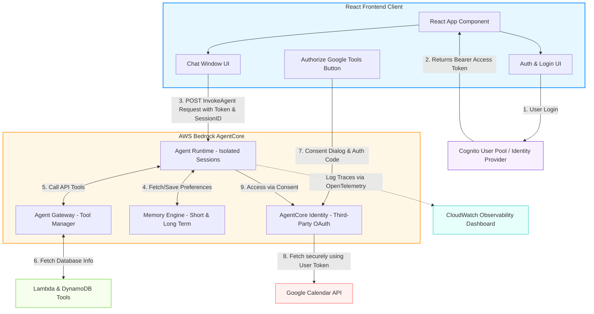

# Amazon Bedrock AgentCore - Production-Ready AI Agents (Hindi Notes 🇮🇳)

यह नोट्स **AWS Show & Tell: Building your first production-ready AI agent with Amazon Bedrock AgentCore** वीडियो के आधार पर बनाए गए हैं। इसे बिल्कुल शुरुआती (Beginner) स्तर के डेवलपर्स के लिए आसान हिंदी-अंग्रेज़ी (Hinglish) में लिखा गया है।

---

## 🚀 AI Agents: Prototype vs Production (प्रोटोटाइप बनाम प्रोडक्शन)

जब हम अपने लैपटॉप पर या स्थानीय स्तर (Locally) पर कोई AI Agent बनाते हैं, तो वह बहुत आसानी से बन जाता है (जैसे Strands, LangGraph या CrewAI का उपयोग करके)। लेकिन जब उसी एजेंट को **Production (वास्तविक दुनिया/लाइव ग्राहकों के लिए)** में तैनात (Deploy) करना होता है, तो कई बड़ी चुनौतियाँ सामने आती हैं:

1. **Security (सुरक्षा):** क्या हमारा एजेंट सुरक्षित है? क्या एक यूजर का डेटा दूसरे यूजर के पास लीक हो सकता है?
2. **Scalability (स्केलेबिलिटी):** अगर एक साथ हज़ारों यूजर्स आ जाएं, तो क्या हमारा एजेंट बिना हैंग हुए काम करेगा?
3. **Large Payloads & Long Running tasks:** भारी डेटा फाइल्स (जैसे 100MB) को प्रोसेस करना और घंटों तक चलने वाले बैकग्राउंड कामों को संभालना।
4. **Tool Integration & Authentication:** एजेंट को डेटाबेस, API या थर्ड-पार्टी ऐप्स (जैसे Google Calendar, Salesforce) से जोड़ना और उनके क्रेडेंशियल्स को सुरक्षित रखना।
5. **Observability (निगरानी):** यह जानना कि बैकग्राउंड में एजेंट क्या निर्णय ले रहा है, कौन सा मॉडल इस्तेमाल कर रहा है और कहाँ एरर आ रही है।

**Amazon Bedrock AgentCore** इन्हीं समस्याओं को हल करने के लिए AWS का एक बेहतरीन प्लेटफॉर्म है।

---

## 🧱 AgentCore के 6 मुख्य स्तम्भ (6 Pillars of AgentCore)

वीडियो में इन 6 मुख्य कम्पोनेंट्स के बारे में विस्तार से समझाया गया है:

| Pillar | कार्य (Function) | सरल शब्दों में समझें |
| :--- | :--- | :--- |
| **1. Runtime** | एजेंट को क्लाउड में सुरक्षित और स्केलेबल तरीके से होस्ट (Host) करता है। | यह आपके एजेंट का सुरक्षित घर (Secure Container) है, जहाँ वह चलता है। यहाँ हर सेशन पूरी तरह अलग (Isolated) होता है। |
| **2. Gateway** | आपकी पुरानी APIs या Lambda फंक्शन्स को **MCP (Model Context Protocol)** के रूप में बदलता है। | यह एक USB प्लग की तरह है। आप किसी भी टूल को इसके ज़रिए प्लग-इन कर सकते हैं और एजेंट उसका इस्तेमाल कर सकेगा। इसमें सर्च टूल भी इन-बिल्ट है। |
| **3. Identity** | Authentication और Authorization (यूजर की पहचान और परमिशन) को संभालता है। | यह गेटकीपर की तरह है, जो तय करता है कि एजेंट किस यूजर के क्रेडेंशियल्स का उपयोग करके किस डेटा (जैसे Google Calendar/Drive) को एक्सेस कर सकता है। |
| **4. Memory** | बातचीत की शॉर्ट-टर्म (वर्तमान चैट) और लॉन्ग-टर्म (पिछली चैट्स के फैक्ट्स और प्रेफरेंस) मेमोरी को स्टोर करता है। | यह एजेंट का दिमाग है, जो यूजर की पसंद-नापसंद को याद रखता है ताकि हर बार यूजर को अपनी जानकारी दोबारा न देनी पड़े। |
| **5. Observability** | एजेंट के काम करने के तरीके, मॉडल यूसेज, टोकन खर्च और एरर्स की लाइव मॉनिटरिंग करता है। | यह एक X-Ray मशीन या डैशबोर्ड है (CloudWatch पर), जिससे आप देख सकते हैं कि एजेंट अंदरूनी तौर पर क्या सोच और कर रहा है। |
| **6. Off-the-shelf Tools** | इन-बिल्ट रेडीमेड टूल्स जैसे **Browser Tool** (पुराने वेबपेज ऑटोमेशन के लिए) और **Code Interpreter** (डेटा एनालिसिस के लिए)। | आपको खुद से कोडिंग करने की ज़रूरत नहीं है, ये टूल्स एजेंट को पहले से बने-बनाए मिल जाते हैं। |

---

## 📊 React & Bedrock AgentCore आर्किटेक्चर डायग्राम (React Component & API Flow)

नीचे दिया गया डायग्राम यह दर्शाता है कि एक **React Frontend Application** किस प्रकार **AWS Bedrock AgentCore** के अलग-अलग कम्पोनेंट्स के साथ सुरक्षित रूप से कम्युनिकेट करती है:



---

## 🛠️ Step-by-Step डेवलपमेंट और कोडिंग वर्कफ़्लो (Beginner Friendly)

डेमो वीडियो में दिखाए गए कोड को समझने के लिए इसे चार चरणों में समझें:

### चरण 1: लोकल एजेंट को AgentCore पर कॉन्फ़िगर और लॉन्च करना

सबसे पहले, डेवलपर अपने कोड में SDK का उपयोग करके एजेंट को कॉन्फ़िगर और क्लाउड पर डिप्लॉय करता है।

**CLI कमांड्स:**
1. **`agentcore configure`:** यह कमांड एजेंट का नाम, एंट्री पॉइंट फ़ाइल (`main.py`), IAM रोल, ECR रिपोजिटरी बनाने की अनुमति, और Cognito authentication डिटेल्स मांगती है।
2. **`agentcore launch`:** यह कमांड आपके प्रोजेक्ट का एक ज़िप बनाकर AWS S3 पर भेजती है, जहाँ CodeBuild एक डॉकर इमेज बनाता है और उसे ECR में पुश करके एजेंट का लाइव क्लाउड एंडपॉइंट तैयार कर देता है।

---

### चरण 2: React/Frontend से एजेंट को कॉल करना (API Request)

जावास्क्रिप्ट/रिएक्ट फ़्रंटएंड से एजेंट को कॉल करने के लिए एक `POST` रिक्वेस्ट भेजी जाती है:

```javascript
// React Frontend Code Snippet (Example)
const invokeAgent = async (userPrompt, sessionId) => {
  const token = await getCognitoAccessToken(); // Cognito से मिला एक्सेस टोकन
  
  const response = await fetch("https://agent-runtime-url.aws/invoke", {
    method: "POST",
    headers: {
      "Authorization": `Bearer ${token}`,
      "Content-Type": "application/json"
    },
    body: JSON.stringify({
      prompt: userPrompt,
      sessionId: sessionId,
      streaming: true // ताकि रिस्पॉन्स वर्ड-बाय-वर्ड स्क्रीन पर दिखे
    })
  });
  
  // रिस्पॉन्स स्ट्रीम को पढ़ना
  const reader = response.body.getReader();
  // ... (स्ट्रीम रेंडरिंग लॉजिक)
};
```

---

### चरण 3: Gateway के माध्यम से बिना कोड बदले नए टूल्स जोड़ना

वीडियो में EK ने दिखाया कि कैसे बिना एजेंट के कोड को दोबारा डिप्लॉय किए, सिर्फ **Gateway Target Config** को अपडेट करके एजेंट को नए टूल्स (जैसे `get_customer_profile`) का एक्सेस मिल गया।

* **Semantic Search for Tools:** अगर आपके पास 300 या 1000 टूल्स हैं, तो एजेंट उन सभी को मॉडल के पास नहीं भेजता (जिससे पैसे और समय की बर्बादी होती है)। Gateway में इन-बिल्ट **Semantic Search** होता है, जो यूजर के सवाल के हिसाब से सिर्फ सबसे ज़रूरी टूल ढूँढकर मॉडल को देता है।

---

### चरण 4: Memory (लॉन्ग-टर्म मेमोरी) का हुक जोड़ना

एजेंट में मेमोरी जोड़ने के लिए हम **Strands Agent Hooks** का इस्तेमाल करते हैं:

```python
# python main.py (Agent Core Memory Hook Example)
from bedrock_agent_core.sdk import BedrockAgentCoreApp, MemoryClient
from strands import Agent, hooks

memory_client = MemoryClient(memory_id="your-memory-id")

# 1. जब एजेंट बातचीत शुरू करे (On Initiate) - पिछली यादें लोड करना
@hooks.on_agent_initiate
def load_memories(context):
    actor_id = context.actor_id # यूजर की आईडी
    # मेमोरी डेटाबेस से यूजर के फैक्ट्स और प्रेफरेंस निकालना
    memories = memory_client.get_memories(actor_id=actor_id)
    return {"user_context": memories}

# 2. जब चैट में कोई नया मैसेज आए (On Message Add) - उसे बैकग्राउंड में स्टोर करना
@hooks.on_message_add
def save_message(message, context):
    actor_id = context.actor_id
    # मैसेज को शॉर्ट-टर्म मेमोरी में सेव करना, जो बैकग्राउंड में लॉन्ग-टर्म फैक्ट्स बना देगा
    memory_client.add_event(actor_id=actor_id, message=message)
```

---

## 💡 Beginner-Friendly Example: Customer Support Assistant (सरल व्यावहारिक उदाहरण)

मान लीजिए हम एक **Customer Support Agent** बना रहे हैं जो यूजर के ऑर्डर्स की जानकारी देता है और उसकी पसंद (Preferences) को याद रखता है।

यहाँ **Runtime**, **Gateway (Lambda Function)** और **Memory** को एक साथ काम करते हुए दिखाया गया है:

### 1. Lambda Tool (Gateway के माध्यम से) - `check_warranty.py`
यह एक सामान्य Python फंक्शन है जो डेटाबेस (DynamoDB) से वारंटी स्टेटस चेक करता है।
```python
def check_warranty_status(order_id: str) -> str:
    # मान लीजिए यह डेटाबेस से डेटा लाता है
    if order_id == "12345":
        return "Expired (254 days ago)"
    return "Active"
```

### 2. Strands Agent + AgentCore App - `main.py`
यह मुख्य एजेंट फाइल है जो क्लाउड में चलेगी:
```python
from bedrock_agent_core.sdk import BedrockAgentCoreApp, MemoryClient
from strands import Agent, hooks

# 1. Memory Client को सेटअप करें
memory_client = MemoryClient(memory_id="my-long-term-memory-db")

# 2. Strands Agent बनाएं और टूल्स दें (जैसे check_warranty_status)
agent = Agent(
    name="CustomerSupportAgent",
    instructions="You are a helpful customer support agent. Help users check warranty and personalize their experience.",
    model="anthropic.claude-3-5-sonnet",
    tools=[check_warranty_status] # Gateway या local tool
)

# 3. AgentCore App इनिशियलाइज करें
app = BedrockAgentCoreApp()

# 4. Memory hooks लगाएं ताकि एजेंट पुरानी बातें न भूले
@hooks.on_agent_initiate
def load_user_facts(context):
    # यूजर का context (जैसे actor_id) एक्सेस करें
    actor_id = context.actor_id
    # पिछली चैट्स के आधार पर मेमोरी निकालें
    user_memories = memory_client.get_memories(actor_id=actor_id)
    return {"user_profile": user_memories}

@hooks.on_message_add
def save_chat_to_memory(message, context):
    # बातचीत के हर मैसेज को मेमोरी में सेव करें
    memory_client.add_event(actor_id=context.actor_id, message=message)

# 5. Runtime Invoke Endpoint बनाएं
@app.invoke
def on_invoke(payload, context):
    # यूजर का सवाल
    user_question = payload.get("question")
    # एजेंट से जवाब प्राप्त करें और फ्रंटएंड को भेजें (Stream)
    return agent.stream(user_question, context=context)
```

### 💬 बातचीत का प्रवाह (Conversation Flow Example)

* **पहला सेशन (Session 1):**
  * **User:** "Hi, check my warranty status for order ID 12345."
  * **Agent:** (Calling `check_warranty_status` tool) -> "I checked. Your warranty is Expired (254 days ago)."
  * **User:** "Okay. By the way, my favorite device is Gaming Console Pro."
  * **Agent:** "Noted! I'll remember that." (Hook `@hooks.on_message_add` calls memory client in backend).

* **दूसरा सेशन - 2 दिन बाद (Session 2):**
  * **User:** "Hi there."
  * **Agent:** (Hook `@hooks.on_agent_initiate` retrieves memories) -> "Hello! Welcome back. How can I help you with your Gaming Console Pro today?" (Hyper-personalized experience!)

---

## 🔍 Observability (CloudWatch डैशबोर्ड)

वीडियो के अंत में दिखाया गया कि **AWS CloudWatch** पर AgentCore का एक लाइव डैशबोर्ड आता है।
डेवलपर वहाँ निम्नलिखित चीज़ें देख सकते हैं:
* **Sessions:** कितने लोग एजेंट का इस्तेमाल कर रहे हैं।
* **Traces:** एजेंट ने कब टूल कॉल किया, कब LLM मॉडल से बात की, और उसका निर्णय लेने का लूप (Execution Loop) क्या था।
* **Token Usage:** कुल कितने इनपुट/ऑउटपुट टोकन्स का इस्तेमाल हुआ (बिलिंग/लागत समझने के लिए)।
* **Latency:** एजेंट को यूजर का जवाब देने में कितना समय लग रहा है।

