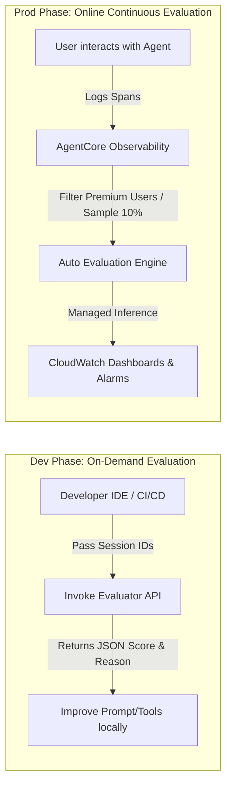

# AWS Bedrock AgentCore Deep Dive: AgentCore Evaluations (Hindi Notes 🇮🇳)

यह नोट्स **AWS Show & Tell: Bedrock AgentCore Deep dive series: AgentCore Evaluations** वीडियो पर आधारित हैं। इसे सरल, स्पष्ट और व्यावहारिक Hinglish में तैयार किया गया है ताकि शुरुआती डेवलपर्स यह समझ सकें कि AI Agents के प्रदर्शन को कैसे मापा और सुधारा जाता है।

---

## 🎭 1. AgentCore Evaluations क्या है? (What is AgentCore Evaluations?)

जब हम AI Agents को प्रोडक्शन में लॉन्च करते हैं, तो वे **Non-Deterministic** (अनिश्चित) व्यवहार करते हैं। इसका मतलब है कि वे कभी-कभी गलतियाँ कर सकते हैं, जैसे:
* **Hallucinations (भ्रम):** अपनी तरफ से मनगढ़ंत बातें बोलना।
* **Wrong Tool Selection:** फ्लाइट बुक करने की जगह होटल बुक करने का टूल चला देना।
* **Politeness & Brand Value:** ग्राहक से गलत तरीके से बात करना।

जिस प्रकार किसी कंपनी में कर्मचारियों का **Job Performance Review** होता है, ठीक उसी प्रकार AI Agents के प्रदर्शन की समीक्षा करने के लिए **AgentCore Evaluations** का उपयोग किया जाता है। 

> [!TIP]
> **Observability vs Evaluation:**
> * Observability हमें यह बताती है कि प्रोडक्शन में एजेंट के साथ **क्या हुआ** (Traces & Logs)।
> * Evaluation हमें यह बताती है कि एजेंट का प्रदर्शन **कैसा रहा** और हम उसे **कैसे सुधार सकते हैं** (Scores & Explanations)।

---

## 📐 2. मूल्यांकन के तीन स्तर (Three Levels of Metrics)

मूल्यांकन प्रक्रिया को तीन अलग-अलग स्तरों (dimensions) में बांटा गया है:

| स्तर (Level) | इसका क्या मतलब है? (What it measures) | उदाहरण (Example Metrics) |
| :--- | :--- | :--- |
| **1. Session Level** | पूरी बातचीत (Conversation) का अंत-से-अंत तक का मूल्यांकन। | **Goal Success Rate:** क्या एजेंट ग्राहक का मूल काम (उदा. टिकट बुक करना) पूरा कर पाया? |
| **2. Trace Level** | व्यक्तिगत प्रतिक्रियाओं (Individual Responses) की गुणवत्ता। | **Faithfulness (सच्चाई):** क्या जवाब दिए गए डेटा पर आधारित था?<br>**Response Relevance:** क्या जवाब सवाल से मेल खाता था? |
| **3. Span Level** | एजेंट द्वारा टूल्स (Tools) के उपयोग की सटीकता। | **Tool Selection Accuracy:** क्या सही टूल चुना गया?<br>**Parameter Accuracy:** क्या सही इनपुट पास किए गए? |

---

## 🔄 3. Evaluation Approaches: On-Demand बनाम Online

वीडियो में ईशान ने दो प्रमुख दृष्टिकोण (approaches) स्पष्ट किए हैं:



### A. On-Demand Evaluation (डेवलपर के लिए - Offline)
* **उपयोग:** यह डेवलपर्स द्वारा स्थानीय कोडिंग एनवायरनमेंट (IDE) या **CI/CD Pipeline** में कोड को प्रोडक्शन में भेजने से पहले टेस्ट करने के लिए किया जाता है।
* **आउटपुट:** इसका कोई डैशबोर्ड नहीं होता; यह सीधे कोड टर्मिनल में स्कोर और उसका कारण (reasoning) देता है।

### B. Online Evaluation (लगातार मॉनिटरिंग - Live Prod)
* **उपयोग:** लाइव प्रोडक्शन ट्रैफ़िक के ऊपर लगातार मूल्यांकन करना।
* **कंट्रोल फ़ीचर्स:**
  * **Sampling Rate:** लागत (cost) को नियंत्रित करने के लिए केवल 10% चैट का मूल्यांकन करना।
  * **Filtering:** केवल विशिष्ट श्रेणियों (जैसे Premium Users) की बातचीत का मूल्यांकन करना।
* **आउटपुट:** CloudWatch डैशबोर्ड पर बने-बनाए ग्राफ और अलार्म।

---

## 💻 4. व्यावहारिक कोड उदाहरण (Practical Examples)

### उदाहरण A: On-Demand Evaluation API का उपयोग (Python)
यह उदाहरण दिखाता है कि कैसे आप किसी पुराने चैट सेशन की `Session ID` पास करके एजेंट की **Faithfulness** और **Goal Success** को प्रोग्रामेटिक रूप से जांच सकते हैं:

```python
import boto3

# AgentCore Evaluation क्लाइंट शुरू करें
eval_client = boto3.client("bedrock-agentcore-eval")

def evaluate_session_performance(session_id: str):
    # On-demand API कॉल करें
    response = eval_client.evaluate_session(
        SessionId=session_id,
        EvaluatorConfig={
            "Evaluators": [
                {
                    "Type": "GoalSuccess", # गोल सक्सेस मूल्यांकन
                    "Parameters": {}
                },
                {
                    "Type": "Faithfulness", # डेटा के प्रति वफादारी
                    "Parameters": {}
                }
            ]
        }
    )
    
    # परिणाम प्रिंट करें
    for result in response["EvaluationResults"]:
        print(f"Evaluator: {result['Type']}")
        print(f"Score: {result['Score']} (Scale 0-1)")
        print(f"Reasoning: {result['Reasoning']}")
        print("---")

# उदाहरण उपयोग:
# evaluate_session_performance("session_travel_9981")
```

---

### उदाहरण B: Custom Evaluator बनाना (अपनी पसंद के Rubric के साथ)
यदि आपको AWS के 13 डिफॉल्ट इवैल्यूएटर्स के अलावा किसी खास चीज़ (जैसे: "क्या एजेंट ने विनम्रता की सीमा पार की?") को मापना है, तो आप खुद का कस्टम प्रॉम्ट और रूब्रिक बना सकते हैं:

```python
def create_custom_politeness_evaluator():
    response = eval_client.create_evaluator(
        Name="PolitenessEvaluator",
        ModelId="amazon.nova-pro-v1:0", # इवैल्यूएशन के लिए नोवा मॉडल का उपयोग
        Description="Evaluates whether the agent maintained polite corporate language.",
        PromptTemplate="""
        You are an expert judge. Review the agent's interaction.
        Evaluate the agent on a scale of 0 to 5 for corporate politeness and brand safety.
        
        Rubric:
        5 - Extremely polite, followed all corporate guidelines.
        3 - Neutral, but missed greeting the customer.
        1 - Rude or used inappropriate words.
        
        Agent Response: {response}
        User Query: {query}
        """,
        ScoreRange={"Min": 0, "Max": 5}
    )
    return response["EvaluatorArn"]
```

---

## 💡 5. Prompt Improvement Loop: व्यावहारिक केस स्टडी

वीडियो के लाइव डेमो में ईशान ने दिखाया कि कैसे मूल्यांकन से प्राप्त खराब स्कोर्स (Score < 7) का उपयोग करके उन्होंने एजेंट को बेहतर बनाया:

1. **खराब स्कोर्स की पहचान:** एजेंट ने Maldives यात्रा के लिए आवश्यक पासपोर्ट वैधता के सवाल पर गलत जानकारी दी और टूल के पैरामीटर्स मनगढ़ंत (fabricated) पास किए। गोल सक्सेस का स्कोर **`0.0`** आया।
2. **रीजनिंग एनालिसिस:** इवैल्यूएटर ने लिखा: *"The agent fabricated the duration parameter and did not ask the user for clarification before searching."*
3. **सिस्टम प्रॉम्ट अपडेट:** डेवलपर ने सिस्टम प्रॉम्ट में यह नई लाइन जोड़ी:
   > *"If the search parameters are missing, do not assume or fabricate values. Always ask the user for confirmation first."*
4. **सफलता:** दोबारा इवैल्यूएशन रन करने पर गोल सक्सेस स्कोर **`0.0` से बढ़कर `1.0`** हो गया।

---

## ❓ अक्सर पूछे जाने वाले सवाल (Frequently Asked Questions)

### Q1. 13 Built-in Evaluators का क्या विशेष लाभ है?
**उत्तर:** इनका सबसे बड़ा लाभ **Managed Inference** है। इसका मतलब है कि जब आप इन 13 बिल्ट-इन इवैल्यूएटर्स को चलाते हैं, तो इसके लिए आवश्यक LLM टोकन खर्च आपके AWS एकाउंट के कोटे (Quota) से नहीं काटे जाते। यह सीधे AWS द्वारा प्रबंधित किया जाता है, जिससे आपके लाइव एजेंट को रेट-लिमिट (rate-limit) या थ्रॉटलिंग का सामना नहीं करना पड़ता। (नोट: कस्टम इवैल्यूएटर्स आपके कोटे का उपयोग करते हैं)।

### Q2. Data Drift क्या है और इसे कैसे ट्रैक करें?
**उत्तर:** जब एजेंट लाइव होता है, तो समय के साथ यूज़र्स के पूछने का तरीका और डेटा बदल जाता है, जिससे एजेंट का प्रदर्शन गिर सकता है। इसे **Data Drift** कहते हैं। इसे ट्रैक करने के लिए आप अपने बेसलाइन (Baseline) स्कोर को ऑनलाइन इवैल्यूएशन के औसत स्कोर से तुलना करते हैं। यदि स्कोर में 2% से अधिक की गिरावट आती है, तो आप अलार्म सेट कर सकते हैं।

### Q3. क्या LLM-as-a-judge खुद भी भ्रमित (hallucinate) हो सकता है?
**उत्तर:** हाँ, क्योंकि अंततः जज भी एक LLM ही है। इसलिए बेस्ट प्रैक्टिस यह है कि:
1. अपने कस्टम इवैल्यूएटर्स के लिए **बहुत सख्त और स्पष्ट Rubrics** (ग्रेडिंग नियम) लिखें।
2. कुछ प्रतिशत रैंडम इवैल्यूएशन स्कोर्स की समीक्षा **Subject Matter Experts (SMEs/Humans)** द्वारा कराएं, ताकि जज की सत्यता (calibration) जांची जा सके।

### Q4. क्या इवैल्यूएशन करने के लिए एजेंट का AWS Bedrock Runtime पर चलना ज़रूरी है?
**उत्तर:** नहीं। आपका एजेंट किसी भी सर्वर (जैसे Amazon EKS, Lambda, या अन्य क्लाउड प्रदाता) पर चल सकता है। जब तक आपके एजेंट के ओपन-टेलीमेट्री (OTEL) लॉग्स AWS CloudWatch में भेजे जा रहे हैं, तब तक AgentCore Evaluations आसानी से उन लॉग्स को पढ़कर स्कोर्स जनरेट कर सकता है।
