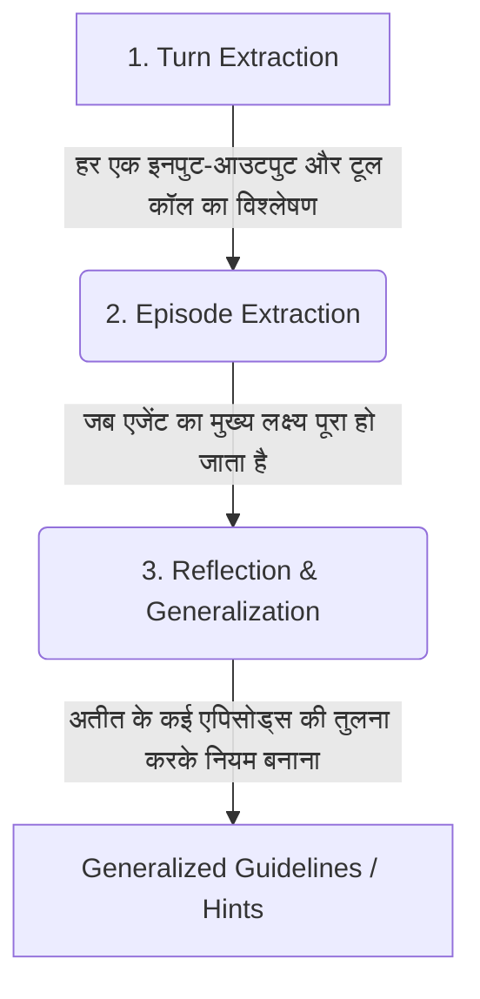

# AWS Bedrock AgentCore Deep Dive: Episodic Memory & Production Patterns (Hindi Notes 🇮🇳)

यह नोट्स **AWS Show & Tell: AgentCore Memory: Episodic Memory & Patterns for Production Agents** वीडियो पर आधारित हैं। इसे सरल, स्पष्ट और व्यावहारिक Hinglish में तैयार किया गया है ताकि डेवलपर्स यह समझ सकें कि AI Agents को स्व-शिक्षण (self-learning) और अनुकूलन (personalization) की शक्ति कैसे दी जाए।

---

## 🧠 1. Episodic Memory की आवश्यकता क्यों है? (The Production Challenge)

जब हम AI Agents को केवल **System Prompts** और **Tools** के साथ प्रोडक्शन में लॉन्च करते हैं, तो वे केवल "किताबी ज्ञान" (Bookish Knowledge) का उपयोग करते हैं। 

### 🚸 Parenting Analogy (बच्चों की परवरिश का उदाहरण):
> जैसे माता-पिता अपने बच्चे को घर पर कितना भी सिखा लें, लेकिन जब बच्चा स्कूल (असली दुनिया) में जाता है, तो वह रोज़ नए अनुभवों (Experiences) से सीखता है। ठीक वैसे ही, एक AI Agent भी टेस्टिंग के दौरान सब कुछ नहीं सीख सकता। प्रोडक्शन में यूज़र्स के अलग-अलग व्यवहार और समस्याओं से निपटने के लिए एजेंट को **Episodic Memory (घटनाजन्य स्मृति)** की आवश्यकता होती है।

**Episodic Memory का लक्ष्य:** एजेंट अपने अतीत (past experiences) से सीखकर अपने भविष्य (future self) को निर्देश दे सके, ताकि वह अगली बार कम गलतियाँ करे और टूल का कुशलता से उपयोग करे।

---

## 🏛️ 2. अच्छी ग्राहक संतुष्टि (UX) के 3 स्तंभ

| स्तंभ (Pillar) | विवरण (Description) | उदाहरण (Example) |
| :--- | :--- | :--- |
| **1. Personalization** | यूज़र की पसंद, शैली (communication style), भूमिका (role) और पसंद-नापसंद को याद रखना। | **Alice** (इंजीनियर) को तकनीकी रिपोर्ट्स पसंद हैं, जबकि **Carol** (डायरेक्टर) को केवल 2 लाइनों की समरी चाहिए। |
| **2. Context Awareness** | पिछली बातचीत का संदर्भ याद रखना ताकि यूज़र को अपनी बात दोहरानी न पड़े। | "मुझे याद है पिछली बार आपको डेटाबेस का एरर आया था, क्या वह हल हुआ?" |
| **3. Self-Learning** | पिछली सफलताओं और विफलताओं से सीखकर नए सामान्य नियम (reflections) बनाना। | "पिछली 5 बार जब कनेक्शन लीक हुआ, तो मैंने पहले सर्विस रीस्टार्ट की। अगली बार डायरेक्ट यही करूँ।" |

---

## 🔄 3. AgentCore Memory: Extraction Pipeline कैसे काम करता है?

लॉन्ग-टर्म मेमोरी तुरंत अपडेट नहीं होती, बल्कि यह पृष्ठभूमि (background) में **Asynchronously (अतुल्यकालिक रूप से)** चलती है ताकि लेटेंसी (latency) न बढ़े।

```
[यूज़र बातचीत] 
       │
       ▼ (Raw Storage)
[Short-Term Memory] ──(K messages या S seconds निष्क्रियता के बाद ट्रिगर)──► [Extraction Pipeline]
                                                                                │
                                                                                ▼
                                                                        [Consolidation]
                                                                     (Vector DB से मिलान)
                                                                       /        |       \
                                                                      /         |        \
                                                                 (New)      (Change)   (Redundant)
                                                                  ▼             ▼          ▼
                                                                [Add]       [Update]     [Skip]
```

### Consolidation के 3 तरीके (Decision Box):
1. **Add (जोड़ना):** यदि जानकारी बिल्कुल नई है (जैसे: "Carol को फ्रेंच फूड पसंद है")।
2. **Update (अपडेट करना):** यदि पुरानी जानकारी बदल गई है या अधूरी थी (जैसे: "Carol को अब इटालियन फूड पसंद है")।
3. **Skip (छोड़ना):** यदि जानकारी पहले से मौजूद है और कोई बदलाव नहीं हुआ है (ताकि डुप्लीकेट डेटा और वेक्टर स्टोरेज की कॉस्ट बचे)।

---

## 🧬 4. Turn, Episode, और Reflection में अंतर

एजेंट के सीखने की प्रक्रिया 3 स्तरों पर होती है:



* **Turn Extraction (टर्न स्तर):** प्रत्येक बातचीत के मोड़ पर एजेंट ने क्या टूल चलाया, क्या सोचा, यूज़र ने क्या फीडबैक दिया (उदा. 👍 या 👎)।
* **Episode Extraction (एपिसोड स्तर):** पूरी बातचीत का अंत होने पर एक व्यापक समरी तैयार करना (उदा. "डेटाबेस कनेक्शन लीक को कैसे डायग्नोज़ किया गया")।
* **Reflection (प्रतिबिंब):** विभिन्न एपिसोड्स की तुलना करके एजेंट अपने लिए **Hint (दिशा-निर्देश)** बनाता है (उदा. "ACM सर्टिफिकेट रिन्यू करते समय हमेशा पहले DNS वैलीडेशन चेक करें")।

> [!NOTE]
> **क्या एपिसोड्स से ज़्यादा रिफ्लेक्शन्स हो सकते हैं?**
> हाँ! एक ही लंबी बातचीत (Episode) में कई अलग-अलग टॉपिक्स (जैसे DNS कॉन्फ़िगरेशन, लोड बैलेंसर सेटिंग्स, पोस्ट-इंसिडेंट डॉक्युमेंटेशन) पर चर्चा हो सकती है, जिससे 1 एपिसोड से 3-4 अलग-अलग रिफ्लेक्शन्स (Learned Guidelines) पैदा हो सकते हैं।

---

## 💻 5. व्यावहारिक उदाहरण: IT Incident Response Agent (Python & Kinesis)

वीडियो के लाइव डेमो में दिखाया गया कि कैसे एक IT Incident Agent बिना मेमोरी के **5 टूल्स** का उपयोग करके समस्या हल करता था, लेकिन Episodic Memory + Reflections के बाद उसने पिछले अनुभव से सीखकर केवल **3 टूल्स** में समस्या का बेहतर हल ढूंढ लिया।

### उदाहरण A: Python में Memory Hooks के साथ Agent State स्टोर करना
जब हम Strands Agent बनाते हैं, तो हम बातचीत को शॉर्ट-टर्म मेमोरी में सेव करने के लिए हुक्स (Hooks) का उपयोग करते हैं:

```python
import boto3
from bedrock_agent_core import MemoryClient

# Bedrock AgentCore Memory Client शुरू करें
memory_client = MemoryClient()

async def on_agent_turn_complete(session_id, actor_id, user_query, agent_response, tools_called, user_feedback):
    # बातचीत के टर्न को शॉर्ट-टर्म मेमोरी में भेजना
    await memory_client.put_raw_event(
        memory_store_id="it-incident-memory-store",
        session_id=session_id,
        actor_id=actor_id,
        event_data={
            "user_query": user_query,
            "agent_response": agent_response,
            "tools_called": tools_called,
            "feedback": user_feedback, # Thumbs up/down
            "status": "COMPLETED"
        }
    )
    print(f"Turn event stored for Session: {session_id}")
```

---

### उदाहरण B: Kinesis Data Stream से Real-time Events पढ़ना
AgentCore Memory लॉन्ग-टर्म मेमोरी के अपडेट्स को सीधे **Amazon Kinesis Data Stream** में भेज सकता है। इससे हम बिना बार-बार पोलिंग (Polling) किए रियल-टाइम एक्शन ले सकते हैं (जैसे एडमिन डैशबोर्ड बनाना)।

यहाँ Kinesis से मेमोरी रिफ्लेक्शन इवेंट्स को प्रोसेस करने वाली AWS Lambda फ़ंक्शन का उदाहरण है:

```python
import json
import base64

def lambda_handler(event, context):
    for record in event['Records']:
        # Kinesis डेटा को डिकोड करें
        payload = base64.b64decode(record['kinesis']['data']).decode('utf-8')
        event_data = json.loads(payload)
        
        # केवल रिफ्लेक्शन (learned insights) इवेंट्स को प्रोसेस करें
        if event_data.get("eventType") == "MEMORY_RECORD_CREATED" and event_data.get("recordType") == "REFLECTION":
            reflection_details = event_data["details"]
            topic = reflection_details.get("topic")
            guideline = reflection_details.get("guideline")
            severity = reflection_details.get("metadata", {}).get("severity", "P2")
            
            print(f"🚨 New Learned Insight! Severity: {severity}")
            print(f"Topic: {topic}")
            print(f"Guideline for future agents: {guideline}")
            
            # यहाँ आप इसे अपने DevOps Dashboard DB में सेव कर सकते हैं या Slack पर अलर्ट भेज सकते हैं।
            
    return {
        'statusCode': 200,
        'body': json.dumps('Successfully processed memory stream events.')
    }
```

---

## 🔒 6. Production Security & Scoping (मेमोरी सुरक्षा)

मल्टी-टेनेंट (multi-tenant) या एंटरप्राइज़ वातावरण में यह सुनिश्चित करना आवश्यक है कि एक यूज़र की मेमोरी दूसरे यूज़र को न दिखे।

1. **Short-Term Scoping:** मेमोरी को `Memory ID` + `Actor ID` (यूज़र आईडी) + `Session ID` के कॉम्बिनेशन से ही एक्सेस किया जा सकता है।
2. **Resource-Based Policies:** आप IAM पॉलिसी के ज़रिए यह तय कर सकते हैं कि कौन सा एजेंट किस मेमोरी नेमस्पेस (Namespace) को पढ़ या लिख सकता है।

### AWS Resource Policy Example (JSON):
```json
{
    "Version": "2012-10-17",
    "Statement": [
        {
            "Sid": "AllowSpecificAgentToAccessMemory",
            "Effect": "Allow",
            "Principal": {
                "AWS": "arn:aws:iam::123456789012:role/DevOpsIncidentAgentRole"
            },
            "Action": [
                "agentcore-memory:GetMemoryRecord",
                "agentcore-memory:PutRawEvent"
            ],
            "Resource": "arn:aws:agentcore-memory:us-west-2:123456789012:store/it-incident-memory-store"
        }
    ]
}
```

---

## ❓ अक्सर पूछे जाने वाले सवाल (Frequently Asked Questions)

### Q1. Summary Memory और Episodic Memory में क्या अंतर है?
* **Summary Memory:** यह केवल बातचीत का एक संक्षिप्त सारांश (textual summary) है ताकि एजेंट को पिछली बातें याद रहें।
* **Episodic Memory:** यह एजेंट के काम करने के तरीके (execution pattern, tool performance, success/fail state) का लेखा-जोखा रखती है ताकि वह अपनी कार्यकुशलता (efficiency) बढ़ा सके।

### Q2. Kinesis Stream में डेटा भेजने से क्या फायदा है?
इससे आप **Human-in-the-loop (HITL)** सिस्टम बना सकते हैं। जैसे ही एजेंट कोई नया रिफ्लेक्शन (नियम) सीखता है, वह Kinesis के ज़रिए एडमिन डैशबोर्ड पर जाता है, जहाँ एक सीनियर इंजीनियर उसे अप्रूव या एडिट कर सकता है।

### Q3. क्या हम खुद के प्रॉम्ट्स से मेमोरी एक्सट्रैक्शन को कस्टमाइज़ कर सकते हैं?
हाँ। AgentCore Memory के डिफ़ॉल्ट प्रॉम्ट्स और मॉडल्स पब्लिक हैं। यदि आप चाहें तो अपनी इंडस्ट्री (जैसे फाइनेंस या हेल्थकेयर) के नियमों के अनुसार प्रॉम्ट्स को ओवरराइड (Override) कर सकते हैं।
