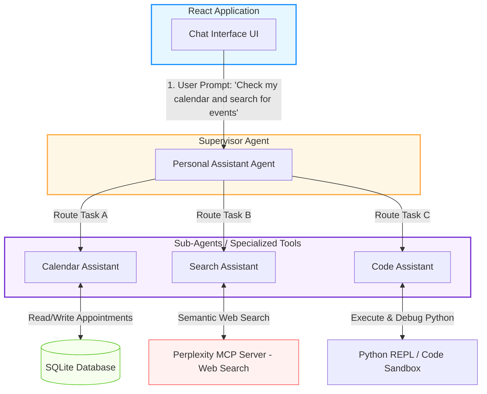

# Strands Agents & MCP: Build Your First Agentic App (Hindi Notes 🇮🇳)

यह नोट्स **AWS Show & Tell: Build your first Agentic AI app step-by-step with Strands Agents & MCP** वीडियो के आधार पर बनाए गए हैं। इसे शुरुआती डेवलपर्स (Beginners) के लिए सरल और रोचक Hinglish में तैयार किया गया है।

---

## 🧬 Strands Agents क्या है? (What is Strands?)

**Strands Agents** अमेज़न (AWS) द्वारा जारी किया गया एक नया **Open-Source Python SDK** है। इसका मुख्य उद्देश्य डेवलपर्स को कस्टम, पावरफुल और उत्पादन-तैयार (Production-Ready) AI Agents बनाने की सुविधा देना है।

* **नाम "Strands" क्यों पड़ा?** जैसे DNA में दो आपस में जुड़े धागे (Strands) होते हैं, वैसे ही एक AI Agent भी दो मुख्य स्तंभों से मिलकर बनता है: **Model** (दिमाग) और **Tools** (हाथ-पैर)।
* **इतिहास (History):** यह पहले Amazon की अंदरूनी टीमों (जैसे Amazon Q Developer, Glue, और VPC Analyzer) द्वारा उपयोग किया जाता था। पहले एजेंट को प्रोडक्शन में लाने में महीनों लगते थे, लेकिन Strands की मदद से इसे कुछ हफ़्तों या दिनों में पूरा किया जाने लगा। इसकी सफलता को देखते हुए AWS ने इसे ओपन-सोर्स कर दिया।

---

## 🆚 Bedrock Agents vs Strands Agents (मुख्य अंतर)

शुरुआती डेवलपर्स अक्सर दोनों में भ्रमित हो जाते हैं। यहाँ इनका तुलनात्मक विवरण दिया गया है:

| फ़ीचर (Feature) | Bedrock Agents | Strands Agents |
| :--- | :--- | :--- |
| **प्रकार (Type)** | Fully Managed AWS Cloud Service | Open-Source Python SDK / Framework |
| **कहाँ चलता है (Hosting)** | पूरी तरह AWS क्लाउड पर होस्टेड | लोकल पीसी (Local Host) या किसी भी क्लाउड (AWS Lambda, ECS, EC2, या Non-AWS) पर |
| **लचीलापन (Flexibility)** | AWS द्वारा निर्धारित (Opinionated) तरीके से चलता है | अत्यधिक लचीला (Customizable), अपनी पसंद का ऑर्केस्ट्रेशन लिख सकते हैं |
| **LLM मॉडल्स** | केवल Amazon Bedrock पर मिलने वाले मॉडल्स | Bedrock मॉडल्स के साथ-साथ Ollama (लोकल मॉडल), OpenAI, Gemini, Llama आदि |
| **बेस्ट यूज़ केस** | बिना सर्वर या कोडिंग झंझट के तुरंत AWS क्लाउड पर एजेंट बनाने के लिए | गहरे कस्टमाइज़ेशन, हाइब्रिड आर्किटेक्चर और लोकल टेस्टिंग के लिए |

---

### 💡 उदाहरण के साथ समझें (Understanding with Examples)

मान लीजिए हमें एक **"Travel Assistant Agent"** बनाना है, जो यूजर के लिए फ्लाइट बुक करे और मौसम (Weather) चेक करे।

#### 🏢 Case 1: Bedrock Agents के साथ (AWS Managed)
* **कैसे काम करता है?** 
  आप AWS Console (वेबसाइट) पर जाते हैं। आप एजेंट का नाम 'TravelAgent' रखते हैं, उसे Claude 3.5 Sonnet मॉडल से जोड़ते हैं, और अपनी Weather API का एक OpenAPI Schema (JSON/YAML फ़ाइल) अपलोड कर देते हैं। 
* **कोडिंग:** आपको एजेंट के सोचने का लूप (ReAct Loop) या टूल हैंडलिंग का कोड नहीं लिखना पड़ता। AWS बैकएंड में सब कुछ खुद मैनेज करता है।
* **फायदा:** 10 मिनट में आपका एजेंट लाइव क्लाउड पर चलने लगता है।
* **नुकसान:** आप यह नहीं बदल सकते कि एजेंट अंदरूनी तौर पर कैसे सोच रहा है। आप इसे इंटरनेट के बिना अपने लोकल कंप्यूटर पर टेस्ट नहीं कर सकते।

#### 💻 Case 2: Strands Agents के साथ (Open-Source SDK)
* **कैसे काम करता है?** 
  आप अपने लैपटॉप पर एक `main.py` फ़ाइल बनाते हैं और Strands SDK को इम्पोर्ट करते हैं। 
* **कोडिंग:** आप खुद तय करते हैं कि कौन से टूल्स पास करने हैं। आप चाहें तो फ्री लोकल मॉडल **Ollama (Llama 3)** का उपयोग कर सकते हैं ताकि ₹0 मॉडल कॉस्ट लगे।
* **नियंत्रण (Control):** आप अपने Python कोड में कस्टमाइज़ कर सकते हैं कि अगर मॉडल ने Weather API को गलत इनपुट दिया, तो उसे वही रोककर कैसे सुधारा जाए:
  ```python
  # Strands custom code example
  @tool
  def get_weather(city: str):
      # कोड चलने से पहले इनपुट वैलिडेट कर सकते हैं
      if not city.isalpha():
          return "Error: Invalid City Name!"
      return call_weather_api(city)
  ```
* **फायदा:** इसे आप बिना इंटरनेट के भी लोकल कंप्यूटर पर चलाकर पूरा टेस्ट और डिबग कर सकते हैं। जब टेस्ट हो जाए, तो इसे डॉकर इमेज बनाकर AWS Lambda या Azure या अपने किसी सर्वर पर डिप्लॉय कर सकते हैं।

---


## 📊 पर्सनल असिस्टेंट (Multi-Agent Supervisor Pattern) आर्किटेक्चर

डेमो वीडियो में एक **Personal Assistant** ऐप बनाया गया है। इसमें **Supervisor Pattern (एजेंट-एज़-अ-टूल)** का उपयोग किया गया है।

नीचे दिया गया डायग्राम दर्शाता है कि रिएक्ट फ्रंटएंड कैसे मुख्य सुपरवाइजर से बात करता है और सुपरवाइजर अलग-अलग कामों के लिए सब-एजेंट्स (Sub-Agents) को काम सौंपता है:



---

## 🛠️ तीन सब-एजेंट्स और उनके टूल्स (Sub-Agents Breakdown)

### 1. Calendar Assistant (कैलेंडर असिस्टेंट)
यह यूजर के अपॉइंटमेंट्स को मैनेज करता है।
* **टूल्स:** SQLite डेटाबेस से जुड़ा हुआ है। इसके पास `list_appointments`, `create_appointment`, और `delete_appointment` जैसे टूल्स हैं।
* **विशेषता:** इसके पास `current_time` नाम का इन-बिल्ट टूल है जिससे इसे पता रहता है कि आज कौन सा दिन और समय है।

---

### 2. Search Assistant (सर्च असिस्टेंट - MCP)
यह इंटरनेट से ताज़ा जानकारी ढूंढता है।
* **MCP (Model Context Protocol) क्या है?** यह टूल इंटीग्रेशन का एक नया स्टैंडर्ड है। इसकी मदद से आप किसी भी MCP सर्वर (जैसे Perplexity, Tavily) को प्लग-इन कर सकते हैं। 
* **फायदा:** अगर बैकग्राउंड में Perplexity MCP सर्वर का कोड बदलता भी है, तो आपको अपने एजेंट का कोड बदलने की ज़रूरत नहीं पड़ती। एजेंट सीधे `list_tools` चलाकर नए टूल्स का पता लगा लेता है।

---

### 3. Code Assistant (कोड असिस्टेंट)
यह कोड लिखने, उसे चलाने और एरर्स को फिक्स करने का काम करता है।
* **टूल्स:** इसमें किसी भी कस्टम टूल को कोडिंग करने की आवश्यकता नहीं पड़ी क्योंकि यह Strands के पहले से बने-बनाए (Built-in) टूल्स का उपयोग करता है:
  * **Python REPL Tool:** पायथन कोड रन करने के लिए।
  * **Editor Tool:** फाइल्स को रीड/राइट/एडिट करने के लिए।
  * **Shell Tool:** टर्मिनल कमांड्स (जैसे linter, pytest) चलाने के लिए।
  * **Journal Tool:** एजेंट का एक "To-Do List" जिसमें वह अपने काम का रिकॉर्ड रखता है कि कल उसने कहाँ काम छोड़ा था ताकि आज वहीं से शुरू कर सके।

---

## 💻 कोडिंग उदाहरण (Beginner Code Examples)

### A. Python फंक्शन को टूल में बदलना (`@tool` Decorator)
Strands में किसी भी सामान्य Python फंक्शन को AI टूल बनाना बहुत आसान है:

```python
from strands.tools import tool

# @tool डेकोरेटर लगाने से यह AI के लिए टूल बन जाता है
@tool
def create_appointment(title: str, date: str, time: str) -> str:
    """
    Schedules a new meeting/appointment.
    Args:
        title: The subject of the meeting.
        date: Date in YYYY-MM-DD format.
        time: Time in HH:MM format.
    """
    # यहाँ SQL या API कॉलिंग का कोड आएगा
    return f"Success: Scheduled '{title}' on {date} at {time}."
```
> 💡 **Tip:** फंक्शन के नीचे लिखा गया डॉकस्ट्रिंग (docstring) ही AI मॉडल के लिए टूल का विवरण (Description) बनता है। मॉडल इसी को पढ़कर समझता है कि यह टूल कब इस्तेमाल करना है।

---

### B. सुपरवाइजर एजेंट बनाना (Agents as Tools)
जब एक मुख्य एजेंट दूसरे एजेंट्स को कॉल करता है:

```python
from strands import Agent
from strands.models import BedrockModel
# सब-एजेंट्स के फंक्शन्स को इम्पोर्ट करें
from calendar_agent import calendar_assistant_tool
from search_agent import search_assistant_tool

# सुपरवाइजर एजेंट बनाएं
supervisor_agent = Agent(
    name="PersonalAssistant",
    instructions="You are a personal assistant. Delegate calendar tasks to the calendar assistant and web searches to the search assistant.",
    model=BedrockModel(model_id="anthropic.claude-3-5-sonnet"),
    # सब-एजेंट्स को सामान्य टूल्स की तरह पास करें
    tools=[calendar_assistant_tool, search_assistant_tool] 
)

# एजेंट को रन करें
response = supervisor_agent.run("What meetings do I have today and what is the weather in Denver?")
print(response)
```

---

## 🙋‍♂️ अक्सर पूछे जाने वाले सवाल (FAQ)

1. **क्या Strands Agents NodeJS/JavaScript के लिए उपलब्ध है?**
   * वर्तमान में यह केवल **Python** के लिए उपलब्ध है। GitHub पर NodeJS के लिए रिक्वेस्ट ओपन है, जिस पर काम चल रहा है।
2. **क्या Strands का उपयोग करके AWS सर्विसेज से बात की जा सकती है?**
   * हाँ, इसमें `retrieve` टूल है जो Bedrock Knowledge Base से बात करता है। साथ ही `use_aws` टूल भी है जो Boto3 क्लाइंट के ज़रिए किसी भी AWS सर्विस (जैसे S3, DynamoDB) से जुड़ सकता है।
3. **क्या यह लोकल मॉडल्स (Local Models) को सपोर्ट करता है?**
   * हाँ! आप **Ollama** या **LiteLLM** का उपयोग करके पूरी तरह से लोकल मॉडल्स को भी Strands के साथ रन कर सकते हैं।
