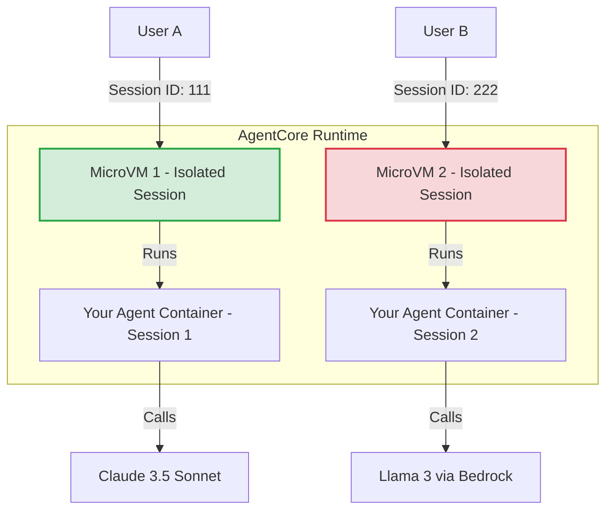

# Amazon Bedrock AgentCore Deep Dive: Runtime (Hindi Notes 🇮🇳)

यह नोट्स **AWS Show & Tell: Amazon Bedrock AgentCore Deep dive series: Runtime** वीडियो के आधार पर बनाए गए हैं। इसे सरल, रोचक और तकनीकी रूप से सटीक Hinglish में तैयार किया गया है ताकि शुरुआती (Beginner) डेवलपर्स इसे आसानी से समझ सकें।

> [!NOTE]
> यह प्लेलिस्ट का **Episode 3 (Runtime Deep Dive)** है। इसलिए फ़ाइल का नाम `deepti_notes_hindi_episode3.md` रखा गया है ताकि क्रम सही रहे।

---

## 🚀 AgentCore Runtime क्या है? (What is AgentCore Runtime?)

**AgentCore Runtime** AWS की एक **Fully Managed, Serverless Service** है, जो आपके AI Agents को सुरक्षित (Secure) और स्केलेबल (Scalable) तरीके से प्रोडक्शन में चलाने के लिए रनटाइम एनवायरनमेंट प्रदान करती है।

### 🌟 मुख्य विशेषताएं (Key Takeaways):
1. **Any Framework (कोई भी फ्रेमवर्क):** आप अपने एजेंट को बनाने के लिए किसी भी लाइब्रेरी का उपयोग कर सकते हैं—जैसे **Strands, LangGraph, CrewAI, या LangChain**।
2. **Any LLM (कोई भी मॉडल):** आप केवल Bedrock ही नहीं, बल्कि OpenAI, Gemini, Anthropic (Claude), या Ollama (लोकल मॉडल) में से किसी को भी कनेक्ट कर सकते हैं।
3. **Lift and Shift (आसान माइग्रेशन):** अपने लोकल POC (Proof of Concept) कोड को बिना किसी बड़े बदलाव के सीधे क्लाउड पर होस्ट करें।

---

## 🔒 Session Isolation और Firecracker MicroVMs

वीडियो में श्रेयांश (Principal Data Scientist, AgentCore) ने बताया कि सुरक्षा (Security) और डेटा प्राइवेसी के लिए AgentCore **Session-level Isolation** का उपयोग करता है।

### 🛡️ यह कैसे काम करता है?
* **Firecracker MicroVMs:** हर यूजर सेशन के लिए बैकएंड में एक पूरी तरह से अलग और नया **MicroVM (Virtual Machine)** शुरू होता है।
* **No Data Leakage:** यूजर A की चैट या फाइलें कभी भी यूजर B के साथ शेयर नहीं हो सकतीं, क्योंकि दोनों के कंटेनर फिजिकल बाउंड्री (Kernel Level) से अलग होते हैं।
* **Local File State:** अगर आपका एजेंट किसी काम के दौरान कोई लोकल फ़ाइल (जैसे `.csv` या `.xlsx`) बनाता है, तो वह उसी सेशन के MicroVM में सुरक्षित रहेगी।

### 📊 आर्किटेक्चर फ्लो (Architecture Flow):



### 💡 Isolation का व्यावहारिक उदाहरण (Practical Example)
मान लीजिए दो ग्राहक (Customers) एक ही समय पर एक ई-कॉमर्स सपोर्ट एजेंट से बात कर रहे हैं:
1. **अमित (User A):** वह एक शर्ट खरीदना चाहता है और पूछता है, *"मेरा पुराना ऑर्डर #1234 डिलीवर हुआ क्या?"*
2. **प्रिया (User B):** वह जूते देखना चाहती है और पूछती है, *"क्या इन जूतों पर कोई डिस्काउंट है?"*

* **Bedrock AgentCore Runtime** अमित के अनुरोध के लिए `Session-111` बनाएगा और बैकएंड में एक **MicroVM-1** शुरू कर देगा।
* उसी समय प्रिया के अनुरोध के लिए `Session-222` बनेगा और **MicroVM-2** शुरू होगा।
* यदि अमित अपने सेशन में कोई फाइल (जैसे बिल की रसीद) अपलोड करता है, तो वह केवल **MicroVM-1** के लोकल डिस्क स्पेस में सेव होगी। प्रिया का एजेंट उस फाइल को कभी नहीं देख सकता। 
* जब दोनों की बातचीत समाप्त हो जाएगी, तो दोनों MicroVMs को नष्ट (destroy) कर दिया जाएगा, जिससे सारा लोकल डेटा हमेशा के लिए साफ हो जाएगा।


---

## ⏱️ सेशन लाइफसाइकिल और बिलिंग (Session Lifecycle & Billing)

AgentCore Runtime की बिलिंग बहुत ही किफायती और **Pay-as-you-go** है:

| लाइफसाइकिल इवेंट | समय सीमा (Duration) | विवरण (Details) |
| :--- | :--- | :--- |
| **Active Session** | अधिकतम 8 घंटे (8 Hours) | अगर यूजर लगातार बात कर रहा है या कोई बैकग्राउंड टास्क चल रहा है, तो सेशन 8 घंटे तक चालू रह सकता है। |
| **Inactivity Suspension** | 5 मिनट (5 Minutes) | यदि यूजर 5 मिनट तक कोई मैसेज नहीं भेजता, तो CPU साइकिल्स को सस्पेंड कर दिया जाता है। इस दौरान **₹0 CPU चार्ज** लगता है। |
| **Session Persistence** | 10 मिनट (Suspension के बाद) | सस्पेंड होने के बाद भी इन-मेमोरी स्टेट और लोकल फाइलें 10 मिनट तक सुरक्षित रहती हैं ताकि यूजर तुरंत वापस आए तो बातचीत वहीं से शुरू हो सके। |
| **Session Timeout** | कुल 15 मिनट (बिना एक्टिविटी के) | 15 मिनट तक कोई हलचल न होने पर सेशन पूरी तरह खत्म हो जाता है और डेटा डिलीट कर दिया जाता है। |

> [!TIP]
> **बचत (Cost Efficiency):** जब आपका एजेंट LLM के जवाब का इंतजार कर रहा होता है या कोई बाहरी API टूल कॉल कर रहा होता है, तब AgentCore आपसे CPU का पैसा नहीं लेता! आप केवल तभी भुगतान करते हैं जब आपका खुद का कंटेनर कोड (CPU/Memory) एक्टिवली रन हो रहा होता है।

---

## 🛠️ Step-by-Step Deployment Workflow (CLI के साथ)

AgentCore CLI का उपयोग करके किसी एजेंट को डिप्लॉय करना 3 आसान कमांड्स का काम है:

### Step 1: Virtual Environment चालू करें
```powershell
# Windows PowerShell
.venv\Scripts\activate
```

### Step 2: Configure करें (`agentcore configure`)
यह कमांड प्रोजेक्ट को स्कैन करती है और क्लाउड सेटिंग्स तैयार करती है।
```bash
agentcore configure -E strands_agent_streaming.py --name "ShowAndTellAgent"
```
* **क्या होता है?**
  1. यह एंट्री पॉइंट फ़ाइल (`strands_agent_streaming.py`) को डिटेक्ट करता है।
  2. `requirements.txt` के आधार पर लाइब्रेरी इंस्टॉल करने की परमिशन मांगता है।
  3. आपके AWS अकाउंट में ECR (Elastic Container Registry) रिपॉजिटरी बनाता है।
  4. एक डिफॉल्ट `Dockerfile` ऑटो-जेनरेट करता है।

### Step 3: Launch करें (`agentcore launch`)
यह कमांड आपके कोड का डॉकर कंटेनर इमेज बनाती है और उसे होस्ट करती है।
```bash
agentcore launch
```
* **Local Testing Option:** अगर आप बिना क्लाउड पर भेजे अपने लैपटॉप पर ही टेस्ट करना चाहते हैं:
  ```bash
  agentcore launch --local
  ```
  *(यह Podman/Docker का उपयोग करके लोकल सैंडबॉक्स शुरू कर देता है)*

### Step 4: Invoke करें (`agentcore invoke`)
होस्ट होने के बाद आप एजेंट को टेस्ट करने के लिए मैसेज भेज सकते हैं:
```bash
agentcore invoke --prompt "Hello, what is 2^7?" --session-id "unique-session-id-12345"
```

---

## 🧩 Under the Hood: API Contract (बिना SDK के कैसे चलाएं?)

अगर आप AgentCore SDK का जादुई डेकोरेटर (`@app.entrypoint`) इस्तेमाल नहीं करना चाहते, तो भी आप अपना कस्टम कंटेनर चला सकते हैं। 

कंटेनर के अंदर बस **दो बुनियादी HTTP API** होनी चाहिए:

1. **`POST /ping`**
   * **काम:** यह हेल्थ चेक एंडपॉइंट है। AgentCore यह सुनिश्चित करने के लिए इसे कॉल करता है कि आपका कंटेनर ठीक से काम कर रहा है।
2. **`POST /invocations`**
   * **काम:** यह आपके एजेंट की मुख्य बिज़नेस लॉजिक (core reasoning and execution loop) को रन करता है।

> [!NOTE]
> इस कॉन्ट्रैक्ट की वजह से आप **FastAPI (Python), Express (NodeJS), या Go/Java** में भी अपने एजेंट का बैकएंड कंटेनर लिख सकते हैं और उसे AgentCore Runtime पर बिना किसी दिक्कत के होस्ट कर सकते हैं!

### 💻 API Contract का उदाहरण (FastAPI Code Example)
यदि आप Strands SDK का उपयोग नहीं करना चाहते, तो आप एक शुद्ध **FastAPI** सर्वर बनाकर उसे Docker container में पैक कर सकते हैं। 

यहाँ एक सिंपल उदाहरण दिया गया है जो AgentCore Runtime के API कॉन्ट्रैक्ट को पूरा करता है:

```python
from fastapi import FastAPI, Request
from fastapi.responses import StreamingResponse
import json

app = FastAPI()

# 1. Health Check Endpoint
@app.post("/ping")
def ping():
    return {"status": "healthy"}

# 2. Main Logic Endpoint (Streaming response)
@app.post("/invocations")
async def invocations(request: Request):
    # AgentCore Runtime से इनपुट पेलोड प्राप्त करना
    body = await request.json()
    prompt = body.get("prompt", "")
    
    # एक जनरेटर फंक्शन जो रियल-टाइम में डेटा स्ट्रीम करेगा
    async def response_stream():
        yield "Thinking...\n"
        yield f"Analyzing prompt: '{prompt}'\n"
        yield "Final Answer: Hello! I processed your request using raw FastAPI."
        
    return StreamingResponse(response_stream(), media_type="text/event-stream")
```
जब आप इसे Docker container में बिल्ड करके AgentCore Runtime पर डिप्लॉय करेंगे, तो यह बिना किसी SDK के भी पूरी तरह काम करेगा!


---

## 🌐 Model Context Protocol (MCP) Support

Episode 3 में MCP सर्वर को होस्ट करने का डिमॉन्स्ट्रेशन भी दिया गया है:
* **Streamable HTTP:** दूरस्थ (Remote) MCP सर्वर से जुड़ने के लिए AgentCore **Streamable HTTP** प्रोटोकॉल का उपयोग करता है।
* **MCP Inspector:** आप लोकल या क्लाउड पर डिप्लॉयड MCP सर्वर के टूल्स (जैसे `add_numbers`, `multiply_numbers`, `greet_user`) को MCP Inspector टूल के ज़रिए आसानी से विजुअलाइज़ और टेस्ट कर सकते हैं।
* **Security (Bearer Tokens):** अनधिकृत एक्सेस को रोकने के लिए आप अस्थायी (Temporary) Bearer Tokens (जैसे 60-मिनट एक्सपायरी वाले) का उपयोग करके टूल्स को सुरक्षित कर सकते हैं।

---

## 📊 Observability (निगरानी)
* **CloudWatch integration:** आपके एजेंट के सभी ट्रेसेस (Traces), स्पैन्स (Spans), और टूल्स कॉल्स सीधे **CloudWatch GenAI Observability** कंसोल में दिखाई देते हैं।
* इससे आप आसानी से देख सकते हैं कि किस टूल ने कितना समय लिया, कहाँ एरर आया, और LLM के इनपुट-आउटपुट क्या थे।
