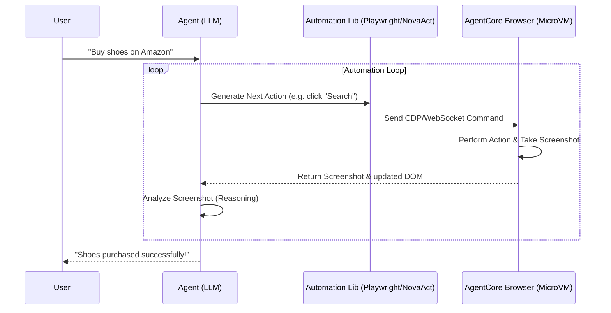

# AWS Bedrock AgentCore Deep Dive: Browser & Code Interpreter Tools (Hindi Notes 🇮🇳)

यह नोट्स **AWS Show & Tell: AgentCore Deep dive series: Browser Tool & Code Interpreter Tool** वीडियो पर आधारित हैं। इसे सरल, स्पष्ट और रोचक Hinglish में तैयार किया गया है ताकि शुरुआती डेवलपर्स AWS के इन दो महत्वपूर्ण Built-in (First-Party) टूल्स को समझ सकें।

---

## 🛠️ First-Party Tools क्या हैं? (What are First-Party Tools?)

एक AI Agent उतना ही शक्तिशाली होता है जितने कि उसके पास उपलब्ध **टूल्स (Tools)** होते हैं। बाहरी APIs (जैसे Slack, Salesforce) को कॉल करने के अलावा, एजेंट्स को कुछ बुनियादी तकनीकी क्षमताओं की आवश्यकता होती है:
1. **वेब ब्राउज़ करना (Web Browsing):** जानकारी इकट्ठा करने या वेब ऐप्स को ऑटोमेट करने के लिए।
2. **कोड चलाना (Code Execution):** डेटा विश्लेषण (Data Analysis) या सटीक गणितीय गणना (Math Calculations) करने के लिए।

AWS Bedrock AgentCore इन दोनों कार्यों के लिए **Browser Tool** और **Code Interpreter Tool** को **Serverless, Secure Sandboxes (MicroVMs)** के रूप में प्रदान करता है।

---

## 🌐 1. AgentCore Browser Tool

यह एक **Fully Managed, Serverless, Headless Chrome-based Browser** है। यह किसी भी एजेंट को इंटरनेट पर इंसानों की तरह ब्राउज़िंग करने, फॉर्म भरने और वेबपेज पर क्लिक करने की अनुमति देता है।

### 🔑 मुख्य विशेषताएं (Key Features):
* **Security & Isolation:** प्रत्येक ब्राउज़र सेशन एक पूरी तरह से अलग **MicroVM (Firecracker)** में चलता है। सेशन खत्म होते ही यह MicroVM नष्ट हो जाती है।
* **Live View (DCV Streaming):** **Nice DCV** प्रोटोकॉल का उपयोग करके, ब्राउज़र स्क्रीन को लाइव स्ट्रीम (वेबसॉकेट के ज़रिए) किया जा सकता है। आप इसे AWS कंसोल में देख सकते हैं या अपनी खुद की वेब ऐप में एम्बेड कर सकते हैं।
* **Session Recording & Replay:** गेटवे प्रत्येक सेशन के DOM ऐक्शन्स को रिकॉर्ड करता है। बाद में डेवलपर्स इसे वीडियो की तरह चलाकर ऑडिट कर सकते हैं कि एजेंट ने कहाँ-कहाँ क्लिक किया और क्या गलतियाँ कीं।
* **Serverless Pricing:** आपको कोई सर्वर होस्ट नहीं करना है। इसका खर्च प्रति-सेकंड (per-second CPU & Memory usage) पर आधारित होता है।

### 🔄 Browser-LLM फ़ीडबैक लूप (Feedback Loop):



---

## 💡 Browser Tool का व्यावहारिक उदाहरण: UI/QA Test Automation

पुराने समय में, Selenium या Playwright के ज़रिए UI टेस्टिंग के स्क्रिप्ट लिखे जाते थे। लेकिन अगर डेवलपर बटन की `id` या UI का डिज़ाइन थोड़ा भी बदल देता, तो स्क्रिप्ट टूट जाती थी।

**Agentic QA Testing (आधुनिक तरीका):**
* हम एजेंट को साधारण भाषा (Natural Language) में टेस्ट केस देते हैं: *"वेबसाइट के 'Contact Us' पेज पर जाओ, नाम-ईमेल भरके सबमिट करो, और चेक करो कि सक्सेस मैसेज आया या नहीं।"*
* एजेंट (जैसे `NovaAct` या `Claude`) स्क्रीनशॉट और DOM को देखकर समझता है कि इनपुट बॉक्स कहाँ है और क्लिक करता है। UI में मामूली बदलाव होने पर भी टेस्ट स्क्रिप्ट कभी नहीं टूटती!

### 💻 Python Code Example: Browser Session शुरू करना

```python
from bedrock_agent_core_starter_toolkit import BrowserClient

# 1. Browser Client को शुरू करें
browser_client = BrowserClient(region="us-west-2")

# 2. एक नया ब्राउज़र सेशन शुरू करें (S3 रिकॉर्डिंग सक्षम के साथ)
session = browser_client.start_browser_session(
    browser_tool_name="MyQA-TestingTool"
)

# 3. WebSocket URL और Signed Headers प्राप्त करें
websocket_url = session.websocket_url
signed_headers = session.signed_headers

print(f"WebSocket URL: {websocket_url}")

# 4. अब आप Playwright या NovaAct को इस websocket_url से कनेक्ट कर सकते हैं
# (काम पूरा होने पर सेशन को समाप्त करें)
browser_client.stop_browser_session(session_id=session.id)
```

---

## 💻 2. AgentCore Code Interpreter Tool

LLM मॉडल्स गणित (Math) और डेटा प्रोसेसिंग में कमज़ोर होते हैं (जैसे: बड़ी CSV फाइलों से औसत निकालना)। 

**Code Interpreter** एजेंट को एक सुरक्षित, अलग सैंडबॉक्स देता है जहाँ वह **Python, JavaScript, या TypeScript** कोड लिखकर उसे रन कर सकता है और परिणाम प्राप्त कर सकता है।

### 🔑 मुख्य विशेषताएं (Key Features):
* **No Host Risk:** एजेंट द्वारा जेनरेट किया गया अनट्रस्टेड कोड (Untrusted Code) आपके मुख्य सर्वर को नुकसान नहीं पहुँचा सकता, क्योंकि यह एक बंद MicroVM में चलता है।
* **S3 Integration & Large Payloads:** यह **100 MB** तक का इनपुट पेलोड स्वीकार करता है। यह S3 से सीधे **5 GB** तक की बड़ी फ़ाइलें (जैसे Excel Sheets, CSV, JSON Logs) सीधे सैंडबॉक्स में इम्पोर्ट कर सकता है।
* **Pre-installed Libraries:** इसमें Python की लोकप्रिय लाइब्रेरीज़ (Pandas, Numpy, Matplotlib, Requests आदि) पहले से इंस्टॉल आती हैं।
* **Custom Code Interpreter:** इसे आप अपने निजी VPC में डिप्लॉय कर सकते हैं और विशिष्ट IAM Permissions दे सकते हैं ताकि यह DynamoDB या अन्य AWS डेटाबेसों से जुड़ सके।

---

## 💡 Code Interpreter का व्यावहारिक उदाहरण: CloudTrail Log Analyzer

मान लीजिए हमें अपने AWS खाते के पिछले 24 घंटे के CloudTrail सुरक्षा लॉग्स (JSON फ़ाइलों में) को एनालाइज़ करना है और यह पता लगाना है कि किस यूजर ने सबसे ज़्यादा असफल (failed) API रिक्वेस्ट की हैं।

1. **Upload Logs:** हम 50 MB की JSON लॉग फ़ाइल को सैंडबॉक्स के लोकल फ़ाइल सिस्टम में लिखते हैं।
2. **Code Generation:** LLM (जैसे Claude 3.7) एक पायथन स्क्रिप्ट लिखता है जो `pandas` का उपयोग करके JSON को पार्स करती है, `status = AccessDenied` के इवेंट्स को फ़िल्टर करती है, और यूजर के अनुसार ग्रुप करती है।
3. **Execute:** एजेंट `CodeInterpreterClient` के ज़रिए इस पायथन कोड को सैंडबॉक्स में भेजता है।
4. **Result:** सैंडबॉक्स कोड चलाकर सटीक परिणाम (जैसे: top 5 संदिग्ध IP और यूज़र्स) एजेंट को वापस दे देता है।

### 💻 Python Code Example: Code Interpreter का उपयोग

```python
from bedrock_agent_core_starter_toolkit import CodeInterpreterClient

# 1. Client शुरू करें
ci_client = CodeInterpreterClient(region="us-west-2")

# 2. Code Interpreter Session बनाएं (15 मिनट के टाइमआउट के साथ)
session = ci_client.start_session(timeout_seconds=900)

# 3. सैंडबॉक्स में एक नई डेटा फ़ाइल लिखें
ci_client.write_file(
    session_id=session.id,
    file_path="prices.csv",
    content="product,price\napple,1.2\nbanana,0.5\norange,0.8"
)

# 4. सैंडबॉक्स में पायथन कोड चलाएं
python_code = """
import pandas as pd
df = pd.read_csv('prices.csv')
mean_price = df['price'].mean()
print(f"Mean Price: {mean_price}")
"""

response = ci_client.invoke(
    session_id=session.id,
    language="python",
    code=python_code
)

# 5. परिणाम प्रिंट करें
print("Output from Sandbox:")
print(response.stdout) # Output: Mean Price: 0.833

# 6. सेशन समाप्त करें
ci_client.stop_session(session_id=session.id)
```

---

## ❓ अक्सर पूछे जाने वाले सवाल (Frequently Asked Questions)

### Q1. क्या Browser Tool और Code Interpreter का उपयोग करने के लिए AgentCore Runtime की आवश्यकता है?
**उत्तर:** **नहीं।** ये दोनों टूल्स पूरी तरह से मॉड्यूलर (Modular) हैं। आप इन्हें अपनी लोकल मशीन पर चल रहे किसी भी कस्टम एजेंट (जैसे LangGraph, CrewAI) या किसी अन्य सर्वर में बोटो3 (Boto3) या Python SDK के ज़रिए स्टैंडअलोन (Standalone) इस्तेमाल कर सकते हैं।

### Q2. यदि कोई एजेंट अनजाने में कोई हानिकारक (malicious) कोड लिख दे, तो क्या हमारा AWS अकाउंट हैक हो सकता है?
**उत्तर:** **नहीं।** Code Interpreter एक पूरी तरह से पृथक (Isolated) **MicroVM Sandbox** में चलता है। इस VM के पास आपकी अनुमति के बिना आपके AWS रिसोर्सेज या इंटरनेट का कोई एक्सेस नहीं होता। इसके अलावा, सेशन खत्म होते ही सैंडबॉक्स पूरी तरह से नष्ट (destroy) हो जाता है।

### Q3. Browser Session Recording (Replay) फीचर वीडियो रिकॉर्डिंग से कैसे बेहतर है?
**उत्तर:** साधारण वीडियो रिकॉर्डिंग में केवल पिक्सल सेव होते हैं, जिसे सर्च या ऑप्टिमाइज़ नहीं किया जा सकता। AgentCore का Replay फ़ीचर असल में **DOM Actions** और **CDP Commands** को कैप्चर करता है। इसका लाभ यह है कि आप हर एक स्टेप पर नेटवर्क लॉग्स, क्लिक इवेंट्स, और HTML स्ट्रक्चर की जांच कर सकते हैं, जिससे एजेंट की गलतियों को पकड़ना और प्रॉम्ट्स को ठीक करना बहुत आसान हो जाता है।

### Q4. क्या हम सैंडबॉक्स में अपनी खुद की अतिरिक्त Python Libraries इंस्टॉल कर सकते हैं?
**उत्तर:** सामान्य सैंडबॉक्स में लोकप्रिय लाइब्रेरीज़ (Pandas, Requests, SciPy, Matplotlib) पहले से इंस्टॉल होती हैं। अगर आपको कोई विशिष्ट लाइब्रेरी चाहिए, तो आप Custom Code Interpreter सेटअप करके कस्टम कंटेनर इमेज (Docker Image) का उपयोग कर सकते हैं जिसमें आपकी सभी लाइब्रेरीज़ शामिल हों।
