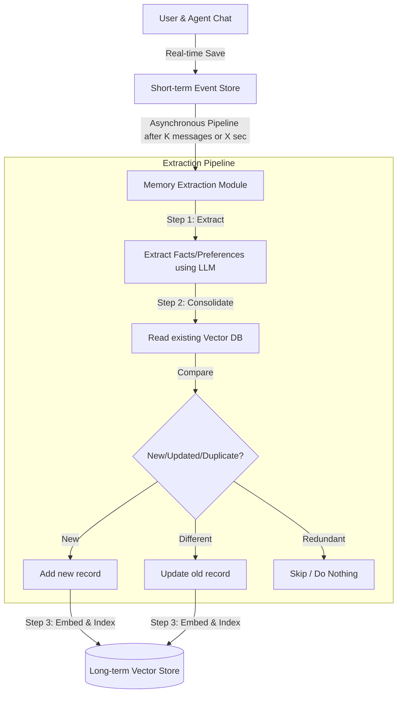

# AWS Bedrock AgentCore Deep Dive: Memory (Hindi Notes 🇮🇳)

यह नोट्स **AWS Show & Tell: Amazon Bedrock AgentCore Deep dive series: Memory** वीडियो पर आधारित हैं। इसे सरल, स्पष्ट और रोचक Hinglish में तैयार किया गया है ताकि शुरुआती डेवलपर्स AI Agents में Memory Management और Context Engineering की अवधारणाओं को आसानी से समझ सकें।

---

## 🧠 Memory और Context Engineering की आवश्यकता क्यों है?

2025 तक, डेवलपर्स ने अत्यधिक कुशल AI Agents बनाए, लेकिन वे मूल रूप से **Stateless** (बिना याददाश्त वाले) थे। यदि आपका कोई दोस्त हर बातचीत के बाद आपकी पुरानी बातें भूल जाए, तो वह निराशाजनक होगा। AI Agents के साथ भी ऐसा ही है।

**2026 "Context Engineering" का वर्ष है:**
आजकल के LLM मॉडल्स लाखों टोकन्स (Large Context Windows) को संभाल सकते हैं, लेकिन हर बार पूरी चैट हिस्ट्री भेजने के नुकसान हैं:
1. **High Cost:** हर API कॉल पर भारी मात्रा में टोकन भेजने से बिल बहुत बढ़ जाता है।
2. **Latency:** रिस्पॉन्स आने में समय (Delay) लगता है।
3. **Lost in the Middle / Hallucination:** बहुत अधिक डेटा देने से मॉडल भ्रमित हो सकता है या मुद्दे से भटक सकता है।

**समाधान:** **AgentCore Memory**। यह चैट हिस्ट्री और यूजर प्राथमिकताओं को कंप्रेस (60-70% तक छोटा) करके केवल आवश्यक जानकारी ही LLM को भेजता है, जिससे परफॉर्मेंस बेहतर और खर्च कम होता है।

---

## 🆚 Short-term Memory बनाम Long-term Memory

| फ़ीचर (Feature) | Short-term Memory (अल्पकालिक स्मृति) | Long-term Memory (दीर्घकालिक स्मृति) |
| :--- | :--- | :--- |
| **उद्देश्य (Purpose)** | चालू बातचीत (Current Session) के तात्कालिक संदेशों को याद रखना। | कई सेशन्स (Across Sessions) के पार यूजर की प्राथमिकताओं और मुख्य तथ्यों को याद रखना। |
| **डेटा का प्रकार** | Raw Messages (चैट टेक्स्ट) और Binary Blobs (सिस्टम स्टेट/चेकपॉइंट्स)। | Intelligent Processed Insights (जैसे: "अमित को पायथन कोडिंग पसंद है")। |
| **लाइफस्पैन (TTL)** | अस्थायी (7 से 365 दिन तक कॉन्फ़िगर करने योग्य)। | स्थायी (Permanently stored, जब तक आप डिलीट न करें)। |
| **स्टोरेज प्रकार** | Fast Event Store (त्वरित रीड-राइट के लिए)। | Managed Vector Store (सिमेंटिक सर्च के लिए)। |
| **प्रोसेसिंग** | तत्काल (Real-time)। | बैकग्राउंड में एसिंक्रोनस (Asynchronous Pipeline) रूप से चलती है। |

---

## 🔄 Memory Architecture & Extraction Pipeline

AgentCore Memory के पीछे एक स्मार्ट बैकग्राउंड प्रोसेस काम करती है। जब आप Short-term Memory में चैट स्टोर करते हैं, तो एक **Memory Extraction Module** इसे प्रोसेस करके Long-term Vector Store में बदलता है।



### 🧩 Long-term Memory की 4 मुख्य रणनीतियाँ (Strategies)
1. **Semantic:** बातचीत से सामान्य तथ्यों (Facts) को निकालना।
2. **User Preference:** यूजर की पसंद-नापसंद को कैप्चर करना (जैसे: "यूजर बजट होटल्स पसंद करता है")।
3. **Summary:** हर सेशन का एक रोलिंग सारांश (Rolling Summary) बनाना।
4. **Override:** आप अपना कस्टम LLM प्रॉम्ट लिख सकते हैं ताकि केवल वही जानकारी निकाली जाए जो आपकी ऐप के लिए ज़रूरी है (जैसे: केवल ट्रैवल डिटेल्स निकालें, कॉफी प्रेफरेंस को इग्नोर करें)।

### 📁 Namespaces (नामस्थान)
यह मेमोरी रिकॉर्ड्स को व्यवस्थित करने का एक पदानुक्रमित (Hierarchical) तरीका है (उदा. `retail-agent/<customer-id>/preferences`)। इसके कारण अमित की पसंद केवल अमित को दिखेगी और आकाश की पसंद केवल आकाश को।

---

## 💡 Branching: वैकल्पिक बातचीत के रास्ते (Alternate Paths)

AgentCore Memory का एक बेहतरीन फ़ीचर है **Branching**।
* **क्या है?** यह एक ही मेमोरी रिसोर्स के अंदर अलग-अलग समानांतर (Parallel) बातचीत की शाखाएं बनाने की अनुमति देता है।
* **उपयोग का उदाहरण:** यदि एक मल्टी-एजेंट सिस्टम में **Flight Agent** और **Hotel Agent** दोनों समानांतर काम कर रहे हैं, तो वे क्रमशः `flight-branch` और `hotel-branch` पर काम कर सकते हैं ताकि एक का डेटा दूसरे के साथ मिक्स न हो।

---

## 💻 व्यावहारिक कोड उदाहरण (Python Code Examples)

### 1. Memory Resource बनाना (One-Time Setup)
याद रखें, मेमोरी रिसोर्स बनाना केवल एक बार की प्रक्रिया है, इसे हर बार एजेंट शुरू होने पर कॉल नहीं करना है।

```python
from bedrock_agent_core_starter_toolkit import MemoryClient

# Client इनिशियलाइज़ करें
memory_client = MemoryClient(region="us-east-1")

# Long-term Strategies को कॉन्फ़िगर करें
strategies = [
    {
        "strategy_type": "user_preference",
        "strategy_name": "UserPrefs",
        "namespace_template": "travel-agent/{actor_id}/preferences"
    },
    {
        "strategy_type": "summary",
        "strategy_name": "SessionSummary",
        "namespace_template": "travel-agent/{actor_id}/{session_id}/summary"
    }
]

# मेमोरी रिसोर्स बनाएं (यह बैकग्राउंड में Vector DB सेटअप करता है, इसलिए 2-3 मिनट लेता है)
response = memory_client.create_memory(
    memory_name="TravelAgentMemory",
    description="Memory for user preferences and summaries",
    strategies=strategies,
    event_expiry_days=30 # Short-term events 30 दिनों में एक्सपायर होंगे
)

print(f"Memory Resource Created! ID: {response.memory_id}")
```

### 2. बातचीत को Short-term Memory में सहेजना (Create Event)
जब यूजर और एजेंट आपस में चैट करते हैं, तो उन संदेशों को सहेजने के लिए:

```python
# चैट इवेंट को सेव करें
memory_client.create_event(
    memory_id="YOUR_MEMORY_ID",
    actor_id="customer_amit_99",
    session_id="session_holiday_2026",
    messages=[
        {"role": "user", "content": "मुझे पहाड़ों पर घूमना पसंद है, लेकिन इस बार मैं शांत समुद्र तट (beach) पर जाना चाहता हूँ।"},
        {"role": "assistant", "content": "समझ गया! आपके लिए शांत समुद्र तटों की लिस्ट तैयार कर रहा हूँ।"}
    ]
)
```

### 3. Long-term Memory से यूजर प्राथमिकताओं को निकालना (Retrieve)
जब अमित वापस आता है, तो उसकी सहेजी गई प्राथमिकताओं को पढ़ने के लिए:

```python
# Namespace का उपयोग करके पुरानी यादें निकालें
retrieved_memories = memory_client.retrieve_memories(
    memory_id="YOUR_MEMORY_ID",
    namespace="travel-agent/customer_amit_99/preferences"
)

for record in retrieved_memories:
    print(f"श्रेणी (Category): {record.category}")
    print(f"तथ्य (Insight): {record.preference}")
    print(f"संदर्भ (Context): {record.context}") 
    # Output context: "यूजर ने पहले पहाड़ों को पसंद किया था, लेकिन अब शांत समुद्र तट जाना चाहता है।"
```

---

## ❓ अक्सर पूछे जाने वाले सवाल (Frequently Asked Questions)

### Q1. क्या सैंडबॉक्स या एजेंट रीस्टार्ट होने पर Memory गायब हो जाएगी?
**उत्तर:** **नहीं।** AgentCore Memory एक सर्वरलेस, परसिस्टेंट (Persistent) AWS सर्विस है। चैट रिकॉर्ड्स और वेक्टर डेटा सुरक्षित AWS स्टोरेज में रहते हैं। जब भी आप समान `memory_id` और `actor_id` के साथ कॉल करेंगे, आपको पुराना डेटा वापस मिल जाएगा, भले ही आपका एजेंट रीस्टार्ट हुआ हो।

### Q2. यदि कोई यूजर अपनी पसंद बदल ले (जैसे: पहले 'पायथन' पसंद थी, अब 'जावा'), तो क्या दो अलग एंट्रीज़ बन जाएंगी?
**उत्तर:** **नहीं।** यहीं पर **Consolidation** स्टेप काम आता है। जब एसिंक्रोनस पाइपलाइन चलती है, तो वह वेक्टर डेटाबेस से पुराना रिकॉर्ड पढ़ती है। LLM देखता है कि यूजर की पसंद अपडेट हुई है, इसलिए वह नया रिकॉर्ड बनाने के बजाय पुराने रिकॉर्ड को अपडेट कर देता है या नया संशोधित संदर्भ (Context) जोड़ देता है।

### Q3. Binary Blobs और Conversational Events में क्या अंतर है?
**उत्तर:**
* **Conversational Events:** ये सामान्य टेक्स्ट चैट मैसेजेस होते हैं। इनसे बैकग्राउंड पाइपलाइन यूजर की प्राथमिकताओं (Insights) को एक्सट्रैक्ट करती है।
* **Binary Blobs:** ये मुख्य रूप से एप्लिकेशन स्टेट या एजेंट फ्रेमवर्क (जैसे LangGraph के Checkpoints) के स्नैपशॉट होते हैं। इन्हें केवल रीस्टोर/रिकवरी के लिए इस्तेमाल किया जाता है, बैकग्राउंड पाइपलाइन इनमें से कभी भी कोई इंसॉइट एक्सट्रैक्ट नहीं करती।

### Q4. क्या हम गैर-AWS मॉडल (जैसे OpenAI, Gemini) के साथ इस मेमोरी का उपयोग कर सकते हैं?
**उत्तर:** **हाँ।** आप अपने मुख्य एजेंट में किसी भी LLM (जैसे GPT-4 या Gemini 1.5) का उपयोग कर सकते हैं। केवल बैकग्राउंड में चलने वाली **Memory Extraction & Consolidation Pipeline** (जो फैक्ट्स को एक्सट्रैक्ट और वेक्टर स्टोर में सेव करती है) ही AWS Bedrock मॉडल्स का उपयोग करती है। आपका फ्रंट-एंड एजेंट पूरी तरह से स्वतंत्र हो सकता है।
