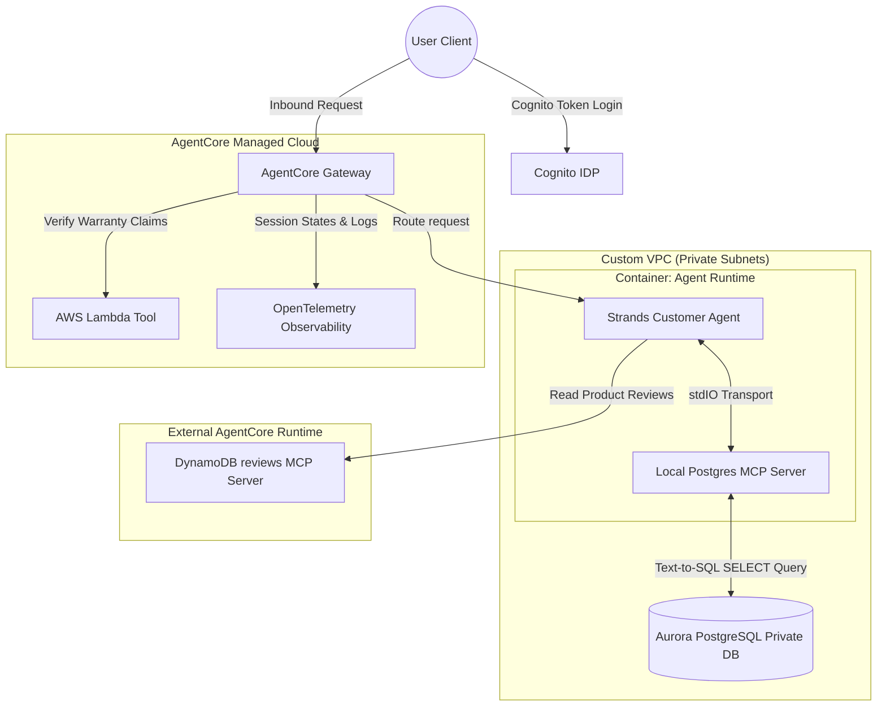

# AWS Bedrock AgentCore Deep Dive: AgentCore GA - Prototype to Production (Hindi Notes 🇮🇳)

यह नोट्स **AWS Show & Tell: Bedrock AgentCore now in GA: Moving AI Agents from Prototype Purgatory to Production** वीडियो पर आधारित हैं। इसे सरल, स्पष्ट और रोचक Hinglish में तैयार किया गया है ताकि शुरुआती डेवलपर्स यह समझ सकें कि AI Agents को स्थानीय कंप्यूटर (Prototype) से हटाकर सुरक्षित, स्केलेबल और एंटरप्राइज़-ग्रेड क्लाउड एनवायरनमेंट (Production) में कैसे ले जाया जाता है।

---

## 🚀 1. Prototype Purgatory क्या है? (What is Prototype Purgatory?)

अधिकतर डेवलपर्स अपने AI Agents को अपने लैपटॉप पर (जैसे Jupyter Notebooks या Local python scripts में) बनाते हैं। लेकिन जब उन्हें इन एजेंट्स को कंपनी के स्तर पर (Production में) लॉन्च करना होता है, तो वे निम्नलिखित समस्याओं में फंस जाते हैं:
* **Security & Compliance:** क्रेडेंशियल्स और संवेदनशील ग्राहक डेटा की सुरक्षा कैसे करें?
* **Network Isolation:** एजेंट को बिना इंटरनेट के प्राइवेट डेटाबेस (जैसे AWS Aurora) से सुरक्षित रूप से कैसे जोड़ें?
* **Scale & Availability:** जब एक साथ हज़ारों यूज़र्स कॉल करें, तो लोड को कैसे हैंडल करें?
* **Repeatability:** एजेंट को इंफ्रास्ट्रक्चर के साथ दोबारा आसानी से कैसे डिप्लॉय (CI/CD) करें?

इसी समस्या को हल करने के लिए **AWS Bedrock AgentCore** को अब **General Availability (GA)** में लॉन्च कर दिया गया है। 

---

## 🛠️ 2. AgentCore GA के मुख्य फ़ीचर्स (Key GA Features)

GA रिलीज़ के साथ AWS ने कई महत्वपूर्ण सुरक्षा और प्रदर्शन संवर्द्धन (security and performance enhancements) पेश किए हैं:

### A. Enterprise-grade Security & Networking
* **VPC Support & PrivateLink:** अब आप अपने Runtimes और Gateways को अपने निजी VPC (Virtual Private Cloud) के अंदर चला सकते हैं। इंटरनेट पर डेटा भेजे बिना, **PrivateLink** के ज़रिए सभी संचार पूरी तरह निजी रहते हैं।
* **Inbound Auth Options:** एजेंट्स को ऑथराइज़ करने के लिए अब Cognito (OAuth 2.0) के साथ-साथ **AWS IAM** का भी विकल्प है।

### B. Infrastructure as Code (IaC) & Deployment
* **IaC Support:** CloudFormation (और जल्द ही Terraform/CDK) के माध्यम से पूरी एजेंट पाइपलाइन (Runtime, Gateway, Identity) को एक स्क्रिप्ट से डिप्लॉय किया जा सकता है।
* **CI/CD Pipeline Integration:** GitHub पर कोड पुश करने पर CodePipeline आटोमेटिकली एजेंट का नया वर्शन ECR में बिल्ड कर के Runtime पर अपडेट कर देती है।

### C. Developer & Observability Upgrades
* **Lifespan Events:** सर्वर शुरू (`startup`) होने और बंद (`shutdown`) होने से ठीक पहले विशिष्ट कोड चलाने की सुविधा।
* **Agent-to-Agent (A2A) Native Support:** मल्टि-एजेंट सिस्टम में JSON-RPC प्रोटोकॉल के ज़रिए दो एजेंट्स का आपस में बातचीत करना।
* **Tagging & Cost Allocation:** खर्च को ट्रैक करने के लिए हर रिसोर्स को टैग (जैसे `Env=Prod`, `Team=Finance`) करना।
* **Expanded Regions:** GA के बाद अब यह 4 से बढ़कर **9 Regions** में उपलब्ध है।

---

## 📊 3. Complex Customer Support Agent Architecture (VPC Setup)

वीडियो में इशान ने 2-3 दिनों में एक जटिल, एंटरप्राइज़-ग्रेड आर्किटेक्चर डिप्लॉय करके दिखाया:



### 💡 डेटा एक्सेस के तीन अलग तरीके (Multi-Database Setup)
1. **Aurora PostgreSQL (निजी डेटा):** यूज़र्स और ऑर्डर्स का डेटा सुरक्षित रखने के लिए यह बिना इंटरनेट के प्राइवेट सबनेट में है। एजेंट में इंस्टॉल लोकल MCP सर्वर सीधे Text-to-SQL का उपयोग करके डेटा पढ़ता है।
2. **DynamoDB (रिव्यूज):** प्रॉडक्ट रिव्यूज के लिए अलग से एक MCP सर्वर दूसरे कंटेनर (AgentCore Runtime) में चल रहा है।
3. **AWS Lambda (वारंटी दावे):** वारंटी चेक करने का बिज़नेस लॉजिक लैम्ब्डा फ़ंक्शन में है, जो **Gateway** के माध्यम से कनेक्टेड है।

---

## 💻 4. Lifespan Events & IaC Code Example

एजेंट को डेटाबेस से कनेक्ट करने के लिए, हर बार क्वेरी पर कनेक्शन खोलना धीमा होता है। इसके बजाय, हम **Lifespan Startup** का उपयोग करके सर्वर चालू होते ही एक बार कनेक्शन बनाते हैं:

```python
from bedrock_agent_core.sdk import AgentCoreApp
from contextlib import asynccontextmanager

# 1. Lifespan Context Manager
@asynccontextmanager
async def lifespan(app: AgentCoreApp):
    # [STARTUP EVENT]
    # सर्वर चालू होने से पहले डेटाबेस कनेक्शन और स्कीमा लोड करें
    print("कनेक्टिंग टू ऑरोरा डेटाबेस...")
    app.state.db_connection = await connect_to_postgres()
    app.state.db_schema = await fetch_schema(app.state.db_connection)
    
    yield # यहाँ एजेंट सामान्य काम (Invocations) हैंडल करेगा
    
    # [SHUTDOWN EVENT]
    # सर्वर बंद होने से पहले कनेक्शन बंद करें (Cleanup)
    print("डेटाबेस कनेक्शन बंद किया जा रहा है...")
    await app.state.db_connection.close()

# 2. App Initialization
app = AgentCoreApp(lifespan=lifespan)

@app.entrypoint()
async def my_agent(request):
    # एजेंट यहाँ app.state.db_schema का उपयोग बिना देरी के कर सकता है
    return await process_request(request, app.state.db_connection)

if __name__ == "__main__":
    app.run()
```

---

## ❓ अक्सर पूछे जाने वाले सवाल (Frequently Asked Questions)

### Q1. SQL Injection हमलों से डेटाबेस को कैसे सुरक्षित रखें?
**उत्तर:** वीडियो में दो तरीके बताए गए हैं:
1. **Read-Only Connections:** एजेंट के डेटाबेस यूजर को केवल `SELECT` (डेटा पढ़ने) की अनुमति होनी चाहिए, `INSERT` या `DELETE` की नहीं।
2. **Guardrails:** AWS Bedrock Guardrails का उपयोग करके दुर्भावनापूर्ण (malicious) इनपुट को ब्लॉक किया जाता है ताकि LLM को हानिकारक SQL क्वेरी लिखने से रोका जा सके।

### Q2. AWS Q (Curo) को हमारे डेवलपमेंट एनवायरनमेंट में कैसे यूज़ करें?
**उत्तर:** Curo/Q एक कोडिंग असिस्टेंट है (जैसे VS Code या Cursor में Github Copilot)। आप AWS Labs द्वारा जारी **AgentCore MCP Server** को अपने कोडिंग एडिटर में जोड़ सकते हैं। यह AI को आपके लोकल एजेंट कोड को सीधे पढ़ने, सुधारने और केवल एक प्रॉम्ट के माध्यम से AWS पर डिप्लॉय करने की क्षमता देता है।

### Q3. Lifespan Event का क्या महत्व है?
**उत्तर:** जब एजेंट को कोई अनुरोध मिलता है, तो वह मिलीसेकंड में रिस्पॉन्स देना चाहता है। यदि एजेंट हर बार कॉल आने पर डेटाबेस स्कीमा डाउनलोड करेगा या नया कनेक्शन खोलेगा, तो लेटेंसी (Latency) बहुत बढ़ जाएगी। `lifespan` सजावट (decorator) सर्वर बूट होते समय ही एक बार कनेक्शन खोलकर मेमोरी में रख लेता है, जिससे वास्तविक कॉल्स बहुत तेज़ी से काम करती हैं।

### Q4. Tagging क्यों महत्वपूर्ण है?
**उत्तर:** बड़ी कंपनियों में दर्जनों विभाग होते हैं। अगर सभी विभाग एक ही AWS खाते पर एजेंट्स चलाएंगे, तो बिल किसका है यह समझना मुश्किल होगा। AgentCore GA के साथ, आप हर Runtime और Gateway को विशिष्ट टैग (जैसे `CostCenter=HR`, `Project=Claims`) दे सकते हैं, जिससे AWS Billing कंसोल में सटीक वित्तीय ट्रैकिंग (Cost Allocation) हो सके।
