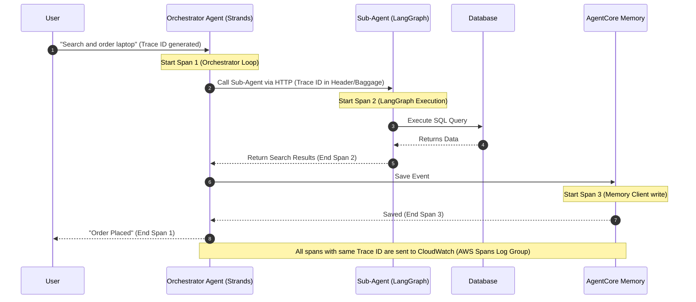

# AWS Bedrock AgentCore Deep Dive: Observability & OpenTelemetry (Hindi Notes 🇮🇳)

यह नोट्स **AWS Show & Tell: AgentCore Observability: Monitor and Debug AI Agents with OpenTelemetry** वीडियो पर आधारित हैं। इसे सरल, स्पष्ट और व्यावहारिक Hinglish में तैयार किया गया है ताकि शुरुआती और मध्यवर्ती डेवलपर्स समझ सकें कि AI Agents में त्रुटियों (bugs) को कैसे खोजा जाए, लेटेंसी (latency) को कैसे मापा जाए और ओपन-सोर्स मानकों (standards) का उपयोग करके डिबगिंग कैसे की जाए।

---

## 🧐 1. AI Agents के लिए Observability क्यों आवश्यक है?

पारंपरिक सॉफ्टवेयर (Traditional software) और AI Agents में एक बड़ा अंतर होता है:
* **Traditional Software (Deterministic):** यहाँ कोड का रास्ता फिक्स्ड होता है (Input ➡️ Static Logic ➡️ Output)। यदि कोई एरर आता है, तो हम सीधे देख सकते हैं कि कौन सी लाइन फेल हुई।
* **AI Agents (Non-Deterministic):** यहाँ हम एजेंट को केवल एक लक्ष्य (Target) देते हैं। एजेंट खुद तय करता है कि उसे कौन से टूल्स कॉल करने हैं, कौन सा डेटा पढ़ना है और LLM के साथ क्या बात करनी है। 

> [!IMPORTANT]
> चूंकि एजेंट का व्यवहार पहले से तय (non-deterministic) नहीं होता, इसलिए उसके काम को ट्रैक करना एक "Black Box" (रहस्य) जैसा हो जाता है। **AgentCore Observability** इसी ब्लैक बॉक्स को पारदर्शी (transparent) बनाता है ताकि डेवलपर्स देख सकें कि एजेंट ने वास्तव में क्या और क्यों किया।

---

## 🏛️ 2. Observability के 3 मुख्य स्तंभ (3 Pillars of Observability)

1. **Logs (लॉग्स):** "What happened" (क्या हुआ?) - यह किसी विशिष्ट समय पर हुई घटनाओं का सादा टेक्स्ट रिकॉर्ड है।
2. **Traces (ट्रेसेज़):** "How it happened" (यह कैसे हुआ?) - यह अनुरोध (Request) से लेकर रिस्पॉन्स (Response) तक के पूरे सफर (trajectory) का नक्शा दिखाता है।
3. **Metrics (मेट्रिक्स):** "How much / How well" (कितना और कैसा प्रदर्शन रहा?) - जैसे कुल उपयोग किए गए टोकन, एरर रेट, और लेटेंसी।

---

## 🧩 3. OpenTelemetry (OTEL) के मुख्य शब्द (Terminologies)

AgentCore Observability पूरी तरह से **OpenTelemetry** (एक लोकप्रिय ओपन-सोर्स फ्रेमवर्क) पर आधारित है। इसके मुख्य घटकों को इस प्रकार समझें:

* **Span (स्पैन):** यह काम की सबसे छोटी इकाई है। जैसे: एक LLM API कॉल करना, डेटाबेस क्वेरी चलाना, या टूल निष्पादित करना। प्रत्येक स्पैन एक JSON ऑब्जेक्ट होता है जिसमें शुरू/बंद होने का समय और मेटाडेटा होता है।
* **Trace (ट्रेस):** कई स्पैन मिलकर एक ट्रेस बनाते हैं। यह पूरे अनुरोध (request-to-response) के फ्लो को दर्शाता है।
* **Session (सेशन):** एक ही बातचीत (जैसे चैटबॉट में) के दौरान होने वाले कई अनुरोधों और प्रतिक्रियाओं को जोड़ने के लिए एक `Session ID` का उपयोग किया जाता है।
* **Baggage (बैगेज):** यह कस्टम मेटाडेटा (जैसे `Tenant ID` या `Conversation ID`) को एक सिस्टम से दूसरे सिस्टम (जैसे HTTP हेडर के माध्यम से) तक ले जाने का साधन है।

---

## 🔄 4. Observability आर्किटेक्चर और फ्लो



---

## 💻 5. Developer Setup: Local Agent & Runtime Integration

### A. Local Python Agent Setup
यदि आप अपने लोकल मशीन पर एजेंट्स चला रहे हैं (चाहे वह Strands हो, LangGraph हो या CrewAI), तो आप ADOT (**AWS Distribution for OpenTelemetry**) का उपयोग करके डेटा सीधे AWS CloudWatch में भेज सकते हैं:

1. **ADOT Python package इंस्टॉल करें:**
   ```bash
   pip install aws-opentelemetry-distro strands-otel
   ```
2. **Environment Variables कॉन्फ़िगर करें:**
   ```bash
   export OTEL_PYTHON_DISTRO="aws_otel_distro"
   export AWS_OTEL_LOG_GROUP="my-agent-otel-log-group"
   export AWS_OTEL_LOG_STREAM="my-agent-stream"
   export AGENT_NAME="EcomSupportAgent"
   ```
3. **एजेंट को ऑटो-इंस्ट्रूमेंट के साथ रन करें:**
   ```bash
   opentelemetry-instrument python main.py
   ```

### B. AgentCore Runtime Integration (Zero-Config)
यदि आप कोड को **AgentCore Runtime** (Managed Cloud Container) में डिप्लॉय करते हैं, तो आपको उपरोक्त पर्यावरण चर (environment variables) मैन्युअल रूप से सेट करने की आवश्यकता नहीं है। 
आपको बस अपने कोड में 4 लाइनें लिखनी हैं:

```python
from bedrock_agent_core.sdk import AgentCoreApp

app = AgentCoreApp()

@app.entrypoint()
async def process_user_query(request):
    # आपका एजेंट का मुख्य लॉजिक
    return {"response": "Hello World"}

if __name__ == "__main__":
    app.run()
```
कंसोल या CloudFormation टेम्पलेट के ज़रिए बस `Tracing: Enabled` सेट करें, और Runtime आटोमेटिकली सभी ट्रेसेज़ को CloudWatch में भेज देगा।

---

## 💻 6. व्यावहारिक उदाहरण (Practical Examples)

यहाँ AgentCore Observability और OpenTelemetry के वास्तविक दुनिया के तीन महत्वपूर्ण व्यावहारिक उदाहरण दिए गए हैं:

### उदाहरण A: Multi-Agent Context & Baggage Propagation (Python)
जब आपका Orchestrator Agent किसी दूसरे Runtime या EKS कंटेनर में चल रहे Sub-Agent को कॉल करता है, तो दोनों के लॉग्स को एक ही `Trace ID` और `Baggage` (जैसे `tenant_id`) से जोड़ने का तरीका:

```python
import httpx
from opentelemetry import baggage, trace
from opentelemetry.propagate import inject

# 1. OpenTelemetry Tracer प्राप्त करें
tracer = trace.get_tracer(__name__)

async def call_sub_agent(user_query: str):
    # 2. एक नया स्पैन शुरू करें (Span Context)
    with tracer.start_as_current_span("call_sub_agent_operation") as span:
        # 3. Baggage में कस्टम बिजनेस एट्रिब्यूट्स जोड़ें
        # ये एट्रिब्यूट्स पूरे डिस्ट्रीब्यूटेड नेटवर्क में ट्रैवल करेंगे
        ctx = baggage.set_baggage("tenant_id", "enterprise_customer_abc")
        ctx = baggage.set_baggage("conversation_id", "session_9921_xyz")
        
        # 4. HTTP Headers तैयार करें
        headers = {}
        # inject() हेडर में Trace ID और Baggage (W3C Standard) को इंजेक्ट कर देता है
        inject(headers, context=ctx)
        
        # HTTP हेडर कुछ इस तरह दिखेगा:
        # headers = {
        #     "traceparent": "00-4bf92f3577b34da6a3ce929d0e0e4736-00f067aa0ba902b7-01",
        #     "baggage": "tenant_id=enterprise_customer_abc,conversation_id=session_9921_xyz"
        # }
        
        sub_agent_url = "https://sub-agent.runtime.us-west-2.amazonaws.com/invoke"
        payload = {"query": user_query}
        
        # 5. हेडर के साथ सब-एजेंट को कॉल करें
        async with httpx.AsyncClient() as client:
            response = await client.post(sub_agent_url, json=payload, headers=headers)
            result = response.json()
            
            # स्पैन में कुछ कस्टम इवेंट्स और एरर लॉग्स जोड़ें
            span.add_event("Sub-agent query succeeded")
            span.set_attribute("response.tokens_used", result.get("tokens", 0))
            
            return result
```

---

### उदाहरण B: CloudWatch PII Redaction Policy Setup (JSON)
आपके एजेंट के चैट लॉग्स में यदि ग्राहक क्रेडिट कार्ड या ईमेल डालता है, तो AWS CloudWatch में स्टोर होने से पहले उसे मास्क करने की पॉलिसी का उदाहरण:

```json
{
  "Version": "2012-10-17",
  "Statement": [
    {
      "Sid": "MaskPIIData",
      "Effect": "Deny",
      "Principal": "*",
      "Action": "logs:PutLogEvents",
      "Resource": "arn:aws:logs:us-west-2:123456789012:log-group:my-agent-otel-log-group:*",
      "DataProtectionPolicy": {
        "Name": "PIIMaskingPolicy",
        "Description": "Mask sensitive customer data before writing to CloudWatch",
        "Rules": [
          {
            "Name": "MaskCreditCards",
            "DataIdentifiers": [
              "arn:aws:dataprotection::aws:data-identifier/CreditCardNumber",
              "arn:aws:dataprotection::aws:data-identifier/EmailAddress"
            ],
            "Operation": {
              "MaskConfig": {
                "MaskCharacter": "*"
              }
            }
          }
        ]
      }
    }
  ]
}
```

---

### उदाहरण C: Custom Instrumenting a Python Tool (Manual Spans)
यदि आप आटोमेटिक इंस्ट्रूमेंटेशन के बजाय किसी महत्वपूर्ण स्थानीय टूल (जैसे PDF Parser या Database Writer) का समय और लेटेंसी मैन्युअल रूप से मापना चाहते हैं:

```python
from opentelemetry import trace

tracer = trace.get_tracer("pdf_parser_service")

def parse_large_pdf(file_path: str):
    # 'parse_pdf_span' नाम से एक कस्टम ट्रैक स्पैन बनाएं
    with tracer.start_as_current_span("parse_pdf_span") as span:
        # स्पैन में एट्रिब्यूट्स (metadata) जोड़ें जो CloudWatch सर्च में दिखेंगे
        span.set_attribute("file.path", file_path)
        
        try:
            # टूल का मुख्य काम यहाँ करें
            content = execute_pdf_parsing(file_path)
            
            # सफलता की जानकारी
            span.set_attribute("pdf.pages_count", len(content.pages))
            span.set_status(trace.StatusCode.OK)
            return content
            
        except Exception as e:
            # एरर होने पर स्टैक ट्रेस आटोमेटिकली ट्रेस में रिकॉर्ड हो जाएगा
            span.record_exception(e)
            span.set_status(trace.StatusCode.ERROR, str(e))
            raise e
```

---

## 🔒 7. Security & PII (Data Privacy)

AI एजेंट्स अक्सर संवेदनशील जानकारी (जैसे ईमेल, क्रेडिट कार्ड, नाम आदि) के साथ काम करते हैं। AWS CloudWatch में इन डेटा के लीक होने से बचने के लिए:

1. **CloudWatch Data Protection Policies:** आप CloudWatch लॉग ग्रुप पर डेटा सुरक्षा नीतियां लागू कर सकते हैं। यह लॉग्स में आने वाले PII (Personally Identifiable Information) डेटा को वास्तविक समय में आटोमेटिकली पहचानकर मास्क (Redact/Hide) कर देता है।
2. **Bedrock Guardrails:** LLM के पास इनपुट जाने से पहले ही असुरक्षित पैटर्न को रोक देता है (Defense-in-Depth)।

---

## 📈 8. CloudWatch Custom Dashboards & Alarms

ऑब्जर्वेबिलिटी का असली फायदा तब होता है जब आप अलार्म लगा सकें। आप CloudWatch में निम्नलिखित चीज़ों पर अलार्म लगा सकते हैं:

* **Throttling (थ्रॉटलिंग):** यदि LLM या टूल्स की दर सीमा (Rate Limit) समाप्त हो रही है।
* **Latency (लेटेंसी):** यदि किसी सब-एजेंट या टूल का औसत रिस्पॉन्स टाइम 5 सेकंड से अधिक हो रहा है।
* **Token Usage (टोकन खपत):** यदि कोई विशिष्ट एजेंट या सत्र बहुत अधिक मात्रा में टोकन खा रहा है (जिससे बजट नियंत्रण में रहे)।

---

## ❓ अक्सर पूछे जाने वाले सवाल (Frequently Asked Questions)

### Q1. क्या ओपन टेलीमेट्री जोड़ने से एजेंट की परफॉर्मेंस (Latency) धीमी हो जाती है?
**उत्तर:** ओपन टेलीमेट्री काफी हल्की है। डिफ़ॉल्ट रूप से, OTEL SDK हर कॉल पर डेटा भेजने के बजाय स्पैन को बफर (Buffer) में जमा करता है और हर **2 सेकंड** (या कॉन्फ़िगर किए गए समय) में एक साथ फ्लश करता है। यदि आप परफॉर्मेंस को और बेहतर करना चाहते हैं, तो बफर साइज़ को बढ़ा सकते हैं, जिससे नेटवर्क कॉल्स कम हो जाएंगी।

### Q2. क्या हम इन लॉग्स को Datadog, Dynatrace, या New Relic जैसे टूल्स में भेज सकते हैं?
**उत्तर:** हाँ! चूंकि AgentCore Observability **OpenTelemetry (OTEL)** जैसे ओपन स्टैंडर्ड पर आधारित है, इसलिए आप आसानी से एक Collector (जैसे ADOT Collector) कॉन्फ़िगर कर सकते हैं जो इन ट्रेसेज़ और स्पैन को आपके पसंदीदा किसी भी थर्ड-पार्टी डैशबोर्ड टूल पर रीडायरेक्ट कर देगा। AWS आपको किसी एक टूल पर निर्भर रहने के लिए मजबूर नहीं करता।

### Q3. Distributed Tracing क्या है और यह मल्टि-एजेंट में क्यों महत्वपूर्ण है?
**उत्तर:** जब एक बड़ा सिस्टम काम करता है, तो एक मुख्य एजेंट (Orchestrator) दूसरे छोटे एजेंट (जैसे LangGraph Sub-agent) को कॉल करता है जो आगे डेटाबेस या थर्ड-पार्टी API को कॉल करता है।
**Distributed Tracing** के बिना, हमारे पास हर एजेंट के अलग-अलग लॉग होंगे, जिन्हें आपस में जोड़ना असंभव होगा। OTEL के माध्यम से, एक ही `Trace ID` को सभी सिस्टम्स (हेडर के ज़रिए) में पास किया जाता है, जिससे हम डैशबोर्ड पर एक ही क्लिक से पूरी चेन (chain) देख सकते हैं कि किस सब-एजेंट ने कितना समय लिया।
