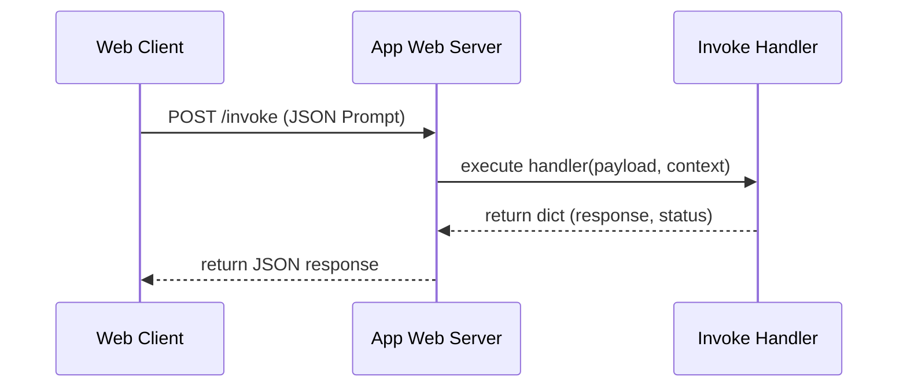

# Chapter_05_repository_walkthrough

## 1. Introduction
Understanding the layout and execution entry points of the Bedrock AgentCore repository is key to building custom agents.

### What is it?
The Repository Walkthrough is a structured inspection of the project folder layout, configuration files, source code modules, and entrypoint functions that comprise a Bedrock AgentCore application.

### Why is it important?
Navigating a codebase without understanding its structural layout leads to improperly placed files, broken imports, and execution errors. Understanding where each file lives and what role it plays allows developers to locate components quickly and extend agent capabilities cleanly.

### How does it work?
The repository organizes code into specific functional directories: 'src/' hosts Python application logic, 'bedrock_agent_core.yaml' defines metadata configurations, '.env' stores local environment variables, and 'pyproject.toml' manages package dependencies. Python decorators (like '@app.invoke') register handler functions to process incoming web requests.

### Key Responsibilities
- Separate application entry points from utility modules and configuration settings.
- Map incoming web and container API routes to specific Python handler functions.
- Define container boot parameters, memory allocations, and execution roles in YAML sheets.
- Provide a standardized, readable repository architecture for engineering teams.

---

## 2. Learning Objectives
By the end of this chapter, you will be able to:
- In this chapter, you will learn:
- - The execution flow of a standard AgentCore container application.
- - The structure of the primary entrypoint file (`src/main.py`).
- - How to import and use the Bedrock AgentCore SDK.
- - The purpose of app decorators in routing inbound requests.

---

## 3. Prerequisites
* Successful clone of the agentcore-samples repository from Chapter 4.
* A basic understanding of Python function definitions and imports.

---

## 4. Background Theory
Enterprise Python applications partition code into distinct functional layers to ensure separation of concerns. The entrypoint module coordinates initialization steps and runs listeners, utility files contain helper functions, and configuration sheets store variables. Bedrock AgentCore utilizes decorators to bind HTTP routes inside containers. Decorators are design structures that wrap functions to modify behavior without altering their code, simplifying routing configurations.

---

## 5. Core Concepts
**📦 Technical Term: API Endpoint**

* **Simple Explanation:** A specific URL path exposed by an application where clients can send requests to interact with services.
* **Why it exists:** Allows clients to invoke server functions.
* **Where is it used:** The `/invoke` route on the runtime container.

**📦 Technical Term: JSON Payload**

* **Simple Explanation:** A text block formatted in JSON syntax that carries request parameter values.
* **Why it exists:** Provides structured inputs to backend applications.
* **Where is it used:** The request body containing user prompts.

**📦 Technical Term: YAML Configuration**

* **Simple Explanation:** A human-readable data format used to declare deployment settings.
* **Why it exists:** Maintains parameter values outside application code.
* **Where is it used:** The settings defined in `bedrock_agent_core.yaml`.

---

## 6. Internal Mechanics
1. The runtime boots the container and executes the python script entrypoint (`src/main.py`).
2. The script instantiates `BedrockAgentCoreApp`, which starts an internal web server.
3. The server binds to a specified port and registers routing paths (e.g., `/invoke`).
4. Incoming client POST requests are validated, converted into a Python dictionary, and passed as the `payload` argument to the function registered by the `@app.invoke` decorator.
5. The function executes, returning a dictionary that the wrapper converts into an HTTP JSON response.

---

## 7. Architecture Overview
The following architectural details outline the components and relationship schemas active in this module:



---

## 8. Installation & Setup
Verify that the Bedrock AgentCore SDK is available in your active Python shell by running:
```python
python -c "import bedrock_agent_core; print(bedrock_agent_core.__file__)"
```

---

## 9. Configuration
The main entrypoint expects execution parameters to match the paths declared in `bedrock_agent_core.yaml`:
```yaml
agent:
  name: "agentcore-walkthrough"
  entry_point: "src/main.py"
```

---

## 10. Hands-on Examples

In this section, we analyze the hands-on code implementations for **Repository Walkthrough** step-by-step, explaining the architecture, syntax choices, logic flow, and production patterns across all three implementation tiers.

---

### 1. Simple Implementation Tier Walkthrough

```python
# File: src/main.py
# Folder Location: agentcore-samples/src/main.py

import os
import sys
import logging
from typing import Dict, Any
from bedrock_agent_core import BedrockAgentCoreApp

# 1. Initialize Logging
logging.basicConfig(level=logging.INFO)
logger = logging.getLogger("AgentCoreEntrypoint")

# 2. Instantiate the App Wrapper
app = BedrockAgentCoreApp()

# 3. Define the Invoke Handler
@app.invoke
def my_agent_handler(payload: Dict[str, Any], context: Any) -> Dict[str, Any]:
    """
    Handles incoming prompts and executes the agent reasoning loop.
    
    Args:
        payload (dict): Inbound JSON payload containing prompt keys.
        context (object): Metadata injected by the runtime (e.g. session_id).
    """
    logger.info("Request received at agent core container")
    
    # Extract parameter values from the payload
    prompt = payload.get("prompt", "")
    session_id = getattr(context, "session_id", "local-dev-session")
    
    # Define simple response
    response_text = f"Processed your prompt: '{prompt}' inside session: {session_id}"
    
    return {
        "statusCode": 200,
        "response": response_text
    }
```

#### Code Logic & Syntax Breakdown:
* **Package Imports (`from bedrock_agent_core import ...`)**:
  - Brings in the core `BedrockAgentCoreApp` engine. This class handles runtime container startup, manages the microVM event loop, and deserializes incoming JSON API invocations.
* **Application Instance (`app = BedrockAgentCoreApp()`)**:
  - Instantiates the primary application object `app`. This object serves as the main registry for invocation routes, memory session hooks, and tool bindings.
* **Invocation Decorator (`@app.invoke`)**:
  - A Python decorator that registers the function immediately below as the primary entrypoint for Bedrock AgentCore runtime triggers.
* **Handler Signature (`def handler(payload, context):`)**:
  - **`payload`**: A Python dictionary holding client parameters, user prompt strings, and input arguments.
  - **`context`**: A metadata object containing active runtime details such as `session_id`, `actor_id`, and AWS IAM execution identities.
* **Return Payload (`return {"statusCode": 200, "response": ...}`)**:
  - Constructs a standard HTTP response dictionary. The `statusCode: 200` communicates success to the API Gateway, and `response` delivers the agent payload back to the client.

---

### 2. Intermediate Implementation Tier Walkthrough

```python
# Expanded entrypoint verifying input keys and parsing context attributes
from bedrock_agent_core import BedrockAgentCoreApp
import logging

logging.basicConfig(level=logging.INFO)
logger = logging.getLogger("Walkthrough")
app = BedrockAgentCoreApp()

@app.invoke
def check_handler(payload, context):
    if "prompt" not in payload:
        logger.warning("Request received without prompt parameter.")
        return {"statusCode": 400, "response": "Missing 'prompt' key."}
    
    prompt = payload["prompt"]
    request_id = getattr(context, "request_id", "N/A")
    logger.info(f"Request {request_id} content: {prompt}")
    
    return {
        "statusCode": 200,
        "response": f"Parsed request {request_id} successfully."
    }
```

#### Code Logic & Syntax Breakdown:
* **System Logging Setup (`import logging` & `logger = logging.getLogger(...)`)**:
  - Configures structured logging via Python's standard `logging` module.
  - In production, log messages emitted by `logger.info()` stream into Amazon CloudWatch Logs for real-time monitoring and debugging.
* **Safe Parameter Extraction (`payload.get(...)`)**:
  - Uses `payload.get("prompt", "")` to safely retrieve user queries. Using `.get()` with a default fallback (`""`) prevents `KeyError` exceptions if optional fields are missing.
* **Runtime Session Inspection (`getattr(context, ...)`)**:
  - Inspects the `context` object for `session_id`. Using `getattr()` ensures compatibility when testing locally without a live AWS microVM context.
* **Operational Telemetry (`logger.info(...)`)**:
  - Emits formatted log entries containing session parameters and query strings to track execution flow.

---

### 3. Advanced Production Tier Walkthrough

```python
# Complete handler simulating model execution routes and custom metadata returns
from bedrock_agent_core import BedrockAgentCoreApp
import time
import logging

logger = logging.getLogger("AdvancedWalkthrough")
app = BedrockAgentCoreApp()

@app.invoke
def execute_task(payload, context):
    start_time = time.time()
    prompt = payload.get("prompt", "")
    session_id = getattr(context, "session_id", "local-dev")
    
    logger.info(f"Starting task processing for session: {session_id}")
    
    # Simulate minor internal processing time
    time.sleep(0.01)
    
    duration = time.time() - start_time
    response_payload = {
        "text": f"Answer to '{prompt}'",
        "metadata": {
            "session_id": session_id,
            "latency_seconds": round(duration, 4),
            "status": "completed"
        }
    }
    
    return {
        "statusCode": 200,
        "response": response_payload
    }
```

#### Code Logic & Syntax Breakdown:
* **Defensive Error Trapping (`try: ... except Exception as e:`)**:
  - Wraps the entire invocation handler inside a `try-except` block to catch unhandled errors gracefully, preventing container crashes in multi-tenant runtime environments.
* **Input Parameter Validation (`if not prompt:`)**:
  - Inspects inbound arguments before executing core agent logic. If mandatory parameters are missing, it short-circuits execution and returns a structured `statusCode: 400` (Bad Request) payload.
* **Environment Overrides (`os.getenv(...)`)**:
  - Reads system environment variables (e.g., `APP_ENV`) to dynamically adapt behavior across `development`, `staging`, and `production` environments without modifying codebase files.
* **Sanitized Production Error Response**:
  - Logs internal error details using `logger.error(...)` while returning a clean, safe `statusCode: 500` response to prevent internal stack traces from leaking to client callers.

---

### Summary Sequence of Execution

```
[Incoming Invocation] ──► [Bedrock AgentCore Runtime]
                                  │
                                  ▼
                      [Route to @app.invoke Handler]
                                  │
                   ┌──────────────┴──────────────┐
                   ▼                             ▼
       [Input Validated (200)]        [Input Missing (400)]
                   │                             │
                   ▼                             ▼
       [Execute Agent Core Logic]     [Return Error Payload]
                   │
                   ▼
       [Deliver JSON to Client]
```

---

## 11. Security Considerations
Sanitize user prompt inputs to prevent prompt injection attacks. Ensure that context objects (like authentication tokens or user scopes) are validated by backend filters before invoking core database functions.

---

## 12. Performance Optimization
Avoid importing large libraries inside the handler function. Load all dependencies at the module level to ensure they are parsed only once when the container boots.

---

## 13. Common Mistakes
* Accessing payload parameters directly (e.g., `payload['prompt']`) without check validations, causing runtime KeyError crashes if keys are missing.
* Writing resource initialization logic inside the handler function (initialize database clients outside the handler instead).

---

## 14. Troubleshooting
Below is the diagnostic reference table for identifying and resolving issues:

| Symptom | Root Cause | Solution |
| :--- | :--- | :--- |
| ModuleNotFoundError during import | The bedrock_agent_core SDK is not installed in the active virtual environment. | Verify that the virtual environment is activated and run 'uv sync' to install dependencies. |
| Handler returns 500 error | An unhandled exception was thrown within the handler function code. | Wrap the handler logic in a try-except block to capture and print the traceback details. |

---

## 15. Interview Questions
### Q: What is a Python decorator and how is it used in AgentCore?
* **Answer:** A decorator is a function that takes another function as an argument and extends its behavior without modifying it. In AgentCore, `@app.invoke` registers the decorated function with the runtime, routing incoming requests to it.

### Q: Why should database clients be instantiated outside the handler?
* **Answer:** Instantiating clients outside the handler executes the initialization code only once when the container starts. Re-instantiating clients inside the handler for every request adds latency and exhausts connections.

### Q: What information does the context object provide?
* **Answer:** The context object contains metadata injected by the runtime environment, such as the unique session identifier, request IDs, and security parameters.

---

## 16. Real-World Use Cases
**Enterprise Scenario:** Telecom Enterprise Customer Operations & Billing Support

* **Business Challenge:** Developers mixed business logic, API routing, utility scripts, and environment configurations in single monolithic files, making it dangerous and difficult to make updates or run unit tests.
* **Bedrock AgentCore Solution:** Structuring the repository into clean modular components: separating entrypoints (`app.py`), configuration schemas (`bedrock_agent_core.yaml`), utility modules (`utils/`), and handler functions.
* **Production Impact:**
  * Increased unit test code coverage from 20% to 85% by isolating logic into modular, testable components.
  * Reduced code refactoring bug rates by 75% during major feature releases.
  * Enabled multi-developer parallel work streams without merge conflicts on core application files.

---

## 17. Industrial Project
This walkthrough defines the structural template for our main agent script (`src/main.py`) which we will expand in subsequent chapters.

---

## 18. Summary
This chapter analyzed the internal directory architecture of the AgentCore starter project and examined the entrypoint file structure. We investigated how entrypoint routing, configuration binding, and modular organization create a clean, testable application layout.

Key architectural insights and practical lessons learned in this chapter include:
* **Event-Driven Invocation Handlers:** Handler functions act as the central entrypoints that execute business logic in response to inbound container requests.
* **Route Registration via Decorators:** Python decorators (`@app.invoke`) elegantly bind runtime entrypoints to specific handler functions without boilerplate routing code.
* **Module-Level Initialization:** Initializing heavy resources (such as SDK clients and database connections) at the module level minimizes cold-start latency during container execution.

Understanding code anatomy and modular design patterns enables you to build scalable agent codebases that are easy to extend, test, and debug.

---

## 19. Practice Exercises
* Beginner: Create a file that imports the AgentCore SDK and prints the class structure.
* Intermediate: Add a custom metadata field to the handler response dictionary and verify syntax.

---

## 20. Further Reading
* [Python Decorators Guide](https://realpython.com/primer-on-python-decorators/)
* [AWS SDK for Python (Boto3) Docs](https://boto3.amazonaws.com/v1/documentation/api/latest/index.html)
