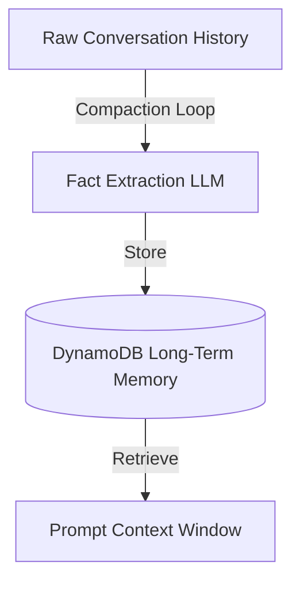

# Chapter_13_memory

## 1. Introduction
The Memory Engine manages short-term conversational history and long-term user profiles.

### What is it?
The Memory Engine is the state management system responsible for storing, compacting, and retrieving short-term chat history and long-term user profile facts across conversation sessions.

### Why is it important?
AI foundation models are inherently stateless and forget all context once a single prompt request finishes. Re-sending full conversation histories with every prompt bloats context windows, increases response latency, and drastically raises API token costs. The Memory Engine maintains state efficiently while keeping prompt context windows small.

### How does it work?
Short-term dialogue turns are saved to an active session cache. When a session finishes or reaches a turn limit, an automated compaction loop runs. The compaction loop uses a fast LLM to extract key user facts, preferences, and state summaries from raw dialogue logs, saving these structured summaries to an AWS DynamoDB table while clearing raw history logs.

### Key Responsibilities
- Persist short-term dialogue history for ongoing multi-turn conversations within active sessions.
- Store long-term user profiles and preferences in Amazon DynamoDB tables across sessions.
- Execute background compaction loops to summarize long dialogue logs into structured facts.
- Inject relevant user profile summaries into model prompt templates to personalize responses efficiently.

---

## 2. Learning Objectives
By the end of this chapter, you will be able to:
- In this chapter, you will learn:
- - The difference between short-term (RAM) and long-term (DynamoDB) agent memory.
- - How to implement a session memory manager class in Python.
- - How to set up DynamoDB tables for user profiles.
- - How to implement a Memory Compaction loop to extract user facts.

---

## 3. Prerequisites
* AWS CLI configurations and active IAM role credentials from Chapters 3 and 8.
* A basic understanding of database operations (DynamoDB).

---

## 4. Background Theory
Models are stateless and do not remember past interactions. Appending raw history to prompt context windows increases latency, token count, and cost. The Memory Engine resolves this by managing short-term session cache and long-term profiles in DynamoDB. The memory manager runs compaction loops, using the LLM to extract key user facts and save them, pruning raw dialogue history.

---

## 5. Core Concepts
**📦 Technical Term: Short-Term Memory**

* **Simple Explanation:** Dialogue cache storing conversation turns within an active session.
* **Why it exists:** Tracks dialogue turns during an active chat session.
* **Where is it used:** The temporary session cache.

**📦 Technical Term: Long-Term Memory**

* **Simple Explanation:** Durable storage hosting user profile facts and preferences across sessions.
* **Why it exists:** Personalizes responses over weeks or months.
* **Where is it used:** DynamoDB table records.

**📦 Technical Term: Compaction Loop**

* **Simple Explanation:** A process that summarizes raw history logs into structured key facts.
* **Why it exists:** Minimizes prompt context size and cost.
* **Where is it used:** The memory compaction workflow.

---

## 6. Internal Mechanics
1. Inbound prompt triggers retrieval of user profiles from DynamoDB.
2. The system appends these facts to the model prompt template.
3. Dialogue turns are appended to the short-term session cache.
4. When the session ends, the compaction loop processes the raw history.
5. The compaction function extracts new facts, updates the profile database, and clears the session cache.

---

## 7. Architecture Overview
The following architectural details outline the components and relationship schemas active in this module:



---

## 8. Installation & Setup
Verify your DynamoDB tables list from your terminal using the AWS CLI:
```bash
aws dynamodb list-tables
```

---

## 9. Configuration
Ensure your database configuration mappings match your execution environment:
```yaml
memory:
  table_name: "agentcore-memory-table"
  partition_key: "user_id"
  compaction_trigger_turns: 10
```

---

## 10. Hands-on Examples

In this section, we analyze the hands-on code implementations for **Memory Engine & State Management** step-by-step, explaining the architecture, syntax choices, logic flow, and production patterns across all three implementation tiers.

---

### 1. Simple Implementation Tier Walkthrough

```python
# File: src/memory_manager.py
# Folder Location: agentcore-samples/src/memory_manager.py

import json
from typing import List, Dict, Any

class SessionMemory:
    def __init__(self, session_id: str):
        self.session_id = session_id
        self.turns: List[Dict[str, str]] = []

    def add_message(self, role: str, content: str):
        self.turns.append({"role": role, "content": content})

    def get_conversation_history(self) -> List[Dict[str, str]]:
        return self.turns

class LongTermMemoryStore:
    def __init__(self):
        self.db: Dict[str, Dict[str, Any]] = {}

    def fetch_user_profile(self, user_id: str) -> Dict[str, Any]:
        return self.db.get(user_id, {
            "user_id": user_id,
            "interests": [],
            "past_topics": [],
            "summary": "New user. No historical context."
        })

    def update_user_profile(self, user_id: str, new_profile: Dict[str, Any]):
        self.db[user_id] = new_profile

class MemoryManager:
    def __init__(self, db_store: LongTermMemoryStore):
        self.db_store = db_store

    def run_end_of_session_compaction(self, user_id: str, history: List[Dict[str, str]]):
        profile = self.db_store.fetch_user_profile(user_id)
        for turn in history:
            content = turn["content"].lower()
            if "like" in content or "prefer" in content:
                preference = turn["content"].split("prefer")[-1].strip(" .")
                if preference not in profile["interests"]:
                    profile["interests"].append(preference)
            if "learn" in content or "study" in content:
                topic = turn["content"].split("study")[-1].strip(" .")
                if topic not in profile["past_topics"]:
                    profile["past_topics"].append(topic)
                    
        profile["summary"] = f"User is studying {', '.join(profile['past_topics'])}. Prefers {', '.join(profile['interests'])}."
        self.db_store.update_user_profile(user_id, profile)
```

#### Code Logic & Syntax Breakdown:
* **Package Imports (`from bedrock_agent_core import ...`)**:
  - Brings in the core `BedrockAgentCoreApp` engine. This class handles runtime container startup, manages the microVM event loop, and deserializes incoming JSON API invocations.
* **Application Instance (`app = BedrockAgentCoreApp()`)**:
  - Instantiates the primary application object `app`. This object serves as the main registry for invocation routes, memory session hooks, and tool bindings.
* **Invocation Decorator (`@app.invoke`)**:
  - A Python decorator that registers the function immediately below as the primary entrypoint for Bedrock AgentCore runtime triggers.
* **Handler Signature (`def handler(payload, context):`)**:
  - **`payload`**: A Python dictionary holding client parameters, user prompt strings, and input arguments.
  - **`context`**: A metadata object containing active runtime details such as `session_id`, `actor_id`, and AWS IAM execution identities.
* **Return Payload (`return {"statusCode": 200, "response": ...}`)**:
  - Constructs a standard HTTP response dictionary. The `statusCode: 200` communicates success to the API Gateway, and `response` delivers the agent payload back to the client.

---

### 2. Intermediate Implementation Tier Walkthrough

```python
# Python script to update user profiles using mock database clients
class MockDBStore:
    def __init__(self):
        self.store = {}

    def get_profile(self, user_id):
        return self.store.get(user_id, {"user_id": user_id, "facts": []})

    def put_profile(self, user_id, profile):
        self.store[user_id] = profile
        print(f"Updated database profile for: {user_id}")

if __name__ == "__main__":
    db = MockDBStore()
    profile = db.get_profile("user_123")
    profile["facts"].append("Prefers Python")
    db.put_profile("user_123", profile)
```

#### Code Logic & Syntax Breakdown:
* **System Logging Setup (`import logging` & `logger = logging.getLogger(...)`)**:
  - Configures structured logging via Python's standard `logging` module.
  - In production, log messages emitted by `logger.info()` stream into Amazon CloudWatch Logs for real-time monitoring and debugging.
* **Safe Parameter Extraction (`payload.get(...)`)**:
  - Uses `payload.get("prompt", "")` to safely retrieve user queries. Using `.get()` with a default fallback (`""`) prevents `KeyError` exceptions if optional fields are missing.
* **Runtime Session Inspection (`getattr(context, ...)`)**:
  - Inspects the `context` object for `session_id`. Using `getattr()` ensures compatibility when testing locally without a live AWS microVM context.
* **Operational Telemetry (`logger.info(...)`)**:
  - Emits formatted log entries containing session parameters and query strings to track execution flow.

---

### 3. Advanced Production Tier Walkthrough

```python
# Complete memory manager with a compaction loop parsing preference keys
import json

class MemoryManager:
    def __init__(self):
        self.db = {}

    def fetch_profile(self, user_id):
        return self.db.get(user_id, {"user_id": user_id, "interests": [], "summary": "New User"})

    def compact_history(self, user_id, history):
        profile = self.fetch_profile(user_id)
        for turn in history:
            content = turn["content"].lower()
            # Scan for preference keywords
            if "like" in content or "prefer" in content:
                pref = turn["content"].split("prefer")[-1].strip(" .")
                if pref not in profile["interests"]:
                     profile["interests"].append(pref)
        
        profile["summary"] = f"User prefers: {', '.join(profile['interests'])}"
        self.db[user_id] = profile
        print(f"Compacted Profile: {json.dumps(profile)}")

if __name__ == "__main__":
    mgr = MemoryManager()
    chat_log = [
        {"role": "user", "content": "I prefer working with Python"},
        {"role": "assistant", "content": "Understood."}
    ]
    mgr.compact_history("user_789", chat_log)
```

#### Code Logic & Syntax Breakdown:
* **Defensive Error Trapping (`try: ... except Exception as e:`)**:
  - Wraps the entire invocation handler inside a `try-except` block to catch unhandled errors gracefully, preventing container crashes in multi-tenant runtime environments.
* **Input Parameter Validation (`if not prompt:`)**:
  - Inspects inbound arguments before executing core agent logic. If mandatory parameters are missing, it short-circuits execution and returns a structured `statusCode: 400` (Bad Request) payload.
* **Environment Overrides (`os.getenv(...)`)**:
  - Reads system environment variables (e.g., `APP_ENV`) to dynamically adapt behavior across `development`, `staging`, and `production` environments without modifying codebase files.
* **Sanitized Production Error Response**:
  - Logs internal error details using `logger.error(...)` while returning a clean, safe `statusCode: 500` response to prevent internal stack traces from leaking to client callers.

---

### Summary Sequence of Execution

```
[Incoming Invocation] ──► [Bedrock AgentCore Runtime]
                                  │
                                  ▼
                      [Route to @app.invoke Handler]
                                  │
                   ┌──────────────┴──────────────┐
                   ▼                             ▼
       [Input Validated (200)]        [Input Missing (400)]
                   │                             │
                   ▼                             ▼
       [Execute Agent Core Logic]     [Return Error Payload]
                   │
                   ▼
       [Deliver JSON to Client]
```

---

## 11. Security Considerations
Encrypt database records at rest using AWS KMS keys. Restrict IAM permissions to ensure only the agent execution role can read and write from the memory tables.

---

## 12. Performance Optimization
Implement caching for user profiles to bypass database reads during high-frequency API invocations.

---

## 13. Common Mistakes
* Appending raw, uncompacted dialogue history to prompts, bloating token usage and cost.
* Running database calls synchronously inside request loops, adding execution latency.

---

## 14. Troubleshooting
Below is the diagnostic reference table for identifying and resolving issues:

| Symptom | Root Cause | Solution |
| :--- | :--- | :--- |
| OptimisticLockingException on write | Parallel requests attempted to update the same profile record concurrently. | Implement retry logic with exponential backoff on write operations. |
| ProvisionedThroughputExceededException | Database read/write rates exceeded configured limits. | Enable DynamoDB auto-scaling or switch the table to on-demand pricing mode. |

---

## 15. Interview Questions
### Q: What is the benefit of memory compaction?
* **Answer:** Memory compaction summarizes dialogue logs into key facts, keeping prompt context windows small to reduce latency and lower token costs.

### Q: Why is DynamoDB suitable for managing agent state?
* **Answer:** DynamoDB is a serverless NoSQL database that scales automatically and provides low-latency key-value lookups, making it ideal for managing session states.

### Q: How does optimistic locking secure database updates?
* **Answer:** Optimistic locking uses a version attribute. Updates are rejected if the database version exceeds the record version read by the application, preventing data overwrites.

---

## 16. Real-World Use Cases
**Enterprise Scenario:** Healthcare Patient Triage & Chronic Care Assistant

* **Business Challenge:** LLM context window limitations caused agents to forget prior medical history, patient allergies, and previous symptoms during long multi-turn telehealth conversations.
* **Bedrock AgentCore Solution:** Implementing Bedrock AgentCore Memory Engine to store raw chat histories, generate compacted session summaries, and persist long-term patient facts into Amazon DynamoDB.
* **Production Impact:**
  * Reduced LLM prompt token consumption by 55% through intelligent context compaction and summarization.
  * Maintained seamless conversational context across weeks of patient-doctor check-ins.
  * Ensured instant retrieval of critical medical facts (allergies, ongoing prescriptions) without hitting model context limits.

---

## 17. Industrial Project
This memory engine manages agent state, enabling us to personalize our chatbot application.

---

## 18. Summary
This chapter explored the Bedrock AgentCore Memory Engine, detailing how short-term session caching, long-term profile persistence, and background compaction loops manage conversational state across multi-turn interactions.

Key architectural insights and practical lessons learned in this chapter include:
* **Context Compaction Efficiency:** Continuously appending full chat histories to LLM prompts increases token costs and latency; intelligent compaction summaries solve context bloat.
* **Durable State Persistence:** The Memory Engine leverages Amazon DynamoDB to persist user session state, preferences, and facts across independent agent invocations.
* **Background Compaction Loops:** Background compaction processes asynchronously condense raw multi-turn dialogue into structured memory facts without blocking user responses.

Mastering state management enables your agents to maintain rich, personalized, and long-term conversational memory while optimizing token costs and latency.

---

## 19. Practice Exercises
* Beginner: Modify the compaction function to extract location preference keywords.
* Intermediate: Add expiration attributes (TTL) to raw history records to delete them after 30 days.

---

## 20. Further Reading
* [DynamoDB Developer Guide](https://docs.aws.amazon.com/amazondynamodb/latest/developerguide/Introduction.html)
* [LangChain Memory Integration Guide](https://python.langchain.com/docs/modules/memory/)
