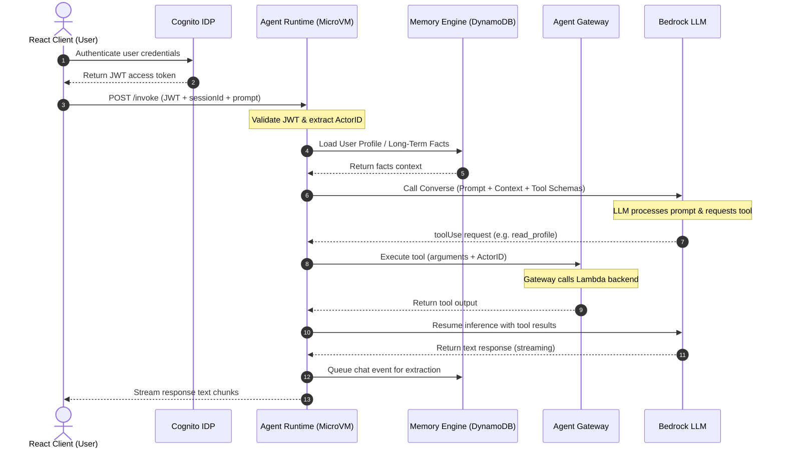

# Chapter_17_complete_end_to_end_flow

## 🎯 Learning Objectives
In this chapter, you will learn how to:
- Trace the lifecycle of an invocation request from the client to the database.
- Read and interpret the end-to-end architecture sequence diagram.
- Verify component integrations.
- Trace execution errors across systems.

### Importance of This Chapter
Understanding the end-to-end lifecycle helps developers debug issues, optimize performance, and verify that the security, memory, and routing components are configured correctly.

---

## 📦 Technical Terms Explained

> **📦 Technical Term Explained**
>
> **Term:** Orchestration
>
> **Simple Explanation:** Orchestration is the process of coordinating and managing the execution flow, tool calls, and state transitions of an AI agent.
>
> **Why do we need it?** It manages the logic loop that determines when to call models, when to use tools, and when to return a final response to the user.
>
> **Where is it used?** Inside your agent application code (using frameworks like Strands or LangGraph).

---

> **📦 Technical Term Explained**
>
> **Term:** Inference
>
> **Simple Explanation:** Inference is the process of running data through a trained model to generate predictions, classifications, or text completions.
>
> **Why do we need it?** It is the execution step where the AI model generates text or decisions based on input prompts.
>
> **Where is it used?** When calling Bedrock API models to process prompts.

---

## 📊 End-to-End Sequence Diagram

The diagram below traces the path of an invocation request through the AgentCore architecture:

---

## 🔍 Detailed Sequence Walkthrough

The execution sequence flows through these steps:

1. **Authentication:** The client application authenticates the user against Amazon Cognito (or Okta), receiving an access token (JWT).
2. **Token Inbound:** The client sends a request to the AgentCore Runtime `/invoke` endpoint, containing the JWT access token, `sessionId`, and prompt.
3. **Session Routing:** The runtime validates the token signature against the Cognito user pool. If valid, it maps the request to the session's isolated Firecracker microVM.
4. **Memory Initialization:** The runtime queries AgentCore Memory to retrieve the user's historical facts and profile.
5. **Model Invocation:** The runtime compiles the user's prompt, memory context, and tool schemas, sending the payload to the Bedrock foundation model.
6. **Tool Selection:** The model evaluates the prompt and returns a `toolUse` block, pausing text generation.
7. **Gateway Routing:** The runtime intercepts the tool request and forwards it to the Gateway.
8. **Downstream Execution:** The Gateway executes the tool (e.g. invokes a Lambda function or database query) and returns the output to the runtime.
9. **Resuming Inference:** The runtime passes the tool results back to the model to resume text generation.
10. **Response Streaming:** The model returns the final response, which the runtime streams back to the client application.
11. **Memory Update:** The runtime queues the conversation history with the Memory Engine to update the user's long-term profile.

---

## 📊 Live Integration Screen

Let's look at the web interface of an integrated application:

*Caption: The React interface interacting with the Bedrock AgentCore Runtime.*
- **What to Observe:** The chat window displaying streaming responses alongside runtime execution logs.
- **Why it Matters:** Verifies that the client application, compute runtime, and downstream tools are integrated and functioning.

---

## 🛠️ Common Mistakes & Troubleshooting
- **Mistake:** Broken JWT signatures causing requests to fail during token validation.
  - **Resolution:** Double-check that your Gateway configuration trusts the Cognito identity provider.
- **Mistake:** Downstream tool executions failing due to missing IAM permissions.
  - **Resolution:** Verify your agent role's policy has the required permissions to invoke the downstream service or Lambda function.

---

## 📝 Practical Exercise
Trace an execution error through the sequence diagram. Determine which component failed if your agent returns a `403 Forbidden` error after a tool invocation.

---

## 🔄 Chapter Recap
- We mapped the end-to-end request lifecycle using a sequence diagram.
- We analyzed the interaction path from user authentication to response streaming.
- We verified the workflow using a live integration screenshot.
- Your Bedrock AgentCore workbook is complete and ready for use!
