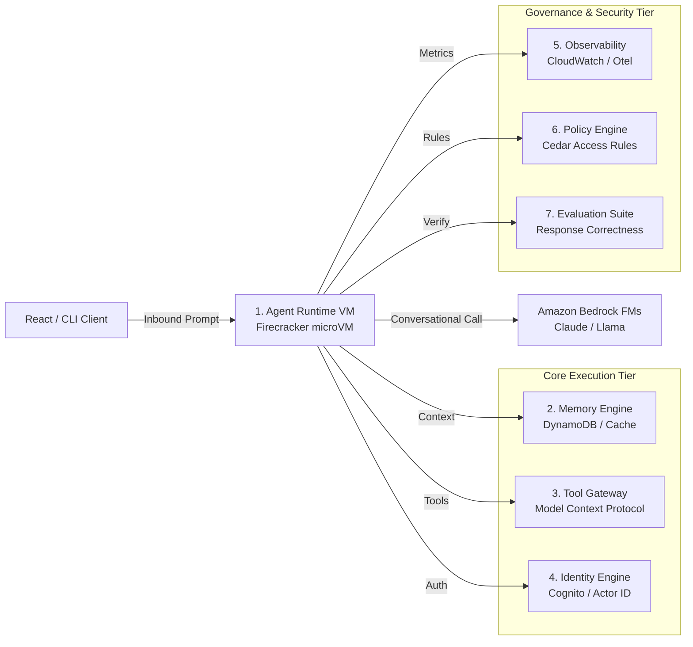

# 01_Chapter_introduction_to_bedrock_agentcore

## 1. Introduction
Amazon Bedrock AgentCore is a containerized, code-first developer framework and runtime service designed to package, run, and scale AI-driven agentic applications on AWS.

> **Analogy:** Foundation Models (Cargo Ships) transport text across oceans. Agent Reasoning Logic (Port Crane Operators) coordinates picks, transfers, and loads. Compute Runtime (Isolated Shipping Docks) hosts ships in secure Firecracker microVMs. Tool Gateway (Customs Checkpoint) verifies packages going to external databases.

---

## 2. Learning Objectives
By the end of this chapter, you will be able to:
- In this chapter, you will learn:
- - What Amazon Bedrock and Bedrock AgentCore are.
- - Why AWS built AgentCore and how it solves the prototype-to-production gap.
- - The differences between console-first Bedrock Agents and code-first Bedrock AgentCore.
- - The high-level architecture of AgentCore and its 7 core infrastructure components.

---

## 3. Prerequisites
* A basic understanding of cloud computing (SaaS, IaaS, FaaS) and API communications.
* Familiarity with Python programming and basic JSON serialization layouts.
* Access to an active AWS Account (Administrator or PowerUser access recommended).

---

## 4. Background Theory
AI application architecture is shifting from simple, stateless prompt-response models to autonomous agents. Standard API endpoints fail to support production-grade agents due to execution state leakage, memory drift, and compute limitations (e.g., standard serverless functions time out after 15 minutes). AWS designed Bedrock AgentCore to bridge the prototype-to-production gap. AgentCore separates reasoning logic from underlying execution infrastructure, offering dedicated compute isolation via virtual machines, standardized tool gateways via Model Context Protocol (MCP), and persistent memory schemas.

---

## 5. Core Concepts
**📦 Technical Term: Amazon Bedrock**

* **Simple Explanation:** A managed AWS service that exposes foundational LLMs via a secure, consolidated API interface.
* **Why it exists:** Avoids the overhead of managing expensive GPU instances locally.
* **Where is it used:** Enterprise LLM applications, retrieval-augmented generation systems.

**📦 Technical Term: AgentCore**

* **Simple Explanation:** A code-first runtime infrastructure designed specifically to run secure, stateful AI agents.
* **Why it exists:** Enforces resource limits, data isolation, and seamless IAM integration.
* **Where is it used:** Production hosting of conversational and task-oriented agents.

**📦 Technical Term: Foundation Model**

* **Simple Explanation:** Large-scale neural networks trained on diverse web-scale data.
* **Why it exists:** Provides general-purpose reasoning, text generation, and planning capabilities.
* **Where is it used:** Serves as the central cognitive engine of the agent.

---

## 6. Internal Mechanics
1. Client submits a query to the AgentCore API Gateway.
2. The gateway validates Cognito JWT signatures and extracts authorization claims.
3. The runtime schedules a dedicated AWS Firecracker microVM instance for the session.
4. The agent container boots, mounts configuration parameters, and triggers the orchestrator entrypoint.
5. The agent executes reasoning loops, calling Amazon Bedrock FMs via HTTPS/SigV4.
6. Response payloads stream back to the gateway and are delivered to the client UI.

---

## 7. Architecture Overview
The following architectural details outline the components and relationship schemas active in this module:



---

## 8. Installation & Setup
To check local environment readiness for Bedrock AgentCore, verify Python and Git versions in your shell:
```bash
python --version
git --version
```

---

## 9. Configuration
Deployment properties are managed via `bedrock_agent_core.yaml`. A standard minimal layout specifies model mappings, runtime memory allocation, and the execution IAM role:
```yaml
version: "1.0"
agent:
  name: "bedrock-intro-agent"
  model: "anthropic.claude-3-5-sonnet-v2"
  execution_role_arn: "arn:aws:iam::123456789012:role/AgentCoreExecutionRole"
```

---

## 10. Hands-on Examples

In this section, we analyze the hands-on code implementations for **Introduction to Bedrock AgentCore** step-by-step, explaining the architecture, syntax choices, logic flow, and production patterns across all three implementation tiers.

---

### 1. Simple Implementation Tier Walkthrough

```python
# Standard Hello World entrypoint for AgentCore
from bedrock_agent_core import BedrockAgentCoreApp

app = BedrockAgentCoreApp()

@app.invoke
def handler(payload, context):
    return {
        "statusCode": 200,
        "response": "Hello from Bedrock AgentCore!"
    }
```

#### Code Logic & Syntax Breakdown:
* **Package Imports (`from bedrock_agent_core import ...`)**:
  - Brings in the core `BedrockAgentCoreApp` engine. This class handles runtime container startup, manages the microVM event loop, and deserializes incoming JSON API invocations.
* **Application Instance (`app = BedrockAgentCoreApp()`)**:
  - Instantiates the primary application object `app`. This object serves as the main registry for invocation routes, memory session hooks, and tool bindings.
* **Invocation Decorator (`@app.invoke`)**:
  - A Python decorator that registers the function immediately below as the primary entrypoint for Bedrock AgentCore runtime triggers.
* **Handler Signature (`def handler(payload, context):`)**:
  - **`payload`**: A Python dictionary holding client parameters, user prompt strings, and input arguments.
  - **`context`**: A metadata object containing active runtime details such as `session_id`, `actor_id`, and AWS IAM execution identities.
* **Return Payload (`return {"statusCode": 200, "response": ...}`)**:
  - Constructs a standard HTTP response dictionary. The `statusCode: 200` communicates success to the API Gateway, and `response` delivers the agent payload back to the client.

---

### 2. Intermediate Implementation Tier Walkthrough

```python
# Entrypoint reading context and prompt values
from bedrock_agent_core import BedrockAgentCoreApp
import logging

logging.basicConfig(level=logging.INFO)
logger = logging.getLogger("IntroAgent")
app = BedrockAgentCoreApp()

@app.invoke
def handler(payload, context):
    prompt = payload.get("prompt", "")
    session_id = getattr(context, "session_id", "local-session")
    logger.info(f"Processing session {session_id} with prompt: {prompt}")
    return {
        "statusCode": 200,
        "response": f"Acknowledged prompt: '{prompt}' inside session {session_id}"
    }
```

#### Code Logic & Syntax Breakdown:
* **System Logging Setup (`import logging` & `logger = logging.getLogger(...)`)**:
  - Configures structured logging via Python's standard `logging` module.
  - In production, log messages emitted by `logger.info()` stream into Amazon CloudWatch Logs for real-time monitoring and debugging.
* **Safe Parameter Extraction (`payload.get(...)`)**:
  - Uses `payload.get("prompt", "")` to safely retrieve user queries. Using `.get()` with a default fallback (`""`) prevents `KeyError` exceptions if optional fields are missing.
* **Runtime Session Inspection (`getattr(context, ...)`)**:
  - Inspects the `context` object for `session_id`. Using `getattr()` ensures compatibility when testing locally without a live AWS microVM context.
* **Operational Telemetry (`logger.info(...)`)**:
  - Emits formatted log entries containing session parameters and query strings to track execution flow.

---

### 3. Advanced Production Tier Walkthrough

```python
# Structured production entrypoint with exception handling and configuration overrides
from bedrock_agent_core import BedrockAgentCoreApp
import os
import logging

logger = logging.getLogger("ProductionIntroAgent")
app = BedrockAgentCoreApp()

@app.invoke
def handler(payload, context):
    try:
        prompt = payload.get("prompt")
        if not prompt:
            return {"statusCode": 400, "response": "Error: Missing required prompt parameter."}
        
        environment = os.getenv("APP_ENV", "development")
        session_id = getattr(context, "session_id", "local-session")
        logger.info(f"[ENV={environment}] Invoking production agent for session {session_id}")
        
        return {
            "statusCode": 200,
            "response": f"Processed input in {environment} environment for session {session_id}."
        }
    except Exception as e:
        logger.error(f"Unhandled exception in handler: {str(e)}")
        return {"statusCode": 500, "response": "Internal Server Error"}
```

#### Code Logic & Syntax Breakdown:
* **Defensive Error Trapping (`try: ... except Exception as e:`)**:
  - Wraps the entire invocation handler inside a `try-except` block to catch unhandled errors gracefully, preventing container crashes in multi-tenant runtime environments.
* **Input Parameter Validation (`if not prompt:`)**:
  - Inspects inbound arguments before executing core agent logic. If mandatory parameters are missing, it short-circuits execution and returns a structured `statusCode: 400` (Bad Request) payload.
* **Environment Overrides (`os.getenv(...)`)**:
  - Reads system environment variables (e.g., `APP_ENV`) to dynamically adapt behavior across `development`, `staging`, and `production` environments without modifying codebase files.
* **Sanitized Production Error Response**:
  - Logs internal error details using `logger.error(...)` while returning a clean, safe `statusCode: 500` response to prevent internal stack traces from leaking to client callers.

---

### Summary Sequence of Execution

```
[Incoming Invocation] ──► [Bedrock AgentCore Runtime]
                                  │
                                  ▼
                      [Route to @app.invoke Handler]
                                  │
                   ┌──────────────┴──────────────┐
                   ▼                             ▼
       [Input Validated (200)]        [Input Missing (400)]
                   │                             │
                   ▼                             ▼
       [Execute Agent Core Logic]     [Return Error Payload]
                   │
                   ▼
       [Deliver JSON to Client]
```

---

## 11. Production Best Practices
* Keep container images thin to minimize boot time and cold start latency.
* Avoid writing state data to the local filesystem since microVM storage is ephemeral.
* Always implement structured JSON logging to facilitate log aggregation in CloudWatch.

---

## 12. Security Considerations
Enforce strict IAM policies using least-privilege schemas. Ensure the agent execution role limits permission boundaries to designated Bedrock model resources and specific DynamoDB tables. Route all microVM communications through private VPC subnets using AWS PrivateLink endpoints.

---

## 13. Performance Optimization
Optimize container image layers by using multi-stage Dockerfiles. Cache foundation model parameters and maintain warm session microVM pools to bypass initialization cycles during high-traffic intervals.

---

## 14. Cost Optimization
Monitor token usage patterns closely. Claude 3.5 Sonnet charges separate fees for input tokens and output tokens. Implement token budgeting metrics in your tracing span logs to trace costs per user session.

---

## 15. Common Mistakes
* Hardcoding AWS Access Keys inside configuration files (always use IAM Execution Roles instead).
* Assuming microVM local files persist across different user sessions (use Amazon S3 for durable files).

---

## 16. Troubleshooting
Below is the diagnostic reference table for identifying and resolving issues:

| Symptom | Root Cause | Solution |
| :--- | :--- | :--- |
| Agent returns 403 Access Denied | Missing model access activation in the Amazon Bedrock console. | Navigate to the Bedrock Console under 'Model access' and request permission for Claude models. |
| Container takes >30 seconds to boot | Over-sized container image containing unnecessary development packages. | Optimize Dockerfile using alpine or slim base images. |

### Additional Reference Tables


| Feature / Dimension | Bedrock Agents (Console-First) | Bedrock AgentCore (Code-First) |
| :--- | :--- | :--- |
| **Development Workflow** | Configured via forms in the AWS Management Console. | Written as standard Python files in a code repository, configured via YAML. |
| **Orchestration Frameworks** | Restricted to the built-in AWS console orchestrator. | **Framework-agnostic:** Compatible with Strands, LangChain, CrewAI, LangGraph, or custom loops. |
| **Testing Capability** | Tested using the built-in console playground. | Tested locally using container runtimes (Docker/Podman) and standard unit testing frameworks (pytest). |
| **Deployment Lifecycle** | Deployment is managed directly inside the AWS Console. | Managed using standard CI/CD pipelines, ECR image registries, and CloudFormation/CDK. |


---

## 17. Interview Questions
### Q: What is the primary architectural difference between Bedrock Agents and Bedrock AgentCore?
* **Answer:** Bedrock Agents is a console-first service where agent orchestration is handled by AWS. Bedrock AgentCore is code-first and containerized, giving developers full control over Python frameworks (like LangChain or CrewAI) while AWS handles runtime hosting, security isolation, and scaling.

### Q: Why does AgentCore rely on AWS Firecracker microVMs?
* **Answer:** Firecracker microVMs combine the security and isolation of traditional virtual machines with the speed and resource efficiency of containers, preventing multi-tenant data leakage and resource exhaustion.

### Q: How does AgentCore manage session state across multiple requests?
* **Answer:** AgentCore routes requests with the same session identifier to the same warm microVM if active, and utilizes the Memory Engine (backed by DynamoDB) to persist and retrieve long-term session logs.

---

## 18. Real-World Use Cases
Enterprise customer support portals requiring complex multi-step reasoning, document summarization, and secure customer database query lookups.

---

## 19. Industrial Project
This chapter establishes the core runtime foundation. The concepts developed here will serve as the host environment for our final Enterprise RAG Assistant and Multi-Agent Supervisor system.

---

## 20. Summary
This chapter introduced the Bedrock AgentCore framework, comparing code-first architectures with legacy console models, and outlined the 7 core architectural pillars.

---

## 21. Key Takeaways
* Bedrock AgentCore provides a code-first, framework-agnostic runtime for autonomous agents.
* Security is enforced via AWS Firecracker microVMs providing isolated user session environments.
* The framework is managed through standard git, Docker, and AWS CLI developer tools.

---

## 22. Practice Exercises
* Beginner: Install Python and verify your shell returns a valid environment version.
* Intermediate: Draft a mock configuration file specifying Claude 3 Haiku as the target foundation model.

---

## 23. Further Reading
* [Amazon Bedrock Developer Guide](https://docs.aws.amazon.com/bedrock/latest/userguide/what-is-bedrock.html)
* [AWS Firecracker Virtualization Technology](https://firecracker-microvm.github.io/)
