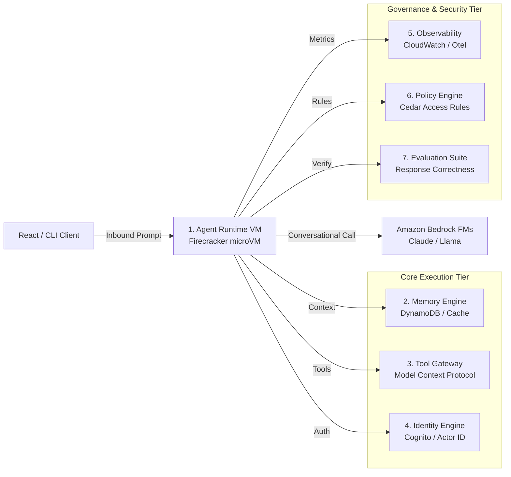

# 01_Chapter_introduction_to_bedrock_agentcore

## 1. Introduction
Amazon Bedrock AgentCore is a containerized, code-first developer framework and runtime service designed to package, run, and scale AI-driven agentic applications on AWS.

> **Analogy:** Foundation Models (Cargo Ships) transport text across oceans. Agent Reasoning Logic (Port Crane Operators) coordinates picks, transfers, and loads. Compute Runtime (Isolated Shipping Docks) hosts ships in secure Firecracker microVMs. Tool Gateway (Customs Checkpoint) verifies packages going to external databases.

---

## 2. Learning Objectives
By the end of this chapter, you will be able to:
- In this chapter, you will learn:
- - What Amazon Bedrock and Bedrock AgentCore are.
- - Why AWS built AgentCore and how it solves the prototype-to-production gap.
- - The differences between console-first Bedrock Agents and code-first Bedrock AgentCore.
- - The high-level architecture of AgentCore and its 7 core infrastructure components.

---

## 3. Prerequisites
* A basic understanding of cloud computing (SaaS, IaaS, FaaS) and API communications.
* Familiarity with Python programming and basic JSON serialization layouts.
* Access to an active AWS Account (Administrator or PowerUser access recommended).

---

## 4. Background Theory
AI application architecture is shifting from simple, stateless prompt-response models to autonomous agents. Standard API endpoints fail to support production-grade agents due to execution state leakage, memory drift, and compute limitations (e.g., standard serverless functions time out after 15 minutes). AWS designed Bedrock AgentCore to bridge the prototype-to-production gap. AgentCore separates reasoning logic from underlying execution infrastructure, offering dedicated compute isolation via virtual machines, standardized tool gateways via Model Context Protocol (MCP), and persistent memory schemas.

---

## 5. Core Concepts
**📦 Technical Term: Amazon Bedrock**

* **Simple Explanation:** A managed AWS service that exposes foundational LLMs via a secure, consolidated API interface.
* **Why it exists:** Avoids the overhead of managing expensive GPU instances locally.
* **Where is it used:** Enterprise LLM applications, retrieval-augmented generation systems.

**📦 Technical Term: AgentCore**

* **Simple Explanation:** A code-first runtime infrastructure designed specifically to run secure, stateful AI agents.
* **Why it exists:** Enforces resource limits, data isolation, and seamless IAM integration.
* **Where is it used:** Production hosting of conversational and task-oriented agents.

**📦 Technical Term: Foundation Model**

* **Simple Explanation:** Large-scale neural networks trained on diverse web-scale data.
* **Why it exists:** Provides general-purpose reasoning, text generation, and planning capabilities.
* **Where is it used:** Serves as the central cognitive engine of the agent.

---

## 6. Internal Mechanics
1. Client submits a query to the AgentCore API Gateway.
2. The gateway validates Cognito JWT signatures and extracts authorization claims.
3. The runtime schedules a dedicated AWS Firecracker microVM instance for the session.
4. The agent container boots, mounts configuration parameters, and triggers the orchestrator entrypoint.
5. The agent executes reasoning loops, calling Amazon Bedrock FMs via HTTPS/SigV4.
6. Response payloads stream back to the gateway and are delivered to the client UI.

---

## 7. Architecture Overview
The following architectural details outline the components and relationship schemas active in this module:



---

## 8. Installation & Setup
To check local environment readiness for Bedrock AgentCore, verify Python and Git versions in your shell:
```bash
python --version
git --version
```

---

## 9. Configuration
Deployment properties are managed via `bedrock_agent_core.yaml`. A standard minimal layout specifies model mappings, runtime memory allocation, and the execution IAM role:
```yaml
version: "1.0"
agent:
  name: "bedrock-intro-agent"
  model: "anthropic.claude-3-5-sonnet-v2"
  execution_role_arn: "arn:aws:iam::123456789012:role/AgentCoreExecutionRole"
```

---

## 10. Hands-on Examples

### Simple Example

```python
# Standard Hello World entrypoint for AgentCore
from bedrock_agent_core import BedrockAgentCoreApp

app = BedrockAgentCoreApp()

@app.invoke
def handler(payload, context):
    return {
        "statusCode": 200,
        "response": "Hello from Bedrock AgentCore!"
    }
```

#### Code Walkthrough

Line 1
```python
# Standard Hello World entrypoint for AgentCore
```
**Explanation:**
- **What this line does:** This is a documentation comment line starting with `#`. Python ignores comments during execution.
- **Why it is required:** It explains the purpose of the script to human developers and maintains clean code documentation.
- **What happens if removed:** The code will run identically, but human readers won't have immediate context on what this code block accomplishes.
- **Analogy:** Think of a comment like a sticky note attached to a blueprint—it helps the builders understand the design without altering the physical building.
- **Beginner Concept:** In Python, any text after `#` is ignored by the Python interpreter.

Line 2
```python
from bedrock_agent_core import BedrockAgentCoreApp
```
**Explanation:**
- **What this line does:** This line imports the `BedrockAgentCoreApp` class from the `bedrock_agent_core` package.
- **Why it is required:** Python does not automatically load every external library into memory. We must explicitly import `BedrockAgentCoreApp` so our program can use its pre-built capabilities.
- **What keywords mean:** `from` specifies the source library module (`bedrock_agent_core`), and `import` selects the specific tool (`BedrockAgentCoreApp`).
- **What happens if removed:** Python will throw a `NameError: name 'BedrockAgentCoreApp' is not defined` as soon as we try to instantiate or use it.
- **Analogy:** Think of importing like opening your toolbox and picking out a specialized torque wrench (`BedrockAgentCoreApp`) from the storage tray (`bedrock_agent_core`).
- **Connection:** This makes the `BedrockAgentCoreApp` blueprint available for the next lines of code.

Line 3
```python

```
**Explanation:**
- **What this line does:** This is a blank vertical spacing line.
- **Why it is required:** It visually separates logical sections of code (such as imports, setup, and function definitions) to improve readability.
- **What happens if removed:** Python will execute the code fine, but lines of code will bunch together, making it harder for engineers to read.
- **Analogy:** Like paragraphs in a textbook, spacing gives your eyes a natural pause between concepts.

Line 4
```python
app = BedrockAgentCoreApp()
```
**Explanation:**
- **What this line does:** Creates a new instance of `BedrockAgentCoreApp` and assigns it to the variable `app`.
- **Why it is required:** `app` serves as the main application object that manages agent lifecycle events, routes triggers, and holds configuration state.
- **What variable stores:** `app` stores the active `BedrockAgentCoreApp` object.
- **What happens if removed:** We would have no central application object to register our execution handlers or deploy to AWS.
- **Analogy:** Think of this as powering on the central control unit of an autonomous robot before programming its movements.

Line 5
```python

```
**Explanation:**
- **What this line does:** This is a blank vertical spacing line.
- **Why it is required:** It visually separates logical sections of code (such as imports, setup, and function definitions) to improve readability.
- **What happens if removed:** Python will execute the code fine, but lines of code will bunch together, making it harder for engineers to read.
- **Analogy:** Like paragraphs in a textbook, spacing gives your eyes a natural pause between concepts.

Line 6
```python
@app.invoke
```
**Explanation:**
- **What this line does:** This is a Python **decorator** named `@app.invoke`.
- **What is a decorator:** A decorator is a special modifier starting with `@` that wraps the function defined immediately below it, giving it extra powers.
- **Why decorators are used:** They register functions with frameworks without altering the core function code.
- **What `@app.invoke` registers:** It registers the function directly below it as the official entrypoint handler for Bedrock AgentCore invocation events.
- **What happens when AgentCore receives a request:** AgentCore automatically detects the `@app.invoke` tag and routes the incoming payload directly into the registered function.
- **Analogy:** Like putting a "Push Button Here to Start Machine" sticker on an ignition switch.

Line 7
```python
def handler(payload, context):
```
**Explanation:**
- **What this line does:** Defines a new function named `handler` that accepts parameters `(payload, context)`.
- **Keyword explanation:** `def` is short for "define". It tells Python that a reusable block of code begins here.
- **Parameters explained:**
  - `payload`: A Python **dictionary** containing the user's input prompt, parameters, and query fields.
  - `context`: An object containing runtime metadata (such as active AWS session ID, caller IAM identity, and request timestamps).
- **Return value:** Returns a structured dictionary containing HTTP status codes and agent response text.
- **Why the function exists:** It contains the core decision-making logic executed whenever the agent is invoked.
- **Analogy:** Think of `handler` like a recipe—`payload` and `context` are the ingredients passed in, and the returned dictionary is the finished meal.

Line 8
```python
    return {
```
**Explanation:**
- **What this line does:** Initiates a `return` statement to exit the function and pass data back to the caller.
- **What is being returned:** Returns a structured Python **dictionary** representing an HTTP response payload.
- **Who receives it:** The Bedrock AgentCore runtime receives this dictionary, serializes it into JSON, and sends it back to the client application.
- **Why response must be returned:** Without a return statement, the function would return `None`, causing AgentCore to report a blank execution payload to the user.
- **Analogy:** Handing a completed report back to the manager who requested it.

Line 9
```python
        "statusCode": 200,
```
**Explanation:**
- **What this line does:** Defines the `"statusCode"` key inside the returned response dictionary.
- **Key details:** `"statusCode": 200` (or 400/500). Standard HTTP status codes communicate execution status:
  - `200`: Success.
  - `400`: Bad Request (client input validation error).
  - `500`: Internal Server Error.
- **Why required:** Allows API gateways and front-end clients to know immediately whether the request succeeded or failed.

Line 10
```python
        "response": "Hello from Bedrock AgentCore!"
```
**Explanation:**
- **What this line does:** Defines the `"response"` key inside the returned dictionary.
- **Key details:** Holds the string output message, generated answer, or error summary returned by the agent.
- **JSON conversion:** AgentCore converts this dictionary into JSON format (`{"statusCode": 200, "response": "..."}`) before transmitting over HTTPS.

Line 11
```python
    }
```
**Explanation:**
- **What this line does:** Closes the dictionary or code block structure (`}`).
- **Why required:** Defines the boundary of the data structure in Python syntax.

#### Complete Flow of Execution

1. **Import Libraries**: Python loads the required `BedrockAgentCoreApp` class into memory.
2. **Initialize Application**: An instance of `BedrockAgentCoreApp` is instantiated and assigned to `app`.
3. **Register Event Handler**: The `@app.invoke` decorator registers the `handler` function as the primary event entrypoint.
4. **Receive Request**: The AgentCore runtime listens for incoming requests and receives `payload` and `context` objects.
5. **Execute Handler Logic**: The `handler` function is triggered with the incoming input parameters.
6. **Return Response Payload**: A structured response dictionary containing `"statusCode": 200` and message data is returned.
7. **Send Response to Caller**: AgentCore serializes the dictionary into JSON and delivers it back to the client application.

#### Visual Execution Flow

```
Program Starts
      │
      ▼
Import BedrockAgentCoreApp
      │
      ▼
Create App Instance (app)
      │
      ▼
Register Handler (@app.invoke)
      │
      ▼
Receive Request (payload, context)
      │
      ▼
Execute handler() Function
      │
      ▼
Return Response Dictionary ({statusCode: 200, ...})
      │
      ▼
Deliver Response Back to Client
```

### Intermediate Example

```python
# Entrypoint reading context and prompt values
from bedrock_agent_core import BedrockAgentCoreApp
import logging

logging.basicConfig(level=logging.INFO)
logger = logging.getLogger("IntroAgent")
app = BedrockAgentCoreApp()

@app.invoke
def handler(payload, context):
    prompt = payload.get("prompt", "")
    session_id = getattr(context, "session_id", "local-session")
    logger.info(f"Processing session {session_id} with prompt: {prompt}")
    return {
        "statusCode": 200,
        "response": f"Acknowledged prompt: '{prompt}' inside session {session_id}"
    }
```

#### Code Walkthrough

Line 1
```python
# Entrypoint reading context and prompt values
```
**Explanation:**
- **What this line does:** This is a documentation comment line starting with `#`. Python ignores comments during execution.
- **Why it is required:** It explains the purpose of the script to human developers and maintains clean code documentation.
- **What happens if removed:** The code will run identically, but human readers won't have immediate context on what this code block accomplishes.
- **Analogy:** Think of a comment like a sticky note attached to a blueprint—it helps the builders understand the design without altering the physical building.
- **Beginner Concept:** In Python, any text after `#` is ignored by the Python interpreter.

Line 2
```python
from bedrock_agent_core import BedrockAgentCoreApp
```
**Explanation:**
- **What this line does:** This line imports the `BedrockAgentCoreApp` class from the `bedrock_agent_core` package.
- **Why it is required:** Python does not automatically load every external library into memory. We must explicitly import `BedrockAgentCoreApp` so our program can use its pre-built capabilities.
- **What keywords mean:** `from` specifies the source library module (`bedrock_agent_core`), and `import` selects the specific tool (`BedrockAgentCoreApp`).
- **What happens if removed:** Python will throw a `NameError: name 'BedrockAgentCoreApp' is not defined` as soon as we try to instantiate or use it.
- **Analogy:** Think of importing like opening your toolbox and picking out a specialized torque wrench (`BedrockAgentCoreApp`) from the storage tray (`bedrock_agent_core`).
- **Connection:** This makes the `BedrockAgentCoreApp` blueprint available for the next lines of code.

Line 3
```python
import logging
```
**Explanation:**
- **What this line does:** Imports Python's built-in `logging` module into the current program workspace.
- **Why it is required:** Provides access to essential system utilities (such as logging, environment variables, or HTTP handlers) offered by `logging`.
- **What keywords mean:** `import` tells Python to load the module named `logging`.
- **What happens if removed:** Functions or variables referencing `logging` (like `logging.getenv` or `logging.getLogger`) will fail with a `NameError`.
- **Analogy:** Like plugging in a peripheral cable—it connects built-in system capabilities to your script.

Line 4
```python

```
**Explanation:**
- **What this line does:** This is a blank vertical spacing line.
- **Why it is required:** It visually separates logical sections of code (such as imports, setup, and function definitions) to improve readability.
- **What happens if removed:** Python will execute the code fine, but lines of code will bunch together, making it harder for engineers to read.
- **Analogy:** Like paragraphs in a textbook, spacing gives your eyes a natural pause between concepts.

Line 5
```python
logging.basicConfig(level=logging.INFO)
```
**Explanation:**
- **What this line does:** Configures the default logging framework settings, setting the minimum log severity level to `logging.INFO`.
- **Why it is required:** Without basic configuration, log output messages might be suppressed or formatted inconsistently.
- **Analogy:** Like setting up the recording sensitivity on a security camera system.

Line 6
```python
logger = logging.getLogger("IntroAgent")
```
**Explanation:**
- **What this line does:** Creates a dedicated logger object named "IntroAgent" and stores it in the variable `logger`.
- **Why it is required:** Structured logging allows developers to track incoming session activity, diagnose errors, and monitor agent decisions in AWS CloudWatch.
- **What variable stores:** `logger` holds the logger object for writing diagnostic messages.
- **Where logs go:** Log messages written by `logger` appear in the terminal during local testing and in Amazon CloudWatch Logs when deployed.
- **Analogy:** Think of `logger` as the flight data recorder (black box) recording every step of the journey.

Line 7
```python
app = BedrockAgentCoreApp()
```
**Explanation:**
- **What this line does:** Creates a new instance of `BedrockAgentCoreApp` and assigns it to the variable `app`.
- **Why it is required:** `app` serves as the main application object that manages agent lifecycle events, routes triggers, and holds configuration state.
- **What variable stores:** `app` stores the active `BedrockAgentCoreApp` object.
- **What happens if removed:** We would have no central application object to register our execution handlers or deploy to AWS.
- **Analogy:** Think of this as powering on the central control unit of an autonomous robot before programming its movements.

Line 8
```python

```
**Explanation:**
- **What this line does:** This is a blank vertical spacing line.
- **Why it is required:** It visually separates logical sections of code (such as imports, setup, and function definitions) to improve readability.
- **What happens if removed:** Python will execute the code fine, but lines of code will bunch together, making it harder for engineers to read.
- **Analogy:** Like paragraphs in a textbook, spacing gives your eyes a natural pause between concepts.

Line 9
```python
@app.invoke
```
**Explanation:**
- **What this line does:** This is a Python **decorator** named `@app.invoke`.
- **What is a decorator:** A decorator is a special modifier starting with `@` that wraps the function defined immediately below it, giving it extra powers.
- **Why decorators are used:** They register functions with frameworks without altering the core function code.
- **What `@app.invoke` registers:** It registers the function directly below it as the official entrypoint handler for Bedrock AgentCore invocation events.
- **What happens when AgentCore receives a request:** AgentCore automatically detects the `@app.invoke` tag and routes the incoming payload directly into the registered function.
- **Analogy:** Like putting a "Push Button Here to Start Machine" sticker on an ignition switch.

Line 10
```python
def handler(payload, context):
```
**Explanation:**
- **What this line does:** Defines a new function named `handler` that accepts parameters `(payload, context)`.
- **Keyword explanation:** `def` is short for "define". It tells Python that a reusable block of code begins here.
- **Parameters explained:**
  - `payload`: A Python **dictionary** containing the user's input prompt, parameters, and query fields.
  - `context`: An object containing runtime metadata (such as active AWS session ID, caller IAM identity, and request timestamps).
- **Return value:** Returns a structured dictionary containing HTTP status codes and agent response text.
- **Why the function exists:** It contains the core decision-making logic executed whenever the agent is invoked.
- **Analogy:** Think of `handler` like a recipe—`payload` and `context` are the ingredients passed in, and the returned dictionary is the finished meal.

Line 11
```python
    prompt = payload.get("prompt", "")
```
**Explanation:**
- **What this line does:** Safely retrieves data from the `payload` dictionary using `.get()` and stores the value in variable `prompt`.
- **Method details (`payload.get("prompt", "")`):**
  - `payload`: The dictionary containing request parameters.
  - `.get()`: A safe lookup method that retrieves a key without throwing a `KeyError` if the key is missing.
  - Arguments `"prompt", ""`: Specifies the target key name and the fallback default value returned if the key does not exist.
- **What variable stores:** `prompt` stores the retrieved input value (or default fallback).
- **Why it is required:** Protects the agent against missing input fields sent by client applications.
- **Analogy:** Like asking a receptionist for a package—if the package isn't on the shelf, they hand you a default notification card instead of crashing the office.

Line 12
```python
    session_id = getattr(context, "session_id", "local-session")
```
**Explanation:**
- **What this line does:** Safely reads an attribute from the `context` object using `getattr()` and stores it in variable `session_id`.
- **Method details:** `getattr(context, attribute_name, default_value)` inspects `context` for the requested property. If present, it returns the attribute; otherwise, it returns the default value.
- **What variable stores:** `session_id` holds the session identifier string.
- **Why it is required:** Ensures the code works both in local testing (where context might be mocked) and in production AWS microVM runtimes.
- **Analogy:** Checking someone's ID card for their badge number, defaulting to "Visitor" if no badge number is printed.

Line 13
```python
    logger.info(f"Processing session {session_id} with prompt: {prompt}")
```
**Explanation:**
- **What this line does:** Writes an informational log message (`f"Processing session {session_id} with prompt: {prompt}"`) to the logging system.
- **Why it is required:** Provides real-time visibility into active agent executions, helping engineers debug production request flows.
- **Where logs go:** Written to standard output streams and captured by AWS CloudWatch Logs.
- **Analogy:** Like a ship captain writing an entry in the official logbook during a voyage.

Line 14
```python
    return {
```
**Explanation:**
- **What this line does:** Initiates a `return` statement to exit the function and pass data back to the caller.
- **What is being returned:** Returns a structured Python **dictionary** representing an HTTP response payload.
- **Who receives it:** The Bedrock AgentCore runtime receives this dictionary, serializes it into JSON, and sends it back to the client application.
- **Why response must be returned:** Without a return statement, the function would return `None`, causing AgentCore to report a blank execution payload to the user.
- **Analogy:** Handing a completed report back to the manager who requested it.

Line 15
```python
        "statusCode": 200,
```
**Explanation:**
- **What this line does:** Defines the `"statusCode"` key inside the returned response dictionary.
- **Key details:** `"statusCode": 200` (or 400/500). Standard HTTP status codes communicate execution status:
  - `200`: Success.
  - `400`: Bad Request (client input validation error).
  - `500`: Internal Server Error.
- **Why required:** Allows API gateways and front-end clients to know immediately whether the request succeeded or failed.

Line 16
```python
        "response": f"Acknowledged prompt: '{prompt}' inside session {session_id}"
```
**Explanation:**
- **What this line does:** Defines the `"response"` key inside the returned dictionary.
- **Key details:** Holds the string output message, generated answer, or error summary returned by the agent.
- **JSON conversion:** AgentCore converts this dictionary into JSON format (`{"statusCode": 200, "response": "..."}`) before transmitting over HTTPS.

Line 17
```python
    }
```
**Explanation:**
- **What this line does:** Closes the dictionary or code block structure (`}`).
- **Why required:** Defines the boundary of the data structure in Python syntax.

#### Complete Flow of Execution

1. **Import Required Libraries**: Python imports `BedrockAgentCoreApp` and the `logging` module.
2. **Configure Logging System**: `logging.basicConfig` sets the log level threshold to `INFO`.
3. **Create Logger Object**: `logging.getLogger` instantiates a dedicated logger for capturing session traces.
4. **Initialize Application**: An instance of `BedrockAgentCoreApp` is assigned to `app`.
5. **Register Handler**: `@app.invoke` binds the `handler` function to incoming AgentCore trigger events.
6. **Read Input Payload**: `payload.get('prompt', '')` safely reads the user's prompt string.
7. **Extract Session Context**: `getattr(context, 'session_id', 'local-session')` safely retrieves the session ID.
8. **Log Activity**: `logger.info` writes session details to the CloudWatch diagnostic stream.
9. **Return Formatted Response**: Returns a status 200 dictionary containing the processed prompt and session ID.
10. **Deliver Payload**: AgentCore returns the serialized JSON payload to the caller.

#### Visual Execution Flow

```
Program Starts
      │
      ▼
Import Libraries & Configure Logger
      │
      ▼
Create App Instance (app)
      │
      ▼
Register Handler (@app.invoke)
      │
      ▼
Receive Request & Read Payload Prompt
      │
      ▼
Extract Session ID & Write Log Entry
      │
      ▼
Return Formatted Response Dictionary
      │
      ▼
Deliver Serialized Response to Client
```

### Advanced Example

```python
# Structured production entrypoint with exception handling and configuration overrides
from bedrock_agent_core import BedrockAgentCoreApp
import os
import logging

logger = logging.getLogger("ProductionIntroAgent")
app = BedrockAgentCoreApp()

@app.invoke
def handler(payload, context):
    try:
        prompt = payload.get("prompt")
        if not prompt:
            return {"statusCode": 400, "response": "Error: Missing required prompt parameter."}
        
        environment = os.getenv("APP_ENV", "development")
        session_id = getattr(context, "session_id", "local-session")
        logger.info(f"[ENV={environment}] Invoking production agent for session {session_id}")
        
        return {
            "statusCode": 200,
            "response": f"Processed input in {environment} environment for session {session_id}."
        }
    except Exception as e:
        logger.error(f"Unhandled exception in handler: {str(e)}")
        return {"statusCode": 500, "response": "Internal Server Error"}
```

#### Code Walkthrough

Line 1
```python
# Structured production entrypoint with exception handling and configuration overrides
```
**Explanation:**
- **What this line does:** This is a documentation comment line starting with `#`. Python ignores comments during execution.
- **Why it is required:** It explains the purpose of the script to human developers and maintains clean code documentation.
- **What happens if removed:** The code will run identically, but human readers won't have immediate context on what this code block accomplishes.
- **Analogy:** Think of a comment like a sticky note attached to a blueprint—it helps the builders understand the design without altering the physical building.
- **Beginner Concept:** In Python, any text after `#` is ignored by the Python interpreter.

Line 2
```python
from bedrock_agent_core import BedrockAgentCoreApp
```
**Explanation:**
- **What this line does:** This line imports the `BedrockAgentCoreApp` class from the `bedrock_agent_core` package.
- **Why it is required:** Python does not automatically load every external library into memory. We must explicitly import `BedrockAgentCoreApp` so our program can use its pre-built capabilities.
- **What keywords mean:** `from` specifies the source library module (`bedrock_agent_core`), and `import` selects the specific tool (`BedrockAgentCoreApp`).
- **What happens if removed:** Python will throw a `NameError: name 'BedrockAgentCoreApp' is not defined` as soon as we try to instantiate or use it.
- **Analogy:** Think of importing like opening your toolbox and picking out a specialized torque wrench (`BedrockAgentCoreApp`) from the storage tray (`bedrock_agent_core`).
- **Connection:** This makes the `BedrockAgentCoreApp` blueprint available for the next lines of code.

Line 3
```python
import os
```
**Explanation:**
- **What this line does:** Imports Python's built-in `os` module into the current program workspace.
- **Why it is required:** Provides access to essential system utilities (such as logging, environment variables, or HTTP handlers) offered by `os`.
- **What keywords mean:** `import` tells Python to load the module named `os`.
- **What happens if removed:** Functions or variables referencing `os` (like `os.getenv` or `os.getLogger`) will fail with a `NameError`.
- **Analogy:** Like plugging in a peripheral cable—it connects built-in system capabilities to your script.

Line 4
```python
import logging
```
**Explanation:**
- **What this line does:** Imports Python's built-in `logging` module into the current program workspace.
- **Why it is required:** Provides access to essential system utilities (such as logging, environment variables, or HTTP handlers) offered by `logging`.
- **What keywords mean:** `import` tells Python to load the module named `logging`.
- **What happens if removed:** Functions or variables referencing `logging` (like `logging.getenv` or `logging.getLogger`) will fail with a `NameError`.
- **Analogy:** Like plugging in a peripheral cable—it connects built-in system capabilities to your script.

Line 5
```python

```
**Explanation:**
- **What this line does:** This is a blank vertical spacing line.
- **Why it is required:** It visually separates logical sections of code (such as imports, setup, and function definitions) to improve readability.
- **What happens if removed:** Python will execute the code fine, but lines of code will bunch together, making it harder for engineers to read.
- **Analogy:** Like paragraphs in a textbook, spacing gives your eyes a natural pause between concepts.

Line 6
```python
logger = logging.getLogger("ProductionIntroAgent")
```
**Explanation:**
- **What this line does:** Creates a dedicated logger object named "ProductionIntroAgent" and stores it in the variable `logger`.
- **Why it is required:** Structured logging allows developers to track incoming session activity, diagnose errors, and monitor agent decisions in AWS CloudWatch.
- **What variable stores:** `logger` holds the logger object for writing diagnostic messages.
- **Where logs go:** Log messages written by `logger` appear in the terminal during local testing and in Amazon CloudWatch Logs when deployed.
- **Analogy:** Think of `logger` as the flight data recorder (black box) recording every step of the journey.

Line 7
```python
app = BedrockAgentCoreApp()
```
**Explanation:**
- **What this line does:** Creates a new instance of `BedrockAgentCoreApp` and assigns it to the variable `app`.
- **Why it is required:** `app` serves as the main application object that manages agent lifecycle events, routes triggers, and holds configuration state.
- **What variable stores:** `app` stores the active `BedrockAgentCoreApp` object.
- **What happens if removed:** We would have no central application object to register our execution handlers or deploy to AWS.
- **Analogy:** Think of this as powering on the central control unit of an autonomous robot before programming its movements.

Line 8
```python

```
**Explanation:**
- **What this line does:** This is a blank vertical spacing line.
- **Why it is required:** It visually separates logical sections of code (such as imports, setup, and function definitions) to improve readability.
- **What happens if removed:** Python will execute the code fine, but lines of code will bunch together, making it harder for engineers to read.
- **Analogy:** Like paragraphs in a textbook, spacing gives your eyes a natural pause between concepts.

Line 9
```python
@app.invoke
```
**Explanation:**
- **What this line does:** This is a Python **decorator** named `@app.invoke`.
- **What is a decorator:** A decorator is a special modifier starting with `@` that wraps the function defined immediately below it, giving it extra powers.
- **Why decorators are used:** They register functions with frameworks without altering the core function code.
- **What `@app.invoke` registers:** It registers the function directly below it as the official entrypoint handler for Bedrock AgentCore invocation events.
- **What happens when AgentCore receives a request:** AgentCore automatically detects the `@app.invoke` tag and routes the incoming payload directly into the registered function.
- **Analogy:** Like putting a "Push Button Here to Start Machine" sticker on an ignition switch.

Line 10
```python
def handler(payload, context):
```
**Explanation:**
- **What this line does:** Defines a new function named `handler` that accepts parameters `(payload, context)`.
- **Keyword explanation:** `def` is short for "define". It tells Python that a reusable block of code begins here.
- **Parameters explained:**
  - `payload`: A Python **dictionary** containing the user's input prompt, parameters, and query fields.
  - `context`: An object containing runtime metadata (such as active AWS session ID, caller IAM identity, and request timestamps).
- **Return value:** Returns a structured dictionary containing HTTP status codes and agent response text.
- **Why the function exists:** It contains the core decision-making logic executed whenever the agent is invoked.
- **Analogy:** Think of `handler` like a recipe—`payload` and `context` are the ingredients passed in, and the returned dictionary is the finished meal.

Line 11
```python
    try:
```
**Explanation:**
- **What this line does:** Starts a `try` block for defensive error handling.
- **Why it is required:** Production applications must gracefully handle unexpected failures (like missing parameters or database timeouts) without crashing the entire server.
- **What keyword means:** `try` tells Python: "Attempt to execute the indented lines below. If an error occurs, jump straight to the `except` block."
- **Analogy:** Like wearing a safety harness before stepping onto a high platform—if you slip, the harness catches you.

Line 12
```python
        prompt = payload.get("prompt")
```
**Explanation:**
- **What this line does:** Safely retrieves data from the `payload` dictionary using `.get()` and stores the value in variable `prompt`.
- **Method details (`payload.get("prompt")`):**
  - `payload`: The dictionary containing request parameters.
  - `.get()`: A safe lookup method that retrieves a key without throwing a `KeyError` if the key is missing.
  - Arguments `"prompt"`: Specifies the target key name and the fallback default value returned if the key does not exist.
- **What variable stores:** `prompt` stores the retrieved input value (or default fallback).
- **Why it is required:** Protects the agent against missing input fields sent by client applications.
- **Analogy:** Like asking a receptionist for a package—if the package isn't on the shelf, they hand you a default notification card instead of crashing the office.

Line 13
```python
        if not prompt:
```
**Explanation:**
- **What this line does:** Evaluates a conditional check: `if not prompt:`.
- **Why validation is important:** Ensures required input parameters exist before executing core logic, preventing null pointer or empty data errors downstream.
- **What condition checks:** Checks if `not prompt` evaluates to `True` (e.g., if prompt is empty or missing).
- **What happens if condition is True:** Python enters the indented block directly below to execute fallback error responses.
- **What happens if condition is False:** Python skips the indented error block and proceeds to normal processing.
- **Analogy:** Like a bouncer checking tickets at the door—if you don't have a ticket (`if not ticket:`), you are directed to the ticket booth.

Line 14
```python
            return {"statusCode": 400, "response": "Error: Missing required prompt parameter."}
```
**Explanation:**
- **What this line does:** Initiates a `return` statement to exit the function and pass data back to the caller.
- **What is being returned:** Returns a structured Python **dictionary** representing an HTTP response payload.
- **Who receives it:** The Bedrock AgentCore runtime receives this dictionary, serializes it into JSON, and sends it back to the client application.
- **Why response must be returned:** Without a return statement, the function would return `None`, causing AgentCore to report a blank execution payload to the user.
- **Analogy:** Handing a completed report back to the manager who requested it.

Line 15
```python

```
**Explanation:**
- **What this line does:** This is a blank vertical spacing line.
- **Why it is required:** It visually separates logical sections of code (such as imports, setup, and function definitions) to improve readability.
- **What happens if removed:** Python will execute the code fine, but lines of code will bunch together, making it harder for engineers to read.
- **Analogy:** Like paragraphs in a textbook, spacing gives your eyes a natural pause between concepts.

Line 16
```python
        environment = os.getenv("APP_ENV", "development")
```
**Explanation:**
- **What this line does:** Reads an environment variable from the operating system using `os.getenv()` and assigns it to `environment`.
- **Method details:** `os.getenv("APP_ENV", "development")` looks for the OS variable `APP_ENV`. If not set, it defaults to `"development"`.
- **What variable stores:** `environment` stores the environment configuration mode (e.g., `development`, `staging`, `production`).
- **Why it is required:** Allows the same code container to behave appropriately across local, test, and production environments without code edits.
- **Analogy:** Like checking a thermostat to see if the building is set to Heat Mode or Cool Mode.

Line 17
```python
        session_id = getattr(context, "session_id", "local-session")
```
**Explanation:**
- **What this line does:** Safely reads an attribute from the `context` object using `getattr()` and stores it in variable `session_id`.
- **Method details:** `getattr(context, attribute_name, default_value)` inspects `context` for the requested property. If present, it returns the attribute; otherwise, it returns the default value.
- **What variable stores:** `session_id` holds the session identifier string.
- **Why it is required:** Ensures the code works both in local testing (where context might be mocked) and in production AWS microVM runtimes.
- **Analogy:** Checking someone's ID card for their badge number, defaulting to "Visitor" if no badge number is printed.

Line 18
```python
        logger.info(f"[ENV={environment}] Invoking production agent for session {session_id}")
```
**Explanation:**
- **What this line does:** Computes `{environment}] Invoking production agent for session {session_id}")` and assigns the result to variable `logger.info(f"[ENV`.
- **Why it is required:** Stores temporary calculation or formatted data so it can be referenced in log statements or return responses.
- **What variable stores:** `logger.info(f"[ENV` holds the calculated value.
- **Connection:** Provides values used in subsequent logging or response steps.

Line 19
```python

```
**Explanation:**
- **What this line does:** This is a blank vertical spacing line.
- **Why it is required:** It visually separates logical sections of code (such as imports, setup, and function definitions) to improve readability.
- **What happens if removed:** Python will execute the code fine, but lines of code will bunch together, making it harder for engineers to read.
- **Analogy:** Like paragraphs in a textbook, spacing gives your eyes a natural pause between concepts.

Line 20
```python
        return {
```
**Explanation:**
- **What this line does:** Initiates a `return` statement to exit the function and pass data back to the caller.
- **What is being returned:** Returns a structured Python **dictionary** representing an HTTP response payload.
- **Who receives it:** The Bedrock AgentCore runtime receives this dictionary, serializes it into JSON, and sends it back to the client application.
- **Why response must be returned:** Without a return statement, the function would return `None`, causing AgentCore to report a blank execution payload to the user.
- **Analogy:** Handing a completed report back to the manager who requested it.

Line 21
```python
            "statusCode": 200,
```
**Explanation:**
- **What this line does:** Defines the `"statusCode"` key inside the returned response dictionary.
- **Key details:** `"statusCode": 200` (or 400/500). Standard HTTP status codes communicate execution status:
  - `200`: Success.
  - `400`: Bad Request (client input validation error).
  - `500`: Internal Server Error.
- **Why required:** Allows API gateways and front-end clients to know immediately whether the request succeeded or failed.

Line 22
```python
            "response": f"Processed input in {environment} environment for session {session_id}."
```
**Explanation:**
- **What this line does:** Defines the `"response"` key inside the returned dictionary.
- **Key details:** Holds the string output message, generated answer, or error summary returned by the agent.
- **JSON conversion:** AgentCore converts this dictionary into JSON format (`{"statusCode": 200, "response": "..."}`) before transmitting over HTTPS.

Line 23
```python
        }
```
**Explanation:**
- **What this line does:** Closes the dictionary or code block structure (`}`).
- **Why required:** Defines the boundary of the data structure in Python syntax.

Line 24
```python
    except Exception as e:
```
**Explanation:**
- **What this line does:** Catches exceptions and errors that occurred inside the preceding `try` block.
- **Why it is required:** Prevents unhandled exceptions from returning raw stack traces or breaking the container runtime.
- **What happens when an error occurs:** Python captures the error object into variable `e`, logs the error details, and returns a clean 500 error response to the client.
- **Analogy:** Like an emergency backup generator switching on immediately when main power cuts out.

Line 25
```python
        logger.error(f"Unhandled exception in handler: {str(e)}")
```
**Explanation:**
- **What this line does:** Writes an informational log message (`f"Unhandled exception in handler: {str(e`) to the logging system.
- **Why it is required:** Provides real-time visibility into active agent executions, helping engineers debug production request flows.
- **Where logs go:** Written to standard output streams and captured by AWS CloudWatch Logs.
- **Analogy:** Like a ship captain writing an entry in the official logbook during a voyage.

Line 26
```python
        return {"statusCode": 500, "response": "Internal Server Error"}
```
**Explanation:**
- **What this line does:** Initiates a `return` statement to exit the function and pass data back to the caller.
- **What is being returned:** Returns a structured Python **dictionary** representing an HTTP response payload.
- **Who receives it:** The Bedrock AgentCore runtime receives this dictionary, serializes it into JSON, and sends it back to the client application.
- **Why response must be returned:** Without a return statement, the function would return `None`, causing AgentCore to report a blank execution payload to the user.
- **Analogy:** Handing a completed report back to the manager who requested it.

#### Complete Flow of Execution

1. **Import Environment & Utility Libraries**: Imports `BedrockAgentCoreApp`, `os`, and `logging`.
2. **Create Production Logger**: Instantiates a logger object for production observability.
3. **Initialize Core Application**: Instantiates `BedrockAgentCoreApp` as `app`.
4. **Register Production Handler**: `@app.invoke` binds `handler` as the production entrypoint.
5. **Enter Try-Except Harness**: The `try` block wraps execution logic for error protection.
6. **Validate Input Prompt**: `payload.get('prompt')` reads the prompt. If missing (`if not prompt:`), returns HTTP 400.
7. **Read OS Environment**: `os.getenv('APP_ENV', 'development')` inspects operating system environment variables.
8. **Extract Session Identifier**: `getattr(context, 'session_id', 'local-session')` safely retrieves session metadata.
9. **Log Production Event**: `logger.info` writes structured log entries containing environment and session details.
10. **Return Success Response**: Returns an HTTP 200 dictionary with production result details.
11. **Catch Unhandled Errors**: If an exception occurs, the `except` block catches it, logs the error, and returns HTTP 500.
12. **Send Response to Caller**: AgentCore delivers the final JSON response back to the client.

#### Visual Execution Flow

```
Program Starts
      │
      ▼
Import Modules & Initialize Logger & App
      │
      ▼
Register Handler (@app.invoke)
      │
      ▼
Receive Request & Enter try-except Block
      │
      ▼
Validate Prompt Parameter
 ├── [Invalid / Missing Prompt] ──► Return 400 Bad Request
 └── [Valid Prompt]
        │
        ▼
Read Environment (os.getenv) & Session Context
        │
        ▼
Write Production Log & Return 200 Success Response
        │
        ▼
 Deliver Response to Client Application
```

---

## 11. Code Walkthrough
In this chapter, we explored three progressive implementation tiers for **Introduction to Bedrock AgentCore**:

1. **Simple Example**: Demonstrates the minimal required entrypoint, importing `BedrockAgentCoreApp`, initializing the application object, and registering an `@app.invoke` handler.
2. **Intermediate Example**: Adds operational logging (`logging.getLogger`) and context extraction (`payload.get`, `getattr(context)`), allowing tracking of individual session IDs.
3. **Advanced Example**: Introduces production-grade error handling (`try-except`), OS environment variable reads (`os.getenv`), and structured error status responses (`statusCode: 400/500`).

Each line in the code blocks above was dissected line-by-line in numerical order. Refer to the **Code Walkthrough**, **Complete Flow of Execution**, and **Visual Execution Flow** diagrams above for complete step-by-step guidance.

---

## 12. Production Best Practices
* Keep container images thin to minimize boot time and cold start latency.
* Avoid writing state data to the local filesystem since microVM storage is ephemeral.
* Always implement structured JSON logging to facilitate log aggregation in CloudWatch.

---

## 13. Security Considerations
Enforce strict IAM policies using least-privilege schemas. Ensure the agent execution role limits permission boundaries to designated Bedrock model resources and specific DynamoDB tables. Route all microVM communications through private VPC subnets using AWS PrivateLink endpoints.

---

## 14. Performance Optimization
Optimize container image layers by using multi-stage Dockerfiles. Cache foundation model parameters and maintain warm session microVM pools to bypass initialization cycles during high-traffic intervals.

---

## 15. Cost Optimization
Monitor token usage patterns closely. Claude 3.5 Sonnet charges separate fees for input tokens and output tokens. Implement token budgeting metrics in your tracing span logs to trace costs per user session.

---

## 16. Common Mistakes
* Hardcoding AWS Access Keys inside configuration files (always use IAM Execution Roles instead).
* Assuming microVM local files persist across different user sessions (use Amazon S3 for durable files).

---

## 17. Troubleshooting
Below is the diagnostic reference table for identifying and resolving issues:

| Symptom | Root Cause | Solution |
| :--- | :--- | :--- |
| Agent returns 403 Access Denied | Missing model access activation in the Amazon Bedrock console. | Navigate to the Bedrock Console under 'Model access' and request permission for Claude models. |
| Container takes >30 seconds to boot | Over-sized container image containing unnecessary development packages. | Optimize Dockerfile using alpine or slim base images. |

### Additional Reference Tables


| Feature / Dimension | Bedrock Agents (Console-First) | Bedrock AgentCore (Code-First) |
| :--- | :--- | :--- |
| **Development Workflow** | Configured via forms in the AWS Management Console. | Written as standard Python files in a code repository, configured via YAML. |
| **Orchestration Frameworks** | Restricted to the built-in AWS console orchestrator. | **Framework-agnostic:** Compatible with Strands, LangChain, CrewAI, LangGraph, or custom loops. |
| **Testing Capability** | Tested using the built-in console playground. | Tested locally using container runtimes (Docker/Podman) and standard unit testing frameworks (pytest). |
| **Deployment Lifecycle** | Deployment is managed directly inside the AWS Console. | Managed using standard CI/CD pipelines, ECR image registries, and CloudFormation/CDK. |


---

## 18. Interview Questions
### Q: What is the primary architectural difference between Bedrock Agents and Bedrock AgentCore?
* **Answer:** Bedrock Agents is a console-first service where agent orchestration is handled by AWS. Bedrock AgentCore is code-first and containerized, giving developers full control over Python frameworks (like LangChain or CrewAI) while AWS handles runtime hosting, security isolation, and scaling.

### Q: Why does AgentCore rely on AWS Firecracker microVMs?
* **Answer:** Firecracker microVMs combine the security and isolation of traditional virtual machines with the speed and resource efficiency of containers, preventing multi-tenant data leakage and resource exhaustion.

### Q: How does AgentCore manage session state across multiple requests?
* **Answer:** AgentCore routes requests with the same session identifier to the same warm microVM if active, and utilizes the Memory Engine (backed by DynamoDB) to persist and retrieve long-term session logs.

---

## 19. Real-World Use Cases
Enterprise customer support portals requiring complex multi-step reasoning, document summarization, and secure customer database query lookups.

---

## 20. Industrial Project
This chapter establishes the core runtime foundation. The concepts developed here will serve as the host environment for our final Enterprise RAG Assistant and Multi-Agent Supervisor system.

---

## 21. Summary
This chapter introduced the Bedrock AgentCore framework, comparing code-first architectures with legacy console models, and outlined the 7 core architectural pillars.

---

## 22. Key Takeaways
* Bedrock AgentCore provides a code-first, framework-agnostic runtime for autonomous agents.
* Security is enforced via AWS Firecracker microVMs providing isolated user session environments.
* The framework is managed through standard git, Docker, and AWS CLI developer tools.

---

## 23. Practice Exercises
* Beginner: Install Python and verify your shell returns a valid environment version.
* Intermediate: Draft a mock configuration file specifying Claude 3 Haiku as the target foundation model.

---

## 24. Further Reading
* [Amazon Bedrock Developer Guide](https://docs.aws.amazon.com/bedrock/latest/userguide/what-is-bedrock.html)
* [AWS Firecracker Virtualization Technology](https://firecracker-microvm.github.io/)
