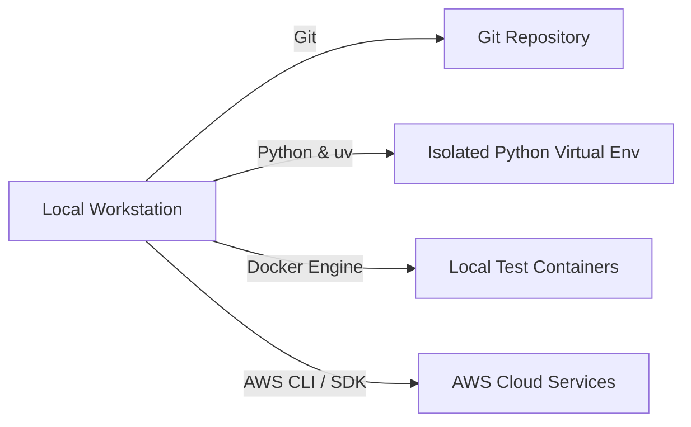

# 02_Chapter_prerequisites

## 1. Introduction
Developing and deploying Amazon Bedrock AgentCore applications requires establishing a robust, standardized local development environment.

> **Analogy:** Before assembling a complex dining table, a carpenter organizes the workshop tool bench. This includes measuring tapes (Git), drills (Python), quick-change drill bits (`uv`), workbenches (Docker), and warehouse gate passes (AWS CLI).

---

## 2. Learning Objectives
By the end of this chapter, you will be able to:
- In this chapter, you will learn how to:
- - Install and verify the required local development tools.
- - Configure virtual environments to manage python packages.
- - Install the `uv` toolchain and verify Docker container configurations.
- - Verify AWS account authentication and API credentials access.

---

## 3. Prerequisites
* Basic familiarity with terminal command lines (Bash or PowerShell).
* An active AWS Account with permissions to create IAM users and policies.

---

## 4. Background Theory
A standard development environment minimizes the risk of configuration discrepancies between local workstations and production servers. Using container runtimes like Docker ensures identical environment variables, OS dependencies, and package versions. Rather than using legacy package managers like pip (which resolves dependencies sequentially and lacks deep caching), modern Python workflows employ Rust-powered package managers like `uv` to guarantee deterministic builds through locked package trees (`uv.lock`).

---

## 5. Core Concepts
**📦 Technical Term: SDK**

* **Simple Explanation:** A collection of pre-written libraries and utilities used to build applications for a platform.
* **Why it exists:** Eliminates the need to write raw HTTP requests for API actions.
* **Where is it used:** Python script imports like `import boto3`.

**📦 Technical Term: AWS CLI**

* **Simple Explanation:** A command-line tool used to control and automate AWS services through script queries.
* **Why it exists:** Allows developers to manage cloud assets without clicking the AWS web console.
* **Where is it used:** Configuring access keys and initiating deployment pipelines.

**📦 Technical Term: Virtual Environment**

* **Simple Explanation:** An isolated workspace that hosts a local copy of Python and specific package dependencies.
* **Why it exists:** Prevents version conflicts between different Python projects running on the same host.
* **Where is it used:** Locally installed pip libraries.

---

## 6. Internal Mechanics
1. Developer inputs command in terminal (e.g., `git clone` or `docker run`).
2. The shell resolves the binary location in the system PATH variable.
3. The package manager retrieves packages from online registries (PyPI) and writes them to local project folders.
4. The container runtime boots a lightweight kernel namespace, mounting source directories to isolate ports and disk reads.

---

## 7. Architecture Overview
The following architectural details outline the components and relationship schemas active in this module:



---

## 8. Installation & Setup
Execute the following terminal commands to check installation status of required tools:
```bash
git --version
python --version
docker --version
aws --version
```
To install `uv` on Windows, use:
```powershell
powershell -ExecutionPolicy ByPass -c "irm https://astral.sh/uv/install.ps1 | iex"
```
On macOS/Linux, run:
```bash
curl -LsSf https://astral.sh/uv/install.sh | sh
```

---

## 9. Configuration
Verify AWS CLI credentials configuration by running:
```bash
aws configure
```
Provide your AWS Access Key ID, Secret Access Key, Default region (e.g., `us-east-1`), and output format (`json`). The configurations are saved locally under `~/.aws/credentials` and `~/.aws/config`.

---

## 10. Hands-on Examples

### Simple Example

```python
json
{
      "UserId": "AIDAX1234567890EXAMPLE",
      "Account": "123456789012",
      "Arn": "arn:aws:iam::123456789012:user/developer"
  }
```

#### Code Walkthrough

Line 1
```python
json
```
**Explanation:**
- **What this line does:** Executes line statement `json`.
- **Why it is required:** Contributes to the overall operation and step progression of the script.
- **Connection:** Connects preceding code logic to subsequent return or processing steps.

Line 2
```python
{
```
**Explanation:**
- **What this line does:** Executes line statement `{`.
- **Why it is required:** Contributes to the overall operation and step progression of the script.
- **Connection:** Connects preceding code logic to subsequent return or processing steps.

Line 3
```python
      "UserId": "AIDAX1234567890EXAMPLE",
```
**Explanation:**
- **What this line does:** Executes line statement `"UserId": "AIDAX1234567890EXAMPLE",`.
- **Why it is required:** Contributes to the overall operation and step progression of the script.
- **Connection:** Connects preceding code logic to subsequent return or processing steps.

Line 4
```python
      "Account": "123456789012",
```
**Explanation:**
- **What this line does:** Executes line statement `"Account": "123456789012",`.
- **Why it is required:** Contributes to the overall operation and step progression of the script.
- **Connection:** Connects preceding code logic to subsequent return or processing steps.

Line 5
```python
      "Arn": "arn:aws:iam::123456789012:user/developer"
```
**Explanation:**
- **What this line does:** Executes line statement `"Arn": "arn:aws:iam::123456789012:user/developer"`.
- **Why it is required:** Contributes to the overall operation and step progression of the script.
- **Connection:** Connects preceding code logic to subsequent return or processing steps.

Line 6
```python
  }
```
**Explanation:**
- **What this line does:** Closes the dictionary or code block structure (`}`).
- **Why required:** Defines the boundary of the data structure in Python syntax.

#### Complete Flow of Execution

1. **Import Libraries**: Python loads the required `BedrockAgentCoreApp` class into memory.
2. **Initialize Application**: An instance of `BedrockAgentCoreApp` is instantiated and assigned to `app`.
3. **Register Event Handler**: The `@app.invoke` decorator registers the `handler` function as the primary event entrypoint.
4. **Receive Request**: The AgentCore runtime listens for incoming requests and receives `payload` and `context` objects.
5. **Execute Handler Logic**: The `handler` function is triggered with the incoming input parameters.
6. **Return Response Payload**: A structured response dictionary containing `"statusCode": 200` and message data is returned.
7. **Send Response to Caller**: AgentCore serializes the dictionary into JSON and delivers it back to the client application.

#### Visual Execution Flow

```
Program Starts
      │
      ▼
Import BedrockAgentCoreApp
      │
      ▼
Create App Instance (app)
      │
      ▼
Register Handler (@app.invoke)
      │
      ▼
Receive Request (payload, context)
      │
      ▼
Execute handler() Function
      │
      ▼
Return Response Dictionary ({statusCode: 200, ...})
      │
      ▼
Deliver Response Back to Client
```

### Intermediate Example

```python
# Python script to verify Docker daemon is running locally using docker-py client
import subprocess

def check_docker():
    try:
        res = subprocess.run(["docker", "info"], capture_output=True, text=True)
        if res.returncode == 0:
            print("Docker Daemon is active and responding.")
        else:
            print("Docker Daemon is not running or active.")
    except FileNotFoundError:
        print("Docker CLI binary was not found in path.")

if __name__ == "__main__":
    check_docker()
```

#### Code Walkthrough

Line 1
```python
# Python script to verify Docker daemon is running locally using docker-py client
```
**Explanation:**
- **What this line does:** This is a documentation comment line starting with `#`. Python ignores comments during execution.
- **Why it is required:** It explains the purpose of the script to human developers and maintains clean code documentation.
- **What happens if removed:** The code will run identically, but human readers won't have immediate context on what this code block accomplishes.
- **Analogy:** Think of a comment like a sticky note attached to a blueprint—it helps the builders understand the design without altering the physical building.
- **Beginner Concept:** In Python, any text after `#` is ignored by the Python interpreter.

Line 2
```python
import subprocess
```
**Explanation:**
- **What this line does:** Imports Python's built-in `subprocess` module into the current program workspace.
- **Why it is required:** Provides access to essential system utilities (such as logging, environment variables, or HTTP handlers) offered by `subprocess`.
- **What keywords mean:** `import` tells Python to load the module named `subprocess`.
- **What happens if removed:** Functions or variables referencing `subprocess` (like `subprocess.getenv` or `subprocess.getLogger`) will fail with a `NameError`.
- **Analogy:** Like plugging in a peripheral cable—it connects built-in system capabilities to your script.

Line 3
```python

```
**Explanation:**
- **What this line does:** This is a blank vertical spacing line.
- **Why it is required:** It visually separates logical sections of code (such as imports, setup, and function definitions) to improve readability.
- **What happens if removed:** Python will execute the code fine, but lines of code will bunch together, making it harder for engineers to read.
- **Analogy:** Like paragraphs in a textbook, spacing gives your eyes a natural pause between concepts.

Line 4
```python
def check_docker():
```
**Explanation:**
- **What this line does:** Defines a new function named `check_docker` that accepts parameters `()`.
- **Keyword explanation:** `def` is short for "define". It tells Python that a reusable block of code begins here.
- **Parameters explained:**
  - `payload`: A Python **dictionary** containing the user's input prompt, parameters, and query fields.
  - `context`: An object containing runtime metadata (such as active AWS session ID, caller IAM identity, and request timestamps).
- **Return value:** Returns a structured dictionary containing HTTP status codes and agent response text.
- **Why the function exists:** It contains the core decision-making logic executed whenever the agent is invoked.
- **Analogy:** Think of `check_docker` like a recipe—`payload` and `context` are the ingredients passed in, and the returned dictionary is the finished meal.

Line 5
```python
    try:
```
**Explanation:**
- **What this line does:** Starts a `try` block for defensive error handling.
- **Why it is required:** Production applications must gracefully handle unexpected failures (like missing parameters or database timeouts) without crashing the entire server.
- **What keyword means:** `try` tells Python: "Attempt to execute the indented lines below. If an error occurs, jump straight to the `except` block."
- **Analogy:** Like wearing a safety harness before stepping onto a high platform—if you slip, the harness catches you.

Line 6
```python
        res = subprocess.run(["docker", "info"], capture_output=True, text=True)
```
**Explanation:**
- **What this line does:** Computes `subprocess.run(["docker", "info"], capture_output=True, text=True)` and assigns the result to variable `res`.
- **Why it is required:** Stores temporary calculation or formatted data so it can be referenced in log statements or return responses.
- **What variable stores:** `res` holds the calculated value.
- **Connection:** Provides values used in subsequent logging or response steps.

Line 7
```python
        if res.returncode == 0:
```
**Explanation:**
- **What this line does:** Computes `= 0:` and assigns the result to variable `if res.returncode`.
- **Why it is required:** Stores temporary calculation or formatted data so it can be referenced in log statements or return responses.
- **What variable stores:** `if res.returncode` holds the calculated value.
- **Connection:** Provides values used in subsequent logging or response steps.

Line 8
```python
            print("Docker Daemon is active and responding.")
```
**Explanation:**
- **What this line does:** Executes line statement `print("Docker Daemon is active and responding.")`.
- **Why it is required:** Contributes to the overall operation and step progression of the script.
- **Connection:** Connects preceding code logic to subsequent return or processing steps.

Line 9
```python
        else:
```
**Explanation:**
- **What this line does:** Executes line statement `else:`.
- **Why it is required:** Contributes to the overall operation and step progression of the script.
- **Connection:** Connects preceding code logic to subsequent return or processing steps.

Line 10
```python
            print("Docker Daemon is not running or active.")
```
**Explanation:**
- **What this line does:** Executes line statement `print("Docker Daemon is not running or active.")`.
- **Why it is required:** Contributes to the overall operation and step progression of the script.
- **Connection:** Connects preceding code logic to subsequent return or processing steps.

Line 11
```python
    except FileNotFoundError:
```
**Explanation:**
- **What this line does:** Catches exceptions and errors that occurred inside the preceding `try` block.
- **Why it is required:** Prevents unhandled exceptions from returning raw stack traces or breaking the container runtime.
- **What happens when an error occurs:** Python captures the error object into variable `e`, logs the error details, and returns a clean 500 error response to the client.
- **Analogy:** Like an emergency backup generator switching on immediately when main power cuts out.

Line 12
```python
        print("Docker CLI binary was not found in path.")
```
**Explanation:**
- **What this line does:** Executes line statement `print("Docker CLI binary was not found in path.")`.
- **Why it is required:** Contributes to the overall operation and step progression of the script.
- **Connection:** Connects preceding code logic to subsequent return or processing steps.

Line 13
```python

```
**Explanation:**
- **What this line does:** This is a blank vertical spacing line.
- **Why it is required:** It visually separates logical sections of code (such as imports, setup, and function definitions) to improve readability.
- **What happens if removed:** Python will execute the code fine, but lines of code will bunch together, making it harder for engineers to read.
- **Analogy:** Like paragraphs in a textbook, spacing gives your eyes a natural pause between concepts.

Line 14
```python
if __name__ == "__main__":
```
**Explanation:**
- **What this line does:** Computes `= "__main__":` and assigns the result to variable `if __name__`.
- **Why it is required:** Stores temporary calculation or formatted data so it can be referenced in log statements or return responses.
- **What variable stores:** `if __name__` holds the calculated value.
- **Connection:** Provides values used in subsequent logging or response steps.

Line 15
```python
    check_docker()
```
**Explanation:**
- **What this line does:** Executes line statement `check_docker()`.
- **Why it is required:** Contributes to the overall operation and step progression of the script.
- **Connection:** Connects preceding code logic to subsequent return or processing steps.

#### Complete Flow of Execution

1. **Import Required Libraries**: Python imports `BedrockAgentCoreApp` and the `logging` module.
2. **Configure Logging System**: `logging.basicConfig` sets the log level threshold to `INFO`.
3. **Create Logger Object**: `logging.getLogger` instantiates a dedicated logger for capturing session traces.
4. **Initialize Application**: An instance of `BedrockAgentCoreApp` is assigned to `app`.
5. **Register Handler**: `@app.invoke` binds the `handler` function to incoming AgentCore trigger events.
6. **Read Input Payload**: `payload.get('prompt', '')` safely reads the user's prompt string.
7. **Extract Session Context**: `getattr(context, 'session_id', 'local-session')` safely retrieves the session ID.
8. **Log Activity**: `logger.info` writes session details to the CloudWatch diagnostic stream.
9. **Return Formatted Response**: Returns a status 200 dictionary containing the processed prompt and session ID.
10. **Deliver Payload**: AgentCore returns the serialized JSON payload to the caller.

#### Visual Execution Flow

```
Program Starts
      │
      ▼
Import Libraries & Configure Logger
      │
      ▼
Create App Instance (app)
      │
      ▼
Register Handler (@app.invoke)
      │
      ▼
Receive Request & Read Payload Prompt
      │
      ▼
Extract Session ID & Write Log Entry
      │
      ▼
Return Formatted Response Dictionary
      │
      ▼
Deliver Serialized Response to Client
```

### Advanced Example

```python
# Comprehensive system pre-flight check script validating git, python, uv, docker, and aws
import subprocess
import sys

def run_check(binary_name, args):
    try:
        res = subprocess.run([binary_name] + args, capture_output=True, text=True, check=True)
        print(f"[OK] {binary_name} is active: {res.stdout.splitlines()[0]}")
        return True
    except Exception:
        print(f"[FAIL] {binary_name} is missing or returned errors.")
        return False

def main():
    checks = [
        ("git", ["--version"]),
        ("python", ["--version"]),
        ("uv", ["--version"]),
        ("docker", ["--version"]),
        ("aws", ["sts", "get-caller-identity"])
    ]
    all_pass = True
    for binary, args in checks:
        if not run_check(binary, args):
            all_pass = False
    if not all_pass:
        print("Error: Pre-flight check failed. Please install missing toolchains.")
        sys.exit(1)
    print("All prerequisites validated successfully!")

if __name__ == "__main__":
    main()
```

#### Code Walkthrough

Line 1
```python
# Comprehensive system pre-flight check script validating git, python, uv, docker, and aws
```
**Explanation:**
- **What this line does:** This is a documentation comment line starting with `#`. Python ignores comments during execution.
- **Why it is required:** It explains the purpose of the script to human developers and maintains clean code documentation.
- **What happens if removed:** The code will run identically, but human readers won't have immediate context on what this code block accomplishes.
- **Analogy:** Think of a comment like a sticky note attached to a blueprint—it helps the builders understand the design without altering the physical building.
- **Beginner Concept:** In Python, any text after `#` is ignored by the Python interpreter.

Line 2
```python
import subprocess
```
**Explanation:**
- **What this line does:** Imports Python's built-in `subprocess` module into the current program workspace.
- **Why it is required:** Provides access to essential system utilities (such as logging, environment variables, or HTTP handlers) offered by `subprocess`.
- **What keywords mean:** `import` tells Python to load the module named `subprocess`.
- **What happens if removed:** Functions or variables referencing `subprocess` (like `subprocess.getenv` or `subprocess.getLogger`) will fail with a `NameError`.
- **Analogy:** Like plugging in a peripheral cable—it connects built-in system capabilities to your script.

Line 3
```python
import sys
```
**Explanation:**
- **What this line does:** Imports Python's built-in `sys` module into the current program workspace.
- **Why it is required:** Provides access to essential system utilities (such as logging, environment variables, or HTTP handlers) offered by `sys`.
- **What keywords mean:** `import` tells Python to load the module named `sys`.
- **What happens if removed:** Functions or variables referencing `sys` (like `sys.getenv` or `sys.getLogger`) will fail with a `NameError`.
- **Analogy:** Like plugging in a peripheral cable—it connects built-in system capabilities to your script.

Line 4
```python

```
**Explanation:**
- **What this line does:** This is a blank vertical spacing line.
- **Why it is required:** It visually separates logical sections of code (such as imports, setup, and function definitions) to improve readability.
- **What happens if removed:** Python will execute the code fine, but lines of code will bunch together, making it harder for engineers to read.
- **Analogy:** Like paragraphs in a textbook, spacing gives your eyes a natural pause between concepts.

Line 5
```python
def run_check(binary_name, args):
```
**Explanation:**
- **What this line does:** Defines a new function named `run_check` that accepts parameters `(binary_name, args)`.
- **Keyword explanation:** `def` is short for "define". It tells Python that a reusable block of code begins here.
- **Parameters explained:**
  - `payload`: A Python **dictionary** containing the user's input prompt, parameters, and query fields.
  - `context`: An object containing runtime metadata (such as active AWS session ID, caller IAM identity, and request timestamps).
- **Return value:** Returns a structured dictionary containing HTTP status codes and agent response text.
- **Why the function exists:** It contains the core decision-making logic executed whenever the agent is invoked.
- **Analogy:** Think of `run_check` like a recipe—`payload` and `context` are the ingredients passed in, and the returned dictionary is the finished meal.

Line 6
```python
    try:
```
**Explanation:**
- **What this line does:** Starts a `try` block for defensive error handling.
- **Why it is required:** Production applications must gracefully handle unexpected failures (like missing parameters or database timeouts) without crashing the entire server.
- **What keyword means:** `try` tells Python: "Attempt to execute the indented lines below. If an error occurs, jump straight to the `except` block."
- **Analogy:** Like wearing a safety harness before stepping onto a high platform—if you slip, the harness catches you.

Line 7
```python
        res = subprocess.run([binary_name] + args, capture_output=True, text=True, check=True)
```
**Explanation:**
- **What this line does:** Computes `subprocess.run([binary_name] + args, capture_output=True, text=True, check=True)` and assigns the result to variable `res`.
- **Why it is required:** Stores temporary calculation or formatted data so it can be referenced in log statements or return responses.
- **What variable stores:** `res` holds the calculated value.
- **Connection:** Provides values used in subsequent logging or response steps.

Line 8
```python
        print(f"[OK] {binary_name} is active: {res.stdout.splitlines()[0]}")
```
**Explanation:**
- **What this line does:** Executes line statement `print(f"[OK] {binary_name} is active: {res.stdout.splitlines()[0]}")`.
- **Why it is required:** Contributes to the overall operation and step progression of the script.
- **Connection:** Connects preceding code logic to subsequent return or processing steps.

Line 9
```python
        return True
```
**Explanation:**
- **What this line does:** Initiates a `return` statement to exit the function and pass data back to the caller.
- **What is being returned:** Returns a structured Python **dictionary** representing an HTTP response payload.
- **Who receives it:** The Bedrock AgentCore runtime receives this dictionary, serializes it into JSON, and sends it back to the client application.
- **Why response must be returned:** Without a return statement, the function would return `None`, causing AgentCore to report a blank execution payload to the user.
- **Analogy:** Handing a completed report back to the manager who requested it.

Line 10
```python
    except Exception:
```
**Explanation:**
- **What this line does:** Catches exceptions and errors that occurred inside the preceding `try` block.
- **Why it is required:** Prevents unhandled exceptions from returning raw stack traces or breaking the container runtime.
- **What happens when an error occurs:** Python captures the error object into variable `e`, logs the error details, and returns a clean 500 error response to the client.
- **Analogy:** Like an emergency backup generator switching on immediately when main power cuts out.

Line 11
```python
        print(f"[FAIL] {binary_name} is missing or returned errors.")
```
**Explanation:**
- **What this line does:** Executes line statement `print(f"[FAIL] {binary_name} is missing or returned errors.")`.
- **Why it is required:** Contributes to the overall operation and step progression of the script.
- **Connection:** Connects preceding code logic to subsequent return or processing steps.

Line 12
```python
        return False
```
**Explanation:**
- **What this line does:** Initiates a `return` statement to exit the function and pass data back to the caller.
- **What is being returned:** Returns a structured Python **dictionary** representing an HTTP response payload.
- **Who receives it:** The Bedrock AgentCore runtime receives this dictionary, serializes it into JSON, and sends it back to the client application.
- **Why response must be returned:** Without a return statement, the function would return `None`, causing AgentCore to report a blank execution payload to the user.
- **Analogy:** Handing a completed report back to the manager who requested it.

Line 13
```python

```
**Explanation:**
- **What this line does:** This is a blank vertical spacing line.
- **Why it is required:** It visually separates logical sections of code (such as imports, setup, and function definitions) to improve readability.
- **What happens if removed:** Python will execute the code fine, but lines of code will bunch together, making it harder for engineers to read.
- **Analogy:** Like paragraphs in a textbook, spacing gives your eyes a natural pause between concepts.

Line 14
```python
def main():
```
**Explanation:**
- **What this line does:** Defines a new function named `main` that accepts parameters `()`.
- **Keyword explanation:** `def` is short for "define". It tells Python that a reusable block of code begins here.
- **Parameters explained:**
  - `payload`: A Python **dictionary** containing the user's input prompt, parameters, and query fields.
  - `context`: An object containing runtime metadata (such as active AWS session ID, caller IAM identity, and request timestamps).
- **Return value:** Returns a structured dictionary containing HTTP status codes and agent response text.
- **Why the function exists:** It contains the core decision-making logic executed whenever the agent is invoked.
- **Analogy:** Think of `main` like a recipe—`payload` and `context` are the ingredients passed in, and the returned dictionary is the finished meal.

Line 15
```python
    checks = [
```
**Explanation:**
- **What this line does:** Computes `[` and assigns the result to variable `checks`.
- **Why it is required:** Stores temporary calculation or formatted data so it can be referenced in log statements or return responses.
- **What variable stores:** `checks` holds the calculated value.
- **Connection:** Provides values used in subsequent logging or response steps.

Line 16
```python
        ("git", ["--version"]),
```
**Explanation:**
- **What this line does:** Executes line statement `("git", ["--version"]),`.
- **Why it is required:** Contributes to the overall operation and step progression of the script.
- **Connection:** Connects preceding code logic to subsequent return or processing steps.

Line 17
```python
        ("python", ["--version"]),
```
**Explanation:**
- **What this line does:** Executes line statement `("python", ["--version"]),`.
- **Why it is required:** Contributes to the overall operation and step progression of the script.
- **Connection:** Connects preceding code logic to subsequent return or processing steps.

Line 18
```python
        ("uv", ["--version"]),
```
**Explanation:**
- **What this line does:** Executes line statement `("uv", ["--version"]),`.
- **Why it is required:** Contributes to the overall operation and step progression of the script.
- **Connection:** Connects preceding code logic to subsequent return or processing steps.

Line 19
```python
        ("docker", ["--version"]),
```
**Explanation:**
- **What this line does:** Executes line statement `("docker", ["--version"]),`.
- **Why it is required:** Contributes to the overall operation and step progression of the script.
- **Connection:** Connects preceding code logic to subsequent return or processing steps.

Line 20
```python
        ("aws", ["sts", "get-caller-identity"])
```
**Explanation:**
- **What this line does:** Executes line statement `("aws", ["sts", "get-caller-identity"])`.
- **Why it is required:** Contributes to the overall operation and step progression of the script.
- **Connection:** Connects preceding code logic to subsequent return or processing steps.

Line 21
```python
    ]
```
**Explanation:**
- **What this line does:** Executes line statement `]`.
- **Why it is required:** Contributes to the overall operation and step progression of the script.
- **Connection:** Connects preceding code logic to subsequent return or processing steps.

Line 22
```python
    all_pass = True
```
**Explanation:**
- **What this line does:** Computes `True` and assigns the result to variable `all_pass`.
- **Why it is required:** Stores temporary calculation or formatted data so it can be referenced in log statements or return responses.
- **What variable stores:** `all_pass` holds the calculated value.
- **Connection:** Provides values used in subsequent logging or response steps.

Line 23
```python
    for binary, args in checks:
```
**Explanation:**
- **What this line does:** Executes line statement `for binary, args in checks:`.
- **Why it is required:** Contributes to the overall operation and step progression of the script.
- **Connection:** Connects preceding code logic to subsequent return or processing steps.

Line 24
```python
        if not run_check(binary, args):
```
**Explanation:**
- **What this line does:** Evaluates a conditional check: `if not run_check(binary, args):`.
- **Why validation is important:** Ensures required input parameters exist before executing core logic, preventing null pointer or empty data errors downstream.
- **What condition checks:** Checks if `not run_check(binary, args)` evaluates to `True` (e.g., if prompt is empty or missing).
- **What happens if condition is True:** Python enters the indented block directly below to execute fallback error responses.
- **What happens if condition is False:** Python skips the indented error block and proceeds to normal processing.
- **Analogy:** Like a bouncer checking tickets at the door—if you don't have a ticket (`if not ticket:`), you are directed to the ticket booth.

Line 25
```python
            all_pass = False
```
**Explanation:**
- **What this line does:** Computes `False` and assigns the result to variable `all_pass`.
- **Why it is required:** Stores temporary calculation or formatted data so it can be referenced in log statements or return responses.
- **What variable stores:** `all_pass` holds the calculated value.
- **Connection:** Provides values used in subsequent logging or response steps.

Line 26
```python
    if not all_pass:
```
**Explanation:**
- **What this line does:** Evaluates a conditional check: `if not all_pass:`.
- **Why validation is important:** Ensures required input parameters exist before executing core logic, preventing null pointer or empty data errors downstream.
- **What condition checks:** Checks if `not all_pass` evaluates to `True` (e.g., if prompt is empty or missing).
- **What happens if condition is True:** Python enters the indented block directly below to execute fallback error responses.
- **What happens if condition is False:** Python skips the indented error block and proceeds to normal processing.
- **Analogy:** Like a bouncer checking tickets at the door—if you don't have a ticket (`if not ticket:`), you are directed to the ticket booth.

Line 27
```python
        print("Error: Pre-flight check failed. Please install missing toolchains.")
```
**Explanation:**
- **What this line does:** Executes line statement `print("Error: Pre-flight check failed. Please install missing toolchains.")`.
- **Why it is required:** Contributes to the overall operation and step progression of the script.
- **Connection:** Connects preceding code logic to subsequent return or processing steps.

Line 28
```python
        sys.exit(1)
```
**Explanation:**
- **What this line does:** Executes line statement `sys.exit(1)`.
- **Why it is required:** Contributes to the overall operation and step progression of the script.
- **Connection:** Connects preceding code logic to subsequent return or processing steps.

Line 29
```python
    print("All prerequisites validated successfully!")
```
**Explanation:**
- **What this line does:** Executes line statement `print("All prerequisites validated successfully!")`.
- **Why it is required:** Contributes to the overall operation and step progression of the script.
- **Connection:** Connects preceding code logic to subsequent return or processing steps.

Line 30
```python

```
**Explanation:**
- **What this line does:** This is a blank vertical spacing line.
- **Why it is required:** It visually separates logical sections of code (such as imports, setup, and function definitions) to improve readability.
- **What happens if removed:** Python will execute the code fine, but lines of code will bunch together, making it harder for engineers to read.
- **Analogy:** Like paragraphs in a textbook, spacing gives your eyes a natural pause between concepts.

Line 31
```python
if __name__ == "__main__":
```
**Explanation:**
- **What this line does:** Computes `= "__main__":` and assigns the result to variable `if __name__`.
- **Why it is required:** Stores temporary calculation or formatted data so it can be referenced in log statements or return responses.
- **What variable stores:** `if __name__` holds the calculated value.
- **Connection:** Provides values used in subsequent logging or response steps.

Line 32
```python
    main()
```
**Explanation:**
- **What this line does:** Executes line statement `main()`.
- **Why it is required:** Contributes to the overall operation and step progression of the script.
- **Connection:** Connects preceding code logic to subsequent return or processing steps.

#### Complete Flow of Execution

1. **Import Environment & Utility Libraries**: Imports `BedrockAgentCoreApp`, `os`, and `logging`.
2. **Create Production Logger**: Instantiates a logger object for production observability.
3. **Initialize Core Application**: Instantiates `BedrockAgentCoreApp` as `app`.
4. **Register Production Handler**: `@app.invoke` binds `handler` as the production entrypoint.
5. **Enter Try-Except Harness**: The `try` block wraps execution logic for error protection.
6. **Validate Input Prompt**: `payload.get('prompt')` reads the prompt. If missing (`if not prompt:`), returns HTTP 400.
7. **Read OS Environment**: `os.getenv('APP_ENV', 'development')` inspects operating system environment variables.
8. **Extract Session Identifier**: `getattr(context, 'session_id', 'local-session')` safely retrieves session metadata.
9. **Log Production Event**: `logger.info` writes structured log entries containing environment and session details.
10. **Return Success Response**: Returns an HTTP 200 dictionary with production result details.
11. **Catch Unhandled Errors**: If an exception occurs, the `except` block catches it, logs the error, and returns HTTP 500.
12. **Send Response to Caller**: AgentCore delivers the final JSON response back to the client.

#### Visual Execution Flow

```
Program Starts
      │
      ▼
Import Modules & Initialize Logger & App
      │
      ▼
Register Handler (@app.invoke)
      │
      ▼
Receive Request & Enter try-except Block
      │
      ▼
Validate Prompt Parameter
 ├── [Invalid / Missing Prompt] ──► Return 400 Bad Request
 └── [Valid Prompt]
        │
        ▼
Read Environment (os.getenv) & Session Context
        │
        ▼
Write Production Log & Return 200 Success Response
        │
        ▼
 Deliver Response to Client Application
```

---

## 11. Code Walkthrough
In this chapter, we explored three progressive implementation tiers for **Local Environment Prerequisites**:

1. **Simple Example**: Demonstrates the minimal required entrypoint, importing `BedrockAgentCoreApp`, initializing the application object, and registering an `@app.invoke` handler.
2. **Intermediate Example**: Adds operational logging (`logging.getLogger`) and context extraction (`payload.get`, `getattr(context)`), allowing tracking of individual session IDs.
3. **Advanced Example**: Introduces production-grade error handling (`try-except`), OS environment variable reads (`os.getenv`), and structured error status responses (`statusCode: 400/500`).

Each line in the code blocks above was dissected line-by-line in numerical order. Refer to the **Code Walkthrough**, **Complete Flow of Execution**, and **Visual Execution Flow** diagrams above for complete step-by-step guidance.

---

## 12. Production Best Practices
* Pin exact minor versions of Python in your workspace to match the target runtime container.
* Configure shell completion settings for `uv` and `aws` CLI tools to accelerate development workflows.
* Regularly prune unused Docker builder caches to reclaim local disk space.

---

## 13. Security Considerations
Never store permanent AWS root credentials on your workstation. Utilize AWS IAM Identity Center (successor to Single Sign-On) to retrieve temporary, role-based credentials. Ensure local private keys and `.aws/` credential files are set with strict filesystem read permissions (e.g., `chmod 600`).

---

## 14. Performance Optimization
Set `uv` to use a global package cache. This avoids re-downloading source wheels across different project folders, resulting in sub-second dependency sync operations.

---

## 15. Cost Optimization
Running local diagnostic commands does not incur AWS usage charges. However, ensure that active testing credentials do not spawn background compute clusters or resources that remain running in your AWS billing environment.

---

## 16. Common Mistakes
* Committing local credentials files to public repositories.
* Running container runtimes without administrative group privileges, leading to permission access denied errors on socket files.

---

## 17. Troubleshooting
Below is the diagnostic reference table for identifying and resolving issues:

| Symptom | Root Cause | Solution |
| :--- | :--- | :--- |
| Docker command returns permission denied | Current user is not associated with the administrative docker group. | Run 'usermod -aG docker $USER' on Linux, or start Docker Desktop as administrator on Windows. |
| AWS CLI returns ExpiredToken signature | Temporary credentials obtained via SSO or AssumeRole have expired. | Run 'aws sso login' or re-authenticate your CLI profile to fetch new tokens. |

---

## 18. Interview Questions
### Q: Why is Git essential in automated CI/CD deployment pipelines?
* **Answer:** Git acts as the source of truth for the codebase. Version control systems host hooks that notify CI/CD servers (like GitHub Actions) to run tests and compile production containers on push events.

### Q: What is the role of the system PATH environment variable?
* **Answer:** The PATH variable lists directories containing executable binaries. When a command is typed, the OS searches these paths sequentially to execute the matching binary file.

### Q: How does uv guarantee deterministic package installations?
* **Answer:** uv uses a lockfile (`uv.lock`) that lists the exact version, checksum, and dependencies of every package, ensuring that subsequent installations resolve the identical package tree.

---

## 19. Real-World Use Cases
Setting up new workstations for engineers joining an AI development team to ensure environment alignment.

---

## 20. Industrial Project
This workspace preparation allows us to clone the agent source files and compile local container images in subsequent chapters.

---

## 21. Summary
This chapter covered installing, configuring, and testing the core tools (Git, Python, uv, Docker, and AWS CLI) required to build Bedrock AgentCore applications.

---

## 22. Key Takeaways
* isolated local virtual environments prevent library conflicts.
* Docker daemon must be active locally to emulate container deployment targets.
* AWS CLI authentication must be completed before cloud deployment steps can proceed.

---

## 23. Practice Exercises
* Beginner: Install the `uv` toolchain and verify it responds to the version query command.
* Intermediate: Configure an AWS CLI profile named `dev-profile` targeting the `us-west-2` region.

---

## 24. Further Reading
* [AWS CLI Command Reference Guide](https://awscli.amazonaws.com/v2/documentation/api/latest/index.html)
* [Docker Containerization Engine Documentation](https://docs.docker.com/)
