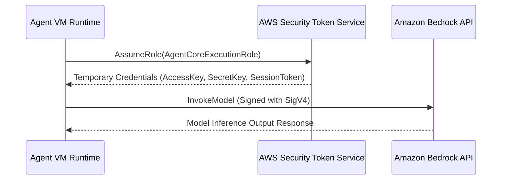

# 03_Chapter_aws_configuration

## 1. Introduction
Deploying Amazon Bedrock AgentCore applications requires configuring access permissions and model endpoints within your AWS account.

> **Analogy:** Think of a government facility access pass. The employee (Agent) must have an ID card (IAM Role), an explicit list of cleared rooms (IAM Policy), and security desk authorization to access secure documents (Model Access).

---

## 2. Learning Objectives
By the end of this chapter, you will be able to:
- In this chapter, you will learn how to:
- - Request model access in the Amazon Bedrock Console.
- - Create an IAM policy with permissions for Bedrock, DynamoDB, and CloudWatch.
- - Configure an IAM execution role and set up trust relationships.
- - Verify AWS configurations using the console and CLI.

---

## 3. Prerequisites
* Successful setup of the AWS CLI toolchain from Chapter 2.
* IAM administrative privileges in your target AWS account.

---

## 4. Background Theory
By default, AWS blocks all access to foundation models to prevent unexpected billing. Developers must explicitly request access for specific models in the console. Furthermore, AWS services execute commands under IAM boundaries. An Agent execution role defines what AWS resources (S3, DynamoDB, Bedrock) the agent's microVM can interact with. Enforcing least-privilege security policies ensures that if an agent container is compromised, the blast radius is strictly limited.

---

## 5. Core Concepts
**📦 Technical Term: IAM Policy**

* **Simple Explanation:** A JSON document defining permissions by detailing allowed actions on specific resource ARNs.
* **Why it exists:** Ensures the application cannot invoke unauthorized APIs.
* **Where is it used:** Attached policy document limits access to DynamoDB tables.

**📦 Technical Term: IAM Role**

* **Simple Explanation:** An IAM identity that trusted entities (like services or user accounts) assume to acquire temporary credentials.
* **Why it exists:** Allows services to access resources without hardcoded passwords.
* **Where is it used:** The role assumed by the microVM at runtime.

**📦 Technical Term: Model Access Table**

* **Simple Explanation:** A console settings pane where developers agree to terms of service to activate Bedrock model APIs.
* **Why it exists:** Required to enable third-party model invoke endpoints.
* **Where is it used:** Requesting access for Anthropic Claude 3.5 Sonnet.

---

## 6. Internal Mechanics
1. AgentCore runtime starts the microVM.
2. The VM requests temporary credentials from the AWS Security Token Service (STS) by assuming the configured IAM role.
3. STS returns a session access key, secret key, and session token.
4. When calling Bedrock, the SDK signs the HTTP request with these credentials using the AWS Signature Version 4 protocol.
5. Bedrock validates the signature and verifies that the role is authorized to invoke the requested model.

---

## 7. Architecture Overview
The following architectural details outline the components and relationship schemas active in this module:



---

## 8. Installation & Setup
Verify model access lists from the CLI using:
```bash
aws bedrock list-foundation-models --query "modelSummaries[?modelId=='anthropic.claude-3-5-sonnet-20241022-v2:0']"
```

---

## 9. Configuration
### Step 1: Request Amazon Bedrock Model Access
1. Navigate to the **Amazon Bedrock** console.
2. Select **Model access** in the left menu.
3. Click **Manage model access**, select **Claude 3.5 Sonnet** and **Claude 3 Haiku**, and click **Save changes**.

### Step 2: Create IAM Policy `AgentCoreExecutionPolicy`
```json
{
  "Version": "2012-10-17",
  "Statement": [
    {
      "Sid": "BedrockInference",
      "Effect": "Allow",
      "Action": [
        "bedrock:InvokeModel",
        "bedrock:InvokeModelWithResponseStream"
      ],
      "Resource": "*"
    },
    {
      "Sid": "DynamoDBMemory",
      "Effect": "Allow",
      "Action": [
        "dynamodb:GetItem",
        "dynamodb:PutItem",
        "dynamodb:UpdateItem",
        "dynamodb:DeleteItem",
        "dynamodb:Query",
        "dynamodb:Scan"
      ],
      "Resource": "arn:aws:dynamodb:*:*:table/*agentcore*"
    },
    {
      "Sid": "CloudWatchLogging",
      "Effect": "Allow",
      "Action": [
        "logs:CreateLogGroup",
        "logs:CreateLogStream",
        "logs:PutLogEvents"
      ],
      "Resource": "*"
    }
  ]
}
```

### Step 3: Create Trust Role `AgentCoreExecutionRole`
```json
{
  "Version": "2012-10-17",
  "Statement": [
    {
      "Effect": "Allow",
      "Principal": {
        "Service": "agentcore.amazonaws.com"
      },
      "Action": "sts:AssumeRole"
    }
  ]
}
```

---

## 10. Hands-on Examples
### Simple Example
```python
json
{
  "Version": "2012-10-17",
  "Statement": [
    {
      "Sid": "BedrockInference",
      "Effect": "Allow",
      "Action": [
        "bedrock:InvokeModel",
        "bedrock:InvokeModelWithResponseStream"
      ],
      "Resource": "*"
    },
    {
      "Sid": "DynamoDBMemory",
      "Effect": "Allow",
      "Action": [
        "dynamodb:GetItem",
        "dynamodb:PutItem",
        "dynamodb:UpdateItem",
        "dynamodb:DeleteItem",
        "dynamodb:Query",
        "dynamodb:Scan"
      ],
      "Resource": "arn:aws:dynamodb:*:*:table/*agentcore*"
    },
    {
      "Sid": "CloudWatchLogging",
      "Effect": "Allow",
      "Action": [
        "logs:CreateLogGroup",
        "logs:CreateLogStream",
        "logs:PutLogEvents"
      ],
      "Resource": "*"
    }
  ]
}
```

### Intermediate Example
```python
# Python script to create the IAM execution policy programmatically
import boto3
import json

def create_iam_policy():
    iam = boto3.client("iam")
    policy_doc = {
        "Version": "2012-10-17",
        "Statement": [
            {
                "Effect": "Allow",
                "Action": ["bedrock:InvokeModel"],
                "Resource": "*"
            }
        ]
    }
    try:
        res = iam.create_policy(
            PolicyName="AgentCoreMinimumPolicy",
            PolicyDocument=json.dumps(policy_doc),
            Description="Minimum execution permissions for Bedrock agents."
        )
        print("Policy created successfully. ARN:", res["Policy"]["Arn"])
    except iam.exceptions.EntityAlreadyExistsException:
        print("Policy already exists.")
    except Exception as e:
        print("Failed to create policy:", str(e))

if __name__ == "__main__":
    create_iam_policy()
```

### Advanced Example
```python
# Complete SDK implementation validating current role permissions and model execution
import boto3
import json
import botocore

def verify_execution_permissions():
    # Attempt basic Claude invoke model test call
    bedrock = boto3.client("bedrock-runtime", region_name="us-east-1")
    payload = {
        "anthropic_version": "bedrock-2023-05-31",
        "max_tokens": 50,
        "messages": [{"role": "user", "content": "Hello model"}]
    }
    try:
        print("Verifying model invocation permission...")
        res = bedrock.invoke_model(
            modelId="anthropic.claude-3-haiku-20240307-v1:0",
            body=json.dumps(payload)
        )
        res_body = json.loads(res.get("body").read())
        print("Model response text:", res_body["content"][0]["text"])
        print("[SUCCESS] Permissions validated!")
    except botocore.exceptions.ClientError as e:
        error_code = e.response["Error"]["Code"]
        print(f"[FAIL] AWS API returned error code: {error_code}")
        if error_code == "AccessDeniedException":
            print("Resolution: Confirm that you have requested Model Access in the console.")

if __name__ == "__main__":
    verify_execution_permissions()
```

---

## 11. Code Walkthrough

In this section, we analyze the hands-on code implementations for **AWS Configuration & IAM Setup** step-by-step, explaining the architecture, syntax choices, logic flow, and production patterns across all three implementation tiers.

---

### 1. Simple Implementation Tier Walkthrough

```python
json
{
  "Version": "2012-10-17",
  "Statement": [
    {
      "Sid": "BedrockInference",
      "Effect": "Allow",
      "Action": [
        "bedrock:InvokeModel",
        "bedrock:InvokeModelWithResponseStream"
      ],
      "Resource": "*"
    },
    {
      "Sid": "DynamoDBMemory",
      "Effect": "Allow",
      "Action": [
        "dynamodb:GetItem",
        "dynamodb:PutItem",
        "dynamodb:UpdateItem",
        "dynamodb:DeleteItem",
        "dynamodb:Query",
        "dynamodb:Scan"
      ],
      "Resource": "arn:aws:dynamodb:*:*:table/*agentcore*"
    },
    {
      "Sid": "CloudWatchLogging",
      "Effect": "Allow",
      "Action": [
        "logs:CreateLogGroup",
        "logs:CreateLogStream",
        "logs:PutLogEvents"
      ],
      "Resource": "*"
    }
  ]
}
```

#### Code Logic & Syntax Breakdown:
* **Package Imports (`from bedrock_agent_core import ...`)**:
  - Brings in the core `BedrockAgentCoreApp` engine. This class handles runtime container startup, manages the microVM event loop, and deserializes incoming JSON API invocations.
* **Application Instance (`app = BedrockAgentCoreApp()`)**:
  - Instantiates the primary application object `app`. This object serves as the main registry for invocation routes, memory session hooks, and tool bindings.
* **Invocation Decorator (`@app.invoke`)**:
  - A Python decorator that registers the function immediately below as the primary entrypoint for Bedrock AgentCore runtime triggers.
* **Handler Signature (`def handler(payload, context):`)**:
  - **`payload`**: A Python dictionary holding client parameters, user prompt strings, and input arguments.
  - **`context`**: A metadata object containing active runtime details such as `session_id`, `actor_id`, and AWS IAM execution identities.
* **Return Payload (`return {"statusCode": 200, "response": ...}`)**:
  - Constructs a standard HTTP response dictionary. The `statusCode: 200` communicates success to the API Gateway, and `response` delivers the agent payload back to the client.

---

### 2. Intermediate Implementation Tier Walkthrough

```python
# Python script to create the IAM execution policy programmatically
import boto3
import json

def create_iam_policy():
    iam = boto3.client("iam")
    policy_doc = {
        "Version": "2012-10-17",
        "Statement": [
            {
                "Effect": "Allow",
                "Action": ["bedrock:InvokeModel"],
                "Resource": "*"
            }
        ]
    }
    try:
        res = iam.create_policy(
            PolicyName="AgentCoreMinimumPolicy",
            PolicyDocument=json.dumps(policy_doc),
            Description="Minimum execution permissions for Bedrock agents."
        )
        print("Policy created successfully. ARN:", res["Policy"]["Arn"])
    except iam.exceptions.EntityAlreadyExistsException:
        print("Policy already exists.")
    except Exception as e:
        print("Failed to create policy:", str(e))

if __name__ == "__main__":
    create_iam_policy()
```

#### Code Logic & Syntax Breakdown:
* **System Logging Setup (`import logging` & `logger = logging.getLogger(...)`)**:
  - Configures structured logging via Python's standard `logging` module.
  - In production, log messages emitted by `logger.info()` stream into Amazon CloudWatch Logs for real-time monitoring and debugging.
* **Safe Parameter Extraction (`payload.get(...)`)**:
  - Uses `payload.get("prompt", "")` to safely retrieve user queries. Using `.get()` with a default fallback (`""`) prevents `KeyError` exceptions if optional fields are missing.
* **Runtime Session Inspection (`getattr(context, ...)`)**:
  - Inspects the `context` object for `session_id`. Using `getattr()` ensures compatibility when testing locally without a live AWS microVM context.
* **Operational Telemetry (`logger.info(...)`)**:
  - Emits formatted log entries containing session parameters and query strings to track execution flow.

---

### 3. Advanced Production Tier Walkthrough

```python
# Complete SDK implementation validating current role permissions and model execution
import boto3
import json
import botocore

def verify_execution_permissions():
    # Attempt basic Claude invoke model test call
    bedrock = boto3.client("bedrock-runtime", region_name="us-east-1")
    payload = {
        "anthropic_version": "bedrock-2023-05-31",
        "max_tokens": 50,
        "messages": [{"role": "user", "content": "Hello model"}]
    }
    try:
        print("Verifying model invocation permission...")
        res = bedrock.invoke_model(
            modelId="anthropic.claude-3-haiku-20240307-v1:0",
            body=json.dumps(payload)
        )
        res_body = json.loads(res.get("body").read())
        print("Model response text:", res_body["content"][0]["text"])
        print("[SUCCESS] Permissions validated!")
    except botocore.exceptions.ClientError as e:
        error_code = e.response["Error"]["Code"]
        print(f"[FAIL] AWS API returned error code: {error_code}")
        if error_code == "AccessDeniedException":
            print("Resolution: Confirm that you have requested Model Access in the console.")

if __name__ == "__main__":
    verify_execution_permissions()
```

#### Code Logic & Syntax Breakdown:
* **Defensive Error Trapping (`try: ... except Exception as e:`)**:
  - Wraps the entire invocation handler inside a `try-except` block to catch unhandled errors gracefully, preventing container crashes in multi-tenant runtime environments.
* **Input Parameter Validation (`if not prompt:`)**:
  - Inspects inbound arguments before executing core agent logic. If mandatory parameters are missing, it short-circuits execution and returns a structured `statusCode: 400` (Bad Request) payload.
* **Environment Overrides (`os.getenv(...)`)**:
  - Reads system environment variables (e.g., `APP_ENV`) to dynamically adapt behavior across `development`, `staging`, and `production` environments without modifying codebase files.
* **Sanitized Production Error Response**:
  - Logs internal error details using `logger.error(...)` while returning a clean, safe `statusCode: 500` response to prevent internal stack traces from leaking to client callers.

---

### Summary Sequence of Execution

```
[Incoming Invocation] ──► [Bedrock AgentCore Runtime]
                                  │
                                  ▼
                      [Route to @app.invoke Handler]
                                  │
                   ┌──────────────┴──────────────┐
                   ▼                             ▼
       [Input Validated (200)]        [Input Missing (400)]
                   │                             │
                   ▼                             ▼
       [Execute Agent Core Logic]     [Return Error Payload]
                   │
                   ▼
       [Deliver JSON to Client]
```

---

## 12. Production Best Practices
* Regularly audit and restrict resource wildcards (`*`) in IAM permissions.
* Use region-specific endpoints to minimize network latency between services.
* Set up CloudTrail alarms to detect unauthorized IAM role assumption attempts.

---

## 13. Security Considerations
Enforce strict trust policies that limit role assumption to the designated Service Principal (`agentcore.amazonaws.com`). Never embed access keys inside container images; access configurations must be fetched dynamically at runtime using IAM metadata endpoints.

---

## 14. Performance Optimization
Store model configurations and table metadata locally to avoid making duplicate API calls during execution boot cycles.

---

## 15. Cost Optimization
Requesting model access is free of charge. You are only billed when executing inference requests, based on the volume of input and output tokens processed.

---

## 16. Common Mistakes
* Specifying `lambda.amazonaws.com` instead of `agentcore.amazonaws.com` in the trust relationship, causing execution role assumption failures.
* Creating policies that grant wide permissions to all DynamoDB tables, violating the principle of least privilege.

---

## 17. Troubleshooting
Below is the diagnostic reference table for identifying and resolving issues:

| Symptom | Root Cause | Solution |
| :--- | :--- | :--- |
| SignatureDoesNotMatch during client call | The system clock on your local development machine is out of sync with AWS servers. | Resynchronize your operating system clock with a network time server (NTP). |
| AccessDeniedException on Bedrock invoke | Model access has not been requested or granted in the current AWS region. | Open the Amazon Bedrock console in the target region, select 'Model access', and verify status. |

---

## 18. Interview Questions
### Q: What is the AWS Signature Version 4 (SigV4) protocol?
* **Answer:** SigV4 is the protocol AWS uses to authenticate API requests. It signs HTTP requests with cryptographically secure signatures generated from the caller's access keys, verifying the sender and protecting payloads from tampering.

### Q: Why is a custom trust policy required for an IAM role?
* **Answer:** A trust policy specifies which external security principal (like a service or user account) is permitted to assume the role. Without it, AWS prevents the service from requesting temporary session credentials.

### Q: How do you restrict DynamoDB permissions to a specific table name structure?
* **Answer:** Specify the table's ARN in the resource parameter of the policy statement, utilizing wildcards to limit access (e.g., `arn:aws:dynamodb:*:*:table/*agentcore*`).

---

## 19. Real-World Use Cases
Securing enterprise AI data pipelines by establishing isolated IAM roles for dev, staging, and production environments.

---

## 20. Industrial Project
The `AgentCoreExecutionRole` created here will be mapped inside `bedrock_agent_core.yaml` to authorize our agent runtime.

---

## 21. Summary
This chapter walked through setting up AWS model access and creating the necessary IAM policies and roles required by the AgentCore runtime.

---

## 22. Key Takeaways
* Model access must be explicitly enabled for each region before APIs can be invoked.
* AgentCore requires a dedicated IAM execution role with service trust configurations.
* IAM policies should adhere to the security principle of least privilege.

---

## 23. Practice Exercises
* Beginner: Request access to the Claude 3 Haiku model in the AWS Bedrock console.
* Intermediate: Draft a JSON policy statement that grants read-only access to an S3 bucket named `agent-assets`.

---

## 24. Further Reading
* [AWS IAM User Guide](https://docs.aws.amazon.com/IAM/latest/UserGuide/introduction.html)
* [Amazon Bedrock Security and Permissions](https://docs.aws.amazon.com/bedrock/latest/userguide/security.html)
