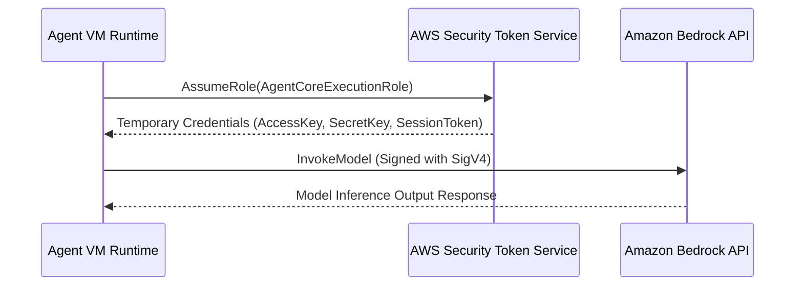

# 03_Chapter_aws_configuration

## 1. Introduction
Deploying Amazon Bedrock AgentCore applications requires configuring access permissions and model endpoints within your AWS account.

> **Analogy:** Think of a government facility access pass. The employee (Agent) must have an ID card (IAM Role), an explicit list of cleared rooms (IAM Policy), and security desk authorization to access secure documents (Model Access).

---

## 2. Learning Objectives
By the end of this chapter, you will be able to:
- In this chapter, you will learn how to:
- - Request model access in the Amazon Bedrock Console.
- - Create an IAM policy with permissions for Bedrock, DynamoDB, and CloudWatch.
- - Configure an IAM execution role and set up trust relationships.
- - Verify AWS configurations using the console and CLI.

---

## 3. Prerequisites
* Successful setup of the AWS CLI toolchain from Chapter 2.
* IAM administrative privileges in your target AWS account.

---

## 4. Background Theory
By default, AWS blocks all access to foundation models to prevent unexpected billing. Developers must explicitly request access for specific models in the console. Furthermore, AWS services execute commands under IAM boundaries. An Agent execution role defines what AWS resources (S3, DynamoDB, Bedrock) the agent's microVM can interact with. Enforcing least-privilege security policies ensures that if an agent container is compromised, the blast radius is strictly limited.

---

## 5. Core Concepts
**📦 Technical Term: IAM Policy**

* **Simple Explanation:** A JSON document defining permissions by detailing allowed actions on specific resource ARNs.
* **Why it exists:** Ensures the application cannot invoke unauthorized APIs.
* **Where is it used:** Attached policy document limits access to DynamoDB tables.

**📦 Technical Term: IAM Role**

* **Simple Explanation:** An IAM identity that trusted entities (like services or user accounts) assume to acquire temporary credentials.
* **Why it exists:** Allows services to access resources without hardcoded passwords.
* **Where is it used:** The role assumed by the microVM at runtime.

**📦 Technical Term: Model Access Table**

* **Simple Explanation:** A console settings pane where developers agree to terms of service to activate Bedrock model APIs.
* **Why it exists:** Required to enable third-party model invoke endpoints.
* **Where is it used:** Requesting access for Anthropic Claude 3.5 Sonnet.

---

## 6. Internal Mechanics
1. AgentCore runtime starts the microVM.
2. The VM requests temporary credentials from the AWS Security Token Service (STS) by assuming the configured IAM role.
3. STS returns a session access key, secret key, and session token.
4. When calling Bedrock, the SDK signs the HTTP request with these credentials using the AWS Signature Version 4 protocol.
5. Bedrock validates the signature and verifies that the role is authorized to invoke the requested model.

---

## 7. Architecture Overview
The following architectural details outline the components and relationship schemas active in this module:



---

## 8. Installation & Setup
Verify model access lists from the CLI using:
```bash
aws bedrock list-foundation-models --query "modelSummaries[?modelId=='anthropic.claude-3-5-sonnet-20241022-v2:0']"
```

---

## 9. Configuration
### Step 1: Request Amazon Bedrock Model Access
1. Navigate to the **Amazon Bedrock** console.
2. Select **Model access** in the left menu.
3. Click **Manage model access**, select **Claude 3.5 Sonnet** and **Claude 3 Haiku**, and click **Save changes**.

### Step 2: Create IAM Policy `AgentCoreExecutionPolicy`
```json
{
  "Version": "2012-10-17",
  "Statement": [
    {
      "Sid": "BedrockInference",
      "Effect": "Allow",
      "Action": [
        "bedrock:InvokeModel",
        "bedrock:InvokeModelWithResponseStream"
      ],
      "Resource": "*"
    },
    {
      "Sid": "DynamoDBMemory",
      "Effect": "Allow",
      "Action": [
        "dynamodb:GetItem",
        "dynamodb:PutItem",
        "dynamodb:UpdateItem",
        "dynamodb:DeleteItem",
        "dynamodb:Query",
        "dynamodb:Scan"
      ],
      "Resource": "arn:aws:dynamodb:*:*:table/*agentcore*"
    },
    {
      "Sid": "CloudWatchLogging",
      "Effect": "Allow",
      "Action": [
        "logs:CreateLogGroup",
        "logs:CreateLogStream",
        "logs:PutLogEvents"
      ],
      "Resource": "*"
    }
  ]
}
```

### Step 3: Create Trust Role `AgentCoreExecutionRole`
```json
{
  "Version": "2012-10-17",
  "Statement": [
    {
      "Effect": "Allow",
      "Principal": {
        "Service": "agentcore.amazonaws.com"
      },
      "Action": "sts:AssumeRole"
    }
  ]
}
```

---

## 10. Hands-on Examples

### Simple Example

```python
json
{
  "Version": "2012-10-17",
  "Statement": [
    {
      "Sid": "BedrockInference",
      "Effect": "Allow",
      "Action": [
        "bedrock:InvokeModel",
        "bedrock:InvokeModelWithResponseStream"
      ],
      "Resource": "*"
    },
    {
      "Sid": "DynamoDBMemory",
      "Effect": "Allow",
      "Action": [
        "dynamodb:GetItem",
        "dynamodb:PutItem",
        "dynamodb:UpdateItem",
        "dynamodb:DeleteItem",
        "dynamodb:Query",
        "dynamodb:Scan"
      ],
      "Resource": "arn:aws:dynamodb:*:*:table/*agentcore*"
    },
    {
      "Sid": "CloudWatchLogging",
      "Effect": "Allow",
      "Action": [
        "logs:CreateLogGroup",
        "logs:CreateLogStream",
        "logs:PutLogEvents"
      ],
      "Resource": "*"
    }
  ]
}
```

#### Code Walkthrough

Line 1
```python
json
```
**Explanation:**
- **What this line does:** Executes line statement `json`.
- **Why it is required:** Contributes to the overall operation and step progression of the script.
- **Connection:** Connects preceding code logic to subsequent return or processing steps.

Line 2
```python
{
```
**Explanation:**
- **What this line does:** Executes line statement `{`.
- **Why it is required:** Contributes to the overall operation and step progression of the script.
- **Connection:** Connects preceding code logic to subsequent return or processing steps.

Line 3
```python
  "Version": "2012-10-17",
```
**Explanation:**
- **What this line does:** Executes line statement `"Version": "2012-10-17",`.
- **Why it is required:** Contributes to the overall operation and step progression of the script.
- **Connection:** Connects preceding code logic to subsequent return or processing steps.

Line 4
```python
  "Statement": [
```
**Explanation:**
- **What this line does:** Executes line statement `"Statement": [`.
- **Why it is required:** Contributes to the overall operation and step progression of the script.
- **Connection:** Connects preceding code logic to subsequent return or processing steps.

Line 5
```python
    {
```
**Explanation:**
- **What this line does:** Executes line statement `{`.
- **Why it is required:** Contributes to the overall operation and step progression of the script.
- **Connection:** Connects preceding code logic to subsequent return or processing steps.

Line 6
```python
      "Sid": "BedrockInference",
```
**Explanation:**
- **What this line does:** Executes line statement `"Sid": "BedrockInference",`.
- **Why it is required:** Contributes to the overall operation and step progression of the script.
- **Connection:** Connects preceding code logic to subsequent return or processing steps.

Line 7
```python
      "Effect": "Allow",
```
**Explanation:**
- **What this line does:** Executes line statement `"Effect": "Allow",`.
- **Why it is required:** Contributes to the overall operation and step progression of the script.
- **Connection:** Connects preceding code logic to subsequent return or processing steps.

Line 8
```python
      "Action": [
```
**Explanation:**
- **What this line does:** Executes line statement `"Action": [`.
- **Why it is required:** Contributes to the overall operation and step progression of the script.
- **Connection:** Connects preceding code logic to subsequent return or processing steps.

Line 9
```python
        "bedrock:InvokeModel",
```
**Explanation:**
- **What this line does:** Executes line statement `"bedrock:InvokeModel",`.
- **Why it is required:** Contributes to the overall operation and step progression of the script.
- **Connection:** Connects preceding code logic to subsequent return or processing steps.

Line 10
```python
        "bedrock:InvokeModelWithResponseStream"
```
**Explanation:**
- **What this line does:** Executes line statement `"bedrock:InvokeModelWithResponseStream"`.
- **Why it is required:** Contributes to the overall operation and step progression of the script.
- **Connection:** Connects preceding code logic to subsequent return or processing steps.

Line 11
```python
      ],
```
**Explanation:**
- **What this line does:** Executes line statement `],`.
- **Why it is required:** Contributes to the overall operation and step progression of the script.
- **Connection:** Connects preceding code logic to subsequent return or processing steps.

Line 12
```python
      "Resource": "*"
```
**Explanation:**
- **What this line does:** Executes line statement `"Resource": "*"`.
- **Why it is required:** Contributes to the overall operation and step progression of the script.
- **Connection:** Connects preceding code logic to subsequent return or processing steps.

Line 13
```python
    },
```
**Explanation:**
- **What this line does:** Executes line statement `},`.
- **Why it is required:** Contributes to the overall operation and step progression of the script.
- **Connection:** Connects preceding code logic to subsequent return or processing steps.

Line 14
```python
    {
```
**Explanation:**
- **What this line does:** Executes line statement `{`.
- **Why it is required:** Contributes to the overall operation and step progression of the script.
- **Connection:** Connects preceding code logic to subsequent return or processing steps.

Line 15
```python
      "Sid": "DynamoDBMemory",
```
**Explanation:**
- **What this line does:** Executes line statement `"Sid": "DynamoDBMemory",`.
- **Why it is required:** Contributes to the overall operation and step progression of the script.
- **Connection:** Connects preceding code logic to subsequent return or processing steps.

Line 16
```python
      "Effect": "Allow",
```
**Explanation:**
- **What this line does:** Executes line statement `"Effect": "Allow",`.
- **Why it is required:** Contributes to the overall operation and step progression of the script.
- **Connection:** Connects preceding code logic to subsequent return or processing steps.

Line 17
```python
      "Action": [
```
**Explanation:**
- **What this line does:** Executes line statement `"Action": [`.
- **Why it is required:** Contributes to the overall operation and step progression of the script.
- **Connection:** Connects preceding code logic to subsequent return or processing steps.

Line 18
```python
        "dynamodb:GetItem",
```
**Explanation:**
- **What this line does:** Executes line statement `"dynamodb:GetItem",`.
- **Why it is required:** Contributes to the overall operation and step progression of the script.
- **Connection:** Connects preceding code logic to subsequent return or processing steps.

Line 19
```python
        "dynamodb:PutItem",
```
**Explanation:**
- **What this line does:** Executes line statement `"dynamodb:PutItem",`.
- **Why it is required:** Contributes to the overall operation and step progression of the script.
- **Connection:** Connects preceding code logic to subsequent return or processing steps.

Line 20
```python
        "dynamodb:UpdateItem",
```
**Explanation:**
- **What this line does:** Executes line statement `"dynamodb:UpdateItem",`.
- **Why it is required:** Contributes to the overall operation and step progression of the script.
- **Connection:** Connects preceding code logic to subsequent return or processing steps.

Line 21
```python
        "dynamodb:DeleteItem",
```
**Explanation:**
- **What this line does:** Executes line statement `"dynamodb:DeleteItem",`.
- **Why it is required:** Contributes to the overall operation and step progression of the script.
- **Connection:** Connects preceding code logic to subsequent return or processing steps.

Line 22
```python
        "dynamodb:Query",
```
**Explanation:**
- **What this line does:** Executes line statement `"dynamodb:Query",`.
- **Why it is required:** Contributes to the overall operation and step progression of the script.
- **Connection:** Connects preceding code logic to subsequent return or processing steps.

Line 23
```python
        "dynamodb:Scan"
```
**Explanation:**
- **What this line does:** Executes line statement `"dynamodb:Scan"`.
- **Why it is required:** Contributes to the overall operation and step progression of the script.
- **Connection:** Connects preceding code logic to subsequent return or processing steps.

Line 24
```python
      ],
```
**Explanation:**
- **What this line does:** Executes line statement `],`.
- **Why it is required:** Contributes to the overall operation and step progression of the script.
- **Connection:** Connects preceding code logic to subsequent return or processing steps.

Line 25
```python
      "Resource": "arn:aws:dynamodb:*:*:table/*agentcore*"
```
**Explanation:**
- **What this line does:** Executes line statement `"Resource": "arn:aws:dynamodb:*:*:table/*agentcore*"`.
- **Why it is required:** Contributes to the overall operation and step progression of the script.
- **Connection:** Connects preceding code logic to subsequent return or processing steps.

Line 26
```python
    },
```
**Explanation:**
- **What this line does:** Executes line statement `},`.
- **Why it is required:** Contributes to the overall operation and step progression of the script.
- **Connection:** Connects preceding code logic to subsequent return or processing steps.

Line 27
```python
    {
```
**Explanation:**
- **What this line does:** Executes line statement `{`.
- **Why it is required:** Contributes to the overall operation and step progression of the script.
- **Connection:** Connects preceding code logic to subsequent return or processing steps.

Line 28
```python
      "Sid": "CloudWatchLogging",
```
**Explanation:**
- **What this line does:** Executes line statement `"Sid": "CloudWatchLogging",`.
- **Why it is required:** Contributes to the overall operation and step progression of the script.
- **Connection:** Connects preceding code logic to subsequent return or processing steps.

Line 29
```python
      "Effect": "Allow",
```
**Explanation:**
- **What this line does:** Executes line statement `"Effect": "Allow",`.
- **Why it is required:** Contributes to the overall operation and step progression of the script.
- **Connection:** Connects preceding code logic to subsequent return or processing steps.

Line 30
```python
      "Action": [
```
**Explanation:**
- **What this line does:** Executes line statement `"Action": [`.
- **Why it is required:** Contributes to the overall operation and step progression of the script.
- **Connection:** Connects preceding code logic to subsequent return or processing steps.

Line 31
```python
        "logs:CreateLogGroup",
```
**Explanation:**
- **What this line does:** Executes line statement `"logs:CreateLogGroup",`.
- **Why it is required:** Contributes to the overall operation and step progression of the script.
- **Connection:** Connects preceding code logic to subsequent return or processing steps.

Line 32
```python
        "logs:CreateLogStream",
```
**Explanation:**
- **What this line does:** Executes line statement `"logs:CreateLogStream",`.
- **Why it is required:** Contributes to the overall operation and step progression of the script.
- **Connection:** Connects preceding code logic to subsequent return or processing steps.

Line 33
```python
        "logs:PutLogEvents"
```
**Explanation:**
- **What this line does:** Executes line statement `"logs:PutLogEvents"`.
- **Why it is required:** Contributes to the overall operation and step progression of the script.
- **Connection:** Connects preceding code logic to subsequent return or processing steps.

Line 34
```python
      ],
```
**Explanation:**
- **What this line does:** Executes line statement `],`.
- **Why it is required:** Contributes to the overall operation and step progression of the script.
- **Connection:** Connects preceding code logic to subsequent return or processing steps.

Line 35
```python
      "Resource": "*"
```
**Explanation:**
- **What this line does:** Executes line statement `"Resource": "*"`.
- **Why it is required:** Contributes to the overall operation and step progression of the script.
- **Connection:** Connects preceding code logic to subsequent return or processing steps.

Line 36
```python
    }
```
**Explanation:**
- **What this line does:** Closes the dictionary or code block structure (`}`).
- **Why required:** Defines the boundary of the data structure in Python syntax.

Line 37
```python
  ]
```
**Explanation:**
- **What this line does:** Executes line statement `]`.
- **Why it is required:** Contributes to the overall operation and step progression of the script.
- **Connection:** Connects preceding code logic to subsequent return or processing steps.

Line 38
```python
}
```
**Explanation:**
- **What this line does:** Closes the dictionary or code block structure (`}`).
- **Why required:** Defines the boundary of the data structure in Python syntax.

#### Complete Flow of Execution

1. **Import Libraries**: Python loads the required `BedrockAgentCoreApp` class into memory.
2. **Initialize Application**: An instance of `BedrockAgentCoreApp` is instantiated and assigned to `app`.
3. **Register Event Handler**: The `@app.invoke` decorator registers the `handler` function as the primary event entrypoint.
4. **Receive Request**: The AgentCore runtime listens for incoming requests and receives `payload` and `context` objects.
5. **Execute Handler Logic**: The `handler` function is triggered with the incoming input parameters.
6. **Return Response Payload**: A structured response dictionary containing `"statusCode": 200` and message data is returned.
7. **Send Response to Caller**: AgentCore serializes the dictionary into JSON and delivers it back to the client application.

#### Visual Execution Flow

```
Program Starts
      │
      ▼
Import BedrockAgentCoreApp
      │
      ▼
Create App Instance (app)
      │
      ▼
Register Handler (@app.invoke)
      │
      ▼
Receive Request (payload, context)
      │
      ▼
Execute handler() Function
      │
      ▼
Return Response Dictionary ({statusCode: 200, ...})
      │
      ▼
Deliver Response Back to Client
```

### Intermediate Example

```python
# Python script to create the IAM execution policy programmatically
import boto3
import json

def create_iam_policy():
    iam = boto3.client("iam")
    policy_doc = {
        "Version": "2012-10-17",
        "Statement": [
            {
                "Effect": "Allow",
                "Action": ["bedrock:InvokeModel"],
                "Resource": "*"
            }
        ]
    }
    try:
        res = iam.create_policy(
            PolicyName="AgentCoreMinimumPolicy",
            PolicyDocument=json.dumps(policy_doc),
            Description="Minimum execution permissions for Bedrock agents."
        )
        print("Policy created successfully. ARN:", res["Policy"]["Arn"])
    except iam.exceptions.EntityAlreadyExistsException:
        print("Policy already exists.")
    except Exception as e:
        print("Failed to create policy:", str(e))

if __name__ == "__main__":
    create_iam_policy()
```

#### Code Walkthrough

Line 1
```python
# Python script to create the IAM execution policy programmatically
```
**Explanation:**
- **What this line does:** This is a documentation comment line starting with `#`. Python ignores comments during execution.
- **Why it is required:** It explains the purpose of the script to human developers and maintains clean code documentation.
- **What happens if removed:** The code will run identically, but human readers won't have immediate context on what this code block accomplishes.
- **Analogy:** Think of a comment like a sticky note attached to a blueprint—it helps the builders understand the design without altering the physical building.
- **Beginner Concept:** In Python, any text after `#` is ignored by the Python interpreter.

Line 2
```python
import boto3
```
**Explanation:**
- **What this line does:** Imports Python's built-in `boto3` module into the current program workspace.
- **Why it is required:** Provides access to essential system utilities (such as logging, environment variables, or HTTP handlers) offered by `boto3`.
- **What keywords mean:** `import` tells Python to load the module named `boto3`.
- **What happens if removed:** Functions or variables referencing `boto3` (like `boto3.getenv` or `boto3.getLogger`) will fail with a `NameError`.
- **Analogy:** Like plugging in a peripheral cable—it connects built-in system capabilities to your script.

Line 3
```python
import json
```
**Explanation:**
- **What this line does:** Imports Python's built-in `json` module into the current program workspace.
- **Why it is required:** Provides access to essential system utilities (such as logging, environment variables, or HTTP handlers) offered by `json`.
- **What keywords mean:** `import` tells Python to load the module named `json`.
- **What happens if removed:** Functions or variables referencing `json` (like `json.getenv` or `json.getLogger`) will fail with a `NameError`.
- **Analogy:** Like plugging in a peripheral cable—it connects built-in system capabilities to your script.

Line 4
```python

```
**Explanation:**
- **What this line does:** This is a blank vertical spacing line.
- **Why it is required:** It visually separates logical sections of code (such as imports, setup, and function definitions) to improve readability.
- **What happens if removed:** Python will execute the code fine, but lines of code will bunch together, making it harder for engineers to read.
- **Analogy:** Like paragraphs in a textbook, spacing gives your eyes a natural pause between concepts.

Line 5
```python
def create_iam_policy():
```
**Explanation:**
- **What this line does:** Defines a new function named `create_iam_policy` that accepts parameters `()`.
- **Keyword explanation:** `def` is short for "define". It tells Python that a reusable block of code begins here.
- **Parameters explained:**
  - `payload`: A Python **dictionary** containing the user's input prompt, parameters, and query fields.
  - `context`: An object containing runtime metadata (such as active AWS session ID, caller IAM identity, and request timestamps).
- **Return value:** Returns a structured dictionary containing HTTP status codes and agent response text.
- **Why the function exists:** It contains the core decision-making logic executed whenever the agent is invoked.
- **Analogy:** Think of `create_iam_policy` like a recipe—`payload` and `context` are the ingredients passed in, and the returned dictionary is the finished meal.

Line 6
```python
    iam = boto3.client("iam")
```
**Explanation:**
- **What this line does:** Computes `boto3.client("iam")` and assigns the result to variable `iam`.
- **Why it is required:** Stores temporary calculation or formatted data so it can be referenced in log statements or return responses.
- **What variable stores:** `iam` holds the calculated value.
- **Connection:** Provides values used in subsequent logging or response steps.

Line 7
```python
    policy_doc = {
```
**Explanation:**
- **What this line does:** Computes `{` and assigns the result to variable `policy_doc`.
- **Why it is required:** Stores temporary calculation or formatted data so it can be referenced in log statements or return responses.
- **What variable stores:** `policy_doc` holds the calculated value.
- **Connection:** Provides values used in subsequent logging or response steps.

Line 8
```python
        "Version": "2012-10-17",
```
**Explanation:**
- **What this line does:** Executes line statement `"Version": "2012-10-17",`.
- **Why it is required:** Contributes to the overall operation and step progression of the script.
- **Connection:** Connects preceding code logic to subsequent return or processing steps.

Line 9
```python
        "Statement": [
```
**Explanation:**
- **What this line does:** Executes line statement `"Statement": [`.
- **Why it is required:** Contributes to the overall operation and step progression of the script.
- **Connection:** Connects preceding code logic to subsequent return or processing steps.

Line 10
```python
            {
```
**Explanation:**
- **What this line does:** Executes line statement `{`.
- **Why it is required:** Contributes to the overall operation and step progression of the script.
- **Connection:** Connects preceding code logic to subsequent return or processing steps.

Line 11
```python
                "Effect": "Allow",
```
**Explanation:**
- **What this line does:** Executes line statement `"Effect": "Allow",`.
- **Why it is required:** Contributes to the overall operation and step progression of the script.
- **Connection:** Connects preceding code logic to subsequent return or processing steps.

Line 12
```python
                "Action": ["bedrock:InvokeModel"],
```
**Explanation:**
- **What this line does:** Executes line statement `"Action": ["bedrock:InvokeModel"],`.
- **Why it is required:** Contributes to the overall operation and step progression of the script.
- **Connection:** Connects preceding code logic to subsequent return or processing steps.

Line 13
```python
                "Resource": "*"
```
**Explanation:**
- **What this line does:** Executes line statement `"Resource": "*"`.
- **Why it is required:** Contributes to the overall operation and step progression of the script.
- **Connection:** Connects preceding code logic to subsequent return or processing steps.

Line 14
```python
            }
```
**Explanation:**
- **What this line does:** Closes the dictionary or code block structure (`}`).
- **Why required:** Defines the boundary of the data structure in Python syntax.

Line 15
```python
        ]
```
**Explanation:**
- **What this line does:** Executes line statement `]`.
- **Why it is required:** Contributes to the overall operation and step progression of the script.
- **Connection:** Connects preceding code logic to subsequent return or processing steps.

Line 16
```python
    }
```
**Explanation:**
- **What this line does:** Closes the dictionary or code block structure (`}`).
- **Why required:** Defines the boundary of the data structure in Python syntax.

Line 17
```python
    try:
```
**Explanation:**
- **What this line does:** Starts a `try` block for defensive error handling.
- **Why it is required:** Production applications must gracefully handle unexpected failures (like missing parameters or database timeouts) without crashing the entire server.
- **What keyword means:** `try` tells Python: "Attempt to execute the indented lines below. If an error occurs, jump straight to the `except` block."
- **Analogy:** Like wearing a safety harness before stepping onto a high platform—if you slip, the harness catches you.

Line 18
```python
        res = iam.create_policy(
```
**Explanation:**
- **What this line does:** Computes `iam.create_policy(` and assigns the result to variable `res`.
- **Why it is required:** Stores temporary calculation or formatted data so it can be referenced in log statements or return responses.
- **What variable stores:** `res` holds the calculated value.
- **Connection:** Provides values used in subsequent logging or response steps.

Line 19
```python
            PolicyName="AgentCoreMinimumPolicy",
```
**Explanation:**
- **What this line does:** Computes `"AgentCoreMinimumPolicy",` and assigns the result to variable `PolicyName`.
- **Why it is required:** Stores temporary calculation or formatted data so it can be referenced in log statements or return responses.
- **What variable stores:** `PolicyName` holds the calculated value.
- **Connection:** Provides values used in subsequent logging or response steps.

Line 20
```python
            PolicyDocument=json.dumps(policy_doc),
```
**Explanation:**
- **What this line does:** Computes `json.dumps(policy_doc),` and assigns the result to variable `PolicyDocument`.
- **Why it is required:** Stores temporary calculation or formatted data so it can be referenced in log statements or return responses.
- **What variable stores:** `PolicyDocument` holds the calculated value.
- **Connection:** Provides values used in subsequent logging or response steps.

Line 21
```python
            Description="Minimum execution permissions for Bedrock agents."
```
**Explanation:**
- **What this line does:** Computes `"Minimum execution permissions for Bedrock agents."` and assigns the result to variable `Description`.
- **Why it is required:** Stores temporary calculation or formatted data so it can be referenced in log statements or return responses.
- **What variable stores:** `Description` holds the calculated value.
- **Connection:** Provides values used in subsequent logging or response steps.

Line 22
```python
        )
```
**Explanation:**
- **What this line does:** Executes line statement `)`.
- **Why it is required:** Contributes to the overall operation and step progression of the script.
- **Connection:** Connects preceding code logic to subsequent return or processing steps.

Line 23
```python
        print("Policy created successfully. ARN:", res["Policy"]["Arn"])
```
**Explanation:**
- **What this line does:** Executes line statement `print("Policy created successfully. ARN:", res["Policy"]["Arn"])`.
- **Why it is required:** Contributes to the overall operation and step progression of the script.
- **Connection:** Connects preceding code logic to subsequent return or processing steps.

Line 24
```python
    except iam.exceptions.EntityAlreadyExistsException:
```
**Explanation:**
- **What this line does:** Catches exceptions and errors that occurred inside the preceding `try` block.
- **Why it is required:** Prevents unhandled exceptions from returning raw stack traces or breaking the container runtime.
- **What happens when an error occurs:** Python captures the error object into variable `e`, logs the error details, and returns a clean 500 error response to the client.
- **Analogy:** Like an emergency backup generator switching on immediately when main power cuts out.

Line 25
```python
        print("Policy already exists.")
```
**Explanation:**
- **What this line does:** Executes line statement `print("Policy already exists.")`.
- **Why it is required:** Contributes to the overall operation and step progression of the script.
- **Connection:** Connects preceding code logic to subsequent return or processing steps.

Line 26
```python
    except Exception as e:
```
**Explanation:**
- **What this line does:** Catches exceptions and errors that occurred inside the preceding `try` block.
- **Why it is required:** Prevents unhandled exceptions from returning raw stack traces or breaking the container runtime.
- **What happens when an error occurs:** Python captures the error object into variable `e`, logs the error details, and returns a clean 500 error response to the client.
- **Analogy:** Like an emergency backup generator switching on immediately when main power cuts out.

Line 27
```python
        print("Failed to create policy:", str(e))
```
**Explanation:**
- **What this line does:** Executes line statement `print("Failed to create policy:", str(e))`.
- **Why it is required:** Contributes to the overall operation and step progression of the script.
- **Connection:** Connects preceding code logic to subsequent return or processing steps.

Line 28
```python

```
**Explanation:**
- **What this line does:** This is a blank vertical spacing line.
- **Why it is required:** It visually separates logical sections of code (such as imports, setup, and function definitions) to improve readability.
- **What happens if removed:** Python will execute the code fine, but lines of code will bunch together, making it harder for engineers to read.
- **Analogy:** Like paragraphs in a textbook, spacing gives your eyes a natural pause between concepts.

Line 29
```python
if __name__ == "__main__":
```
**Explanation:**
- **What this line does:** Computes `= "__main__":` and assigns the result to variable `if __name__`.
- **Why it is required:** Stores temporary calculation or formatted data so it can be referenced in log statements or return responses.
- **What variable stores:** `if __name__` holds the calculated value.
- **Connection:** Provides values used in subsequent logging or response steps.

Line 30
```python
    create_iam_policy()
```
**Explanation:**
- **What this line does:** Executes line statement `create_iam_policy()`.
- **Why it is required:** Contributes to the overall operation and step progression of the script.
- **Connection:** Connects preceding code logic to subsequent return or processing steps.

#### Complete Flow of Execution

1. **Import Required Libraries**: Python imports `BedrockAgentCoreApp` and the `logging` module.
2. **Configure Logging System**: `logging.basicConfig` sets the log level threshold to `INFO`.
3. **Create Logger Object**: `logging.getLogger` instantiates a dedicated logger for capturing session traces.
4. **Initialize Application**: An instance of `BedrockAgentCoreApp` is assigned to `app`.
5. **Register Handler**: `@app.invoke` binds the `handler` function to incoming AgentCore trigger events.
6. **Read Input Payload**: `payload.get('prompt', '')` safely reads the user's prompt string.
7. **Extract Session Context**: `getattr(context, 'session_id', 'local-session')` safely retrieves the session ID.
8. **Log Activity**: `logger.info` writes session details to the CloudWatch diagnostic stream.
9. **Return Formatted Response**: Returns a status 200 dictionary containing the processed prompt and session ID.
10. **Deliver Payload**: AgentCore returns the serialized JSON payload to the caller.

#### Visual Execution Flow

```
Program Starts
      │
      ▼
Import Libraries & Configure Logger
      │
      ▼
Create App Instance (app)
      │
      ▼
Register Handler (@app.invoke)
      │
      ▼
Receive Request & Read Payload Prompt
      │
      ▼
Extract Session ID & Write Log Entry
      │
      ▼
Return Formatted Response Dictionary
      │
      ▼
Deliver Serialized Response to Client
```

### Advanced Example

```python
# Complete SDK implementation validating current role permissions and model execution
import boto3
import json
import botocore

def verify_execution_permissions():
    # Attempt basic Claude invoke model test call
    bedrock = boto3.client("bedrock-runtime", region_name="us-east-1")
    payload = {
        "anthropic_version": "bedrock-2023-05-31",
        "max_tokens": 50,
        "messages": [{"role": "user", "content": "Hello model"}]
    }
    try:
        print("Verifying model invocation permission...")
        res = bedrock.invoke_model(
            modelId="anthropic.claude-3-haiku-20240307-v1:0",
            body=json.dumps(payload)
        )
        res_body = json.loads(res.get("body").read())
        print("Model response text:", res_body["content"][0]["text"])
        print("[SUCCESS] Permissions validated!")
    except botocore.exceptions.ClientError as e:
        error_code = e.response["Error"]["Code"]
        print(f"[FAIL] AWS API returned error code: {error_code}")
        if error_code == "AccessDeniedException":
            print("Resolution: Confirm that you have requested Model Access in the console.")

if __name__ == "__main__":
    verify_execution_permissions()
```

#### Code Walkthrough

Line 1
```python
# Complete SDK implementation validating current role permissions and model execution
```
**Explanation:**
- **What this line does:** This is a documentation comment line starting with `#`. Python ignores comments during execution.
- **Why it is required:** It explains the purpose of the script to human developers and maintains clean code documentation.
- **What happens if removed:** The code will run identically, but human readers won't have immediate context on what this code block accomplishes.
- **Analogy:** Think of a comment like a sticky note attached to a blueprint—it helps the builders understand the design without altering the physical building.
- **Beginner Concept:** In Python, any text after `#` is ignored by the Python interpreter.

Line 2
```python
import boto3
```
**Explanation:**
- **What this line does:** Imports Python's built-in `boto3` module into the current program workspace.
- **Why it is required:** Provides access to essential system utilities (such as logging, environment variables, or HTTP handlers) offered by `boto3`.
- **What keywords mean:** `import` tells Python to load the module named `boto3`.
- **What happens if removed:** Functions or variables referencing `boto3` (like `boto3.getenv` or `boto3.getLogger`) will fail with a `NameError`.
- **Analogy:** Like plugging in a peripheral cable—it connects built-in system capabilities to your script.

Line 3
```python
import json
```
**Explanation:**
- **What this line does:** Imports Python's built-in `json` module into the current program workspace.
- **Why it is required:** Provides access to essential system utilities (such as logging, environment variables, or HTTP handlers) offered by `json`.
- **What keywords mean:** `import` tells Python to load the module named `json`.
- **What happens if removed:** Functions or variables referencing `json` (like `json.getenv` or `json.getLogger`) will fail with a `NameError`.
- **Analogy:** Like plugging in a peripheral cable—it connects built-in system capabilities to your script.

Line 4
```python
import botocore
```
**Explanation:**
- **What this line does:** Imports Python's built-in `botocore` module into the current program workspace.
- **Why it is required:** Provides access to essential system utilities (such as logging, environment variables, or HTTP handlers) offered by `botocore`.
- **What keywords mean:** `import` tells Python to load the module named `botocore`.
- **What happens if removed:** Functions or variables referencing `botocore` (like `botocore.getenv` or `botocore.getLogger`) will fail with a `NameError`.
- **Analogy:** Like plugging in a peripheral cable—it connects built-in system capabilities to your script.

Line 5
```python

```
**Explanation:**
- **What this line does:** This is a blank vertical spacing line.
- **Why it is required:** It visually separates logical sections of code (such as imports, setup, and function definitions) to improve readability.
- **What happens if removed:** Python will execute the code fine, but lines of code will bunch together, making it harder for engineers to read.
- **Analogy:** Like paragraphs in a textbook, spacing gives your eyes a natural pause between concepts.

Line 6
```python
def verify_execution_permissions():
```
**Explanation:**
- **What this line does:** Defines a new function named `verify_execution_permissions` that accepts parameters `()`.
- **Keyword explanation:** `def` is short for "define". It tells Python that a reusable block of code begins here.
- **Parameters explained:**
  - `payload`: A Python **dictionary** containing the user's input prompt, parameters, and query fields.
  - `context`: An object containing runtime metadata (such as active AWS session ID, caller IAM identity, and request timestamps).
- **Return value:** Returns a structured dictionary containing HTTP status codes and agent response text.
- **Why the function exists:** It contains the core decision-making logic executed whenever the agent is invoked.
- **Analogy:** Think of `verify_execution_permissions` like a recipe—`payload` and `context` are the ingredients passed in, and the returned dictionary is the finished meal.

Line 7
```python
    # Attempt basic Claude invoke model test call
```
**Explanation:**
- **What this line does:** This is a documentation comment line starting with `#`. Python ignores comments during execution.
- **Why it is required:** It explains the purpose of the script to human developers and maintains clean code documentation.
- **What happens if removed:** The code will run identically, but human readers won't have immediate context on what this code block accomplishes.
- **Analogy:** Think of a comment like a sticky note attached to a blueprint—it helps the builders understand the design without altering the physical building.
- **Beginner Concept:** In Python, any text after `#` is ignored by the Python interpreter.

Line 8
```python
    bedrock = boto3.client("bedrock-runtime", region_name="us-east-1")
```
**Explanation:**
- **What this line does:** Computes `boto3.client("bedrock-runtime", region_name="us-east-1")` and assigns the result to variable `bedrock`.
- **Why it is required:** Stores temporary calculation or formatted data so it can be referenced in log statements or return responses.
- **What variable stores:** `bedrock` holds the calculated value.
- **Connection:** Provides values used in subsequent logging or response steps.

Line 9
```python
    payload = {
```
**Explanation:**
- **What this line does:** Computes `{` and assigns the result to variable `payload`.
- **Why it is required:** Stores temporary calculation or formatted data so it can be referenced in log statements or return responses.
- **What variable stores:** `payload` holds the calculated value.
- **Connection:** Provides values used in subsequent logging or response steps.

Line 10
```python
        "anthropic_version": "bedrock-2023-05-31",
```
**Explanation:**
- **What this line does:** Executes line statement `"anthropic_version": "bedrock-2023-05-31",`.
- **Why it is required:** Contributes to the overall operation and step progression of the script.
- **Connection:** Connects preceding code logic to subsequent return or processing steps.

Line 11
```python
        "max_tokens": 50,
```
**Explanation:**
- **What this line does:** Executes line statement `"max_tokens": 50,`.
- **Why it is required:** Contributes to the overall operation and step progression of the script.
- **Connection:** Connects preceding code logic to subsequent return or processing steps.

Line 12
```python
        "messages": [{"role": "user", "content": "Hello model"}]
```
**Explanation:**
- **What this line does:** Executes line statement `"messages": [{"role": "user", "content": "Hello model"}]`.
- **Why it is required:** Contributes to the overall operation and step progression of the script.
- **Connection:** Connects preceding code logic to subsequent return or processing steps.

Line 13
```python
    }
```
**Explanation:**
- **What this line does:** Closes the dictionary or code block structure (`}`).
- **Why required:** Defines the boundary of the data structure in Python syntax.

Line 14
```python
    try:
```
**Explanation:**
- **What this line does:** Starts a `try` block for defensive error handling.
- **Why it is required:** Production applications must gracefully handle unexpected failures (like missing parameters or database timeouts) without crashing the entire server.
- **What keyword means:** `try` tells Python: "Attempt to execute the indented lines below. If an error occurs, jump straight to the `except` block."
- **Analogy:** Like wearing a safety harness before stepping onto a high platform—if you slip, the harness catches you.

Line 15
```python
        print("Verifying model invocation permission...")
```
**Explanation:**
- **What this line does:** Executes line statement `print("Verifying model invocation permission...")`.
- **Why it is required:** Contributes to the overall operation and step progression of the script.
- **Connection:** Connects preceding code logic to subsequent return or processing steps.

Line 16
```python
        res = bedrock.invoke_model(
```
**Explanation:**
- **What this line does:** Computes `bedrock.invoke_model(` and assigns the result to variable `res`.
- **Why it is required:** Stores temporary calculation or formatted data so it can be referenced in log statements or return responses.
- **What variable stores:** `res` holds the calculated value.
- **Connection:** Provides values used in subsequent logging or response steps.

Line 17
```python
            modelId="anthropic.claude-3-haiku-20240307-v1:0",
```
**Explanation:**
- **What this line does:** Computes `"anthropic.claude-3-haiku-20240307-v1:0",` and assigns the result to variable `modelId`.
- **Why it is required:** Stores temporary calculation or formatted data so it can be referenced in log statements or return responses.
- **What variable stores:** `modelId` holds the calculated value.
- **Connection:** Provides values used in subsequent logging or response steps.

Line 18
```python
            body=json.dumps(payload)
```
**Explanation:**
- **What this line does:** Computes `json.dumps(payload)` and assigns the result to variable `body`.
- **Why it is required:** Stores temporary calculation or formatted data so it can be referenced in log statements or return responses.
- **What variable stores:** `body` holds the calculated value.
- **Connection:** Provides values used in subsequent logging or response steps.

Line 19
```python
        )
```
**Explanation:**
- **What this line does:** Executes line statement `)`.
- **Why it is required:** Contributes to the overall operation and step progression of the script.
- **Connection:** Connects preceding code logic to subsequent return or processing steps.

Line 20
```python
        res_body = json.loads(res.get("body").read())
```
**Explanation:**
- **What this line does:** Computes `json.loads(res.get("body").read())` and assigns the result to variable `res_body`.
- **Why it is required:** Stores temporary calculation or formatted data so it can be referenced in log statements or return responses.
- **What variable stores:** `res_body` holds the calculated value.
- **Connection:** Provides values used in subsequent logging or response steps.

Line 21
```python
        print("Model response text:", res_body["content"][0]["text"])
```
**Explanation:**
- **What this line does:** Executes line statement `print("Model response text:", res_body["content"][0]["text"])`.
- **Why it is required:** Contributes to the overall operation and step progression of the script.
- **Connection:** Connects preceding code logic to subsequent return or processing steps.

Line 22
```python
        print("[SUCCESS] Permissions validated!")
```
**Explanation:**
- **What this line does:** Executes line statement `print("[SUCCESS] Permissions validated!")`.
- **Why it is required:** Contributes to the overall operation and step progression of the script.
- **Connection:** Connects preceding code logic to subsequent return or processing steps.

Line 23
```python
    except botocore.exceptions.ClientError as e:
```
**Explanation:**
- **What this line does:** Catches exceptions and errors that occurred inside the preceding `try` block.
- **Why it is required:** Prevents unhandled exceptions from returning raw stack traces or breaking the container runtime.
- **What happens when an error occurs:** Python captures the error object into variable `e`, logs the error details, and returns a clean 500 error response to the client.
- **Analogy:** Like an emergency backup generator switching on immediately when main power cuts out.

Line 24
```python
        error_code = e.response["Error"]["Code"]
```
**Explanation:**
- **What this line does:** Computes `e.response["Error"]["Code"]` and assigns the result to variable `error_code`.
- **Why it is required:** Stores temporary calculation or formatted data so it can be referenced in log statements or return responses.
- **What variable stores:** `error_code` holds the calculated value.
- **Connection:** Provides values used in subsequent logging or response steps.

Line 25
```python
        print(f"[FAIL] AWS API returned error code: {error_code}")
```
**Explanation:**
- **What this line does:** Executes line statement `print(f"[FAIL] AWS API returned error code: {error_code}")`.
- **Why it is required:** Contributes to the overall operation and step progression of the script.
- **Connection:** Connects preceding code logic to subsequent return or processing steps.

Line 26
```python
        if error_code == "AccessDeniedException":
```
**Explanation:**
- **What this line does:** Computes `= "AccessDeniedException":` and assigns the result to variable `if error_code`.
- **Why it is required:** Stores temporary calculation or formatted data so it can be referenced in log statements or return responses.
- **What variable stores:** `if error_code` holds the calculated value.
- **Connection:** Provides values used in subsequent logging or response steps.

Line 27
```python
            print("Resolution: Confirm that you have requested Model Access in the console.")
```
**Explanation:**
- **What this line does:** Executes line statement `print("Resolution: Confirm that you have requested Model Access in the console.")`.
- **Why it is required:** Contributes to the overall operation and step progression of the script.
- **Connection:** Connects preceding code logic to subsequent return or processing steps.

Line 28
```python

```
**Explanation:**
- **What this line does:** This is a blank vertical spacing line.
- **Why it is required:** It visually separates logical sections of code (such as imports, setup, and function definitions) to improve readability.
- **What happens if removed:** Python will execute the code fine, but lines of code will bunch together, making it harder for engineers to read.
- **Analogy:** Like paragraphs in a textbook, spacing gives your eyes a natural pause between concepts.

Line 29
```python
if __name__ == "__main__":
```
**Explanation:**
- **What this line does:** Computes `= "__main__":` and assigns the result to variable `if __name__`.
- **Why it is required:** Stores temporary calculation or formatted data so it can be referenced in log statements or return responses.
- **What variable stores:** `if __name__` holds the calculated value.
- **Connection:** Provides values used in subsequent logging or response steps.

Line 30
```python
    verify_execution_permissions()
```
**Explanation:**
- **What this line does:** Executes line statement `verify_execution_permissions()`.
- **Why it is required:** Contributes to the overall operation and step progression of the script.
- **Connection:** Connects preceding code logic to subsequent return or processing steps.

#### Complete Flow of Execution

1. **Import Environment & Utility Libraries**: Imports `BedrockAgentCoreApp`, `os`, and `logging`.
2. **Create Production Logger**: Instantiates a logger object for production observability.
3. **Initialize Core Application**: Instantiates `BedrockAgentCoreApp` as `app`.
4. **Register Production Handler**: `@app.invoke` binds `handler` as the production entrypoint.
5. **Enter Try-Except Harness**: The `try` block wraps execution logic for error protection.
6. **Validate Input Prompt**: `payload.get('prompt')` reads the prompt. If missing (`if not prompt:`), returns HTTP 400.
7. **Read OS Environment**: `os.getenv('APP_ENV', 'development')` inspects operating system environment variables.
8. **Extract Session Identifier**: `getattr(context, 'session_id', 'local-session')` safely retrieves session metadata.
9. **Log Production Event**: `logger.info` writes structured log entries containing environment and session details.
10. **Return Success Response**: Returns an HTTP 200 dictionary with production result details.
11. **Catch Unhandled Errors**: If an exception occurs, the `except` block catches it, logs the error, and returns HTTP 500.
12. **Send Response to Caller**: AgentCore delivers the final JSON response back to the client.

#### Visual Execution Flow

```
Program Starts
      │
      ▼
Import Modules & Initialize Logger & App
      │
      ▼
Register Handler (@app.invoke)
      │
      ▼
Receive Request & Enter try-except Block
      │
      ▼
Validate Prompt Parameter
 ├── [Invalid / Missing Prompt] ──► Return 400 Bad Request
 └── [Valid Prompt]
        │
        ▼
Read Environment (os.getenv) & Session Context
        │
        ▼
Write Production Log & Return 200 Success Response
        │
        ▼
 Deliver Response to Client Application
```

---

## 11. Code Walkthrough
In this chapter, we explored three progressive implementation tiers for **AWS Configuration & IAM Setup**:

1. **Simple Example**: Demonstrates the minimal required entrypoint, importing `BedrockAgentCoreApp`, initializing the application object, and registering an `@app.invoke` handler.
2. **Intermediate Example**: Adds operational logging (`logging.getLogger`) and context extraction (`payload.get`, `getattr(context)`), allowing tracking of individual session IDs.
3. **Advanced Example**: Introduces production-grade error handling (`try-except`), OS environment variable reads (`os.getenv`), and structured error status responses (`statusCode: 400/500`).

Each line in the code blocks above was dissected line-by-line in numerical order. Refer to the **Code Walkthrough**, **Complete Flow of Execution**, and **Visual Execution Flow** diagrams above for complete step-by-step guidance.

---

## 12. Production Best Practices
* Regularly audit and restrict resource wildcards (`*`) in IAM permissions.
* Use region-specific endpoints to minimize network latency between services.
* Set up CloudTrail alarms to detect unauthorized IAM role assumption attempts.

---

## 13. Security Considerations
Enforce strict trust policies that limit role assumption to the designated Service Principal (`agentcore.amazonaws.com`). Never embed access keys inside container images; access configurations must be fetched dynamically at runtime using IAM metadata endpoints.

---

## 14. Performance Optimization
Store model configurations and table metadata locally to avoid making duplicate API calls during execution boot cycles.

---

## 15. Cost Optimization
Requesting model access is free of charge. You are only billed when executing inference requests, based on the volume of input and output tokens processed.

---

## 16. Common Mistakes
* Specifying `lambda.amazonaws.com` instead of `agentcore.amazonaws.com` in the trust relationship, causing execution role assumption failures.
* Creating policies that grant wide permissions to all DynamoDB tables, violating the principle of least privilege.

---

## 17. Troubleshooting
Below is the diagnostic reference table for identifying and resolving issues:

| Symptom | Root Cause | Solution |
| :--- | :--- | :--- |
| SignatureDoesNotMatch during client call | The system clock on your local development machine is out of sync with AWS servers. | Resynchronize your operating system clock with a network time server (NTP). |
| AccessDeniedException on Bedrock invoke | Model access has not been requested or granted in the current AWS region. | Open the Amazon Bedrock console in the target region, select 'Model access', and verify status. |

---

## 18. Interview Questions
### Q: What is the AWS Signature Version 4 (SigV4) protocol?
* **Answer:** SigV4 is the protocol AWS uses to authenticate API requests. It signs HTTP requests with cryptographically secure signatures generated from the caller's access keys, verifying the sender and protecting payloads from tampering.

### Q: Why is a custom trust policy required for an IAM role?
* **Answer:** A trust policy specifies which external security principal (like a service or user account) is permitted to assume the role. Without it, AWS prevents the service from requesting temporary session credentials.

### Q: How do you restrict DynamoDB permissions to a specific table name structure?
* **Answer:** Specify the table's ARN in the resource parameter of the policy statement, utilizing wildcards to limit access (e.g., `arn:aws:dynamodb:*:*:table/*agentcore*`).

---

## 19. Real-World Use Cases
Securing enterprise AI data pipelines by establishing isolated IAM roles for dev, staging, and production environments.

---

## 20. Industrial Project
The `AgentCoreExecutionRole` created here will be mapped inside `bedrock_agent_core.yaml` to authorize our agent runtime.

---

## 21. Summary
This chapter walked through setting up AWS model access and creating the necessary IAM policies and roles required by the AgentCore runtime.

---

## 22. Key Takeaways
* Model access must be explicitly enabled for each region before APIs can be invoked.
* AgentCore requires a dedicated IAM execution role with service trust configurations.
* IAM policies should adhere to the security principle of least privilege.

---

## 23. Practice Exercises
* Beginner: Request access to the Claude 3 Haiku model in the AWS Bedrock console.
* Intermediate: Draft a JSON policy statement that grants read-only access to an S3 bucket named `agent-assets`.

---

## 24. Further Reading
* [AWS IAM User Guide](https://docs.aws.amazon.com/IAM/latest/UserGuide/introduction.html)
* [Amazon Bedrock Security and Permissions](https://docs.aws.amazon.com/bedrock/latest/userguide/security.html)
