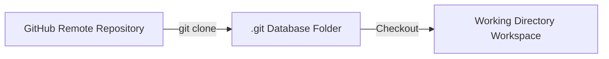

# 04_Chapter_clone_repository

## 1. Introduction
Developing Bedrock AgentCore applications begins by cloning and inspecting the official sample repository.

> **Analogy:** Before modifying a machine, an engineer downloads the manufacturing blueprint files. This ensures they have the correct schematics, part numbers, and files before changing the design.

---

## 2. Learning Objectives
By the end of this chapter, you will be able to:
- In this chapter, you will learn how to:
- - Clone the official AWS Bedrock AgentCore samples repository.
- - Verify the local directory structure.
- - Understand the roles of the core directories and files.

---

## 3. Prerequisites
* Active installations of Git and Python from Chapter 2.
* Network access to GitHub.

---

## 4. Background Theory
Version control systems (like Git) maintain the chronological history of a codebase. Cloning a remote repository downloads the entire commit tree, project metadata, and branches to your local machine. In enterprise software engineering, code changes are managed using branching strategies (e.g., GitFlow). This isolates updates and permits collaborative code reviews before changes are merged into production branches.

---

## 5. Core Concepts
**📦 Technical Term: Repository**

* **Simple Explanation:** A digital directory storing the project's source code, history, and configuration files.
* **Why it exists:** Allows developers to track revisions and roll back changes.
* **Where is it used:** A hosted repository on GitHub.

**📦 Technical Term: Git Clone**

* **Simple Explanation:** The command that copies a remote repository to a local workstation.
* **Why it exists:** Enables local development and editing of codebase files.
* **Where is it used:** Running `git clone <url>` in terminal.

**📦 Technical Term: Workspace**

* **Simple Explanation:** The local folder on your workstation where you edit code and run test scripts.
* **Why it exists:** Contains untracked development configuration files like `.env`.
* **Where is it used:** Your active project directory.

---

## 6. Internal Mechanics
1. Developer executes `git clone <url>`.
2. Git initiates an HTTP/SSH connection to the remote server.
3. The remote server packages the project object database into a packfile.
4. Git downloads the packfile, expands it into the `.git` directory, and checks out the default branch files into the workspace folder.

---

## 7. Architecture Overview
The following architectural details outline the components and relationship schemas active in this module:



---

## 8. Installation & Setup
Open your terminal and execute the cloning command:
```bash
git clone https://github.com/awslabs/agentcore-samples.git
```
Expected shell output:
```text
Cloning into 'agentcore-samples'...
remote: Enumerating objects: 142, done.
remote: Counting objects: 100% (142/142), done.
Receiving objects: 100% (142/142), 85.40 KiB | 2.50 MiB/s, done.
Resolving deltas: 100% (68/68), done.
```

---

## 9. Configuration
After cloning, enter the project directory to verify active branch status:
```bash
cd agentcore-samples
git status
```

---

## 10. Hands-on Examples

### Simple Example

```python
# Verify git repository details using terminal commands programmatically
import subprocess

def get_git_branch():
    try:
        res = subprocess.run(["git", "branch", "--show-current"], capture_output=True, text=True, check=True)
        print("Current active git branch:", res.stdout.strip())
    except Exception as e:
        print("Error reading branch:", str(e))

if __name__ == "__main__":
    get_git_branch()
```

#### Code Walkthrough

Line 1
```python
# Verify git repository details using terminal commands programmatically
```
**Explanation:**
- **What this line does:** This is a documentation comment line starting with `#`. Python ignores comments during execution.
- **Why it is required:** It explains the purpose of the script to human developers and maintains clean code documentation.
- **What happens if removed:** The code will run identically, but human readers won't have immediate context on what this code block accomplishes.
- **Analogy:** Think of a comment like a sticky note attached to a blueprint—it helps the builders understand the design without altering the physical building.
- **Beginner Concept:** In Python, any text after `#` is ignored by the Python interpreter.

Line 2
```python
import subprocess
```
**Explanation:**
- **What this line does:** Imports Python's built-in `subprocess` module into the current program workspace.
- **Why it is required:** Provides access to essential system utilities (such as logging, environment variables, or HTTP handlers) offered by `subprocess`.
- **What keywords mean:** `import` tells Python to load the module named `subprocess`.
- **What happens if removed:** Functions or variables referencing `subprocess` (like `subprocess.getenv` or `subprocess.getLogger`) will fail with a `NameError`.
- **Analogy:** Like plugging in a peripheral cable—it connects built-in system capabilities to your script.

Line 3
```python

```
**Explanation:**
- **What this line does:** This is a blank vertical spacing line.
- **Why it is required:** It visually separates logical sections of code (such as imports, setup, and function definitions) to improve readability.
- **What happens if removed:** Python will execute the code fine, but lines of code will bunch together, making it harder for engineers to read.
- **Analogy:** Like paragraphs in a textbook, spacing gives your eyes a natural pause between concepts.

Line 4
```python
def get_git_branch():
```
**Explanation:**
- **What this line does:** Defines a new function named `get_git_branch` that accepts parameters `()`.
- **Keyword explanation:** `def` is short for "define". It tells Python that a reusable block of code begins here.
- **Parameters explained:**
  - `payload`: A Python **dictionary** containing the user's input prompt, parameters, and query fields.
  - `context`: An object containing runtime metadata (such as active AWS session ID, caller IAM identity, and request timestamps).
- **Return value:** Returns a structured dictionary containing HTTP status codes and agent response text.
- **Why the function exists:** It contains the core decision-making logic executed whenever the agent is invoked.
- **Analogy:** Think of `get_git_branch` like a recipe—`payload` and `context` are the ingredients passed in, and the returned dictionary is the finished meal.

Line 5
```python
    try:
```
**Explanation:**
- **What this line does:** Starts a `try` block for defensive error handling.
- **Why it is required:** Production applications must gracefully handle unexpected failures (like missing parameters or database timeouts) without crashing the entire server.
- **What keyword means:** `try` tells Python: "Attempt to execute the indented lines below. If an error occurs, jump straight to the `except` block."
- **Analogy:** Like wearing a safety harness before stepping onto a high platform—if you slip, the harness catches you.

Line 6
```python
        res = subprocess.run(["git", "branch", "--show-current"], capture_output=True, text=True, check=True)
```
**Explanation:**
- **What this line does:** Computes `subprocess.run(["git", "branch", "--show-current"], capture_output=True, text=True, check=True)` and assigns the result to variable `res`.
- **Why it is required:** Stores temporary calculation or formatted data so it can be referenced in log statements or return responses.
- **What variable stores:** `res` holds the calculated value.
- **Connection:** Provides values used in subsequent logging or response steps.

Line 7
```python
        print("Current active git branch:", res.stdout.strip())
```
**Explanation:**
- **What this line does:** Executes line statement `print("Current active git branch:", res.stdout.strip())`.
- **Why it is required:** Contributes to the overall operation and step progression of the script.
- **Connection:** Connects preceding code logic to subsequent return or processing steps.

Line 8
```python
    except Exception as e:
```
**Explanation:**
- **What this line does:** Catches exceptions and errors that occurred inside the preceding `try` block.
- **Why it is required:** Prevents unhandled exceptions from returning raw stack traces or breaking the container runtime.
- **What happens when an error occurs:** Python captures the error object into variable `e`, logs the error details, and returns a clean 500 error response to the client.
- **Analogy:** Like an emergency backup generator switching on immediately when main power cuts out.

Line 9
```python
        print("Error reading branch:", str(e))
```
**Explanation:**
- **What this line does:** Executes line statement `print("Error reading branch:", str(e))`.
- **Why it is required:** Contributes to the overall operation and step progression of the script.
- **Connection:** Connects preceding code logic to subsequent return or processing steps.

Line 10
```python

```
**Explanation:**
- **What this line does:** This is a blank vertical spacing line.
- **Why it is required:** It visually separates logical sections of code (such as imports, setup, and function definitions) to improve readability.
- **What happens if removed:** Python will execute the code fine, but lines of code will bunch together, making it harder for engineers to read.
- **Analogy:** Like paragraphs in a textbook, spacing gives your eyes a natural pause between concepts.

Line 11
```python
if __name__ == "__main__":
```
**Explanation:**
- **What this line does:** Computes `= "__main__":` and assigns the result to variable `if __name__`.
- **Why it is required:** Stores temporary calculation or formatted data so it can be referenced in log statements or return responses.
- **What variable stores:** `if __name__` holds the calculated value.
- **Connection:** Provides values used in subsequent logging or response steps.

Line 12
```python
    get_git_branch()
```
**Explanation:**
- **What this line does:** Executes line statement `get_git_branch()`.
- **Why it is required:** Contributes to the overall operation and step progression of the script.
- **Connection:** Connects preceding code logic to subsequent return or processing steps.

#### Complete Flow of Execution

1. **Import Libraries**: Python loads the required `BedrockAgentCoreApp` class into memory.
2. **Initialize Application**: An instance of `BedrockAgentCoreApp` is instantiated and assigned to `app`.
3. **Register Event Handler**: The `@app.invoke` decorator registers the `handler` function as the primary event entrypoint.
4. **Receive Request**: The AgentCore runtime listens for incoming requests and receives `payload` and `context` objects.
5. **Execute Handler Logic**: The `handler` function is triggered with the incoming input parameters.
6. **Return Response Payload**: A structured response dictionary containing `"statusCode": 200` and message data is returned.
7. **Send Response to Caller**: AgentCore serializes the dictionary into JSON and delivers it back to the client application.

#### Visual Execution Flow

```
Program Starts
      │
      ▼
Import BedrockAgentCoreApp
      │
      ▼
Create App Instance (app)
      │
      ▼
Register Handler (@app.invoke)
      │
      ▼
Receive Request (payload, context)
      │
      ▼
Execute handler() Function
      │
      ▼
Return Response Dictionary ({statusCode: 200, ...})
      │
      ▼
Deliver Response Back to Client
```

### Intermediate Example

```python
# Script to list the contents of the root folder and verify file sizes
import os

def audit_project_root():
    target = "."
    print(f"Auditing directory: {os.path.abspath(target)}")
    for item in os.listdir(target):
        path = os.path.join(target, item)
        size = os.path.getsize(path) if os.path.isfile(path) else "Directory"
        print(f"- {item:<25} | Size: {size}")

if __name__ == "__main__":
    audit_project_root()
```

#### Code Walkthrough

Line 1
```python
# Script to list the contents of the root folder and verify file sizes
```
**Explanation:**
- **What this line does:** This is a documentation comment line starting with `#`. Python ignores comments during execution.
- **Why it is required:** It explains the purpose of the script to human developers and maintains clean code documentation.
- **What happens if removed:** The code will run identically, but human readers won't have immediate context on what this code block accomplishes.
- **Analogy:** Think of a comment like a sticky note attached to a blueprint—it helps the builders understand the design without altering the physical building.
- **Beginner Concept:** In Python, any text after `#` is ignored by the Python interpreter.

Line 2
```python
import os
```
**Explanation:**
- **What this line does:** Imports Python's built-in `os` module into the current program workspace.
- **Why it is required:** Provides access to essential system utilities (such as logging, environment variables, or HTTP handlers) offered by `os`.
- **What keywords mean:** `import` tells Python to load the module named `os`.
- **What happens if removed:** Functions or variables referencing `os` (like `os.getenv` or `os.getLogger`) will fail with a `NameError`.
- **Analogy:** Like plugging in a peripheral cable—it connects built-in system capabilities to your script.

Line 3
```python

```
**Explanation:**
- **What this line does:** This is a blank vertical spacing line.
- **Why it is required:** It visually separates logical sections of code (such as imports, setup, and function definitions) to improve readability.
- **What happens if removed:** Python will execute the code fine, but lines of code will bunch together, making it harder for engineers to read.
- **Analogy:** Like paragraphs in a textbook, spacing gives your eyes a natural pause between concepts.

Line 4
```python
def audit_project_root():
```
**Explanation:**
- **What this line does:** Defines a new function named `audit_project_root` that accepts parameters `()`.
- **Keyword explanation:** `def` is short for "define". It tells Python that a reusable block of code begins here.
- **Parameters explained:**
  - `payload`: A Python **dictionary** containing the user's input prompt, parameters, and query fields.
  - `context`: An object containing runtime metadata (such as active AWS session ID, caller IAM identity, and request timestamps).
- **Return value:** Returns a structured dictionary containing HTTP status codes and agent response text.
- **Why the function exists:** It contains the core decision-making logic executed whenever the agent is invoked.
- **Analogy:** Think of `audit_project_root` like a recipe—`payload` and `context` are the ingredients passed in, and the returned dictionary is the finished meal.

Line 5
```python
    target = "."
```
**Explanation:**
- **What this line does:** Computes `"."` and assigns the result to variable `target`.
- **Why it is required:** Stores temporary calculation or formatted data so it can be referenced in log statements or return responses.
- **What variable stores:** `target` holds the calculated value.
- **Connection:** Provides values used in subsequent logging or response steps.

Line 6
```python
    print(f"Auditing directory: {os.path.abspath(target)}")
```
**Explanation:**
- **What this line does:** Executes line statement `print(f"Auditing directory: {os.path.abspath(target)}")`.
- **Why it is required:** Contributes to the overall operation and step progression of the script.
- **Connection:** Connects preceding code logic to subsequent return or processing steps.

Line 7
```python
    for item in os.listdir(target):
```
**Explanation:**
- **What this line does:** Executes line statement `for item in os.listdir(target):`.
- **Why it is required:** Contributes to the overall operation and step progression of the script.
- **Connection:** Connects preceding code logic to subsequent return or processing steps.

Line 8
```python
        path = os.path.join(target, item)
```
**Explanation:**
- **What this line does:** Computes `os.path.join(target, item)` and assigns the result to variable `path`.
- **Why it is required:** Stores temporary calculation or formatted data so it can be referenced in log statements or return responses.
- **What variable stores:** `path` holds the calculated value.
- **Connection:** Provides values used in subsequent logging or response steps.

Line 9
```python
        size = os.path.getsize(path) if os.path.isfile(path) else "Directory"
```
**Explanation:**
- **What this line does:** Computes `os.path.getsize(path) if os.path.isfile(path) else "Directory"` and assigns the result to variable `size`.
- **Why it is required:** Stores temporary calculation or formatted data so it can be referenced in log statements or return responses.
- **What variable stores:** `size` holds the calculated value.
- **Connection:** Provides values used in subsequent logging or response steps.

Line 10
```python
        print(f"- {item:<25} | Size: {size}")
```
**Explanation:**
- **What this line does:** Executes line statement `print(f"- {item:<25} | Size: {size}")`.
- **Why it is required:** Contributes to the overall operation and step progression of the script.
- **Connection:** Connects preceding code logic to subsequent return or processing steps.

Line 11
```python

```
**Explanation:**
- **What this line does:** This is a blank vertical spacing line.
- **Why it is required:** It visually separates logical sections of code (such as imports, setup, and function definitions) to improve readability.
- **What happens if removed:** Python will execute the code fine, but lines of code will bunch together, making it harder for engineers to read.
- **Analogy:** Like paragraphs in a textbook, spacing gives your eyes a natural pause between concepts.

Line 12
```python
if __name__ == "__main__":
```
**Explanation:**
- **What this line does:** Computes `= "__main__":` and assigns the result to variable `if __name__`.
- **Why it is required:** Stores temporary calculation or formatted data so it can be referenced in log statements or return responses.
- **What variable stores:** `if __name__` holds the calculated value.
- **Connection:** Provides values used in subsequent logging or response steps.

Line 13
```python
    audit_project_root()
```
**Explanation:**
- **What this line does:** Executes line statement `audit_project_root()`.
- **Why it is required:** Contributes to the overall operation and step progression of the script.
- **Connection:** Connects preceding code logic to subsequent return or processing steps.

#### Complete Flow of Execution

1. **Import Required Libraries**: Python imports `BedrockAgentCoreApp` and the `logging` module.
2. **Configure Logging System**: `logging.basicConfig` sets the log level threshold to `INFO`.
3. **Create Logger Object**: `logging.getLogger` instantiates a dedicated logger for capturing session traces.
4. **Initialize Application**: An instance of `BedrockAgentCoreApp` is assigned to `app`.
5. **Register Handler**: `@app.invoke` binds the `handler` function to incoming AgentCore trigger events.
6. **Read Input Payload**: `payload.get('prompt', '')` safely reads the user's prompt string.
7. **Extract Session Context**: `getattr(context, 'session_id', 'local-session')` safely retrieves the session ID.
8. **Log Activity**: `logger.info` writes session details to the CloudWatch diagnostic stream.
9. **Return Formatted Response**: Returns a status 200 dictionary containing the processed prompt and session ID.
10. **Deliver Payload**: AgentCore returns the serialized JSON payload to the caller.

#### Visual Execution Flow

```
Program Starts
      │
      ▼
Import Libraries & Configure Logger
      │
      ▼
Create App Instance (app)
      │
      ▼
Register Handler (@app.invoke)
      │
      ▼
Receive Request & Read Payload Prompt
      │
      ▼
Extract Session ID & Write Log Entry
      │
      ▼
Return Formatted Response Dictionary
      │
      ▼
Deliver Serialized Response to Client
```

### Advanced Example

```python
# Complete diagnostic script checking for modified files and git config status
import subprocess
import sys

def verify_repository():
    try:
        # Check if we are inside a git directory
        res = subprocess.run(["git", "rev-parse", "--is-inside-work-tree"], capture_output=True, text=True, check=True)
        if "true" not in res.stdout.lower():
            print("Not inside a git work tree.")
            return False
        
        # Retrieve remote URL information
        res_url = subprocess.run(["git", "config", "--get", "remote.origin.url"], capture_output=True, text=True, check=True)
        print("Remote Repository URL:", res_url.stdout.strip())
        
        # Check for uncommitted changes
        res_status = subprocess.run(["git", "status", "--porcelain"], capture_output=True, text=True, check=True)
        changes = res_status.stdout.strip()
        if changes:
            print("WARNING: Uncommitted changes detected in workspace:")
            print(changes)
        else:
            print("Workspace is clean and synchronized.")
        return True
    except Exception as e:
        print("Git verification failed:", str(e))
        return False

if __name__ == "__main__":
    verify_repository()
```

#### Code Walkthrough

Line 1
```python
# Complete diagnostic script checking for modified files and git config status
```
**Explanation:**
- **What this line does:** This is a documentation comment line starting with `#`. Python ignores comments during execution.
- **Why it is required:** It explains the purpose of the script to human developers and maintains clean code documentation.
- **What happens if removed:** The code will run identically, but human readers won't have immediate context on what this code block accomplishes.
- **Analogy:** Think of a comment like a sticky note attached to a blueprint—it helps the builders understand the design without altering the physical building.
- **Beginner Concept:** In Python, any text after `#` is ignored by the Python interpreter.

Line 2
```python
import subprocess
```
**Explanation:**
- **What this line does:** Imports Python's built-in `subprocess` module into the current program workspace.
- **Why it is required:** Provides access to essential system utilities (such as logging, environment variables, or HTTP handlers) offered by `subprocess`.
- **What keywords mean:** `import` tells Python to load the module named `subprocess`.
- **What happens if removed:** Functions or variables referencing `subprocess` (like `subprocess.getenv` or `subprocess.getLogger`) will fail with a `NameError`.
- **Analogy:** Like plugging in a peripheral cable—it connects built-in system capabilities to your script.

Line 3
```python
import sys
```
**Explanation:**
- **What this line does:** Imports Python's built-in `sys` module into the current program workspace.
- **Why it is required:** Provides access to essential system utilities (such as logging, environment variables, or HTTP handlers) offered by `sys`.
- **What keywords mean:** `import` tells Python to load the module named `sys`.
- **What happens if removed:** Functions or variables referencing `sys` (like `sys.getenv` or `sys.getLogger`) will fail with a `NameError`.
- **Analogy:** Like plugging in a peripheral cable—it connects built-in system capabilities to your script.

Line 4
```python

```
**Explanation:**
- **What this line does:** This is a blank vertical spacing line.
- **Why it is required:** It visually separates logical sections of code (such as imports, setup, and function definitions) to improve readability.
- **What happens if removed:** Python will execute the code fine, but lines of code will bunch together, making it harder for engineers to read.
- **Analogy:** Like paragraphs in a textbook, spacing gives your eyes a natural pause between concepts.

Line 5
```python
def verify_repository():
```
**Explanation:**
- **What this line does:** Defines a new function named `verify_repository` that accepts parameters `()`.
- **Keyword explanation:** `def` is short for "define". It tells Python that a reusable block of code begins here.
- **Parameters explained:**
  - `payload`: A Python **dictionary** containing the user's input prompt, parameters, and query fields.
  - `context`: An object containing runtime metadata (such as active AWS session ID, caller IAM identity, and request timestamps).
- **Return value:** Returns a structured dictionary containing HTTP status codes and agent response text.
- **Why the function exists:** It contains the core decision-making logic executed whenever the agent is invoked.
- **Analogy:** Think of `verify_repository` like a recipe—`payload` and `context` are the ingredients passed in, and the returned dictionary is the finished meal.

Line 6
```python
    try:
```
**Explanation:**
- **What this line does:** Starts a `try` block for defensive error handling.
- **Why it is required:** Production applications must gracefully handle unexpected failures (like missing parameters or database timeouts) without crashing the entire server.
- **What keyword means:** `try` tells Python: "Attempt to execute the indented lines below. If an error occurs, jump straight to the `except` block."
- **Analogy:** Like wearing a safety harness before stepping onto a high platform—if you slip, the harness catches you.

Line 7
```python
        # Check if we are inside a git directory
```
**Explanation:**
- **What this line does:** This is a documentation comment line starting with `#`. Python ignores comments during execution.
- **Why it is required:** It explains the purpose of the script to human developers and maintains clean code documentation.
- **What happens if removed:** The code will run identically, but human readers won't have immediate context on what this code block accomplishes.
- **Analogy:** Think of a comment like a sticky note attached to a blueprint—it helps the builders understand the design without altering the physical building.
- **Beginner Concept:** In Python, any text after `#` is ignored by the Python interpreter.

Line 8
```python
        res = subprocess.run(["git", "rev-parse", "--is-inside-work-tree"], capture_output=True, text=True, check=True)
```
**Explanation:**
- **What this line does:** Computes `subprocess.run(["git", "rev-parse", "--is-inside-work-tree"], capture_output=True, text=True, check=True)` and assigns the result to variable `res`.
- **Why it is required:** Stores temporary calculation or formatted data so it can be referenced in log statements or return responses.
- **What variable stores:** `res` holds the calculated value.
- **Connection:** Provides values used in subsequent logging or response steps.

Line 9
```python
        if "true" not in res.stdout.lower():
```
**Explanation:**
- **What this line does:** Evaluates a conditional check: `if "true" not in res.stdout.lower():`.
- **Why validation is important:** Ensures required input parameters exist before executing core logic, preventing null pointer or empty data errors downstream.
- **What condition checks:** Checks if `"true" not in res.stdout.lower()` evaluates to `True` (e.g., if prompt is empty or missing).
- **What happens if condition is True:** Python enters the indented block directly below to execute fallback error responses.
- **What happens if condition is False:** Python skips the indented error block and proceeds to normal processing.
- **Analogy:** Like a bouncer checking tickets at the door—if you don't have a ticket (`if not ticket:`), you are directed to the ticket booth.

Line 10
```python
            print("Not inside a git work tree.")
```
**Explanation:**
- **What this line does:** Executes line statement `print("Not inside a git work tree.")`.
- **Why it is required:** Contributes to the overall operation and step progression of the script.
- **Connection:** Connects preceding code logic to subsequent return or processing steps.

Line 11
```python
            return False
```
**Explanation:**
- **What this line does:** Initiates a `return` statement to exit the function and pass data back to the caller.
- **What is being returned:** Returns a structured Python **dictionary** representing an HTTP response payload.
- **Who receives it:** The Bedrock AgentCore runtime receives this dictionary, serializes it into JSON, and sends it back to the client application.
- **Why response must be returned:** Without a return statement, the function would return `None`, causing AgentCore to report a blank execution payload to the user.
- **Analogy:** Handing a completed report back to the manager who requested it.

Line 12
```python

```
**Explanation:**
- **What this line does:** This is a blank vertical spacing line.
- **Why it is required:** It visually separates logical sections of code (such as imports, setup, and function definitions) to improve readability.
- **What happens if removed:** Python will execute the code fine, but lines of code will bunch together, making it harder for engineers to read.
- **Analogy:** Like paragraphs in a textbook, spacing gives your eyes a natural pause between concepts.

Line 13
```python
        # Retrieve remote URL information
```
**Explanation:**
- **What this line does:** This is a documentation comment line starting with `#`. Python ignores comments during execution.
- **Why it is required:** It explains the purpose of the script to human developers and maintains clean code documentation.
- **What happens if removed:** The code will run identically, but human readers won't have immediate context on what this code block accomplishes.
- **Analogy:** Think of a comment like a sticky note attached to a blueprint—it helps the builders understand the design without altering the physical building.
- **Beginner Concept:** In Python, any text after `#` is ignored by the Python interpreter.

Line 14
```python
        res_url = subprocess.run(["git", "config", "--get", "remote.origin.url"], capture_output=True, text=True, check=True)
```
**Explanation:**
- **What this line does:** Computes `subprocess.run(["git", "config", "--get", "remote.origin.url"], capture_output=True, text=True, check=True)` and assigns the result to variable `res_url`.
- **Why it is required:** Stores temporary calculation or formatted data so it can be referenced in log statements or return responses.
- **What variable stores:** `res_url` holds the calculated value.
- **Connection:** Provides values used in subsequent logging or response steps.

Line 15
```python
        print("Remote Repository URL:", res_url.stdout.strip())
```
**Explanation:**
- **What this line does:** Executes line statement `print("Remote Repository URL:", res_url.stdout.strip())`.
- **Why it is required:** Contributes to the overall operation and step progression of the script.
- **Connection:** Connects preceding code logic to subsequent return or processing steps.

Line 16
```python

```
**Explanation:**
- **What this line does:** This is a blank vertical spacing line.
- **Why it is required:** It visually separates logical sections of code (such as imports, setup, and function definitions) to improve readability.
- **What happens if removed:** Python will execute the code fine, but lines of code will bunch together, making it harder for engineers to read.
- **Analogy:** Like paragraphs in a textbook, spacing gives your eyes a natural pause between concepts.

Line 17
```python
        # Check for uncommitted changes
```
**Explanation:**
- **What this line does:** This is a documentation comment line starting with `#`. Python ignores comments during execution.
- **Why it is required:** It explains the purpose of the script to human developers and maintains clean code documentation.
- **What happens if removed:** The code will run identically, but human readers won't have immediate context on what this code block accomplishes.
- **Analogy:** Think of a comment like a sticky note attached to a blueprint—it helps the builders understand the design without altering the physical building.
- **Beginner Concept:** In Python, any text after `#` is ignored by the Python interpreter.

Line 18
```python
        res_status = subprocess.run(["git", "status", "--porcelain"], capture_output=True, text=True, check=True)
```
**Explanation:**
- **What this line does:** Computes `subprocess.run(["git", "status", "--porcelain"], capture_output=True, text=True, check=True)` and assigns the result to variable `res_status`.
- **Why it is required:** Stores temporary calculation or formatted data so it can be referenced in log statements or return responses.
- **What variable stores:** `res_status` holds the calculated value.
- **Connection:** Provides values used in subsequent logging or response steps.

Line 19
```python
        changes = res_status.stdout.strip()
```
**Explanation:**
- **What this line does:** Computes `res_status.stdout.strip()` and assigns the result to variable `changes`.
- **Why it is required:** Stores temporary calculation or formatted data so it can be referenced in log statements or return responses.
- **What variable stores:** `changes` holds the calculated value.
- **Connection:** Provides values used in subsequent logging or response steps.

Line 20
```python
        if changes:
```
**Explanation:**
- **What this line does:** Evaluates a conditional check: `if changes:`.
- **Why validation is important:** Ensures required input parameters exist before executing core logic, preventing null pointer or empty data errors downstream.
- **What condition checks:** Checks if `changes` evaluates to `True` (e.g., if prompt is empty or missing).
- **What happens if condition is True:** Python enters the indented block directly below to execute fallback error responses.
- **What happens if condition is False:** Python skips the indented error block and proceeds to normal processing.
- **Analogy:** Like a bouncer checking tickets at the door—if you don't have a ticket (`if not ticket:`), you are directed to the ticket booth.

Line 21
```python
            print("WARNING: Uncommitted changes detected in workspace:")
```
**Explanation:**
- **What this line does:** Executes line statement `print("WARNING: Uncommitted changes detected in workspace:")`.
- **Why it is required:** Contributes to the overall operation and step progression of the script.
- **Connection:** Connects preceding code logic to subsequent return or processing steps.

Line 22
```python
            print(changes)
```
**Explanation:**
- **What this line does:** Executes line statement `print(changes)`.
- **Why it is required:** Contributes to the overall operation and step progression of the script.
- **Connection:** Connects preceding code logic to subsequent return or processing steps.

Line 23
```python
        else:
```
**Explanation:**
- **What this line does:** Executes line statement `else:`.
- **Why it is required:** Contributes to the overall operation and step progression of the script.
- **Connection:** Connects preceding code logic to subsequent return or processing steps.

Line 24
```python
            print("Workspace is clean and synchronized.")
```
**Explanation:**
- **What this line does:** Executes line statement `print("Workspace is clean and synchronized.")`.
- **Why it is required:** Contributes to the overall operation and step progression of the script.
- **Connection:** Connects preceding code logic to subsequent return or processing steps.

Line 25
```python
        return True
```
**Explanation:**
- **What this line does:** Initiates a `return` statement to exit the function and pass data back to the caller.
- **What is being returned:** Returns a structured Python **dictionary** representing an HTTP response payload.
- **Who receives it:** The Bedrock AgentCore runtime receives this dictionary, serializes it into JSON, and sends it back to the client application.
- **Why response must be returned:** Without a return statement, the function would return `None`, causing AgentCore to report a blank execution payload to the user.
- **Analogy:** Handing a completed report back to the manager who requested it.

Line 26
```python
    except Exception as e:
```
**Explanation:**
- **What this line does:** Catches exceptions and errors that occurred inside the preceding `try` block.
- **Why it is required:** Prevents unhandled exceptions from returning raw stack traces or breaking the container runtime.
- **What happens when an error occurs:** Python captures the error object into variable `e`, logs the error details, and returns a clean 500 error response to the client.
- **Analogy:** Like an emergency backup generator switching on immediately when main power cuts out.

Line 27
```python
        print("Git verification failed:", str(e))
```
**Explanation:**
- **What this line does:** Executes line statement `print("Git verification failed:", str(e))`.
- **Why it is required:** Contributes to the overall operation and step progression of the script.
- **Connection:** Connects preceding code logic to subsequent return or processing steps.

Line 28
```python
        return False
```
**Explanation:**
- **What this line does:** Initiates a `return` statement to exit the function and pass data back to the caller.
- **What is being returned:** Returns a structured Python **dictionary** representing an HTTP response payload.
- **Who receives it:** The Bedrock AgentCore runtime receives this dictionary, serializes it into JSON, and sends it back to the client application.
- **Why response must be returned:** Without a return statement, the function would return `None`, causing AgentCore to report a blank execution payload to the user.
- **Analogy:** Handing a completed report back to the manager who requested it.

Line 29
```python

```
**Explanation:**
- **What this line does:** This is a blank vertical spacing line.
- **Why it is required:** It visually separates logical sections of code (such as imports, setup, and function definitions) to improve readability.
- **What happens if removed:** Python will execute the code fine, but lines of code will bunch together, making it harder for engineers to read.
- **Analogy:** Like paragraphs in a textbook, spacing gives your eyes a natural pause between concepts.

Line 30
```python
if __name__ == "__main__":
```
**Explanation:**
- **What this line does:** Computes `= "__main__":` and assigns the result to variable `if __name__`.
- **Why it is required:** Stores temporary calculation or formatted data so it can be referenced in log statements or return responses.
- **What variable stores:** `if __name__` holds the calculated value.
- **Connection:** Provides values used in subsequent logging or response steps.

Line 31
```python
    verify_repository()
```
**Explanation:**
- **What this line does:** Executes line statement `verify_repository()`.
- **Why it is required:** Contributes to the overall operation and step progression of the script.
- **Connection:** Connects preceding code logic to subsequent return or processing steps.

#### Complete Flow of Execution

1. **Import Environment & Utility Libraries**: Imports `BedrockAgentCoreApp`, `os`, and `logging`.
2. **Create Production Logger**: Instantiates a logger object for production observability.
3. **Initialize Core Application**: Instantiates `BedrockAgentCoreApp` as `app`.
4. **Register Production Handler**: `@app.invoke` binds `handler` as the production entrypoint.
5. **Enter Try-Except Harness**: The `try` block wraps execution logic for error protection.
6. **Validate Input Prompt**: `payload.get('prompt')` reads the prompt. If missing (`if not prompt:`), returns HTTP 400.
7. **Read OS Environment**: `os.getenv('APP_ENV', 'development')` inspects operating system environment variables.
8. **Extract Session Identifier**: `getattr(context, 'session_id', 'local-session')` safely retrieves session metadata.
9. **Log Production Event**: `logger.info` writes structured log entries containing environment and session details.
10. **Return Success Response**: Returns an HTTP 200 dictionary with production result details.
11. **Catch Unhandled Errors**: If an exception occurs, the `except` block catches it, logs the error, and returns HTTP 500.
12. **Send Response to Caller**: AgentCore delivers the final JSON response back to the client.

#### Visual Execution Flow

```
Program Starts
      │
      ▼
Import Modules & Initialize Logger & App
      │
      ▼
Register Handler (@app.invoke)
      │
      ▼
Receive Request & Enter try-except Block
      │
      ▼
Validate Prompt Parameter
 ├── [Invalid / Missing Prompt] ──► Return 400 Bad Request
 └── [Valid Prompt]
        │
        ▼
Read Environment (os.getenv) & Session Context
        │
        ▼
Write Production Log & Return 200 Success Response
        │
        ▼
 Deliver Response to Client Application
```

---

## 11. Code Walkthrough
In this chapter, we explored three progressive implementation tiers for **Cloning the Code Repository**:

1. **Simple Example**: Demonstrates the minimal required entrypoint, importing `BedrockAgentCoreApp`, initializing the application object, and registering an `@app.invoke` handler.
2. **Intermediate Example**: Adds operational logging (`logging.getLogger`) and context extraction (`payload.get`, `getattr(context)`), allowing tracking of individual session IDs.
3. **Advanced Example**: Introduces production-grade error handling (`try-except`), OS environment variable reads (`os.getenv`), and structured error status responses (`statusCode: 400/500`).

Each line in the code blocks above was dissected line-by-line in numerical order. Refer to the **Code Walkthrough**, **Complete Flow of Execution**, and **Visual Execution Flow** diagrams above for complete step-by-step guidance.

---

## 12. Production Best Practices
* Create a development branch (`git checkout -b feature/agent-setup`) instead of making changes directly on `main`.
* Configure a global `.gitignore` file to prevent system metadata files (like `.DS_Store` or `Thumbs.db`) from entering code repos.
* Commit small, logical changes with descriptive messages to simplify rollbacks.

---

## 13. Security Considerations
Enforce signature verification using GPG keys to sign commits. Configure branch protection rules on your remote repository (e.g., GitHub or Bitbucket) to block direct force-push updates to release branches.

---

## 14. Performance Optimization
If a repository contains large binary assets, use shallow clone configurations (`git clone --depth 1`) to download only the latest commits, reducing transfer times.

---

## 15. Cost Optimization
Git operations are processed locally or on free repository platforms. However, keep in mind that hosting private repositories with large file storage features can incur cost configurations under enterprise plans.

---

## 16. Common Mistakes
* Committing large package binaries or local virtual environment folders to repository history.
* Modifying files on checkout branches without first fetching the latest updates from the remote repository.

---

## 17. Troubleshooting
Below is the diagnostic reference table for identifying and resolving issues:

| Symptom | Root Cause | Solution |
| :--- | :--- | :--- |
| Could not resolve host error during clone | The terminal cannot resolve the hostname due to a network connection or DNS issue. | Verify internet connections or configure HTTP proxy variables if working behind an corporate gateway. |
| Permission denied (publickey) error | Your SSH public key is not registered with your remote git hosting profile. | Configure HTTPS credentials authentication or upload your public SSH key to the repository server settings. |

---

## 18. Interview Questions
### Q: What is the difference between git fetch and git pull?
* **Answer:** Git fetch downloads remote updates and references to your local `.git` metadata folder without altering your working files. Git pull downloads these updates and immediately runs a merge command to synchronize your workspace files.

### Q: Why should you avoid tracking files like .env in git?
* **Answer:** The `.env` file contains sensitive local access keys and database credentials. Tracking it in Git commits secrets to repository histories, exposing them to anyone with read permissions.

### Q: What is a git submodule?
* **Answer:** A git submodule allows you to keep another Git repository as a subdirectory of your main repository, enabling you to link dependencies while maintaining independent commit histories.

---

## 19. Real-World Use Cases
Retrieving standard codebase templates to establish uniform layouts for new projects.

---

## 20. Industrial Project
Cloning the repository sets up the baseline layout, including the `src/` source folders we will configure in Chapter 6.

---

## 21. Summary
This chapter covered cloning the project repository, navigating directories, and verifying the local folder layout.

---

## 22. Key Takeaways
* Git clone duplicates remote repositories to local workstations.
* Standard workspaces isolate source files from local settings configurations.
* Local changes should be managed using separate development branches.

---

## 23. Practice Exercises
* Beginner: Clone the sample repository and list root files in your shell.
* Intermediate: Create a local git branch named `setup-phase` and verify it is active.

---

## 24. Further Reading
* [Pro Git Book](https://git-scm.com/book/en/v2)
* [GitHub Documentation](https://docs.github.com/)
