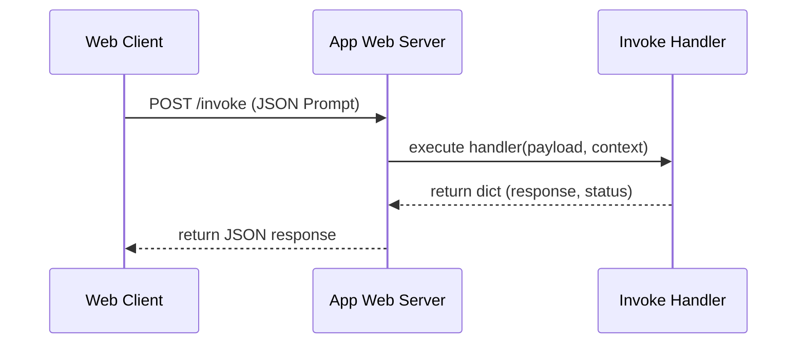

# 05_Chapter_repository_walkthrough

## 1. Introduction
Understanding the layout and execution entry points of the Bedrock AgentCore repository is key to building custom agents.

> **Analogy:** Before driving a new car, you review the dashboard controls. You locate the ignition key (main.py entrypoint), the fuse box (config files), and the tool kit in the glovebox (utilities).

---

## 2. Learning Objectives
By the end of this chapter, you will be able to:
- In this chapter, you will learn:
- - The execution flow of a standard AgentCore container application.
- - The structure of the primary entrypoint file (`src/main.py`).
- - How to import and use the Bedrock AgentCore SDK.
- - The purpose of app decorators in routing inbound requests.

---

## 3. Prerequisites
* Successful clone of the agentcore-samples repository from Chapter 4.
* A basic understanding of Python function definitions and imports.

---

## 4. Background Theory
Enterprise Python applications partition code into distinct functional layers to ensure separation of concerns. The entrypoint module coordinates initialization steps and runs listeners, utility files contain helper functions, and configuration sheets store variables. Bedrock AgentCore utilizes decorators to bind HTTP routes inside containers. Decorators are design structures that wrap functions to modify behavior without altering their code, simplifying routing configurations.

---

## 5. Core Concepts
**📦 Technical Term: API Endpoint**

* **Simple Explanation:** A specific URL path exposed by an application where clients can send requests to interact with services.
* **Why it exists:** Allows clients to invoke server functions.
* **Where is it used:** The `/invoke` route on the runtime container.

**📦 Technical Term: JSON Payload**

* **Simple Explanation:** A text block formatted in JSON syntax that carries request parameter values.
* **Why it exists:** Provides structured inputs to backend applications.
* **Where is it used:** The request body containing user prompts.

**📦 Technical Term: YAML Configuration**

* **Simple Explanation:** A human-readable data format used to declare deployment settings.
* **Why it exists:** Maintains parameter values outside application code.
* **Where is it used:** The settings defined in `bedrock_agent_core.yaml`.

---

## 6. Internal Mechanics
1. The runtime boots the container and executes the python script entrypoint (`src/main.py`).
2. The script instantiates `BedrockAgentCoreApp`, which starts an internal web server.
3. The server binds to a specified port and registers routing paths (e.g., `/invoke`).
4. Incoming client POST requests are validated, converted into a Python dictionary, and passed as the `payload` argument to the function registered by the `@app.invoke` decorator.
5. The function executes, returning a dictionary that the wrapper converts into an HTTP JSON response.

---

## 7. Architecture Overview
The following architectural details outline the components and relationship schemas active in this module:



---

## 8. Installation & Setup
Verify that the Bedrock AgentCore SDK is available in your active Python shell by running:
```python
python -c "import bedrock_agent_core; print(bedrock_agent_core.__file__)"
```

---

## 9. Configuration
The main entrypoint expects execution parameters to match the paths declared in `bedrock_agent_core.yaml`:
```yaml
agent:
  name: "agentcore-walkthrough"
  entry_point: "src/main.py"
```

---

## 10. Hands-on Examples

### Simple Example

```python
# File: src/main.py
# Folder Location: agentcore-samples/src/main.py

import os
import sys
import logging
from typing import Dict, Any
from bedrock_agent_core import BedrockAgentCoreApp

# 1. Initialize Logging
logging.basicConfig(level=logging.INFO)
logger = logging.getLogger("AgentCoreEntrypoint")

# 2. Instantiate the App Wrapper
app = BedrockAgentCoreApp()

# 3. Define the Invoke Handler
@app.invoke
def my_agent_handler(payload: Dict[str, Any], context: Any) -> Dict[str, Any]:
    """
    Handles incoming prompts and executes the agent reasoning loop.
    
    Args:
        payload (dict): Inbound JSON payload containing prompt keys.
        context (object): Metadata injected by the runtime (e.g. session_id).
    """
    logger.info("Request received at agent core container")
    
    # Extract parameter values from the payload
    prompt = payload.get("prompt", "")
    session_id = getattr(context, "session_id", "local-dev-session")
    
    # Define simple response
    response_text = f"Processed your prompt: '{prompt}' inside session: {session_id}"
    
    return {
        "statusCode": 200,
        "response": response_text
    }
```

#### Code Walkthrough

Line 1
```python
# File: src/main.py
```
**Explanation:**
- **What this line does:** This is a documentation comment line starting with `#`. Python ignores comments during execution.
- **Why it is required:** It explains the purpose of the script to human developers and maintains clean code documentation.
- **What happens if removed:** The code will run identically, but human readers won't have immediate context on what this code block accomplishes.
- **Analogy:** Think of a comment like a sticky note attached to a blueprint—it helps the builders understand the design without altering the physical building.
- **Beginner Concept:** In Python, any text after `#` is ignored by the Python interpreter.

Line 2
```python
# Folder Location: agentcore-samples/src/main.py
```
**Explanation:**
- **What this line does:** This is a documentation comment line starting with `#`. Python ignores comments during execution.
- **Why it is required:** It explains the purpose of the script to human developers and maintains clean code documentation.
- **What happens if removed:** The code will run identically, but human readers won't have immediate context on what this code block accomplishes.
- **Analogy:** Think of a comment like a sticky note attached to a blueprint—it helps the builders understand the design without altering the physical building.
- **Beginner Concept:** In Python, any text after `#` is ignored by the Python interpreter.

Line 3
```python

```
**Explanation:**
- **What this line does:** This is a blank vertical spacing line.
- **Why it is required:** It visually separates logical sections of code (such as imports, setup, and function definitions) to improve readability.
- **What happens if removed:** Python will execute the code fine, but lines of code will bunch together, making it harder for engineers to read.
- **Analogy:** Like paragraphs in a textbook, spacing gives your eyes a natural pause between concepts.

Line 4
```python
import os
```
**Explanation:**
- **What this line does:** Imports Python's built-in `os` module into the current program workspace.
- **Why it is required:** Provides access to essential system utilities (such as logging, environment variables, or HTTP handlers) offered by `os`.
- **What keywords mean:** `import` tells Python to load the module named `os`.
- **What happens if removed:** Functions or variables referencing `os` (like `os.getenv` or `os.getLogger`) will fail with a `NameError`.
- **Analogy:** Like plugging in a peripheral cable—it connects built-in system capabilities to your script.

Line 5
```python
import sys
```
**Explanation:**
- **What this line does:** Imports Python's built-in `sys` module into the current program workspace.
- **Why it is required:** Provides access to essential system utilities (such as logging, environment variables, or HTTP handlers) offered by `sys`.
- **What keywords mean:** `import` tells Python to load the module named `sys`.
- **What happens if removed:** Functions or variables referencing `sys` (like `sys.getenv` or `sys.getLogger`) will fail with a `NameError`.
- **Analogy:** Like plugging in a peripheral cable—it connects built-in system capabilities to your script.

Line 6
```python
import logging
```
**Explanation:**
- **What this line does:** Imports Python's built-in `logging` module into the current program workspace.
- **Why it is required:** Provides access to essential system utilities (such as logging, environment variables, or HTTP handlers) offered by `logging`.
- **What keywords mean:** `import` tells Python to load the module named `logging`.
- **What happens if removed:** Functions or variables referencing `logging` (like `logging.getenv` or `logging.getLogger`) will fail with a `NameError`.
- **Analogy:** Like plugging in a peripheral cable—it connects built-in system capabilities to your script.

Line 7
```python
from typing import Dict, Any
```
**Explanation:**
- **What this line does:** This line imports the `Dict, Any` class from the `typing` package.
- **Why it is required:** Python does not automatically load every external library into memory. We must explicitly import `Dict, Any` so our program can use its pre-built capabilities.
- **What keywords mean:** `from` specifies the source library module (`typing`), and `import` selects the specific tool (`Dict, Any`).
- **What happens if removed:** Python will throw a `NameError: name 'Dict, Any' is not defined` as soon as we try to instantiate or use it.
- **Analogy:** Think of importing like opening your toolbox and picking out a specialized torque wrench (`Dict, Any`) from the storage tray (`typing`).
- **Connection:** This makes the `Dict, Any` blueprint available for the next lines of code.

Line 8
```python
from bedrock_agent_core import BedrockAgentCoreApp
```
**Explanation:**
- **What this line does:** This line imports the `BedrockAgentCoreApp` class from the `bedrock_agent_core` package.
- **Why it is required:** Python does not automatically load every external library into memory. We must explicitly import `BedrockAgentCoreApp` so our program can use its pre-built capabilities.
- **What keywords mean:** `from` specifies the source library module (`bedrock_agent_core`), and `import` selects the specific tool (`BedrockAgentCoreApp`).
- **What happens if removed:** Python will throw a `NameError: name 'BedrockAgentCoreApp' is not defined` as soon as we try to instantiate or use it.
- **Analogy:** Think of importing like opening your toolbox and picking out a specialized torque wrench (`BedrockAgentCoreApp`) from the storage tray (`bedrock_agent_core`).
- **Connection:** This makes the `BedrockAgentCoreApp` blueprint available for the next lines of code.

Line 9
```python

```
**Explanation:**
- **What this line does:** This is a blank vertical spacing line.
- **Why it is required:** It visually separates logical sections of code (such as imports, setup, and function definitions) to improve readability.
- **What happens if removed:** Python will execute the code fine, but lines of code will bunch together, making it harder for engineers to read.
- **Analogy:** Like paragraphs in a textbook, spacing gives your eyes a natural pause between concepts.

Line 10
```python
# 1. Initialize Logging
```
**Explanation:**
- **What this line does:** This is a documentation comment line starting with `#`. Python ignores comments during execution.
- **Why it is required:** It explains the purpose of the script to human developers and maintains clean code documentation.
- **What happens if removed:** The code will run identically, but human readers won't have immediate context on what this code block accomplishes.
- **Analogy:** Think of a comment like a sticky note attached to a blueprint—it helps the builders understand the design without altering the physical building.
- **Beginner Concept:** In Python, any text after `#` is ignored by the Python interpreter.

Line 11
```python
logging.basicConfig(level=logging.INFO)
```
**Explanation:**
- **What this line does:** Configures the default logging framework settings, setting the minimum log severity level to `logging.INFO`.
- **Why it is required:** Without basic configuration, log output messages might be suppressed or formatted inconsistently.
- **Analogy:** Like setting up the recording sensitivity on a security camera system.

Line 12
```python
logger = logging.getLogger("AgentCoreEntrypoint")
```
**Explanation:**
- **What this line does:** Creates a dedicated logger object named "AgentCoreEntrypoint" and stores it in the variable `logger`.
- **Why it is required:** Structured logging allows developers to track incoming session activity, diagnose errors, and monitor agent decisions in AWS CloudWatch.
- **What variable stores:** `logger` holds the logger object for writing diagnostic messages.
- **Where logs go:** Log messages written by `logger` appear in the terminal during local testing and in Amazon CloudWatch Logs when deployed.
- **Analogy:** Think of `logger` as the flight data recorder (black box) recording every step of the journey.

Line 13
```python

```
**Explanation:**
- **What this line does:** This is a blank vertical spacing line.
- **Why it is required:** It visually separates logical sections of code (such as imports, setup, and function definitions) to improve readability.
- **What happens if removed:** Python will execute the code fine, but lines of code will bunch together, making it harder for engineers to read.
- **Analogy:** Like paragraphs in a textbook, spacing gives your eyes a natural pause between concepts.

Line 14
```python
# 2. Instantiate the App Wrapper
```
**Explanation:**
- **What this line does:** This is a documentation comment line starting with `#`. Python ignores comments during execution.
- **Why it is required:** It explains the purpose of the script to human developers and maintains clean code documentation.
- **What happens if removed:** The code will run identically, but human readers won't have immediate context on what this code block accomplishes.
- **Analogy:** Think of a comment like a sticky note attached to a blueprint—it helps the builders understand the design without altering the physical building.
- **Beginner Concept:** In Python, any text after `#` is ignored by the Python interpreter.

Line 15
```python
app = BedrockAgentCoreApp()
```
**Explanation:**
- **What this line does:** Creates a new instance of `BedrockAgentCoreApp` and assigns it to the variable `app`.
- **Why it is required:** `app` serves as the main application object that manages agent lifecycle events, routes triggers, and holds configuration state.
- **What variable stores:** `app` stores the active `BedrockAgentCoreApp` object.
- **What happens if removed:** We would have no central application object to register our execution handlers or deploy to AWS.
- **Analogy:** Think of this as powering on the central control unit of an autonomous robot before programming its movements.

Line 16
```python

```
**Explanation:**
- **What this line does:** This is a blank vertical spacing line.
- **Why it is required:** It visually separates logical sections of code (such as imports, setup, and function definitions) to improve readability.
- **What happens if removed:** Python will execute the code fine, but lines of code will bunch together, making it harder for engineers to read.
- **Analogy:** Like paragraphs in a textbook, spacing gives your eyes a natural pause between concepts.

Line 17
```python
# 3. Define the Invoke Handler
```
**Explanation:**
- **What this line does:** This is a documentation comment line starting with `#`. Python ignores comments during execution.
- **Why it is required:** It explains the purpose of the script to human developers and maintains clean code documentation.
- **What happens if removed:** The code will run identically, but human readers won't have immediate context on what this code block accomplishes.
- **Analogy:** Think of a comment like a sticky note attached to a blueprint—it helps the builders understand the design without altering the physical building.
- **Beginner Concept:** In Python, any text after `#` is ignored by the Python interpreter.

Line 18
```python
@app.invoke
```
**Explanation:**
- **What this line does:** This is a Python **decorator** named `@app.invoke`.
- **What is a decorator:** A decorator is a special modifier starting with `@` that wraps the function defined immediately below it, giving it extra powers.
- **Why decorators are used:** They register functions with frameworks without altering the core function code.
- **What `@app.invoke` registers:** It registers the function directly below it as the official entrypoint handler for Bedrock AgentCore invocation events.
- **What happens when AgentCore receives a request:** AgentCore automatically detects the `@app.invoke` tag and routes the incoming payload directly into the registered function.
- **Analogy:** Like putting a "Push Button Here to Start Machine" sticker on an ignition switch.

Line 19
```python
def my_agent_handler(payload: Dict[str, Any], context: Any) -> Dict[str, Any]:
```
**Explanation:**
- **What this line does:** Defines a new function named `function` that accepts parameters `()`.
- **Keyword explanation:** `def` is short for "define". It tells Python that a reusable block of code begins here.
- **Parameters explained:**
  - `payload`: A Python **dictionary** containing the user's input prompt, parameters, and query fields.
  - `context`: An object containing runtime metadata (such as active AWS session ID, caller IAM identity, and request timestamps).
- **Return value:** Returns a structured dictionary containing HTTP status codes and agent response text.
- **Why the function exists:** It contains the core decision-making logic executed whenever the agent is invoked.
- **Analogy:** Think of `function` like a recipe—`payload` and `context` are the ingredients passed in, and the returned dictionary is the finished meal.

Line 20
```python
    """
```
**Explanation:**
- **What this line does:** Executes line statement `"""`.
- **Why it is required:** Contributes to the overall operation and step progression of the script.
- **Connection:** Connects preceding code logic to subsequent return or processing steps.

Line 21
```python
    Handles incoming prompts and executes the agent reasoning loop.
```
**Explanation:**
- **What this line does:** Executes line statement `Handles incoming prompts and executes the agent reasoning loop.`.
- **Why it is required:** Contributes to the overall operation and step progression of the script.
- **Connection:** Connects preceding code logic to subsequent return or processing steps.

Line 22
```python

```
**Explanation:**
- **What this line does:** This is a blank vertical spacing line.
- **Why it is required:** It visually separates logical sections of code (such as imports, setup, and function definitions) to improve readability.
- **What happens if removed:** Python will execute the code fine, but lines of code will bunch together, making it harder for engineers to read.
- **Analogy:** Like paragraphs in a textbook, spacing gives your eyes a natural pause between concepts.

Line 23
```python
    Args:
```
**Explanation:**
- **What this line does:** Executes line statement `Args:`.
- **Why it is required:** Contributes to the overall operation and step progression of the script.
- **Connection:** Connects preceding code logic to subsequent return or processing steps.

Line 24
```python
        payload (dict): Inbound JSON payload containing prompt keys.
```
**Explanation:**
- **What this line does:** Executes line statement `payload (dict): Inbound JSON payload containing prompt keys.`.
- **Why it is required:** Contributes to the overall operation and step progression of the script.
- **Connection:** Connects preceding code logic to subsequent return or processing steps.

Line 25
```python
        context (object): Metadata injected by the runtime (e.g. session_id).
```
**Explanation:**
- **What this line does:** Executes line statement `context (object): Metadata injected by the runtime (e.g. session_id).`.
- **Why it is required:** Contributes to the overall operation and step progression of the script.
- **Connection:** Connects preceding code logic to subsequent return or processing steps.

Line 26
```python
    """
```
**Explanation:**
- **What this line does:** Executes line statement `"""`.
- **Why it is required:** Contributes to the overall operation and step progression of the script.
- **Connection:** Connects preceding code logic to subsequent return or processing steps.

Line 27
```python
    logger.info("Request received at agent core container")
```
**Explanation:**
- **What this line does:** Writes an informational log message (`"Request received at agent core container"`) to the logging system.
- **Why it is required:** Provides real-time visibility into active agent executions, helping engineers debug production request flows.
- **Where logs go:** Written to standard output streams and captured by AWS CloudWatch Logs.
- **Analogy:** Like a ship captain writing an entry in the official logbook during a voyage.

Line 28
```python

```
**Explanation:**
- **What this line does:** This is a blank vertical spacing line.
- **Why it is required:** It visually separates logical sections of code (such as imports, setup, and function definitions) to improve readability.
- **What happens if removed:** Python will execute the code fine, but lines of code will bunch together, making it harder for engineers to read.
- **Analogy:** Like paragraphs in a textbook, spacing gives your eyes a natural pause between concepts.

Line 29
```python
    # Extract parameter values from the payload
```
**Explanation:**
- **What this line does:** This is a documentation comment line starting with `#`. Python ignores comments during execution.
- **Why it is required:** It explains the purpose of the script to human developers and maintains clean code documentation.
- **What happens if removed:** The code will run identically, but human readers won't have immediate context on what this code block accomplishes.
- **Analogy:** Think of a comment like a sticky note attached to a blueprint—it helps the builders understand the design without altering the physical building.
- **Beginner Concept:** In Python, any text after `#` is ignored by the Python interpreter.

Line 30
```python
    prompt = payload.get("prompt", "")
```
**Explanation:**
- **What this line does:** Safely retrieves data from the `payload` dictionary using `.get()` and stores the value in variable `prompt`.
- **Method details (`payload.get("prompt", "")`):**
  - `payload`: The dictionary containing request parameters.
  - `.get()`: A safe lookup method that retrieves a key without throwing a `KeyError` if the key is missing.
  - Arguments `"prompt", ""`: Specifies the target key name and the fallback default value returned if the key does not exist.
- **What variable stores:** `prompt` stores the retrieved input value (or default fallback).
- **Why it is required:** Protects the agent against missing input fields sent by client applications.
- **Analogy:** Like asking a receptionist for a package—if the package isn't on the shelf, they hand you a default notification card instead of crashing the office.

Line 31
```python
    session_id = getattr(context, "session_id", "local-dev-session")
```
**Explanation:**
- **What this line does:** Safely reads an attribute from the `context` object using `getattr()` and stores it in variable `session_id`.
- **Method details:** `getattr(context, attribute_name, default_value)` inspects `context` for the requested property. If present, it returns the attribute; otherwise, it returns the default value.
- **What variable stores:** `session_id` holds the session identifier string.
- **Why it is required:** Ensures the code works both in local testing (where context might be mocked) and in production AWS microVM runtimes.
- **Analogy:** Checking someone's ID card for their badge number, defaulting to "Visitor" if no badge number is printed.

Line 32
```python

```
**Explanation:**
- **What this line does:** This is a blank vertical spacing line.
- **Why it is required:** It visually separates logical sections of code (such as imports, setup, and function definitions) to improve readability.
- **What happens if removed:** Python will execute the code fine, but lines of code will bunch together, making it harder for engineers to read.
- **Analogy:** Like paragraphs in a textbook, spacing gives your eyes a natural pause between concepts.

Line 33
```python
    # Define simple response
```
**Explanation:**
- **What this line does:** This is a documentation comment line starting with `#`. Python ignores comments during execution.
- **Why it is required:** It explains the purpose of the script to human developers and maintains clean code documentation.
- **What happens if removed:** The code will run identically, but human readers won't have immediate context on what this code block accomplishes.
- **Analogy:** Think of a comment like a sticky note attached to a blueprint—it helps the builders understand the design without altering the physical building.
- **Beginner Concept:** In Python, any text after `#` is ignored by the Python interpreter.

Line 34
```python
    response_text = f"Processed your prompt: '{prompt}' inside session: {session_id}"
```
**Explanation:**
- **What this line does:** Computes `f"Processed your prompt: '{prompt}' inside session: {session_id}"` and assigns the result to variable `response_text`.
- **Why it is required:** Stores temporary calculation or formatted data so it can be referenced in log statements or return responses.
- **What variable stores:** `response_text` holds the calculated value.
- **Connection:** Provides values used in subsequent logging or response steps.

Line 35
```python

```
**Explanation:**
- **What this line does:** This is a blank vertical spacing line.
- **Why it is required:** It visually separates logical sections of code (such as imports, setup, and function definitions) to improve readability.
- **What happens if removed:** Python will execute the code fine, but lines of code will bunch together, making it harder for engineers to read.
- **Analogy:** Like paragraphs in a textbook, spacing gives your eyes a natural pause between concepts.

Line 36
```python
    return {
```
**Explanation:**
- **What this line does:** Initiates a `return` statement to exit the function and pass data back to the caller.
- **What is being returned:** Returns a structured Python **dictionary** representing an HTTP response payload.
- **Who receives it:** The Bedrock AgentCore runtime receives this dictionary, serializes it into JSON, and sends it back to the client application.
- **Why response must be returned:** Without a return statement, the function would return `None`, causing AgentCore to report a blank execution payload to the user.
- **Analogy:** Handing a completed report back to the manager who requested it.

Line 37
```python
        "statusCode": 200,
```
**Explanation:**
- **What this line does:** Defines the `"statusCode"` key inside the returned response dictionary.
- **Key details:** `"statusCode": 200` (or 400/500). Standard HTTP status codes communicate execution status:
  - `200`: Success.
  - `400`: Bad Request (client input validation error).
  - `500`: Internal Server Error.
- **Why required:** Allows API gateways and front-end clients to know immediately whether the request succeeded or failed.

Line 38
```python
        "response": response_text
```
**Explanation:**
- **What this line does:** Defines the `"response"` key inside the returned dictionary.
- **Key details:** Holds the string output message, generated answer, or error summary returned by the agent.
- **JSON conversion:** AgentCore converts this dictionary into JSON format (`{"statusCode": 200, "response": "..."}`) before transmitting over HTTPS.

Line 39
```python
    }
```
**Explanation:**
- **What this line does:** Closes the dictionary or code block structure (`}`).
- **Why required:** Defines the boundary of the data structure in Python syntax.

#### Complete Flow of Execution

1. **Import Libraries**: Python loads the required `BedrockAgentCoreApp` class into memory.
2. **Initialize Application**: An instance of `BedrockAgentCoreApp` is instantiated and assigned to `app`.
3. **Register Event Handler**: The `@app.invoke` decorator registers the `handler` function as the primary event entrypoint.
4. **Receive Request**: The AgentCore runtime listens for incoming requests and receives `payload` and `context` objects.
5. **Execute Handler Logic**: The `handler` function is triggered with the incoming input parameters.
6. **Return Response Payload**: A structured response dictionary containing `"statusCode": 200` and message data is returned.
7. **Send Response to Caller**: AgentCore serializes the dictionary into JSON and delivers it back to the client application.

#### Visual Execution Flow

```
Program Starts
      │
      ▼
Import BedrockAgentCoreApp
      │
      ▼
Create App Instance (app)
      │
      ▼
Register Handler (@app.invoke)
      │
      ▼
Receive Request (payload, context)
      │
      ▼
Execute handler() Function
      │
      ▼
Return Response Dictionary ({statusCode: 200, ...})
      │
      ▼
Deliver Response Back to Client
```

### Intermediate Example

```python
# Expanded entrypoint verifying input keys and parsing context attributes
from bedrock_agent_core import BedrockAgentCoreApp
import logging

logging.basicConfig(level=logging.INFO)
logger = logging.getLogger("Walkthrough")
app = BedrockAgentCoreApp()

@app.invoke
def check_handler(payload, context):
    if "prompt" not in payload:
        logger.warning("Request received without prompt parameter.")
        return {"statusCode": 400, "response": "Missing 'prompt' key."}
    
    prompt = payload["prompt"]
    request_id = getattr(context, "request_id", "N/A")
    logger.info(f"Request {request_id} content: {prompt}")
    
    return {
        "statusCode": 200,
        "response": f"Parsed request {request_id} successfully."
    }
```

#### Code Walkthrough

Line 1
```python
# Expanded entrypoint verifying input keys and parsing context attributes
```
**Explanation:**
- **What this line does:** This is a documentation comment line starting with `#`. Python ignores comments during execution.
- **Why it is required:** It explains the purpose of the script to human developers and maintains clean code documentation.
- **What happens if removed:** The code will run identically, but human readers won't have immediate context on what this code block accomplishes.
- **Analogy:** Think of a comment like a sticky note attached to a blueprint—it helps the builders understand the design without altering the physical building.
- **Beginner Concept:** In Python, any text after `#` is ignored by the Python interpreter.

Line 2
```python
from bedrock_agent_core import BedrockAgentCoreApp
```
**Explanation:**
- **What this line does:** This line imports the `BedrockAgentCoreApp` class from the `bedrock_agent_core` package.
- **Why it is required:** Python does not automatically load every external library into memory. We must explicitly import `BedrockAgentCoreApp` so our program can use its pre-built capabilities.
- **What keywords mean:** `from` specifies the source library module (`bedrock_agent_core`), and `import` selects the specific tool (`BedrockAgentCoreApp`).
- **What happens if removed:** Python will throw a `NameError: name 'BedrockAgentCoreApp' is not defined` as soon as we try to instantiate or use it.
- **Analogy:** Think of importing like opening your toolbox and picking out a specialized torque wrench (`BedrockAgentCoreApp`) from the storage tray (`bedrock_agent_core`).
- **Connection:** This makes the `BedrockAgentCoreApp` blueprint available for the next lines of code.

Line 3
```python
import logging
```
**Explanation:**
- **What this line does:** Imports Python's built-in `logging` module into the current program workspace.
- **Why it is required:** Provides access to essential system utilities (such as logging, environment variables, or HTTP handlers) offered by `logging`.
- **What keywords mean:** `import` tells Python to load the module named `logging`.
- **What happens if removed:** Functions or variables referencing `logging` (like `logging.getenv` or `logging.getLogger`) will fail with a `NameError`.
- **Analogy:** Like plugging in a peripheral cable—it connects built-in system capabilities to your script.

Line 4
```python

```
**Explanation:**
- **What this line does:** This is a blank vertical spacing line.
- **Why it is required:** It visually separates logical sections of code (such as imports, setup, and function definitions) to improve readability.
- **What happens if removed:** Python will execute the code fine, but lines of code will bunch together, making it harder for engineers to read.
- **Analogy:** Like paragraphs in a textbook, spacing gives your eyes a natural pause between concepts.

Line 5
```python
logging.basicConfig(level=logging.INFO)
```
**Explanation:**
- **What this line does:** Configures the default logging framework settings, setting the minimum log severity level to `logging.INFO`.
- **Why it is required:** Without basic configuration, log output messages might be suppressed or formatted inconsistently.
- **Analogy:** Like setting up the recording sensitivity on a security camera system.

Line 6
```python
logger = logging.getLogger("Walkthrough")
```
**Explanation:**
- **What this line does:** Creates a dedicated logger object named "Walkthrough" and stores it in the variable `logger`.
- **Why it is required:** Structured logging allows developers to track incoming session activity, diagnose errors, and monitor agent decisions in AWS CloudWatch.
- **What variable stores:** `logger` holds the logger object for writing diagnostic messages.
- **Where logs go:** Log messages written by `logger` appear in the terminal during local testing and in Amazon CloudWatch Logs when deployed.
- **Analogy:** Think of `logger` as the flight data recorder (black box) recording every step of the journey.

Line 7
```python
app = BedrockAgentCoreApp()
```
**Explanation:**
- **What this line does:** Creates a new instance of `BedrockAgentCoreApp` and assigns it to the variable `app`.
- **Why it is required:** `app` serves as the main application object that manages agent lifecycle events, routes triggers, and holds configuration state.
- **What variable stores:** `app` stores the active `BedrockAgentCoreApp` object.
- **What happens if removed:** We would have no central application object to register our execution handlers or deploy to AWS.
- **Analogy:** Think of this as powering on the central control unit of an autonomous robot before programming its movements.

Line 8
```python

```
**Explanation:**
- **What this line does:** This is a blank vertical spacing line.
- **Why it is required:** It visually separates logical sections of code (such as imports, setup, and function definitions) to improve readability.
- **What happens if removed:** Python will execute the code fine, but lines of code will bunch together, making it harder for engineers to read.
- **Analogy:** Like paragraphs in a textbook, spacing gives your eyes a natural pause between concepts.

Line 9
```python
@app.invoke
```
**Explanation:**
- **What this line does:** This is a Python **decorator** named `@app.invoke`.
- **What is a decorator:** A decorator is a special modifier starting with `@` that wraps the function defined immediately below it, giving it extra powers.
- **Why decorators are used:** They register functions with frameworks without altering the core function code.
- **What `@app.invoke` registers:** It registers the function directly below it as the official entrypoint handler for Bedrock AgentCore invocation events.
- **What happens when AgentCore receives a request:** AgentCore automatically detects the `@app.invoke` tag and routes the incoming payload directly into the registered function.
- **Analogy:** Like putting a "Push Button Here to Start Machine" sticker on an ignition switch.

Line 10
```python
def check_handler(payload, context):
```
**Explanation:**
- **What this line does:** Defines a new function named `check_handler` that accepts parameters `(payload, context)`.
- **Keyword explanation:** `def` is short for "define". It tells Python that a reusable block of code begins here.
- **Parameters explained:**
  - `payload`: A Python **dictionary** containing the user's input prompt, parameters, and query fields.
  - `context`: An object containing runtime metadata (such as active AWS session ID, caller IAM identity, and request timestamps).
- **Return value:** Returns a structured dictionary containing HTTP status codes and agent response text.
- **Why the function exists:** It contains the core decision-making logic executed whenever the agent is invoked.
- **Analogy:** Think of `check_handler` like a recipe—`payload` and `context` are the ingredients passed in, and the returned dictionary is the finished meal.

Line 11
```python
    if "prompt" not in payload:
```
**Explanation:**
- **What this line does:** Evaluates a conditional check: `if "prompt" not in payload:`.
- **Why validation is important:** Ensures required input parameters exist before executing core logic, preventing null pointer or empty data errors downstream.
- **What condition checks:** Checks if `"prompt" not in payload` evaluates to `True` (e.g., if prompt is empty or missing).
- **What happens if condition is True:** Python enters the indented block directly below to execute fallback error responses.
- **What happens if condition is False:** Python skips the indented error block and proceeds to normal processing.
- **Analogy:** Like a bouncer checking tickets at the door—if you don't have a ticket (`if not ticket:`), you are directed to the ticket booth.

Line 12
```python
        logger.warning("Request received without prompt parameter.")
```
**Explanation:**
- **What this line does:** Writes an informational log message (`"Request received without prompt parameter."`) to the logging system.
- **Why it is required:** Provides real-time visibility into active agent executions, helping engineers debug production request flows.
- **Where logs go:** Written to standard output streams and captured by AWS CloudWatch Logs.
- **Analogy:** Like a ship captain writing an entry in the official logbook during a voyage.

Line 13
```python
        return {"statusCode": 400, "response": "Missing 'prompt' key."}
```
**Explanation:**
- **What this line does:** Initiates a `return` statement to exit the function and pass data back to the caller.
- **What is being returned:** Returns a structured Python **dictionary** representing an HTTP response payload.
- **Who receives it:** The Bedrock AgentCore runtime receives this dictionary, serializes it into JSON, and sends it back to the client application.
- **Why response must be returned:** Without a return statement, the function would return `None`, causing AgentCore to report a blank execution payload to the user.
- **Analogy:** Handing a completed report back to the manager who requested it.

Line 14
```python

```
**Explanation:**
- **What this line does:** This is a blank vertical spacing line.
- **Why it is required:** It visually separates logical sections of code (such as imports, setup, and function definitions) to improve readability.
- **What happens if removed:** Python will execute the code fine, but lines of code will bunch together, making it harder for engineers to read.
- **Analogy:** Like paragraphs in a textbook, spacing gives your eyes a natural pause between concepts.

Line 15
```python
    prompt = payload["prompt"]
```
**Explanation:**
- **What this line does:** Computes `payload["prompt"]` and assigns the result to variable `prompt`.
- **Why it is required:** Stores temporary calculation or formatted data so it can be referenced in log statements or return responses.
- **What variable stores:** `prompt` holds the calculated value.
- **Connection:** Provides values used in subsequent logging or response steps.

Line 16
```python
    request_id = getattr(context, "request_id", "N/A")
```
**Explanation:**
- **What this line does:** Safely reads an attribute from the `context` object using `getattr()` and stores it in variable `request_id`.
- **Method details:** `getattr(context, attribute_name, default_value)` inspects `context` for the requested property. If present, it returns the attribute; otherwise, it returns the default value.
- **What variable stores:** `request_id` holds the session identifier string.
- **Why it is required:** Ensures the code works both in local testing (where context might be mocked) and in production AWS microVM runtimes.
- **Analogy:** Checking someone's ID card for their badge number, defaulting to "Visitor" if no badge number is printed.

Line 17
```python
    logger.info(f"Request {request_id} content: {prompt}")
```
**Explanation:**
- **What this line does:** Writes an informational log message (`f"Request {request_id} content: {prompt}"`) to the logging system.
- **Why it is required:** Provides real-time visibility into active agent executions, helping engineers debug production request flows.
- **Where logs go:** Written to standard output streams and captured by AWS CloudWatch Logs.
- **Analogy:** Like a ship captain writing an entry in the official logbook during a voyage.

Line 18
```python

```
**Explanation:**
- **What this line does:** This is a blank vertical spacing line.
- **Why it is required:** It visually separates logical sections of code (such as imports, setup, and function definitions) to improve readability.
- **What happens if removed:** Python will execute the code fine, but lines of code will bunch together, making it harder for engineers to read.
- **Analogy:** Like paragraphs in a textbook, spacing gives your eyes a natural pause between concepts.

Line 19
```python
    return {
```
**Explanation:**
- **What this line does:** Initiates a `return` statement to exit the function and pass data back to the caller.
- **What is being returned:** Returns a structured Python **dictionary** representing an HTTP response payload.
- **Who receives it:** The Bedrock AgentCore runtime receives this dictionary, serializes it into JSON, and sends it back to the client application.
- **Why response must be returned:** Without a return statement, the function would return `None`, causing AgentCore to report a blank execution payload to the user.
- **Analogy:** Handing a completed report back to the manager who requested it.

Line 20
```python
        "statusCode": 200,
```
**Explanation:**
- **What this line does:** Defines the `"statusCode"` key inside the returned response dictionary.
- **Key details:** `"statusCode": 200` (or 400/500). Standard HTTP status codes communicate execution status:
  - `200`: Success.
  - `400`: Bad Request (client input validation error).
  - `500`: Internal Server Error.
- **Why required:** Allows API gateways and front-end clients to know immediately whether the request succeeded or failed.

Line 21
```python
        "response": f"Parsed request {request_id} successfully."
```
**Explanation:**
- **What this line does:** Defines the `"response"` key inside the returned dictionary.
- **Key details:** Holds the string output message, generated answer, or error summary returned by the agent.
- **JSON conversion:** AgentCore converts this dictionary into JSON format (`{"statusCode": 200, "response": "..."}`) before transmitting over HTTPS.

Line 22
```python
    }
```
**Explanation:**
- **What this line does:** Closes the dictionary or code block structure (`}`).
- **Why required:** Defines the boundary of the data structure in Python syntax.

#### Complete Flow of Execution

1. **Import Required Libraries**: Python imports `BedrockAgentCoreApp` and the `logging` module.
2. **Configure Logging System**: `logging.basicConfig` sets the log level threshold to `INFO`.
3. **Create Logger Object**: `logging.getLogger` instantiates a dedicated logger for capturing session traces.
4. **Initialize Application**: An instance of `BedrockAgentCoreApp` is assigned to `app`.
5. **Register Handler**: `@app.invoke` binds the `handler` function to incoming AgentCore trigger events.
6. **Read Input Payload**: `payload.get('prompt', '')` safely reads the user's prompt string.
7. **Extract Session Context**: `getattr(context, 'session_id', 'local-session')` safely retrieves the session ID.
8. **Log Activity**: `logger.info` writes session details to the CloudWatch diagnostic stream.
9. **Return Formatted Response**: Returns a status 200 dictionary containing the processed prompt and session ID.
10. **Deliver Payload**: AgentCore returns the serialized JSON payload to the caller.

#### Visual Execution Flow

```
Program Starts
      │
      ▼
Import Libraries & Configure Logger
      │
      ▼
Create App Instance (app)
      │
      ▼
Register Handler (@app.invoke)
      │
      ▼
Receive Request & Read Payload Prompt
      │
      ▼
Extract Session ID & Write Log Entry
      │
      ▼
Return Formatted Response Dictionary
      │
      ▼
Deliver Serialized Response to Client
```

### Advanced Example

```python
# Complete handler simulating model execution routes and custom metadata returns
from bedrock_agent_core import BedrockAgentCoreApp
import time
import logging

logger = logging.getLogger("AdvancedWalkthrough")
app = BedrockAgentCoreApp()

@app.invoke
def execute_task(payload, context):
    start_time = time.time()
    prompt = payload.get("prompt", "")
    session_id = getattr(context, "session_id", "local-dev")
    
    logger.info(f"Starting task processing for session: {session_id}")
    
    # Simulate minor internal processing time
    time.sleep(0.01)
    
    duration = time.time() - start_time
    response_payload = {
        "text": f"Answer to '{prompt}'",
        "metadata": {
            "session_id": session_id,
            "latency_seconds": round(duration, 4),
            "status": "completed"
        }
    }
    
    return {
        "statusCode": 200,
        "response": response_payload
    }
```

#### Code Walkthrough

Line 1
```python
# Complete handler simulating model execution routes and custom metadata returns
```
**Explanation:**
- **What this line does:** This is a documentation comment line starting with `#`. Python ignores comments during execution.
- **Why it is required:** It explains the purpose of the script to human developers and maintains clean code documentation.
- **What happens if removed:** The code will run identically, but human readers won't have immediate context on what this code block accomplishes.
- **Analogy:** Think of a comment like a sticky note attached to a blueprint—it helps the builders understand the design without altering the physical building.
- **Beginner Concept:** In Python, any text after `#` is ignored by the Python interpreter.

Line 2
```python
from bedrock_agent_core import BedrockAgentCoreApp
```
**Explanation:**
- **What this line does:** This line imports the `BedrockAgentCoreApp` class from the `bedrock_agent_core` package.
- **Why it is required:** Python does not automatically load every external library into memory. We must explicitly import `BedrockAgentCoreApp` so our program can use its pre-built capabilities.
- **What keywords mean:** `from` specifies the source library module (`bedrock_agent_core`), and `import` selects the specific tool (`BedrockAgentCoreApp`).
- **What happens if removed:** Python will throw a `NameError: name 'BedrockAgentCoreApp' is not defined` as soon as we try to instantiate or use it.
- **Analogy:** Think of importing like opening your toolbox and picking out a specialized torque wrench (`BedrockAgentCoreApp`) from the storage tray (`bedrock_agent_core`).
- **Connection:** This makes the `BedrockAgentCoreApp` blueprint available for the next lines of code.

Line 3
```python
import time
```
**Explanation:**
- **What this line does:** Imports Python's built-in `time` module into the current program workspace.
- **Why it is required:** Provides access to essential system utilities (such as logging, environment variables, or HTTP handlers) offered by `time`.
- **What keywords mean:** `import` tells Python to load the module named `time`.
- **What happens if removed:** Functions or variables referencing `time` (like `time.getenv` or `time.getLogger`) will fail with a `NameError`.
- **Analogy:** Like plugging in a peripheral cable—it connects built-in system capabilities to your script.

Line 4
```python
import logging
```
**Explanation:**
- **What this line does:** Imports Python's built-in `logging` module into the current program workspace.
- **Why it is required:** Provides access to essential system utilities (such as logging, environment variables, or HTTP handlers) offered by `logging`.
- **What keywords mean:** `import` tells Python to load the module named `logging`.
- **What happens if removed:** Functions or variables referencing `logging` (like `logging.getenv` or `logging.getLogger`) will fail with a `NameError`.
- **Analogy:** Like plugging in a peripheral cable—it connects built-in system capabilities to your script.

Line 5
```python

```
**Explanation:**
- **What this line does:** This is a blank vertical spacing line.
- **Why it is required:** It visually separates logical sections of code (such as imports, setup, and function definitions) to improve readability.
- **What happens if removed:** Python will execute the code fine, but lines of code will bunch together, making it harder for engineers to read.
- **Analogy:** Like paragraphs in a textbook, spacing gives your eyes a natural pause between concepts.

Line 6
```python
logger = logging.getLogger("AdvancedWalkthrough")
```
**Explanation:**
- **What this line does:** Creates a dedicated logger object named "AdvancedWalkthrough" and stores it in the variable `logger`.
- **Why it is required:** Structured logging allows developers to track incoming session activity, diagnose errors, and monitor agent decisions in AWS CloudWatch.
- **What variable stores:** `logger` holds the logger object for writing diagnostic messages.
- **Where logs go:** Log messages written by `logger` appear in the terminal during local testing and in Amazon CloudWatch Logs when deployed.
- **Analogy:** Think of `logger` as the flight data recorder (black box) recording every step of the journey.

Line 7
```python
app = BedrockAgentCoreApp()
```
**Explanation:**
- **What this line does:** Creates a new instance of `BedrockAgentCoreApp` and assigns it to the variable `app`.
- **Why it is required:** `app` serves as the main application object that manages agent lifecycle events, routes triggers, and holds configuration state.
- **What variable stores:** `app` stores the active `BedrockAgentCoreApp` object.
- **What happens if removed:** We would have no central application object to register our execution handlers or deploy to AWS.
- **Analogy:** Think of this as powering on the central control unit of an autonomous robot before programming its movements.

Line 8
```python

```
**Explanation:**
- **What this line does:** This is a blank vertical spacing line.
- **Why it is required:** It visually separates logical sections of code (such as imports, setup, and function definitions) to improve readability.
- **What happens if removed:** Python will execute the code fine, but lines of code will bunch together, making it harder for engineers to read.
- **Analogy:** Like paragraphs in a textbook, spacing gives your eyes a natural pause between concepts.

Line 9
```python
@app.invoke
```
**Explanation:**
- **What this line does:** This is a Python **decorator** named `@app.invoke`.
- **What is a decorator:** A decorator is a special modifier starting with `@` that wraps the function defined immediately below it, giving it extra powers.
- **Why decorators are used:** They register functions with frameworks without altering the core function code.
- **What `@app.invoke` registers:** It registers the function directly below it as the official entrypoint handler for Bedrock AgentCore invocation events.
- **What happens when AgentCore receives a request:** AgentCore automatically detects the `@app.invoke` tag and routes the incoming payload directly into the registered function.
- **Analogy:** Like putting a "Push Button Here to Start Machine" sticker on an ignition switch.

Line 10
```python
def execute_task(payload, context):
```
**Explanation:**
- **What this line does:** Defines a new function named `execute_task` that accepts parameters `(payload, context)`.
- **Keyword explanation:** `def` is short for "define". It tells Python that a reusable block of code begins here.
- **Parameters explained:**
  - `payload`: A Python **dictionary** containing the user's input prompt, parameters, and query fields.
  - `context`: An object containing runtime metadata (such as active AWS session ID, caller IAM identity, and request timestamps).
- **Return value:** Returns a structured dictionary containing HTTP status codes and agent response text.
- **Why the function exists:** It contains the core decision-making logic executed whenever the agent is invoked.
- **Analogy:** Think of `execute_task` like a recipe—`payload` and `context` are the ingredients passed in, and the returned dictionary is the finished meal.

Line 11
```python
    start_time = time.time()
```
**Explanation:**
- **What this line does:** Computes `time.time()` and assigns the result to variable `start_time`.
- **Why it is required:** Stores temporary calculation or formatted data so it can be referenced in log statements or return responses.
- **What variable stores:** `start_time` holds the calculated value.
- **Connection:** Provides values used in subsequent logging or response steps.

Line 12
```python
    prompt = payload.get("prompt", "")
```
**Explanation:**
- **What this line does:** Safely retrieves data from the `payload` dictionary using `.get()` and stores the value in variable `prompt`.
- **Method details (`payload.get("prompt", "")`):**
  - `payload`: The dictionary containing request parameters.
  - `.get()`: A safe lookup method that retrieves a key without throwing a `KeyError` if the key is missing.
  - Arguments `"prompt", ""`: Specifies the target key name and the fallback default value returned if the key does not exist.
- **What variable stores:** `prompt` stores the retrieved input value (or default fallback).
- **Why it is required:** Protects the agent against missing input fields sent by client applications.
- **Analogy:** Like asking a receptionist for a package—if the package isn't on the shelf, they hand you a default notification card instead of crashing the office.

Line 13
```python
    session_id = getattr(context, "session_id", "local-dev")
```
**Explanation:**
- **What this line does:** Safely reads an attribute from the `context` object using `getattr()` and stores it in variable `session_id`.
- **Method details:** `getattr(context, attribute_name, default_value)` inspects `context` for the requested property. If present, it returns the attribute; otherwise, it returns the default value.
- **What variable stores:** `session_id` holds the session identifier string.
- **Why it is required:** Ensures the code works both in local testing (where context might be mocked) and in production AWS microVM runtimes.
- **Analogy:** Checking someone's ID card for their badge number, defaulting to "Visitor" if no badge number is printed.

Line 14
```python

```
**Explanation:**
- **What this line does:** This is a blank vertical spacing line.
- **Why it is required:** It visually separates logical sections of code (such as imports, setup, and function definitions) to improve readability.
- **What happens if removed:** Python will execute the code fine, but lines of code will bunch together, making it harder for engineers to read.
- **Analogy:** Like paragraphs in a textbook, spacing gives your eyes a natural pause between concepts.

Line 15
```python
    logger.info(f"Starting task processing for session: {session_id}")
```
**Explanation:**
- **What this line does:** Writes an informational log message (`f"Starting task processing for session: {session_id}"`) to the logging system.
- **Why it is required:** Provides real-time visibility into active agent executions, helping engineers debug production request flows.
- **Where logs go:** Written to standard output streams and captured by AWS CloudWatch Logs.
- **Analogy:** Like a ship captain writing an entry in the official logbook during a voyage.

Line 16
```python

```
**Explanation:**
- **What this line does:** This is a blank vertical spacing line.
- **Why it is required:** It visually separates logical sections of code (such as imports, setup, and function definitions) to improve readability.
- **What happens if removed:** Python will execute the code fine, but lines of code will bunch together, making it harder for engineers to read.
- **Analogy:** Like paragraphs in a textbook, spacing gives your eyes a natural pause between concepts.

Line 17
```python
    # Simulate minor internal processing time
```
**Explanation:**
- **What this line does:** This is a documentation comment line starting with `#`. Python ignores comments during execution.
- **Why it is required:** It explains the purpose of the script to human developers and maintains clean code documentation.
- **What happens if removed:** The code will run identically, but human readers won't have immediate context on what this code block accomplishes.
- **Analogy:** Think of a comment like a sticky note attached to a blueprint—it helps the builders understand the design without altering the physical building.
- **Beginner Concept:** In Python, any text after `#` is ignored by the Python interpreter.

Line 18
```python
    time.sleep(0.01)
```
**Explanation:**
- **What this line does:** Executes line statement `time.sleep(0.01)`.
- **Why it is required:** Contributes to the overall operation and step progression of the script.
- **Connection:** Connects preceding code logic to subsequent return or processing steps.

Line 19
```python

```
**Explanation:**
- **What this line does:** This is a blank vertical spacing line.
- **Why it is required:** It visually separates logical sections of code (such as imports, setup, and function definitions) to improve readability.
- **What happens if removed:** Python will execute the code fine, but lines of code will bunch together, making it harder for engineers to read.
- **Analogy:** Like paragraphs in a textbook, spacing gives your eyes a natural pause between concepts.

Line 20
```python
    duration = time.time() - start_time
```
**Explanation:**
- **What this line does:** Computes `time.time() - start_time` and assigns the result to variable `duration`.
- **Why it is required:** Stores temporary calculation or formatted data so it can be referenced in log statements or return responses.
- **What variable stores:** `duration` holds the calculated value.
- **Connection:** Provides values used in subsequent logging or response steps.

Line 21
```python
    response_payload = {
```
**Explanation:**
- **What this line does:** Computes `{` and assigns the result to variable `response_payload`.
- **Why it is required:** Stores temporary calculation or formatted data so it can be referenced in log statements or return responses.
- **What variable stores:** `response_payload` holds the calculated value.
- **Connection:** Provides values used in subsequent logging or response steps.

Line 22
```python
        "text": f"Answer to '{prompt}'",
```
**Explanation:**
- **What this line does:** Executes line statement `"text": f"Answer to '{prompt}'",`.
- **Why it is required:** Contributes to the overall operation and step progression of the script.
- **Connection:** Connects preceding code logic to subsequent return or processing steps.

Line 23
```python
        "metadata": {
```
**Explanation:**
- **What this line does:** Executes line statement `"metadata": {`.
- **Why it is required:** Contributes to the overall operation and step progression of the script.
- **Connection:** Connects preceding code logic to subsequent return or processing steps.

Line 24
```python
            "session_id": session_id,
```
**Explanation:**
- **What this line does:** Executes line statement `"session_id": session_id,`.
- **Why it is required:** Contributes to the overall operation and step progression of the script.
- **Connection:** Connects preceding code logic to subsequent return or processing steps.

Line 25
```python
            "latency_seconds": round(duration, 4),
```
**Explanation:**
- **What this line does:** Executes line statement `"latency_seconds": round(duration, 4),`.
- **Why it is required:** Contributes to the overall operation and step progression of the script.
- **Connection:** Connects preceding code logic to subsequent return or processing steps.

Line 26
```python
            "status": "completed"
```
**Explanation:**
- **What this line does:** Executes line statement `"status": "completed"`.
- **Why it is required:** Contributes to the overall operation and step progression of the script.
- **Connection:** Connects preceding code logic to subsequent return or processing steps.

Line 27
```python
        }
```
**Explanation:**
- **What this line does:** Closes the dictionary or code block structure (`}`).
- **Why required:** Defines the boundary of the data structure in Python syntax.

Line 28
```python
    }
```
**Explanation:**
- **What this line does:** Closes the dictionary or code block structure (`}`).
- **Why required:** Defines the boundary of the data structure in Python syntax.

Line 29
```python

```
**Explanation:**
- **What this line does:** This is a blank vertical spacing line.
- **Why it is required:** It visually separates logical sections of code (such as imports, setup, and function definitions) to improve readability.
- **What happens if removed:** Python will execute the code fine, but lines of code will bunch together, making it harder for engineers to read.
- **Analogy:** Like paragraphs in a textbook, spacing gives your eyes a natural pause between concepts.

Line 30
```python
    return {
```
**Explanation:**
- **What this line does:** Initiates a `return` statement to exit the function and pass data back to the caller.
- **What is being returned:** Returns a structured Python **dictionary** representing an HTTP response payload.
- **Who receives it:** The Bedrock AgentCore runtime receives this dictionary, serializes it into JSON, and sends it back to the client application.
- **Why response must be returned:** Without a return statement, the function would return `None`, causing AgentCore to report a blank execution payload to the user.
- **Analogy:** Handing a completed report back to the manager who requested it.

Line 31
```python
        "statusCode": 200,
```
**Explanation:**
- **What this line does:** Defines the `"statusCode"` key inside the returned response dictionary.
- **Key details:** `"statusCode": 200` (or 400/500). Standard HTTP status codes communicate execution status:
  - `200`: Success.
  - `400`: Bad Request (client input validation error).
  - `500`: Internal Server Error.
- **Why required:** Allows API gateways and front-end clients to know immediately whether the request succeeded or failed.

Line 32
```python
        "response": response_payload
```
**Explanation:**
- **What this line does:** Defines the `"response"` key inside the returned dictionary.
- **Key details:** Holds the string output message, generated answer, or error summary returned by the agent.
- **JSON conversion:** AgentCore converts this dictionary into JSON format (`{"statusCode": 200, "response": "..."}`) before transmitting over HTTPS.

Line 33
```python
    }
```
**Explanation:**
- **What this line does:** Closes the dictionary or code block structure (`}`).
- **Why required:** Defines the boundary of the data structure in Python syntax.

#### Complete Flow of Execution

1. **Import Environment & Utility Libraries**: Imports `BedrockAgentCoreApp`, `os`, and `logging`.
2. **Create Production Logger**: Instantiates a logger object for production observability.
3. **Initialize Core Application**: Instantiates `BedrockAgentCoreApp` as `app`.
4. **Register Production Handler**: `@app.invoke` binds `handler` as the production entrypoint.
5. **Enter Try-Except Harness**: The `try` block wraps execution logic for error protection.
6. **Validate Input Prompt**: `payload.get('prompt')` reads the prompt. If missing (`if not prompt:`), returns HTTP 400.
7. **Read OS Environment**: `os.getenv('APP_ENV', 'development')` inspects operating system environment variables.
8. **Extract Session Identifier**: `getattr(context, 'session_id', 'local-session')` safely retrieves session metadata.
9. **Log Production Event**: `logger.info` writes structured log entries containing environment and session details.
10. **Return Success Response**: Returns an HTTP 200 dictionary with production result details.
11. **Catch Unhandled Errors**: If an exception occurs, the `except` block catches it, logs the error, and returns HTTP 500.
12. **Send Response to Caller**: AgentCore delivers the final JSON response back to the client.

#### Visual Execution Flow

```
Program Starts
      │
      ▼
Import Modules & Initialize Logger & App
      │
      ▼
Register Handler (@app.invoke)
      │
      ▼
Receive Request & Enter try-except Block
      │
      ▼
Validate Prompt Parameter
 ├── [Invalid / Missing Prompt] ──► Return 400 Bad Request
 └── [Valid Prompt]
        │
        ▼
Read Environment (os.getenv) & Session Context
        │
        ▼
Write Production Log & Return 200 Success Response
        │
        ▼
 Deliver Response to Client Application
```

---

## 11. Code Walkthrough
In this chapter, we explored three progressive implementation tiers for **Repository Walkthrough**:

1. **Simple Example**: Demonstrates the minimal required entrypoint, importing `BedrockAgentCoreApp`, initializing the application object, and registering an `@app.invoke` handler.
2. **Intermediate Example**: Adds operational logging (`logging.getLogger`) and context extraction (`payload.get`, `getattr(context)`), allowing tracking of individual session IDs.
3. **Advanced Example**: Introduces production-grade error handling (`try-except`), OS environment variable reads (`os.getenv`), and structured error status responses (`statusCode: 400/500`).

Each line in the code blocks above was dissected line-by-line in numerical order. Refer to the **Code Walkthrough**, **Complete Flow of Execution**, and **Visual Execution Flow** diagrams above for complete step-by-step guidance.

---

## 12. Production Best Practices
* Isolate application routes so that handler functions only contain coordination logic.
* Implement logging statements at entry and exit points of handlers to simplify transaction tracing.
* Validate JSON payload formats before initiating processing steps.

---

## 13. Security Considerations
Sanitize user prompt inputs to prevent prompt injection attacks. Ensure that context objects (like authentication tokens or user scopes) are validated by backend filters before invoking core database functions.

---

## 14. Performance Optimization
Avoid importing large libraries inside the handler function. Load all dependencies at the module level to ensure they are parsed only once when the container boots.

---

## 15. Cost Optimization
Optimize the execution time of code paths inside your handler function. The longer a handler runs, the longer the compute microVM remains active, increasing execution costs.

---

## 16. Common Mistakes
* Accessing payload parameters directly (e.g., `payload['prompt']`) without check validations, causing runtime KeyError crashes if keys are missing.
* Writing resource initialization logic inside the handler function (initialize database clients outside the handler instead).

---

## 17. Troubleshooting
Below is the diagnostic reference table for identifying and resolving issues:

| Symptom | Root Cause | Solution |
| :--- | :--- | :--- |
| ModuleNotFoundError during import | The bedrock_agent_core SDK is not installed in the active virtual environment. | Verify that the virtual environment is activated and run 'uv sync' to install dependencies. |
| Handler returns 500 error | An unhandled exception was thrown within the handler function code. | Wrap the handler logic in a try-except block to capture and print the traceback details. |

---

## 18. Interview Questions
### Q: What is a Python decorator and how is it used in AgentCore?
* **Answer:** A decorator is a function that takes another function as an argument and extends its behavior without modifying it. In AgentCore, `@app.invoke` registers the decorated function with the runtime, routing incoming requests to it.

### Q: Why should database clients be instantiated outside the handler?
* **Answer:** Instantiating clients outside the handler executes the initialization code only once when the container starts. Re-instantiating clients inside the handler for every request adds latency and exhausts connections.

### Q: What information does the context object provide?
* **Answer:** The context object contains metadata injected by the runtime environment, such as the unique session identifier, request IDs, and security parameters.

---

## 19. Real-World Use Cases
Analyzing application templates to design custom routing frameworks.

---

## 20. Industrial Project
This walkthrough defines the structural template for our main agent script (`src/main.py`) which we will expand in subsequent chapters.

---

## 21. Summary
This chapter reviewed the project's folder layout and analyzed the structure and execution flow of the core entrypoint file.

---

## 22. Key Takeaways
* Handlers execute tasks in response to inbound container requests.
* Python decorators bind routing endpoints to functions.
* Initializing resources at the module level minimizes execution latency.

---

## 23. Practice Exercises
* Beginner: Create a file that imports the AgentCore SDK and prints the class structure.
* Intermediate: Add a custom metadata field to the handler response dictionary and verify syntax.

---

## 24. Further Reading
* [Python Decorators Guide](https://realpython.com/primer-on-python-decorators/)
* [AWS SDK for Python (Boto3) Docs](https://boto3.amazonaws.com/v1/documentation/api/latest/index.html)
