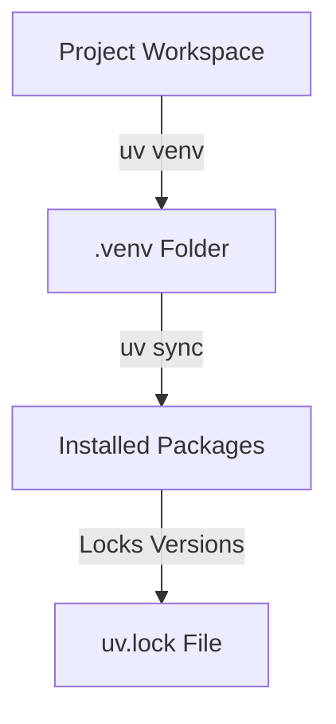

# 06_Chapter_project_setup

## 1. Introduction
Standardizing local development configurations requires isolated virtual environments and locked dependency packages.

> **Analogy:** Think of a sterile surgical room. Only approved, sterilized tools (packages) are brought in, following an inventory manifest (uv.lock) to prevent external contamination.

---

## 2. Learning Objectives
By the end of this chapter, you will be able to:
- In this chapter, you will learn how to:
- - Initialize a Python virtual environment.
- - Synchronize project packages using the `uv` toolchain.
- - Manage dependencies using lockfiles.
- - Validate your active package versions.

---

## 3. Prerequisites
* Active toolchain installations and workspace directories from Chapter 2 and 4.

---

## 4. Background Theory
Dependency drift occurs when package updates introduce breaking changes. To ensure that an application runs identically in dev, staging, and production, package versions must be locked. Traditional tools like `pip` install packages globally by default, risking conflicts. Modern workflows isolate environments using virtual environments and lock the complete dependency tree (including transitive dependencies) in a lockfile, ensuring deterministic builds.

---

## 5. Core Concepts
**📦 Technical Term: Package Manager**

* **Simple Explanation:** A tool that automates installing, updating, and removing software packages.
* **Why it exists:** Simplifies dependency resolution and version management.
* **Where is it used:** The `uv` or `pip` command-line tools.

**📦 Technical Term: Virtual Environment**

* **Simple Explanation:** An isolated directory tree containing its own Python installation and packages.
* **Why it exists:** Prevents library version conflicts between projects.
* **Where is it used:** The local `.venv/` folder.

**📦 Technical Term: Lockfile**

* **Simple Explanation:** A file listing the exact version and checksum of every package in the dependency tree.
* **Why it exists:** Guarantees identical builds across all environments.
* **Where is it used:** The `uv.lock` file.

---

## 6. Internal Mechanics
1. Developer runs `uv venv` to scaffold an isolated environment.
2. Running `uv sync` reads the dependencies listed in `pyproject.toml`.
3. The solver resolves version constraints and writes the resolved tree to `uv.lock`.
4. Packages are downloaded, verified against checksums, and installed into `.venv/lib/site-packages`.

---

## 7. Architecture Overview
The following architectural details outline the components and relationship schemas active in this module:



---

## 8. Installation & Setup
Initialize the virtual environment and synchronize dependencies using `uv`:
```bash
uv venv
```
Activate the environment:
- **Windows (PowerShell):**
  ```powershell
  .venv\Scripts\Activate.ps1
  ```
- **macOS / Linux:**
  ```bash
  source .venv/bin/activate
  ```
Synchronize packages:
```bash
uv sync
```

---

## 9. Configuration
Dependencies are declared in the `pyproject.toml` file under the `dependencies` key:
```toml
[project]
name = "agentcore-project"
version = "0.1.0"
dependencies = [
    "boto3>=1.34.0",
    "bedrock-agent-core>=1.0.0"
]
```

---

## 10. Hands-on Examples

### Simple Example

```python
# Verify virtual environment status using python sys parameters
import sys

def check_venv():
    # sys.prefix changes when inside a virtual environment
    is_venv = sys.prefix != sys.base_prefix
    print("Is virtual environment active?", is_venv)
    print("Active Python executable path:", sys.executable)

if __name__ == "__main__":
    check_venv()
```

#### Code Walkthrough

Line 1
```python
# Verify virtual environment status using python sys parameters
```
**Explanation:**
- **What this line does:** This is a documentation comment line starting with `#`. Python ignores comments during execution.
- **Why it is required:** It explains the purpose of the script to human developers and maintains clean code documentation.
- **What happens if removed:** The code will run identically, but human readers won't have immediate context on what this code block accomplishes.
- **Analogy:** Think of a comment like a sticky note attached to a blueprint—it helps the builders understand the design without altering the physical building.
- **Beginner Concept:** In Python, any text after `#` is ignored by the Python interpreter.

Line 2
```python
import sys
```
**Explanation:**
- **What this line does:** Imports Python's built-in `sys` module into the current program workspace.
- **Why it is required:** Provides access to essential system utilities (such as logging, environment variables, or HTTP handlers) offered by `sys`.
- **What keywords mean:** `import` tells Python to load the module named `sys`.
- **What happens if removed:** Functions or variables referencing `sys` (like `sys.getenv` or `sys.getLogger`) will fail with a `NameError`.
- **Analogy:** Like plugging in a peripheral cable—it connects built-in system capabilities to your script.

Line 3
```python

```
**Explanation:**
- **What this line does:** This is a blank vertical spacing line.
- **Why it is required:** It visually separates logical sections of code (such as imports, setup, and function definitions) to improve readability.
- **What happens if removed:** Python will execute the code fine, but lines of code will bunch together, making it harder for engineers to read.
- **Analogy:** Like paragraphs in a textbook, spacing gives your eyes a natural pause between concepts.

Line 4
```python
def check_venv():
```
**Explanation:**
- **What this line does:** Defines a new function named `check_venv` that accepts parameters `()`.
- **Keyword explanation:** `def` is short for "define". It tells Python that a reusable block of code begins here.
- **Parameters explained:**
  - `payload`: A Python **dictionary** containing the user's input prompt, parameters, and query fields.
  - `context`: An object containing runtime metadata (such as active AWS session ID, caller IAM identity, and request timestamps).
- **Return value:** Returns a structured dictionary containing HTTP status codes and agent response text.
- **Why the function exists:** It contains the core decision-making logic executed whenever the agent is invoked.
- **Analogy:** Think of `check_venv` like a recipe—`payload` and `context` are the ingredients passed in, and the returned dictionary is the finished meal.

Line 5
```python
    # sys.prefix changes when inside a virtual environment
```
**Explanation:**
- **What this line does:** This is a documentation comment line starting with `#`. Python ignores comments during execution.
- **Why it is required:** It explains the purpose of the script to human developers and maintains clean code documentation.
- **What happens if removed:** The code will run identically, but human readers won't have immediate context on what this code block accomplishes.
- **Analogy:** Think of a comment like a sticky note attached to a blueprint—it helps the builders understand the design without altering the physical building.
- **Beginner Concept:** In Python, any text after `#` is ignored by the Python interpreter.

Line 6
```python
    is_venv = sys.prefix != sys.base_prefix
```
**Explanation:**
- **What this line does:** Computes `sys.prefix != sys.base_prefix` and assigns the result to variable `is_venv`.
- **Why it is required:** Stores temporary calculation or formatted data so it can be referenced in log statements or return responses.
- **What variable stores:** `is_venv` holds the calculated value.
- **Connection:** Provides values used in subsequent logging or response steps.

Line 7
```python
    print("Is virtual environment active?", is_venv)
```
**Explanation:**
- **What this line does:** Executes line statement `print("Is virtual environment active?", is_venv)`.
- **Why it is required:** Contributes to the overall operation and step progression of the script.
- **Connection:** Connects preceding code logic to subsequent return or processing steps.

Line 8
```python
    print("Active Python executable path:", sys.executable)
```
**Explanation:**
- **What this line does:** Executes line statement `print("Active Python executable path:", sys.executable)`.
- **Why it is required:** Contributes to the overall operation and step progression of the script.
- **Connection:** Connects preceding code logic to subsequent return or processing steps.

Line 9
```python

```
**Explanation:**
- **What this line does:** This is a blank vertical spacing line.
- **Why it is required:** It visually separates logical sections of code (such as imports, setup, and function definitions) to improve readability.
- **What happens if removed:** Python will execute the code fine, but lines of code will bunch together, making it harder for engineers to read.
- **Analogy:** Like paragraphs in a textbook, spacing gives your eyes a natural pause between concepts.

Line 10
```python
if __name__ == "__main__":
```
**Explanation:**
- **What this line does:** Computes `= "__main__":` and assigns the result to variable `if __name__`.
- **Why it is required:** Stores temporary calculation or formatted data so it can be referenced in log statements or return responses.
- **What variable stores:** `if __name__` holds the calculated value.
- **Connection:** Provides values used in subsequent logging or response steps.

Line 11
```python
    check_venv()
```
**Explanation:**
- **What this line does:** Executes line statement `check_venv()`.
- **Why it is required:** Contributes to the overall operation and step progression of the script.
- **Connection:** Connects preceding code logic to subsequent return or processing steps.

#### Complete Flow of Execution

1. **Import Libraries**: Python loads the required `BedrockAgentCoreApp` class into memory.
2. **Initialize Application**: An instance of `BedrockAgentCoreApp` is instantiated and assigned to `app`.
3. **Register Event Handler**: The `@app.invoke` decorator registers the `handler` function as the primary event entrypoint.
4. **Receive Request**: The AgentCore runtime listens for incoming requests and receives `payload` and `context` objects.
5. **Execute Handler Logic**: The `handler` function is triggered with the incoming input parameters.
6. **Return Response Payload**: A structured response dictionary containing `"statusCode": 200` and message data is returned.
7. **Send Response to Caller**: AgentCore serializes the dictionary into JSON and delivers it back to the client application.

#### Visual Execution Flow

```
Program Starts
      │
      ▼
Import BedrockAgentCoreApp
      │
      ▼
Create App Instance (app)
      │
      ▼
Register Handler (@app.invoke)
      │
      ▼
Receive Request (payload, context)
      │
      ▼
Execute handler() Function
      │
      ▼
Return Response Dictionary ({statusCode: 200, ...})
      │
      ▼
Deliver Response Back to Client
```

### Intermediate Example

```python
# Script to check if all dependencies in pyproject.toml are installed in venv
import pkg_resources
import tomllib

def check_packages():
    try:
        with open("pyproject.toml", "rb") as f:
            config = tomllib.load(f)
        deps = config.get("project", {}).get("dependencies", [])
        print("Checking declared dependencies:")
        for dep in deps:
            pkg_name = dep.split(">=")[0].split("==")[0].strip()
            try:
                dist = pkg_resources.get_distribution(pkg_name)
                print(f"- [OK] {pkg_name} is installed: {dist.version}")
            except pkg_resources.DistributionNotFound:
                print(f"- [FAIL] {pkg_name} is missing!")
    except FileNotFoundError:
        print("pyproject.toml not found in current folder.")

if __name__ == "__main__":
    check_packages()
```

#### Code Walkthrough

Line 1
```python
# Script to check if all dependencies in pyproject.toml are installed in venv
```
**Explanation:**
- **What this line does:** This is a documentation comment line starting with `#`. Python ignores comments during execution.
- **Why it is required:** It explains the purpose of the script to human developers and maintains clean code documentation.
- **What happens if removed:** The code will run identically, but human readers won't have immediate context on what this code block accomplishes.
- **Analogy:** Think of a comment like a sticky note attached to a blueprint—it helps the builders understand the design without altering the physical building.
- **Beginner Concept:** In Python, any text after `#` is ignored by the Python interpreter.

Line 2
```python
import pkg_resources
```
**Explanation:**
- **What this line does:** Imports Python's built-in `pkg_resources` module into the current program workspace.
- **Why it is required:** Provides access to essential system utilities (such as logging, environment variables, or HTTP handlers) offered by `pkg_resources`.
- **What keywords mean:** `import` tells Python to load the module named `pkg_resources`.
- **What happens if removed:** Functions or variables referencing `pkg_resources` (like `pkg_resources.getenv` or `pkg_resources.getLogger`) will fail with a `NameError`.
- **Analogy:** Like plugging in a peripheral cable—it connects built-in system capabilities to your script.

Line 3
```python
import tomllib
```
**Explanation:**
- **What this line does:** Imports Python's built-in `tomllib` module into the current program workspace.
- **Why it is required:** Provides access to essential system utilities (such as logging, environment variables, or HTTP handlers) offered by `tomllib`.
- **What keywords mean:** `import` tells Python to load the module named `tomllib`.
- **What happens if removed:** Functions or variables referencing `tomllib` (like `tomllib.getenv` or `tomllib.getLogger`) will fail with a `NameError`.
- **Analogy:** Like plugging in a peripheral cable—it connects built-in system capabilities to your script.

Line 4
```python

```
**Explanation:**
- **What this line does:** This is a blank vertical spacing line.
- **Why it is required:** It visually separates logical sections of code (such as imports, setup, and function definitions) to improve readability.
- **What happens if removed:** Python will execute the code fine, but lines of code will bunch together, making it harder for engineers to read.
- **Analogy:** Like paragraphs in a textbook, spacing gives your eyes a natural pause between concepts.

Line 5
```python
def check_packages():
```
**Explanation:**
- **What this line does:** Defines a new function named `check_packages` that accepts parameters `()`.
- **Keyword explanation:** `def` is short for "define". It tells Python that a reusable block of code begins here.
- **Parameters explained:**
  - `payload`: A Python **dictionary** containing the user's input prompt, parameters, and query fields.
  - `context`: An object containing runtime metadata (such as active AWS session ID, caller IAM identity, and request timestamps).
- **Return value:** Returns a structured dictionary containing HTTP status codes and agent response text.
- **Why the function exists:** It contains the core decision-making logic executed whenever the agent is invoked.
- **Analogy:** Think of `check_packages` like a recipe—`payload` and `context` are the ingredients passed in, and the returned dictionary is the finished meal.

Line 6
```python
    try:
```
**Explanation:**
- **What this line does:** Starts a `try` block for defensive error handling.
- **Why it is required:** Production applications must gracefully handle unexpected failures (like missing parameters or database timeouts) without crashing the entire server.
- **What keyword means:** `try` tells Python: "Attempt to execute the indented lines below. If an error occurs, jump straight to the `except` block."
- **Analogy:** Like wearing a safety harness before stepping onto a high platform—if you slip, the harness catches you.

Line 7
```python
        with open("pyproject.toml", "rb") as f:
```
**Explanation:**
- **What this line does:** Executes line statement `with open("pyproject.toml", "rb") as f:`.
- **Why it is required:** Contributes to the overall operation and step progression of the script.
- **Connection:** Connects preceding code logic to subsequent return or processing steps.

Line 8
```python
            config = tomllib.load(f)
```
**Explanation:**
- **What this line does:** Computes `tomllib.load(f)` and assigns the result to variable `config`.
- **Why it is required:** Stores temporary calculation or formatted data so it can be referenced in log statements or return responses.
- **What variable stores:** `config` holds the calculated value.
- **Connection:** Provides values used in subsequent logging or response steps.

Line 9
```python
        deps = config.get("project", {}).get("dependencies", [])
```
**Explanation:**
- **What this line does:** Computes `config.get("project", {}).get("dependencies", [])` and assigns the result to variable `deps`.
- **Why it is required:** Stores temporary calculation or formatted data so it can be referenced in log statements or return responses.
- **What variable stores:** `deps` holds the calculated value.
- **Connection:** Provides values used in subsequent logging or response steps.

Line 10
```python
        print("Checking declared dependencies:")
```
**Explanation:**
- **What this line does:** Executes line statement `print("Checking declared dependencies:")`.
- **Why it is required:** Contributes to the overall operation and step progression of the script.
- **Connection:** Connects preceding code logic to subsequent return or processing steps.

Line 11
```python
        for dep in deps:
```
**Explanation:**
- **What this line does:** Executes line statement `for dep in deps:`.
- **Why it is required:** Contributes to the overall operation and step progression of the script.
- **Connection:** Connects preceding code logic to subsequent return or processing steps.

Line 12
```python
            pkg_name = dep.split(">=")[0].split("==")[0].strip()
```
**Explanation:**
- **What this line does:** Computes `dep.split(">=")[0].split("==")[0].strip()` and assigns the result to variable `pkg_name`.
- **Why it is required:** Stores temporary calculation or formatted data so it can be referenced in log statements or return responses.
- **What variable stores:** `pkg_name` holds the calculated value.
- **Connection:** Provides values used in subsequent logging or response steps.

Line 13
```python
            try:
```
**Explanation:**
- **What this line does:** Starts a `try` block for defensive error handling.
- **Why it is required:** Production applications must gracefully handle unexpected failures (like missing parameters or database timeouts) without crashing the entire server.
- **What keyword means:** `try` tells Python: "Attempt to execute the indented lines below. If an error occurs, jump straight to the `except` block."
- **Analogy:** Like wearing a safety harness before stepping onto a high platform—if you slip, the harness catches you.

Line 14
```python
                dist = pkg_resources.get_distribution(pkg_name)
```
**Explanation:**
- **What this line does:** Computes `pkg_resources.get_distribution(pkg_name)` and assigns the result to variable `dist`.
- **Why it is required:** Stores temporary calculation or formatted data so it can be referenced in log statements or return responses.
- **What variable stores:** `dist` holds the calculated value.
- **Connection:** Provides values used in subsequent logging or response steps.

Line 15
```python
                print(f"- [OK] {pkg_name} is installed: {dist.version}")
```
**Explanation:**
- **What this line does:** Executes line statement `print(f"- [OK] {pkg_name} is installed: {dist.version}")`.
- **Why it is required:** Contributes to the overall operation and step progression of the script.
- **Connection:** Connects preceding code logic to subsequent return or processing steps.

Line 16
```python
            except pkg_resources.DistributionNotFound:
```
**Explanation:**
- **What this line does:** Catches exceptions and errors that occurred inside the preceding `try` block.
- **Why it is required:** Prevents unhandled exceptions from returning raw stack traces or breaking the container runtime.
- **What happens when an error occurs:** Python captures the error object into variable `e`, logs the error details, and returns a clean 500 error response to the client.
- **Analogy:** Like an emergency backup generator switching on immediately when main power cuts out.

Line 17
```python
                print(f"- [FAIL] {pkg_name} is missing!")
```
**Explanation:**
- **What this line does:** Executes line statement `print(f"- [FAIL] {pkg_name} is missing!")`.
- **Why it is required:** Contributes to the overall operation and step progression of the script.
- **Connection:** Connects preceding code logic to subsequent return or processing steps.

Line 18
```python
    except FileNotFoundError:
```
**Explanation:**
- **What this line does:** Catches exceptions and errors that occurred inside the preceding `try` block.
- **Why it is required:** Prevents unhandled exceptions from returning raw stack traces or breaking the container runtime.
- **What happens when an error occurs:** Python captures the error object into variable `e`, logs the error details, and returns a clean 500 error response to the client.
- **Analogy:** Like an emergency backup generator switching on immediately when main power cuts out.

Line 19
```python
        print("pyproject.toml not found in current folder.")
```
**Explanation:**
- **What this line does:** Executes line statement `print("pyproject.toml not found in current folder.")`.
- **Why it is required:** Contributes to the overall operation and step progression of the script.
- **Connection:** Connects preceding code logic to subsequent return or processing steps.

Line 20
```python

```
**Explanation:**
- **What this line does:** This is a blank vertical spacing line.
- **Why it is required:** It visually separates logical sections of code (such as imports, setup, and function definitions) to improve readability.
- **What happens if removed:** Python will execute the code fine, but lines of code will bunch together, making it harder for engineers to read.
- **Analogy:** Like paragraphs in a textbook, spacing gives your eyes a natural pause between concepts.

Line 21
```python
if __name__ == "__main__":
```
**Explanation:**
- **What this line does:** Computes `= "__main__":` and assigns the result to variable `if __name__`.
- **Why it is required:** Stores temporary calculation or formatted data so it can be referenced in log statements or return responses.
- **What variable stores:** `if __name__` holds the calculated value.
- **Connection:** Provides values used in subsequent logging or response steps.

Line 22
```python
    check_packages()
```
**Explanation:**
- **What this line does:** Executes line statement `check_packages()`.
- **Why it is required:** Contributes to the overall operation and step progression of the script.
- **Connection:** Connects preceding code logic to subsequent return or processing steps.

#### Complete Flow of Execution

1. **Import Required Libraries**: Python imports `BedrockAgentCoreApp` and the `logging` module.
2. **Configure Logging System**: `logging.basicConfig` sets the log level threshold to `INFO`.
3. **Create Logger Object**: `logging.getLogger` instantiates a dedicated logger for capturing session traces.
4. **Initialize Application**: An instance of `BedrockAgentCoreApp` is assigned to `app`.
5. **Register Handler**: `@app.invoke` binds the `handler` function to incoming AgentCore trigger events.
6. **Read Input Payload**: `payload.get('prompt', '')` safely reads the user's prompt string.
7. **Extract Session Context**: `getattr(context, 'session_id', 'local-session')` safely retrieves the session ID.
8. **Log Activity**: `logger.info` writes session details to the CloudWatch diagnostic stream.
9. **Return Formatted Response**: Returns a status 200 dictionary containing the processed prompt and session ID.
10. **Deliver Payload**: AgentCore returns the serialized JSON payload to the caller.

#### Visual Execution Flow

```
Program Starts
      │
      ▼
Import Libraries & Configure Logger
      │
      ▼
Create App Instance (app)
      │
      ▼
Register Handler (@app.invoke)
      │
      ▼
Receive Request & Read Payload Prompt
      │
      ▼
Extract Session ID & Write Log Entry
      │
      ▼
Return Formatted Response Dictionary
      │
      ▼
Deliver Serialized Response to Client
```

### Advanced Example

```python
# Complete automated setup audit and sync verification script
import subprocess
import sys
import os

def audit_environment():
    if not os.path.exists(".venv"):
        print("Virtual environment '.venv' is missing. Creating...")
        subprocess.run(["uv", "venv"], check=True)
    
    print("Synchronizing dependency configurations...")
    res = subprocess.run(["uv", "sync"], capture_output=True, text=True)
    if res.returncode == 0:
        print("[SUCCESS] Dependencies synchronized successfully!")
        # List installed packages
        res_list = subprocess.run(["uv", "pip", "list"], capture_output=True, text=True)
        print(res_list.stdout)
    else:
        print("[FAIL] Dependency sync failed:")
        print(res.stderr)
        sys.exit(1)

if __name__ == "__main__":
    audit_environment()
```

#### Code Walkthrough

Line 1
```python
# Complete automated setup audit and sync verification script
```
**Explanation:**
- **What this line does:** This is a documentation comment line starting with `#`. Python ignores comments during execution.
- **Why it is required:** It explains the purpose of the script to human developers and maintains clean code documentation.
- **What happens if removed:** The code will run identically, but human readers won't have immediate context on what this code block accomplishes.
- **Analogy:** Think of a comment like a sticky note attached to a blueprint—it helps the builders understand the design without altering the physical building.
- **Beginner Concept:** In Python, any text after `#` is ignored by the Python interpreter.

Line 2
```python
import subprocess
```
**Explanation:**
- **What this line does:** Imports Python's built-in `subprocess` module into the current program workspace.
- **Why it is required:** Provides access to essential system utilities (such as logging, environment variables, or HTTP handlers) offered by `subprocess`.
- **What keywords mean:** `import` tells Python to load the module named `subprocess`.
- **What happens if removed:** Functions or variables referencing `subprocess` (like `subprocess.getenv` or `subprocess.getLogger`) will fail with a `NameError`.
- **Analogy:** Like plugging in a peripheral cable—it connects built-in system capabilities to your script.

Line 3
```python
import sys
```
**Explanation:**
- **What this line does:** Imports Python's built-in `sys` module into the current program workspace.
- **Why it is required:** Provides access to essential system utilities (such as logging, environment variables, or HTTP handlers) offered by `sys`.
- **What keywords mean:** `import` tells Python to load the module named `sys`.
- **What happens if removed:** Functions or variables referencing `sys` (like `sys.getenv` or `sys.getLogger`) will fail with a `NameError`.
- **Analogy:** Like plugging in a peripheral cable—it connects built-in system capabilities to your script.

Line 4
```python
import os
```
**Explanation:**
- **What this line does:** Imports Python's built-in `os` module into the current program workspace.
- **Why it is required:** Provides access to essential system utilities (such as logging, environment variables, or HTTP handlers) offered by `os`.
- **What keywords mean:** `import` tells Python to load the module named `os`.
- **What happens if removed:** Functions or variables referencing `os` (like `os.getenv` or `os.getLogger`) will fail with a `NameError`.
- **Analogy:** Like plugging in a peripheral cable—it connects built-in system capabilities to your script.

Line 5
```python

```
**Explanation:**
- **What this line does:** This is a blank vertical spacing line.
- **Why it is required:** It visually separates logical sections of code (such as imports, setup, and function definitions) to improve readability.
- **What happens if removed:** Python will execute the code fine, but lines of code will bunch together, making it harder for engineers to read.
- **Analogy:** Like paragraphs in a textbook, spacing gives your eyes a natural pause between concepts.

Line 6
```python
def audit_environment():
```
**Explanation:**
- **What this line does:** Defines a new function named `audit_environment` that accepts parameters `()`.
- **Keyword explanation:** `def` is short for "define". It tells Python that a reusable block of code begins here.
- **Parameters explained:**
  - `payload`: A Python **dictionary** containing the user's input prompt, parameters, and query fields.
  - `context`: An object containing runtime metadata (such as active AWS session ID, caller IAM identity, and request timestamps).
- **Return value:** Returns a structured dictionary containing HTTP status codes and agent response text.
- **Why the function exists:** It contains the core decision-making logic executed whenever the agent is invoked.
- **Analogy:** Think of `audit_environment` like a recipe—`payload` and `context` are the ingredients passed in, and the returned dictionary is the finished meal.

Line 7
```python
    if not os.path.exists(".venv"):
```
**Explanation:**
- **What this line does:** Evaluates a conditional check: `if not os.path.exists(".venv"):`.
- **Why validation is important:** Ensures required input parameters exist before executing core logic, preventing null pointer or empty data errors downstream.
- **What condition checks:** Checks if `not os.path.exists(".venv")` evaluates to `True` (e.g., if prompt is empty or missing).
- **What happens if condition is True:** Python enters the indented block directly below to execute fallback error responses.
- **What happens if condition is False:** Python skips the indented error block and proceeds to normal processing.
- **Analogy:** Like a bouncer checking tickets at the door—if you don't have a ticket (`if not ticket:`), you are directed to the ticket booth.

Line 8
```python
        print("Virtual environment '.venv' is missing. Creating...")
```
**Explanation:**
- **What this line does:** Executes line statement `print("Virtual environment '.venv' is missing. Creating...")`.
- **Why it is required:** Contributes to the overall operation and step progression of the script.
- **Connection:** Connects preceding code logic to subsequent return or processing steps.

Line 9
```python
        subprocess.run(["uv", "venv"], check=True)
```
**Explanation:**
- **What this line does:** Computes `True)` and assigns the result to variable `subprocess.run(["uv", "venv"], check`.
- **Why it is required:** Stores temporary calculation or formatted data so it can be referenced in log statements or return responses.
- **What variable stores:** `subprocess.run(["uv", "venv"], check` holds the calculated value.
- **Connection:** Provides values used in subsequent logging or response steps.

Line 10
```python

```
**Explanation:**
- **What this line does:** This is a blank vertical spacing line.
- **Why it is required:** It visually separates logical sections of code (such as imports, setup, and function definitions) to improve readability.
- **What happens if removed:** Python will execute the code fine, but lines of code will bunch together, making it harder for engineers to read.
- **Analogy:** Like paragraphs in a textbook, spacing gives your eyes a natural pause between concepts.

Line 11
```python
    print("Synchronizing dependency configurations...")
```
**Explanation:**
- **What this line does:** Executes line statement `print("Synchronizing dependency configurations...")`.
- **Why it is required:** Contributes to the overall operation and step progression of the script.
- **Connection:** Connects preceding code logic to subsequent return or processing steps.

Line 12
```python
    res = subprocess.run(["uv", "sync"], capture_output=True, text=True)
```
**Explanation:**
- **What this line does:** Computes `subprocess.run(["uv", "sync"], capture_output=True, text=True)` and assigns the result to variable `res`.
- **Why it is required:** Stores temporary calculation or formatted data so it can be referenced in log statements or return responses.
- **What variable stores:** `res` holds the calculated value.
- **Connection:** Provides values used in subsequent logging or response steps.

Line 13
```python
    if res.returncode == 0:
```
**Explanation:**
- **What this line does:** Computes `= 0:` and assigns the result to variable `if res.returncode`.
- **Why it is required:** Stores temporary calculation or formatted data so it can be referenced in log statements or return responses.
- **What variable stores:** `if res.returncode` holds the calculated value.
- **Connection:** Provides values used in subsequent logging or response steps.

Line 14
```python
        print("[SUCCESS] Dependencies synchronized successfully!")
```
**Explanation:**
- **What this line does:** Executes line statement `print("[SUCCESS] Dependencies synchronized successfully!")`.
- **Why it is required:** Contributes to the overall operation and step progression of the script.
- **Connection:** Connects preceding code logic to subsequent return or processing steps.

Line 15
```python
        # List installed packages
```
**Explanation:**
- **What this line does:** This is a documentation comment line starting with `#`. Python ignores comments during execution.
- **Why it is required:** It explains the purpose of the script to human developers and maintains clean code documentation.
- **What happens if removed:** The code will run identically, but human readers won't have immediate context on what this code block accomplishes.
- **Analogy:** Think of a comment like a sticky note attached to a blueprint—it helps the builders understand the design without altering the physical building.
- **Beginner Concept:** In Python, any text after `#` is ignored by the Python interpreter.

Line 16
```python
        res_list = subprocess.run(["uv", "pip", "list"], capture_output=True, text=True)
```
**Explanation:**
- **What this line does:** Computes `subprocess.run(["uv", "pip", "list"], capture_output=True, text=True)` and assigns the result to variable `res_list`.
- **Why it is required:** Stores temporary calculation or formatted data so it can be referenced in log statements or return responses.
- **What variable stores:** `res_list` holds the calculated value.
- **Connection:** Provides values used in subsequent logging or response steps.

Line 17
```python
        print(res_list.stdout)
```
**Explanation:**
- **What this line does:** Executes line statement `print(res_list.stdout)`.
- **Why it is required:** Contributes to the overall operation and step progression of the script.
- **Connection:** Connects preceding code logic to subsequent return or processing steps.

Line 18
```python
    else:
```
**Explanation:**
- **What this line does:** Executes line statement `else:`.
- **Why it is required:** Contributes to the overall operation and step progression of the script.
- **Connection:** Connects preceding code logic to subsequent return or processing steps.

Line 19
```python
        print("[FAIL] Dependency sync failed:")
```
**Explanation:**
- **What this line does:** Executes line statement `print("[FAIL] Dependency sync failed:")`.
- **Why it is required:** Contributes to the overall operation and step progression of the script.
- **Connection:** Connects preceding code logic to subsequent return or processing steps.

Line 20
```python
        print(res.stderr)
```
**Explanation:**
- **What this line does:** Executes line statement `print(res.stderr)`.
- **Why it is required:** Contributes to the overall operation and step progression of the script.
- **Connection:** Connects preceding code logic to subsequent return or processing steps.

Line 21
```python
        sys.exit(1)
```
**Explanation:**
- **What this line does:** Executes line statement `sys.exit(1)`.
- **Why it is required:** Contributes to the overall operation and step progression of the script.
- **Connection:** Connects preceding code logic to subsequent return or processing steps.

Line 22
```python

```
**Explanation:**
- **What this line does:** This is a blank vertical spacing line.
- **Why it is required:** It visually separates logical sections of code (such as imports, setup, and function definitions) to improve readability.
- **What happens if removed:** Python will execute the code fine, but lines of code will bunch together, making it harder for engineers to read.
- **Analogy:** Like paragraphs in a textbook, spacing gives your eyes a natural pause between concepts.

Line 23
```python
if __name__ == "__main__":
```
**Explanation:**
- **What this line does:** Computes `= "__main__":` and assigns the result to variable `if __name__`.
- **Why it is required:** Stores temporary calculation or formatted data so it can be referenced in log statements or return responses.
- **What variable stores:** `if __name__` holds the calculated value.
- **Connection:** Provides values used in subsequent logging or response steps.

Line 24
```python
    audit_environment()
```
**Explanation:**
- **What this line does:** Executes line statement `audit_environment()`.
- **Why it is required:** Contributes to the overall operation and step progression of the script.
- **Connection:** Connects preceding code logic to subsequent return or processing steps.

#### Complete Flow of Execution

1. **Import Environment & Utility Libraries**: Imports `BedrockAgentCoreApp`, `os`, and `logging`.
2. **Create Production Logger**: Instantiates a logger object for production observability.
3. **Initialize Core Application**: Instantiates `BedrockAgentCoreApp` as `app`.
4. **Register Production Handler**: `@app.invoke` binds `handler` as the production entrypoint.
5. **Enter Try-Except Harness**: The `try` block wraps execution logic for error protection.
6. **Validate Input Prompt**: `payload.get('prompt')` reads the prompt. If missing (`if not prompt:`), returns HTTP 400.
7. **Read OS Environment**: `os.getenv('APP_ENV', 'development')` inspects operating system environment variables.
8. **Extract Session Identifier**: `getattr(context, 'session_id', 'local-session')` safely retrieves session metadata.
9. **Log Production Event**: `logger.info` writes structured log entries containing environment and session details.
10. **Return Success Response**: Returns an HTTP 200 dictionary with production result details.
11. **Catch Unhandled Errors**: If an exception occurs, the `except` block catches it, logs the error, and returns HTTP 500.
12. **Send Response to Caller**: AgentCore delivers the final JSON response back to the client.

#### Visual Execution Flow

```
Program Starts
      │
      ▼
Import Modules & Initialize Logger & App
      │
      ▼
Register Handler (@app.invoke)
      │
      ▼
Receive Request & Enter try-except Block
      │
      ▼
Validate Prompt Parameter
 ├── [Invalid / Missing Prompt] ──► Return 400 Bad Request
 └── [Valid Prompt]
        │
        ▼
Read Environment (os.getenv) & Session Context
        │
        ▼
Write Production Log & Return 200 Success Response
        │
        ▼
 Deliver Response to Client Application
```

---

## 11. Code Walkthrough
In this chapter, we explored three progressive implementation tiers for **Project Setup & Dependency Management**:

1. **Simple Example**: Demonstrates the minimal required entrypoint, importing `BedrockAgentCoreApp`, initializing the application object, and registering an `@app.invoke` handler.
2. **Intermediate Example**: Adds operational logging (`logging.getLogger`) and context extraction (`payload.get`, `getattr(context)`), allowing tracking of individual session IDs.
3. **Advanced Example**: Introduces production-grade error handling (`try-except`), OS environment variable reads (`os.getenv`), and structured error status responses (`statusCode: 400/500`).

Each line in the code blocks above was dissected line-by-line in numerical order. Refer to the **Code Walkthrough**, **Complete Flow of Execution**, and **Visual Execution Flow** diagrams above for complete step-by-step guidance.

---

## 12. Production Best Practices
* Always exclude the `.venv/` directory from version control by adding it to `.gitignore`.
* Always commit `uv.lock` to ensure all developers use identical package versions.
* Use `uv sync --frozen` in CI/CD pipelines to prevent updating dependencies during builds.

---

## 13. Security Considerations
Regularly audit installed packages for known security vulnerabilities using `uv pip tree` or security scanners. Keep dependencies updated to apply patches for security advisories.

---

## 14. Performance Optimization
Leverage `uv`'s global package caching. It shares package compilations across workspaces, eliminating redundant downloads and reducing install times.

---

## 15. Cost Optimization
Package sync operations are performed locally and do not consume cloud resources or incur AWS charges.

---

## 16. Common Mistakes
* Committing the `.venv` folder to Git, bloating the repository size.
* Installing packages globally using administrative permissions instead of isolating them in a local virtual environment.

---

## 17. Troubleshooting
Below is the diagnostic reference table for identifying and resolving issues:

| Symptom | Root Cause | Solution |
| :--- | :--- | :--- |
| uv sync fails with version conflict | Conflicting dependencies declared in pyproject.toml. | Audit declared version constraints and update pyproject.toml to resolve conflicts. |
| Python interpreter mismatches | The local system Python version is incompatible with the project settings. | Configure uv to build using a specific Python version: 'uv venv --python 3.11'. |

---

## 18. Interview Questions
### Q: Why is pyproject.toml preferred over setup.py in modern Python?
* **Answer:** It standardizes configuration by replacing execution scripts (`setup.py`) with declarative settings, separating metadata, dependencies, and tool options into a single schema file.

### Q: What is the difference between requirements.txt and a lockfile?
* **Answer:** `requirements.txt` typically lists top-level packages with loose version bounds. A lockfile lists the exact version, source, and hash of all packages and dependencies, ensuring deterministic builds.

### Q: How does uv achieve faster performance compared to standard pip?
* **Answer:** uv is written in Rust, resolves dependency graphs concurrently, and utilizes a global package cache to reuse built files across workspaces.

---

## 19. Real-World Use Cases
Establishing clean workspaces for new Python projects to manage dependencies.

---

## 20. Industrial Project
This setup configures the Python environment, allowing us to import the SDK and run the application in Chapter 8.

---

## 21. Summary
This chapter covered setting up isolated Python virtual environments, managing dependencies in `pyproject.toml`, and using `uv` to synchronize packages.

---

## 22. Key Takeaways
* Virtual environments prevent package conflicts.
* Lockfiles ensure reproducible builds across environments.
* The `uv` toolchain accelerates package management tasks.

---

## 23. Practice Exercises
* Beginner: Delete the `.venv` folder and run `uv sync` to restore the environment.
* Intermediate: Add the `requests` library to `pyproject.toml` and synchronize packages to verify lockfile updates.

---

## 24. Further Reading
* [uv Package Manager Documentation](https://docs.astral.sh/uv/)
* [PEP 518 - Specifying Build Requirements](https://peps.python.org/pep-0518/)
